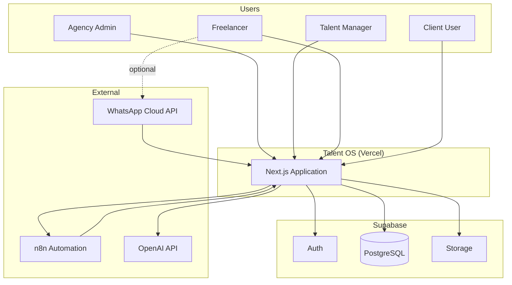
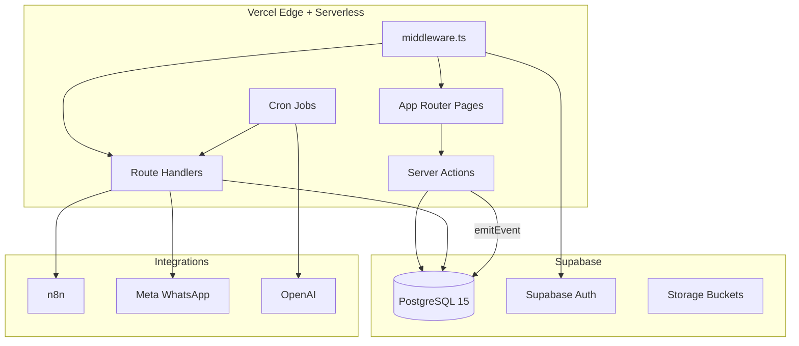
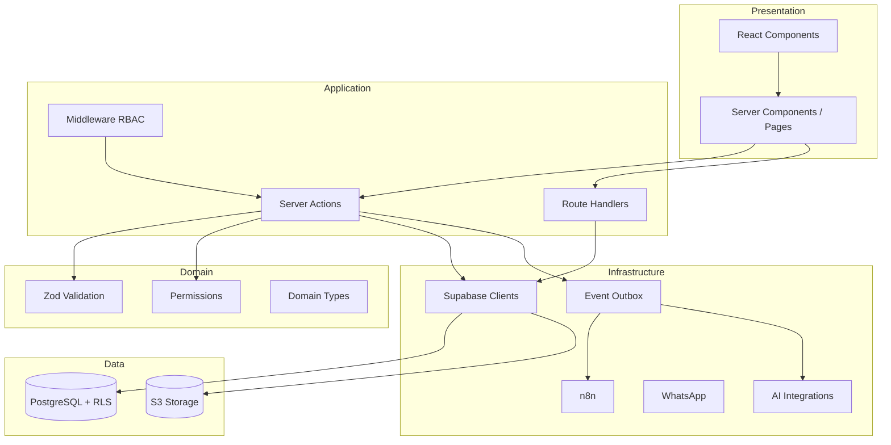
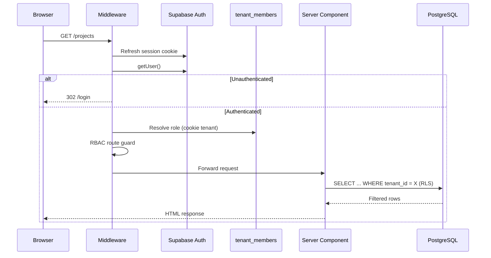
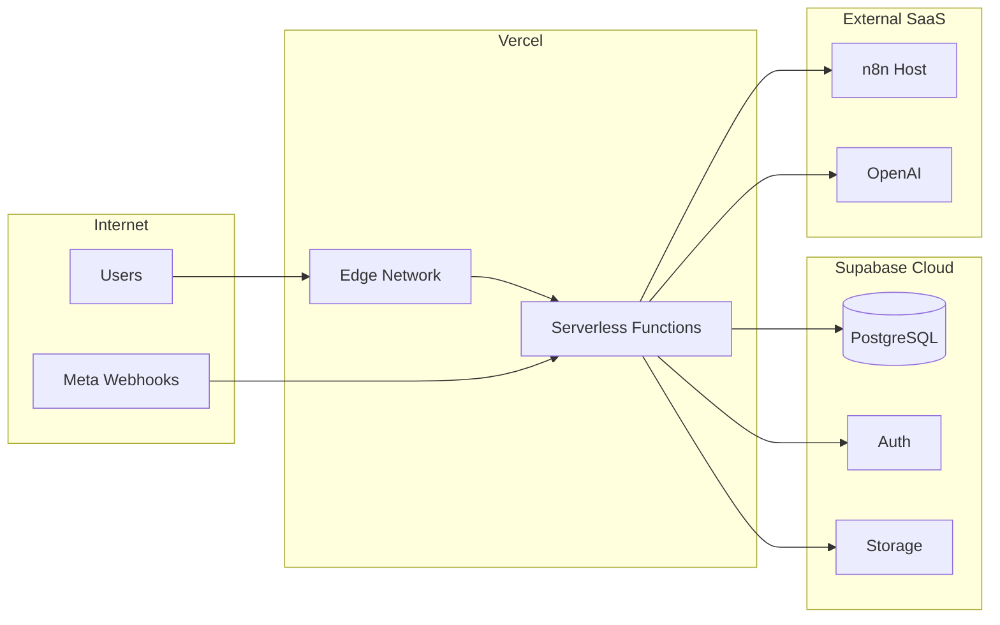

# Talent OS — Architecture

| Field | Value |
|-------|-------|
| **Version** | 1.0.0 |
| **Audit Date** | 2026-07-30 |
| **Branch** | `main` |
| **Status** | Engineering Reference |

---

## 1. Overview

Talent OS is a **multi-tenant SaaS platform** for creative agencies to manage freelance talent, broadcast opportunities, shortlist candidates, assign projects, track milestones, process payments, and run AI-assisted matching and project management.

The system follows a **modular monolith** pattern: a single Next.js 15 application on Vercel with Supabase as the backend-as-a-service layer.

---

## 2. Architectural Style

| Pattern | Implementation |
|---------|----------------|
| **Application style** | Modular monolith (Next.js App Router) |
| **Multi-tenancy** | Shared database, shared schema, `tenant_id` + RLS |
| **Communication** | Synchronous HTTP + async event outbox |
| **Integration** | Webhook gateway (WhatsApp inbound, n8n bidirectional) |
| **AI** | OpenAI via direct execution or n8n orchestration |

---

## 3. System Context (C4 Level 1)



---

## 4. Container Diagram (C4 Level 2)



---

## 5. Layered Architecture



---

## 6. Bounded Contexts

| Context | Responsibility | Key Tables |
|---------|---------------|------------|
| **Identity & Tenancy** | Auth, roles, invites | `profiles`, `tenants`, `tenant_members`, `member_invites` |
| **Talent Management** | Roster, portfolio, ratings | `freelancers`, `freelancer_portfolio_items`, `freelancer_rating_history` |
| **Opportunity Lifecycle** | Broadcast, responses, shortlist | `opportunities`, `opportunity_recipients`, `shortlists`, `shortlist_items` |
| **Project Execution** | Projects, milestones, deliverables | `projects`, `milestones` |
| **Payments** | Approval, payout tracking | `payments` |
| **Communications** | WhatsApp, email, notifications | `whatsapp_messages`, `email_logs`, `notifications` |
| **Integrations** | External provider config | `integration_configs`, `webhook_deliveries` |
| **Events & AI** | Outbox, AI governance | `domain_events`, `ai_requests`, `talent_match_scores` |
| **Clients** | End-client organizations | `companies` |

---

## 7. Request Lifecycle



---

## 8. Event-Driven Architecture

Talent OS uses a **transactional outbox** pattern via the `domain_events` table and `emit_domain_event` RPC.

```mermaid
flowchart LR
    A[Server Action] -->|emitEvent| B[(domain_events)]
    C[Vercel Cron] -->|dispatch-events| B
    B -->|AI_EXECUTION_MODE=direct| D[OpenAI Executor]
    B -->|default| E[n8n Webhook]
    E --> F[WhatsApp / Email]
    E -->|callback| G[/api/webhooks/n8n]
```

### Key Event Types (Emitted)

| Event | Trigger |
|-------|---------|
| `opportunity.broadcast` | Manager broadcasts to talent |
| `opportunity.opened` | DB trigger on status → open |
| `project.assigned` | Project created via RPC |
| `ai.match_requested` | AI match initiated |
| `ai.brief_parse_requested` | Brief parsing initiated |
| `ai.summary_requested` | Project summary requested |
| `ai.status_assessment_requested` | Risk assessment requested |
| `payment.*` | DB trigger on payment status change |

---

## 9. Multi-Tenant Isolation

| Layer | Mechanism |
|-------|-----------|
| **Database** | Row-Level Security on all tenant-scoped tables |
| **Application** | `tenant_id` from `ACTIVE_TENANT_COOKIE` + session |
| **Middleware** | Role-based route guards |
| **Server actions** | `requireTenant()` / `requireManager()` guards |
| **Service role** | Used only in cron, webhooks, AI executor (bypasses RLS) |

---

## 10. Deployment Topology



| Component | Host | Notes |
|-----------|------|-------|
| Next.js app | Vercel | Serverless, Node 20+ |
| PostgreSQL | Supabase | Project `rzjyqjwldmdldinoxgvh` |
| Auth | Supabase Auth | JWT in cookies via `@supabase/ssr` |
| Storage | Supabase Storage | `portfolio`, `deliverables` buckets |
| Automation | n8n (self-hosted or cloud) | 3 workflow exports in `/n8n` |
| AI | OpenAI API | `gpt-4o-mini` default |

---

## 11. Security Architecture Summary

| Concern | Implementation |
|---------|---------------|
| Authentication | Supabase Auth (email/password, magic link) |
| Authorization | RBAC (4 roles) + middleware + permission map |
| Tenant isolation | PostgreSQL RLS + SECURITY DEFINER helpers |
| Webhook security | HMAC-SHA256 signature verification |
| Cron security | `Bearer CRON_SECRET` header |
| Secrets | Environment variables + encrypted integration configs |
| Service role | Restricted to server-side admin client |

---

## 12. Scalability Considerations

| Bottleneck | Current State | Future Path |
|------------|---------------|-------------|
| Monolith | Single Next.js deploy | Extract AI/WhatsApp workers |
| Event dispatch | Vercel cron polling | Inngest / Trigger.dev |
| Database | Single Supabase instance | Read replicas, connection pooling |
| WhatsApp | n8n-dependent | Dedicated message queue |
| AI | Synchronous in cron batch | Async worker pool |

---

## 13. Architecture Decision Records (Summary)

| Decision | Choice | Rationale |
|----------|--------|-----------|
| Framework | Next.js 15 App Router | Full-stack TypeScript, Vercel-native |
| Database | Supabase PostgreSQL | Auth + DB + Storage + RLS in one |
| Mutations | Server Actions over REST | Simpler for dashboard-first MVP |
| Events | Transactional outbox in PG | Reliable, no extra infra |
| Automation | n8n external | Flexible workflow editing |
| AI | OpenAI direct + fallback rules | Cost-effective, graceful degradation |
| Multi-tenancy | Shared schema + RLS | Cost-efficient for SMB SaaS |

---

*See also: [02-Codebase-Overview.md](./02-Codebase-Overview.md), [10-Architecture-Diagrams.md](./10-Architecture-Diagrams.md)*
