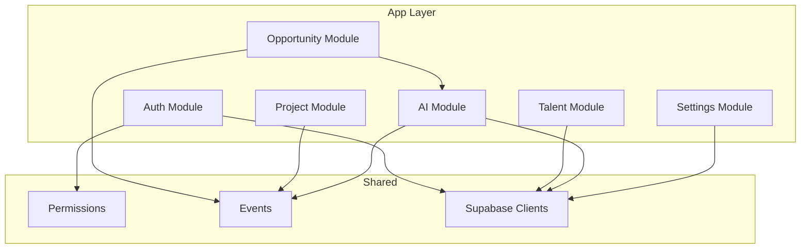
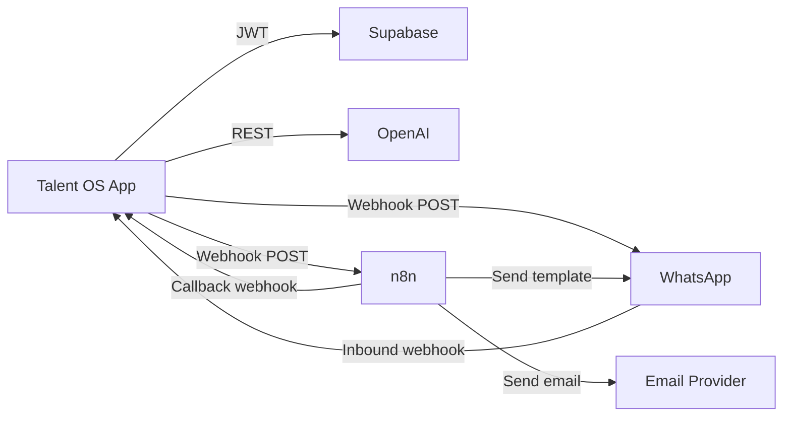

# Talent OS — Codebase Overview

| Field | Value |
|-------|-------|
| **Version** | 1.0.0 |
| **Audit Date** | 2026-07-30 |
| **Files** | 195 tracked files |
| **Source Files** | ~77 `.ts` + ~64 `.tsx` |

---

## 1. Project Summary

Talent OS (`talent-os` v0.1.0) is a TypeScript monorepo-style Next.js application with no separate backend service. All business logic lives in `app/`, `lib/`, and `components/`.

---

## 2. Technology Stack

| Layer | Technology | Version |
|-------|------------|---------|
| Runtime | Node.js | ≥ 20 |
| Framework | Next.js (App Router) | 15.1.3 |
| UI | React | 19.0.0 |
| Language | TypeScript | 5.7.2 |
| Styling | Tailwind CSS | 3.4.17 |
| Components | Radix UI + shadcn/ui | Partial |
| Database | Supabase PostgreSQL | 15 |
| Auth | Supabase Auth + `@supabase/ssr` | 0.5.2 |
| Validation | Zod | 3.24.1 |
| Charts | Recharts | 2.15.0 (installed, lightly used) |
| AI | OpenAI API | gpt-4o-mini |
| Automation | n8n webhooks | External |
| Deployment | Vercel | Serverless |

---

## 3. Module Map



---

## 4. Application Modules

### 4.1 Authentication & Tenancy

| File | Purpose |
|------|---------|
| `app/actions/auth.ts` | Signup, login, magic link, team invites |
| `lib/auth/session.ts` | Session resolution, `requireTenant()` |
| `lib/auth/guards.ts` | `requireAdmin()`, `requireManager()` |
| `lib/auth/permissions.ts` | Static RBAC permission map |
| `lib/auth/invites.ts` | Token generation, hashing, URL building |
| `lib/auth/tenant-context.ts` | Active tenant cookie resolution |
| `middleware.ts` | Session refresh + route guards |

**Capabilities:** Agency signup with tenant creation, email/password login, magic links, team invites (admin/manager/talent/client), role-based route protection.

### 4.2 Talent Management

| File | Purpose |
|------|---------|
| `app/actions/freelancers.ts` | CRUD, rating |
| `app/actions/portfolio.ts` | Portfolio item management |
| `lib/talent/queries.ts` | Search and list queries |
| `lib/talent/validation.ts` | Zod schemas |
| `components/talent/*` | Profile form, skills, filters, gallery |

**Capabilities:** Talent roster CRUD, skill tags, portfolio gallery (Supabase Storage), internal ratings with history, faceted search via RPC.

### 4.3 Opportunity Lifecycle

| File | Purpose |
|------|---------|
| `app/actions/opportunities.ts` | Create, broadcast, respond |
| `app/actions/shortlists.ts` | Shortlist management |
| `lib/shortlists/queries.ts` | Shortlist data access |
| `lib/opportunities/validation.ts` | Input validation |
| `components/opportunities/*` | Forms, broadcast, AI match, shortlist board |

**Capabilities:** Create opportunities, broadcast to selected talent, collect responses (web + WhatsApp YES/NO), shortlist board, AI matching panel.

### 4.4 Project Execution

| File | Purpose |
|------|---------|
| `app/actions/projects.ts` | Create, status updates |
| `app/actions/milestones.ts` | Submit, review, status transitions |
| `lib/projects/validation.ts` | Project + milestone validation |
| `components/projects/*` | Create form, kanban, tracker |

**Capabilities:** Atomic project creation with milestones (RPC), kanban view, milestone submission/review, status state machine.

### 4.5 AI Services

| File | Purpose |
|------|---------|
| `lib/integrations/ai/matching.ts` | Talent-opportunity matching |
| `lib/integrations/ai/brief-parse.ts` | Parse opportunity briefs |
| `lib/integrations/ai/summary.ts` | Project/shortlist summaries |
| `lib/integrations/ai/status-assessment.ts` | Project risk assessment |
| `lib/integrations/ai/governance.ts` | Rate limits, feature flags |
| `lib/integrations/ai/fallback.ts` | Rule-based matching fallback |
| `lib/integrations/ai/executor.ts` | Request type router |
| `app/actions/ai.ts` | Server action triggers |
| `app/actions/ai-pm.ts` | AI PM server actions |

**Capabilities:** OpenAI-powered matching with rule fallback, brief parsing, project summaries, status assessments, monthly request limits per tenant.

### 4.6 Integrations

| File | Purpose |
|------|---------|
| `lib/integrations/whatsapp.ts` | Meta webhook parsing, quick replies |
| `lib/integrations/n8n.ts` | Event dispatch to n8n |
| `lib/integrations/events.ts` | Domain event outbox |
| `lib/integrations/encryption.ts` | HMAC signing/verification |
| `app/api/webhooks/whatsapp/route.ts` | Inbound WhatsApp |
| `app/api/webhooks/n8n/route.ts` | n8n callbacks |

### 4.7 Companies & Clients

| File | Purpose |
|------|---------|
| `app/actions/companies.ts` | Company CRUD |
| `lib/companies/queries.ts` | Company queries |

**Capabilities:** End-client company records linked to projects/opportunities; client role with scoped read access.

---

## 5. Data Flow Patterns

### 5.1 Read Pattern (Server Components)

```typescript
// Page fetches data directly via Supabase server client
export default async function TalentPage() {
  const { tenant } = await requireTenant()
  const supabase = await createClient()
  const { data } = await supabase.from('freelancers').select('*').eq('tenant_id', tenant.id)
  return <TalentList data={data} />
}
```

### 5.2 Write Pattern (Server Actions)

```typescript
'use server'
export async function createOpportunity(input) {
  const { tenant, user } = await requireManager()
  requirePermission(tenant.role, 'opportunities:create')
  // Validate → Insert → emitEvent → revalidatePath
}
```

### 5.3 Async Pattern (Events)

```typescript
await emitEvent({
  tenantId, eventType, aggregateType, aggregateId,
  idempotencyKey, payload, actorId
})
// Processed by /api/cron/dispatch-events
```

---

## 6. User Roles & Access

| Role | DB Enum | Primary Use |
|------|---------|-------------|
| Admin | `admin` | Full workspace, billing, integrations |
| Talent Manager | `talent_manager` | Talent, opportunities, projects |
| Freelancer | `freelancer` | Respond, submit milestones, view payments |
| Client | `client` | Read company projects/opportunities |

```mermaid
flowchart TD
    ADMIN[admin] --> ALL[All routes except blocked]
    TM[talent_manager] --> OPS[Operations routes]
    FL[freelancer] --> SELF[Own projects + opportunities]
    CL[client] --> COMPANY[Company-scoped reads]

    OPS --> TALENT[/talent]
    OPS --> OPP[/opportunities]
    OPS --> PROJ[/projects]
    ALL --> SETTINGS[/settings]
    CL --> DASH[/dashboard]
    CL --> PROJ_R[/projects read]
```

---

## 7. Page Inventory

| Route | Component Type | Roles |
|-------|---------------|-------|
| `/login`, `/signup` | Client forms | Public |
| `/invite/[token]` | Client form | Public |
| `/dashboard` | Server (role-aware) | All |
| `/talent`, `/talent/[id]` | Server + client forms | Manager+ |
| `/opportunities`, `/opportunities/[id]` | Server + client panels | Manager+ / Freelancer read |
| `/opportunities/[id]/shortlist` | Server + board | Manager+ |
| `/projects`, `/projects/[id]` | Server + kanban | Manager+ / Freelancer / Client |
| `/payments` | Server table (read-only) | Manager+ / Freelancer |
| `/analytics` | Server page | Manager+ |
| `/notifications` | Server page | All |
| `/settings/*` | Server + forms | Admin (freelancer blocked) |
| `/profile` | Server page | All |

---

## 8. External Dependencies Flow



---

## 9. Configuration

Environment variables (from `.env.local.example`):

| Variable | Purpose |
|----------|---------|
| `NEXT_PUBLIC_SUPABASE_URL` | Supabase project URL |
| `NEXT_PUBLIC_SUPABASE_ANON_KEY` | Public anon key |
| `SUPABASE_SERVICE_ROLE_KEY` | Admin client (server only) |
| `NEXT_PUBLIC_APP_URL` | App base URL |
| `N8N_WEBHOOK_BASE_URL` | n8n webhook endpoint |
| `N8N_WEBHOOK_SECRET` | HMAC secret |
| `WHATSAPP_VERIFY_TOKEN` | Meta webhook verification |
| `WHATSAPP_APP_SECRET` | Meta signature verification |
| `CRON_SECRET` | Cron endpoint auth |
| `OPENAI_API_KEY` | AI features |
| `OPENAI_MODEL` | Model selection (default gpt-4o-mini) |
| `AI_EXECUTION_MODE` | `direct` or n8n (default) |

---

## 10. Code Quality Observations

| Aspect | State |
|--------|-------|
| TypeScript strictness | Enabled via `tsconfig.json` |
| Linting | ESLint + `eslint-config-next` |
| Type checking | `npm run typecheck` available |
| Tests | **None** |
| CI/CD | **None in repo** |
| Generated DB types | **Hand-maintained** (`types/database.ts`) |
| Error handling | Mixed `{ ok, error }` and thrown errors |

---

## 11. Module Completeness

| Module | Completeness | Notes |
|--------|-------------|-------|
| Auth & Tenancy | 85% | No MFA/SSO |
| Talent Database | 75% | No segments, no import UI |
| Opportunities | 65% | Broadcast works; WhatsApp partial |
| Shortlisting | 70% | Board UI functional |
| Projects | 80% | Atomic RPC, kanban |
| Milestones | 60% | No file upload UI |
| Payments | 45% | Read-only UI |
| Analytics | 40% | Views exist; charts not wired |
| AI Matching | 65% | OpenAI + fallback |
| AI PM | 55% | Summary, assessment, brief parse |
| WhatsApp | 45% | Webhook + quick reply only |
| Companies | 50% | No admin page |

---

*See also: [05-Folder-Structure.md](./05-Folder-Structure.md), [08-Technical-Debt.md](./08-Technical-Debt.md)*
