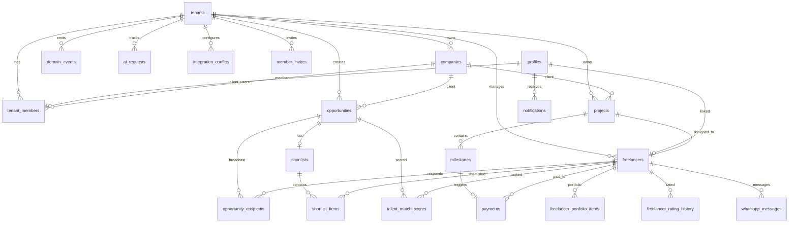
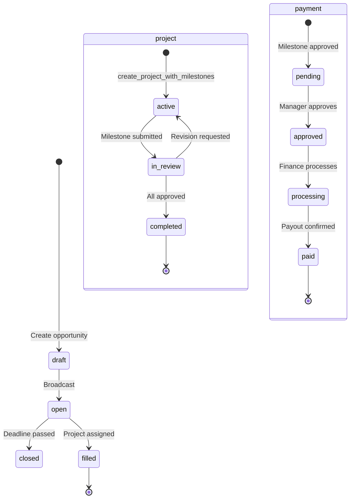

# Talent OS — Database

| Field | Value |
|-------|-------|
| **Version** | 1.0.0 |
| **Engine** | PostgreSQL 15 (Supabase) |
| **Migrations** | 001–013 |
| **Pattern** | Multi-tenant shared schema |

---

## 1. Entity Relationship Diagram

---

## 2. Table Inventory

### 2.1 Core Domain Tables

| Table | Rows Purpose | Tenant Scoped | RLS |
|-------|-------------|---------------|-----|
| `tenants` | Workspace/agency | — | Yes |
| `profiles` | User identity (extends auth.users) | — | Yes |
| `tenant_members` | RBAC membership | Yes | Yes |
| `member_invites` | Pending invitations | Yes | Yes |
| `companies` | End-client organizations | Yes | Yes |
| `freelancers` | Talent roster | Yes | Yes |
| `freelancer_portfolio_items` | Portfolio gallery | Yes | Yes |
| `freelancer_rating_history` | Rating audit trail | Yes | Yes |

### 2.2 Opportunity Lifecycle

| Table | Purpose | Key Constraints |
|-------|---------|-----------------|
| `opportunities` | Job/gig postings | `requirements` JSONB (010) |
| `opportunity_recipients` | Broadcast targets + responses | UNIQUE(opportunity_id, freelancer_id) |
| `shortlists` | One per opportunity | UNIQUE(opportunity_id) |
| `shortlist_items` | Ranked candidates | UNIQUE(shortlist_id, freelancer_id) |
| `talent_match_scores` | AI match results | UNIQUE(opportunity_id, freelancer_id) |

### 2.3 Project Execution

| Table | Purpose | Key Constraints |
|-------|---------|-----------------|
| `projects` | Assignments | Single `freelancer_id`; AI fields (010) |
| `milestones` | Deliverable/payment units | `submission_files` JSONB |
| `payments` | Payout lifecycle | UNIQUE(milestone_id) |

### 2.4 Communications & Audit

| Table | Purpose |
|-------|---------|
| `notifications` | In-app notifications |
| `whatsapp_messages` | WhatsApp message log |
| `email_logs` | Email delivery tracking |
| `activity_logs` | Lightweight activity audit |

### 2.5 Infrastructure Tables

| Table | Purpose |
|-------|---------|
| `domain_events` | Transactional outbox |
| `webhook_deliveries` | Inbound idempotency |
| `ai_requests` | AI governance + cost |
| `integration_configs` | Per-tenant provider config |

---

## 3. Enums

| Enum | Values |
|------|--------|
| `user_role` | `admin`, `talent_manager`, `freelancer`, `client` (011) |
| `member_status` | `invited`, `active`, `suspended` |
| `discipline_type` | `design`, `video`, `copy`, `motion`, `brand`, `other` |
| `availability_status` | `available`, `busy`, `unavailable` |
| `opportunity_status` | `draft`, `open`, `closed`, `filled`, `canceled` |
| `response_type` | `pending`, `interested`, `declined` |
| `shortlist_status` | `open`, `finalized`, `archived` |
| `shortlist_item_status` | `active`, `selected`, `rejected` |
| `project_status` | `draft`, `active`, `in_review`, `completed`, `archived`, `canceled` |
| `milestone_status` | `pending`, `in_progress`, `submitted`, `approved`, `revision`, `canceled` |
| `payment_status` | `pending`, `approved`, `processing`, `paid`, `disputed`, `canceled` |
| `event_status` | `pending`, `processing`, `delivered`, `failed`, `dead_letter` |
| `ai_provider` | `openai`, `claude` |
| `ai_request_status` | `pending`, `processing`, `completed`, `failed` |
| `notification_type` | 10 types (broadcast, response, milestone, payment, system) |

---

## 4. Views

| View | Purpose | Security |
|------|---------|----------|
| `users` | Canonical profile view | `security_invoker = true` (013) |
| `talent_profiles` | Canonical talent view | `security_invoker = true` (013) |
| `v_dashboard_summary` | Dashboard KPIs | Manager access |
| `v_opportunity_fill_rate` | Fill rate by month | Manager access |
| `v_freelancer_utilization` | 90-day utilization | Manager access |
| `v_payment_aging` | Payment pipeline aging | Manager access |
| `v_response_metrics` | WhatsApp response rates | Manager access |
| `v_ai_usage` | AI cost tracking | Manager access |
| `v_event_pipeline_health` | Event outbox health | Manager access |

---

## 5. Key RPC Functions

| Function | Migration | Purpose |
|----------|-----------|---------|
| `create_tenant_with_admin` | 003 | Agency signup |
| `create_project_with_milestones` | 008, 013 | Atomic project + milestones + company_id |
| `emit_domain_event` | 005 | Outbox insert with idempotency |
| `accept_member_invite` | 007, 013 | Invite acceptance + freelancer linking |
| `revoke_member_invite` | 007, 013 | Invite revocation |
| `get_invite_preview` | 007 | Public invite preview |
| `search_freelancers` | 009 | Faceted talent search |
| `link_freelancer_to_user` | 006 | Connect roster to auth user |
| `log_activity` | 003 | Activity log helper |

---

## 6. RLS Helper Functions

| Function | Returns | Used For |
|----------|---------|----------|
| `user_tenant_ids()` | Tenant IDs for current user | General tenant scoping |
| `manager_tenant_ids()` | Manager/admin tenant IDs | Write operations |
| `admin_tenant_ids()` | Admin tenant IDs | Admin-only operations |
| `user_freelancer_ids()` | Freelancer IDs for current user | Self-service scoping |
| `client_company_ids()` | Company IDs for client role | Client read scoping |
| `is_manager_of(tenant_id)` | Boolean | RPC authorization |
| `is_admin_of(tenant_id)` | Boolean | RPC authorization |
| `is_client_of(tenant_id)` | Boolean | Client access checks |
| `has_tenant_role(tenant_id, roles[])` | Boolean | Generic role check |

---

## 7. Triggers

| Trigger | Table | Action |
|---------|-------|--------|
| `trg_*_updated_at` | Most tables | Auto-update `updated_at` |
| `trg_opportunity_opened` | opportunities | Emit `opportunity.opened` event |
| `trg_payment_status_change` | payments | Emit `payment.{status}` event |
| `trg_freelancer_profile_update` | freelancers | Rating history + activity log |
| `trg_portfolio_item_tenant` | portfolio items | Enforce tenant_id |
| `trg_opportunity_company_name` | opportunities | Sync client_name from company |

---

## 8. Indexes Strategy

| Pattern | Example |
|---------|---------|
| Tenant + status | `idx_opportunities_status(tenant_id, status)` |
| Tenant + foreign key | `idx_projects_freelancer(freelancer_id)` |
| GIN for arrays | `idx_freelancers_skills USING GIN(skills)` |
| Partial indexes | `idx_milestones_due_date WHERE status NOT IN ('approved', 'canceled')` |
| Pending events | `idx_domain_events_pending WHERE status = 'pending'` |

---

## 9. Storage Buckets

| Bucket | Public | Max Size | MIME Types |
|--------|--------|----------|------------|
| `portfolio` | Yes | 10 MB | jpeg, png, webp, gif |
| `deliverables` | No | 500 MB | (from 004 migration) |

---

## 10. Migration History

| # | File | Summary |
|---|------|---------|
| 001 | `initial_schema.sql` | Core tables, enums, indexes |
| 002 | `rls_policies.sql` | RLS helpers and policies |
| 003 | `functions_triggers.sql` | RPCs, activity logging |
| 004 | `views_analytics.sql` | Analytics views, storage buckets |
| 005 | `event_infrastructure.sql` | Outbox, AI, webhooks |
| 006 | `complete_rls_and_integrity.sql` | Member invites, integrity fixes |
| 007 | `auth_invite_functions.sql` | Invite accept/revoke/preview |
| 008 | `create_project_rpc.sql` | Atomic project creation |
| 009 | `talent_portfolio_system.sql` | Portfolio, ratings, search RPC |
| 010 | `ai_pm_system.sql` | Requirements JSONB, AI summary fields |
| 011 | `add_client_role.sql` | Client role enum extension |
| 012 | `core_schema_companies_clients.sql` | Companies, views, client RLS |
| 013 | `project_workflow_fixes.sql` | Payment RLS, view security, company RPC |

---

## 11. Data Lifecycle

---

## 12. Schema Gaps (vs Full Vision)

| Missing | Impact |
|---------|--------|
| `talent_segments` | No dynamic broadcast targeting |
| `deliverables` + versions | No proper revision workflow |
| `project_assignments` (M:N) | Single talent per project only |
| `audit_logs` (immutable) | Only lightweight `activity_logs` |
| `pgvector` / embeddings | No semantic search |
| `whatsapp_consent` | No opt-in/opt-out tracking |
| `sample_assignments` | No sample-then-hire workflow |

---

*See also: [06-Supabase.md](./06-Supabase.md), [03-Database.md](./03-Database.md) (legacy schema doc)*
