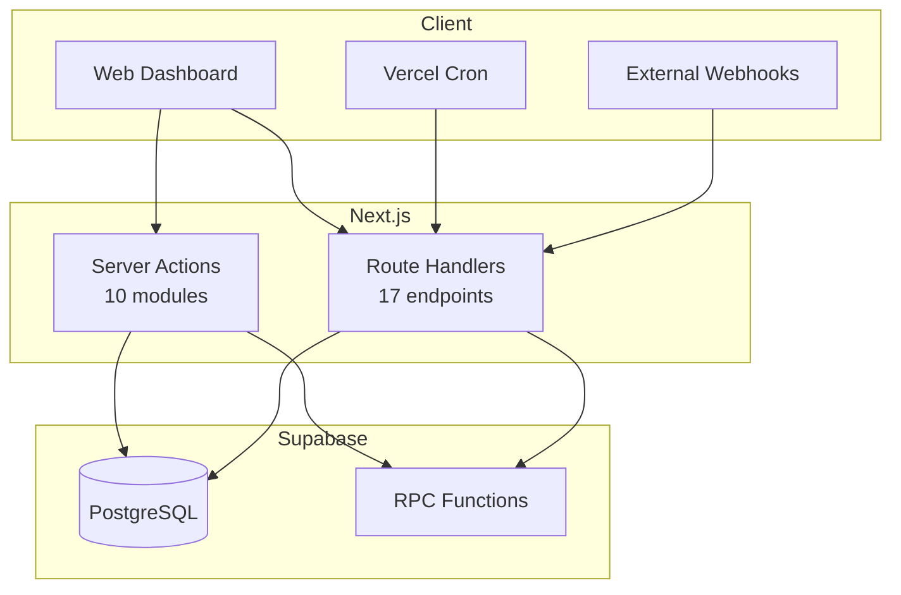
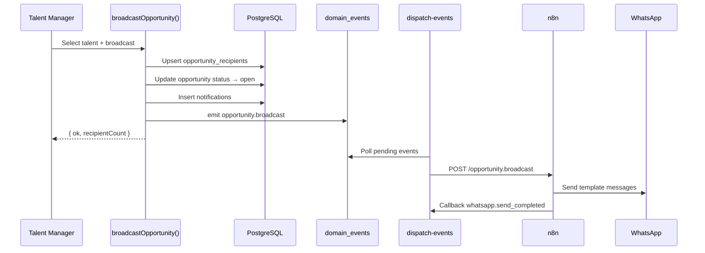
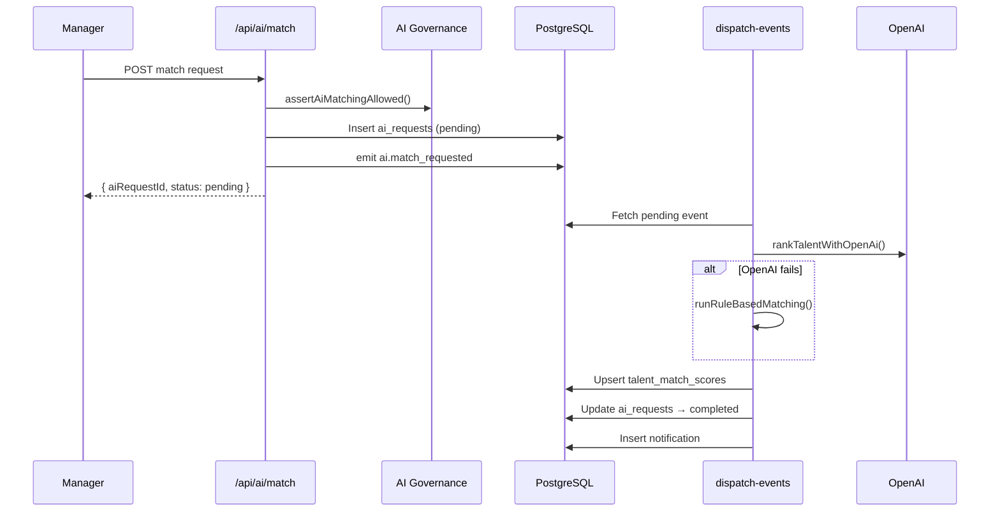
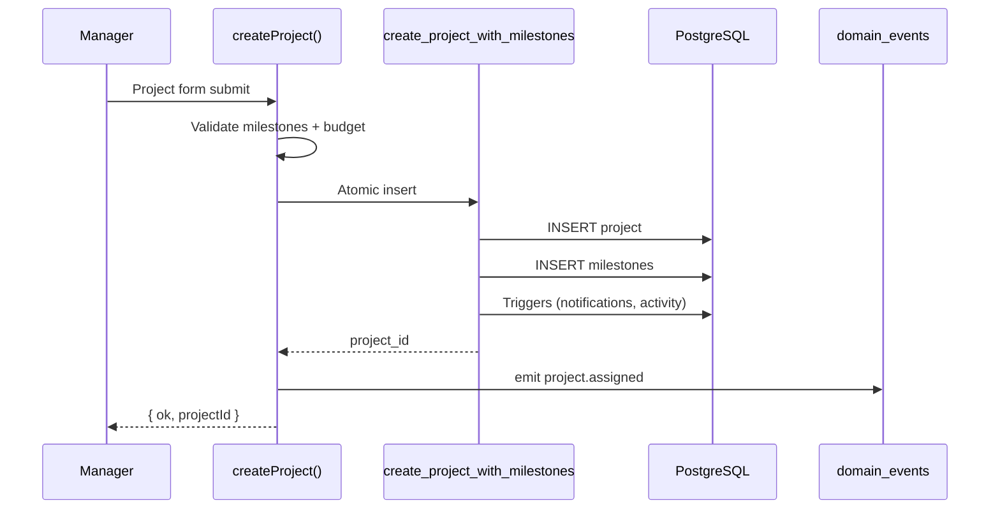
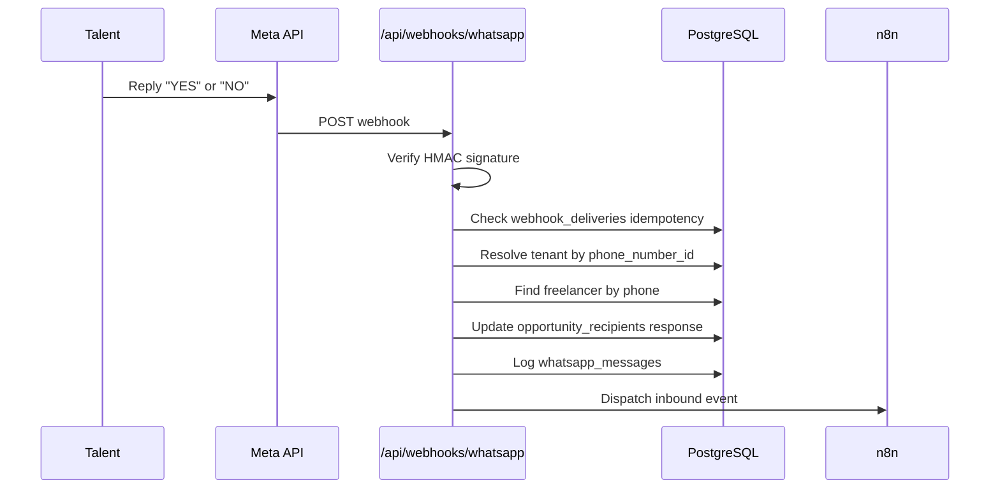
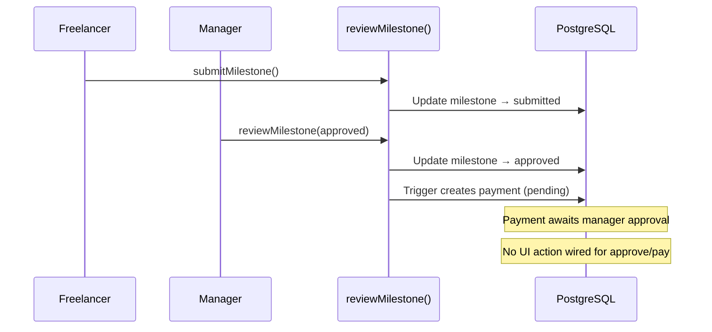

# Talent OS — API Reference

| Field | Value |
|-------|-------|
| **Version** | 1.0.0 |
| **Base URL** | `{NEXT_PUBLIC_APP_URL}` |
| **Auth** | Supabase JWT (cookies) / Bearer CRON_SECRET (cron) |
| **Pattern** | Server Actions (primary) + Route Handlers (secondary) |

---

## 1. API Architecture Overview



Talent OS uses **Server Actions as the primary mutation API** for the web dashboard. Route Handlers serve webhooks, cron jobs, AI endpoints, and limited REST access.

---

## 2. Route Handlers (REST)

### 2.1 Authentication

| Method | Path | Auth | Description |
|--------|------|------|-------------|
| GET/POST | `/api/auth/callback` | Public | OAuth/magic link callback |
| GET | `/api/auth/session` | Cookie | Current session info |
| POST | `/api/auth/signout` | Cookie | Sign out |
| GET/POST | `/api/auth/invite/[token]` | Public/Auth | Invite preview and accept |

### 2.2 AI

| Method | Path | Auth | Description |
|--------|------|------|-------------|
| POST | `/api/ai/match` | Manager | Request AI talent match |
| GET | `/api/ai/match/[opportunityId]` | Manager | Get match results |
| GET/POST | `/api/ai/pm/[entityType]/[entityId]` | Manager | AI PM features |

**Entity types:** `opportunity`, `project`, `shortlist`

### 2.3 Analytics & Search

| Method | Path | Auth | Description |
|--------|------|------|-------------|
| GET | `/api/analytics/dashboard` | Manager | Dashboard metrics |
| GET | `/api/talent/search` | Manager | Faceted talent search |

### 2.4 Team

| Method | Path | Auth | Description |
|--------|------|------|-------------|
| GET | `/api/team/members` | Admin | List team members |

### 2.5 Webhooks (Inbound)

| Method | Path | Auth | Description |
|--------|------|------|-------------|
| GET | `/api/webhooks/whatsapp` | Verify token | Meta webhook verification |
| POST | `/api/webhooks/whatsapp` | HMAC signature | Inbound WhatsApp messages |
| POST | `/api/webhooks/n8n` | HMAC signature | n8n callback events |

### 2.6 Cron (Internal)

| Method | Path | Auth | Description |
|--------|------|------|-------------|
| GET | `/api/cron/dispatch-events` | Bearer CRON_SECRET | Process domain event outbox |
| GET | `/api/cron/check-overdue-milestones` | Bearer CRON_SECRET | Overdue milestone alerts |

### 2.7 Internal AI Execution

| Method | Path | Auth | Description |
|--------|------|------|-------------|
| POST | `/api/internal/ai/execute` | Internal | Execute AI request by ID |
| POST | `/api/internal/ai/execute-match` | Internal | Execute match specifically |

### 2.8 Health

| Method | Path | Auth | Description |
|--------|------|------|-------------|
| GET | `/api/health` | Public | Health check |

---

## 3. Server Actions

### 3.1 `app/actions/auth.ts`

| Action | Permission | Description |
|--------|------------|-------------|
| `signUpAgency` | Public | Create user + tenant |
| `signInWithPassword` | Public | Email/password login |
| `sendMagicLink` | Public | Magic link email |
| `signOut` | Auth | Clear session |
| `inviteTeamMember` | Admin | Send team invite |
| `revokeInvite` | Admin | Revoke pending invite |

### 3.2 `app/actions/freelancers.ts`

| Action | Permission | Description |
|--------|------------|-------------|
| `createFreelancer` | Manager | Add talent to roster |
| `updateFreelancer` | Manager/Self | Update profile |
| `deleteFreelancer` | Manager | Remove from roster |
| `rateFreelancer` | Manager | Set internal rating |

### 3.3 `app/actions/opportunities.ts`

| Action | Permission | Description |
|--------|------------|-------------|
| `createOpportunity` | Manager | Create opportunity |
| `broadcastOpportunity` | Manager | Broadcast to selected talent |
| `respondToOpportunity` | Freelancer | Submit interest/decline |

### 3.4 `app/actions/shortlists.ts`

| Action | Permission | Description |
|--------|------------|-------------|
| `addToShortlist` | Manager | Add candidate |
| `updateShortlistItem` | Manager | Update rank/status |
| `removeFromShortlist` | Manager | Remove candidate |

### 3.5 `app/actions/projects.ts`

| Action | Permission | Description |
|--------|------------|-------------|
| `createProject` | Manager | Atomic project + milestones (RPC) |
| `updateProjectStatus` | Manager/Freelancer | Status transitions |

### 3.6 `app/actions/milestones.ts`

| Action | Permission | Description |
|--------|------------|-------------|
| `updateMilestoneStatus` | Manager/Freelancer | Status transitions |
| `submitMilestone` | Freelancer | Submit deliverable |
| `reviewMilestone` | Manager | Approve/request revision |

### 3.7 `app/actions/portfolio.ts`

| Action | Permission | Description |
|--------|------------|-------------|
| `addPortfolioItem` | Manager/Self | Add portfolio entry |
| `removePortfolioItem` | Manager/Self | Remove portfolio entry |

### 3.8 `app/actions/companies.ts`

| Action | Permission | Description |
|--------|------------|-------------|
| `createCompany` | Admin | Create client company |

### 3.9 `app/actions/ai.ts`

| Action | Permission | Description |
|--------|------------|-------------|
| `requestAiMatch` | Manager | Trigger AI matching |

### 3.10 `app/actions/ai-pm.ts`

| Action | Permission | Description |
|--------|------------|-------------|
| `parseBrief` | Manager | AI brief parsing |
| `generateProjectSummary` | Manager | AI project summary |
| `assessProjectStatus` | Manager | AI risk assessment |
| `saveRequirements` | Manager | Save structured requirements |

---

## 4. Sequence Diagrams

### 4.1 Opportunity Broadcast



### 4.2 AI Talent Matching



### 4.3 Project Creation



### 4.4 WhatsApp Inbound



### 4.5 Milestone Review → Payment



---

## 5. Error Response Patterns

### Server Actions

```typescript
// Success
{ ok: true, projectId: "uuid" }

// Failure
{ ok: false, error: "Human-readable message" }
```

### Route Handlers

```typescript
// JSON responses
NextResponse.json({ error: "..." }, { status: 4xx })
```

### RPC Errors (mapped in actions)

| RPC Error | User Message |
|-----------|-------------|
| `MILESTONES_REQUIRED` | At least one milestone is required |
| `MILESTONE_BUDGET_EXCEEDED` | Milestone amounts exceed budget |
| `FORBIDDEN` | Permission denied |
| `AI_MONTHLY_LIMIT_EXCEEDED` | AI quota exhausted |

---

## 6. Authentication Flow

| Context | Mechanism |
|---------|-----------|
| Web dashboard | Supabase JWT in HTTP-only cookies |
| Server Actions | Cookie-based session via `createClient()` |
| Route Handlers | Cookie session or signature verification |
| Cron endpoints | `Authorization: Bearer {CRON_SECRET}` |
| WhatsApp webhook | Meta `X-Hub-Signature-256` HMAC |
| n8n webhook | `X-Webhook-Signature` HMAC |

---

## 7. Missing API Surface

Documented in `docs/05-api-architecture.md` but **not implemented**:

| Endpoint Group | Status |
|----------------|--------|
| `/api/freelancers/*` | Not built |
| `/api/opportunities/[id]/broadcast` | Action only |
| `/api/payments/*` | Not built |
| `/api/notifications/*` | Not built |
| `/api/integrations/*` | Not built |
| `/api/milestones/[id]/submit` | Action only |
| Public REST API v1 | Not built |
| Outbound webhooks | Not built |

---

## 8. Rate Limiting & Quotas

| Resource | Limit | Enforcement |
|----------|-------|-------------|
| AI requests | Per tenant/month (100–100K by tier) | `assertAiFeatureAllowed()` |
| Event dispatch | 50 events/cron run | Hard limit in cron |
| WhatsApp | Provider limits | Meta policy |

---

*See also: [01-Architecture.md](./01-Architecture.md), [06-Supabase.md](./06-Supabase.md)*
