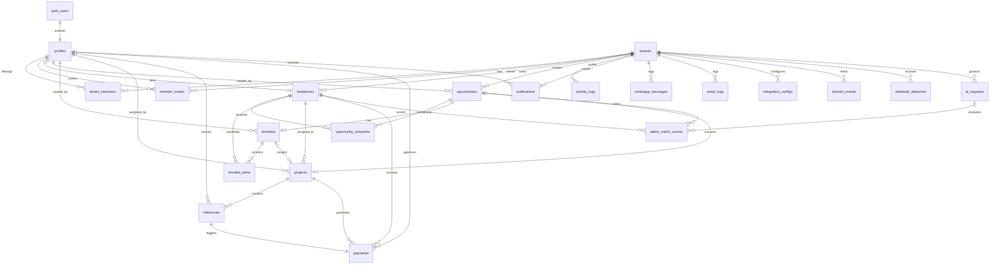

# TalentOS — Complete Supabase Schema Reference

**Database:** PostgreSQL 15 (Supabase)  
**Migrations:** `supabase/migrations/001` → `006`  
**Tables:** 21 · **Enums:** 15 · **Views:** 7 · **RLS:** Enabled on all tables

---

## 1. Entity Relationship Diagram



---

## 2. Table Catalog

### 2.1 Core Identity

| Table | PK | Key FKs | Unique Constraints |
|-------|-----|---------|-------------------|
| `tenants` | `id` | — | `slug` |
| `profiles` | `id` | `auth.users(id)` CASCADE | — |
| `tenant_members` | `id` | `tenant_id`, `user_id` | `(tenant_id, user_id)` |
| `member_invites` | `id` | `tenant_id`, `invited_by` | `(tenant_id, email)` |

### 2.2 Talent & Pipeline

| Table | PK | Key FKs | Unique Constraints |
|-------|-----|---------|-------------------|
| `freelancers` | `id` | `tenant_id`, `user_id?` | `(tenant_id, email)` |
| `opportunities` | `id` | `tenant_id`, `created_by` | — |
| `opportunity_recipients` | `id` | `opportunity_id`, `freelancer_id`, `tenant_id` | `(opportunity_id, freelancer_id)` |
| `shortlists` | `id` | `tenant_id`, `opportunity_id`, `created_by` | `opportunity_id` |
| `shortlist_items` | `id` | `shortlist_id`, `freelancer_id`, `tenant_id` | `(shortlist_id, freelancer_id)` |

### 2.3 Delivery & Finance

| Table | PK | Key FKs | Unique Constraints |
|-------|-----|---------|-------------------|
| `projects` | `id` | `tenant_id`, `freelancer_id`, `opportunity_id?`, `shortlist_id?` | — |
| `milestones` | `id` | `project_id`, `tenant_id`, `reviewed_by?` | — |
| `payments` | `id` | `project_id`, `milestone_id`, `freelancer_id`, `tenant_id` | `milestone_id` |

### 2.4 Engagement & Audit

| Table | PK | Key FKs | Unique Constraints |
|-------|-----|---------|-------------------|
| `activity_logs` | `id` | `tenant_id`, `actor_id?` | — (immutable) |
| `notifications` | `id` | `tenant_id`, `user_id` | — |
| `whatsapp_messages` | `id` | `tenant_id`, `freelancer_id?` | — |
| `email_logs` | `id` | `tenant_id`, `freelancer_id?`, `user_id?` | — |

### 2.5 Event & Intelligence

| Table | PK | Key FKs | Unique Constraints |
|-------|-----|---------|-------------------|
| `domain_events` | `id` | `tenant_id`, `actor_id?` | `(tenant_id, idempotency_key)` |
| `webhook_deliveries` | `id` | `tenant_id?` | `(source, idempotency_key)` |
| `ai_requests` | `id` | `tenant_id` | — |
| `talent_match_scores` | `id` | `opportunity_id`, `freelancer_id`, `ai_request_id?` | `(opportunity_id, freelancer_id)` |

### 2.6 Configuration

| Table | PK | Key FKs | Unique Constraints |
|-------|-----|---------|-------------------|
| `integration_configs` | `id` | `tenant_id` | `(tenant_id, provider)` |

---

## 3. Relationship Map (Foreign Keys)

```
auth.users
  └── profiles (1:1, ON DELETE CASCADE)

tenants
  ├── tenant_members → profiles
  ├── member_invites → profiles (invited_by)
  ├── freelancers → profiles? (user_id, SET NULL)
  ├── opportunities → profiles (created_by)
  ├── shortlists → profiles (created_by)
  ├── projects → profiles (assigned_by)
  ├── milestones → profiles? (reviewed_by)
  ├── payments → profiles? (approved_by)
  ├── activity_logs → profiles? (actor_id, SET NULL)
  ├── notifications → profiles
  ├── whatsapp_messages
  ├── email_logs → profiles?, freelancers?
  ├── integration_configs
  ├── domain_events → profiles? (actor_id)
  ├── webhook_deliveries
  ├── ai_requests
  └── talent_match_scores

opportunities
  ├── opportunity_recipients → freelancers
  ├── shortlists (1:1)
  ├── projects (0..1)
  └── talent_match_scores → freelancers

shortlists
  ├── shortlist_items → freelancers
  └── projects (0..1)

projects
  ├── milestones
  └── payments

milestones
  └── payments (1:1, UNIQUE milestone_id)
```

### Cascade Rules

| Parent Deleted | Child Behavior |
|----------------|----------------|
| `tenants` | CASCADE all tenant data |
| `auth.users` | CASCADE `profiles`; SET NULL on `freelancers.user_id` |
| `opportunities` | CASCADE recipients, shortlist; SET NULL on `projects.opportunity_id` |
| `projects` | CASCADE milestones, payments |
| `milestones` | CASCADE payment |

---

## 4. Enums

| Enum | Values |
|------|--------|
| `user_role` | admin, talent_manager, freelancer |
| `member_status` | invited, active, suspended |
| `discipline_type` | design, video, copy, motion, brand, other |
| `availability_status` | available, busy, unavailable |
| `opportunity_status` | draft, open, closed, filled, canceled |
| `response_type` | pending, interested, declined |
| `shortlist_status` | open, finalized, archived |
| `shortlist_item_status` | active, selected, rejected |
| `project_status` | draft, active, in_review, completed, archived, canceled |
| `milestone_status` | pending, in_progress, submitted, approved, revision, canceled |
| `payment_status` | pending, approved, processing, paid, disputed, canceled |
| `notification_type` | opportunity_broadcast, opportunity_response, project_assigned, milestone_*, payment_*, system |
| `event_status` | pending, processing, delivered, failed, dead_letter |
| `ai_provider` | openai, claude |
| `ai_request_status` | pending, processing, completed, failed |

---

## 5. RLS Helper Functions (`public` schema)

| Function | Returns | Purpose |
|----------|---------|---------|
| `user_tenant_ids()` | `SETOF uuid` | All active tenant memberships |
| `manager_tenant_ids()` | `SETOF uuid` | Tenants where user is admin or talent_manager |
| `admin_tenant_ids()` | `SETOF uuid` | Tenants where user is admin |
| `freelancer_tenant_ids()` | `SETOF uuid` | Tenants where user is freelancer |
| `user_freelancer_ids()` | `SETOF uuid` | Freelancer profile IDs linked to user |
| `has_tenant_role(tenant, roles[])` | `boolean` | Role check |
| `is_manager_of(tenant)` | `boolean` | Manager check |
| `is_admin_of(tenant)` | `boolean` | Admin check |

All helpers are `SECURITY DEFINER` with `SET search_path = public`.

---

## 6. Complete RLS Policy Matrix

Legend: **S** SELECT · **I** INSERT · **U** UPDATE · **D** DELETE · **—** no access · **SD** SECURITY DEFINER only

### 6.1 Core Tables

| Table | Admin | Talent Manager | Freelancer | Notes |
|-------|-------|----------------|------------|-------|
| `tenants` | S, U | S | S | INSERT via `create_tenant_with_admin()` |
| `profiles` | S, I, U | S, I, U | S, I, U | Own row + same-tenant members |
| `tenant_members` | S, I, U, D | S | S | Cannot delete self |
| `member_invites` | S, I, U, D | — | — | Admin only |

### 6.2 Talent & Pipeline

| Table | Admin | Talent Manager | Freelancer | Notes |
|-------|-------|----------------|------------|-------|
| `freelancers` | S, I, U, D | S, I, U, D | S, U (own) | Cannot edit `internal_rating/notes` (API) |
| `opportunities` | S, I, U, D | S, I, U, D | S (assigned) | DELETE draft only |
| `opportunity_recipients` | S, I, U, D | S, I, U, D | S, U (own) | Freelancer updates response only |
| `shortlists` | S, I, U, D | S, I, U, D | — | |
| `shortlist_items` | S, I, U, D | S, I, U, D | — | |

### 6.3 Delivery & Finance

| Table | Admin | Talent Manager | Freelancer | Notes |
|-------|-------|----------------|------------|-------|
| `projects` | S, I, U, D | S, I, U, D | S, U (assigned) | DELETE draft/canceled only |
| `milestones` | S, I, U, D | S, I, U, D | S, U (assigned) | DELETE pending/canceled only |
| `payments` | S, I, U | S, I | S, U (dispute) | Admin: full update; Freelancer: dispute only |

### 6.4 Engagement & Audit

| Table | Admin | Talent Manager | Freelancer | Notes |
|-------|-------|----------------|------------|-------|
| `activity_logs` | S, I | S, I | S (own projects) | Immutable — no UPDATE/DELETE |
| `notifications` | S, I, U, D (own) | S, I, U, D (own) | S, I, U, D (own) | Own `user_id` only |
| `whatsapp_messages` | S, I | S, I | — | Service role for inbound |
| `email_logs` | S | S | S (own) | Service role for outbound |

### 6.5 Event & Intelligence

| Table | Admin | Talent Manager | Freelancer | Notes |
|-------|-------|----------------|------------|-------|
| `domain_events` | S | S (non-integration) | — | INSERT via triggers/SD functions |
| `webhook_deliveries` | S | — | — | Service role writes |
| `ai_requests` | S | S | — | Service role writes |
| `talent_match_scores` | S | S | S (own score) | Service role writes |
| `integration_configs` | S, I, U, D | — | — | Encrypted credentials |

### 6.6 Storage Buckets

| Bucket | Admin | Talent Manager | Freelancer |
|--------|-------|----------------|------------|
| `tenant-logos` | S, I, U, D | S | S |
| `deliverables` | S, I, D | S, I, D | S, I (own projects) |
| `avatars` | S, I, U, D (own) | S, I, U, D (own) | S, I, U, D (own) |

---

## 7. Database Triggers

| Trigger | Table | Event | Action |
|---------|-------|-------|--------|
| `on_auth_user_created` | `auth.users` | INSERT | Create `profiles` row |
| `trg_*_updated_at` | 10 tables | UPDATE | Set `updated_at = now()` |
| `trg_opp_recipient_tenant` | `opportunity_recipients` | INSERT/UPDATE | Enforce `tenant_id` consistency |
| `trg_shortlist_item_tenant` | `shortlist_items` | INSERT/UPDATE | Sync `tenant_id` from shortlist |
| `trg_milestone_tenant` | `milestones` | INSERT/UPDATE | Sync `tenant_id` from project |
| `trg_match_score_tenant` | `talent_match_scores` | INSERT/UPDATE | Sync `tenant_id` from opportunity |
| `trg_opportunity_response` | `opportunity_recipients` | UPDATE | Set `responded_at`, notify manager |
| `trg_milestone_approved` | `milestones` | UPDATE | Create payment, notify admin |
| `trg_project_status_change` | `projects` | UPDATE | Log activity on status change |
| `trg_project_created` | `projects` | INSERT | Fill opportunity, notify freelancer |
| `trg_opportunity_opened` | `opportunities` | UPDATE | Emit `domain_events` |
| `trg_payment_status_change` | `payments` | UPDATE | Emit `domain_events` |

---

## 8. Security Definer Functions

| Function | Callable By | Purpose |
|----------|-------------|---------|
| `create_tenant_with_admin(name, slug, user_id)` | authenticated | Agency signup |
| `link_freelancer_to_user(freelancer_id, user_id)` | authenticated | Freelancer onboarding |
| `log_activity(...)` | triggers / internal | Audit trail |
| `create_notification(...)` | triggers / internal | In-app notifications |
| `emit_domain_event(...)` | triggers / internal | Outbox pattern |
| `search_freelancers(...)` | authenticated | Tenant-scoped search |
| `suggest_talent_for_opportunity(id)` | authenticated | Rule-based matching |
| `handle_new_user()` | auth trigger | Profile bootstrap |

**Service role** bypasses RLS for n8n webhooks, event dispatcher, and WhatsApp inbound handler.

---

## 9. Analytics Views

| View | Purpose |
|------|---------|
| `v_dashboard_summary` | KPI cards per tenant |
| `v_opportunity_fill_rate` | Monthly fill rate % |
| `v_freelancer_utilization` | Projects and revenue per freelancer |
| `v_payment_aging` | Days in each payment status |
| `v_response_metrics` | Weekly broadcast response rates |
| `v_ai_usage` | Monthly AI cost and token usage |
| `v_event_pipeline_health` | Outbox depth and lag |

All views granted to `authenticated` role; underlying RLS on base tables applies when queried with user JWT.

---

## 10. Migration Run Order

```bash
# Using Supabase CLI
supabase db push

# Manual order
psql -f supabase/migrations/001_initial_schema.sql
psql -f supabase/migrations/002_rls_policies.sql
psql -f supabase/migrations/003_functions_triggers.sql
psql -f supabase/migrations/004_views_analytics.sql
psql -f supabase/migrations/005_event_infrastructure.sql
psql -f supabase/migrations/006_complete_rls_and_integrity.sql
```

| Migration | Contents |
|-----------|----------|
| `001` | Extensions, enums, 15 core tables, indexes, `updated_at` triggers |
| `002` | Initial RLS policies (superseded by 006) |
| `003` | Business logic functions, auth trigger, realtime publication |
| `004` | Analytics views, storage buckets, initial storage RLS |
| `005` | Event outbox, webhook deliveries, AI tables, email logs |
| `006` | Public-schema helpers, `member_invites`, tenant integrity triggers, complete RLS, storage CRUD, grants |

---

## 11. Indexes Summary

All tenant-scoped queries use **composite indexes with `tenant_id` as leading column**:

```sql
-- Examples
idx_freelancers_tenant_discipline    (tenant_id, discipline)
idx_projects_tenant_status           (tenant_id, status)
idx_payments_tenant_status           (tenant_id, status)
idx_domain_events_pending            (created_at) WHERE status = 'pending'
idx_milestones_overdue               (tenant_id, due_date) WHERE status NOT IN (...)
```

GIN indexes on `freelancers.skills` and `freelancers.tags` for array search.

---

## 12. Realtime Subscriptions

Tables published to `supabase_realtime`:

- `notifications`
- `opportunity_recipients`
- `milestones`
- `projects`
- `domain_events`
- `payments`
- `talent_match_scores`

---

*This document is the authoritative schema reference. For product context see [PRD](01-PRD.md); for enterprise patterns see [Enterprise Architecture](11-enterprise-system-architecture.md).*
