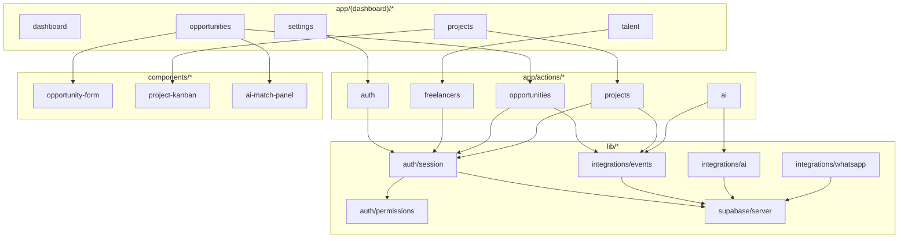
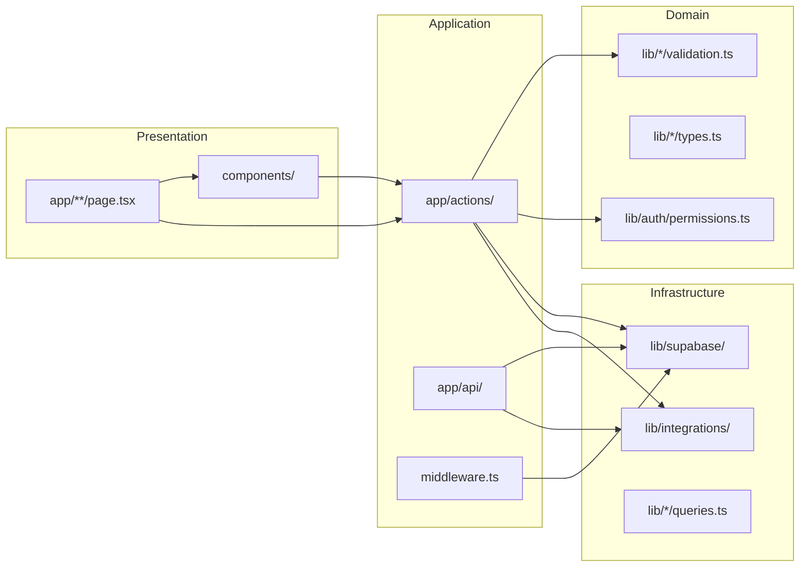
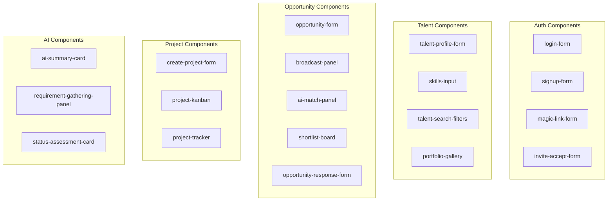

# Talent OS — Folder Structure

| Field | Value |
|-------|-------|
| **Version** | 1.0.0 |
| **Framework** | Next.js 15 App Router |
| **Language** | TypeScript |

---

## 1. Project Tree (Actual — Audited)

```
talent-os/
├── app/                                    # Next.js App Router
│   ├── (auth)/                             # Auth layout (no sidebar)
│   │   ├── login/page.tsx
│   │   ├── signup/page.tsx
│   │   ├── forgot-password/page.tsx
│   │   ├── invite/[token]/page.tsx
│   │   └── layout.tsx
│   │
│   ├── (dashboard)/                        # Main app layout (sidebar)
│   │   ├── dashboard/page.tsx
│   │   ├── talent/
│   │   │   ├── page.tsx                    # Talent list
│   │   │   ├── new/page.tsx
│   │   │   └── [id]/
│   │   │       ├── page.tsx                # Profile detail
│   │   │       └── edit/page.tsx
│   │   ├── opportunities/
│   │   │   ├── page.tsx
│   │   │   ├── new/page.tsx
│   │   │   └── [id]/
│   │   │       ├── page.tsx
│   │   │       └── shortlist/page.tsx
│   │   ├── projects/
│   │   │   ├── page.tsx
│   │   │   ├── new/page.tsx
│   │   │   └── [id]/page.tsx
│   │   ├── payments/page.tsx
│   │   ├── analytics/page.tsx
│   │   ├── notifications/page.tsx
│   │   ├── profile/page.tsx
│   │   ├── settings/
│   │   │   ├── page.tsx
│   │   │   ├── team/page.tsx
│   │   │   ├── billing/page.tsx
│   │   │   └── integrations/page.tsx
│   │   └── layout.tsx
│   │
│   ├── actions/                            # Server Actions (10 modules)
│   │   ├── auth.ts
│   │   ├── freelancers.ts
│   │   ├── opportunities.ts
│   │   ├── shortlists.ts
│   │   ├── projects.ts
│   │   ├── milestones.ts
│   │   ├── portfolio.ts
│   │   ├── companies.ts
│   │   ├── ai.ts
│   │   └── ai-pm.ts
│   │
│   ├── api/                                # Route Handlers (17 endpoints)
│   │   ├── auth/
│   │   │   ├── callback/route.ts
│   │   │   ├── session/route.ts
│   │   │   ├── signout/route.ts
│   │   │   └── invite/[token]/route.ts
│   │   ├── ai/
│   │   │   ├── match/route.ts
│   │   │   ├── match/[opportunityId]/route.ts
│   │   │   └── pm/[entityType]/[entityId]/route.ts
│   │   ├── analytics/dashboard/route.ts
│   │   ├── talent/search/route.ts
│   │   ├── team/members/route.ts
│   │   ├── webhooks/
│   │   │   ├── whatsapp/route.ts
│   │   │   └── n8n/route.ts
│   │   ├── cron/
│   │   │   ├── dispatch-events/route.ts
│   │   │   └── check-overdue-milestones/route.ts
│   │   ├── internal/ai/
│   │   │   ├── execute/route.ts
│   │   │   └── execute-match/route.ts
│   │   └── health/route.ts
│   │
│   ├── globals.css
│   ├── layout.tsx                          # Root layout
│   ├── page.tsx                            # Landing redirect
│   └── not-found.tsx
│
├── components/                             # React components (35 files)
│   ├── ui/                                 # shadcn primitives (7)
│   │   ├── button.tsx, card.tsx, input.tsx
│   │   ├── label.tsx, badge.tsx, separator.tsx
│   ├── layout/                             # header.tsx, sidebar.tsx
│   ├── auth/                               # 6 form components
│   ├── talent/                             # 4 components
│   ├── opportunities/                      # 8 components
│   ├── projects/                           # 3 components
│   ├── ai/                                 # 3 components
│   ├── settings/                           # 2 components
│   └── shared/                             # page-header.tsx
│
├── lib/                                    # Business logic (42 files)
│   ├── supabase/
│   │   ├── client.ts                       # Browser client
│   │   ├── server.ts                       # Server component client
│   │   ├── admin.ts                        # Service role client
│   │   └── middleware.ts                   # Session refresh
│   ├── auth/
│   │   ├── session.ts, guards.ts
│   │   ├── permissions.ts, roles.ts
│   │   ├── invites.ts, tenant-context.ts
│   ├── integrations/
│   │   ├── ai/                             # 12 AI module files
│   │   ├── events.ts, n8n.ts
│   │   ├── whatsapp.ts, encryption.ts
│   ├── opportunities/, projects/, talent/
│   │   └── types.ts, validation.ts
│   ├── companies/queries.ts
│   ├── shortlists/queries.ts
│   ├── api/pagination.ts, response.ts
│   └── utils/cn.ts, constants.ts, format.ts
│
├── hooks/                                  # 2 hooks
│   ├── use-permissions.ts
│   └── use-tenant.ts
│
├── types/                                  # Shared types
│   ├── database.ts                         # Hand-maintained Supabase types
│   ├── api.ts
│   └── enums.ts
│
├── supabase/                               # Database
│   ├── migrations/                         # 001–013 SQL files
│   ├── seed.sql
│   └── config.toml
│
├── n8n/                                    # Workflow exports (3 JSON)
├── scripts/push-supabase-schema.sh
├── docs/                                   # Documentation (30+ files)
├── public/logo.svg
├── middleware.ts
├── next.config.ts
├── tailwind.config.ts
├── tsconfig.json
├── components.json                         # shadcn config
├── vercel.json
└── package.json
```

---

## 2. Module Dependency Graph



---

## 3. Conventions

### 3.1 File Naming

| Type | Convention | Example |
|------|------------|---------|
| Pages | `page.tsx` | `app/talent/page.tsx` |
| Layouts | `layout.tsx` | `app/(dashboard)/layout.tsx` |
| API routes | `route.ts` | `app/api/health/route.ts` |
| Components | `kebab-case.tsx` | `talent-profile-form.tsx` |
| Server actions | Domain name | `freelancers.ts` |
| Hooks | `use-*.ts` | `use-permissions.ts` |
| Lib modules | Domain folders | `lib/talent/queries.ts` |

### 3.2 Import Aliases

```json
{
  "@/*": ["./*"]
}
```

Usage: `@/lib/supabase/server`, `@/components/ui/button`

### 3.3 Component Patterns

| Pattern | Usage |
|---------|-------|
| Server Components | Default for pages (data fetching) |
| Client Components | Forms, interactive panels (`'use client'`) |
| Server Actions | All mutations (`'use server'`) |

---

## 4. Layer Responsibilities



---

## 5. Documented vs Actual Gaps

The older `docs/06-folder-structure.md` describes aspirational structure. Key gaps:

| Documented | Actual | Gap |
|------------|--------|-----|
| 60+ API routes | 17 routes | REST API not built |
| `app/actions/payments.ts` | Missing | Payments read-only |
| `components/payments/*` | Missing | No payment UI components |
| `components/analytics/*` | Missing | No chart components |
| `hooks/use-realtime.ts` | Missing | No realtime hooks |
| `.github/workflows/ci.yml` | Missing | No CI |
| Full shadcn ui set | 7 components | Minimal UI kit |
| `lib/validations/` | Per-domain in `lib/*/validation.ts` | Different organization |

---

## 6. Key Entry Points

| Entry | File | Purpose |
|-------|------|---------|
| Root layout | `app/layout.tsx` | HTML shell, fonts |
| Dashboard layout | `app/(dashboard)/layout.tsx` | Sidebar + header |
| Auth middleware | `middleware.ts` | Session + RBAC |
| Session resolution | `lib/auth/session.ts` | `getSession()`, `requireTenant()` |
| Event dispatch | `app/api/cron/dispatch-events/route.ts` | Outbox processor |
| WhatsApp ingress | `app/api/webhooks/whatsapp/route.ts` | Inbound messages |
| AI executor | `lib/integrations/ai/executor.ts` | AI request router |

---

## 7. Component Map by Feature



---

*See also: [02-Codebase-Overview.md](./02-Codebase-Overview.md), [04-API.md](./04-API.md)*
