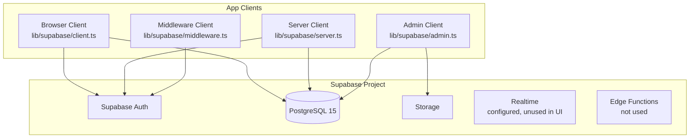
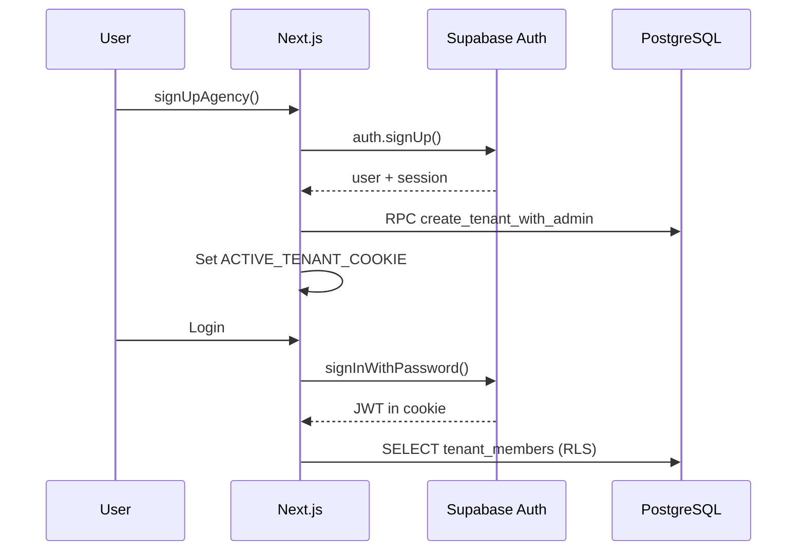
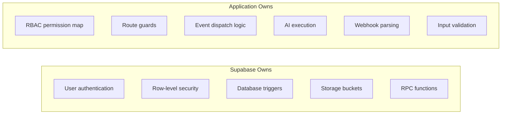

# Talent OS — Supabase

| Field | Value |
|-------|-------|
| **Version** | 1.0.0 |
| **Project** | `rzjyqjwldmdldinoxgvh` |
| **Region** | Supabase Cloud |
| **PostgreSQL** | 15 |

---

## 1. Supabase Services Used



| Service | Usage |
|---------|-------|
| **Auth** | Email/password, magic links, JWT sessions |
| **Database** | All application data, RLS, RPCs, triggers |
| **Storage** | Portfolio images, deliverable files |
| **Realtime** | Configured in docs; not wired in UI |
| **Edge Functions** | Not used |

---

## 2. Client Architecture

### 2.1 Browser Client

```typescript
// lib/supabase/client.ts
createBrowserClient(url, anonKey)
```

Used in client components for auth state.

### 2.2 Server Client

```typescript
// lib/supabase/server.ts
createServerClient(url, anonKey, { cookies })
```

Used in Server Components and Server Actions. Respects RLS via authenticated user JWT.

### 2.3 Admin Client

```typescript
// lib/supabase/admin.ts
createClient(url, serviceRoleKey)
```

**Bypasses RLS.** Used only in:
- Cron jobs (`dispatch-events`, `check-overdue-milestones`)
- Webhook handlers (WhatsApp, n8n)
- AI executor
- Event emission

### 2.4 Middleware Client

```typescript
// lib/supabase/middleware.ts
updateSession(request) // Refreshes JWT cookie
```

---

## 3. Auth Integration



### Auth Tables

| Table | Relationship |
|-------|-------------|
| `auth.users` | Supabase managed identity |
| `profiles` | 1:1 extension of auth.users |
| `tenant_members` | M:N users ↔ tenants with role |
| `member_invites` | Pending invitations with token hash |

### Signup Flow

1. `supabase.auth.signUp()` creates auth user
2. `create_tenant_with_admin` RPC creates tenant + admin membership
3. `ACTIVE_TENANT_COOKIE` set for tenant context

### Invite Flow

1. Admin calls `inviteTeamMember()` → inserts `member_invites`
2. Invitee visits `/invite/[token]`
3. `accept_member_invite` RPC validates token, creates membership
4. For freelancer role: `link_freelancer_to_user` connects roster entry

---

## 4. Row-Level Security

### 4.1 RLS Architecture

```mermaid
flowchart TB
    REQ[Authenticated Request]
    JWT[JWT → auth.uid()]
    HELP[RLS Helper Functions]
    POL[Table Policies]
    DATA[Filtered Rows]

    REQ --> JWT
    JWT --> HELP
    HELP --> POL
    POL --> DATA
```

### 4.2 Policy Patterns

| Pattern | Example |
|---------|---------|
| Tenant member read | `tenant_id IN (SELECT user_tenant_ids())` |
| Manager write | `tenant_id IN (SELECT manager_tenant_ids())` |
| Freelancer self | `user_id = auth.uid()` or `id IN (SELECT user_freelancer_ids())` |
| Client company scope | `company_id IN (SELECT client_company_ids())` |

### 4.3 Tables with RLS Enabled

All tenant-scoped tables including: `tenants`, `profiles`, `tenant_members`, `freelancers`, `opportunities`, `projects`, `milestones`, `payments`, `domain_events`, `ai_requests`, `talent_match_scores`, `companies`, `member_invites`, and more.

### 4.4 SECURITY DEFINER Functions

RPCs that bypass RLS for authorized operations:

| Function | Authorization Check |
|----------|-------------------|
| `create_tenant_with_admin` | New signup |
| `create_project_with_milestones` | `is_manager_of()` + `auth.uid()` |
| `emit_domain_event` | Service role / SECURITY DEFINER |
| `accept_member_invite` | Valid token |
| `search_freelancers` | Tenant scope parameter |

---

## 5. Storage

### 5.1 Buckets

| Bucket | Access | Purpose |
|--------|--------|---------|
| `portfolio` | Public read | Talent portfolio images |
| `deliverables` | Private | Project deliverable files |

### 5.2 Upload Pattern

Portfolio uploads use Supabase Storage via server actions with tenant-scoped paths. Deliverable upload UI is not fully wired.

---

## 6. Database Functions & Triggers

See [03-Database.md](./03-Database.md) for full inventory. Key Supabase-specific patterns:

| Pattern | Implementation |
|---------|---------------|
| Outbox | `emit_domain_event()` RPC with idempotency |
| Atomic transactions | `create_project_with_milestones()` RPC |
| Auto-events | Triggers on `opportunities`, `payments` |
| Activity audit | `log_activity()` called from triggers |
| Search | `search_freelancers()` with filters |

---

## 7. Type Generation

**Current state:** Hand-maintained types in `types/database.ts`

**Recommended:**

```bash
supabase gen types typescript --project-id rzjyqjwldmdldinoxgvh > types/database.generated.ts
```

The hand-maintained file covers ~25 tables but may drift from actual schema after migrations.

---

## 8. Migration Management

### 8.1 Apply Migrations

```bash
# Via Supabase CLI
supabase db push

# Via script (uses session pooler)
./scripts/push-supabase-schema.sh

# Manual
psql -f supabase/migrations/001_initial_schema.sql
# ... through 013
```

### 8.2 Migration Order

Migrations must run sequentially 001 → 013. Later migrations depend on earlier schema and functions.

### 8.3 Seed Data

`supabase/seed.sql` provides development seed data for local/staging environments.

---

## 9. Connection Configuration

From `.env.local.example`:

```bash
NEXT_PUBLIC_SUPABASE_URL=https://rzjyqjwldmdldinoxgvh.supabase.co
NEXT_PUBLIC_SUPABASE_ANON_KEY=your-anon-key
SUPABASE_SERVICE_ROLE_KEY=your-service-role-key
```

From `supabase/config.toml`: Local development config for Supabase CLI.

---

## 10. Supabase vs Application Responsibilities



| Concern | Owner |
|---------|-------|
| Who can login | Supabase Auth |
| What data user sees | Supabase RLS |
| What routes user accesses | App middleware |
| What actions user performs | App permission map |
| Async side effects | App event outbox + cron |
| AI processing | App (OpenAI client) |
| WhatsApp parsing | App (webhook handler) |

---

## 11. Known Supabase Issues & Workarounds

| Issue | Workaround |
|-------|------------|
| Email confirmation ON in dev | Disable in Supabase dashboard |
| IPv6-only direct DB host | Use session pooler via `push-supabase-schema.sh` |
| Views bypassing RLS | Fixed in 013 with `security_invoker = true` |
| `is_tenant_admin` undefined | Fixed in 013 → uses `is_admin_of()` |
| Service role exposure | Restricted to server-side files only |

---

## 12. Realtime (Configured, Unused)

`docs/03-database-schema.md` documents Realtime subscriptions for:
- `notifications` (user-scoped)
- `opportunity_recipients` (response updates)

**Actual codebase:** No `use-realtime.ts` hook or Realtime subscription in components. Notifications are fetched on page load only.

---

*See also: [03-Database.md](./03-Database.md), [21-supabase-connection.md](./21-supabase-connection.md)*
