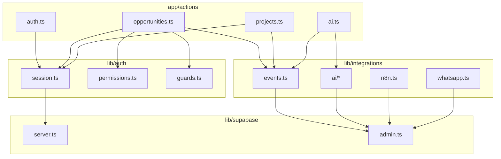

# Talent OS — Dependencies

| Field | Value |
|-------|-------|
| **Version** | 1.0.0 |
| **Node** | ≥ 20 |
| **Package Manager** | npm |

---

## 1. Dependency Graph

```mermaid
flowchart TB
    subgraph Production Dependencies
        NEXT[next 15.1.3]
        REACT[react 19.0.0]
        SUPA[@supabase/supabase-js 2.47.10]
        SUPASSR[@supabase/ssr 0.5.2]
        ZOD[zod 3.24.1]
        RADIX[@radix-ui/* 1.1-2.1]
        TAILWIND_UTIL[tailwind-merge + cva + clsx]
        DATES[date-fns 3.6.0]
        ICONS[lucide-react 0.469.0]
        CHARTS[recharts 2.15.0]
    end

    subgraph Dev Dependencies
        TS[typescript 5.7.2]
        ESLINT[eslint 8.57.1]
        TW[tailwindcss 3.4.17]
        TYPES[@types/react + node]
    end

    NEXT --> REACT
    NEXT --> SUPASSR
    SUPASSR --> SUPA
    NEXT --> ZOD
    NEXT --> RADIX
    NEXT --> TAILWIND_UTIL
```

---

## 2. Production Dependencies

| Package | Version | Purpose | Criticality |
|---------|---------|---------|-------------|
| `next` | ^15.1.3 | Framework, App Router, Server Actions | **Critical** |
| `react` | ^19.0.0 | UI rendering | **Critical** |
| `react-dom` | ^19.0.0 | DOM rendering | **Critical** |
| `@supabase/supabase-js` | ^2.47.10 | Database, auth, storage client | **Critical** |
| `@supabase/ssr` | ^0.5.2 | Cookie-based auth for Next.js | **Critical** |
| `zod` | ^3.24.1 | Input validation schemas | **High** |
| `@radix-ui/react-avatar` | ^1.1.2 | Avatar component (installed, unused) | Low |
| `@radix-ui/react-dialog` | ^1.1.4 | Dialog (installed, unused) | Low |
| `@radix-ui/react-dropdown-menu` | ^2.1.4 | Dropdown (installed, unused) | Low |
| `@radix-ui/react-label` | ^2.1.1 | Form labels | Medium |
| `@radix-ui/react-separator` | ^1.1.1 | Visual separator | Low |
| `@radix-ui/react-slot` | ^1.1.1 | Component composition | Medium |
| `@radix-ui/react-tabs` | ^1.1.2 | Tabs (installed, unused) | Low |
| `class-variance-authority` | ^0.7.1 | Component variants (shadcn) | Medium |
| `clsx` | ^2.1.1 | Class name utility | Medium |
| `tailwind-merge` | ^2.6.0 | Tailwind class merging | Medium |
| `tailwindcss-animate` | ^1.0.7 | Animation utilities | Low |
| `date-fns` | ^3.6.0 | Date formatting | Medium |
| `lucide-react` | ^0.469.0 | Icons | Medium |
| `recharts` | ^2.15.0 | Charts (installed, barely used) | Low |

---

## 3. Dev Dependencies

| Package | Version | Purpose |
|---------|---------|---------|
| `typescript` | ^5.7.2 | Type checking |
| `@types/node` | ^22.10.2 | Node.js types |
| `@types/react` | ^19.0.2 | React types |
| `@types/react-dom` | ^19.0.2 | React DOM types |
| `eslint` | ^8.57.1 | Linting |
| `eslint-config-next` | ^15.1.3 | Next.js ESLint rules |
| `tailwindcss` | ^3.4.17 | CSS framework |
| `autoprefixer` | ^10.4.20 | CSS prefixing |
| `postcss` | ^8.4.49 | CSS processing |

---

## 4. External Service Dependencies

```mermaid
flowchart LR
    APP[Talent OS]

    APP -->|Required| SUPA[Supabase<br/>Auth + DB + Storage]
    APP -->|Required for AI| OPENAI[OpenAI API]
    APP -->|Optional| N8N[n8n<br/>Workflow automation]
    APP -->|Optional| META[Meta WhatsApp<br/>Cloud API]
    APP -->|Required| VERCEL[Vercel<br/>Hosting]

    style SUPA fill:#3ecf8e
    style VERCEL fill:#000
    style OPENAI fill:#412991
    style N8N fill:#ea4b71
    style META fill:#25d366
```



| Service | Required | Fallback | Env Vars |
|---------|----------|----------|----------|
| Supabase | Yes | None | `NEXT_PUBLIC_SUPABASE_*`, `SUPABASE_SERVICE_ROLE_KEY` |
| Vercel | Yes | None | Auto-configured |
| OpenAI | No | Rule-based matching | `OPENAI_API_KEY`, `OPENAI_MODEL` |
| n8n | No | Direct AI mode; in-app only | `N8N_WEBHOOK_*` |
| WhatsApp | No | Web-only responses | `WHATSAPP_*` |

---

## 5. Internal Module Dependencies



---

## 6. Dependency Risks

| Risk | Severity | Details |
|------|----------|---------|
| React 19 + Next 15 | Medium | Bleeding edge; limited ecosystem maturity |
| No lock on patch updates | Low | `^` ranges allow minor updates |
| Unused Radix packages | Low | 4 packages installed but no UI components built |
| Recharts unused | Low | Dead weight in bundle |
| No Supabase CLI in devDeps | Medium | Types not auto-generated |
| No test framework | **High** | Zero test dependencies |
| No CI tooling | **High** | No GitHub Actions deps |
| Single AI provider | Medium | OpenAI only; Claude enum exists but unused |

---

## 7. Bundle Impact Analysis

| Category | Packages | Impact |
|----------|----------|--------|
| Core framework | next, react, react-dom | ~Large (unavoidable) |
| Supabase | supabase-js, ssr | ~Medium |
| UI | radix (partial), tailwind utils | ~Small (most unused) |
| Icons | lucide-react | ~Tree-shakeable |
| Charts | recharts | ~Medium (unused) |
| Validation | zod | ~Small |

---

## 8. Missing Dependencies (Recommended)

| Package | Purpose | Priority |
|---------|---------|----------|
| `vitest` or `jest` | Unit testing | P0 |
| `@testing-library/react` | Component testing | P0 |
| `supabase` (CLI) | Type generation, local dev | P1 |
| `ai` (Vercel AI SDK) | Structured LLM outputs | P1 |
| `@inngest/next` or `trigger.dev` | Reliable background jobs | P2 |
| `launchdarkly-js-client-sdk` | Feature flags | P3 |

---

## 9. Scripts

| Command | Purpose |
|---------|---------|
| `npm run dev` | Start dev server (port 3000) |
| `npm run build` | Production build |
| `npm run start` | Production server |
| `npm run lint` | ESLint check |
| `npm run typecheck` | TypeScript check (`tsc --noEmit`) |

**Missing scripts:** `test`, `test:watch`, `db:types`, `db:push`, `db:seed`

---

## 10. Version Pinning Recommendations

| Package | Current | Recommendation |
|---------|---------|---------------|
| `next` | ^15.1.3 | Pin minor; test before upgrade |
| `@supabase/supabase-js` | ^2.47.10 | Pin; run type gen on upgrade |
| `react` | ^19.0.0 | Pin exact during React 19 stabilization |
| `openai` | Not installed | Add when formalizing AI client |
| `eslint` | ^8.57.1 | Upgrade to ESLint 9 when Next supports |

---

*See also: [07-Dependencies.md](./07-Dependencies.md), [08-Technical-Debt.md](./08-Technical-Debt.md)*
