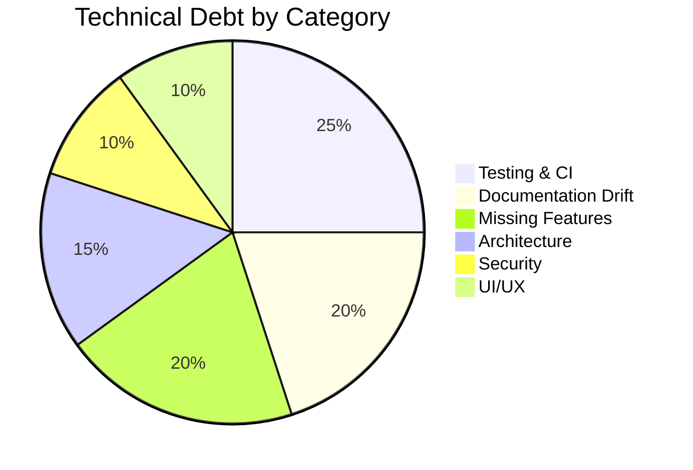
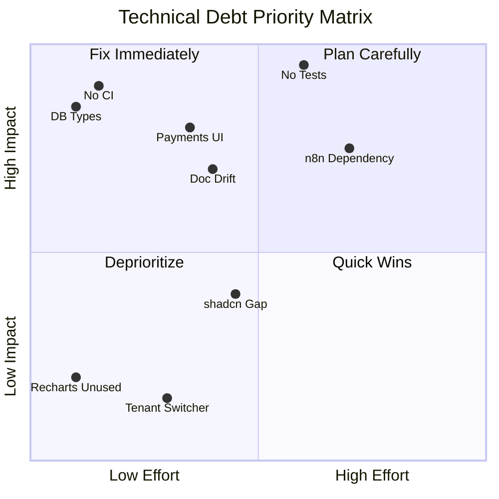
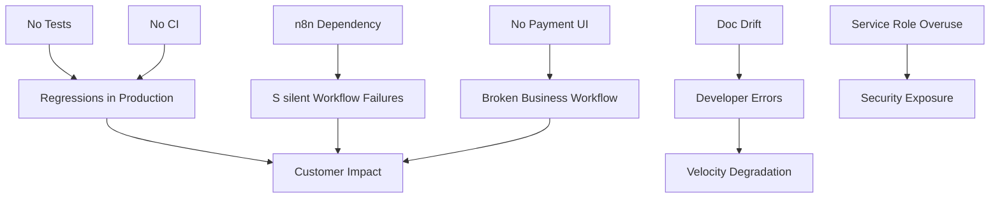

# Talent OS — Technical Debt

| Field | Value |
|-------|-------|
| **Version** | 1.0.0 |
| **Audit Date** | 2026-07-30 |
| **Severity Scale** | Critical / High / Medium / Low |

---

## 1. Debt Summary

| Category | Items | Highest Severity |
|----------|------:|-----------------|
| Testing & CI | 4 | Critical |
| Documentation | 3 | High |
| Missing Features | 8 | High |
| Architecture | 6 | High |
| Security | 4 | High |
| UI/UX | 5 | Medium |

---

## 2. Critical Debt

### TD-001: Zero Automated Tests

| Field | Value |
|-------|-------|
| **Severity** | Critical |
| **Impact** | Regressions undetected; unsafe refactoring |
| **Evidence** | No `test/`, `__tests__/`, `*.test.ts`, or `*.spec.ts` files |
| **Affected** | Entire codebase |
| **Effort** | Medium |

No unit, integration, or E2E tests exist. Critical paths (auth, project creation RPC, payment triggers, AI matching) are untested.

### TD-002: No CI/CD Pipeline

| Field | Value |
|-------|-------|
| **Severity** | Critical |
| **Impact** | Broken builds can reach production |
| **Evidence** | No `.github/workflows/` directory |
| **Affected** | Deployment pipeline |
| **Effort** | Low |

No automated lint, typecheck, or build gates on pull requests.

### TD-003: Hand-Maintained Database Types

| Field | Value |
|-------|-------|
| **Severity** | Critical |
| **Impact** | Type/schema drift causes runtime errors |
| **Evidence** | `types/database.ts` manually written; no `supabase gen types` |
| **Affected** | All Supabase queries |
| **Effort** | Low |

Schema has 13 migrations but types may not reflect latest columns (e.g., `company_id`, `requirements`, `ai_summary`).

---

## 3. High Severity Debt

### TD-004: Documentation/Code Divergence

| Field | Value |
|-------|-------|
| **Severity** | High |
| **Impact** | Developer confusion, wrong assumptions |
| **Evidence** | `docs/06-folder-structure.md` describes 60+ API routes; only 17 exist |
| **Affected** | All new developers |
| **Effort** | Medium |

Two documentation tracks exist: sprint docs (01–23) and enterprise PRD (separate branch).

### TD-005: Payments Workflow Incomplete

| Field | Value |
|-------|-------|
| **Severity** | High |
| **Impact** | Core business workflow broken |
| **Evidence** | No `app/actions/payments.ts`; payments page is read-only table |
| **Affected** | `/payments`, payment RLS policies |
| **Effort** | Medium |

Database supports approve/process/pay states; RLS policy restored in 013; no UI or server actions wired.

### TD-006: n8n Single Point of Failure

| Field | Value |
|-------|-------|
| **Severity** | High |
| **Impact** | Broadcasts, WhatsApp, emails fail silently |
| **Evidence** | `dispatchToN8n()` returns error if not configured; no fallback |
| **Affected** | All async events except direct AI mode |
| **Effort** | High |

Core flows (broadcast, project assignment notifications) depend on external n8n instance.

### TD-007: Service Role Overuse

| Field | Value |
|-------|-------|
| **Severity** | High |
| **Impact** | Security risk if server compromised |
| **Evidence** | `createAdminClient()` used in events, AI, webhooks, cron |
| **Affected** | All admin client call sites |
| **Effort** | Medium |

Admin client bypasses all RLS. No scoped service tokens or function-level permissions.

### TD-008: No Idempotency on Server Actions

| Field | Value |
|-------|-------|
| **Severity** | High |
| **Impact** | Duplicate broadcasts, projects on retry |
| **Evidence** | `broadcastOpportunity` uses `Date.now()` in idempotency key |
| **Affected** | `opportunities.ts`, `projects.ts` |
| **Effort** | Medium |

Double-click or network retry can create duplicate side effects.

### TD-009: Monolithic Server Actions

| Field | Value |
|-------|-------|
| **Severity** | High |
| **Impact** | Hard to test, reuse, and maintain |
| **Evidence** | Business logic, validation, DB access, events in action files |
| **Affected** | All 10 action modules |
| **Effort** | High |

No domain service layer between actions and Supabase.

### TD-010: WhatsApp Integration Naive

| Field | Value |
|-------|-------|
| **Severity** | High |
| **Impact** | Limited talent UX; not WhatsApp-first |
| **Evidence** | `parseQuickResponse()` only handles YES/NO keywords |
| **Affected** | `lib/integrations/whatsapp.ts` |
| **Effort** | Medium |

No NLU, no consent tracking, no template management UI, no session messages.

---

## 4. Medium Severity Debt

### TD-011: Incomplete shadcn/ui Adoption

| Severity | Medium |
|----------|--------|
| **Evidence** | 7 of ~20 documented UI components built; raw HTML tables in payments/analytics |
| **Effort** | Medium |

Radix dialog, tabs, dropdown, avatar installed but unused.

### TD-012: Missing Companies Admin UI

| Severity | Medium |
|----------|--------|
| **Evidence** | `companies` table + `createCompany` action exist; no `/companies` page |
| **Effort** | Low |

### TD-013: Password Reset Incomplete

| Severity | Medium |
|----------|--------|
| **Evidence** | Forgot password form exists; no set-password page after reset link |
| **Effort** | Low |

### TD-014: Activity Logs ≠ Audit Logs

| Severity | Medium |
|----------|--------|
| **Evidence** | `activity_logs` is mutable, no retention policy, no immutability |
| **Effort** | Medium |

Not suitable for compliance (SOC 2, GDPR accountability).

### TD-015: Single Talent Per Project

| Severity | Medium |
|----------|--------|
| **Evidence** | `projects.freelancer_id` is NOT NULL single FK |
| **Effort** | High |

Limits multi-disciplinary project teams.

### TD-016: No File Upload UI for Milestones

| Severity | Medium |
|----------|--------|
| **Evidence** | `milestones.submission_files` JSONB exists; submit action accepts note only |
| **Effort** | Medium |

### TD-017: Recharts Installed but Unused

| Severity | Medium |
|----------|--------|
| **Evidence** | Analytics page has no charts; dependency adds bundle weight |
| **Effort** | Low |

### TD-018: Vercel Cron Not in vercel.json

| Severity | Medium |
|----------|--------|
| **Evidence** | Cron routes exist; `vercel.json` has no cron config |
| **Effort** | Low |

May require manual Vercel dashboard configuration.

### TD-019: Inconsistent Error Handling

| Severity | Medium |
|----------|--------|
| **Evidence** | Mix of `{ ok, error }` returns and thrown `Error` in actions/guards |
| **Effort** | Medium |

### TD-020: Email Confirmation Friction

| Severity | Medium |
|----------|--------|
| **Evidence** | Documented in `docs/22-blockers-and-workflow.md` as dev blocker |
| **Effort** | Low |

---

## 5. Low Severity Debt

| ID | Issue | Evidence |
|----|-------|----------|
| TD-021 | No tenant switcher UI | Single tenant cookie; no switcher component |
| TD-022 | No loading skeletons | Pages render without loading states |
| TD-023 | No toast notifications | Actions succeed/fail silently in UI |
| TD-024 | No error boundaries | Unhandled errors crash pages |
| TD-025 | Duplicate OpenAI clients | Both `openai.ts` and `openai-client.ts` exist |
| TD-026 | Unused hooks | `use-tenant.ts` minimally used |
| TD-027 | No API versioning | Route handlers have no `/v1` prefix |
| TD-028 | No rate limiting on API | Only AI has tenant-level limits |

---

## 6. Debt Heat Map

---

## 7. Debt by Module

| Module | Debt Items | Top Issue |
|--------|-----------|-----------|
| Auth | TD-013, TD-020 | Password reset incomplete |
| Talent | TD-012 | No import UI |
| Opportunities | TD-008, TD-010 | Idempotency, WhatsApp parsing |
| Projects | TD-009, TD-016 | Monolithic actions, no file upload |
| Payments | TD-005 | No approve/pay UI |
| AI | TD-006, TD-025 | n8n dependency, duplicate clients |
| Analytics | TD-017 | Charts not wired |
| Infrastructure | TD-001, TD-002, TD-003 | No tests, CI, or generated types |
| Security | TD-007 | Service role overuse |
| Documentation | TD-004 | Code/doc divergence |

---

## 8. Accumulated Risk

---

*See also: [09-Improvement-Plan.md](./09-Improvement-Plan.md), [02-Codebase-Overview.md](./02-Codebase-Overview.md)*
