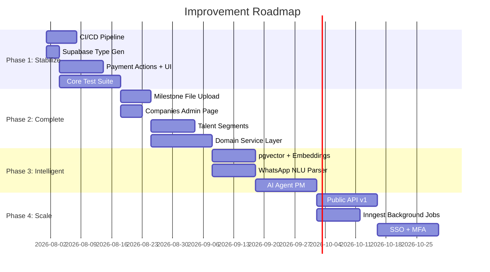
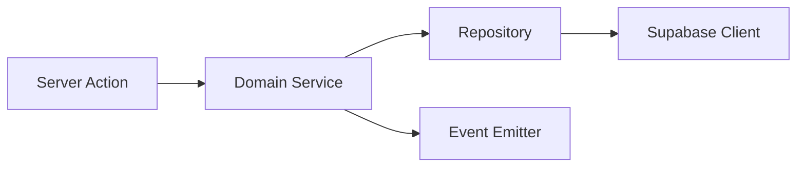
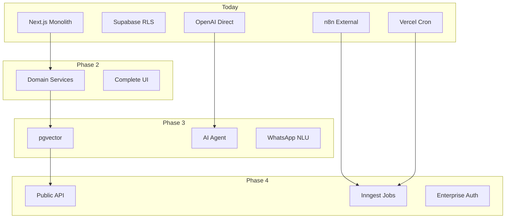

# Talent OS — Improvement Plan

| Field | Value |
|-------|-------|
| **Version** | 1.0.0 |
| **Audit Date** | 2026-07-30 |
| **Horizon** | 4 phases |

---

## 1. Strategic Goals

1. **Stabilize** — Tests, CI, type safety, payment workflow
2. **Complete** — Missing core features (payments, deliverables, segments)
3. **Intelligent** — AI-native matching with vectors and NLU
4. **Scale** — Public API, reliable jobs, enterprise security

---

## 2. Phase Overview

---

## 3. Phase 1 — Stabilize (Foundation)

**Goal:** Production-safe codebase with core workflow completion.

### 3.1 CI/CD Pipeline

| Task | Details |
|------|---------|
| Add `.github/workflows/ci.yml` | Lint + typecheck + build on PR |
| Add branch protection | Require CI pass before merge |
| Add preview deploys | Vercel auto-deploy on PR |

### 3.2 Supabase Type Generation

| Task | Details |
|------|---------|
| Add `supabase` CLI to devDependencies | Version pinned |
| Add `npm run db:types` script | Generates `types/database.generated.ts` |
| Replace hand-maintained types | Import generated types in Supabase clients |
| Add CI check | Fail if types drift from schema |

### 3.3 Payment Workflow

| Task | Details |
|------|---------|
| Create `app/actions/payments.ts` | `approvePayment()`, `processPayment()`, `recordManualPayment()` |
| Build payment UI components | Approve dialog, status badges, action buttons |
| Wire `/payments` page | Manager approve + finance process actions |
| Add payment notifications | Trigger on status transitions |

### 3.4 Core Test Suite

| Task | Details |
|------|---------|
| Add Vitest + Testing Library | Unit test framework |
| Test permission map | All roles × permissions |
| Test validation schemas | Zod schemas for all domains |
| Test RPC error mapping | `mapRpcError()` coverage |
| Test AI fallback matching | Rule-based matcher |

**Exit Criteria:**
- CI green on all PRs
- Payment approve → process flow works end-to-end
- ≥ 40% coverage on `lib/` modules
- Generated types match schema

---

## 4. Phase 2 — Complete (Feature Parity)

**Goal:** Complete MVP feature set for agency operations.

### 4.1 Milestone File Upload

| Task | Details |
|------|---------|
| Presigned upload to `deliverables` bucket | Server action |
| Upload UI on project detail page | Drag-and-drop component |
| Update `submitMilestone` action | Accept file references |
| Version tracking | Append to `submission_files` JSONB |

### 4.2 Companies Admin

| Task | Details |
|------|---------|
| Create `/settings/companies` page | CRUD for end-client companies |
| Company list + form components | Using shadcn Table + Dialog |
| Link to project/opportunity forms | Already partially wired |

### 4.3 Talent Segments

| Task | Details |
|------|---------|
| Migration: `segments` + `segment_members` | Static and dynamic segments |
| Segment CRUD actions + UI | Manager tooling |
| Broadcast from segment | Replace manual talent selection |

### 4.4 Domain Service Layer

| Task | Details |
|------|---------|
| Extract `lib/domains/talent/` | Service + repository |
| Extract `lib/domains/opportunity/` | Service + repository |
| Extract `lib/domains/project/` | Service + repository |
| Thin server actions | Actions call domain services only |

**Exit Criteria:**
- File upload works for milestone submission
- Companies manageable via UI
- Segments usable for broadcast targeting
- Domain services extracted for 3 core modules

---

## 5. Phase 3 — Intelligent (AI-Native)

**Goal:** Transform from AI-augmented to AI-native talent OS.

### 5.1 Vector Search Infrastructure

| Task | Details |
|------|---------|
| Enable `pgvector` extension | Supabase migration |
| Add `embedding vector(1536)` to freelancers | Column + index |
| Embedding pipeline | Generate on profile create/update |
| Hybrid search | SQL filters + vector similarity |
| Update AI matching | Vector top-50 → LLM rerank top-10 |

### 5.2 WhatsApp NLU

| Task | Details |
|------|---------|
| Add `whatsapp_consent` to freelancers | Migration |
| STOP/START handler | Consent management |
| LLM response parser | Structured field extraction with confidence |
| Replace `parseQuickResponse()` | NLU with Zod validation fallback |

### 5.3 AI Project Manager Agent

| Task | Details |
|------|---------|
| Tool registry | `get_project`, `update_milestone`, `notify_talent` |
| Agent orchestrator | Vercel AI SDK with structured outputs |
| Auto-project planning | Generate milestones from brief |
| Risk detection cron | Overdue, revision loops, budget burn |
| Daily digest | Manager notification via email/WhatsApp |

### 5.4 AI Feedback Loop

| Task | Details |
|------|---------|
| Track match → shortlist → project outcome | Pipeline metrics |
| Weight adjustment per tenant | Improve matching over time |
| AI observability | Extend `ai_requests` with Langfuse/Helicone |

**Exit Criteria:**
- Semantic talent search operational
- WhatsApp free-text responses parsed into structured data
- AI PM agent handles routine project monitoring
- Match quality metrics tracked per tenant

---

## 6. Phase 4 — Scale (Platform)

**Goal:** Enterprise-ready platform with reliable infrastructure.

### 6.1 Public API v1

| Task | Details |
|------|---------|
| REST endpoints with `/api/v1/` prefix | OpenAPI spec |
| API key authentication | Tenant-scoped keys |
| Outbound webhooks | CloudEvents format |
| Rate limiting | Per-plan tier limits |

### 6.2 Background Job Infrastructure

| Task | Details |
|------|---------|
| Replace Vercel cron with Inngest | Reliable event processing |
| Remove n8n critical path | In-app workflow engine |
| Dead letter queue UI | Admin visibility into failed events |

### 6.3 Enterprise Security

| Task | Details |
|------|---------|
| MFA (TOTP) | Supabase Auth MFA |
| SSO (SAML/OIDC) | Enterprise tier |
| Immutable audit logs | Partitioned `audit_logs` table |
| Scoped service tokens | Replace broad service role usage |

### 6.4 Deliverable Versioning

| Task | Details |
|------|---------|
| `deliverables` + `deliverable_versions` tables | Replace flat milestone files |
| Revision workflow | Request → submit → compare versions |
| Multi-talent projects | `project_assignments` M:N table |

**Exit Criteria:**
- Public API documented and functional
- Events processed reliably without n8n dependency
- MFA available for all admin users
- Deliverable revision workflow operational

---

## 7. Quick Wins (Immediate)

| # | Task | Effort | Impact |
|---|------|--------|--------|
| 1 | Add CI workflow (lint + typecheck + build) | 2 hours | Critical |
| 2 | Generate Supabase types | 1 hour | Critical |
| 3 | Configure Vercel cron in dashboard | 30 min | High |
| 4 | Remove unused recharts or wire analytics charts | 4 hours | Medium |
| 5 | Add set-password page for reset flow | 2 hours | Medium |
| 6 | Consolidate `openai.ts` + `openai-client.ts` | 1 hour | Low |
| 7 | Add idempotency keys to broadcast action | 2 hours | High |
| 8 | Update stale docs or mark as aspirational | 4 hours | Medium |

---

## 8. Success Metrics

| Metric | Current | Phase 1 | Phase 2 | Phase 3 | Phase 4 |
|--------|---------|---------|---------|---------|---------|
| Test coverage | 0% | 40% | 60% | 70% | 80% |
| CI pass rate | N/A | 95% | 98% | 99% | 99% |
| Payment workflow | Read-only | Full | Full | Full | + Stripe |
| AI match precision@5 | Unknown | Baseline | Baseline | > 70% | > 80% |
| WhatsApp response parsing | YES/NO | YES/NO | YES/NO | NLU 85% | NLU 90% |
| API endpoints | 17 | 17 | 25 | 30 | 60+ |
| Event delivery reliability | ~n8n dep | ~n8n dep | ~n8n dep | 99% | 99.9% |

---

## 9. Risk Mitigation

| Risk | Mitigation |
|------|------------|
| Breaking changes during refactor | Feature flags + comprehensive tests (Phase 1 first) |
| AI cost overrun | Existing governance (`assertAiFeatureAllowed`) + monitoring |
| Migration failures | Staging environment + backward-compatible migrations |
| n8n removal disruption | Parallel run: Inngest + n8n during transition |
| Scope creep | Phase gates with exit criteria |

---

## 10. Architecture Evolution

---

*See also: [08-Technical-Debt.md](./08-Technical-Debt.md), [10-Architecture-Diagrams.md](./10-Architecture-Diagrams.md)*
