# Talent OS — Architecture Diagrams

| Field | Value |
|-------|-------|
| **Version** | 1.0.0 |
| **Audit Date** | 2026-07-30 |
| **Format** | Mermaid |

This document consolidates all architecture diagrams for Talent OS.

---

## 1. System Context (C4 Level 1)

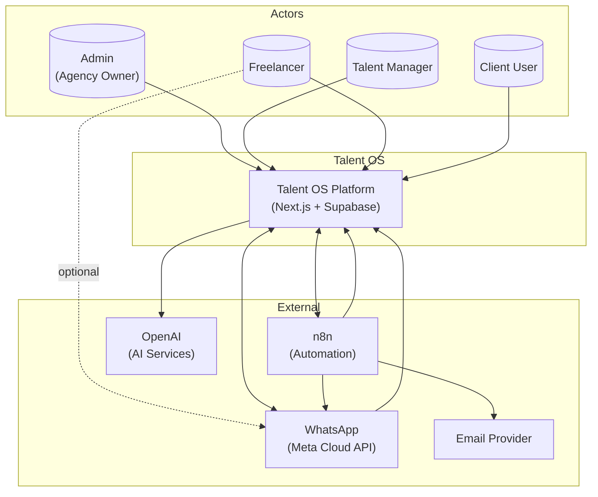

---

## 2. Container Diagram (C4 Level 2)

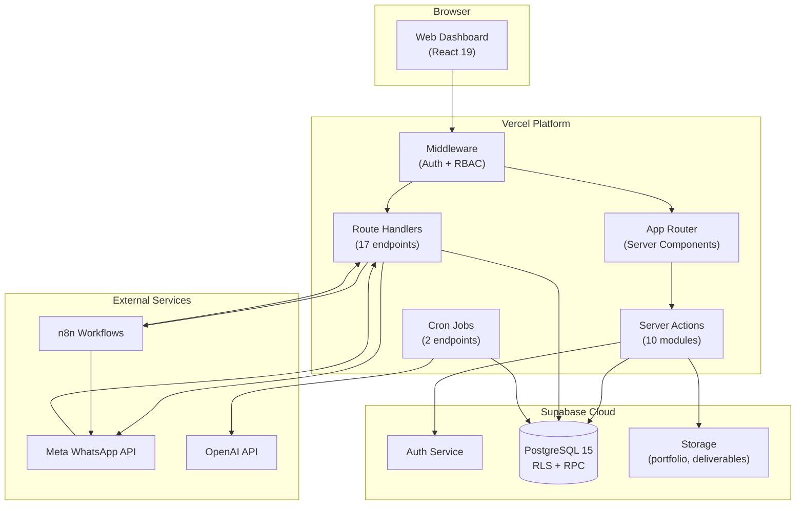

---

## 3. Component Diagram (Application Layer)

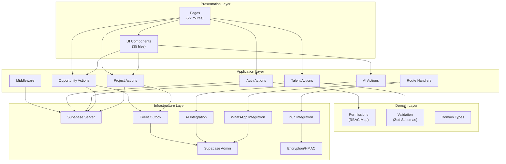

---

## 4. Entity Relationship Diagram

```mermaid
erDiagram
    tenants {
        uuid id PK
        text name
        text slug UK
        jsonb settings
        text subscription_status
    }

    profiles {
        uuid id PK
        text email
        text full_name
    }

    tenant_members {
        uuid id PK
        uuid tenant_id FK
        uuid user_id FK
        user_role role
        uuid company_id FK
    }

    companies {
        uuid id PK
        uuid tenant_id FK
        text name
        text slug
    }

    freelancers {
        uuid id PK
        uuid tenant_id FK
        uuid user_id FK
        text email
        text full_name
        text[] skills
        numeric day_rate
    }

    opportunities {
        uuid id PK
        uuid tenant_id FK
        text title
        text status
        jsonb requirements
        uuid company_id FK
    }

    opportunity_recipients {
        uuid id PK
        uuid opportunity_id FK
        uuid freelancer_id FK
        text response
    }

    shortlists {
        uuid id PK
        uuid opportunity_id FK UK
        text status
    }

    shortlist_items {
        uuid id PK
        uuid shortlist_id FK
        uuid freelancer_id FK
        int rank
    }

    projects {
        uuid id PK
        uuid tenant_id FK
        uuid freelancer_id FK
        uuid company_id FK
        jsonb ai_summary
    }

    milestones {
        uuid id PK
        uuid project_id FK
        text status
        numeric amount
        jsonb submission_files
    }

    payments {
        uuid id PK
        uuid milestone_id FK UK
        uuid freelancer_id FK
        text status
        numeric amount
    }

    domain_events {
        uuid id PK
        uuid tenant_id FK
        text event_type
        text status
        jsonb payload
    }

    ai_requests {
        uuid id PK
        uuid tenant_id FK
        text request_type
        text status
    }

    talent_match_scores {
        uuid id PK
        uuid opportunity_id FK
        uuid freelancer_id FK
        numeric score
    }

    tenants ||--o{ tenant_members : has
    tenants ||--o{ companies : owns
    tenants ||--o{ freelancers : manages
    tenants ||--o{ opportunities : creates
    tenants ||--o{ projects : owns
    profiles ||--o{ tenant_members : member
    profiles ||--o| freelancers : linked
    companies ||--o{ opportunities : client
    companies ||--o{ projects : client
    opportunities ||--o{ opportunity_recipients : broadcast
    opportunities ||--o| shortlists : has
    shortlists ||--o{ shortlist_items : contains
    freelancers ||--o{ opportunity_recipients : responds
    freelancers ||--o{ talent_match_scores : scored
    projects ||--o{ milestones : contains
    projects ||--|| freelancers : assigned
    milestones ||--o| payments : triggers
    opportunities ||--o{ talent_match_scores : ranked
    tenants ||--o{ domain_events : emits
    tenants ||--o{ ai_requests : tracks
```

---

## 5. Module Relationship Diagram

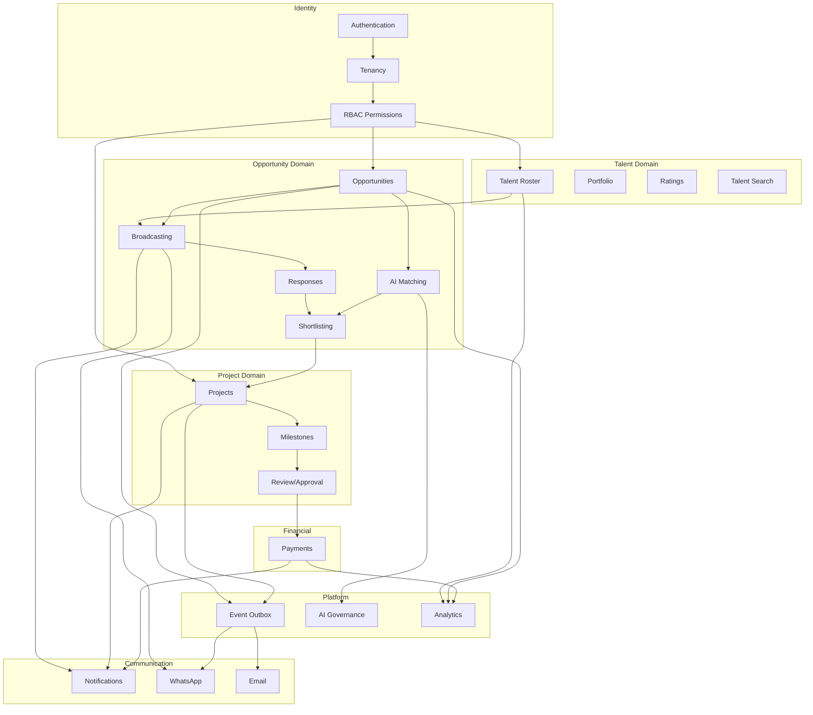

---

## 6. Authentication Sequence

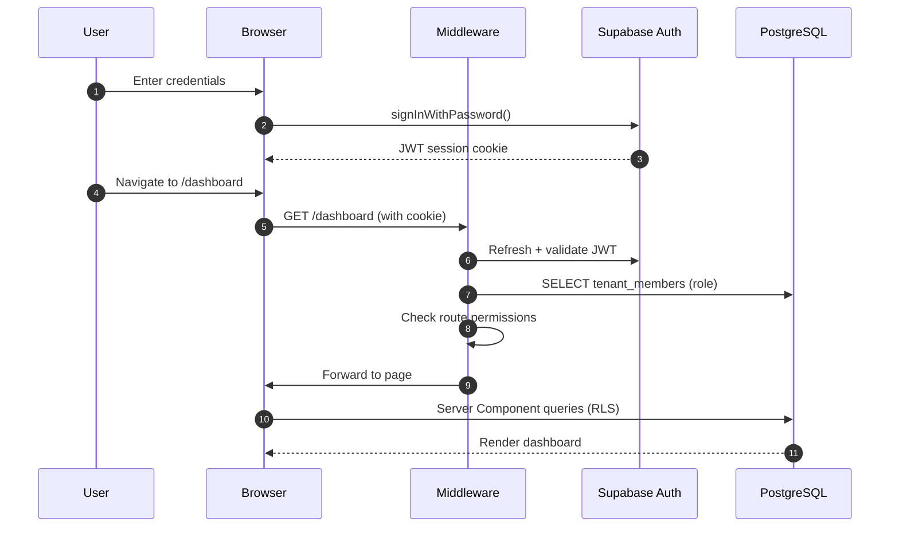

---

## 7. Agency Signup Sequence

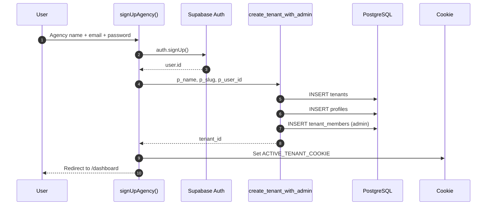

---

## 8. Opportunity Broadcast Sequence

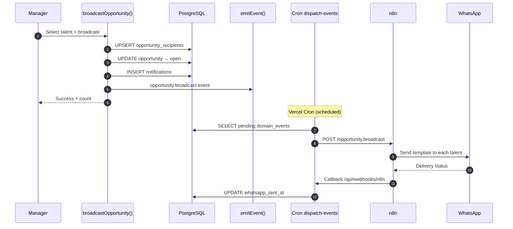

---

## 9. AI Matching Sequence

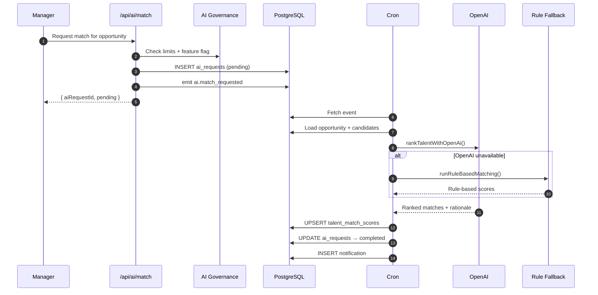

---

## 10. Project Lifecycle State Machine

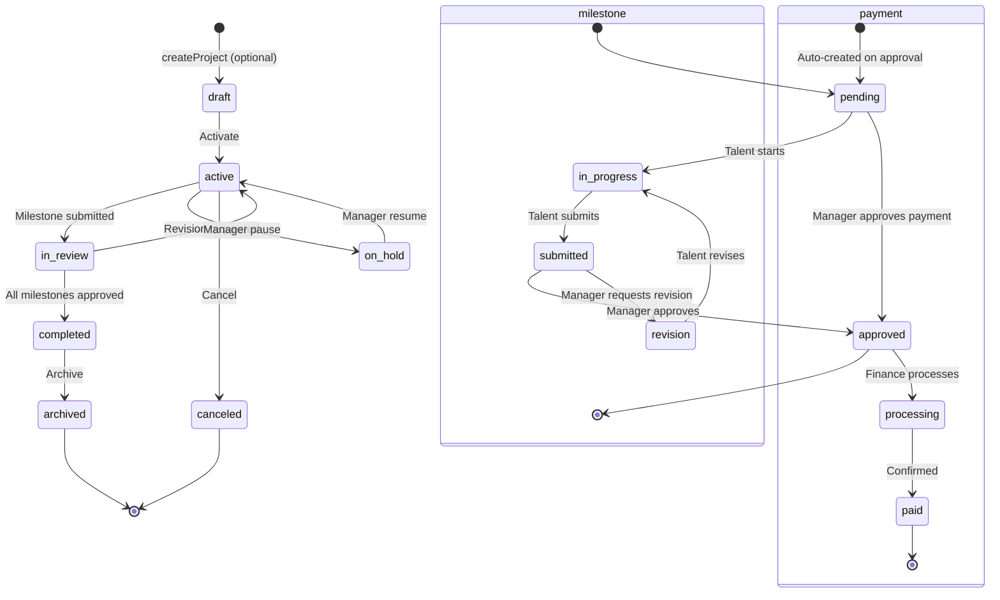

---

## 11. Event Outbox Flow

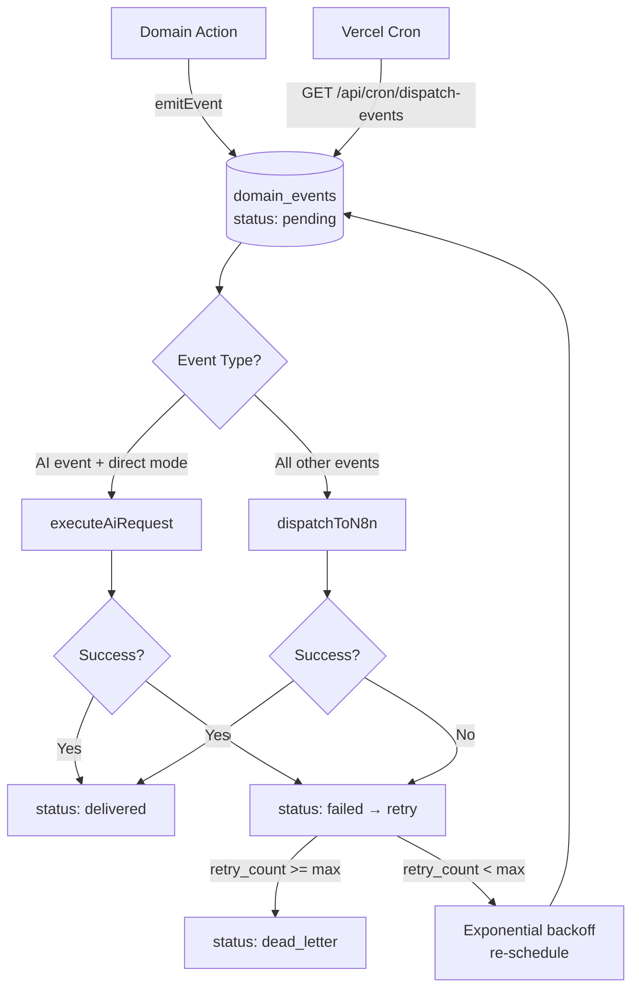

---

## 12. Multi-Tenant Data Isolation

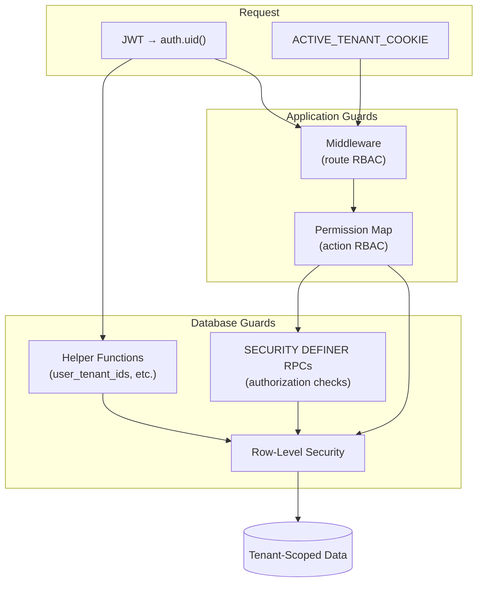

---

## 13. Deployment Architecture

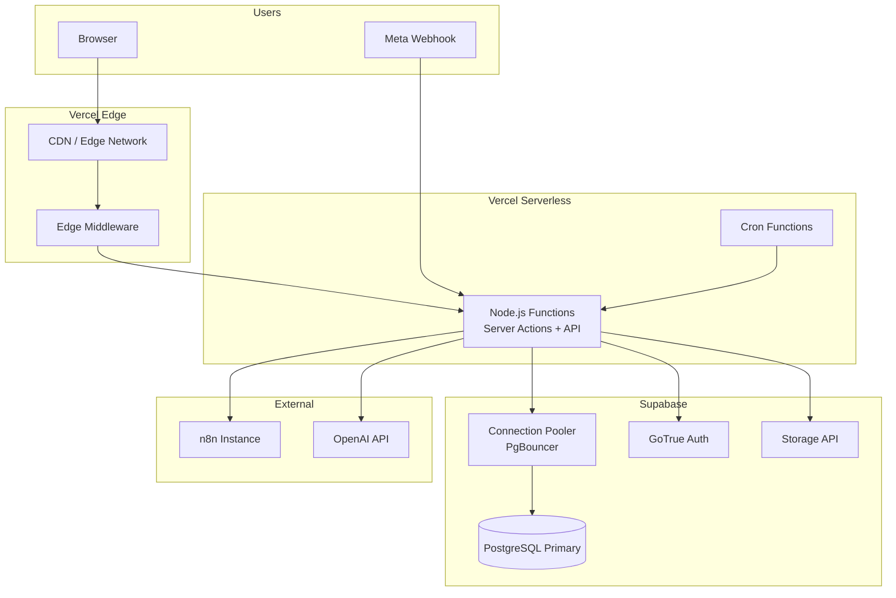

---

## 14. Dependency Graph

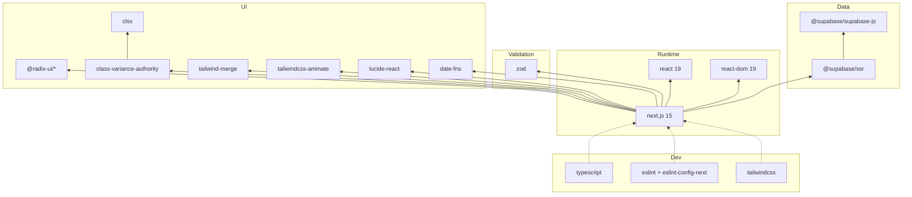

---

## 15. Role-Based Access Matrix

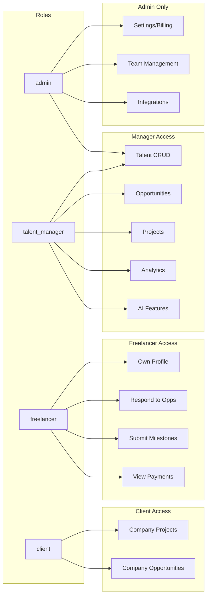

---

## 16. WhatsApp Integration Architecture

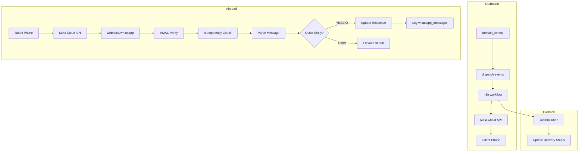

---

## 17. Target AI-Native Architecture

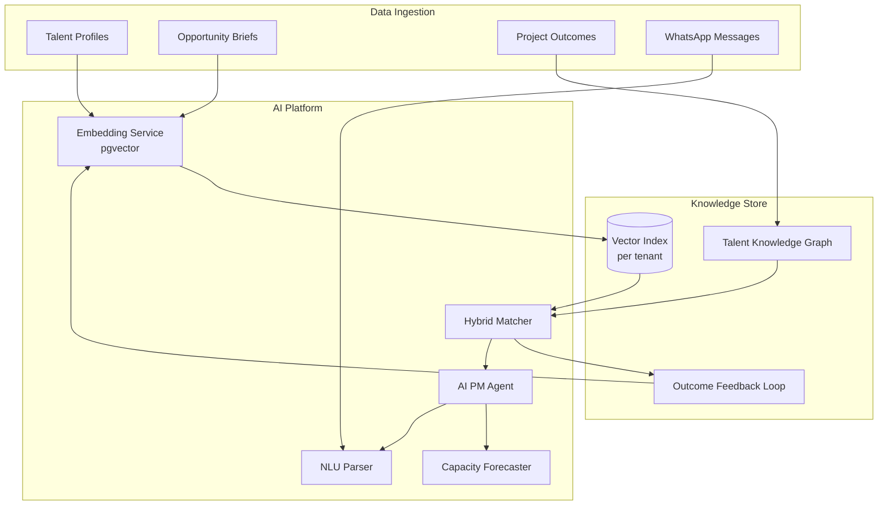

---

*See also: [01-Architecture.md](./01-Architecture.md), [09-Improvement-Plan.md](./09-Improvement-Plan.md)*
