# TalentOS — Enterprise System Architecture

**Version:** 1.0  
**Classification:** Internal — Architecture  
**Last Updated:** 2026-07-01  
**Status:** Approved for Implementation

---

## Document Control

| Role | Responsibility |
|---|---|
| Platform Engineering | Runtime, deployment, observability |
| Application Engineering | Next.js services, API contracts |
| Data Engineering | PostgreSQL schema, RLS, analytics |
| Security Engineering | AuthZ, encryption, compliance |
| Integration Engineering | n8n, WhatsApp, email, AI providers |

### Related Documents

| Document | Scope |
|---|---|
| [PRD](01-PRD.md) | Product requirements |
| [Database Schema](03-database-schema.md) | Table-level design |
| [API Architecture](05-api-architecture.md) | Endpoint catalog |
| [Multi-Tenant Architecture](08-multi-tenant-architecture.md) | Tenant isolation detail |
| [n8n Workflows](09-n8n-workflows.md) | Workflow specifications |
| [WhatsApp Integration](10-whatsapp-integration.md) | Messaging detail |

### Technology Stack

| Layer | Technology |
|---|---|
| Frontend | Next.js 15, TypeScript, Tailwind CSS, shadcn/ui |
| Application Runtime | Vercel (Edge + Serverless) |
| Backend Services | Supabase (Auth, DB, Storage, Realtime, Edge Functions) |
| Database | PostgreSQL 15 |
| Automation | n8n (workflow engine) |
| Communication | WhatsApp Cloud API, Email (Resend) |
| AI | OpenAI GPT-4o, Anthropic Claude |
| Observability | Vercel Analytics, Supabase Logs, n8n execution logs |

---

## 1. High-Level Architecture

TalentOS is an **event-driven, multi-tenant SaaS platform** that unifies talent operations for creative agencies. The architecture follows a **modular monolith** pattern on the application tier, with **asynchronous orchestration** delegated to n8n and **AI augmentation** provided as a governed sidecar service.

### 1.1 Architectural Principles

| Principle | Implementation |
|---|---|
| **Tenant isolation by default** | `tenant_id` + RLS on every data path |
| **Async by default for side effects** | Outbox → n8n for messaging, email, AI |
| **Defense in depth** | Middleware → App RBAC → RLS → audit logs |
| **Idempotent integrations** | Webhook dedup keys, event `idempotency_key` |
| **Provider abstraction** | AI, email, WhatsApp behind internal interfaces |
| **Observable workflows** | Correlation IDs across app → events → n8n |

### 1.2 System Context (C4 Level 1)

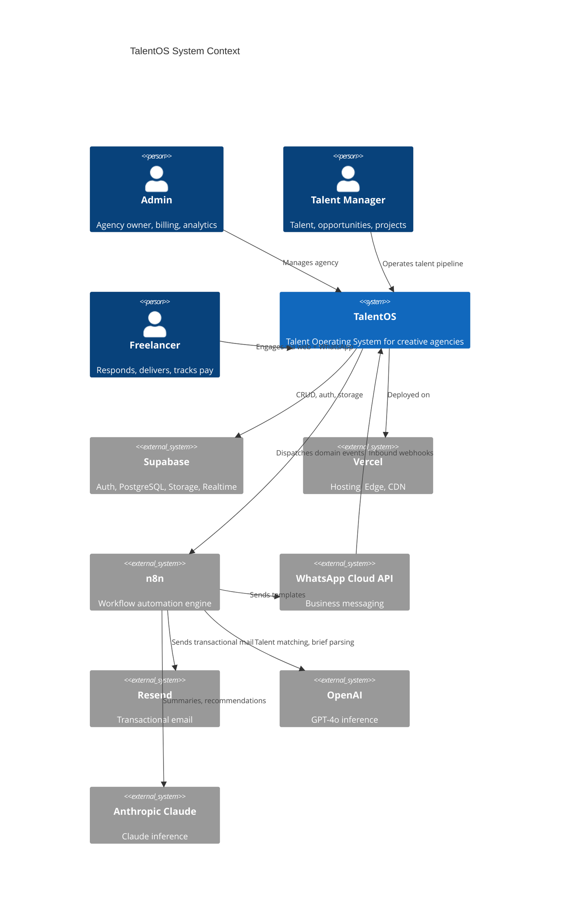

### 1.3 Layered Architecture

```
┌─────────────────────────────────────────────────────────────────────────────┐
│ L7  EXPERIENCE     Next.js RSC + Client Components + shadcn/ui            │
├─────────────────────────────────────────────────────────────────────────────┤
│ L6  APPLICATION    Server Actions │ Route Handlers │ Middleware │ RBAC     │
├─────────────────────────────────────────────────────────────────────────────┤
│ L5  DOMAIN         Talent │ Opportunity │ Project │ Payment │ Analytics   │
├─────────────────────────────────────────────────────────────────────────────┤
│ L4  INTEGRATION    Event Outbox │ Webhook Gateway │ AI Gateway │ Adapters   │
├─────────────────────────────────────────────────────────────────────────────┤
│ L3  DATA           Supabase PostgreSQL │ Storage │ Realtime │ RLS           │
├─────────────────────────────────────────────────────────────────────────────┤
│ L2  AUTOMATION     n8n Workflow Engine │ Cron │ Retry │ Dead Letter         │
├─────────────────────────────────────────────────────────────────────────────┤
│ L1  EXTERNAL       WhatsApp │ Email │ OpenAI │ Claude │ Stripe (Phase 2)  │
└─────────────────────────────────────────────────────────────────────────────┘
```

### 1.4 Request Lifecycle (Synchronous Path)

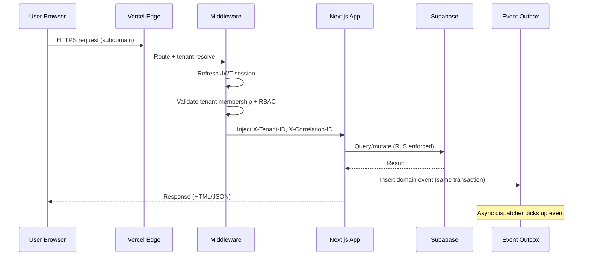

### 1.5 Core Domain Bounded Contexts

| Context | Aggregates | Upstream | Downstream |
|---|---|---|---|
| **Identity & Tenancy** | Tenant, Member, Profile | Supabase Auth | All contexts |
| **Talent** | Freelancer, Skills, Ratings | Identity | Opportunity, Project |
| **Pipeline** | Opportunity, Recipient, Shortlist | Talent | Project |
| **Delivery** | Project, Milestone, Deliverable | Pipeline | Payment |
| **Finance** | Payment, Payout | Delivery | Analytics |
| **Engagement** | Notification, WhatsAppMessage, EmailLog | All | External channels |
| **Intelligence** | AIRequest, MatchScore, Summary | Talent, Pipeline | Manager UI |
| **Insights** | Dashboard, Reports | All | Admin UI |

---

## 2. Component Diagram

### 2.1 Application Components (C4 Level 3)

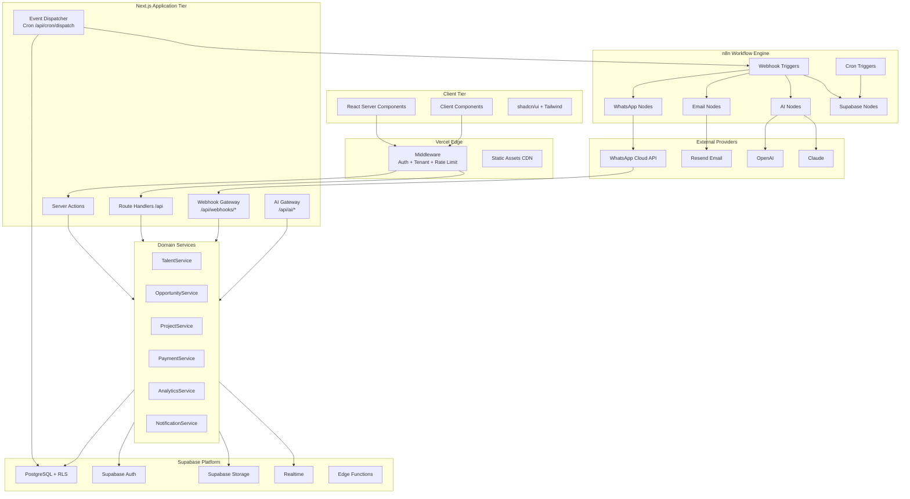

### 2.2 Component Responsibilities

| Component | Responsibility | Technology |
|---|---|---|
| **Middleware** | Session refresh, tenant resolution, route guards, rate limiting | Vercel Edge Middleware |
| **Server Actions** | Form mutations, optimistic UI coordination, revalidation | Next.js `'use server'` |
| **Route Handlers** | REST API, webhooks, exports, cron endpoints | Next.js App Router |
| **Webhook Gateway** | Signature verification, idempotency, payload normalization | `/api/webhooks/*` |
| **AI Gateway** | Provider routing, prompt templates, PII redaction, cost tracking | `/api/ai/*` |
| **Event Dispatcher** | Poll outbox, deliver to n8n, mark processed/failed | Vercel Cron (1 min) |
| **Domain Services** | Business logic, validation, transaction boundaries | `lib/services/*` |
| **Integration Adapters** | Provider-specific clients (WhatsApp, Resend, OpenAI, Claude) | `lib/integrations/*` |
| **n8n Engine** | Durable async workflows, retries, human-in-the-loop | Self-hosted n8n |

### 2.3 Frontend Component Architecture

```
app/(dashboard)/
├── layout.tsx              # Shell: Sidebar, Header, TenantProvider
├── dashboard/              # Analytics widgets (RSC)
├── talent/                 # DataTable + Filters (hybrid)
├── opportunities/          # Pipeline + BroadcastDialog (client)
├── projects/               # Kanban (client) + Detail (RSC)
├── payments/               # Approval workflows
└── settings/               # Integrations, team, billing

components/
├── ui/                     # shadcn/ui primitives (Button, Dialog, Table...)
├── layout/                 # Sidebar, Header, NotificationBell
├── talent/                 # TalentTable, TalentForm, TalentFilters
├── opportunities/          # BroadcastDialog, ResponseList, AISuggestions
├── projects/               # Kanban, MilestoneTimeline, DeliverableUpload
├── payments/               # PaymentTable, ApproveDialog
├── analytics/              # Charts (recharts), DashboardCards
└── ai/                     # MatchExplanation, BriefParser, SummaryCard
```

### 2.4 AI Component Integration

| Feature | Provider | Trigger | Output |
|---|---|---|---|
| Talent-opportunity matching | OpenAI GPT-4o | Opportunity create | Ranked suggestions + rationale |
| Brief parsing / skill extraction | Claude | Opportunity create | Structured skills, budget estimate |
| Shortlist comparison summary | Claude | Shortlist finalize | Narrative comparison for managers |
| Project activity digest | Claude | Weekly cron | Email digest to admin |
| Response sentiment analysis | OpenAI | Freelancer response | Interest confidence score |

AI calls **never run synchronously in the user request path** for operations > 2s. They are dispatched via event outbox → n8n → AI node → result written to `ai_requests` + UI polling/realtime.

---

## 3. Service Diagram

### 3.1 Service Topology

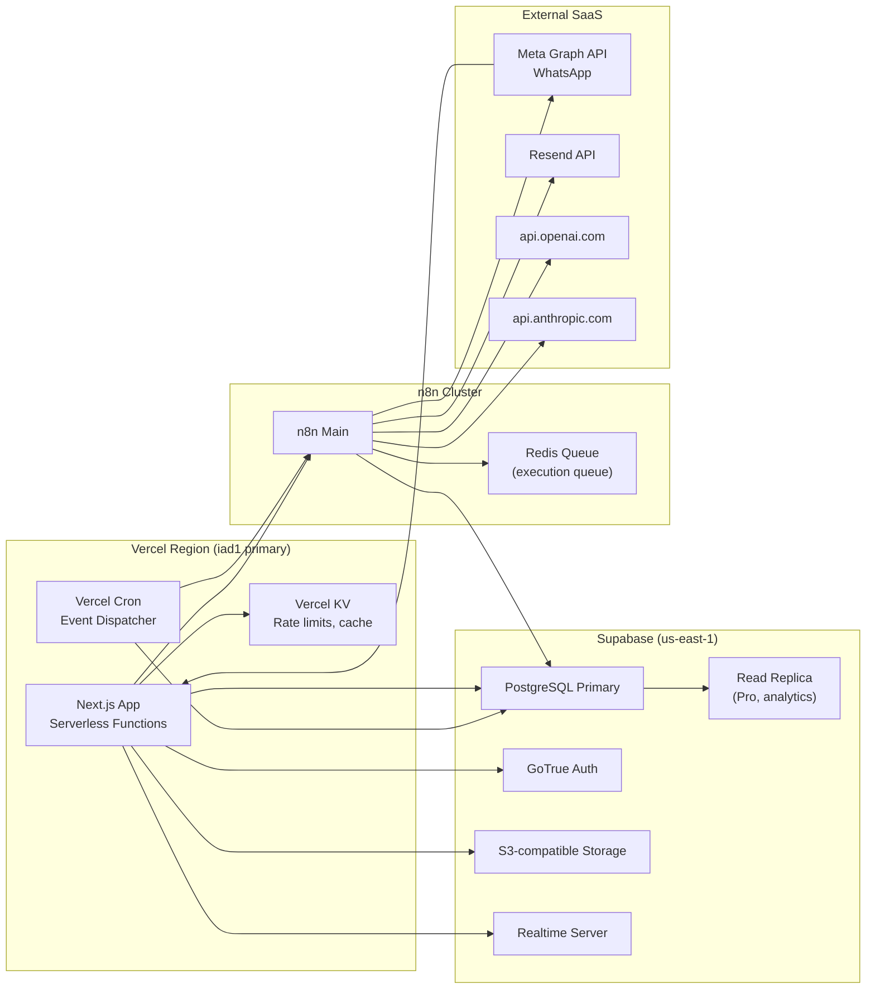

### 3.2 Service Catalog

| Service | Type | SLA Target | Owner |
|---|---|---|---|
| `talentos-web` | Vercel Serverless | 99.9% | App Eng |
| `talentos-edge` | Vercel Edge Middleware | 99.95% | Platform |
| `supabase-db` | Managed PostgreSQL | 99.9% (Pro) | Data Eng |
| `supabase-auth` | Managed Auth | 99.9% | Security |
| `supabase-storage` | Object Storage | 99.9% | Platform |
| `n8n-orchestrator` | Self-hosted workflow | 99.5% | Integration |
| `whatsapp-gateway` | Meta Cloud API | 99.5% (vendor) | Integration |
| `email-gateway` | Resend | 99.9% (vendor) | Integration |
| `ai-openai` | OpenAI API | 99.5% (vendor) | Integration |
| `ai-claude` | Anthropic API | 99.5% (vendor) | Integration |

### 3.3 Inter-Service Communication

| From | To | Protocol | Auth | Sync/Async |
|---|---|---|---|---|
| Browser → Next.js | HTTPS | Cookie JWT | Sync |
| Next.js → Supabase DB | PostgreSQL wire / REST | Anon key + JWT / Service role | Sync |
| Next.js → n8n | HTTPS webhook POST | HMAC-SHA256 | Async |
| n8n → Supabase | REST (PostgREST) | Service role key | Async |
| n8n → WhatsApp | HTTPS REST | Bearer token (per tenant) | Async |
| n8n → Resend | HTTPS REST | API key | Async |
| n8n → OpenAI/Claude | HTTPS REST | API key (platform) | Async |
| WhatsApp → Next.js | HTTPS webhook POST | HMAC signature | Async |
| Vercel Cron → Next.js | Internal HTTP | Cron secret | Async |

### 3.4 Service Dependencies & Failure Modes

| Service Down | User Impact | Degradation Strategy |
|---|---|---|
| Supabase DB | Full outage | Maintenance page; no writes |
| Supabase Auth | Cannot login | Cached session continues (1h) |
| n8n | No async notifications | In-app notifications still work; outbox queues |
| WhatsApp | No WA messages | Fall back to email; show in-app alert |
| Resend | No emails | In-app + WhatsApp fallback |
| OpenAI/Claude | No AI suggestions | Rule-based skill matching fallback |
| Vercel | Full outage | Status page; multi-region failover (Enterprise) |

---

## 4. Database Architecture

### 4.1 Data Platform Overview

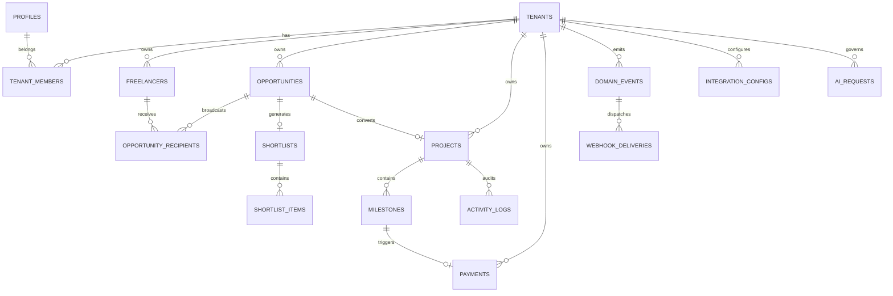

### 4.2 Schema Layers

| Layer | Tables | Purpose |
|---|---|---|
| **Core** | `tenants`, `profiles`, `tenant_members` | Identity and tenancy |
| **Domain** | `freelancers`, `opportunities`, `projects`, `milestones`, `payments` | Business aggregates |
| **Pipeline** | `opportunity_recipients`, `shortlists`, `shortlist_items` | Matching workflow |
| **Engagement** | `notifications`, `whatsapp_messages`, `email_logs` | Communication audit |
| **Event** | `domain_events`, `webhook_deliveries` | Event outbox + delivery tracking |
| **Intelligence** | `ai_requests`, `talent_match_scores` | AI governance |
| **Config** | `integration_configs` | Per-tenant credentials (encrypted) |
| **Analytics** | `v_*` views | Read-optimized reporting |

### 4.3 Partitioning & Indexing Strategy

```sql
-- Composite indexes: tenant_id always leading column
CREATE INDEX idx_projects_tenant_status ON projects(tenant_id, status);
CREATE INDEX idx_payments_tenant_status_created ON payments(tenant_id, status, created_at DESC);

-- Partial indexes for hot queries
CREATE INDEX idx_milestones_overdue ON milestones(tenant_id, due_date)
  WHERE status NOT IN ('approved', 'canceled');

-- GIN indexes for array search
CREATE INDEX idx_freelancers_skills ON freelancers USING GIN(skills);

-- Event outbox polling
CREATE INDEX idx_domain_events_pending ON domain_events(created_at)
  WHERE status = 'pending';
```

### 4.4 Read/Write Separation

| Workload | Target | Pattern |
|---|---|---|
| OLTP writes | Primary | Server Actions, API routes |
| OLTP reads (user-facing) | Primary | RSC, RLS-protected |
| Analytics dashboards | Read replica (Pro) | Materialized views, 60s cache |
| n8n batch queries | Primary (off-peak) | Service role, explicit `tenant_id` |
| Exports | Read replica | Streaming cursor, chunked |

### 4.5 Storage Architecture

| Bucket | Path Pattern | Access | Max Size |
|---|---|---|---|
| `tenant-logos` | `{tenant_id}/logo.{ext}` | Public read | 2 MB |
| `avatars` | `{user_id}/avatar.{ext}` | Public read | 2 MB |
| `deliverables` | `{tenant_id}/{project_id}/{milestone_id}/{file}` | Private, RLS | 50 MB |

### 4.6 Backup & Recovery

| Capability | Configuration |
|---|---|
| Daily backups | Supabase Pro automatic |
| Point-in-time recovery | 7-day window (Pro) |
| Migration versioning | `supabase/migrations/*.sql` in Git |
| Tenant export | Admin-triggered JSON/CSV export |
| RTO | 4 hours |
| RPO | 1 hour |

---

## 5. Event-Driven Architecture

### 5.1 Event-Driven Overview

TalentOS uses the **Transactional Outbox Pattern** to guarantee at-least-once delivery of domain events to n8n without dual-write inconsistencies.

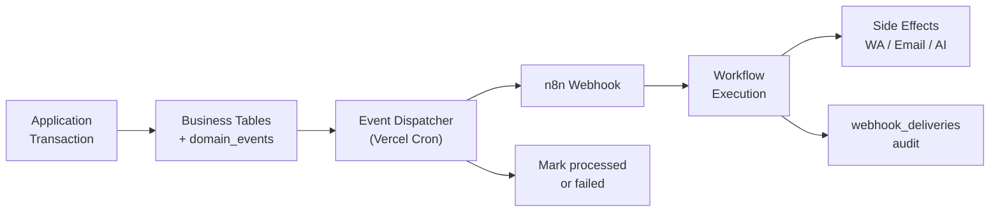

### 5.2 Domain Event Catalog

| Event | Producer | Consumers (n8n) | Priority |
|---|---|---|---|
| `tenant.created` | Auth signup | Welcome email, onboarding | P0 |
| `member.invited` | Admin invite | Invite email | P0 |
| `freelancer.created` | TalentService | Welcome WA/email (optional) | P1 |
| `opportunity.created` | OpportunityService | AI skill extraction | P1 |
| `opportunity.broadcast` | OpportunityService | WA + email to recipients | P0 |
| `opportunity.response` | DB trigger | Notify manager | P0 |
| `opportunity.expired` | Cron | Close + alert manager | P1 |
| `shortlist.finalized` | ShortlistService | AI comparison summary | P2 |
| `project.assigned` | ProjectService | WA + email to freelancer | P0 |
| `milestone.submitted` | MilestoneService | Notify manager | P0 |
| `milestone.approved` | MilestoneService | Payment created, notify admin | P0 |
| `milestone.overdue` | Cron | WA reminder + escalation | P1 |
| `payment.pending` | DB trigger | Admin notification | P0 |
| `payment.approved` | PaymentService | Freelancer notification | P0 |
| `payment.paid` | PaymentService | WA + email confirmation | P0 |
| `ai.match_requested` | OpportunityService | OpenAI talent ranking | P1 |
| `ai.summary_requested` | ShortlistService | Claude comparison | P2 |

### 5.3 Event Envelope Schema

```typescript
interface DomainEvent {
  id: string                    // UUID
  tenant_id: string
  event_type: string            // e.g. 'opportunity.broadcast'
  aggregate_type: string        // e.g. 'opportunity'
  aggregate_id: string
  idempotency_key: string       // Unique per logical action
  correlation_id: string        // Traces full request chain
  actor_id: string | null
  payload: Record<string, unknown>
  status: 'pending' | 'processing' | 'delivered' | 'failed' | 'dead_letter'
  retry_count: number
  max_retries: number           // default: 5
  scheduled_at: string          // ISO 8601 (for delayed events)
  created_at: string
  processed_at: string | null
}
```

### 5.4 Outbox Dispatcher

```typescript
// app/api/cron/dispatch-events/route.ts
// Runs every 1 minute via Vercel Cron
export async function GET(request: Request) {
  verifyCronSecret(request)

  const events = await supabaseAdmin
    .from('domain_events')
    .select('*')
    .eq('status', 'pending')
    .lte('scheduled_at', new Date().toISOString())
    .order('created_at')
    .limit(50)

  for (const event of events.data ?? []) {
    await dispatchToN8n(event)  // HMAC-signed POST
  }
}
```

### 5.5 Retry & Dead Letter Policy

| Attempt | Backoff | Action on Failure |
|---|---|---|
| 1 | Immediate | Retry |
| 2 | 30 seconds | Retry |
| 3 | 2 minutes | Retry |
| 4 | 10 minutes | Retry |
| 5 | 1 hour | Dead letter |
| Dead letter | — | Admin alert, manual replay UI |

### 5.6 Realtime vs Event-Driven

| Use Case | Mechanism | Why |
|---|---|---|
| In-app notification badge | Supabase Realtime | Sub-second UX |
| WhatsApp broadcast | Event outbox → n8n | Durable, retriable |
| Kanban status update | Realtime + RLS | Collaborative UI |
| Payment approval email | Event outbox → n8n | Reliable delivery |
| AI match results | Event → n8n → DB write → Realtime | Long-running |

---

## 6. Webhook Architecture

### 6.1 Webhook Gateway Design

All inbound webhooks flow through a **centralized gateway** with verification, normalization, and idempotency.

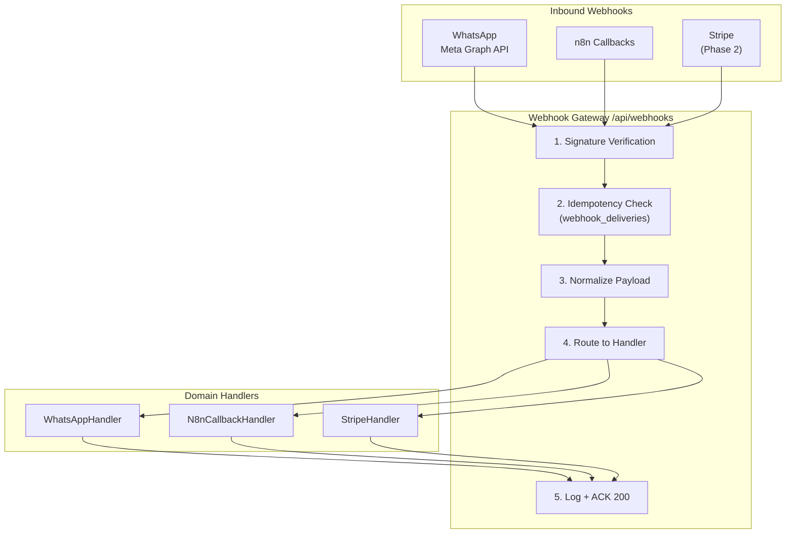

### 6.2 Inbound Webhook Endpoints

| Endpoint | Source | Verification | Idempotency Key |
|---|---|---|---|
| `GET/POST /api/webhooks/whatsapp` | Meta | `X-Hub-Signature-256` HMAC | `wa_message_id` |
| `POST /api/webhooks/n8n` | n8n | `X-Webhook-Signature` HMAC | `X-Idempotency-Key` header |
| `POST /api/webhooks/stripe` | Stripe | Stripe signature | `event.id` |

### 6.3 Outbound Webhook Contract (App → n8n)

```http
POST {tenant.n8n_webhook_base}/{event_type}
Content-Type: application/json
X-Webhook-Signature: sha256={hmac}
X-Correlation-ID: {correlation_id}
X-Idempotency-Key: {idempotency_key}
X-Tenant-ID: {tenant_id}

{
  "event": "opportunity.broadcast",
  "tenant_id": "uuid",
  "correlation_id": "uuid",
  "timestamp": "2026-07-01T12:00:00Z",
  "actor_id": "uuid",
  "data": { ... }
}
```

### 6.4 Webhook Security Controls

| Control | Implementation |
|---|---|
| Signature verification | HMAC-SHA256 on raw body |
| Timestamp tolerance | Reject if > 5 min old (replay protection) |
| IP allowlisting | Meta webhook IPs (optional, defense in depth) |
| Idempotency store | `webhook_deliveries` table, 72h TTL |
| Rate limiting | 100 req/min per source IP |
| Payload size limit | 1 MB max |
| Secret rotation | Per-tenant webhook secrets in `integration_configs` |

### 6.5 WhatsApp Inbound Flow

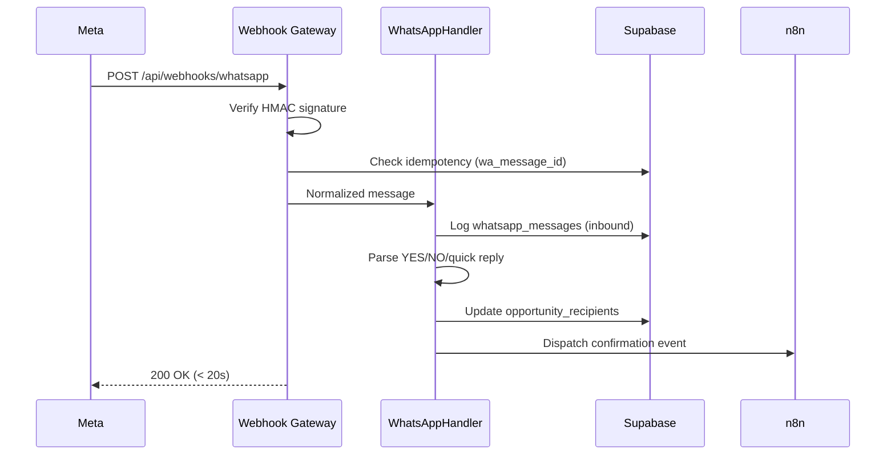

---

## 7. Workflow Engine Design

### 7.1 n8n as Workflow Engine

n8n serves as the **durable orchestration layer** for all async, multi-step, retryable processes. The application tier remains stateless; workflow state lives in n8n execution logs + Supabase audit tables.

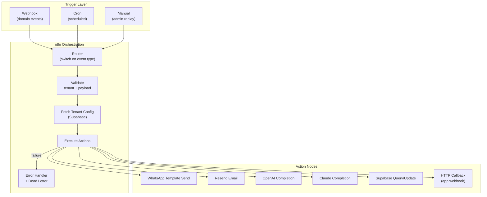

### 7.2 Workflow Registry

| ID | Workflow | Trigger | Steps | SLA |
|---|---|---|---|---|
| WF-01 | Tenant onboarding | `tenant.created` | Email → in-app checklist | 30s |
| WF-02 | Opportunity broadcast | `opportunity.broadcast` | Split recipients → WA + email loop | 2 min |
| WF-03 | Response notification | `opportunity.response` | In-app + email to manager | 15s |
| WF-04 | AI talent matching | `ai.match_requested` | OpenAI rank → write scores → notify | 60s |
| WF-05 | Project assigned | `project.assigned` | WA + email to freelancer | 30s |
| WF-06 | Milestone submitted | `milestone.submitted` | Email to manager | 15s |
| WF-07 | Payment lifecycle | `payment.*` | Status-based WA + email | 30s |
| WF-08 | Overdue milestones | Cron daily 09:00 | Query → escalate loop | 5 min |
| WF-09 | Opportunity expiry | Cron hourly | Close stale → notify | 2 min |
| WF-10 | WhatsApp inbound | Webhook callback | Parse → update → confirm | 10s |
| WF-11 | Team invite | `member.invited` | Email with magic link | 15s |
| WF-12 | Weekly AI digest | Cron Monday 08:00 | Claude summarize → email admin | 10 min |
| WF-13 | Notification cleanup | Cron weekly | Purge old records | 5 min |
| WF-14 | Event dead letter | `event.failed` | Alert ops + log | 15s |

### 7.3 Workflow Design Patterns

| Pattern | Usage | Example |
|---|---|---|
| **Fan-out** | Broadcast to N recipients | WF-02: split recipients |
| **Saga** | Multi-step with compensation | WF-07: payment approval chain |
| **Circuit breaker** | Provider failure | Skip WA after 3 fails, email only |
| **Idempotent step** | Safe retries | Check `whatsapp_messages.wa_message_id` |
| **Delayed execution** | Scheduled reminders | `scheduled_at` on domain events |
| **Human-in-the-loop** | Admin approval | Payment approve before WF-07 payout step |

### 7.4 AI Workflow Design (OpenAI + Claude)

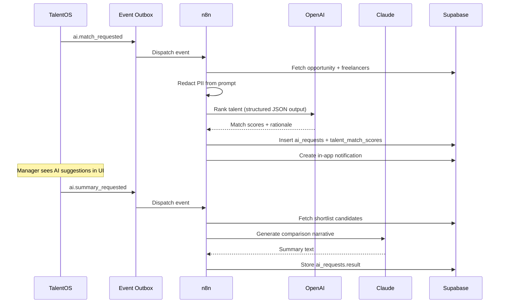

**AI Governance Rules:**
- Platform-level API keys (not per-tenant) with usage metering per tenant
- PII redaction before prompt construction (phone, email stripped)
- All prompts and responses logged in `ai_requests` for audit
- Tenant feature flag: `settings.features.ai_matching`
- Cost caps per tenant tier (Starter: 100 req/mo, Pro: 1000, Enterprise: unlimited)
- Fallback to rule-based `suggest_talent_for_opportunity()` SQL function on AI failure

### 7.5 Email Workflow (Resend)

| Template | Trigger | Recipient |
|---|---|---|
| `welcome-admin` | `tenant.created` | Admin |
| `team-invite` | `member.invited` | Invitee |
| `opportunity-digest` | `opportunity.broadcast` | Freelancer (if no WA) |
| `response-alert` | `opportunity.response` | Manager |
| `project-assigned` | `project.assigned` | Freelancer |
| `milestone-review` | `milestone.submitted` | Manager |
| `payment-approved` | `payment.approved` | Freelancer |
| `payment-sent` | `payment.paid` | Freelancer |
| `weekly-digest` | Cron | Admin |

---

## 8. Multi-Tenant Design

### 8.1 Tenancy Model

**Pattern:** Shared database, shared schema, row-level isolation.

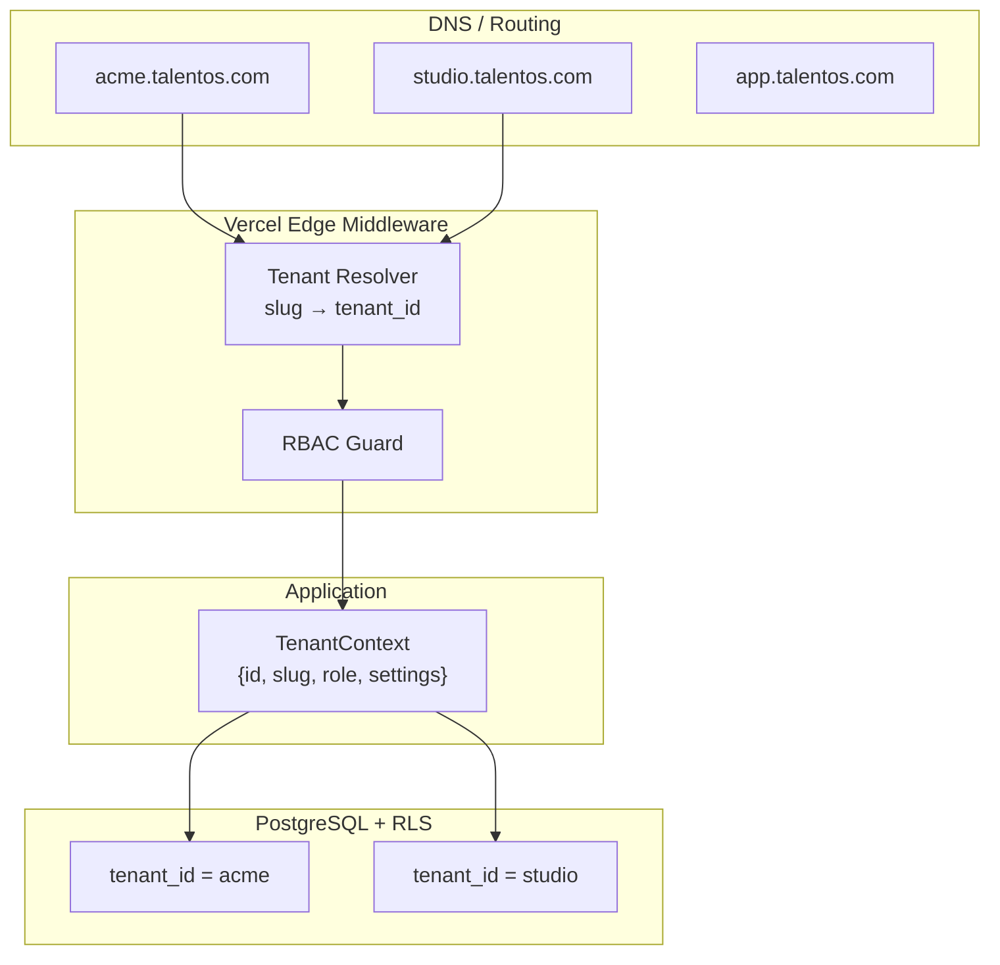

### 8.2 Isolation Matrix

| Layer | Mechanism | Bypass Risk |
|---|---|---|
| DNS | Subdomain → slug | Low (membership verified) |
| Middleware | Session + tenant membership | Low |
| Application | `tenant_id` from session only | Medium (dev error) |
| PostgreSQL RLS | `auth.user_tenant_ids()` | Low (if policies correct) |
| Storage RLS | Path prefix `{tenant_id}/` | Low |
| n8n | Explicit `tenant_id` in every query | Medium (service role) |
| AI | Tenant-scoped prompts, no cross-tenant context | Medium (prompt injection) |
| Cache | Key prefix `t:{tenant_id}:` | Medium (key collision) |

### 8.3 Tenant Data Model

```typescript
interface TenantContext {
  id: string
  slug: string
  name: string
  role: 'admin' | 'talent_manager' | 'freelancer'
  settings: {
    features: {
      whatsapp: boolean
      email: boolean
      ai_matching: boolean
      ai_summaries: boolean
      bulk_import: boolean
    }
    notifications: {
      whatsapp_enabled: boolean
      email_enabled: boolean
      overdue_reminder_days: number
    }
    limits: {
      max_freelancers: number
      max_whatsapp_monthly: number
      max_ai_requests_monthly: number
    }
  }
  subscription: {
    status: 'trialing' | 'active' | 'past_due' | 'canceled' | 'suspended'
    tier: 'starter' | 'pro' | 'enterprise'
  }
}
```

### 8.4 Subscription Tier Enforcement

| Tier | Freelancers | WA/mo | AI/mo | Team | Price |
|---|---|---|---|---|---|
| Starter | 50 | 500 | 100 | 2 | $49 |
| Pro | 200 | 2,000 | 1,000 | 10 | $149 |
| Enterprise | Unlimited | Custom | Unlimited | Unlimited | Custom |

Enforced at: middleware (feature flags), Server Actions (limit checks), n8n (usage counters), AI gateway (rate limit).

### 8.5 Tenant Lifecycle

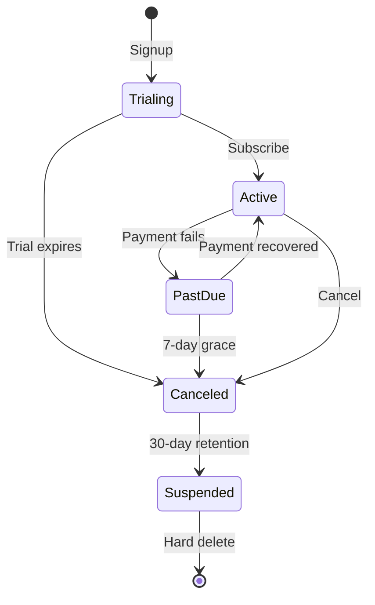

---

## 9. Security Model

### 9.1 Security Architecture

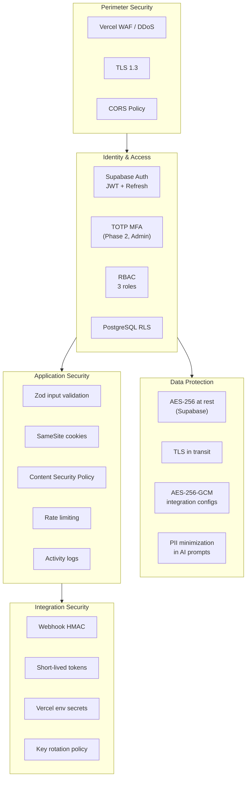

### 9.2 Authentication & Authorization

| Layer | Control | Detail |
|---|---|---|
| Authentication | Supabase Auth | Email/password, magic link, invite tokens |
| Session | HTTP-only cookies | 1h access, 30d refresh, auto-refresh in middleware |
| Authorization (app) | RBAC permission matrix | 30+ granular permissions |
| Authorization (DB) | RLS policies | Per-table, per-role policies |
| Service access | Service role key | Server-only; never in client bundle |
| API access (future) | Tenant API keys | Scoped, rate-limited |

### 9.3 Role-Permission Summary

| Resource | Admin | Talent Manager | Freelancer |
|---|---|---|---|
| Tenant settings | CRUD | — | — |
| Team management | CRUD | — | — |
| Integrations | CRUD | — | — |
| Freelancers | CRUD | CRUD | Self (read/update) |
| Opportunities | CRUD | CRUD | Read (assigned) |
| Projects | CRUD | CRUD | Read (assigned) |
| Milestones | CRUD | Review | Submit |
| Payments | Approve/Pay | Read | Read (own) |
| Analytics | Full | Full | — |
| AI features | Configure | Use | — |

### 9.4 Data Classification

| Class | Examples | Controls |
|---|---|---|
| **Public** | Agency name, logo | CDN cached |
| **Internal** | Project briefs, ratings | RLS + RBAC |
| **Confidential** | Payment amounts, bank refs | Admin/manager only |
| **Restricted** | Integration tokens, API keys | Encrypted, admin only |
| **PII** | Email, phone, name | RLS, GDPR export/delete, AI redaction |

### 9.5 Compliance Framework

| Regulation | Requirements | Implementation |
|---|---|---|
| **GDPR** | Consent, export, deletion, breach notification | Data export API, tenant delete cascade, 72h breach process |
| **SOC 2 (target)** | Access controls, audit logs, encryption | Activity logs, RLS, encrypted storage |
| **PCI DSS** | No card data stored (Stripe handles) | Stripe Connect Phase 2 |
| **Meta WhatsApp Policy** | Opt-in, templates, opt-out | Consent on phone capture, STOP handler |

### 9.6 Threat Model (STRIDE)

| Threat | Vector | Mitigation |
|---|---|---|
| **Spoofing** | Fake webhook | HMAC signature verification |
| **Tampering** | Modified JWT | Supabase JWT verification, short TTL |
| **Repudiation** | Deny action | Immutable `activity_logs` |
| **Info Disclosure** | Cross-tenant query | RLS + automated tests |
| **DoS** | API flood | Vercel rate limiting, WAF |
| **Elevation** | Freelancer → admin | RBAC middleware + RLS role checks |
| **Prompt injection** | Malicious brief text | Input sanitization, system prompt guardrails |

### 9.7 Security Testing

- [ ] RLS policy test suite (per table, per role)
- [ ] OWASP ZAP scan on staging
- [ ] Webhook signature bypass attempts
- [ ] Cross-tenant IDOR fuzzing
- [ ] Dependency scanning (Dependabot)
- [ ] Secret scanning (GitHub Advanced Security)
- [ ] Annual penetration test (Enterprise tier)

---

## 10. Scalability Model

### 10.1 Scalability Dimensions

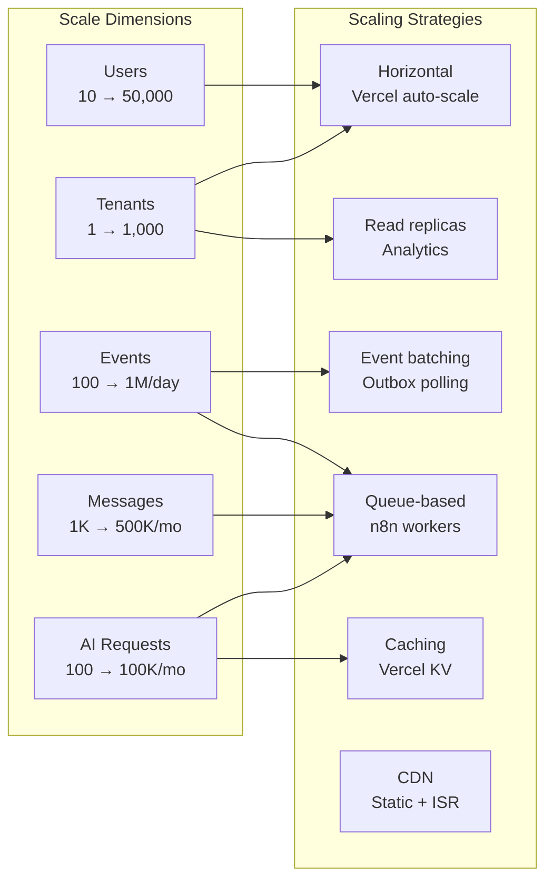

### 10.2 Capacity Planning

| Metric | MVP (Month 1) | Growth (Month 12) | Scale (Month 24) |
|---|---|---|---|
| Tenants | 10 | 200 | 1,000 |
| Freelancers | 500 | 20,000 | 100,000 |
| Concurrent users | 50 | 2,000 | 10,000 |
| API requests/day | 10K | 500K | 2M |
| Domain events/day | 1K | 50K | 200K |
| WhatsApp messages/mo | 5K | 200K | 1M |
| AI requests/mo | 500 | 20K | 100K |
| Storage | 10 GB | 500 GB | 2 TB |

### 10.3 Horizontal Scaling

| Component | Scaling Model | Limit |
|---|---|---|
| Next.js (Vercel) | Auto-scale serverless functions | 30s function timeout |
| Edge Middleware | Global edge network | 1 MB response limit |
| Supabase DB | Vertical → read replicas → connection pooler | Connection limits |
| n8n | Add worker instances behind Redis queue | Self-managed |
| Supabase Storage | Automatic (S3-backed) | Bucket policies |
| Vercel KV | Automatic | Per-plan limits |

### 10.4 Caching Strategy

| Data | Cache | TTL | Invalidation |
|---|---|---|---|
| Tenant settings | Vercel KV `t:{id}:settings` | 5 min | On update |
| Dashboard metrics | ISR + KV | 60s | On mutation webhook |
| Freelancer search | React Query (client) | 30s | On CRUD |
| Analytics views | Materialized view | 5 min | Cron refresh |
| AI match results | DB + KV | 1 hour | On opportunity update |
| Static assets | CDN | 1 year | Hash-based |

### 10.5 Database Scaling Path

```
Phase 1 (0-100 tenants)
  └── Single Supabase Pro instance
  └── PgBouncer connection pooling (built-in)
  └── Composite indexes with tenant_id leading

Phase 2 (100-500 tenants)
  └── Read replica for analytics queries
  └── Materialized views refreshed every 5 min
  └── Partition activity_logs by month

Phase 3 (500+ tenants)
  └── Dedicated Supabase project for Enterprise tier
  └── Table partitioning: activity_logs, domain_events, whatsapp_messages
  └── Archive cold data to Supabase Storage (Parquet)

Phase 4 (1000+ tenants)
  └── Evaluate Citus/sharding or tenant-tier DB isolation
  └── Event streaming (Supabase → Kafka) for analytics pipeline
```

### 10.6 Event Throughput Scaling

| Volume | Dispatcher | n8n |
|---|---|---|
| < 1K events/day | Vercel Cron (1 min) | Single instance |
| 1K–50K events/day | Cron (30s) + batch 100 | 2 workers |
| 50K–200K events/day | Dedicated dispatcher function | 4 workers + Redis |
| > 200K events/day | Kafka/SQS queue + consumer | Auto-scale worker pool |

### 10.7 Observability Stack

| Signal | Tool | Alerts |
|---|---|---|
| APM / latency | Vercel Analytics | P95 > 2s |
| Error rate | Vercel Functions logs | > 1% 5xx |
| DB performance | Supabase Dashboard | Query > 500ms |
| Event lag | Custom metric (outbox depth) | > 100 pending |
| n8n failures | n8n execution log | > 5 failures/hour |
| WA delivery | `whatsapp_messages.status` | < 90% delivered |
| AI cost | `ai_requests` aggregation | > 80% of tenant cap |
| Uptime | Better Stack / Checkly | < 99.5% |

### 10.8 Disaster Recovery

| Scenario | RTO | RPO | Procedure |
|---|---|---|---|
| Vercel outage | 1h | 0 | Multi-region failover (Enterprise) |
| Supabase primary failure | 2h | 1h | Failover to replica (Pro) |
| n8n failure | 4h | 0 | Events queue in outbox; replay on recovery |
| Data corruption | 4h | 1h | PITR restore to new instance |
| Credential compromise | 1h | 0 | Rotate all tenant integration tokens |

### 10.9 Cost Model (Estimated Monthly)

| Scale | Vercel | Supabase | n8n | WhatsApp | AI | Total |
|---|---|---|---|---|---|---|
| MVP (10 tenants) | $20 | $25 | $20 | $50 | $30 | ~$145 |
| Growth (200 tenants) | $150 | $75 | $50 | $800 | $300 | ~$1,375 |
| Scale (1000 tenants) | $400 | $300 | $200 | $4,000 | $1,500 | ~$6,400 |

*WhatsApp and AI costs are primarily pass-through to tenants at Pro+ tiers.*

---

## Appendix A: Deployment Architecture

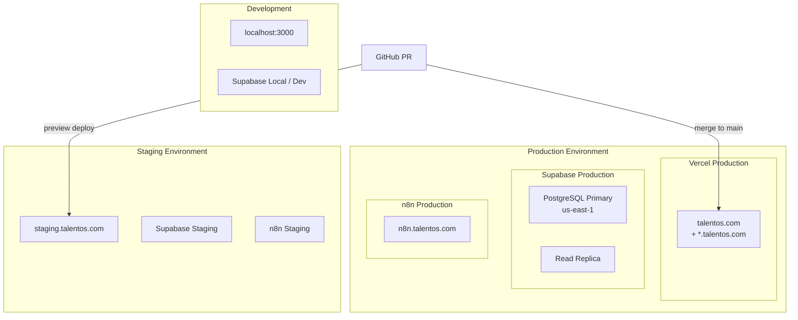

## Appendix B: Correlation ID Propagation

```
Browser request
  → X-Correlation-ID: {uuid}        (generated in middleware)
  → domain_events.correlation_id
  → n8n X-Correlation-ID header
  → ai_requests.correlation_id
  → activity_logs.metadata.correlation_id
  → webhook_deliveries.correlation_id
```

## Appendix C: Implementation Roadmap

| Phase | Focus | Architecture Milestone |
|---|---|---|
| **Phase 1** | MVP core | Monolith + outbox + basic n8n workflows |
| **Phase 2** | AI + email | AI gateway, Resend integration, match scoring |
| **Phase 3** | Scale | Read replicas, materialized views, event batching |
| **Phase 4** | Enterprise | SSO, dedicated DB, multi-region, API platform |

---

*This document is the authoritative enterprise architecture reference for TalentOS. Implementation details in sibling documents must align with the patterns defined here.*
