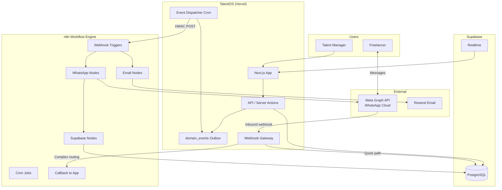
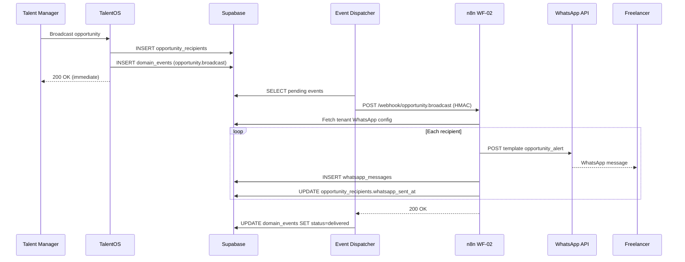
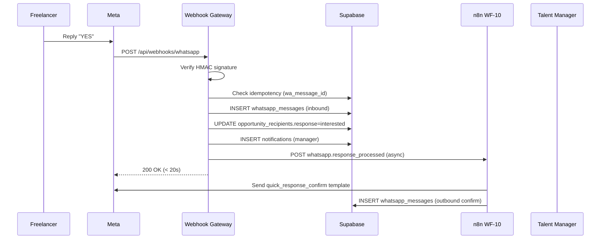
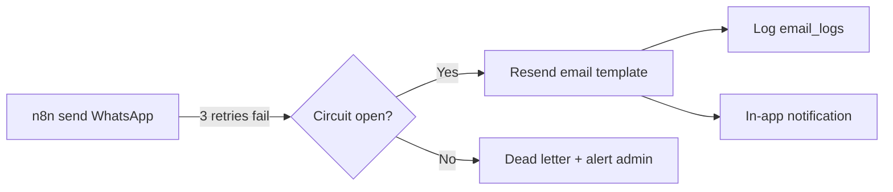
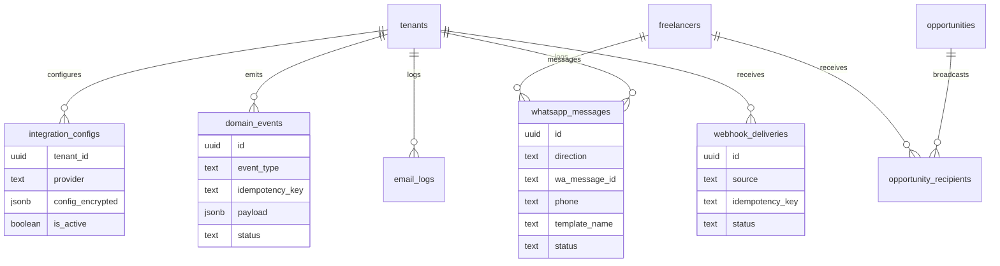
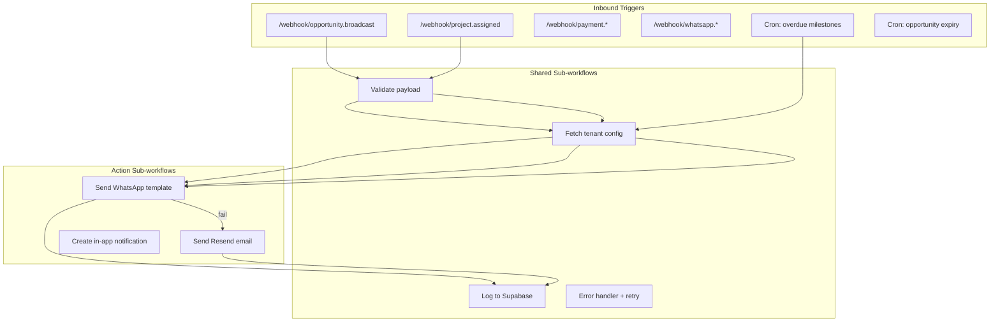
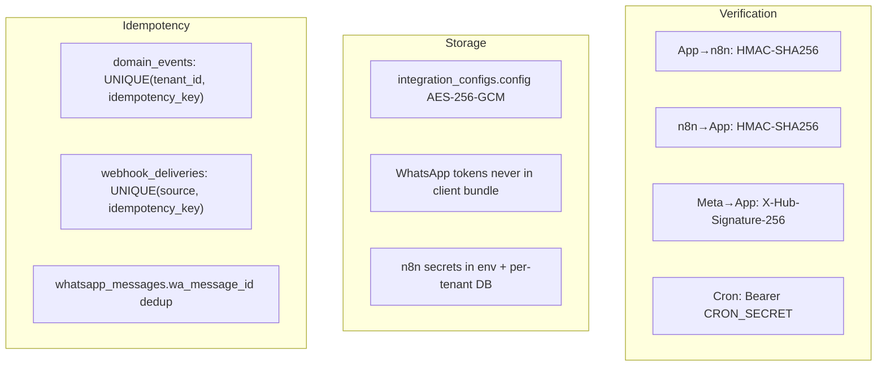

# TalentOS — WhatsApp + n8n Integration Architecture

**Version:** 1.0  
**Status:** Implementation Reference  
**Components:** TalentOS (Next.js) · n8n · WhatsApp Cloud API · Supabase · Resend (email fallback)

---

## 1. Executive Summary

TalentOS uses **n8n as the durable orchestration layer** between the application and external messaging providers. The Next.js app never calls WhatsApp directly from user-facing request paths — it writes to the **transactional outbox** (`domain_events`), and a dispatcher delivers events to n8n, which handles WhatsApp sends, retries, email fallback, and inbound reply parsing.

**Design goals:**
- At-least-once delivery with idempotency
- Per-tenant WhatsApp credentials
- Sub-20s webhook ACK to Meta (async processing)
- Circuit breaker: WhatsApp failure → email fallback
- Full audit trail in `whatsapp_messages` + `email_logs`

---

## 2. System Context



---

## 3. Integration Boundaries

| Responsibility | Owner | Notes |
|----------------|-------|-------|
| Business logic, RBAC | TalentOS | Opportunities, projects, payments |
| Event emission | TalentOS → `domain_events` | Same DB transaction as state change |
| Event dispatch | TalentOS cron `/api/cron/dispatch-events` | Polls outbox, POSTs to n8n |
| Message orchestration | n8n | Fan-out, retry, fallback, templating |
| WhatsApp API calls | n8n (primary) | Per-tenant token from `integration_configs` |
| Inbound webhook receipt | TalentOS `/api/webhooks/whatsapp` | Meta requires HTTPS endpoint on app domain |
| Inbound quick replies (YES/NO) | TalentOS (sync) | Must update DB within 20s |
| Inbound complex routing | n8n via callback | Unrecognized messages, escalations |
| Message audit log | Supabase | `whatsapp_messages`, `email_logs` |
| Delivery status updates | n8n → Supabase | Meta status webhooks via app gateway |

---

## 4. End-to-End Flows

### 4.1 Outbound: Opportunity Broadcast



### 4.2 Inbound: Freelancer Quick Reply (YES/NO)



### 4.3 Failure: WhatsApp Down → Email Fallback



---

## 5. Event Catalog (n8n Triggers)

| Event | Source | n8n Workflow | WhatsApp | Email |
|-------|--------|--------------|----------|-------|
| `tenant.created` | Signup | WF-01 | — | Welcome |
| `member.invited` | Admin invite | WF-11 | — | Invite link |
| `opportunity.broadcast` | Broadcast action | WF-02 | `opportunity_alert` | Fallback |
| `opportunity.response` | DB trigger | WF-03 | — | Manager alert |
| `opportunity.expired` | Cron | WF-09 | — | Manager alert |
| `project.assigned` | Project create | WF-04 | `project_assigned` | ✓ |
| `milestone.submitted` | Submit action | WF-05 | — | Manager |
| `milestone.overdue` | Cron | WF-08 | `milestone_reminder` | Escalation |
| `payment.approved` | Admin action | WF-07 | `payment_approved` | ✓ |
| `payment.paid` | Mark paid | WF-07 | `payment_sent` | ✓ |
| `whatsapp.inbound` | Webhook gateway | WF-10 | Confirm template | — |
| `whatsapp.response_processed` | Quick reply handler | WF-10 | `quick_response_confirm` | — |

---

## 6. Data Model (Integration Tables)



### `integration_configs` per tenant

```typescript
// provider: 'whatsapp'
interface WhatsAppIntegrationConfig {
  phone_number_id: string
  business_account_id: string
  access_token: string      // encrypted at rest
  verify_token: string
}

// provider: 'n8n'
interface N8nIntegrationConfig {
  webhook_base_url: string    // e.g. https://n8n.talentos.com/webhook
  webhook_secret: string      // HMAC shared secret
  is_active: boolean
}
```

---

## 7. Message Contracts

### 7.1 App → n8n (Outbound Event)

```http
POST {n8n_webhook_base}/{event_type}
Content-Type: application/json
X-Webhook-Signature: sha256={hmac_hex}
X-Correlation-ID: {uuid}
X-Idempotency-Key: {tenant_id}:{event_type}:{aggregate_id}
X-Tenant-ID: {tenant_id}

{
  "event": "opportunity.broadcast",
  "tenant_id": "550e8400-e29b-41d4-a716-446655440000",
  "correlation_id": "660e8400-e29b-41d4-a716-446655440001",
  "idempotency_key": "opp-broadcast:abc123",
  "timestamp": "2026-07-01T12:00:00.000Z",
  "actor_id": "770e8400-e29b-41d4-a716-446655440002",
  "data": {
    "opportunity_id": "abc123",
    "title": "Brand Video Editor",
    "budget": 2500,
    "currency": "USD",
    "response_deadline": "2026-07-05T18:00:00Z",
    "agency_name": "Acme Creative",
    "agency_slug": "acme-creative",
    "recipients": [
      {
        "recipient_id": "r1",
        "freelancer_id": "f1",
        "full_name": "Alex Chen",
        "phone": "+14155551234"
      }
    ]
  }
}
```

**HMAC computation:**
```typescript
const signature = createHmac('sha256', webhook_secret)
  .update(JSON.stringify(payload))
  .digest('hex')
// Header: X-Webhook-Signature: sha256={signature}
```

### 7.2 n8n → WhatsApp Cloud API

```http
POST https://graph.facebook.com/v21.0/{phone_number_id}/messages
Authorization: Bearer {tenant_access_token}
Content-Type: application/json

{
  "messaging_product": "whatsapp",
  "to": "14155551234",
  "type": "template",
  "template": {
    "name": "opportunity_alert",
    "language": { "code": "en" },
    "components": [
      {
        "type": "body",
        "parameters": [
          { "type": "text", "text": "Alex Chen" },
          { "type": "text", "text": "Acme Creative" },
          { "type": "text", "text": "Brand Video Editor" },
          { "type": "text", "text": "2500" },
          { "type": "text", "text": "USD" },
          { "type": "text", "text": "Jul 5, 2026" },
          { "type": "text", "text": "https://acme.talentos.com/opportunities/abc?ref=wa" }
        ]
      },
      {
        "type": "button",
        "sub_type": "quick_reply",
        "index": "1",
        "parameters": [{ "type": "payload", "payload": "INTERESTED" }]
      }
    ]
  }
}
```

### 7.3 Meta → App (Inbound Webhook)

```json
{
  "object": "whatsapp_business_account",
  "entry": [{
    "id": "WABA_ID",
    "changes": [{
      "field": "messages",
      "value": {
        "messaging_product": "whatsapp",
        "metadata": {
          "display_phone_number": "15551234567",
          "phone_number_id": "123456789"
        },
        "messages": [{
          "from": "14155551234",
          "id": "wamid.HBgL...",
          "timestamp": "1719850000",
          "text": { "body": "YES" },
          "type": "text"
        }]
      }
    }]
  }]
}
```

### 7.4 n8n → App (Callback)

```http
POST /api/webhooks/n8n
X-Webhook-Signature: sha256={hmac}
X-Idempotency-Key: {uuid}

{
  "event": "whatsapp.send_completed",
  "tenant_id": "uuid",
  "data": {
    "wa_message_id": "wamid.xxx",
    "freelancer_id": "uuid",
    "entity_type": "opportunity",
    "entity_id": "uuid",
    "status": "sent"
  }
}
```

---

## 8. n8n Workflow Topology



### Workflow registry

| ID | Name | Trigger | Concurrency |
|----|------|---------|-------------|
| WF-02 | Opportunity Broadcast | `opportunity.broadcast` | Fan-out per recipient |
| WF-03 | Response Alert | `opportunity.response` | Single |
| WF-04 | Project Assigned | `project.assigned` | Single |
| WF-07 | Payment Lifecycle | `payment.*` | Single |
| WF-08 | Overdue Reminders | Cron 09:00 UTC | Per-tenant batch |
| WF-09 | Opportunity Expiry | Cron hourly | Per-tenant batch |
| WF-10 | WhatsApp Inbound | `whatsapp.*` | Single |

---

## 9. Security Architecture



| Threat | Mitigation |
|--------|------------|
| Webhook spoofing | HMAC verification on all endpoints |
| Replay attacks | Idempotency store (72h TTL) |
| Token leakage | Encrypted `integration_configs`; service role only |
| Cross-tenant send | n8n always fetches config by `tenant_id` from payload |
| Meta policy violation | Template-only outbound; opt-in on phone capture |
| PII in logs | Phone masked in app logs; full phone in DB only |

---

## 10. Retry & Dead Letter Policy

### Event dispatcher (App → n8n)

| Attempt | Backoff | Max |
|---------|---------|-----|
| 1 | Immediate | — |
| 2 | 30s | — |
| 3 | 2min | — |
| 4 | 10min | — |
| 5 | 1hr | → `dead_letter` |

### n8n WhatsApp send

| Error Code | Action |
|------------|--------|
| `130429` Rate limit | Retry after 1hr |
| `131026` Undeliverable | Skip; log; notify manager |
| `131047` Re-engagement needed | Use approved template only |
| `190` Token expired | Alert admin; pause tenant WA |
| 3 consecutive failures | Circuit open → email fallback |

---

## 11. Deployment Topology

```
Production:
  app.talentos.com          → Vercel (Next.js)
  *.talentos.com            → Tenant subdomains
  n8n.talentos.com          → n8n (self-hosted or Cloud)
  graph.facebook.com        → Meta WhatsApp API

Environment variables (TalentOS):
  N8N_WEBHOOK_BASE_URL      → Default n8n base (tenant override in DB)
  WHATSAPP_VERIFY_TOKEN     → Meta webhook verification
  WHATSAPP_APP_SECRET       → Meta HMAC verification
  CRON_SECRET               → Event dispatcher auth
  ENCRYPTION_KEY            → integration_configs encryption

Environment variables (n8n):
  SUPABASE_URL
  SUPABASE_SERVICE_ROLE_KEY
  RESEND_API_KEY
  TALENTOS_CALLBACK_URL     → https://app.talentos.com/api/webhooks/n8n
  TALENTOS_CALLBACK_SECRET  → HMAC secret for callbacks
```

### Vercel Cron (vercel.json)

```json
{
  "crons": [{
    "path": "/api/cron/dispatch-events",
    "schedule": "* * * * *"
  }]
}
```

---

## 12. Observability

| Metric | Source | Alert |
|--------|--------|-------|
| Outbox depth | `domain_events WHERE status=pending` | > 100 |
| Dispatch lag | `now() - oldest pending created_at` | > 5 min |
| WA delivery rate | `whatsapp_messages.status=delivered` | < 90% |
| n8n failure rate | n8n execution log | > 5/hour |
| Email fallback rate | `email_logs` vs `whatsapp_messages` | > 20% |
| Inbound processing time | `webhook_deliveries` | P95 > 10s |

**Correlation:** `correlation_id` flows: middleware → `domain_events` → n8n header → `whatsapp_messages.metadata` → `activity_logs`.

---

## 13. Implementation Map (Codebase)

| File | Purpose |
|------|---------|
| `lib/integrations/events.ts` | `emitEvent()` — write to outbox |
| `lib/integrations/n8n.ts` | `dispatchToN8n()` — HMAC POST |
| `lib/integrations/whatsapp.ts` | Inbound parser, quick reply handler |
| `lib/integrations/encryption.ts` | Config encrypt/decrypt |
| `app/api/cron/dispatch-events/route.ts` | Outbox poller |
| `app/api/webhooks/whatsapp/route.ts` | Meta webhook gateway |
| `app/api/webhooks/n8n/route.ts` | n8n callback receiver |
| `n8n/*.json` | Exportable workflow definitions |
| `supabase/migrations/005_*.sql` | `domain_events`, `webhook_deliveries` |
| `supabase/migrations/006_*.sql` | RLS, integrity |

---

## 14. Setup Checklist

### Meta / WhatsApp
- [ ] Create Meta Business App with WhatsApp product
- [ ] Add phone number; complete business verification
- [ ] Submit templates: `opportunity_alert`, `project_assigned`, `payment_sent`, `quick_response_confirm`
- [ ] Configure webhook URL: `https://app.talentos.com/api/webhooks/whatsapp`
- [ ] Set verify token (matches `WHATSAPP_VERIFY_TOKEN`)
- [ ] Subscribe to `messages` field

### n8n
- [ ] Deploy n8n with Redis queue (production)
- [ ] Import workflows from `n8n/` directory
- [ ] Set environment variables (Supabase, Resend)
- [ ] Create master webhook: `/webhook/talentos` (router) OR per-event webhooks
- [ ] Test with sample `opportunity.broadcast` payload

### TalentOS (per tenant)
- [ ] Admin → Settings → Integrations
- [ ] Enter WhatsApp Phone Number ID + access token
- [ ] Enter n8n webhook base URL + secret
- [ ] Send test message
- [ ] Verify `whatsapp_messages` row created

---

## 15. Related Documents

| Document | Focus |
|----------|-------|
| [n8n Workflows](09-n8n-workflows.md) | Per-workflow step specs |
| [WhatsApp Integration](10-whatsapp-integration.md) | Templates, Meta API detail |
| [Enterprise Architecture](11-enterprise-system-architecture.md) | Event outbox, webhook gateway |
| [API Architecture](05-api-architecture.md) | Endpoint catalog |

---

*This document is the authoritative reference for WhatsApp + n8n integration in TalentOS.*
