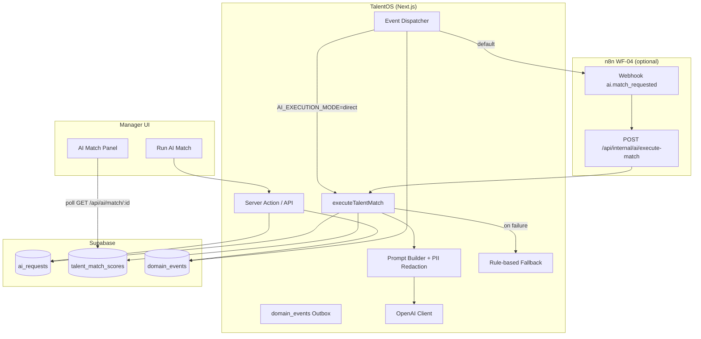
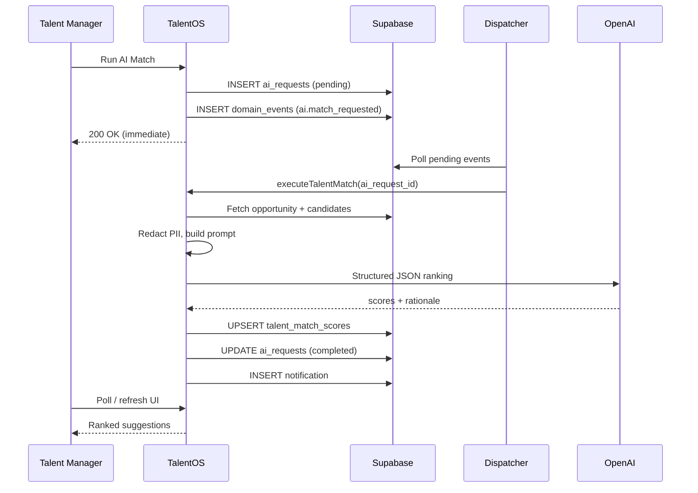

# TalentOS — AI Talent Matching Service

**Version:** 1.0  
**Status:** Implementation Reference  
**Providers:** OpenAI GPT-4o (primary) · Rule-based SQL fallback

---

## 1. Executive Summary

The AI Talent Matching Service ranks freelancers against an opportunity using structured LLM inference, with governance, audit logging, and automatic fallback to the existing `suggest_talent_for_opportunity()` SQL function when AI is unavailable or over quota.

**Design goals:**
- Async execution (never block manager UI on LLM latency)
- PII redaction before prompts (email/phone stripped; first name only)
- Per-tenant feature flags and monthly cost caps
- Full audit in `ai_requests` + `talent_match_scores`
- Idempotent event dispatch via `domain_events` outbox

---

## 2. Architecture



---

## 3. Execution Modes

| Mode | Env | Flow |
|------|-----|------|
| **Direct** | `AI_EXECUTION_MODE=direct` | Cron dispatcher runs `executeTalentMatch()` in-app |
| **n8n** | default (or unset) | Cron → n8n WF-04 → internal execute API |

Direct mode is recommended for development. Production can use n8n for observability, retries, and centralized AI key management.

---

## 4. Request Lifecycle



---

## 5. API Surface

| Method | Path | Auth | Description |
|--------|------|------|-------------|
| `POST` | `/api/ai/match` | Manager JWT | Request match for `opportunity_id` |
| `GET` | `/api/ai/match/[opportunityId]` | Manager JWT | Fetch scores + latest request status |
| `POST` | `/api/internal/ai/execute-match` | `Bearer CRON_SECRET` | Execute match (cron / n8n) |

### Server Action

```typescript
import { runAiTalentMatch } from '@/app/actions/ai'

const result = await runAiTalentMatch(opportunityId)
// { ok: true, aiRequestId, correlationId, status: 'pending' }
```

---

## 6. Data Model

### `ai_requests`

| Field | Purpose |
|-------|---------|
| `request_type` | `talent_match` |
| `entity_type` / `entity_id` | `opportunity` / opportunity UUID |
| `prompt_hash` | SHA-256 of redacted prompt (no raw PII stored) |
| `input_tokens` / `output_tokens` | Metering |
| `estimated_cost` | USD estimate |
| `result` | `{ match_count, used_fallback, provider, model }` |

### `talent_match_scores`

| Field | Purpose |
|-------|---------|
| `score` | 0–100 match score |
| `rationale` | Human-readable explanation |
| `skill_overlap` | Matched skill tags |
| `rank` | Display order |
| `ai_request_id` | Links to governing request |

Unique constraint: `(opportunity_id, freelancer_id)` — re-runs upsert scores.

---

## 7. Prompt & PII Policy

**Included in prompt:**
- Opportunity title, description, skills, discipline, budget
- Freelancer first name, discipline, skills, day rate, availability, rating, bio excerpt (280 chars)

**Excluded (redacted):**
- Email, phone, full surname
- Internal notes, metadata

**Structured output schema:**

```json
{
  "matches": [
    {
      "freelancer_id": "uuid",
      "score": 87.5,
      "rationale": "Strong Figma + brand systems overlap…",
      "skill_overlap": ["figma", "brand systems"]
    }
  ]
}
```

---

## 8. Governance

| Control | Implementation |
|---------|----------------|
| Feature flag | `tenants.settings.features.ai_matching` |
| Monthly cap | `settings.limits.max_ai_requests_monthly` |
| Tier defaults | Starter 100 / Pro 1000 / Enterprise 100k |
| Permission | `ai:match` (admin, talent_manager) |
| Audit | All requests in `ai_requests` |

### Error Codes

| Code | HTTP | Meaning |
|------|------|---------|
| `AI_MATCHING_DISABLED` | 403 | Feature off for tenant |
| `AI_MONTHLY_LIMIT_EXCEEDED` | 429 | Cap reached |
| `OPPORTUNITY_NOT_FOUND` | 404 | Invalid opportunity |

---

## 9. Fallback Strategy

When `OPENAI_API_KEY` is missing or the API call fails:

1. Call `suggest_talent_for_opportunity(opportunity_id)` RPC
2. Compute score from skill overlap ratio + internal rating boost
3. Mark `ai_requests.result.used_fallback = true`
4. Store scores with rule-based rationale

This matches the enterprise architecture degradation path.

---

## 10. Environment Variables

```bash
OPENAI_API_KEY=sk-...
OPENAI_MODEL=gpt-4o-mini          # or gpt-4o
AI_EXECUTION_MODE=direct          # direct | n8n (via dispatcher)
CRON_SECRET=...                   # protects internal + cron routes
```

---

## 11. File Map

| Path | Role |
|------|------|
| `lib/integrations/ai/matching.ts` | Orchestration: request, execute, fetch results |
| `lib/integrations/ai/openai.ts` | OpenAI structured output client |
| `lib/integrations/ai/prompt.ts` | Prompt builder + JSON schema |
| `lib/integrations/ai/governance.ts` | Feature flags, caps, `ai_requests` CRUD |
| `lib/integrations/ai/fallback.ts` | Rule-based SQL fallback |
| `app/actions/ai.ts` | `runAiTalentMatch` server action |
| `app/api/ai/match/` | Public API routes |
| `app/api/internal/ai/execute-match/` | Internal executor |
| `components/opportunities/ai-match-panel.tsx` | Manager UI |
| `n8n/wf-04-ai-talent-matching.json` | n8n workflow export |

---

## 12. Related Events

| Event | Direction | Purpose |
|-------|-----------|---------|
| `ai.match_requested` | App → n8n | Trigger matching |
| `ai.match_completed` | n8n → App | Optional completion callback |

---

## 13. Future Enhancements

- Claude provider for brief parsing (`brief_parse` request type)
- Shortlist comparison summaries (`shortlist_summary`)
- Auto-trigger match on opportunity create (feature flag)
- Realtime subscription on `talent_match_scores` (table already in Realtime publication)
