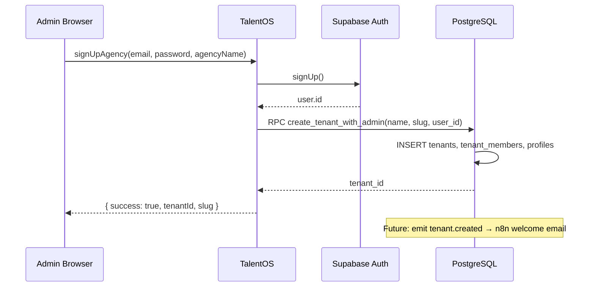
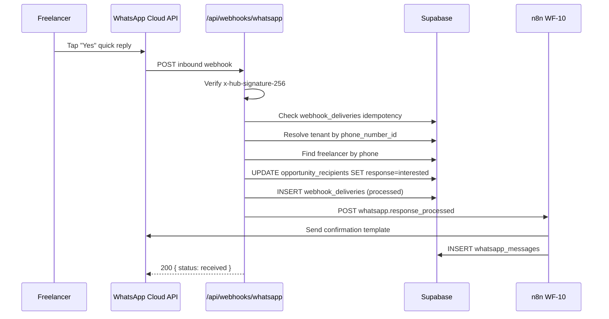
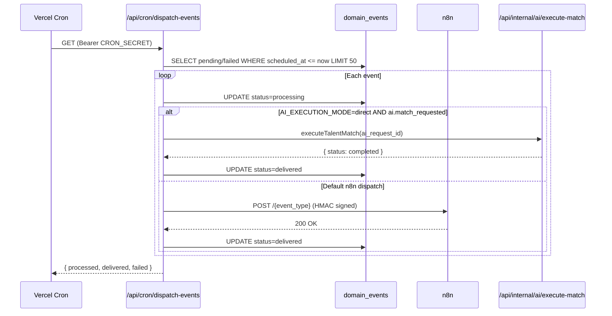
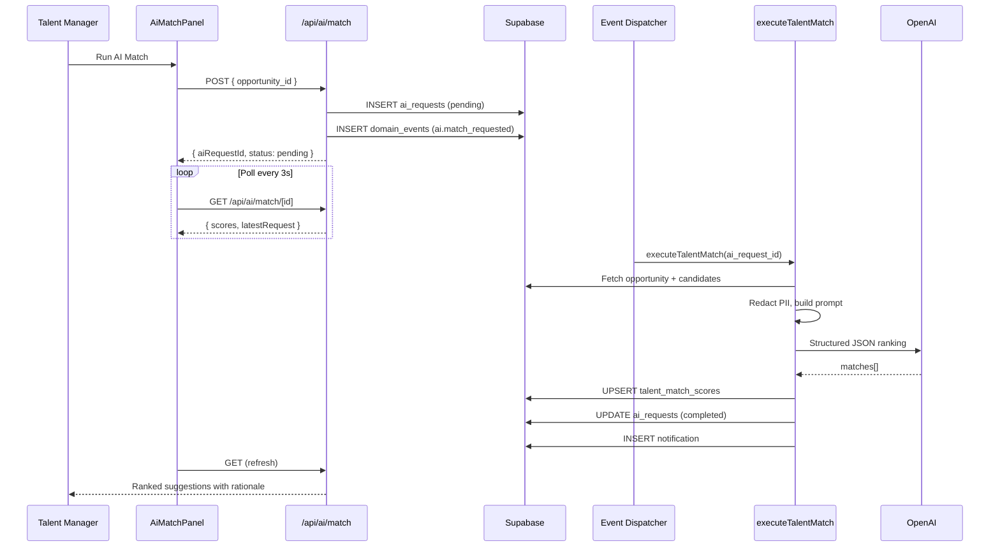
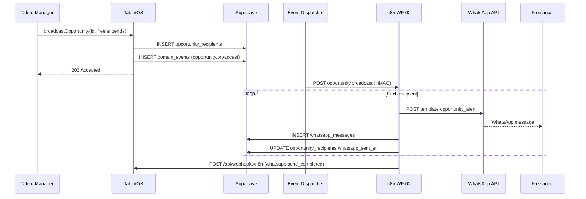
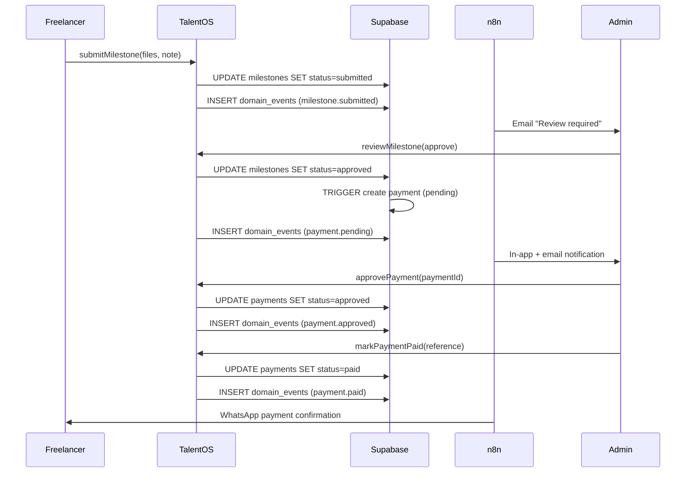
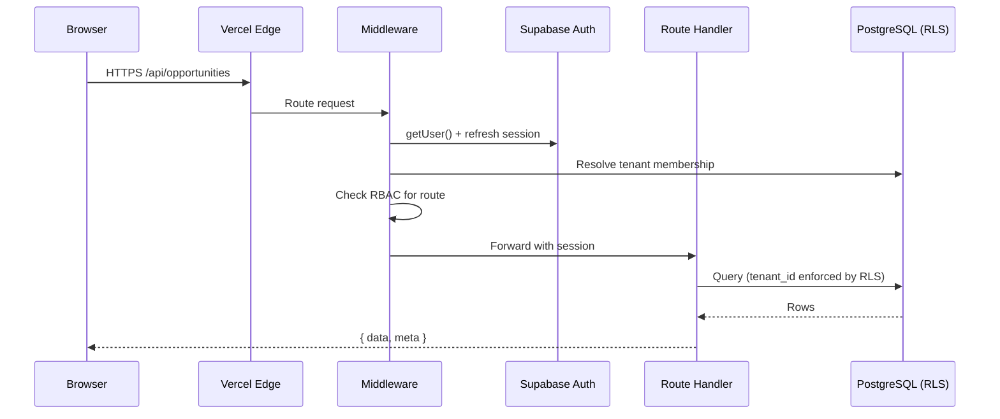

# TalentOS — API Contracts & Sequence Diagrams

**Version:** 1.0  
**Status:** Implementation Reference  
**Companion:** [API Architecture](05-api-architecture.md) · [Enterprise Architecture](11-enterprise-system-architecture.md)

This document is the **authoritative contract reference** for TalentOS HTTP APIs, server actions, integration webhooks, and domain events. Endpoints are marked **Implemented** or **Planned**.

---

## 1. Conventions

### 1.1 Base URL

| Environment | URL |
|-------------|-----|
| Production | `https://{tenant-slug}.talentos.com` |
| Staging | `https://{tenant-slug}.staging.talentos.com` |
| Local | `http://localhost:3000` |

### 1.2 Standard Response Envelope

All JSON Route Handlers return:

```typescript
// Success — HTTP 2xx
interface ApiSuccess<T> {
  data: T
  meta?: {
    page?: number
    limit?: number
    total?: number
  }
}

// Error — HTTP 4xx/5xx
interface ApiErrorBody {
  error: {
    code: string
    message: string
    details?: Record<string, unknown>
  }
}
```

### 1.3 Common Headers

| Header | Direction | Required | Description |
|--------|-----------|----------|-------------|
| `Cookie` | Request | Session routes | Supabase Auth JWT (`sb-*-auth-token`) |
| `Content-Type` | Request | JSON bodies | `application/json` |
| `X-Tenant-ID` | Request | API clients | Tenant UUID (subdomain preferred for browser) |
| `X-Correlation-ID` | Both | Integrations | Trace ID across app → n8n → providers |
| `X-Idempotency-Key` | Both | Integrations | Dedup key for webhooks and events |
| `Authorization` | Request | Cron / internal | `Bearer {CRON_SECRET}` |
| `X-Webhook-Signature` | Both | n8n | `sha256={HMAC-SHA256(body, secret)}` |
| `x-hub-signature-256` | Request | Meta WhatsApp | `sha256={HMAC-SHA256(rawBody, app_secret)}` |

### 1.4 Error Codes

| Code | HTTP | When |
|------|------|------|
| `UNAUTHORIZED` | 401 | No valid session |
| `FORBIDDEN` | 403 | Insufficient role or permission |
| `NO_TENANT` | 403 | User has no active tenant membership |
| `NOT_FOUND` | 404 | Resource missing or outside tenant |
| `VALIDATION_ERROR` | 400 / 422 | Invalid input |
| `CONFLICT` | 409 | Duplicate or invalid state transition |
| `AI_MATCHING_DISABLED` | 403 | Tenant feature flag off |
| `AI_MONTHLY_LIMIT_EXCEEDED` | 429 | AI quota exhausted |
| `RATE_LIMITED` | 429 | Too many requests |
| `INTERNAL_ERROR` | 500 | Unexpected failure |

### 1.5 RBAC Permissions

Permissions are checked in Route Handlers and Server Actions via `requirePermission(role, permission)`.

| Permission | Admin | Talent Manager | Freelancer |
|------------|:-----:|:--------------:|:----------:|
| `opportunities:create` | ✓ | ✓ | |
| `opportunities:broadcast` | ✓ | ✓ | |
| `opportunities:respond` | | | ✓ |
| `ai:match` | ✓ | ✓ | |
| `shortlists:manage` | ✓ | ✓ | |
| `payments:approve` | ✓ | | |
| `integrations:manage` | ✓ | | |

---

## 2. Authentication & Session

### 2.1 `GET /api/auth/session` — **Implemented**

Returns current user and active tenant context.

**Auth:** Session cookie (optional — returns `null` if unauthenticated)

**Response `200`:**

```json
{
  "data": {
    "user": {
      "id": "770e8400-e29b-41d4-a716-446655440002",
      "email": "manager@acme.com",
      "fullName": "Jane Manager"
    },
    "tenant": {
      "id": "550e8400-e29b-41d4-a716-446655440000",
      "slug": "acme",
      "name": "Acme Creative",
      "role": "talent_manager",
      "timezone": "America/New_York",
      "currency": "USD"
    }
  }
}
```

**Response `200` (logged out):**

```json
{ "data": null }
```

---

### 2.2 `GET /api/auth/callback` — **Implemented**

OAuth / magic-link callback. Exchanges auth code for session cookie.

**Auth:** Public (Supabase redirect)

---

### 2.3 `POST /api/auth/signout` — **Implemented**

Clears Supabase session.

**Auth:** Session cookie

**Response `200`:**

```json
{ "data": { "signedOut": true } }
```

---

### 2.4 `signUpAgency()` Server Action — **Implemented**

```typescript
// app/actions/auth.ts
interface SignUpAgencyInput {
  email: string
  password: string
  agencyName: string
}

type SignUpAgencyResult =
  | { success: true; tenantId: string; slug: string }
  | { success: false; error: string }
```

**Sequence:** See [§10.1 Tenant Signup](#101-tenant-signup)

---

## 3. Analytics

### 3.1 `GET /api/analytics/dashboard` — **Implemented**

**Auth:** Session + tenant membership

**Response `200`:**

```json
{
  "data": {
    "tenant_id": "550e8400-e29b-41d4-a716-446655440000",
    "total_freelancers": 42,
    "active_projects": 8,
    "open_opportunities": 3,
    "pending_payments": 2,
    "pending_payments_amount": 4500.0
  }
}
```

---

## 4. AI Talent Matching

### 4.1 `POST /api/ai/match` — **Implemented**

Request async AI ranking for an opportunity.

**Auth:** Session · Permission: `ai:match`

**Request:**

```json
{
  "opportunity_id": "abc123-opportunity-uuid"
}
```

**Response `200`:**

```json
{
  "data": {
    "aiRequestId": "req-uuid",
    "correlationId": "corr-uuid",
    "status": "pending"
  }
}
```

**Errors:** `AI_MATCHING_DISABLED` · `AI_MONTHLY_LIMIT_EXCEEDED` · `NOT_FOUND`

---

### 4.2 `GET /api/ai/match/[opportunityId]` — **Implemented**

Fetch match scores and latest request status.

**Auth:** Session · Permission: `ai:match`

**Response `200`:**

```json
{
  "data": {
    "scores": [
      {
        "id": "score-uuid",
        "opportunityId": "abc123",
        "freelancerId": "f1-uuid",
        "aiRequestId": "req-uuid",
        "score": 87.5,
        "rationale": "Strong Figma and brand systems overlap.",
        "skillOverlap": ["figma", "brand systems"],
        "rank": 1,
        "createdAt": "2026-07-01T12:05:00.000Z",
        "freelancer": {
          "id": "f1-uuid",
          "full_name": "Alex Chen",
          "discipline": "design",
          "day_rate": 650,
          "availability": "available",
          "internal_rating": 4.5
        }
      }
    ],
    "latestRequest": {
      "id": "req-uuid",
      "status": "completed",
      "createdAt": "2026-07-01T12:00:00.000Z",
      "completedAt": "2026-07-01T12:00:45.000Z",
      "result": {
        "match_count": 12,
        "used_fallback": false,
        "provider": "openai",
        "model": "gpt-4o-mini"
      }
    }
  }
}
```

---

### 4.3 `POST /api/internal/ai/execute-match` — **Implemented**

Internal executor for cron dispatcher and n8n WF-04.

**Auth:** `Authorization: Bearer {CRON_SECRET}`

**Request:**

```json
{
  "ai_request_id": "req-uuid",
  "actor_id": "770e8400-e29b-41d4-a716-446655440002"
}
```

**Response `200`:**

```json
{
  "data": {
    "aiRequestId": "req-uuid",
    "status": "completed",
    "matchCount": 12,
    "usedFallback": false
  }
}
```

---

### 4.4 `runAiTalentMatch(opportunityId)` Server Action — **Implemented**

```typescript
type RunAiTalentMatchResult =
  | { ok: true; aiRequestId: string; correlationId: string; status: 'pending' }
  | { ok: false; error: string }
```

**Sequence:** See [§10.4 AI Talent Matching](#104-ai-talent-matching)

---

## 5. Event Dispatcher (Cron)

### 5.1 `GET /api/cron/dispatch-events` — **Implemented**

Polls `domain_events` outbox and dispatches to n8n or executes AI events in direct mode.

**Auth:** `Authorization: Bearer {CRON_SECRET}`

**Query:** None (batch limit: 50 events)

**Response `200`:**

```json
{
  "processed": 3,
  "delivered": 2,
  "failed": 1,
  "results": [
    { "id": "event-uuid-1", "ok": true },
    { "id": "event-uuid-2", "ok": true },
    { "id": "event-uuid-3", "ok": false, "error": "n8n not configured" }
  ]
}
```

**Sequence:** See [§10.3 Event Outbox Dispatch](#103-event-outbox-dispatch)

---

## 6. Integration Webhooks

### 6.1 `GET /api/webhooks/whatsapp` — **Implemented**

Meta webhook verification challenge.

**Query params:** `hub.mode`, `hub.verify_token`, `hub.challenge`

**Response `200`:** Raw challenge string (if `hub.verify_token` matches `WHATSAPP_VERIFY_TOKEN`)

**Response `403`:** `Forbidden`

---

### 6.2 `POST /api/webhooks/whatsapp` — **Implemented**

Inbound WhatsApp messages and delivery status updates.

**Auth:** `x-hub-signature-256` HMAC (optional if `WHATSAPP_APP_SECRET` unset in dev)

**Request (inbound quick reply excerpt):**

```json
{
  "object": "whatsapp_business_account",
  "entry": [{
    "changes": [{
      "field": "messages",
      "value": {
        "metadata": { "phone_number_id": "123456789" },
        "messages": [{
          "id": "wamid.xxx",
          "from": "14155551234",
          "type": "button",
          "button": { "payload": "INTERESTED", "text": "Yes" }
        }]
      }
    }]
  }]
}
```

**Response `200`:**

```json
{ "status": "received" }
```

**Duplicate response:**

```json
{ "status": "duplicate" }
```

**Sequence:** See [§10.2 WhatsApp Inbound Quick Reply](#102-whatsapp-inbound-quick-reply)

---

### 6.3 `POST /api/webhooks/n8n` — **Implemented**

Callbacks from n8n workflows after side effects complete.

**Auth:** `X-Webhook-Signature: sha256={hmac}`

**Request envelope:**

```typescript
interface N8nCallbackEnvelope {
  event: string
  tenant_id: string
  correlation_id?: string
  data: Record<string, unknown>
}
```

**Supported events:**

| Event | `data` fields | Effect |
|-------|---------------|--------|
| `whatsapp.send_completed` | `wa_message_id`, `status`, `entity_id`, `whatsapp_sent_at` | Update delivery status |
| `email.sent` | `to_email`, `template_name`, `subject`, `provider_id`, `entity_type`, `entity_id` | Insert `email_logs` |
| `ai.match_completed` | `ai_request_id`, `opportunity_id`, `match_count`, `notification_user_id` | Mark AI request complete |

**Example — `whatsapp.send_completed`:**

```json
{
  "event": "whatsapp.send_completed",
  "tenant_id": "550e8400-e29b-41d4-a716-446655440000",
  "correlation_id": "660e8400-e29b-41d4-a716-446655440001",
  "data": {
    "wa_message_id": "wamid.outbound123",
    "status": "delivered",
    "entity_id": "recipient-uuid",
    "whatsapp_sent_at": "2026-07-01T12:01:00.000Z"
  }
}
```

**Response `200`:**

```json
{ "status": "processed" }
```

---

## 7. Domain Event Contract (Outbox → n8n)

Events are stored in `domain_events` and dispatched as HMAC-signed POSTs to n8n.

### 7.1 n8n Event Envelope

```typescript
interface N8nEventEnvelope {
  event: string
  tenant_id: string
  correlation_id: string
  idempotency_key: string
  timestamp: string          // ISO 8601
  actor_id: string | null
  data: Record<string, unknown>
}
```

**HTTP:**

```http
POST {N8N_WEBHOOK_BASE_URL}/{event}
Content-Type: application/json
X-Webhook-Signature: sha256={hmac_hex}
X-Correlation-ID: {correlation_id}
X-Idempotency-Key: {idempotency_key}
X-Tenant-ID: {tenant_id}
```

### 7.2 Event Catalog

| Event | Trigger | `data` payload | Workflow |
|-------|---------|----------------|----------|
| `tenant.created` | Signup RPC | `{ tenant_id, slug, admin_email }` | WF-01 |
| `opportunity.broadcast` | Broadcast action | `{ opportunity_id, recipients[] }` | WF-02 |
| `opportunity.response` | WA quick reply / web | `{ recipient_id, response, opportunity_id }` | WF-03 |
| `ai.match_requested` | AI match API | `{ opportunity_id, ai_request_id }` | WF-04 |
| `project.assigned` | Assign project | `{ project_id, freelancer_id }` | WF-05 |
| `milestone.submitted` | Submit milestone | `{ milestone_id, project_id }` | WF-06 |
| `payment.approved` | Approve payment | `{ payment_id, amount }` | WF-07 |
| `payment.paid` | Mark paid | `{ payment_id, reference }` | WF-07 |
| `whatsapp.response_processed` | Inbound gateway | `{ recipient_id, response, phone }` | WF-10 |
| `whatsapp.unrecognized` | Inbound gateway | `{ phone, body, reason }` | WF-10 |
| `member.invited` | Team invite | `{ invite_id, email, role }` | WF-11 |

### 7.3 `opportunity.broadcast` payload — **Contract**

```json
{
  "event": "opportunity.broadcast",
  "tenant_id": "550e8400-e29b-41d4-a716-446655440000",
  "correlation_id": "660e8400-e29b-41d4-a716-446655440001",
  "idempotency_key": "opp-broadcast:abc123:v1",
  "timestamp": "2026-07-01T12:00:00.000Z",
  "actor_id": "770e8400-e29b-41d4-a716-446655440002",
  "data": {
    "opportunity_id": "abc123",
    "title": "Brand Video Editor",
    "budget": 2500,
    "currency": "USD",
    "response_deadline": "2026-07-05T18:00:00Z",
    "agency_name": "Acme Creative",
    "agency_slug": "acme",
    "recipients": [
      {
        "recipient_id": "r1-uuid",
        "freelancer_id": "f1-uuid",
        "full_name": "Alex Chen",
        "phone": "+14155551234",
        "email": "alex@example.com"
      }
    ]
  }
}
```

### 7.4 `ai.match_requested` payload — **Contract**

```json
{
  "event": "ai.match_requested",
  "tenant_id": "550e8400-e29b-41d4-a716-446655440000",
  "correlation_id": "corr-uuid",
  "idempotency_key": "ai-match:abc123:req-uuid",
  "timestamp": "2026-07-01T12:00:00.000Z",
  "actor_id": "770e8400-e29b-41d4-a716-446655440002",
  "data": {
    "opportunity_id": "abc123",
    "ai_request_id": "req-uuid"
  }
}
```

### 7.5 Outbox row schema

```typescript
interface DomainEvent {
  id: string
  tenant_id: string
  event_type: string
  aggregate_type: string       // e.g. 'opportunity'
  aggregate_id: string
  idempotency_key: string
  correlation_id: string
  actor_id: string | null
  payload: Record<string, unknown>
  status: 'pending' | 'processing' | 'delivered' | 'failed' | 'dead_letter'
  retry_count: number
  max_retries: number          // default 5
  last_error: string | null
  scheduled_at: string
  created_at: string
  processed_at: string | null
}
```

**Retry backoff:** `2^retry_count × 30s` on failure.

---

## 8. Planned REST Contracts (Domain APIs)

These endpoints are specified in [05-api-architecture.md](05-api-architecture.md) but not yet scaffolded. Contracts below define the target interface.

### 8.1 Freelancers

#### `GET /api/freelancers` — **Planned**

**Query:** `?page=1&limit=20&discipline=design&availability=available&search=alex`

**Response:**

```json
{
  "data": [
    {
      "id": "f1-uuid",
      "full_name": "Alex Chen",
      "email": "alex@example.com",
      "discipline": "design",
      "skills": ["figma", "brand systems"],
      "day_rate": 650,
      "availability": "available",
      "internal_rating": 4.5
    }
  ],
  "meta": { "page": 1, "limit": 20, "total": 42 }
}
```

#### `POST /api/freelancers` — **Planned**

```json
{
  "full_name": "Alex Chen",
  "email": "alex@example.com",
  "discipline": "design",
  "skills": ["figma"],
  "day_rate": 650,
  "phone": "+14155551234"
}
```

---

### 8.2 Opportunities

#### `POST /api/opportunities/[id]/broadcast` — **Planned**

```json
{
  "freelancer_ids": ["f1-uuid", "f2-uuid"],
  "channels": ["whatsapp", "email"]
}
```

**Response `202`:**

```json
{
  "data": {
    "opportunity_id": "abc123",
    "recipient_count": 2,
    "event_id": "domain-event-uuid",
    "status": "queued"
  }
}
```

#### `POST /api/opportunities/[id]/respond` — **Planned**

**Auth:** Freelancer (own recipient row only)

```json
{
  "response": "interested",
  "note": "Available next week"
}
```

---

### 8.3 Projects & Milestones

#### `POST /api/projects` — **Planned**

```json
{
  "opportunity_id": "abc123",
  "shortlist_id": "sl-uuid",
  "freelancer_id": "f1-uuid",
  "title": "Brand Video — Phase 1",
  "budget": 2500,
  "milestones": [
    { "title": "Rough cut", "amount": 1000, "due_date": "2026-07-15" },
    { "title": "Final delivery", "amount": 1500, "due_date": "2026-07-30" }
  ]
}
```

#### `POST /api/milestones/[id]/submit` — **Planned**

```multipart/form-data
note: "First draft attached"
files: [deliverable.mp4]
```

---

### 8.4 Payments

#### `PATCH /api/payments/[id]/approve` — **Planned**

```json
{ "notes": "Approved for July payout" }
```

#### `PATCH /api/payments/[id]/pay` — **Planned**

```json
{
  "payment_reference": "WISE-2026-0701-001",
  "paid_at": "2026-07-01T15:00:00.000Z"
}
```

---

## 9. Server Action Contracts

| Action | File | Status | Input | Output |
|--------|------|--------|-------|--------|
| `signUpAgency` | `auth.ts` | Implemented | `{ email, password, agencyName }` | `{ success, tenantId?, slug?, error? }` |
| `signOut` | `auth.ts` | Implemented | — | void |
| `runAiTalentMatch` | `ai.ts` | Implemented | `opportunityId: string` | `{ ok, aiRequestId?, error? }` |
| `createFreelancer` | `freelancers.ts` | Planned | `FormData` | throws |
| `createOpportunity` | `opportunities.ts` | Planned | `CreateOpportunityInput` | throws |
| `broadcastOpportunity` | `opportunities.ts` | Planned | `id, freelancerIds[]` | throws |
| `assignProject` | `projects.ts` | Planned | `AssignProjectInput` | throws |

---

## 10. Sequence Diagrams

### 10.1 Tenant Signup



---

### 10.2 WhatsApp Inbound Quick Reply



---

### 10.3 Event Outbox Dispatch



---

### 10.4 AI Talent Matching



---

### 10.5 Opportunity Broadcast (Planned E2E)



---

### 10.6 Milestone → Payment Lifecycle (Planned)



---

### 10.7 Authenticated API Request (Middleware)



---

## 11. Idempotency Matrix

| Surface | Key format | Storage |
|---------|------------|---------|
| Domain events | `{logical-key}` e.g. `ai-match:{oppId}:{reqId}` | `domain_events.idempotency_key` UNIQUE |
| WhatsApp inbound | `wa-inbound:{waMessageId}` | `webhook_deliveries` |
| WhatsApp status | `wa-status:{waMessageId}:{status}` | `webhook_deliveries` |
| n8n callback | `X-Idempotency-Key` header | `webhook_deliveries` |
| Match scores | `(opportunity_id, freelancer_id)` | UPSERT on re-run |

---

## 12. Implementation Status Summary

| Category | Implemented | Planned |
|----------|:-----------:|:-------:|
| Auth session | 3 routes | 1 (invite) |
| Analytics | 1 route | 3 routes |
| AI matching | 3 routes + action | — |
| Cron / internal | 2 routes | — |
| Webhooks | 2 routes | 1 (integrations test) |
| Domain CRUD | — | freelancers, opportunities, projects, payments, shortlists |
| Server actions | 3 | 10+ |

---

## 13. Related Documents

| Document | Content |
|----------|---------|
| [05-api-architecture.md](05-api-architecture.md) | Endpoint catalog, caching, rate limits |
| [12-whatsapp-n8n-integration-architecture.md](12-whatsapp-n8n-integration-architecture.md) | Messaging contracts in depth |
| [13-ai-talent-matching-service.md](13-ai-talent-matching-service.md) | AI service detail |
| [09-n8n-workflows.md](09-n8n-workflows.md) | Workflow step specifications |
| [07-authentication-design.md](07-authentication-design.md) | Auth flows and session model |
