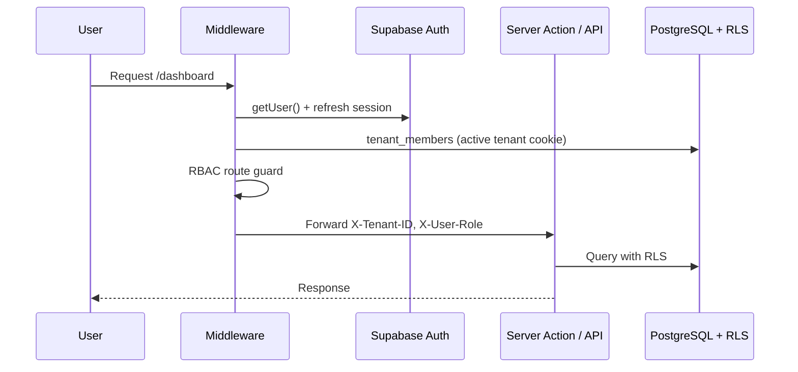
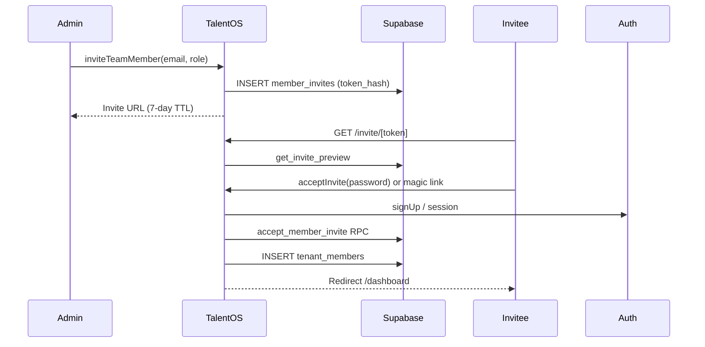

# Sprint 1 — Authentication

**Sprint goal:** Ship production-ready authentication with Supabase Auth and role-based access control.

**Status:** Implemented  
**Branch:** `cursor/sprint-1-authentication-ce99`

---

## 1. Deliverables

| Story | Acceptance criteria | Status |
|-------|---------------------|--------|
| US-1.1 Agency registration | Email signup, tenant + admin role, slug | Done |
| US-1.2 Invite team members | 7-day invite, role on accept, revoke | Done |
| US-9.1 Role-based access | Admin / manager / freelancer enforcement | Done |
| US-9.2 Magic link onboarding | Magic link on login + invite | Done |

---

## 2. Authentication Methods

| Method | UI entry | Backend |
|--------|----------|---------|
| Email + password | `/login` (Password tab) | `signInWithPassword` |
| Magic link | `/login` (Magic link tab), invite page | `sendMagicLink` → `/api/auth/callback` |
| Agency signup | `/signup` | `signUpAgency` → `create_tenant_with_admin` |
| Team invite | `/settings/team` | `inviteTeamMember` → `/invite/[token]` |
| Password reset | `/forgot-password` | `requestPasswordReset` |

---

## 3. User Roles

| Role | Scope | Route access |
|------|-------|--------------|
| `admin` | Full tenant: billing, team, integrations, all data | `/settings/*`, all manager routes |
| `talent_manager` | Talent, opportunities, projects, analytics | `/talent`, `/analytics`, no `/settings` |
| `freelancer` | Assigned opportunities/projects, own profile | Dashboard, opportunities, projects, payments (own) |

Permissions are defined in `lib/auth/permissions.ts` and exposed on the session as `permissions[]`.

---

## 4. Architecture





---

## 5. Key Files

| Path | Purpose |
|------|---------|
| `lib/auth/session.ts` | Session + tenant resolution |
| `lib/auth/permissions.ts` | RBAC permission map |
| `lib/auth/guards.ts` | `requireAdmin`, `requireManager`, `requireRole` |
| `lib/auth/tenant-context.ts` | Active tenant cookie + memberships |
| `lib/auth/invites.ts` | Token generation and hashing |
| `app/actions/auth.ts` | Signup, login, invite, accept, magic link |
| `middleware.ts` | Session refresh + route guards |
| `supabase/migrations/007_auth_invite_functions.sql` | Invite RPCs |

---

## 6. API Contracts (Sprint 1)

### `GET /api/auth/session`

Returns `{ user, tenant, permissions }`.

### `GET /api/auth/invite/[token]`

Public preview: `{ tenantName, email, role, expiresAt, isValid }`.

### `GET /api/team/members`

Admin only: `{ members[], pendingInvites[] }`.

---

## 7. Environment

```bash
NEXT_PUBLIC_SUPABASE_URL=
NEXT_PUBLIC_SUPABASE_ANON_KEY=
SUPABASE_SERVICE_ROLE_KEY=
NEXT_PUBLIC_APP_URL=http://localhost:3000
```

Configure Supabase Auth redirect URLs to include `{APP_URL}/api/auth/callback`.

---

## 8. Follow-up (Sprint 2+)

- n8n welcome email on `tenant.created`
- Email delivery for invite links (currently copy URL in UI)
- OAuth (Google) for admins
- MFA / TOTP
- Freelancer auto-link via `link_freelancer_to_user` on magic link
