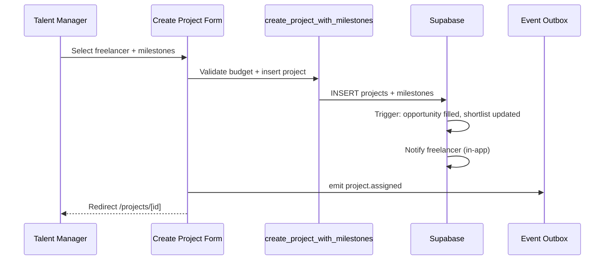

# Sprint 2 — Project Management

**Sprint goal:** Enable project creation from opportunities/shortlists and visual project tracking with milestones.

**Status:** Implemented  
**Branch:** `cursor/sprint-2-project-management-ce99`

---

## 1. Deliverables

| Story | Acceptance criteria | Status |
|-------|---------------------|--------|
| US-5.1 Assign from shortlist | Select freelancer, inherit opportunity fields, mark filled | Done |
| US-5.2 Define milestones | Title, amount, due date; budget validation | Done |
| US-5.3 Notify freelancer | In-app notification + `project.assigned` event | Done |
| US-6.1 Kanban view | Columns by status, status changes | Done |
| US-6.2 Submit milestone | Freelancer submit with note | Done |
| US-6.3 Review milestone | Approve/revision; payment trigger via DB | Done |

---

## 2. Project creation flow

**Entry points:**
- `/projects/new` — manual create
- `/projects/new?opportunityId=&freelancerId=` — from shortlist
- `/opportunities/[id]/shortlist` — "Assign project" per candidate

---

## 3. Project tracking

### Kanban (`/projects`)

Managers see columns: **Draft → Active → In review → Completed → Archived**

Each card supports status change via dropdown (validated transitions).

Freelancers see a card list of assigned projects.

### Project detail (`/projects/[id]`)

- Milestone timeline with status badges
- Budget vs milestone total summary
- Manager: approve / request revision on submitted milestones
- Freelancer: start work, submit milestone
- Activity log (status changes from DB triggers)

---

## 4. Status model

### Project statuses

| Status | Meaning |
|--------|---------|
| `draft` | Created but not started |
| `active` | Work in progress |
| `in_review` | Submitted for manager review |
| `completed` | All milestones approved |
| `archived` | Closed / historical |

### Milestone statuses

`pending` → `in_progress` → `submitted` → `approved` | `revision`

Approving a milestone triggers `handle_milestone_approved` (payment record).

---

## 5. API & actions

| Action | Permission | Description |
|--------|------------|-------------|
| `createProject()` | `projects:create` | RPC + `project.assigned` event |
| `updateProjectStatus()` | `projects:update` | Manager status transitions |
| `updateProjectStatusAsFreelancer()` | assigned freelancer | `active` → `in_review` |
| `submitMilestone()` | assigned freelancer | Mark submitted + notify manager |
| `reviewMilestone()` | `milestones:review` | Approve or request revision |

---

## 6. Key files

| Path | Purpose |
|------|---------|
| `supabase/migrations/008_create_project_rpc.sql` | Atomic project + milestones |
| `app/actions/projects.ts` | Create + status updates |
| `app/actions/milestones.ts` | Submit + review |
| `components/projects/create-project-form.tsx` | Creation UI |
| `components/projects/project-kanban.tsx` | Pipeline board |
| `components/projects/project-tracker.tsx` | Detail tracking |

---

## 7. Follow-up

- File uploads to Supabase Storage on milestone submit
- Drag-and-drop kanban (dnd-kit)
- Client and date filters on kanban
- Auto-create shortlist when first candidate added
