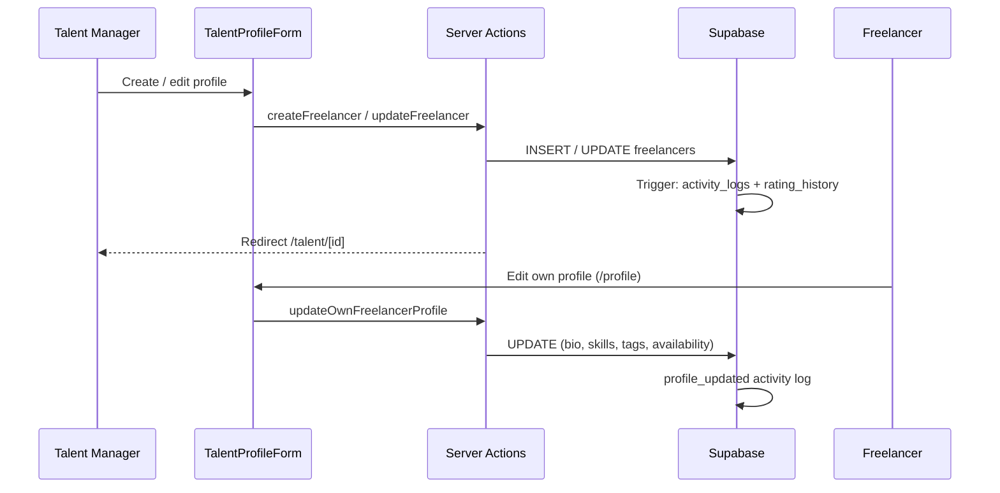
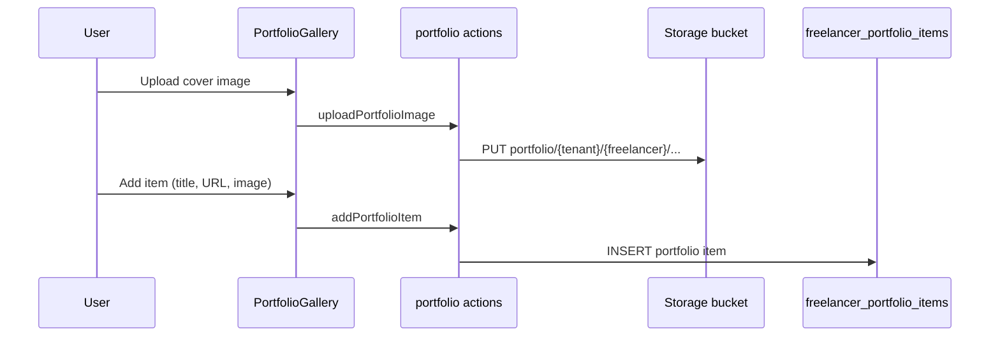

# Sprint 3 — Talent System

**Sprint goal:** Ship freelancer profiles, skills management, portfolio gallery, and talent search for managers and self-service freelancers.

**Status:** Implemented  
**Branch:** `cursor/sprint-3-talent-system-ce99`

---

## 1. Deliverables

| Story | Acceptance criteria | Status |
|-------|---------------------|--------|
| US-2.1 Add freelancer profile | Name, email, discipline, rate; tenant scoped; duplicate email guard | Done |
| US-2.2 Search & filter talent | Query, discipline, availability, rate, rating; sort; paginated roster | Done |
| US-2.3 Freelancer self-service | Edit bio, skills, portfolio, availability; activity logged | Done |
| US-2.4 Internal notes & ratings | Manager-only notes/rating; rating history preserved | Done |
| US-2.5 Bulk CSV import | — | Deferred |

---

## 2. Data model

### `freelancer_portfolio_items`

Structured portfolio entries with optional cover image stored in the `portfolio` Supabase bucket (`{tenant_id}/{freelancer_id}/{uuid}.ext`).

### `freelancer_rating_history`

Append-only history when managers update `internal_rating` on a freelancer profile.

### Profile audit trigger

`handle_freelancer_profile_update` logs `profile_updated` to `activity_logs` when bio, skills, portfolio URL, availability, or tags change. Rating changes also insert into `freelancer_rating_history`.

### Enhanced `search_freelancers` RPC

Supports full-text search across name, email, bio, skills, and tags; filters for discipline, availability, rate range, and minimum rating; sort by rating, name, rate, or last active.

---

## 3. Routes & UI

| Route | Role | Purpose |
|-------|------|---------|
| `/talent` | Manager | Searchable roster table with filters |
| `/talent/new` | Manager | Create freelancer profile |
| `/talent/[id]` | Manager / own profile | Full profile, skills, portfolio, rating history |
| `/talent/[id]/edit` | Manager | Edit all profile fields including internal notes |
| `/profile` | Freelancer | Self-service profile + portfolio management |
| `GET /api/talent/search` | Manager | JSON search API with pagination |

---

## 4. Profile flow



---

## 5. Portfolio flow



Freelancers and managers can add/delete portfolio items for profiles they can access (RLS enforced).

---

## 6. Key files

| Area | Path |
|------|------|
| Migration | `supabase/migrations/009_talent_portfolio_system.sql` |
| Validation | `lib/talent/validation.ts` |
| Queries | `lib/talent/queries.ts` |
| Profile actions | `app/actions/freelancers.ts` |
| Portfolio actions | `app/actions/portfolio.ts` |
| Search API | `app/api/talent/search/route.ts` |
| Components | `components/talent/*` |

---

## 7. Permissions

| Action | Admin | Talent Manager | Freelancer |
|--------|-------|----------------|------------|
| View roster | ✓ | ✓ | — |
| Create / edit any profile | ✓ | ✓ | — |
| View internal notes & rating history | ✓ | ✓ | — |
| Edit own profile fields | — | — | ✓ |
| Manage own portfolio | — | — | ✓ |
| View own full profile | — | — | ✓ (`/talent/[id]` or `/profile`) |

---

## 8. Apply migration

```bash
supabase db push
# or
supabase migration up
```

Ensure the `portfolio` storage bucket is created and RLS policies are active before uploading images.
