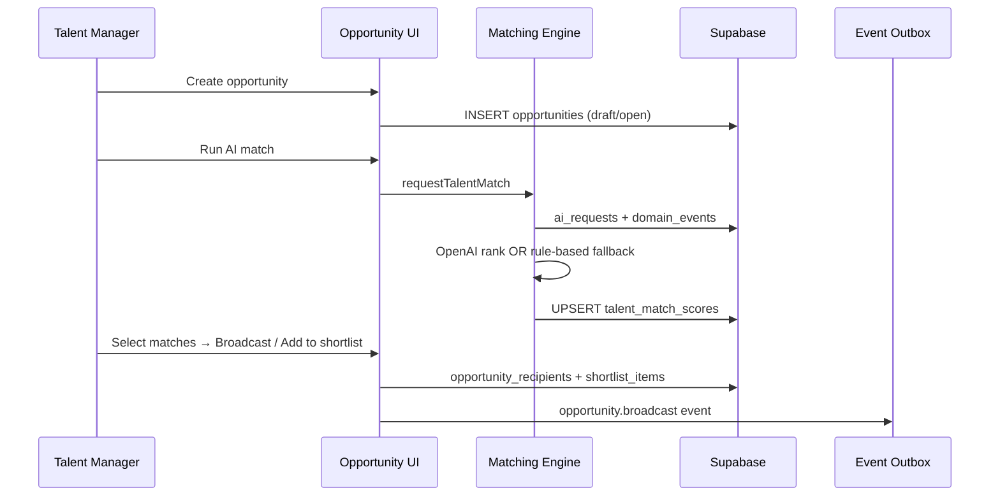

# Sprint 4 — Matching Engine

**Sprint goal:** Connect the AI matching engine to opportunity creation, broadcasting, and shortlisting so managers can act on ranked talent suggestions end-to-end.

**Status:** Implemented  
**Branch:** `cursor/sprint-4-matching-engine-ce99`

---

## 1. Deliverables

| Story | Acceptance criteria | Status |
|-------|---------------------|--------|
| US-3.1 Create opportunity | Title, brief, budget, skills, deadlines; draft or open | Done |
| US-3.2 Broadcast opportunity | Manual roster picker + broadcast from AI matches; in-app + n8n event | Done |
| US-3.3 Respond to opportunity | Freelancer interested/declined with optional note | Done |
| US-4.1 Build shortlist | Add from AI matches or interested responses; notes | Done |
| US-4.2 Compare candidates | Side-by-side table with AI score, rate, rating; highlight top match | Done |
| US-4.3 Reject candidate | Rejection reason required; status archived | Done |
| O-002 Auto-suggest matching talent | AI match panel + rule-based fallback integrated | Done |

**Deferred:** US-3.4 WhatsApp quick response, US-3.5 auto-close, PDF export, auto-trigger on create, realtime subscriptions.

---

## 2. Architecture

The matching engine (`lib/integrations/ai/*`) was built in an earlier sprint. Sprint 4 wires it into product flows.



---

## 3. AI matching

### Candidate pool (aligned with RPC)

`fetchMatchCandidates` now mirrors `suggest_talent_for_opportunity`:

- `availability = available`
- Discipline filter when opportunity has discipline
- Excludes existing recipients
- Limit 50

### Fallback improvements

Rule-based fallback populates `skill_overlap` from freelancer skills and uses the same RPC scoring heuristics.

### n8n callback hardening

`ai.match_completed` webhook merges into existing `ai_requests.result` instead of overwriting metadata. Notifications are sent only from `executeTalentMatch` (no duplicate from n8n callback).

---

## 4. Routes & UI

| Route | Purpose |
|-------|---------|
| `/opportunities/new` | Create opportunity (draft or open) |
| `/opportunities/[id]` | AI match panel, broadcast panel, response log |
| `/opportunities/[id]/shortlist` | Compare table, shortlist management |

### AI match panel actions

- **Run AI match** — async ranking via existing pipeline
- **Add to shortlist** — selected matches → `shortlist_items`
- **Broadcast selected** — selected matches → `opportunity_recipients` + notifications + n8n

### Shortlist board

Compare table columns: candidate, AI score, rate, rating, response status, notes, assign/reject actions. Top AI score highlighted as recommended pick.

---

## 5. Key files

| Area | Path |
|------|------|
| Opportunity actions | `app/actions/opportunities.ts` |
| Shortlist actions | `app/actions/shortlists.ts` |
| Shortlist queries | `lib/shortlists/queries.ts` |
| Opportunity validation | `lib/opportunities/validation.ts` |
| AI orchestration | `lib/integrations/ai/matching.ts` |
| AI fallback | `lib/integrations/ai/fallback.ts` |
| Components | `components/opportunities/*` |

---

## 6. Events

| Event | Trigger |
|-------|---------|
| `ai.match_requested` | Run AI match |
| `opportunity.broadcast` | Broadcast to freelancers |
| `opportunity.opened` | Status draft → open (DB trigger) |

Broadcast payload includes recipient list for n8n WF-02 WhatsApp fan-out.

---

## 7. Permissions

| Action | Admin | Talent Manager | Freelancer |
|--------|-------|----------------|------------|
| Create opportunity | ✓ | ✓ | — |
| Run AI match | ✓ | ✓ | — |
| Broadcast | ✓ | ✓ | — |
| Manage shortlist | ✓ | ✓ | — |
| Respond to opportunity | — | — | ✓ (if recipient) |

---

## 8. Testing

```bash
npm run build
```

Manual flow:

1. Create opportunity at `/opportunities/new`
2. Run AI match on opportunity detail
3. Broadcast selected matches or use manual broadcast panel
4. Freelancer responds (interested/declined)
5. Add to shortlist from AI panel or interested responses
6. Compare on `/opportunities/[id]/shortlist` and assign project
