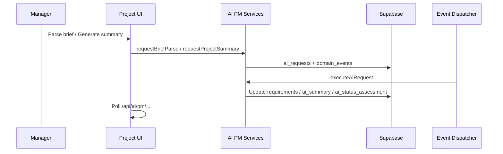

# Sprint 6 — AI Project Manager

**Sprint goal:** Add AI-assisted requirement gathering, auto-generated project summaries, and proactive status assessments with overdue milestone detection.

**Status:** Implemented  
**Branch:** `cursor/sprint-6-ai-project-manager-ce99`

---

## 1. Deliverables

| Capability | Acceptance criteria | Status |
|------------|---------------------|--------|
| Requirement gathering | Parse brief → skills, deliverables, milestones, risks | Done |
| Auto summaries | Project status narrative + shortlist comparison | Done |
| Auto status updates | Risk assessment, overdue cron, milestone activity log | Done |

**Deferred:** Weekly email digest (`digest`), conversational requirement chat, autonomous status changes without manager approval.

---

## 2. Architecture

Reuses the Sprint 4 async AI pattern: `ai_requests` → `domain_events` → cron direct execution → poll UI.



---

## 3. AI request types

| Type | Entity | Output storage |
|------|--------|----------------|
| `brief_parse` | opportunity | `opportunities.requirements` |
| `project_summary` | project | `projects.ai_summary` |
| `shortlist_summary` | opportunity | `ai_requests.result` |
| `status_assessment` | project | `projects.ai_status_assessment` |

All types share monthly caps via `assertAiFeatureAllowed` and tenant flag `features.ai_pm`.

---

## 4. Requirement gathering

### Pre-create (opportunity form)

`RequirementGatheringPanel` calls `parseRequirementsFromText` synchronously (OpenAI structured output with rule-based fallback). Managers can **Apply to form** to pre-fill skills and description.

### Post-create (opportunity detail)

`OpportunityRequirementsCard` runs async `brief_parse` via event outbox and persists structured JSON to `opportunities.requirements`.

**Parsed shape (`ParsedRequirements`):**

- `skills[]`, `deliverables[]`, `suggestedMilestones[]`
- `budgetHint`, `timelineHint`, `risks[]`, `summary`

---

## 5. Auto summaries

### Project summary (`/projects/[id]`)

Analyzes project metadata, milestones, and recent `activity_logs`. Returns:

- `summary_text`, `highlights[]`, `blockers[]`, `next_actions[]`

### Shortlist summary (`/opportunities/[id]/shortlist`)

Compares AI match scores and freelancer attributes. Returns narrative + `comparison_points[]`.

---

## 6. Auto status updates

### Status assessment

`StatusAssessmentCard` on project detail runs `status_assessment` and shows:

- `risk_level`: `on_track` | `at_risk` | `blocked`
- `suggested_status` (display only — manager must confirm changes)
- `narrative` + `reasons[]`

Managers receive in-app notification when risk is not `on_track`.

### Overdue milestones cron

`GET /api/cron/check-overdue-milestones` (Bearer `CRON_SECRET`):

- Emits `milestone.overdue` domain events (idempotent)
- Logs `activity_logs` entries
- Notifies project assigner

### Activity enrichment

Milestone submit, approve, and revision actions now write to `activity_logs` for richer AI context.

---

## 7. Routes & UI

| Route / API | Purpose |
|-------------|---------|
| `/opportunities/new` | Requirement gathering panel |
| `/opportunities/[id]` | Parsed requirements card |
| `/opportunities/[id]/shortlist` | Shortlist AI comparison |
| `/projects/[id]` | Project summary + status assessment |
| `GET /api/ai/pm/[entityType]/[entityId]` | Poll AI PM results |
| `POST /api/internal/ai/execute` | Unified AI executor |
| `GET /api/cron/check-overdue-milestones` | Overdue detection |

---

## 8. Key files

| Area | Path |
|------|------|
| Migration | `supabase/migrations/010_ai_pm_system.sql` |
| Brief parse | `lib/integrations/ai/brief-parse.ts` |
| Summaries | `lib/integrations/ai/summary.ts` |
| Status | `lib/integrations/ai/status-assessment.ts` |
| Executor | `lib/integrations/ai/executor.ts` |
| Actions | `app/actions/ai-pm.ts` |
| Components | `components/ai/*`, `components/opportunities/opportunity-requirements-card.tsx` |

---

## 9. Permissions

| Permission | Admin | Talent Manager |
|------------|-------|----------------|
| `ai:brief_parse` | ✓ | ✓ |
| `ai:summary` | ✓ | ✓ |
| `ai:status` | ✓ | ✓ |

---

## 10. Setup

```bash
supabase db push   # migration 010
```

Cron (recommended daily):

```bash
curl -H "Authorization: Bearer $CRON_SECRET" \
  https://your-app/api/cron/check-overdue-milestones
```

Ensure `AI_EXECUTION_MODE=direct` for local dev without n8n.

---

## 11. Testing

```bash
npm run build
```

Manual flow:

1. `/opportunities/new` → Parse brief → Apply skills
2. Create opportunity → Re-parse on detail page
3. `/projects/[id]` → Generate summary + Run assessment
4. `/opportunities/[id]/shortlist` → Generate comparison
