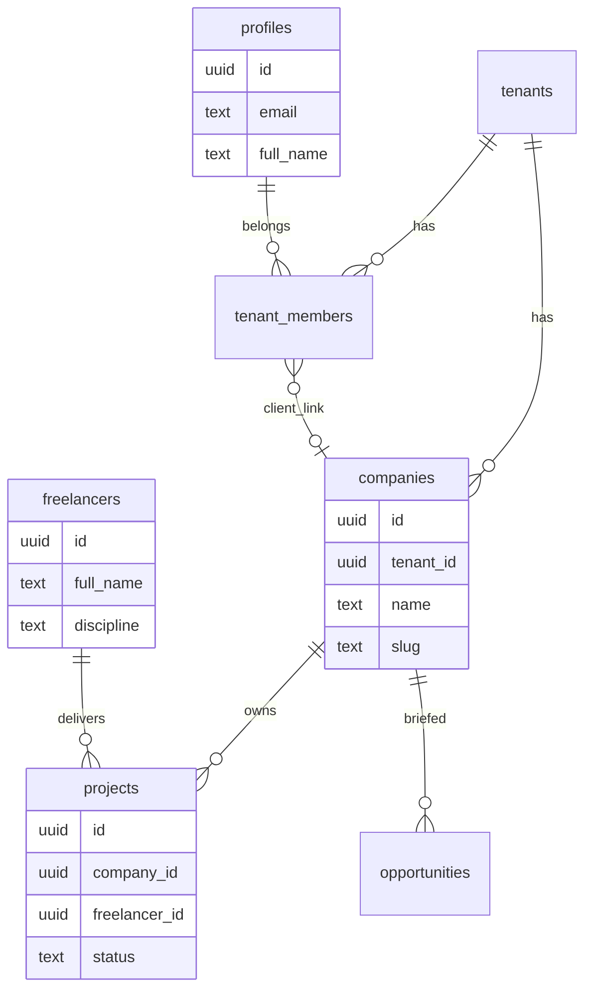

# Core Data Model — Users, Companies, Projects, Talent Profiles

**Branch:** `cursor/supabase-core-schema-ce99`

This document maps the product’s four core entities to the Supabase-backed Talent OS schema. All dashboard data is loaded from Supabase — there is no in-app mock data.

---

## Entity mapping

| Product concept | Supabase implementation | Notes |
|-----------------|-------------------------|-------|
| **users** | `auth.users` + `profiles` + view `users` | Created on signup via `handle_new_user` trigger |
| **companies** | `companies` table | End-client organizations (Acme Corp, etc.) |
| **projects** | `projects` table | Linked to `company_id` and assigned talent |
| **talent_profiles** | `freelancers` table + view `talent_profiles` | Agency talent roster |

Agency workspace (multi-tenant) remains `tenants` with `tenant_members` for RBAC.

---

## Roles (client / talent / admin)

| Product role | Database `user_role` | Access |
|--------------|----------------------|--------|
| **admin** | `admin`, `talent_manager` | Full agency operations |
| **talent** | `freelancer` | Own profile, assigned projects, milestone submit |
| **client** | `client` | Company-scoped projects & opportunities (read) |

Helpers: `lib/auth/roles.ts` → `toCoreRole()`, `isTalent()`, `isClient()`, `isStaff()`

Permissions: `lib/auth/permissions.ts`

---

## Schema diagram



---

## Migrations

| File | Purpose |
|------|---------|
| `001`–`010` | Full Talent OS schema (existing) |
| `011_core_schema_companies_clients.sql` | Companies, client role, views, RLS |

---

## Seed data

`supabase/seed.sql` inserts:

- Demo tenant **Demo Creative Agency**
- Companies: **Acme Corp**, **Northwind Studios**
- Talent profiles: Alex Chen, Maya Patel, Sam Ortiz
- Sample opportunity & projects (when auth profiles exist)

```bash
supabase db reset   # applies migrations + seed.sql
```

Demo users (create via `/signup` or Supabase dashboard):

| Email | Role |
|-------|------|
| admin@demo.agency | admin |
| manager@demo.agency | talent_manager |
| talent@demo.agency | freelancer (talent) |
| client@acme.com | client (link to Acme Corp `company_id` on `tenant_members`) |

---

## Authentication

Already implemented (Sprint 1):

- Email/password + magic link (`/login`, `/signup`)
- Team invites (`/settings/team`)
- Middleware RBAC (`middleware.ts`)
- Client route restrictions (`CLIENT_RESTRICTED_ROUTES`)

---

## API views

```sql
SELECT * FROM users;           -- profiles
SELECT * FROM talent_profiles; -- freelancers (friendly column names)
```

Both views are granted to `authenticated` role.
