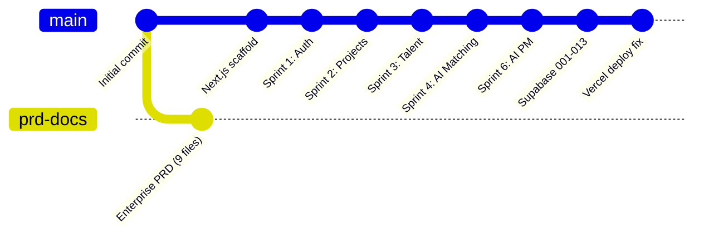
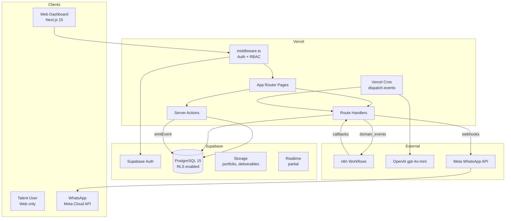
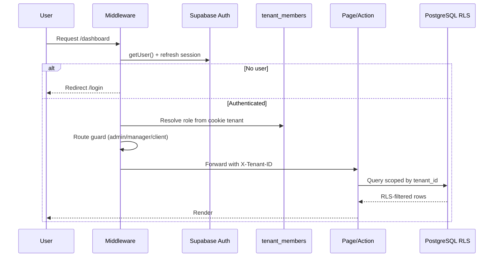
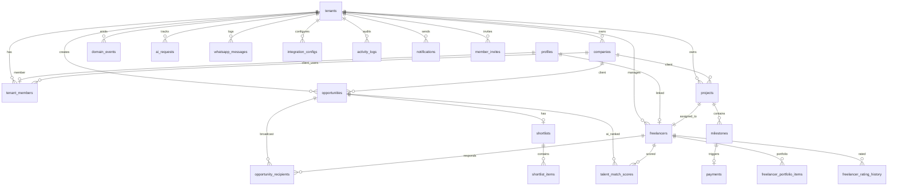
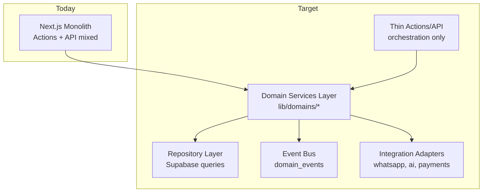
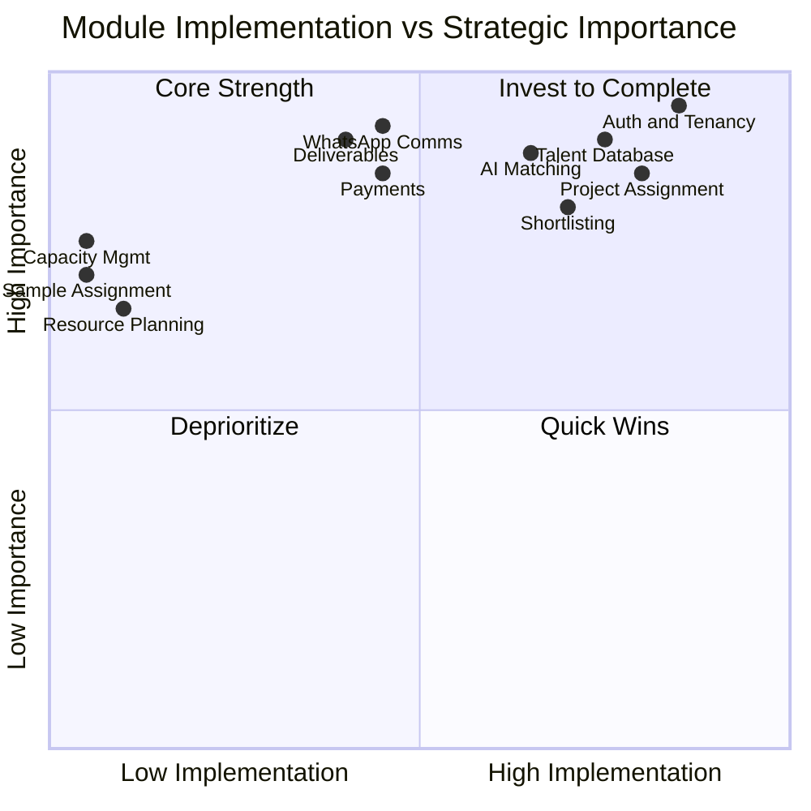
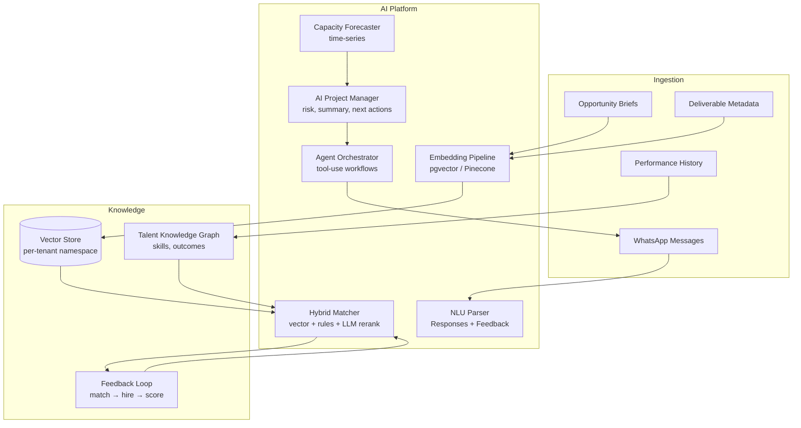
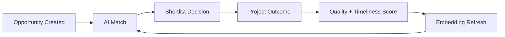

# TalentOS — Technical Audit

| Field | Value |
|-------|-------|
| **Document Version** | 1.0.0 |
| **Audit Date** | 2026-07-30 |
| **Source Analyzed** | `main` branch (195 files — full application) |
| **Status** | Internal — Engineering Reference |
| **Classification** | Confidential |

---

## Table of Contents

1. [Executive Summary](#1-executive-summary)
2. [Repository State](#2-repository-state)
3. [Current Architecture](#3-current-architecture)
4. [Folder Structure](#4-folder-structure)
5. [Database Schema](#5-database-schema)
6. [Authentication](#6-authentication)
7. [Existing Modules](#7-existing-modules)
8. [API Routes](#8-api-routes)
9. [Components](#9-components)
10. [Technical Debt](#10-technical-debt)
11. [Missing Features](#11-missing-features)
12. [Refactoring Opportunities](#12-refactoring-opportunities)
13. [Module Maturity Map](#13-module-maturity-map)
14. [Evolving to an AI-Native Talent OS](#14-evolving-to-an-ai-native-talent-os)
15. [Priority Recommendations](#15-priority-recommendations)
16. [Summary Scorecard](#16-summary-scorecard)

---

## 1. Executive Summary

TalentOS is a **Next.js 15 monolith** deployed on **Vercel**, backed by **Supabase** (PostgreSQL, Auth, Storage), with **n8n** for workflow orchestration and **OpenAI** for AI matching and project management features. It covers roughly **40–50%** of the full workforce OS vision.

| Dimension | Assessment |
|-----------|------------|
| **Architecture maturity** | Solid MVP foundation; event outbox, RLS, RBAC in place |
| **Production readiness** | Beta — core flows work; integrations optional; no automated tests |
| **WhatsApp-first claim** | Partial — webhook receiver exists; primary UX is web dashboard |
| **AI-native claim** | Early — OpenAI ranking + rule fallback; no embeddings/vector search |
| **Documentation vs code** | Significant drift — docs describe APIs/components not yet built |
| **Multi-tenancy** | Strong — RLS + tenant cookie + middleware RBAC |

**Verdict:** A credible agency talent ops MVP with good schema and event foundations. To become an AI-native workforce OS, it needs vector intelligence, WhatsApp-native talent UX, deliverable versioning, workflow depth, and test/observability hardening.

---

## 2. Repository State



| Branch | Files | Runnable | Notes |
|--------|------:|----------|-------|
| `main` | 195 | Yes | Production codebase |
| `cursor/talentos-prd-documentation-5fb1` | 9 | No | Enterprise PRD only (separate branch) |
| 12+ `cursor/sprint-*` branches | 102–195 | Yes | Incremental feature history |

**Risk:** Two documentation tracks (sprint docs on `main` vs enterprise PRD on separate branch) are not merged.

---

## 3. Current Architecture

### 3.1 High-Level System Diagram



### 3.2 Request Flow



### 3.3 Event-Driven Layer

```mermaid
flowchart LR
    A[Server Action] -->|emitEvent| B[domain_events<br/>outbox]
    C[Vercel Cron<br/>/api/cron/dispatch-events] --> B
    B -->|AI_EXECUTION_MODE=direct| D[OpenAI Executor]
    B -->|default| E[n8n Webhook]
    E --> F[WhatsApp / Email / AI]
    F -->|callback| G[/api/webhooks/n8n]
    H[WhatsApp inbound] --> I[/api/webhooks/whatsapp]
    I --> B
```

### 3.4 Technology Stack

| Layer | Technology |
|-------|------------|
| Frontend | Next.js 15, React 19, TypeScript, Tailwind, Radix/shadcn (minimal) |
| Backend | Server Actions + Route Handlers (no separate API service) |
| Database | Supabase PostgreSQL 15, 13 migrations |
| Auth | Supabase Auth (email/password, magic link, invites) |
| Storage | Supabase Storage (`portfolio` bucket) |
| AI | OpenAI `gpt-4o-mini` + rule-based fallback |
| Automation | n8n (3 workflow JSON exports) + Vercel cron |
| Messaging | WhatsApp Cloud API (webhook + template via n8n) |
| Deployment | Vercel |

---

## 4. Folder Structure

### 4.1 Actual Structure (Implemented)

```
talent-os/
├── app/
│   ├── (auth)/              # login, signup, forgot-password, invite/[token]
│   ├── (dashboard)/         # dashboard, talent, opportunities, projects,
│   │                        # payments, analytics, notifications, settings
│   ├── actions/             # 10 server action modules (no payments.ts)
│   └── api/                 # 17 route handlers (subset of documented API)
├── components/
│   ├── ai/                  # 3 AI UI components
│   ├── auth/                # 6 forms
│   ├── layout/              # header, sidebar (no tenant-switcher)
│   ├── opportunities/       # 8 components
│   ├── projects/            # 3 components
│   ├── settings/            # 2 team components
│   ├── shared/              # page-header only
│   ├── talent/              # 4 components
│   └── ui/                  # 7 shadcn primitives (button, card, input…)
├── lib/
│   ├── auth/                # session, guards, permissions, invites, tenant
│   ├── integrations/        # ai/, whatsapp, n8n, events, encryption
│   ├── supabase/            # client, server, admin, middleware
│   ├── opportunities/       # types, validation
│   ├── projects/            # types, validation
│   ├── talent/              # queries, types, validation
│   └── companies/           # queries
├── hooks/                   # use-permissions, use-tenant (2 hooks)
├── types/                   # database.ts (hand-maintained), api.ts, enums.ts
├── supabase/migrations/     # 001–013
├── n8n/                     # 3 workflow exports
└── docs/                    # 22 sprint/architecture docs
```

### 4.2 Documented vs Actual Gaps

`docs/06-folder-structure.md` describes **~60 API routes** and **~40 components** that **do not exist**:

| Documented but missing | Impact |
|------------------------|--------|
| `app/api/freelancers/*`, `opportunities/*`, `projects/*`, `payments/*` | REST API surface incomplete |
| `app/actions/payments.ts`, `notifications.ts`, `tenants.ts` | Payment approval UI-only read |
| `components/payments/*`, `analytics/*`, `shared/data-table.tsx` | Thin UI for finance/analytics |
| `hooks/use-notifications.ts`, `use-realtime.ts` | No realtime UX |
| `.github/workflows/ci.yml` | No CI pipeline in repo |
| Full shadcn set (dialog, table, toast, tabs…) | Limited UI kit |

---

## 5. Database Schema

### 5.1 Entity Relationship (Implemented)



### 5.2 Supabase Tables (Complete Inventory)

| Table | Purpose | Migration |
|-------|---------|-----------|
| `tenants` | Multi-tenant workspace | 001 |
| `profiles` | User profile (extends `auth.users`) | 001 |
| `tenant_members` | RBAC membership + `company_id` | 001, 012 |
| `freelancers` | Talent roster | 001 |
| `opportunities` | Job/gig postings + `requirements` JSONB | 001, 010 |
| `opportunity_recipients` | Broadcast targets + WhatsApp status | 001 |
| `shortlists` | Shortlist container per opportunity | 001 |
| `shortlist_items` | Ranked candidates | 001 |
| `projects` | Assignments + AI summary fields | 001, 010, 012 |
| `milestones` | Deliverable/payment units | 001 |
| `payments` | Payout lifecycle | 001 |
| `activity_logs` | Lightweight audit trail | 001 |
| `notifications` | In-app notifications | 001 |
| `whatsapp_messages` | Message log | 001 |
| `integration_configs` | Per-tenant WhatsApp/n8n config | 001 |
| `domain_events` | Transactional outbox | 005 |
| `webhook_deliveries` | Inbound idempotency | 005 |
| `email_logs` | Email delivery tracking | 005 |
| `ai_requests` | AI governance + cost tracking | 005 |
| `talent_match_scores` | AI match results | 005 |
| `member_invites` | Team/talent/client invites | 006 |
| `freelancer_portfolio_items` | Portfolio gallery | 009 |
| `freelancer_rating_history` | Rating change history | 009 |
| `companies` | End-client organizations | 012 |

### 5.3 Views

| View | Purpose |
|------|---------|
| `users` | Canonical profile view (`security_invoker`) |
| `talent_profiles` | Canonical talent view |
| `v_dashboard_summary` | Dashboard KPIs |
| `v_opportunity_fill_rate` | Fill rate by month |
| `v_freelancer_utilization` | 90-day utilization |
| `v_payment_aging` | Payment pipeline aging |
| `v_response_metrics` | WhatsApp response rates |

### 5.4 Key RPC Functions

| Function | Purpose |
|----------|---------|
| `create_tenant_with_admin` | Agency signup |
| `create_project_with_milestones` | Atomic project creation |
| `emit_domain_event` | Outbox pattern |
| `accept_member_invite` / `revoke_member_invite` | Team onboarding |
| `search_freelancers` | Faceted talent search |
| `link_freelancer_to_user` | Talent account linking |

### 5.5 RLS Model

- **Pattern:** Row-level security on all tenant-scoped tables
- **Helpers:** `user_tenant_ids()`, `manager_tenant_ids()`, `admin_tenant_ids()`, `client_company_ids()`
- **Roles in DB:** `admin`, `talent_manager`, `freelancer`, `client`
- **Recent fixes (013):** View `security_invoker`, client read on milestones/payments, payment approval policy restored

---

## 6. Authentication

### 6.1 Auth Architecture

```mermaid
flowchart TD
    A[Signup Agency] -->|signUpAgency| B[Supabase Auth create user]
    B --> C[RPC create_tenant_with_admin]
    C --> D[Set ACTIVE_TENANT_COOKIE]

    E[Team Invite] --> F[member_invites token]
    F --> G[/invite/token page]
    G --> H[accept_member_invite RPC]
    H --> I[Link freelancer roster if role=freelancer]

    J[Login] --> K[Password or Magic Link]
    K --> L[middleware.ts session refresh]
    L --> M[tenant_members role resolution]
```

| Feature | Status |
|---------|--------|
| Email/password signup | Implemented |
| Magic link | Implemented |
| Password reset | Partial — no dedicated set-password UI |
| Team invites (admin, manager, talent, client) | Implemented |
| MFA | Not implemented |
| SSO (SAML/OIDC) | Not implemented |
| Talent WhatsApp identity | Not implemented — talent uses web login |
| API keys / OAuth | Not implemented |

### 6.2 RBAC (Application Layer)

Four roles with a static permission map in `lib/auth/permissions.ts`:

| Role | Key permissions |
|------|-----------------|
| `admin` | Full ops + billing + integrations |
| `talent_manager` | Talent, opportunities, projects, AI, analytics |
| `freelancer` | Own profile, respond, submit milestones |
| `client` | Read company projects/opportunities |

**Middleware guards:** route-level checks for admin-only, manager-only, client-restricted, freelancer settings block.

**Gap:** Permissions enforced in middleware + server actions, but not consistently on all API routes. No custom roles.

---

## 7. Existing Modules

| Module | Implementation | Completeness |
|--------|----------------|--------------|
| **Talent Database** | CRUD, search RPC, portfolio, ratings | 75% |
| **Opportunity Broadcasting** | Create, broadcast event → n8n, recipients | 60% |
| **Response Collection** | Web form + WhatsApp quick reply (YES/NO) | 40% |
| **Shortlisting** | Board UI, status updates | 70% |
| **Sample Assignment** | Not implemented | 0% |
| **Project Assignment** | RPC atomic create, company link | 80% |
| **Task Tracking** | Milestones only (no tasks/deps) | 35% |
| **Communication Tracking** | `whatsapp_messages`, `activity_logs` | 30% |
| **Deliverable Submission** | Milestone `submission_files` JSONB | 40% |
| **Revision Management** | Milestone status `revision` | 25% |
| **Approval Workflow** | Manager review on milestones | 35% |
| **Payment Workflow** | Auto-created on approval; read-only UI | 45% |
| **Performance Analytics** | SQL views + basic dashboard | 50% |
| **AI Matching** | OpenAI rank + rule fallback + scores table | 65% |
| **Resource Planning** | Utilization view only | 10% |
| **Capacity Management** | Availability enum only | 5% |
| **AI Project Manager** | Brief parse, summary, status assessment | 55% |
| **Companies/Clients** | Schema + dropdown; no admin page | 50% |
| **WhatsApp Integration** | Webhook + n8n dispatch | 45% |
| **Workflow Automation** | domain_events + n8n (3 workflows exported) | 40% |

---

## 8. API Routes

### 8.1 Implemented Routes (17)

| Method | Route | Purpose |
|--------|-------|---------|
| GET/POST | `/api/auth/callback` | OAuth/magic link callback |
| GET | `/api/auth/session` | Session info |
| POST | `/api/auth/signout` | Sign out |
| GET/POST | `/api/auth/invite/[token]` | Invite preview/accept |
| GET/POST | `/api/ai/match` | Request AI match |
| GET | `/api/ai/match/[opportunityId]` | Get match results |
| GET/POST | `/api/ai/pm/[entityType]/[entityId]` | AI PM features |
| GET | `/api/analytics/dashboard` | Dashboard metrics |
| GET | `/api/talent/search` | Talent search |
| GET | `/api/team/members` | Team list |
| GET/POST | `/api/webhooks/whatsapp` | Meta webhook |
| POST | `/api/webhooks/n8n` | n8n callbacks |
| GET | `/api/cron/dispatch-events` | Event outbox processor |
| GET | `/api/cron/check-overdue-milestones` | Overdue reminders |
| POST | `/api/internal/ai/execute` | Internal AI executor |
| POST | `/api/internal/ai/execute-match` | Internal match executor |
| GET | `/api/health` | Health check |

### 8.2 Server Actions (10 modules)

`auth`, `freelancers`, `opportunities`, `shortlists`, `projects`, `milestones`, `companies`, `portfolio`, `ai`, `ai-pm`

**Notable absence:** `payments.ts` — payments page is read-only; no approve/pay actions in UI layer.

### 8.3 Documented but Missing REST Endpoints

Per `docs/05-api-architecture.md` and `docs/06-folder-structure.md`:

- `/api/freelancers/*` (CRUD, import, suggest)
- `/api/opportunities/[id]/broadcast`, `/respond`
- `/api/shortlists/*`
- `/api/projects/[id]/milestones`
- `/api/milestones/[id]/submit`, `/review`
- `/api/payments/*` (approve, pay, export, dispute)
- `/api/notifications/*`
- `/api/integrations/*`

**Pattern:** Mutations go through Server Actions; public REST API for integrations is largely unbuilt.

---

## 9. Components

### 9.1 Component Inventory (35 files)

| Domain | Components | Notes |
|--------|------------|-------|
| **Auth** | 6 | Login, signup, magic link, invite, forgot password |
| **Layout** | 2 | Header, sidebar — no tenant switcher, notification bell |
| **Talent** | 4 | Profile form, skills, filters, portfolio gallery |
| **Opportunities** | 8 | Form, broadcast, AI match, shortlist board |
| **Projects** | 3 | Create form, kanban, tracker |
| **AI** | 3 | Summary, requirements, status assessment |
| **Settings** | 2 | Team invite, members list |
| **UI (shadcn)** | 7 | Minimal set — missing table, dialog, toast, tabs |
| **Shared** | 1 | PageHeader + StatCard + EmptyState |

### 9.2 UI Maturity Assessment

- Server Components used correctly for data fetching
- Client interactivity limited to forms and boards
- No design system beyond basic shadcn primitives
- No loading skeletons, error boundaries, or toast notifications (despite docs referencing them)
- Payments, analytics pages are table-only with no actions/charts wired to Recharts

---

## 10. Technical Debt

### 10.1 Critical

| Issue | Risk | Location |
|-------|------|----------|
| **No automated tests** | Regressions undetected | Entire repo — zero test files |
| **Hand-maintained `types/database.ts`** | Schema drift from Supabase | `types/database.ts` |
| **Documentation/code divergence** | Wrong assumptions for devs | `docs/06`, `docs/05` vs `app/api/` |
| **Dual PRD tracks unmerged** | Product/engineering misalignment | PR branch vs `main` docs |
| **Service role in cron/webhooks** | Broad DB access if leaked | `lib/supabase/admin.ts` |
| **No CI/CD in repo** | No lint/typecheck gate on PRs | Missing `.github/workflows/` |

### 10.2 High

| Issue | Details |
|-------|---------|
| **Monolithic server actions** | Business logic mixed with UI orchestration |
| **Inconsistent error handling** | Mix of `{ ok, error }` and thrown errors |
| **WhatsApp parsing is naive** | YES/NO quick replies only — no NLU |
| **AI without embeddings** | Keyword/rule overlap + LLM rerank; no semantic search |
| **n8n dependency for core flows** | Broadcast/WhatsApp fail silently if n8n down |
| **No idempotency on server actions** | Duplicate broadcasts/projects possible |
| **Payments read-only** | RLS allows approve; no UI/action wiring |
| **Single talent per project** | Schema constraint limits multi-disciplinary teams |

### 10.3 Medium

| Issue | Details |
|-------|---------|
| Missing `/companies` admin UI | Companies only via seed or action |
| Password reset incomplete | No set-password page after reset link |
| `vercel.json` lacks cron config | Cron routes exist but may need Vercel dashboard setup |
| Limited shadcn adoption | Reinventing patterns in raw HTML tables |
| Activity logs ≠ audit logs | No immutability, hash chain, or compliance retention |
| Email confirmation friction | Documented as dev blocker |

---

## 11. Missing Features

Compared to the 17-module lifecycle and enterprise PRD vision:

| Feature | Status |
|---------|--------|
| Talent segments (dynamic/static) | Missing — manual recipient selection |
| Sample assignment workflow | Missing |
| Task dependencies / Gantt | Missing |
| Deliverable versioning | Missing — flat milestone files |
| Multi-step approval chains | Missing |
| Payment provider integration (Stripe/Wise) | Missing |
| Payment approve/pay UI | Missing |
| WhatsApp template management UI | Missing |
| Talent microsite / magic links | Missing |
| WhatsApp consent (STOP/START) | Missing |
| Semantic / vector talent search | Missing |
| Capacity forecasting | Missing |
| Resource planning calendar | Missing |
| Custom fields per workspace | Missing |
| Workflow automation builder | Missing — n8n external only |
| Public REST API + webhooks outbound | Missing |
| SSO / MFA | Missing |
| SOC 2 / formal audit logging | Missing |
| Multi-talent projects | Missing |
| Realtime subscriptions in UI | Schema ready; UI not wired |

---

## 12. Refactoring Opportunities

### 12.1 Architecture



| Refactor | Benefit | Effort |
|----------|---------|--------|
| Extract domain services (`talent/`, `opportunity/`, `project/`) | Testability, reuse | Medium |
| Generate Supabase types (`supabase gen types`) | Type safety | Low |
| Consolidate AI modules (`openai.ts` + `openai-client.ts`) | Reduce duplication | Low |
| Add repository pattern over raw Supabase calls | Consistent queries | Medium |
| Implement outbound webhook dispatcher | Integration-ready | Medium |
| Replace n8n-critical path with in-app workers | Reliability | High |

### 12.2 Database

| Change | Rationale |
|--------|-----------|
| Rename `freelancers` → `talents` (view already exists) | Product language alignment |
| Add `deliverables` + `deliverable_versions` tables | Proper revision workflow |
| Add `talent_segments` + `segment_members` | Broadcast targeting |
| Add `pgvector` extension + `embedding` column | Semantic search |
| Add `audit_logs` partitioned table | Compliance |
| Support `project_assignments` many-to-many | Multi-talent projects |

### 12.3 Frontend

| Change | Rationale |
|--------|-----------|
| Complete shadcn kit (Table, Dialog, Toast, Tabs) | UX consistency |
| Extract feature modules (`features/talent/`) | Scalable structure |
| Add React Query for client cache | Reduce prop drilling |
| Build talent-facing mobile-first layout | WhatsApp-first UX companion |

---

## 13. Module Maturity Map



---

## 14. Evolving to an AI-Native Talent OS

### 14.1 Target AI Architecture



### 14.2 AI-Native Roadmap (Phased)

**Phase A — Intelligence Foundation**

1. Add `pgvector` to Supabase; embed talent profiles and opportunity briefs on write
2. Replace rule-only fallback with hybrid retrieval (vector top-50 → LLM rerank top-10)
3. Build NLU parser for WhatsApp free-text responses (structured fields + confidence)
4. Store AI explanations in `talent_match_scores.rationale` (already exists — enrich)
5. Add feedback loop: shortlist outcome → retrain weights per tenant

**Phase B — Conversational Talent UX**

1. Talent microsite with magic links (Supabase custom JWT or token table)
2. WhatsApp session flows: respond, submit deliverable link, payment status
3. Consent management (`whatsapp_consent`, STOP handler)
4. Proactive AI nudges: deadline reminders, capacity check-ins

**Phase C — AI Project Manager Agent**

1. Unified agent with tools: `get_project`, `update_milestone`, `notify_talent`, `request_revision`
2. Auto-generate project plans from approved briefs
3. Risk detection: overdue milestones, revision loops, budget burn
4. Daily digest to talent managers via WhatsApp + email

**Phase D — Workforce Intelligence**

1. Capacity model: committed hours from active projects vs. availability
2. Demand forecasting from opportunity pipeline
3. Cost-per-deliverable analytics with AI anomaly detection
4. Cross-project talent reallocation recommendations

### 14.3 Specific AI Enhancements for Existing Code

| Current | AI-Native Upgrade |
|---------|-------------------|
| `rankTalentWithOpenAi()` one-shot prompt | Tool-augmented agent with talent DB + calendar access |
| `parseQuickResponse()` YES/NO | LLM NLU with schema validation (Zod) |
| `search_freelancers()` SQL text | Hybrid: SQL filters + vector similarity |
| `ai_summary` JSONB on projects | Streaming summaries with change detection |
| `domain_events` → n8n | AI event router: classify → route to agent or workflow |
| Manual shortlist board | AI auto-shortlist with human-in-loop approval |
| `activity_logs` | AI-generated activity summaries for executives |

### 14.4 Data Flywheel (Competitive Moat)



Each tenant's match quality improves with usage — **tenant-isolated embeddings** with optional anonymized cross-tenant learning for enterprise tier.

### 14.5 Recommended Tech Additions

| Capability | Recommendation |
|------------|----------------|
| Vector search | Supabase `pgvector` (simplest) or Pinecone (scale) |
| LLM orchestration | Vercel AI SDK + structured outputs |
| Agent framework | LangGraph or custom tool registry in `lib/ai/agent/` |
| Observability | Langfuse or Helicone for AI request tracing (extend `ai_requests`) |
| Feature flags | LaunchDarkly or Supabase `tenants.settings.features` (partially exists) |
| Background jobs | Inngest or Trigger.dev (replace fragile Vercel cron-only) |

---

## 15. Priority Recommendations

| Priority | Action | Impact |
|----------|--------|--------|
| P0 | Add CI (lint, typecheck, build) | Stability |
| P0 | Generate Supabase types; align `database.ts` | Correctness |
| P0 | Wire payment approve/pay actions + UI | Core workflow completion |
| P1 | Add `pgvector` + embedding pipeline | AI-native foundation |
| P1 | WhatsApp NLU + consent tracking | WhatsApp-first credibility |
| P1 | Merge enterprise PRD with sprint docs | Alignment |
| P2 | Extract domain service layer + tests | Maintainability |
| P2 | Build public API v1 for integrations | Platform play |
| P2 | Deliverable versioning schema | Creative workflow fit |
| P3 | Replace n8n critical path with Inngest | Reliability |
| P3 | SSO + MFA | Enterprise sales |

---

## 16. Summary Scorecard

| Area | Score | Notes |
|------|-------|-------|
| Architecture | 7/10 | Good foundations; monolith limits scale |
| Database design | 8/10 | Solid schema, RLS, events; missing vectors/deliverables |
| Auth & security | 6/10 | RBAC works; no MFA/SSO; service role exposure |
| API completeness | 4/10 | Actions-heavy; REST API mostly undocumented vs built |
| UI/UX | 5/10 | Functional MVP; thin components; no talent-mobile UX |
| AI capabilities | 5/10 | Matching + PM started; not yet AI-native |
| WhatsApp integration | 4/10 | Webhooks yes; not primary talent interface |
| Test coverage | 0/10 | No tests |
| Documentation | 6/10 | Extensive but drifted from code |
| Production readiness | 5/10 | Beta suitable for pilot agencies |

---

## Bottom Line

TalentOS on `main` is a well-architected **agency talent ops MVP** with strong Supabase multi-tenancy and an emerging AI layer. It is not yet the **AI-native, WhatsApp-first workforce OS** described in the enterprise vision. The highest-leverage evolution path is: **vector intelligence → WhatsApp NLU/conversational UX → agentic project manager → capacity forecasting**, built on the existing `domain_events` + `ai_requests` infrastructure.

---

*End of Technical Audit*
