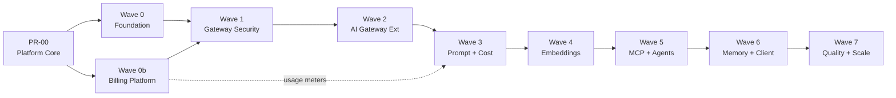
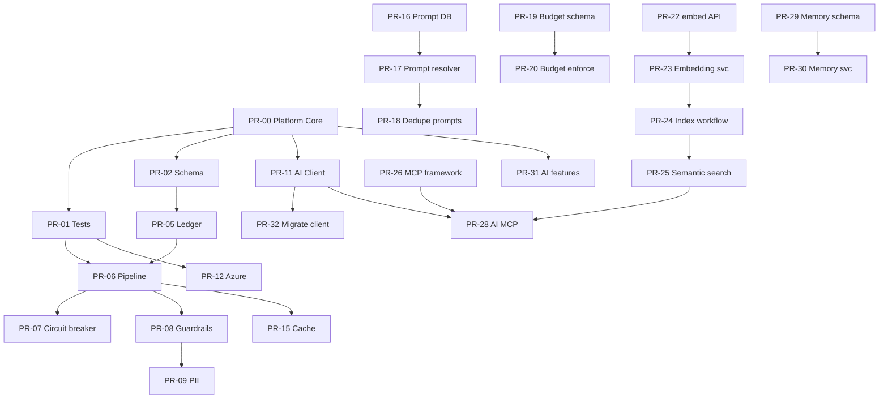

# AI Platform — Implementation Roadmap

**Document version:** 1.2.0  
**Date:** July 31, 2026  
**Sources:** [AI_PLATFORM.md](./AI_PLATFORM.md) v1.0.0 · [AI_GAP_ANALYSIS.md](./AI_GAP_ANALYSIS.md) v1.0.0 · [BILLING_PLATFORM.md](./BILLING_PLATFORM.md) v1.0.0  
**Scope:** Planning only — no code in this document  
**Branch naming:** `cursor/ai-pr-XX-<slug>-5fb1` (AI) · `cursor/billing-pr-BXX-<slug>-5fb1` (Billing)  
**Changelog:** v1.2.0 — Added Wave 0b Billing Platform (PR-B01–PR-B08); v1.1.0 — Added PR-00 Platform Core

---

## Overview

This roadmap implements the **AI Platform** (43 PRs) and **Billing Platform** (8 PRs), ordered by dependency and risk. **PR-00 (Platform Core) is mandatory first** — it provides shared infrastructure consumed by every subsequent PR. **Wave 0b (Billing)** runs in parallel with AI Wave 0–3 where dependencies allow. Each PR is independently reviewable, deployable, and reversible where possible.

### Confirmed architecture decisions (apply throughout)

| Decision | Implementation |
|----------|----------------|
| pgvector first | Embeddings stay on Supabase pgvector until scale triggers external DB evaluation |
| Azure OpenAI Phase 1 | PR-12 in foundation wave |
| Hybrid budgets | Soft alert at 80%; hard 402 at 100% (Enterprise may disable hard limit) |
| Product IDs | `talent_os`, `media_intel`, `ad_studio` — default `talent_os` for backward compatibility |
| Direct execution default | Gateway/workflow in-process; n8n for side effects only |

### Effort legend

| Size | Meaning |
|------|---------|
| **S** | ≤1 day — focused change, few files |
| **M** | 2–3 days — moderate scope, tests required |
| **L** | 4–5 days — cross-cutting, migration or many touchpoints |
| **XL** | 6+ days — large surface; may split further if review feedback |

### Risk legend

| Level | Meaning |
|-------|---------|
| **Low** | Internal refactor; feature-flagged or backward compatible |
| **Medium** | Behavior change, migration, or new runtime dependency |
| **High** | Security path, data model change, or production AI behavior change |

### Roadmap phases



| Wave | PRs | Theme |
|------|-----|-------|
| **0a** | **PR-00** | **Platform Core — shared SDK, context, registry, events** |
| **0b** | **PR-B01 – PR-B08** | **Billing Platform — org → subscription → plan → seats → usage → invoice → payments** |
| 0 | PR-01 – PR-05 | Test harness, schema, execution path, audit integrity |
| 1 | PR-06 – PR-10 | Pipeline, circuit breakers, guardrails, PII |
| 2 | PR-11 – PR-15 | AI client, Azure, routing, cache |
| 3 | PR-16 – PR-21 | Prompt Platform DB, budgets, alerts |
| 4 | PR-22 – PR-25 | Embedding generation and semantic search |
| 5 | PR-26 – PR-28 | MCP adapters |
| 6 | PR-29 – PR-32 | Memory Platform, AI feature namespaces, client migration |
| 7 | PR-33 – PR-42 | Observability, quality, optimization, deprecation |

---

## PR-00 — Platform Core (prerequisite)

> **Most important missing piece.** All AI PRs depend on this shared infrastructure layer. Delivers the cross-product foundation that Talent OS, Media Intelligence, and AI Ad Studio will share.

### PR-00: Platform Core — shared infrastructure

| Field | Detail |
|-------|--------|
| **Objective** | Create shared platform infrastructure consumed by the AI Platform, domain services, agents, and future products. Establishes a single SDK, organization context, product registry, feature flags, configuration, events, contracts, and types — with no AI-specific logic beyond registration hooks. |
| **Gap IDs** | M-001, M-016, M-017, TD-012; closes multi-product gap (5%) and DevEx gap (35%) foundations |
| **Deliverables** | See [Deliverables breakdown](#pr-00-deliverables-breakdown) below |

#### Files affected

| Area | Paths (new unless noted) |
|------|--------------------------|
| **Platform SDK** | `modules/platform/sdk/index.ts`, `modules/platform/sdk/client.ts`, `modules/platform/sdk/factory.ts` |
| **Organization Context** | `modules/platform/context/organization.ts`, `modules/platform/context/resolver.ts` (wraps session + tenant from `modules/core/api/context.ts`) |
| **Product Registry** | `modules/platform/products/registry.ts`, `modules/platform/products/types.ts`, `modules/platform/products/talent-os.ts`, `media-intel.ts`, `ad-studio.ts` |
| **Feature Flags** | `modules/platform/features/flags.ts`, `modules/platform/features/registry.ts`, `lib/repositories/platform-feature.repository.ts` |
| **Configuration Service** | `modules/platform/config/service.ts`, `modules/platform/config/schema.ts`, `lib/repositories/platform-config.repository.ts` |
| **Platform Events** | `modules/platform/events/catalog.ts`, `modules/platform/events/types.ts`, `modules/platform/events/emitter.ts` (wraps `emitEvent` / domain outbox) |
| **Shared Contracts** | `modules/platform/contracts/platform-client.ts`, `config-provider.ts`, `feature-flag-provider.ts`, `event-emitter.ts` |
| **Shared Types** | `modules/platform/types/index.ts` — `ProductId`, `OrganizationContext`, `PlatformFeatureFlag`, `PlatformConfigScope`, `PlatformEventType` |
| **Database** | `supabase/migrations/022_platform_core.sql` — `platform_product_registry`, `platform_feature_flags`, `platform_config` (org overrides) |
| **Tests** | `tests/unit/platform/*.test.ts` |
| **Docs** | `docs/Architecture/PLATFORM_CORE.md` (new) |

#### PR-00 deliverables breakdown

| # | Deliverable | Description | Primary module |
|---|-------------|-------------|----------------|
| 1 | **Platform SDK** | `createPlatformClient({ productId, getContext })` — entry point for all platform capabilities; AI client (PR-11) extends this | `modules/platform/sdk/` |
| 2 | **Organization Context** | Immutable `OrganizationContext`: `organizationId`, `userId`, `role`, `permissions`, `correlationId`, `requestId`, `productId` | `modules/platform/context/` |
| 3 | **Product Registry** | Register and resolve `talent_os`, `media_intel`, `ad_studio`; validate productId; expose metadata (name, enabled, default config) | `modules/platform/products/` |
| 4 | **Feature Flags** | Unified flag service: env → platform default → org override; replaces ad-hoc AI-only flags over time | `modules/platform/features/` |
| 5 | **Configuration Service** | Layered config: env vars → platform defaults → org `platform_config` row → request override; used by AI routing, budgets, guardrails later | `modules/platform/config/` |
| 6 | **Platform Events** | Typed event catalog (`platform.*`, `ai.*` namespaces); `PlatformEventEmitter.emit()` wraps domain outbox with productId + org context | `modules/platform/events/` |
| 7 | **Shared Contracts** | Interfaces for DI and testing: `IPlatformClient`, `IConfigService`, `IFeatureFlagService`, `IProductRegistry`, `IPlatformEventEmitter` | `modules/platform/contracts/` |
| 8 | **Shared Types** | Canonical types exported from `@/modules/platform/types` — no duplicate ProductId/OrgContext definitions elsewhere | `modules/platform/types/` |

#### Dependencies

| Dependency | Notes |
|------------|-------|
| **None** | First PR in the roadmap; builds on existing `modules/core/api/context.ts`, RLS, and Redis from P0 production work |

#### Risk level

**Medium** — new module boundary and DB tables; no breaking changes to existing APIs if additive.

#### Migration notes

- Seed `platform_product_registry` with three products; only `talent_os` has `enabled: true`.
- Existing `tenant.settings` AI flags remain; Platform Feature Flags read tenant settings as fallback until PR-11 migrates AI flags.
- Migration number `022_platform_core.sql` — renumber AI migration PR-02 to `023_ai_requests_extend.sql` to avoid collision (update PR-02 accordingly).
- Export path: `@/modules/platform` (barrel); `@/lib/ai-platform` created in PR-11 as AI extension.

#### Testing requirements

| Test | Requirement |
|------|-------------|
| Product registry | Unknown `productId` throws; `talent_os` resolves |
| Organization context | Resolver maps session → `OrganizationContext` |
| Feature flags | Precedence: env > platform default > org override |
| Config service | Layered merge returns expected values |
| Platform events | Emit includes `productId`, `organizationId`, `correlationId` |
| SDK factory | `createPlatformClient` returns client with registered product |
| Coverage | ≥15 unit tests; `npm test` green |

#### Documentation updates

| Document | Update |
|----------|--------|
| `docs/Architecture/PLATFORM_CORE.md` | **New** — architecture, folder structure, usage examples |
| `docs/Architecture/BILLING_PLATFORM.md` | **Reference** — billing depends on Platform Core org context |
| `docs/Architecture/AI_PLATFORM.md` | §13 — reference Platform Core as dependency |
| `docs/Architecture/AI_GAP_ANALYSIS.md` | Mark multi-product and DevEx foundations partial |
| `docs/06-folder-structure.md` | Add `modules/platform/` tree |
| `README.md` | Link to Platform Core doc |

#### Acceptance criteria

- [ ] `@/modules/platform` exports SDK, types, contracts, and services
- [ ] `ProductId` type is `'talent_os' | 'media_intel' | 'ad_studio'` — single source of truth
- [ ] `createPlatformClient({ productId: 'talent_os', getContext })` instantiates without error
- [ ] Organization context resolves from existing session/tenant middleware patterns
- [ ] Product registry lists 3 products; unknown product rejected at SDK boundary
- [ ] Feature flag and config services have unit tests with precedence rules
- [ ] Platform event emit wraps domain outbox; event payload includes product + org
- [ ] Migration `022_platform_core.sql` applies; RLS on org-scoped config/flags
- [ ] No changes to existing user-facing behavior or UI
- [ ] PR-01 can depend on `@/modules/platform/types` and test DI

#### Estimated effort

**L** (4–5 days) — foundational; quality here reduces rework in all 42 downstream PRs.

---

## Wave 0b — Billing Platform

> **SaaS billing flow:** Organizations → Subscription → Plan → Seats → Usage → Invoice → Payments  
> Full architecture: [BILLING_PLATFORM.md](./BILLING_PLATFORM.md)

Wave 0b can start immediately after **PR-00**. PR-B04 (usage metering) integrates with **PR-19** (AI cost aggregates). PR-B02 (entitlements) should precede **PR-20** (budget enforcement) so plan limits drive AI budgets.

### PR-B01: Billing schema foundation

| Field | Detail |
|-------|--------|
| **Objective** | Create core billing tables: organization profiles, plans catalog, subscriptions, meters. |
| **Gap IDs** | Billing maturity ~15%; closes subscription/plan normalization gap |
| **Files affected** | `supabase/migrations/024_billing_platform.sql` (new), `modules/billing/types/index.ts` (new), `lib/repositories/billing-subscription.repository.ts`, `billing-plan.repository.ts`, `modules/core/types/database.ts` |
| **Dependencies** | **PR-00** (OrganizationContext, ProductId) |
| **Risk level** | **Medium** — DB migration |
| **Migration notes** | Seed `billing_plans` (starter/pro/enterprise), `billing_meters`; RLS on all tables; `024` follows `022_platform_core`, `023_ai_requests_extend`. |
| **Testing requirements** | Migration applies; RLS blocks cross-tenant read; plan seed count = 3. |
| **Documentation updates** | `BILLING_PLATFORM.md` §14; `MIGRATIONS_INDEX.md`. |
| **Acceptance criteria** | Tables exist with RLS; plans seeded; subscription CRUD via repository works in integration test. |
| **Estimated effort** | **M** |

---

### PR-B02: Plan catalog and entitlements service

| Field | Detail |
|-------|--------|
| **Objective** | `PlanService.resolveEntitlements(orgId)` merges plan defaults + org overrides; backfill subscriptions from `tenant.settings.subscription`. |
| **Gap IDs** | Tier enforcement scattered in settings JSON |
| **Files affected** | `modules/billing/plans/service.ts`, `entitlements.ts`, `catalog.ts`, `lib/repositories/billing-plan.repository.ts`, `scripts/backfill-billing-subscriptions.ts` (new) |
| **Dependencies** | PR-B01 |
| **Risk level** | **Medium** — backfill touches all tenants |
| **Migration notes** | `billing_plan_overrides` for Enterprise; backfill idempotent. |
| **Testing requirements** | Unit tests: starter/pro/enterprise entitlements; backfill script dry-run mode. |
| **Documentation updates** | `BILLING_PLATFORM.md` §8; `08-multi-tenant-architecture.md` — reference billing entitlements. |
| **Acceptance criteria** | Every tenant has `billing_subscriptions` row; `resolveEntitlements` returns correct limits for each tier. |
| **Estimated effort** | **M** |

---

### PR-B03: Seat management and enforcement

| Field | Detail |
|-------|--------|
| **Objective** | Track licensed seats; block team invites when at plan cap; seat overage counting. |
| **Gap IDs** | No seat licensing |
| **Files affected** | `modules/billing/seats/service.ts`, `lib/repositories/billing-seat.repository.ts`, team invite server action / API (seat check hook) |
| **Dependencies** | PR-B02 |
| **Risk level** | **Medium** — blocks invites at limit |
| **Migration notes** | Seed active seats from existing `tenant_members`; freelancers excluded from seat count. |
| **Testing requirements** | Unit test: at cap → invite rejected; release seat → invite allowed; overage count correct. |
| **Documentation updates** | `BILLING_PLATFORM.md` §9. |
| **Acceptance criteria** | `SeatService.canAssign(orgId)` enforced on invite; `billing.seat.limit_exceeded` event emitted. |
| **Estimated effort** | **M** |

---

### PR-B04: Usage metering platform

| Field | Detail |
|-------|--------|
| **Objective** | Unified usage ledger with idempotent ingest; aggregate by billing period; wire AI and WhatsApp producers. |
| **Gap IDs** | No unified usage ledger |
| **Files affected** | `modules/billing/usage/service.ts`, `meters.ts`, `aggregator.ts`, `lib/repositories/billing-usage.repository.ts`, `lib/ai/gateway/pipeline.ts` (post-success hook), WhatsApp send path (meter hook), `app/api/cron/billing/aggregate-usage/route.ts` |
| **Dependencies** | PR-B01, **PR-19** (AI cost aggregates — can stub until PR-19 merges) |
| **Risk level** | **Medium** — new write path on hot paths |
| **Migration notes** | Idempotency keys prevent double-count; cron aggregates hourly. |
| **Testing requirements** | Unit test: duplicate idempotency key ignored; aggregate sums match records; AI request emits `ai.cost_usd` meter. |
| **Documentation updates** | `BILLING_PLATFORM.md` §10; `AI_PLATFORM.md` §10 — cross-ref billing usage. |
| **Acceptance criteria** | Usage records created for AI + WA; aggregates available for invoice generation; no double billing on retry. |
| **Estimated effort** | **L** |

---

### PR-B05: Invoice generation

| Field | Detail |
|-------|--------|
| **Objective** | Monthly invoice generation: plan base + seat overage + usage overage line items. |
| **Gap IDs** | SaaS invoicing 0% |
| **Files affected** | `modules/billing/invoices/service.ts`, `generator.ts`, `lib/repositories/billing-invoice.repository.ts`, `app/api/cron/billing/generate-invoices/route.ts` |
| **Dependencies** | PR-B03, PR-B04 |
| **Risk level** | **Low** — cron-only initially |
| **Migration notes** | Invoice numbers sequential per org; draft → open on finalize. |
| **Testing requirements** | Integration test: mock period data → invoice with expected line items and totals. |
| **Documentation updates** | `BILLING_PLATFORM.md` §11. |
| **Acceptance criteria** | Cron generates invoices for active subscriptions; line items reconcile to usage aggregates + seats. |
| **Estimated effort** | **M** |

---

### PR-B06: Stripe payment integration

| Field | Detail |
|-------|--------|
| **Objective** | Stripe Customer, Checkout, Customer Portal, webhooks; `billing_payments` reconciliation. |
| **Gap IDs** | Stripe Phase 2 in enterprise doc — brought forward |
| **Files affected** | `modules/billing/payments/service.ts`, `stripe.adapter.ts`, `app/api/webhooks/stripe/route.ts`, `app/api/billing/checkout/route.ts`, `app/api/billing/portal/route.ts`, `lib/env.ts` (STRIPE_* vars) |
| **Dependencies** | PR-B05 |
| **Risk level** | **High** — payment path, webhook security |
| **Migration notes** | Stripe test mode in CI; webhook idempotency via `billing_webhook_events`; no PCI data stored. |
| **Testing requirements** | Webhook signature test; checkout session creation; payment_failed → past_due subscription. |
| **Documentation updates** | `BILLING_PLATFORM.md` §12; `.env.local.example`; `SECURITY.md` — webhook verification. |
| **Acceptance criteria** | Admin can checkout and attach payment method; webhook updates subscription status; `billing.payment.succeeded` event emitted. |
| **Estimated effort** | **L** |

---

### PR-B07: Subscription lifecycle and middleware

| Field | Detail |
|-------|--------|
| **Objective** | Replace ad-hoc `tenant.settings.subscription` reads with `SubscriptionService`; middleware enforcement for past_due/canceled/suspended. |
| **Gap IDs** | Subscription status in JSON blob |
| **Files affected** | `modules/billing/subscription/service.ts`, `lifecycle.ts`, `middleware.ts`, `lib/repositories/tenant.repository.ts`, event handlers syncing `tenants.subscription_status` cache |
| **Dependencies** | PR-B02, PR-B06 |
| **Risk level** | **High** — affects all authenticated requests |
| **Migration notes** | Denormalized `tenants.subscription_status` kept as cache; reconciliation cron weekly. |
| **Testing requirements** | E2E: past_due tenant redirected to billing; active tenant unaffected; trial expiry → canceled. |
| **Documentation updates** | `08-multi-tenant-architecture.md` §subscription; `BILLING_PLATFORM.md` §7. |
| **Acceptance criteria** | Middleware uses billing service; lifecycle transitions emit events; existing tenant access patterns preserved for active/trialing. |
| **Estimated effort** | **M** |

---

### PR-B08: Billing API, events, and observability

| Field | Detail |
|-------|--------|
| **Objective** | Complete admin billing API surface; wire `billing.*` platform events; observability metrics; OpenAPI. |
| **Gap IDs** | Billing API 0% |
| **Files affected** | `app/api/billing/subscription/route.ts`, `seats/route.ts`, `usage/route.ts`, `invoices/route.ts`, `modules/billing/sdk/billing-client.ts`, `modules/platform/events/catalog.ts`, `lib/observability/metrics.ts`, `docs/openapi.yaml` |
| **Dependencies** | PR-B07 |
| **Risk level** | **Low** |
| **Migration notes** | `createPlatformClient` optionally exposes `billing` namespace. |
| **Testing requirements** | API integration tests with `tenant:billing` permission; event payload includes org + product. |
| **Documentation updates** | `BILLING_PLATFORM.md` §15–16; `README.md`; OpenAPI billing tag. |
| **Acceptance criteria** | All billing API routes documented; metrics exported; ≥20 billing unit tests; billing platform maturity ≥80%. |
| **Estimated effort** | **M** |

---

### Billing critical path

```
PR-00 → PR-B01 → PR-B02 → PR-B03 → PR-B04 → PR-B05 → PR-B06 → PR-B07 → PR-B08
                              ↘ PR-19 (AI cost) → PR-B04
PR-B02 → PR-20 (AI budget uses plan entitlements)
```

---

## Wave 0 — Foundation & Quick Wins

*Requires PR-00 merged.*

### PR-01: AI test harness and MockProvider

| Field | Detail |
|-------|--------|
| **Objective** | Establish CI-safe AI testing infrastructure before changing gateway behavior. |
| **Gap IDs** | M-023, P1-012 |
| **Files affected** | `lib/ai/providers/mock.provider.ts` (new), `lib/ai/providers/index.ts`, `tests/unit/ai/mock-provider.test.ts` (new), `tests/unit/ai/gateway.test.ts` (new), `vitest.config.ts` (if needed) |
| **Dependencies** | **PR-00** (Platform SDK, shared types, test DI via contracts) |
| **Risk level** | **Low** |
| **Migration notes** | None — additive only. |
| **Testing requirements** | MockProvider returns deterministic structured output; gateway completes without network; existing `npm test` green. |
| **Documentation updates** | `docs/27-ai-gateway.md` — Testing section; `AI_GAP_ANALYSIS.md` — mark M-023 partial. |
| **Acceptance criteria** | `npm test` includes ≥5 AI unit tests; zero live provider calls in CI; MockProvider registered in test DI. |
| **Estimated effort** | **M** |

---

### PR-02: Extend `ai_requests` schema (product_id, provider enum)

| Field | Detail |
|-------|--------|
| **Objective** | Add `product_id`, full `provider_id`, and `prompt_version` columns for multi-product attribution and accurate provider tracking. |
| **Gap IDs** | M-016, P1-002, P1-010, TD-004, TD-005 |
| **Files affected** | `supabase/migrations/023_ai_requests_extend.sql` (new), `modules/core/types/database.ts`, `lib/repositories/ai-request.repository.ts`, `modules/platform/types/index.ts` (ProductId), `lib/ai/types.ts`, `lib/ai/config.ts`, `scripts/push-supabase-schema.sh` |
| **Dependencies** | **PR-00** (ProductId type, product registry) |
| **Risk level** | **Medium** — DB migration |
| **Migration notes** | Add nullable `product_id TEXT DEFAULT 'talent_os'`; extend `ai_provider` enum with `gemini`, `openrouter`, `azure_openai` (keep `openai`, `claude`); backfill existing rows with `product_id = 'talent_os'`. `mapProviderToDb()` deprecated in favor of direct enum write. |
| **Testing requirements** | Integration test: create/read `ai_requests` with new columns; typecheck passes. |
| **Documentation updates** | `docs/04-supabase-complete-schema.md`, `AI_PLATFORM.md` Appendix B (mark 026 done), `MIGRATIONS_INDEX.md`. |
| **Acceptance criteria** | Migration applies cleanly; existing queries unchanged; new requests persist full provider ID and product_id. |
| **Estimated effort** | **M** |

---

### PR-03: Direct AI execution as default

| Field | Detail |
|-------|--------|
| **Objective** | Flip default async AI path from n8n to in-process `executeRequest()` per confirmed architecture decision. |
| **Gap IDs** | P0-006, P1-007, TD-010, PERF-002 |
| **Files affected** | `lib/workflows/actions.ts`, `.env.local.example`, `docs/31-workflow-engine.md`, `docs/09-n8n-workflows.md` |
| **Dependencies** | None (direct path already exists) |
| **Risk level** | **Medium** — changes production async AI behavior |
| **Migration notes** | Default `AI_EXECUTION_MODE=direct`; set `AI_EXECUTION_MODE=n8n` to restore legacy behavior during rollback. n8n workflows remain for WhatsApp/email side effects. |
| **Testing requirements** | Unit test: `executeAi()` calls `services.ai.executeRequest` when mode unset; E2E or integration test for workflow AI action. |
| **Documentation updates** | `AI_PLATFORM.md` §18.1, `PRODUCTION_CHECKLIST.md`, n8n workflow docs (AI nodes marked legacy). |
| **Acceptance criteria** | Unset env → direct execution; explicit `n8n` → n8n dispatch; no regression in sync AI paths. |
| **Estimated effort** | **S** |

---

### PR-04: Agent gateway `feature` tagging

| Field | Detail |
|-------|--------|
| **Objective** | Pass `feature: 'agent_reasoning'` on all agent LLM gateway calls for ledger and observability. |
| **Gap IDs** | P0-008, TD-008 |
| **Files affected** | `lib/ai/types.ts` (add feature), `lib/ai/agent/reasoning.ts`, `lib/ai/logging/token-logger.ts` |
| **Dependencies** | PR-01 (tests) |
| **Risk level** | **Low** |
| **Migration notes** | None — additive metadata on gateway calls. |
| **Testing requirements** | Unit test: reasoning engine passes `feature` and `tenantId`; token logger receives agent feature. |
| **Documentation updates** | `docs/Platform/AGENT_FRAMEWORK_ARCHITECTURE.md` — observability note. |
| **Acceptance criteria** | Agent runs create `ai_requests` rows with `request_type = agent_reasoning`; metrics tagged by feature. |
| **Estimated effort** | **S** |

---

### PR-05: Unified AI request ledger (eliminate dual audit path)

| Field | Detail |
|-------|--------|
| **Objective** | Single write path for `ai_requests`: integrations create pending row; gateway updates; remove duplicate create/update from executors. |
| **Gap IDs** | P0-005, TD-001, PERF-001 |
| **Files affected** | `lib/ai/logging/token-logger.ts`, `lib/integrations/ai/matching.ts`, `lib/integrations/ai/brief-parse.ts`, `lib/integrations/ai/summary.ts`, `lib/integrations/ai/status-assessment.ts`, `lib/integrations/ai/governance.ts`, `lib/services/ai.service.ts` |
| **Dependencies** | PR-02, PR-04 |
| **Risk level** | **Medium** — audit data path change |
| **Migration notes** | Flow: `createAiRequest(pending)` → event → executor calls gateway with `aiRequestId` → gateway `update` only. Remove executor-side token/cost duplicate writes. |
| **Testing requirements** | Integration test: one `ai_requests` row per match request (no duplicates); completed row has tokens, cost, prompt_hash. |
| **Documentation updates** | `docs/27-ai-gateway.md` request flow; `AI_GAP_ANALYSIS.md` TD-001 resolved. |
| **Acceptance criteria** | Exactly one ledger row per async AI job; gateway and integration tests pass; observability cost totals match DB. |
| **Estimated effort** | **M** |

---

## Wave 1 — Gateway Pipeline & Security

---

### PR-06: Gateway middleware pipeline extraction

| Field | Detail |
|-------|--------|
| **Objective** | Refactor monolithic `execute()` into ordered middleware pipeline without changing external behavior. |
| **Gap IDs** | M-002, P1-006 |
| **Files affected** | `lib/ai/gateway/pipeline.ts` (new), `lib/ai/gateway/gateway.ts` (move from `gateway.ts`), `lib/ai/gateway/middleware/*.ts` (new stubs), `lib/ai/index.ts`, `lib/ai/gateway.ts` (re-export) |
| **Dependencies** | PR-01, PR-05 |
| **Risk level** | **Medium** — core gateway refactor |
| **Migration notes** | `getAiGateway()` unchanged; internal only. Pipeline stages: validate → rateLimit → featureFlag → execute → ledger → observability. |
| **Testing requirements** | All PR-01 gateway tests pass; no behavior diff on structured completion integration test. |
| **Documentation updates** | `docs/27-ai-gateway.md` — pipeline diagram; `AI_PLATFORM.md` §5.3. |
| **Acceptance criteria** | Gateway public API unchanged; pipeline unit-tested stage order; `npm run build` passes. |
| **Estimated effort** | **L** |

---

### PR-07: Circuit breakers (Redis-backed)

| Field | Detail |
|-------|--------|
| **Objective** | Per-provider circuit breaker prevents retry storms during outages. |
| **Gap IDs** | M-004, P0-007, PERF-008 |
| **Files affected** | `lib/ai/middleware/circuit-breaker.ts` (new), `lib/ai/gateway/pipeline.ts`, `lib/redis/memory-store.ts` (fallback), `lib/env.ts`, `.env.local.example` |
| **Dependencies** | PR-06 |
| **Risk level** | **Medium** — new failure mode (503 when open) |
| **Migration notes** | `AI_CIRCUIT_BREAKER_ENABLED=true` default in production; memory fallback in dev. State key: `ai:cb:{providerId}`. |
| **Testing requirements** | Unit tests: open after threshold, half-open probe, close on success; integration with MockProvider simulating failures. |
| **Documentation updates** | `AI_PLATFORM.md` §5.5; `DISTRIBUTED_STATE_ARCHITECTURE.md` — circuit breaker keys. |
| **Acceptance criteria** | Provider failing 5×/60s → circuit open → 503 without provider call; metric `ai.circuit_breaker.state` emitted. |
| **Estimated effort** | **M** |

---

### PR-08: Input guardrails foundation

| Field | Detail |
|-------|--------|
| **Objective** | Pluggable `GuardrailRule` interface and default injection-pattern rules applied before provider call. |
| **Gap IDs** | M-005, P0-001, SEC-001, SEC-007 |
| **Files affected** | `lib/ai/security/guardrails/input.ts` (new), `lib/ai/security/guardrails/rules/*.ts` (new), `lib/ai/gateway/pipeline.ts`, `lib/ai/errors.ts`, `lib/env.ts` |
| **Dependencies** | PR-06 |
| **Risk level** | **High** — may block legitimate requests if rules too aggressive |
| **Migration notes** | `AI_GUARDRAILS_ENABLED=true` in production; `AI_GUARDRAILS_ENABLED=false` for emergency bypass. Log blocked requests without storing raw prompt. |
| **Testing requirements** | Unit tests: known injection patterns blocked; normal brief text passes; feature flag disable works. |
| **Documentation updates** | `SECURITY.md` — AI guardrails section; `AI_PLATFORM.md` §12.2. |
| **Acceptance criteria** | Gateway rejects high-confidence injection patterns with 400; guardrail blocks counted in metrics; no raw prompt in logs. |
| **Estimated effort** | **M** |

---

### PR-09: PII redaction pipeline

| Field | Detail |
|-------|--------|
| **Objective** | Detect and redact email, phone, SSN patterns in user messages before LLM provider call. |
| **Gap IDs** | M-006, P0-002, SEC-002 |
| **Files affected** | `lib/ai/security/pii/detector.ts` (new), `lib/ai/security/pii/redactor.ts` (new), `lib/ai/gateway/pipeline.ts`, `lib/env.ts` |
| **Dependencies** | PR-08 |
| **Risk level** | **High** — may alter match quality if over-redacted |
| **Migration notes** | `AI_PII_REDACTION_ENABLED=true` default prod; redaction uses `[REDACTED_EMAIL]` placeholders; hash audit unchanged. |
| **Testing requirements** | Unit tests: email/phone redacted; structured match payload still valid JSON; redaction reversible=false. |
| **Documentation updates** | `SECURITY.md`; `AI_PLATFORM.md` §12.4 diagram. |
| **Acceptance criteria** | PII patterns not sent to MockProvider in tests; talent_match still returns ranked results; metric for redactions emitted. |
| **Estimated effort** | **M** |

---

### PR-10: Output guardrails and schema repair

| Field | Detail |
|-------|--------|
| **Objective** | Validate structured outputs against schema; optional single repair pass on parse failure. |
| **Gap IDs** | M-005, SEC-003 |
| **Files affected** | `lib/ai/security/guardrails/output.ts` (new), `lib/ai/gateway/gateway.ts`, `lib/ai/errors.ts` |
| **Dependencies** | PR-08, PR-06 |
| **Risk level** | **Medium** |
| **Migration notes** | Repair pass uses same provider with correction prompt; max 1 repair attempt to control cost. |
| **Testing requirements** | Unit tests: invalid JSON triggers repair; profanity/policy rules (if enabled) block output. |
| **Documentation updates** | `AI_PLATFORM.md` §12.3. |
| **Acceptance criteria** | Malformed structured response either repaired or rejected with clear error; no unvalidated JSON returned to integrations. |
| **Estimated effort** | **M** |

---

## Wave 2 — AI Gateway Extensions

*Extends Platform Core (PR-00) with AI-specific client and gateway capabilities.*

---

### PR-11: AI Platform client (extends Platform SDK)

| Field | Detail |
|-------|--------|
| **Objective** | Add `createAiPlatformClient()` as an AI extension of `createPlatformClient()`; wires organization context and productId into the AI gateway. |
| **Gap IDs** | M-001, M-016, P1-001, P1-002 |
| **Files affected** | `lib/ai-platform/index.ts` (new), `lib/ai-platform/client.ts` (new), `lib/ai-platform/context.ts` (new), `modules/platform/sdk/client.ts` (extend), `lib/ai/types.ts`, `lib/ai/gateway/gateway.ts` |
| **Dependencies** | **PR-00**, PR-02, PR-06 |
| **Risk level** | **Low** — parallel API |
| **Migration notes** | `getAiGateway()` remains exported; new code uses `createAiPlatformClient()` from `@/lib/ai-platform`, which delegates to `@/modules/platform` for context and product registry. Default `productId: 'talent_os'`. |
| **Testing requirements** | Unit test: AI client inherits platform context; productId from registry validated; existing gateway tests unchanged. |
| **Documentation updates** | `docs/27-ai-gateway.md`, `docs/Architecture/PLATFORM_CORE.md` — AI extension section; `AI_PLATFORM.md` §13.1. |
| **Acceptance criteria** | `createAiPlatformClient({ productId: 'talent_os' }).complete(...)` works; productId persisted on `ai_requests`; invalid productId rejected by registry. |
| **Estimated effort** | **M** |

---

### PR-12: Azure OpenAI provider

| Field | Detail |
|-------|--------|
| **Objective** | Implement `AzureOpenAiProvider` per confirmed Phase 1 enterprise requirement. |
| **Gap IDs** | M-007, P1-003 |
| **Files affected** | `lib/ai/providers/azure-openai.provider.ts` (new), `lib/ai/providers/index.ts`, `lib/ai/types.ts`, `lib/ai/config.ts`, `lib/env.ts`, `.env.local.example`, `tests/unit/ai/azure-provider.test.ts` (new) |
| **Dependencies** | PR-01, PR-02 |
| **Risk level** | **Medium** — new provider credentials |
| **Migration notes** | Env: `AZURE_OPENAI_*` vars; routing still env-based until PR-14. Pricing entry in cost-tracker. |
| **Testing requirements** | MockProvider-style HTTP mock tests; `isConfigured()` false when env missing. |
| **Documentation updates** | `docs/27-ai-gateway.md` providers table; `AI_PLATFORM.md` §6.4; `SECURITY.md` env table. |
| **Acceptance criteria** | Azure provider passes interface contract tests; selectable via `AI_PRIMARY_PROVIDER=azure_openai`; embeddings optional in this PR. |
| **Estimated effort** | **M** |

---

### PR-13: Provider routing policies schema

| Field | Detail |
|-------|--------|
| **Objective** | Database table for org/feature routing policies (foundation for policy engine). |
| **Gap IDs** | M-018 |
| **Files affected** | `supabase/migrations/023_ai_routing_policies.sql` (new), `lib/repositories/ai-routing.repository.ts` (new), `modules/core/types/database.ts` |
| **Dependencies** | PR-02 |
| **Risk level** | **Low** — schema only, unused at runtime |
| **Migration notes** | Seed platform defaults for `talent_match`, `brief_parse`; org override rows optional. |
| **Testing requirements** | Repository CRUD integration test. |
| **Documentation updates** | `MIGRATIONS_INDEX.md`; `AI_PLATFORM.md` §6.3. |
| **Acceptance criteria** | Migration applies; repository reads default policies; no runtime behavior change yet. |
| **Estimated effort** | **S** |

---

### PR-14: Policy-driven provider routing engine

| Field | Detail |
|-------|--------|
| **Objective** | Replace env-only primary provider selection with policy engine (feature, tier, residency). |
| **Gap IDs** | M-018, P1-013 |
| **Files affected** | `lib/ai/routing/policy-engine.ts` (new), `lib/ai/gateway/gateway.ts`, `lib/repositories/ai-routing.repository.ts`, `lib/services/ai-platform.service.ts` (new, thin) |
| **Dependencies** | PR-12, PR-13, PR-06 |
| **Risk level** | **Medium** — changes which provider serves requests |
| **Migration notes** | Fallback to env chain when no policy row; Enterprise tier + `data_residency=eu` → Azure when configured. |
| **Testing requirements** | Unit tests: policy selection by feature and tier; fallback to env when DB empty. |
| **Documentation updates** | `AI_PLATFORM.md` §6.3 routing diagram; `docs/27-ai-gateway.md`. |
| **Acceptance criteria** | `talent_match` routes per policy; env override still works; routing decision logged in trace metadata. |
| **Estimated effort** | **M** |

---

### PR-15: Response cache (Redis)

| Field | Detail |
|-------|--------|
| **Objective** | Cache exact-match completions by prompt hash + model to reduce cost and latency. |
| **Gap IDs** | M-003, P1-009, PERF-003 |
| **Files affected** | `lib/ai/middleware/cache.ts` (new), `lib/ai/gateway/pipeline.ts`, `lib/redis/distributed-cache.ts` (extend or reuse), `lib/env.ts` |
| **Dependencies** | PR-06, PR-11 |
| **Risk level** | **Medium** — stale cache if prompt version not in key |
| **Migration notes** | Key: `ai:cache:{orgId}:{feature}:{promptHash}:{model}`; TTL per feature in config; `AI_ENABLE_RESPONSE_CACHE=true`. |
| **Testing requirements** | Unit test: cache hit skips provider; miss stores result; version bump invalidates. |
| **Documentation updates** | `DISTRIBUTED_STATE_ARCHITECTURE.md`; `AI_PLATFORM.md` §5.6. |
| **Acceptance criteria** | Identical request returns cached response; metric `ai.cache.hit_rate` available; provider not called on hit. |
| **Estimated effort** | **M** |

---

## Wave 3 — Prompt Platform & Cost Platform

---

### PR-16: Prompt Platform database migration

| Field | Detail |
|-------|--------|
| **Objective** | Create `ai_prompts`, `ai_prompt_versions`, `ai_prompt_assignments` tables. |
| **Gap IDs** | M-010, P1-005 |
| **Files affected** | `supabase/migrations/024_ai_prompt_platform.sql` (new), `modules/core/types/database.ts`, `scripts/push-supabase-schema.sh` |
| **Dependencies** | PR-02 |
| **Risk level** | **Low** |
| **Migration notes** | Seed rows from current `registerDefaultPrompts()` content as version `1.0.0` published. |
| **Testing requirements** | SQL migration test; seed data present after push. |
| **Documentation updates** | `AI_PLATFORM.md` §7.2; `MIGRATIONS_INDEX.md`. |
| **Acceptance criteria** | Tables exist with RLS; seeded prompts match in-memory defaults; no runtime switch yet. |
| **Estimated effort** | **M** |

---

### PR-17: Prompt Platform repository and dual-read resolver

| Field | Detail |
|-------|--------|
| **Objective** | Load prompts from Postgres with in-memory fallback; org-specific active version. |
| **Gap IDs** | M-010, TD-007 |
| **Files affected** | `lib/repositories/ai-prompt.repository.ts` (new), `lib/ai/prompt/platform-resolver.ts` (new), `lib/ai/prompt/manager.ts`, `lib/ai/gateway/pipeline.ts` |
| **Dependencies** | PR-16, PR-06 |
| **Risk level** | **Medium** |
| **Migration notes** | Dual-read: DB first, fallback to in-memory Map; feature flag `AI_PROMPT_DB_ENABLED=true` to cut over. |
| **Testing requirements** | Integration test: resolve `talent_match` from DB; org override returns custom version; fallback when DB disabled. |
| **Documentation updates** | `docs/27-ai-gateway.md` — Prompt Platform section. |
| **Acceptance criteria** | Gateway resolves prompts from DB when enabled; `prompt_version` on ledger; rollback via `ai_prompt_assignments` update. |
| **Estimated effort** | **L** |

---

### PR-18: Consolidate duplicate prompt definitions

| Field | Detail |
|-------|--------|
| **Objective** | Remove duplicate prompts in `integrations/ai/prompt.ts` and `prompt-pm.ts`; single source via Prompt Platform. |
| **Gap IDs** | P1-008, TD-002, TD-003 |
| **Files affected** | `lib/integrations/ai/prompt.ts`, `lib/integrations/ai/prompt-pm.ts`, `lib/integrations/ai/openai.ts`, `lib/integrations/ai/matching.ts`, `lib/integrations/ai/brief-parse.ts`, `lib/integrations/ai/summary.ts`, `lib/integrations/ai/status-assessment.ts` |
| **Dependencies** | PR-17 |
| **Risk level** | **Medium** — prompt content path change |
| **Migration notes** | Integrations call `promptPlatform.build(feature, variables)` instead of local builders. |
| **Testing requirements** | Snapshot or hash test: talent_match prompt hash unchanged vs baseline; integration tests pass. |
| **Documentation updates** | `AI_GAP_ANALYSIS.md` TD-002/003 resolved. |
| **Acceptance criteria** | No duplicate SYSTEM_PROMPT strings in integrations; single prompt hash per feature version. |
| **Estimated effort** | **M** |

---

### PR-19: Cost budget schema and aggregation service

| Field | Detail |
|-------|--------|
| **Objective** | Create `ai_budgets`, `ai_cost_aggregates` tables and `CostPlatformService` for USD roll-ups. |
| **Gap IDs** | M-012, P1-004 |
| **Files affected** | `supabase/migrations/025_ai_cost_budgets.sql` (new), `lib/ai/cost/budgets.ts` (new), `lib/ai/cost/aggregates.ts` (new), `lib/repositories/ai-budget.repository.ts` (new), `lib/ai/logging/cost-tracker.ts` |
| **Dependencies** | PR-02, PR-05 |
| **Risk level** | **Low** — schema + read path |
| **Migration notes** | Seed default org budget from tier; migrate monthly request limit as secondary cap optional. Budget limits read from **PR-B02** `PlanService.resolveEntitlements()` when available. |
| **Testing requirements** | Unit test: aggregate sums match `ai_requests`; budget row CRUD. |
| **Documentation updates** | `AI_PLATFORM.md` §10.2; `MIGRATIONS_INDEX.md`. |
| **Acceptance criteria** | Aggregates compute monthly USD per org; no enforcement yet. |
| **Estimated effort** | **M** |

---

### PR-20: Budget check in gateway (soft alert + hard 402)

| Field | Detail |
|-------|--------|
| **Objective** | Enforce hybrid budgets per confirmed decision: alert at 80%, reject at 100% when `hard_limit=true`. |
| **Gap IDs** | M-012, M-013, P1-004 |
| **Files affected** | `lib/ai/cost/budget-check.ts` (new), `lib/ai/gateway/pipeline.ts`, `lib/ai/errors.ts`, `modules/core/api/response.ts` (402 code if needed) |
| **Dependencies** | PR-19, PR-06, **PR-B02** (plan entitlements for budget defaults) |
| **Risk level** | **High** — blocks AI when budget exceeded |
| **Migration notes** | Enterprise orgs may set `hard_limit=false`; Starter/Pro default hard limit on. Existing count-based limit remains as backstop. |
| **Testing requirements** | Unit tests: under soft → pass; over soft → alert event; over hard → 402; hard_limit=false → pass with alert. |
| **Documentation updates** | `AI_PLATFORM.md` §10.3 sequence; `PRODUCTION_CHECKLIST.md`. |
| **Acceptance criteria** | 402 returned when hard budget exceeded; `ai.budget_threshold_reached` event emitted at 80%; ledger not written on reject. |
| **Estimated effort** | **M** |

---

### PR-21: Budget alerts via observability

| Field | Detail |
|-------|--------|
| **Objective** | Wire budget warnings to `platform_alerts` and observability dashboard RPC. |
| **Gap IDs** | M-013 |
| **Files affected** | `lib/ai/cost/alerts.ts` (new), `lib/repositories/observability.repository.ts`, `lib/observability/alert-rules.ts`, `app/api/cron/evaluate-alerts/route.ts` |
| **Dependencies** | PR-20 |
| **Risk level** | **Low** |
| **Migration notes** | Alert rule `ai.budget.warning` at 80%; dedupe open alerts per org per month. |
| **Testing requirements** | Integration test: budget threshold creates alert row. |
| **Documentation updates** | `OBSERVABILITY_ARCHITECTURE.md` — AI budget alerts. |
| **Acceptance criteria** | Manager sees open alert when org exceeds 80% AI budget; alert resolves when new month or budget increased. |
| **Estimated effort** | **S** |

---

## Wave 4 — Embedding Platform

---

### PR-22: Provider `embed()` interface and OpenAI implementation

| Field | Detail |
|-------|--------|
| **Objective** | Add embedding capability to provider interface; implement for OpenAI (text-embedding-3-small). |
| **Gap IDs** | M-008, P0-004 |
| **Files affected** | `lib/ai/providers/interface.ts`, `lib/ai/providers/openai.provider.ts`, `lib/ai/types.ts`, `lib/ai/config.ts`, `tests/unit/ai/embed.test.ts` (new) |
| **Dependencies** | PR-01 |
| **Risk level** | **Low** |
| **Migration notes** | `AI_EMBEDDING_MODEL=text-embedding-3-small`; Gemini embed in follow-up if needed. |
| **Testing requirements** | Mock HTTP test returns 1536-dim vector; dimension validated. |
| **Documentation updates** | `AI_PLATFORM.md` §8.1; `docs/33-knowledge-module.md`. |
| **Acceptance criteria** | `provider.embed({ input })` returns float[] length 1536; cost logged when tenantId present. |
| **Estimated effort** | **M** |

---

### PR-23: Embedding service and gateway `embed()`

| Field | Detail |
|-------|--------|
| **Objective** | `EmbeddingPlatformService` orchestrates embed calls; expose via gateway and ai-platform client. |
| **Gap IDs** | M-008, M-009 |
| **Files affected** | `lib/ai/embedding/service.ts` (new), `lib/ai/embedding/chunker.ts` (new, move from knowledge), `lib/ai/gateway/gateway.ts`, `lib/ai-platform/client.ts`, `lib/services/knowledge.service.ts` |
| **Dependencies** | PR-22, PR-11 |
| **Risk level** | **Medium** |
| **Migration notes** | KnowledgeService delegates chunking to shared chunker; no behavior change on create until PR-24. |
| **Testing requirements** | Unit test: embed text → vector; batch embed chunks. |
| **Documentation updates** | `AI_PLATFORM.md` §8.2 architecture. |
| **Acceptance criteria** | `aiPlatform.embed({ content })` returns vector; usage recorded on `ai_requests` with `request_type=embedding`. |
| **Estimated effort** | **M** |

---

### PR-24: Embedding indexing workflow job

| Field | Detail |
|-------|--------|
| **Objective** | Async job: `ai.embedding_index_requested` → generate vectors → `storeEmbeddingVector()` → status `indexed`. |
| **Gap IDs** | M-009, P1-011, TD-015 |
| **Files affected** | `lib/workflows/registry.ts`, `lib/workflows/actions.ts`, `lib/integrations/events.ts`, `lib/services/knowledge.service.ts`, `lib/ai/embedding/indexer.ts` (new) |
| **Dependencies** | PR-23, PR-03 |
| **Risk level** | **Medium** |
| **Migration notes** | On knowledge create/update, emit event instead of sync embed; cron processes `ai` queue. Backfill script optional doc only. |
| **Testing requirements** | Integration test: entry create → event → indexer → chunks have non-null vectors. |
| **Documentation updates** | `docs/33-knowledge-module.md` — pipeline active; `docs/31-workflow-engine.md`. |
| **Acceptance criteria** | Pending embeddings resolve within workflow job; `embedding_status` transitions pending → indexed; failed chunks retry. |
| **Estimated effort** | **L** |

---

### PR-25: End-to-end semantic knowledge search

| Field | Detail |
|-------|--------|
| **Objective** | `KnowledgeService.semanticSearch(query)` embeds query and calls `search_knowledge_vector` RPC. |
| **Gap IDs** | M-009, pgvector confirmed |
| **Files affected** | `lib/services/knowledge.service.ts`, `lib/repositories/knowledge-embedding.repository.ts`, `app/actions/knowledge.ts`, `lib/mcp/servers/knowledge.server.ts` |
| **Dependencies** | PR-24 |
| **Risk level** | **Low** |
| **Migration notes** | Requires indexed entries; falls back to full-text when no vectors. |
| **Testing requirements** | Integration test with fixture vectors; similarity ordering correct. |
| **Documentation updates** | `docs/33-knowledge-module.md` — vector search available. |
| **Acceptance criteria** | Semantic search returns ranked chunks; hybrid search optional flag; agent knowledge tool can use vector path. |
| **Estimated effort** | **M** |

---

## Wave 5 — MCP Adapters & Agents

---

### PR-26: MCP adapter framework and read-only tools

| Field | Detail |
|-------|--------|
| **Objective** | Adapter registry pattern; implement read-only tools (talent_search, projects_list, analytics_dashboard). |
| **Gap IDs** | M-022, P0-003 |
| **Files affected** | `lib/mcp/adapters/registry.ts` (new), `lib/mcp/adapters/talent.adapter.ts` (new), `lib/mcp/adapters/projects.adapter.ts` (new), `lib/mcp/gateway.ts`, `tests/unit/mcp/adapters.test.ts` (new) |
| **Dependencies** | **PR-00** (OrganizationContext, PlatformEventEmitter), PR-01 |
| **Risk level** | **Medium** |
| **Migration notes** | `McpGateway.invoke()` routes to adapter when registered; stub remains for unimplemented tools. |
| **Testing requirements** | Unit tests: authorized invoke returns data; forbidden returns error; unknown tool error. |
| **Documentation updates** | `docs/28-mcp-architecture.md` — adapters implemented. |
| **Acceptance criteria** | ≥3 read-only tools functional; RBAC enforced; audit log entry per invoke. |
| **Estimated effort** | **L** |

---

### PR-27: MCP adapters — CRM, finance, workflow, notifications

| Field | Detail |
|-------|--------|
| **Objective** | Implement remaining high-priority MCP server adapters for agent tool-use. |
| **Gap IDs** | M-022 |
| **Files affected** | `lib/mcp/adapters/crm.adapter.ts`, `finance.adapter.ts`, `workflow.adapter.ts`, `notification.adapter.ts`, `lib/mcp/adapters/registry.ts` |
| **Dependencies** | PR-26 |
| **Risk level** | **Medium** — mutating tools need destructive flag handling |
| **Migration notes** | Mutating tools require `destructive: true` confirmation path in agent loop (future PR). |
| **Testing requirements** | Per-adapter unit tests with mocked services; permission denial tests. |
| **Documentation updates** | `docs/28-mcp-architecture.md` tool status matrix. |
| **Acceptance criteria** | Agent recruiter can search talent + match; PM agent can read project status; finance read-only tools work. |
| **Estimated effort** | **XL** → *split if review large: PR-27a CRM+workflow, PR-27b finance+notifications* |
| **Estimated effort (split)** | **L** each |

---

### PR-28: AI MCP server and knowledge adapter

| Field | Detail |
|-------|--------|
| **Objective** | Wire `ai.server.ts` tools to `AiPlatformClient`; knowledge_search uses semantic search. |
| **Gap IDs** | M-022, AI_PLATFORM §18.3 |
| **Files affected** | `lib/mcp/adapters/ai.adapter.ts` (new), `lib/mcp/adapters/knowledge.adapter.ts` (new), `lib/mcp/servers/ai.server.ts`, `lib/mcp/gateway.ts` |
| **Dependencies** | PR-11, PR-25, PR-26 |
| **Risk level** | **Medium** |
| **Migration notes** | AI MCP tools never call providers directly — always via platform client. |
| **Testing requirements** | Integration: `ai_match_talent` tool invokes platform feature; `knowledge_search` returns chunks. |
| **Documentation updates** | `docs/28-mcp-architecture.md`; `AGENT_FRAMEWORK_ARCHITECTURE.md`. |
| **Acceptance criteria** | End-to-end agent run completes with ≥1 successful tool call; no stub errors for AI/knowledge tools. |
| **Estimated effort** | **M** |

---

## Wave 6 — Memory Platform & Multi-Product

---

### PR-29: Unified memory schema and migration

| Field | Detail |
|-------|--------|
| **Objective** | Generalize `agent_memory_entries` → `ai_memory_entries` with full scope enum. |
| **Gap IDs** | M-014, P1-014 |
| **Files affected** | `supabase/migrations/026_ai_memory_unified.sql` (new), `modules/core/types/database.ts`, `lib/repositories/ai-memory.repository.ts` (new) |
| **Dependencies** | PR-02 |
| **Risk level** | **Medium** — data migration |
| **Migration notes** | Copy `agent_memory_entries` → `ai_memory_entries`; keep view/compatibility on old table or rename with alias; scopes: user, org, session, entity, agent. |
| **Testing requirements** | Migration test; row count preserved; RLS policies applied. |
| **Documentation updates** | `AI_PLATFORM.md` §9.3; `MIGRATIONS_INDEX.md`. |
| **Acceptance criteria** | All agent memory rows accessible via new repository; old agent code works via compatibility layer. |
| **Estimated effort** | **M** |

---

### PR-30: Memory Platform service and agent integration

| Field | Detail |
|-------|--------|
| **Objective** | `MemoryPlatform.recall/store/promote/purge` API; agent executor uses Memory Platform. |
| **Gap IDs** | M-014, M-015 |
| **Files affected** | `lib/ai/memory/service.ts` (new), `lib/ai/memory/scopes.ts` (new), `lib/ai/memory/retention.ts` (new), `lib/ai/agent/memory.ts`, `lib/services/agent.service.ts` |
| **Dependencies** | PR-29, PR-11 |
| **Risk level** | **Medium** |
| **Migration notes** | Agent memory policies map to Memory Platform scopes; TTL cron in PR-33 wave optional follow-up. |
| **Testing requirements** | Unit tests: recall by scope; store and promote; retention purge. |
| **Documentation updates** | `AGENT_FRAMEWORK_ARCHITECTURE.md` § Memory. |
| **Acceptance criteria** | Agent runs recall/store via Memory Platform; org-scoped memory isolated by RLS. |
| **Estimated effort** | **L** |

---

### PR-31: AI feature namespaces (extends Product Registry)

| Field | Detail |
|-------|--------|
| **Objective** | Register AI-specific feature namespaces per product (`talent_match`, `content_analysis`, etc.) on top of PR-00 Product Registry; wire default budgets. |
| **Gap IDs** | M-017, P2-013 |
| **Files affected** | `lib/ai-platform/features/registry.ts` (new), `lib/ai-platform/features/talent-os.ts`, `media-intel.ts`, `ad-studio.ts`, `modules/platform/products/registry.ts` (extend) |
| **Dependencies** | **PR-00**, PR-11, PR-19 |
| **Risk level** | **Low** |
| **Migration notes** | Product registry from PR-00 owns products; this PR adds AI feature lists per product. Only `talent_os` AI features enabled; `media_intel` and `ad_studio` registered but gated off. |
| **Testing requirements** | Unit test: AI features resolve per product; unknown feature rejected; cross-product isolation. |
| **Documentation updates** | `AI_PLATFORM.md` §17.2; `PLATFORM_CORE.md` — AI feature extension. |
| **Acceptance criteria** | AI feature registry lists features per product; metrics and ledger attribute `product_id` + feature correctly. |
| **Estimated effort** | **S** |

---

### PR-32: Migrate integrations to `AiPlatformClient`

| Field | Detail |
|-------|--------|
| **Objective** | Replace direct `getAiGateway()` / `callAiStructured()` in integrations with platform client. |
| **Gap IDs** | P1-001, TD-012 |
| **Files affected** | `lib/integrations/ai/*.ts`, `lib/services/ai.service.ts`, `lib/ai/agent/executor.ts`, `lib/ai/index.ts` (deprecation notice) |
| **Dependencies** | PR-11, PR-18, PR-05 |
| **Risk level** | **Medium** |
| **Migration notes** | `getAiGateway()` deprecated JSDoc; still functional. All integrations pass `productId: 'talent_os'`. |
| **Testing requirements** | Full `npm test` + `npm run test:e2e`; no behavior regression. |
| **Documentation updates** | `docs/27-ai-gateway.md` migration guide. |
| **Acceptance criteria** | Zero `getAiGateway()` imports in `lib/integrations/`; platform client used throughout. |
| **Estimated effort** | **M** |

---

## Wave 7 — Quality, Observability & Scale

---

### PR-33: AI pipeline trace sub-spans

| Field | Detail |
|-------|--------|
| **Objective** | Emit spans for prompt.resolve, guardrail, provider, fallback, ledger in `platform_trace_spans`. |
| **Gap IDs** | M-020, P2-002 |
| **Files affected** | `lib/ai/observability/tracing.ts` (new), `lib/ai/gateway/pipeline.ts`, `lib/observability/instrumentation.ts` |
| **Dependencies** | PR-06, PR-08 |
| **Risk level** | **Low** |
| **Migration notes** | Category `ai`; parent trace from correlationId. |
| **Testing requirements** | Unit test: pipeline run creates expected span count. |
| **Documentation updates** | `OBSERVABILITY_ARCHITECTURE.md` § AI traces. |
| **Acceptance criteria** | Trace query by correlationId shows AI sub-spans; no PII in span metadata. |
| **Estimated effort** | **M** |

---

### PR-34: Provider health probes and metrics

| Field | Detail |
|-------|--------|
| **Objective** | Periodic health check per provider; expose `getProviderHealth()` on gateway. |
| **Gap IDs** | M-019, P2-003 |
| **Files affected** | `lib/ai/providers/health.ts` (new), `lib/ai/gateway/gateway.ts`, `app/api/cron/evaluate-alerts/route.ts`, `lib/repositories/observability.repository.ts` |
| **Dependencies** | PR-07, PR-12 |
| **Risk level** | **Low** |
| **Migration notes** | Cron every 5 min; minimal probe call or HEAD-style completion. |
| **Testing requirements** | Mock provider healthy/unhealthy states; metric gauge updated. |
| **Documentation updates** | `AI_PLATFORM.md` §11.4. |
| **Acceptance criteria** | Observability dashboard RPC includes provider health; degraded state triggers alert optional. |
| **Estimated effort** | **M** |

---

### PR-35: Prompt eval CI and golden datasets

| Field | Detail |
|-------|--------|
| **Objective** | Offline eval runner for prompt versions; CI regression gate with MockProvider. |
| **Gap IDs** | M-011, P2-001 |
| **Files affected** | `tests/eval/prompts/*.json` (new), `scripts/run-prompt-eval.ts` (new), `.github/workflows/ci.yml`, `lib/ai/prompt/eval-runner.ts` (new) |
| **Dependencies** | PR-17, PR-01 |
| **Risk level** | **Low** |
| **Migration notes** | CI step non-blocking initially; blocking after baseline established. |
| **Testing requirements** | Eval script runs locally; CI artifact uploads pass_rate. |
| **Documentation updates** | `AI_PLATFORM.md` §7.4; `docs/27-ai-gateway.md`. |
| **Acceptance criteria** | `npm run eval:prompts` exits 0 on main; pass_rate ≥ baseline for talent_match and brief_parse. |
| **Estimated effort** | **M** |

---

### PR-36: AI quality and hallucination reporting backend

| Field | Detail |
|-------|--------|
| **Objective** | `ai_quality_reports` table; API to record user feedback and schema validation failures. |
| **Gap IDs** | M-021, P2-004 |
| **Files affected** | `supabase/migrations/027_ai_quality_reports.sql` (new), `lib/repositories/ai-quality.repository.ts` (new), `app/api/ai/feedback/route.ts` (new), `lib/ai/gateway/gateway.ts` |
| **Dependencies** | PR-10, PR-02 |
| **Risk level** | **Low** — no UI |
| **Migration notes** | Feedback API auth: tenant session; links to `ai_request_id`. |
| **Testing requirements** | API test: submit feedback 201; validation failure auto-recorded on parse error. |
| **Documentation updates** | `AI_PLATFORM.md` §11.3; `docs/openapi.yaml`. |
| **Acceptance criteria** | Managers can query quality summaries via observability RPC; no UI required. |
| **Estimated effort** | **M** |

---

### PR-37: Cost optimization routing

| Field | Detail |
|-------|--------|
| **Objective** | When org >80% budget, route low-priority features to cheaper models automatically. |
| **Gap IDs** | M-027, P2-005 |
| **Files affected** | `lib/ai/cost/optimizer.ts` (new), `lib/ai/routing/policy-engine.ts`, `lib/ai/gateway/pipeline.ts` |
| **Dependencies** | PR-20, PR-14 |
| **Risk level** | **Medium** — quality/cost tradeoff |
| **Migration notes** | Feature tier map: summaries → flash model when optimizing; match stays on primary until >95%. |
| **Testing requirements** | Unit test: budget threshold changes routing decision. |
| **Documentation updates** | `AI_PLATFORM.md` §10.4. |
| **Acceptance criteria** | Cost reduction measurable in staging load test; quality eval pass_rate within 5% of baseline. |
| **Estimated effort** | **M** |

---

### PR-38: Multi-product embedding namespaces

| Field | Detail |
|-------|--------|
| **Objective** | Namespace column on embeddings; prepare `media.content` and `creative.assets` tables (schema only for non-talent products). |
| **Gap IDs** | M-025, P2-006 |
| **Files affected** | `supabase/migrations/028_embedding_namespaces.sql` (new), `lib/ai/embedding/service.ts`, `lib/repositories/knowledge-embedding.repository.ts` |
| **Dependencies** | PR-23, PR-31 |
| **Risk level** | **Low** |
| **Migration notes** | Existing rows namespace `talent.knowledge`; search filtered by product namespace. |
| **Testing requirements** | Cross-namespace isolation test. |
| **Documentation updates** | `AI_PLATFORM.md` §8.4. |
| **Acceptance criteria** | Talent search unaffected; media/ad namespaces exist with RLS; no product code until those apps launch. |
| **Estimated effort** | **M** |

---

### PR-39: Talent match context compression

| Field | Detail |
|-------|--------|
| **Objective** | Reduce match prompt size via retrieval-first top-K candidates and compressed profile fields. |
| **Gap IDs** | P2-008, PERF-004, SC-003 |
| **Files affected** | `lib/integrations/ai/matching.ts`, `lib/integrations/ai/prompt.ts` (or prompt platform templates), `lib/integrations/ai/fallback.ts` |
| **Dependencies** | PR-18, PR-25 (optional semantic pre-filter) |
| **Risk level** | **Medium** — match quality sensitivity |
| **Migration notes** | Config `AI_MATCH_CANDIDATE_LIMIT=25` default; A/B via feature flag. |
| **Testing requirements** | Eval test: pass_rate within 5% of baseline; token count reduced ≥30%. |
| **Documentation updates** | `docs/13-ai-talent-matching-service.md`. |
| **Acceptance criteria** | p95 input tokens reduced; match eval pass_rate ≥ baseline −5%. |
| **Estimated effort** | **M** |

---

### PR-40: Accurate streaming token usage

| Field | Detail |
|-------|--------|
| **Objective** | Replace `length/4` estimation with provider-reported usage when stream completes. |
| **Gap IDs** | TD-009, PERF-005, P2-009 |
| **Files affected** | `lib/ai/providers/openai.provider.ts`, `lib/ai/providers/anthropic.provider.ts`, `lib/ai/gateway/gateway.ts`, `lib/ai/streaming/handler.ts` |
| **Dependencies** | PR-06 |
| **Risk level** | **Low** |
| **Migration notes** | Fallback to estimation only when provider omits usage. |
| **Testing requirements** | Mock stream with usage chunk; ledger receives accurate counts. |
| **Documentation updates** | `docs/27-ai-gateway.md` streaming section. |
| **Acceptance criteria** | Streamed completions persist accurate token counts on ≥95% of OpenAI calls in test mock. |
| **Estimated effort** | **S** |

---

### PR-41: OpenTelemetry export for AI spans (optional)

| Field | Detail |
|-------|--------|
| **Objective** | Optional OTLP exporter for AI trace spans behind feature flag. |
| **Gap IDs** | M-028, P2-012 |
| **Files affected** | `lib/observability/otel-exporter.ts` (new), `lib/ai/observability/tracing.ts`, `lib/env.ts` |
| **Dependencies** | PR-33 |
| **Risk level** | **Low** |
| **Migration notes** | `OTEL_EXPORTER_OTLP_ENDPOINT` optional; default off. |
| **Testing requirements** | Unit test: exporter formats spans correctly; no export when disabled. |
| **Documentation updates** | `OBSERVABILITY_ARCHITECTURE.md` — external export. |
| **Acceptance criteria** | When enabled, AI spans appear in configured OTLP collector; no impact when disabled. |
| **Estimated effort** | **M** |

---

### PR-42: Deprecate public `getAiGateway()` export

| Field | Detail |
|-------|--------|
| **Objective** | Remove `getAiGateway` from public `@/lib/ai` barrel; eslint rule blocks external imports. |
| **Gap IDs** | AI_PLATFORM §22.1 step 7 |
| **Files affected** | `lib/ai/index.ts`, `.eslintrc` or `eslint.config`, remaining direct imports across codebase |
| **Dependencies** | PR-32, PR-28 |
| **Risk level** | **Medium** — breaking for internal imports |
| **Migration notes** | Codemod to `@/lib/ai-platform`; one release cycle with deprecation warning before removal. |
| **Testing requirements** | Lint rule test; `npm run build` clean. |
| **Documentation updates** | `AI_PLATFORM.md` migration complete; `RELEASE_NOTES.md`. |
| **Acceptance criteria** | Zero imports of `getAiGateway` outside `lib/ai/`; platform client is sole public API. |
| **Estimated effort** | **S** |

---

## Dependency Graph (critical path)



**Critical path:** PR-00 → PR-01 → PR-02 → PR-05 → PR-06 → PR-08 → PR-09 → PR-11 → PR-22 → PR-24 → PR-26 → PR-28

---

## PR Summary Table

| PR | Title | Wave | Effort | Risk | Gap priority |
|----|-------|:----:|:------:|:----:|:------------:|
| **PR-00** | **Platform Core infrastructure** | **0a** | **L** | **Med** | **P0/P1** |
| **PR-B01** | **Billing schema foundation** | **0b** | **M** | **Med** | **P0** |
| **PR-B02** | **Plan catalog + entitlements** | **0b** | **M** | **Med** | **P0** |
| **PR-B03** | **Seat management** | **0b** | **M** | **Med** | **P1** |
| **PR-B04** | **Usage metering platform** | **0b** | **L** | **Med** | **P0** |
| **PR-B05** | **Invoice generation** | **0b** | **M** | **Low** | **P1** |
| **PR-B06** | **Stripe integration** | **0b** | **L** | **High** | **P1** |
| **PR-B07** | **Subscription lifecycle + middleware** | **0b** | **M** | **High** | **P0** |
| **PR-B08** | **Billing API + events + observability** | **0b** | **M** | **Low** | **P1** |
| PR-01 | MockProvider + AI tests | 0 | M | Low | P1 |
| PR-02 | ai_requests schema extend | 0 | M | Med | P1 |
| PR-03 | Direct execution default | 0 | S | Med | P0 |
| PR-04 | Agent feature tagging | 0 | S | Low | P0 |
| PR-05 | Unified ledger | 0 | M | Med | P0 |
| PR-06 | Pipeline extraction | 1 | L | Med | P1 |
| PR-07 | Circuit breakers | 1 | M | Med | P0 |
| PR-08 | Input guardrails | 1 | M | High | P0 |
| PR-09 | PII redaction | 1 | M | High | P0 |
| PR-10 | Output guardrails | 1 | M | Med | P0 |
| PR-11 | AI client (extends Platform SDK) | 2 | M | Low | P1 |
| PR-12 | Azure OpenAI provider | 2 | M | Med | P1 |
| PR-13 | Routing policies schema | 2 | S | Low | P1 |
| PR-14 | Policy routing engine | 2 | M | Med | P1 |
| PR-15 | Response cache | 2 | M | Med | P1 |
| PR-16 | Prompt Platform migration | 3 | M | Low | P1 |
| PR-17 | Prompt DB resolver | 3 | L | Med | P1 |
| PR-18 | Dedupe prompts | 3 | M | Med | P1 |
| PR-19 | Budget schema | 3 | M | Low | P1 |
| PR-20 | Budget enforce 402 | 3 | M | High | P1 |
| PR-21 | Budget alerts | 3 | S | Low | P1 |
| PR-22 | embed() provider API | 4 | M | Low | P0 |
| PR-23 | Embedding service | 4 | M | Med | P0 |
| PR-24 | Embedding workflow | 4 | L | Med | P1 |
| PR-25 | Semantic search E2E | 4 | M | Low | P1 |
| PR-26 | MCP adapter framework | 5 | L | Med | P0 |
| PR-27 | MCP adapters batch | 5 | L | Med | P0 |
| PR-28 | AI + knowledge MCP | 5 | M | Med | P0 |
| PR-29 | Memory schema | 6 | M | Med | P1 |
| PR-30 | Memory Platform service | 6 | L | Med | P1 |
| PR-31 | AI feature namespaces | 6 | S | Low | P2 |
| PR-32 | Migrate to platform client | 6 | M | Med | P1 |
| PR-33 | AI trace sub-spans | 7 | M | Low | P2 |
| PR-34 | Provider health | 7 | M | Low | P2 |
| PR-35 | Prompt eval CI | 7 | M | Low | P2 |
| PR-36 | Quality reporting | 7 | M | Low | P2 |
| PR-37 | Cost optimization routing | 7 | M | Med | P2 |
| PR-38 | Embedding namespaces | 7 | M | Low | P2 |
| PR-39 | Match context compression | 7 | M | Med | P2 |
| PR-40 | Streaming usage accuracy | 7 | S | Low | P2 |
| PR-41 | OpenTelemetry export | 7 | M | Low | P3 |
| PR-42 | Deprecate getAiGateway | 7 | S | Med | P1 |

**Total PRs:** 51 (PR-00 + PR-B01–B08 + PR-01–PR-42) · **Estimated aggregate effort:** ~65–75 developer-days (sequential); PR-00 and PR-B01–B02 are on critical paths for AI budgets and entitlements.

### PR numbering note

Migration `022_platform_core.sql` is reserved for PR-00. AI schema PR-02 uses `023_ai_requests_extend.sql`. Billing schema PR-B01 uses `024_billing_platform.sql`; subsequent AI migrations shift +1 from v1.0.0 roadmap numbers where they collide (documented in each PR).

---

## Out of scope (future PRs beyond this roadmap)

| Item | Reason |
|------|--------|
| External vector DB (Pinecone/Weaviate) | pgvector confirmed until scale trigger |
| AI Platform admin UI | Phase 4 per AI_PLATFORM.md |
| Billing admin UI | Phase 2 — API-first in PR-B08; `/settings/billing` placeholder exists |
| Stripe Tax / multi-currency invoicing | Phase 2 — single currency Phase 1 |
| MCP HTTP/SSE transport | P3 — SEC-009 |
| Fine-tuning pipeline | Phase 4 |
| Media Intelligence / Ad Studio product apps | Products registered in PR-00; AI features in PR-31; apps are separate repos/phases |
| n8n AI node removal | Document deprecation in PR-03; physical removal after PR-32 stable |
| Agent parallel tool execution | P3 performance |
| Durable agent step queue (Inngest) | Phase 4 |

---

## Success metrics (platform complete)

| Metric | Target | Validated by |
|--------|--------|--------------|
| Platform Core complete | PR-00 acceptance criteria | Unit tests + migration |
| Billing platform complete | PR-B08 acceptance criteria | API tests + Stripe test mode |
| Platform maturity | ≥85% vs AI_PLATFORM.md | Updated gap analysis |
| All LLM via single ledger | 100% | PR-05 audit query |
| MCP agent tool success rate | >90% read tools | PR-28 E2E agent test |
| Embedding index lag | <5 min p95 | PR-24 monitoring |
| Budget alert latency | <1 min | PR-21 |
| Prompt rollback | <1 min | PR-17 |
| CI AI test coverage | ≥70% lib/ai | PR-01 + PR-35 |
| Guardrails on all paths | 100% gateway | PR-08–10 |
| Zero public getAiGateway | 0 imports | PR-42 lint |

---

## Document maintenance

After each merged PR:

1. Update [AI_GAP_ANALYSIS.md](./AI_GAP_ANALYSIS.md) — move items to Resolved.
2. Update [AI_PLATFORM.md](./AI_PLATFORM.md) §3.1 maturity table if applicable.
3. Add entry to `MIGRATIONS_INDEX.md` for schema PRs.
4. Extend `docs/openapi.yaml` for new API routes (PR-36).

---

**Status: Ready for implementation approval — no code in this document.**

*Begin with PR-00 Platform Core, then PR-B01 (Billing) and PR-01 (AI) in parallel where staffed.*

*End of AI Platform Implementation Roadmap v1.2.0*
