# Talent OS — AI Platform Architecture

**Document version:** 1.0.0  
**Classification:** Internal — Architecture  
**Author:** Principal AI Architect  
**Date:** July 31, 2026  
**Status:** Draft — Awaiting approval  
**Scope:** Design only — no implementation in this document

---

## Table of Contents

1. [Executive Summary](#1-executive-summary)
2. [Platform Context](#2-platform-context)
3. [Current State Assessment](#3-current-state-assessment)
4. [Target Architecture Overview](#4-target-architecture-overview)
5. [AI Gateway](#5-ai-gateway)
6. [Provider Layer](#6-provider-layer)
7. [Prompt Platform](#7-prompt-platform)
8. [Embedding Platform](#8-embedding-platform)
9. [Memory Platform](#9-memory-platform)
10. [AI Cost Platform](#10-ai-cost-platform)
11. [AI Observability](#11-ai-observability)
12. [AI Security](#12-ai-security)
13. [AI Developer Experience](#13-ai-developer-experience)
14. [Request Lifecycle](#14-request-lifecycle)
15. [Component Diagrams](#15-component-diagrams)
16. [Folder Structure](#16-folder-structure)
17. [Multi-Product Strategy](#17-multi-product-strategy)
18. [Integration with Existing Platform](#18-integration-with-existing-platform)
19. [Design Decisions](#19-design-decisions)
20. [Trade-offs](#20-trade-offs)
21. [Future Roadmap](#21-future-roadmap)
22. [Migration Path](#22-migration-path)

---

## 1. Executive Summary

Talent OS is evolving from a talent operations SaaS into an **AI-native Workforce Operating System**. Future products — **Media Intelligence Platform**, **AI Ad Studio**, and additional vertical SaaS offerings — must share a single, governed **AI Platform** rather than duplicating provider integrations, prompt management, cost controls, and observability per product.

This document defines that shared platform: a **multi-tenant, provider-agnostic intelligence layer** that sits between product applications and LLM/embedding providers. It extends the existing `lib/ai` gateway foundation into a full platform with dedicated subsystems for prompts, embeddings, memory, cost governance, observability, and security.

### Design goals

| Goal | Description |
|------|-------------|
| **One gateway, many products** | All LLM and embedding traffic flows through a single platform API |
| **Provider replaceability** | Swap OpenAI, Anthropic, Gemini, Azure, or OpenRouter without product code changes |
| **Tenant isolation** | Every request scoped to organization; RLS-aligned data paths |
| **Governed by default** | Auth, rate limits, budgets, guardrails, and audit on every call |
| **Observable** | Latency, tokens, cost, errors, and traces per org/user/feature/agent |
| **Extensible** | New features, providers, and products plug in via interfaces and registries |

### Relationship to existing docs

| Document | Relationship |
|----------|--------------|
| [Enterprise System Architecture](../11-enterprise-system-architecture.md) | L4 Integration layer; AI as governed sidecar |
| [AI Gateway (current)](../27-ai-gateway.md) | Foundation — this doc supersedes for platform scope |
| [Agent Framework](../Platform/AGENT_FRAMEWORK_ARCHITECTURE.md) | Consumer of AI Platform |
| [MCP Architecture](../28-mcp-architecture.md) | Tool layer; routes LLM via gateway |
| [Knowledge Module](../33-knowledge-module.md) | Consumer of Embedding Platform |
| [Observability](../Platform/OBSERVABILITY_ARCHITECTURE.md) | Extended by AI Observability |
| [Workflow Engine](../31-workflow-engine.md) | Async AI execution orchestrator |
| [Billing Platform](./BILLING_PLATFORM.md) | Plan entitlements drive AI budgets; usage meters feed invoicing |
| [Feature Flags Platform](./FEATURE_FLAGS_PLATFORM.md) | Entitlement-gated org overrides; AI kill switches and prompt A/B |
| [Search Platform](./SEARCH_PLATFORM.md) | Hybrid retrieval consumes Embedding Platform; unified query API |
| [Audit Platform](./AUDIT_PLATFORM.md) | Append-only compliance trail; complements domain events outbox |

---

## 2. Platform Context

### 2.1 C4 Level 1 — System Context

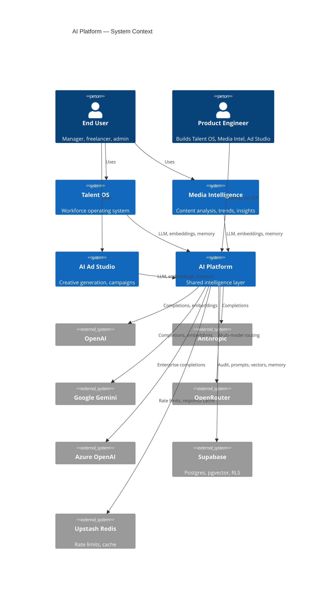

### 2.2 C4 Level 2 — Container Diagram

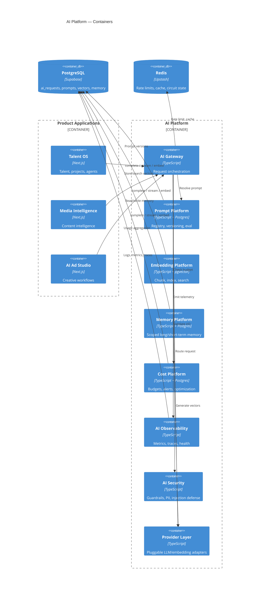

### 2.3 Layer placement in enterprise stack

The AI Platform occupies **L4 Integration** and a new **L4.5 Intelligence** slice above domain services:

```
┌─────────────────────────────────────────────────────────────────────────┐
│ L7  EXPERIENCE        Product UIs (Talent OS, Media Intel, Ad Studio)   │
├─────────────────────────────────────────────────────────────────────────┤
│ L6  APPLICATION       Server Actions │ Route Handlers │ Agents │ MCP    │
├─────────────────────────────────────────────────────────────────────────┤
│ L5  DOMAIN            Talent │ Projects │ Media │ Creative │ Finance    │
├─────────────────────────────────────────────────────────────────────────┤
│ L4.5 AI PLATFORM      Gateway │ Prompts │ Embeddings │ Memory │ Cost    │
├─────────────────────────────────────────────────────────────────────────┤
│ L4  INTEGRATION       Events │ Webhooks │ Workflow Engine │ Adapters     │
├─────────────────────────────────────────────────────────────────────────┤
│ L3  DATA              PostgreSQL │ pgvector │ Redis │ Storage │ RLS     │
├─────────────────────────────────────────────────────────────────────────┤
│ L2  AUTOMATION        Workflow jobs │ Cron │ n8n (optional side effects)│
├─────────────────────────────────────────────────────────────────────────┤
│ L1  EXTERNAL          OpenAI │ Anthropic │ Gemini │ Azure │ OpenRouter  │
└─────────────────────────────────────────────────────────────────────────┘
```

---

## 3. Current State Assessment

### 3.1 What exists today

| Subsystem | Maturity | Location | Notes |
|-----------|:--------:|----------|-------|
| AI Gateway core | **70%** | `lib/ai/gateway.ts` | complete, stream, structured output |
| Provider adapters | **60%** | `lib/ai/providers/` | OpenAI, Anthropic, Gemini, OpenRouter |
| Retry / fallback / rate limit | **75%** | `lib/ai/middleware/` | Redis-backed rate limits (P0) |
| Prompt manager (in-memory) | **40%** | `lib/ai/prompt/manager.ts` | Versioning; no DB registry or eval |
| Token logging | **65%** | `lib/ai/logging/token-logger.ts` | → `ai_requests` table |
| Cost tracker (in-memory) | **35%** | `lib/ai/logging/cost-tracker.ts` | No budgets or alerts |
| Feature flags | **15%** | `lib/ai/features/flags.ts` | Tenant settings + env; no rollouts/experiments — see [FEATURE_FLAGS_PLATFORM.md](./FEATURE_FLAGS_PLATFORM.md) |
| Agent framework | **55%** | `lib/ai/agent/` | Reasoning loop; MCP stubs |
| Knowledge / embeddings schema | **30%** | `016_knowledge_module.sql` | pgvector ready; no generation pipeline |
| AI observability | **45%** | `lib/observability/instrumentation.ts` | Metrics + `ai_requests`; no tracing standard |
| Async AI execution | **60%** | Workflows + n8n | Event-driven; dual execution paths |
| MCP tool catalog | **25%** | `lib/mcp/` | Definitions only; adapters not wired |

### 3.2 Critical gaps

| Gap | Impact | Platform component to address |
|-----|--------|-------------------------------|
| Dual audit paths (gateway + integrations) | Inconsistent cost/token records | Unified request ledger in Gateway |
| In-memory prompt registry | No rollback, eval, or cross-instance consistency | Prompt Platform (Postgres-backed) |
| No embedding generation | RAG and semantic search blocked | Embedding Platform |
| MCP adapters stubbed | Agent tool-use non-functional | Provider-agnostic tool execution (separate from AI Platform but consumes Gateway) |
| No circuit breakers | Provider outages cascade | Gateway resilience layer |
| No output guardrails | Injection/hallucination risk | AI Security subsystem |
| Provider enum drift (`openai \| claude`) | Azure/Gemini metadata loss | Extend `ai_requests` + provider registry |
| No product-scoped features | Multi-product sharing unclear | `product_id` + feature namespace |

### 3.3 Current vs target request flow

**Today:**

```
Product code → getAiGateway() → middleware → provider → token logger → ai_requests
                ↑                                    ↓
Integration layer may also write ai_requests independently (duplicate path)
```

**Target:**

```
Product code → AiPlatformClient → Gateway pipeline → single ledger → observability
                     ↓
              Prompt / Memory / Cost / Security (composed middleware chain)
```

---

## 4. Target Architecture Overview

### 4.1 Platform principles

1. **Single front door** — No product calls provider APIs directly.
2. **Composable middleware** — Auth, budget, guardrails, cache are pipeline stages, not scattered checks.
3. **Explicit context** — Every request carries `AiRequestContext`: org, user, product, feature, agent, correlation ID.
4. **Fail closed in production** — Missing secrets, exceeded budgets, or failed guardrails reject the request.
5. **Event-compatible** — Sync (interactive) and async (workflow) execution share the same gateway contract.
6. **Schema-first outputs** — Structured outputs via JSON Schema; validated before returning to caller.

### 4.2 Subsystem map

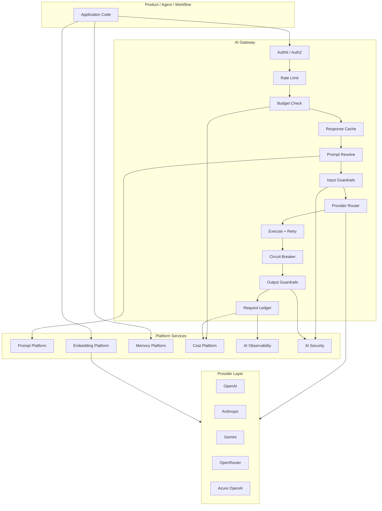

---

## 5. AI Gateway

The Gateway is the **orchestration kernel** of the AI Platform. It does not contain business logic; it enforces cross-cutting policies and delegates to the Provider Layer.

### 5.1 Responsibilities

| Responsibility | Description | Current | Target |
|----------------|-------------|:-------:|:------:|
| Request lifecycle | Accept, validate, execute, respond, finalize | Partial | Full state machine |
| Authentication | Verify caller identity (session, service, cron) | Via caller | Gateway validates service token or inherits session |
| Authorization | Feature + permission gates (`ai:match`, `agent:run`) | Partial | RBAC + feature registry |
| Rate limiting | Per org/user/feature/agent RPM | Redis | Tiered limits + burst |
| Provider routing | Primary, fallback, model selection | Env-based chain | Policy-driven router |
| Logging | Structured request/response audit | `ai_requests` | Unified ledger |
| Observability | Metrics, traces, spans | Partial | OpenTelemetry-compatible |
| Caching | Semantic + exact response cache | None | Redis, TTL by feature |
| Streaming | SSE token stream | Basic | Backpressure, cancel, usage on close |
| Retries | Exponential backoff | Yes | Jitter + idempotency keys |
| Fallbacks | Provider chain | Yes | Model-level + region fallback |
| Circuit breakers | Open on provider failure rate | None | Per-provider breaker |
| Structured outputs | JSON Schema validation | Yes | + repair pass on parse failure |
| Guardrails | Input/output safety | None | AI Security integration |
| Prompt versioning | Resolve active prompt | In-memory | Prompt Platform |
| Feature flags | Kill switch per feature | Env + tenant | Product × feature matrix |

### 5.2 Request context model

Every gateway invocation carries an **`AiRequestContext`**:

```typescript
interface AiRequestContext {
  // Identity
  correlationId: string
  requestId: string
  traceId?: string

  // Tenancy
  organizationId: string          // tenant_id
  userId?: string
  productId: ProductId            // 'talent_os' | 'media_intel' | 'ad_studio'

  // Classification
  feature: AiFeature              // 'talent_match' | 'ad_copy_gen' | ...
  agentId?: string
  sessionId?: string

  // Execution
  mode: 'sync' | 'async' | 'stream'
  idempotencyKey?: string
  priority?: 'interactive' | 'background'

  // Governance
  permissions: string[]
  budgetScope?: BudgetScope
}
```

### 5.3 Gateway pipeline (ordered middleware)

| Stage | Order | Fail behavior |
|-------|:-----:|---------------|
| Context validation | 1 | 400 Bad Request |
| Authentication | 2 | 401 Unauthorized |
| Authorization | 3 | 403 Forbidden |
| Feature flag check | 4 | 403 Feature disabled |
| Rate limit | 5 | 429 Too Many Requests |
| Budget check | 6 | 402 Budget exceeded |
| Idempotency lookup | 7 | Return cached response |
| Prompt resolution | 8 | 500 if prompt not found |
| Input guardrails | 9 | 400 or redact |
| Cache lookup | 10 | Return cached if hit |
| Provider routing | 11 | Select provider + model |
| Circuit breaker check | 12 | 503 if open |
| Execute (retry + fallback) | 13 | Propagate or fallback |
| Output validation | 14 | Repair or reject |
| Output guardrails | 15 | Redact or block |
| Ledger write | 16 | Always (success or failure) |
| Cache store | 17 | If cacheable |
| Observability emit | 18 | Async, non-blocking |

### 5.4 Public API surface

```typescript
interface AiPlatformGateway {
  // Completions
  complete(ctx: AiRequestContext, request: CompletionRequest): Promise<CompletionResponse>
  completeStructured<T>(ctx: AiRequestContext, request: StructuredRequest<T>): Promise<StructuredResponse<T>>
  stream(ctx: AiRequestContext, request: CompletionRequest): AsyncIterable<StreamChunk>

  // Embeddings (delegates to Embedding Platform)
  embed(ctx: AiRequestContext, request: EmbedRequest): Promise<EmbedResponse>

  // Health
  getProviderHealth(): Promise<ProviderHealthMap>
}
```

Products import **`createAiPlatformClient(productId)`** — never `getAiGateway()` directly in new code. The existing `getAiGateway()` becomes an internal implementation detail during migration.

### 5.5 Circuit breaker design

| Parameter | Default | Description |
|-----------|---------|-------------|
| `failureThreshold` | 5 failures / 60s | Open circuit |
| `openDurationMs` | 30_000 | Half-open probe interval |
| `successThreshold` | 2 successes | Close circuit |
| Storage | Redis | Shared across serverless instances |

State per `(providerId, model, region)`.

### 5.6 Caching strategy

| Cache type | Key | TTL | Invalidation |
|------------|-----|-----|--------------|
| Exact match | hash(prompt + model + params) | Feature-specific (5m–24h) | Prompt version bump |
| Idempotency | idempotencyKey | 24h | N/A |
| Embedding | hash(content + model) | 7d | Content update |

Cache keys prefixed: `ai:cache:{orgId}:{feature}:{hash}`.

---

## 6. Provider Layer

The Provider Layer is **completely replaceable**. Products and the Gateway depend only on **`AiProviderInterface`** — never on vendor SDKs.

### 6.1 Provider interface

```typescript
interface AiProviderInterface {
  readonly id: ProviderId
  readonly capabilities: ProviderCapabilities

  isConfigured(): boolean
  healthCheck(): Promise<ProviderHealth>

  complete(params: ProviderCompletionParams): Promise<ProviderCompletionResult>
  completeStructured(params: ProviderStructuredParams): Promise<ProviderStructuredResult>
  stream(params: ProviderCompletionParams): AsyncIterable<string>
  embed?(params: ProviderEmbedParams): Promise<ProviderEmbedResult>
}

interface ProviderCapabilities {
  structuredOutput: boolean
  streaming: boolean
  embeddings: boolean
  vision: boolean
  functionCalling: boolean
  maxContextTokens: number
}
```

### 6.2 Supported providers

| Provider | ID | Completions | Structured | Stream | Embeddings | Status |
|----------|-----|:-----------:|:----------:|:------:|:----------:|:------:|
| OpenAI | `openai` | ✓ | JSON Schema | ✓ | ✓ | Implemented |
| Anthropic | `anthropic` | ✓ | Tool use | ✓ | — | Implemented |
| Google Gemini | `gemini` | ✓ | responseSchema | ✓ | ✓ | Implemented |
| OpenRouter | `openrouter` | ✓ | JSON Schema | ✓ | — | Implemented |
| Azure OpenAI | `azure_openai` | ✓ | JSON Schema | ✓ | ✓ | **Planned** |
| Future | `custom:*` | — | — | — | — | Extension point |

### 6.3 Provider registry and routing

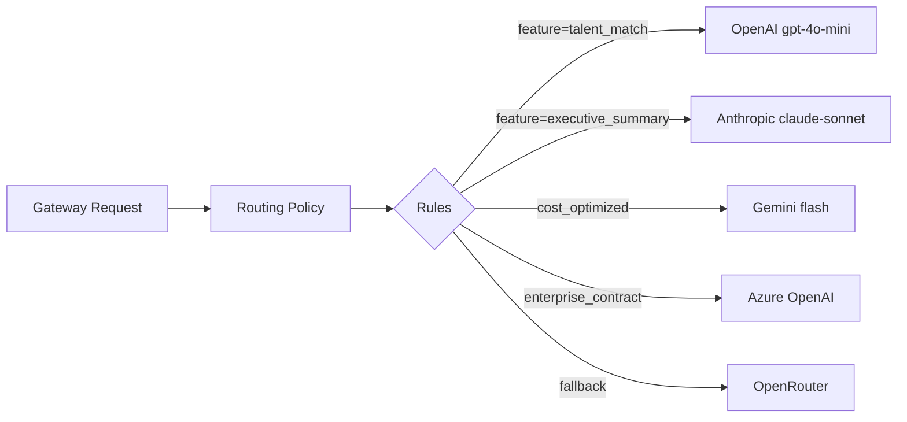

**Routing policy inputs:** feature, product, org tier, latency SLO, cost ceiling, provider health, data residency flags.

**Routing policy storage:** Postgres `ai_routing_policies` with org-level overrides; defaults in code registry.

### 6.4 Azure OpenAI adapter

Azure requires distinct configuration:

| Env variable | Purpose |
|--------------|---------|
| `AZURE_OPENAI_ENDPOINT` | Resource endpoint |
| `AZURE_OPENAI_API_KEY` | Auth key |
| `AZURE_OPENAI_API_VERSION` | API version |
| `AZURE_OPENAI_DEPLOYMENT_*` | Per-model deployment names |

Azure provider implements the same `AiProviderInterface`; routing policy selects it when `organization.data_residency = 'eu'` or enterprise tier.

### 6.5 Adding a new provider

1. Implement `AiProviderInterface` in `lib/ai/providers/{name}.provider.ts`
2. Register in `ProviderRegistry`
3. Add pricing table entry in Cost Platform
4. Add health check probe
5. Configure routing policy (optional)
6. No changes to product code

---

## 7. Prompt Platform

Evolve the in-memory `PromptManager` into a **governed prompt lifecycle system** shared across products.

### 7.1 Components

| Component | Responsibility |
|-----------|----------------|
| **Prompt Registry** | Canonical catalog of all prompts by product + feature |
| **Prompt Templates** | System/user templates with variable slots |
| **Versioning** | Semver; immutable published versions |
| **Variables** | Typed template variables with validation |
| **Testing** | Offline test runs against fixture inputs |
| **Evaluation** | Automated scoring (accuracy, latency, cost) |
| **Rollback** | Instant revert to prior active version |
| **Lifecycle** | draft → review → published → deprecated → archived |

### 7.2 Data model

```
ai_prompts
  id, product_id, feature, name, description
  owner_team, created_at

ai_prompt_versions
  id, prompt_id, version (semver)
  system_template, user_template
  variable_schema (JSON Schema)
  default_model_hint, temperature, max_tokens
  status: draft | published | deprecated | archived
  published_at, published_by
  content_hash

ai_prompt_assignments
  organization_id, prompt_id, active_version_id
  (null org = platform default)

ai_prompt_eval_runs
  id, prompt_version_id, dataset_id
  metrics: accuracy, latency_p95, cost_avg, pass_rate
  run_at
```

Agent instructions (`agent_instruction_versions`) **reference** prompt platform entries by `prompt_id` rather than duplicating content.

### 7.3 Prompt resolution flow

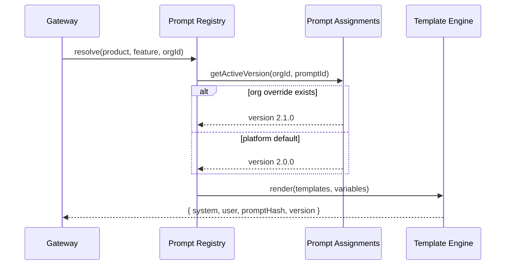

### 7.4 Evaluation pipeline

| Stage | Tooling |
|-------|---------|
| Dataset management | `ai_eval_datasets` table + JSONL import |
| Golden tests | Vitest + snapshot assertions on structured output |
| LLM-as-judge | Optional secondary model scores quality |
| Regression gate | CI fails if pass_rate drops >5% vs baseline |
| A/B in production | Feature flag routes % traffic to candidate version |

### 7.7 Prompt lifecycle diagram

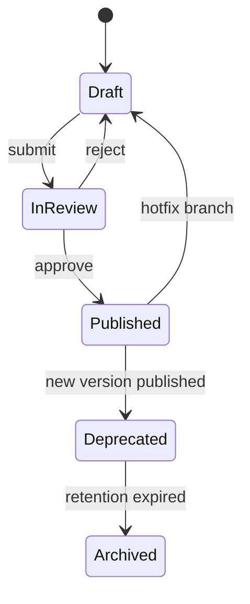

---

## 8. Embedding Platform

Enable RAG, semantic search, and cross-product knowledge retrieval.

### 8.1 Components

| Component | Responsibility |
|-----------|----------------|
| **Embedding Service** | Generate vectors via Provider Layer |
| **Chunking** | Configurable strategies (fixed, semantic, document-aware) |
| **Metadata** | Org, product, entity, source, timestamps |
| **Indexing** | Write to pgvector with HNSW/IVFFlat |
| **Vector storage** | `knowledge_embeddings` + product-specific tables |
| **Search** | Similarity, hybrid (BM25 + vector), filtered | Delegates to [Search Platform](./SEARCH_PLATFORM.md) |
| **Similarity** | Cosine default; configurable metric |
| **Refresh strategy** | On content change, scheduled, manual |
| **Re-indexing** | Batch jobs via workflow engine |

### 8.2 Architecture

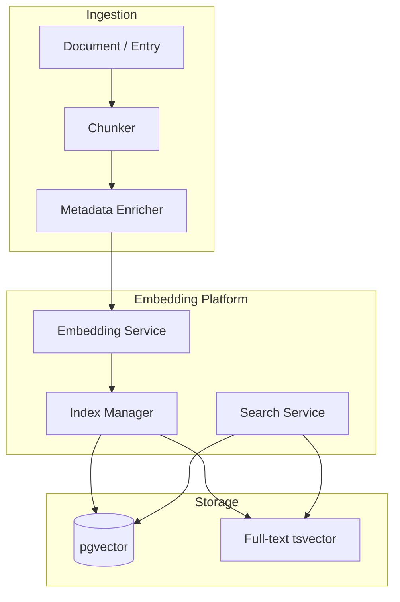

### 8.3 Chunking strategies

| Strategy | Use case | Config |
|----------|----------|--------|
| Fixed-size | SOPs, notes | `chunkSize=1500`, `overlap=200` |
| Semantic | Long documents | Embedding similarity splits |
| Structured | JSON, tables | Field-aware chunks |
| Media transcript | Media Intelligence | Timestamp-aligned segments |

### 8.4 Multi-product index namespaces

| Namespace | Product | Table |
|-----------|---------|-------|
| `talent.knowledge` | Talent OS | `knowledge_embeddings` |
| `media.content` | Media Intelligence | `media_content_embeddings` (new) |
| `creative.assets` | AI Ad Studio | `creative_asset_embeddings` (new) |

All namespaces share Embedding Service; isolation via `organization_id` + RLS.

### 8.5 Refresh and re-indexing

| Trigger | Action |
|---------|--------|
| Content create/update | Enqueue `embedding.index_requested` event |
| Model upgrade | Batch re-index job with `target_model` |
| Failed embedding | Retry with exponential backoff; dead letter after 5 |
| Stale detection | Cron: re-index entries older than 90d if model changed |

Workflow integration: `ai.embedding_requested` → `execute_embedding` action (mirrors `execute_ai`).

---

## 9. Memory Platform

Unified memory across users, organizations, conversations, projects, clients, talent, and agents.

### 9.1 Memory scopes

| Scope | ID pattern | Retention | Use case |
|-------|------------|-----------|----------|
| **User** | `user:{userId}` | 90d default | Preferences, recent context |
| **Organization** | `org:{orgId}` | Indefinite | Policies, brand voice, glossary |
| **Conversation** | `session:{sessionId}` | 30d | Chat history (short-term) |
| **Project** | `entity:project:{id}` | Life of project + 1y | PM agent context |
| **Client** | `entity:client:{id}` | Indefinite | Client preferences |
| **Talent** | `entity:freelancer:{id}` | Indefinite | Skills, availability notes |
| **Agent** | `agent:{agentId}:org:{orgId}` | Configurable | Learned agent facts |
| **Long-term** | Promoted from short-term | Tier-based | Summarized durable facts |
| **Short-term** | Session/working | 24h–7d | Active task context |

### 9.2 Memory operations

```typescript
interface MemoryPlatform {
  recall(ctx: MemoryContext, query: RecallQuery): Promise<MemoryEntry[]>
  store(ctx: MemoryContext, entry: MemoryWrite): Promise<void>
  summarize(ctx: MemoryContext, sessionId: string): Promise<MemorySummary>
  promote(ctx: MemoryContext, entryId: string, targetScope: MemoryScope): Promise<void>
  purge(ctx: MemoryContext, policy: RetentionPolicy): Promise<PurgeResult>
}
```

### 9.3 Storage architecture

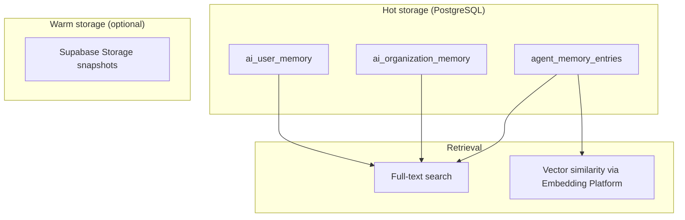

**Consolidation:** Extend existing `agent_memory_entries` into generic `ai_memory_entries` with `scope` enum; migrate agent-specific rows.

### 9.4 Retention policies

| Tier | Short-term | Long-term | Max entries/org |
|------|------------|-----------|-----------------|
| Starter | 7d | 90d | 1,000 |
| Pro | 30d | 1y | 10,000 |
| Enterprise | Configurable | Indefinite | Unlimited |

Policies enforced by cron `ai.memory_retention_sweep`.

### 9.5 Memory recall in agent runs

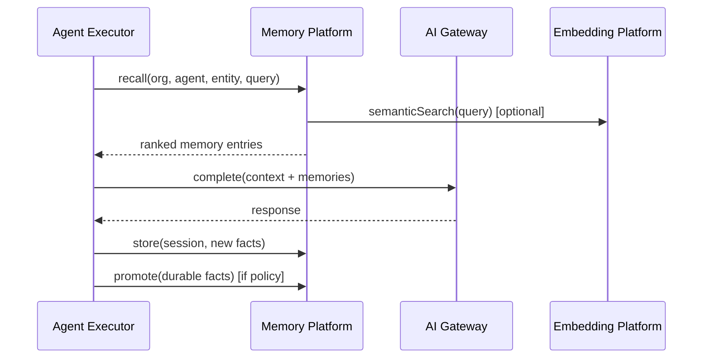

---

## 10. AI Cost Platform

Govern spend across organizations, users, features, agents, and providers.

### 10.1 Cost dimensions

| Dimension | Granularity | Storage |
|-----------|-------------|---------|
| Organization | Monthly roll-up | `ai_cost_aggregates` |
| User | Monthly | Same table, `user_id` |
| Feature | Per request + monthly | `ai_requests.request_type` |
| Agent | Per run | `agent_sessions` + ledger |
| Provider | Per request | `ai_requests.provider` + `model` |

### 10.2 Budget model

```
ai_budgets
  organization_id, scope (org | feature | agent | user)
  scope_id (nullable for org-wide)
  period: daily | monthly
  limit_usd, alert_threshold_pct (default 80%)
  hard_limit: boolean (reject vs alert only)
```

### 10.3 Budget check sequence

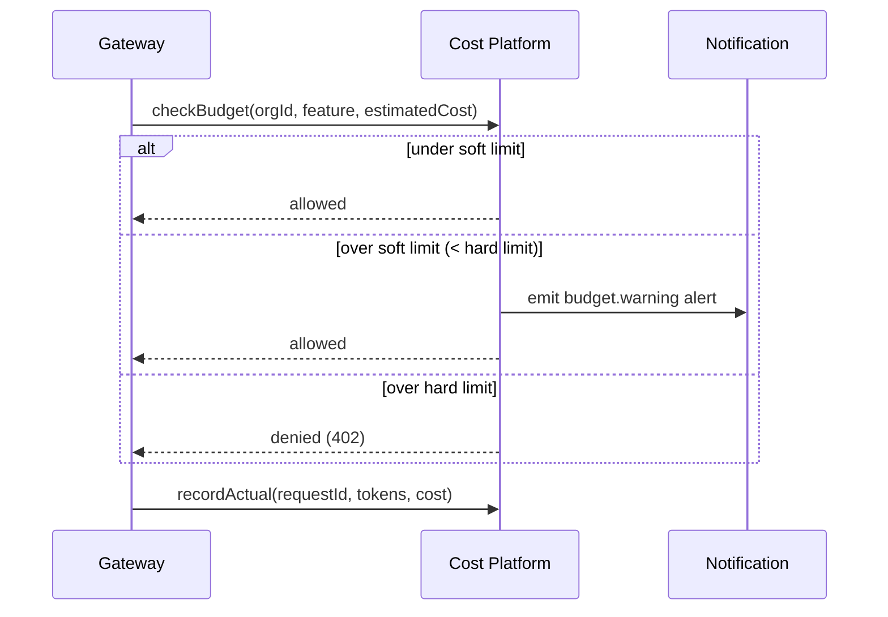

### 10.4 Cost optimization strategies

| Strategy | Mechanism |
|----------|-----------|
| Model routing | Route low-complexity features to cheaper models |
| Cache | Avoid repeat completions (Gateway cache) |
| Batch embeddings | Aggregate embedding requests |
| Prompt compression | Summarize long context before LLM call |
| Budget-aware fallback | Downgrade model when org >80% budget |
| Idle agent throttling | Reduce background agent runs near limit |

### 10.5 Pricing table

Centralized in `lib/ai/cost/pricing.ts` (extend current `MODEL_PRICING`):

| Provider | Model | Input $/1M | Output $/1M |
|----------|-------|------------|-------------|
| openai | gpt-4o-mini | 0.15 | 0.60 |
| anthropic | claude-3-5-sonnet | 3.00 | 15.00 |
| gemini | gemini-1.5-flash | 0.075 | 0.30 |
| ... | ... | ... | ... |

Versioned; historical pricing preserved for accurate backfill.

**Billing integration:** Metered AI spend is recorded to the Billing Platform usage ledger (`ai.cost_usd` meter) for monthly invoicing. Real-time budget enforcement (§10.3) remains in the Cost Platform; see [BILLING_PLATFORM.md](./BILLING_PLATFORM.md) §10.4.

---

## 11. AI Observability

Extend platform observability with AI-native signals.

### 11.1 Metrics

| Metric | Type | Labels |
|--------|------|--------|
| `ai.request.duration_ms` | Histogram | org, product, feature, provider, model, status |
| `ai.request.tokens.input` | Counter | org, feature, provider |
| `ai.request.tokens.output` | Counter | org, feature, provider |
| `ai.request.cost_usd` | Counter | org, feature, provider |
| `ai.request.errors` | Counter | org, feature, error_code |
| `ai.provider.health` | Gauge | provider, region |
| `ai.circuit_breaker.state` | Gauge | provider |
| `ai.cache.hit_rate` | Gauge | feature |
| `ai.embedding.index_lag_seconds` | Gauge | org, namespace |
| `ai.guardrail.blocks` | Counter | org, rule, direction |

### 11.2 Tracing

Every gateway request creates a **trace span**:

```
trace: ai.request
  ├── span: prompt.resolve
  ├── span: guardrail.input
  ├── span: provider.openai.complete
  │     ├── span: retry.attempt_1
  │     └── span: fallback.anthropic
  ├── span: guardrail.output
  └── span: ledger.write
```

Stored in `platform_trace_spans` with `category = 'ai'`. Correlation ID links to workflow runs, agent sessions, and API requests.

### 11.3 Hallucination reporting

| Signal | Source |
|--------|--------|
| User feedback | Thumbs down + reason on AI outputs |
| Structured validation failure | JSON Schema mismatch rate |
| Tool result contradiction | Agent compares tool data vs LLM claim |
| RAG grounding score | % of claims with source citation |

Stored in `ai_quality_reports`; surfaced in observability dashboard.

### 11.4 Provider health dashboard

| Status | Criteria |
|--------|----------|
| Healthy | Error rate <1%, p95 latency within SLO |
| Degraded | Error rate 1–5% or latency 2× SLO |
| Unavailable | Circuit open or error rate >5% |

### 11.5 Observability integration diagram

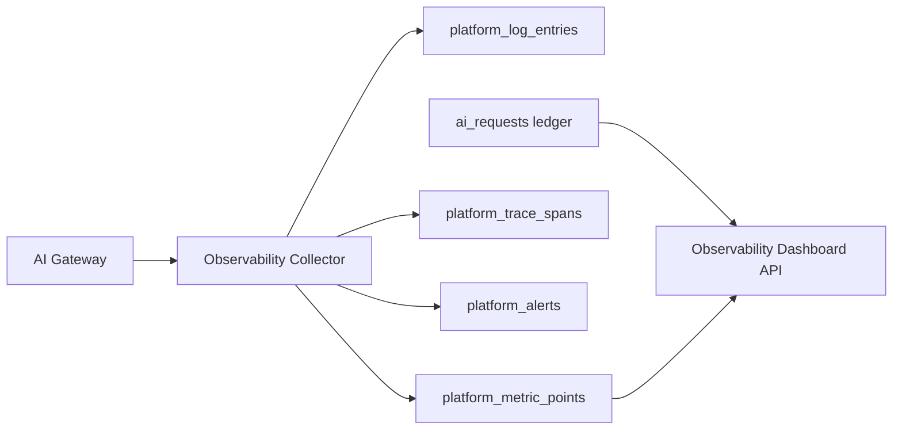

---

## 12. AI Security

Defense-in-depth for AI-specific threats.

### 12.1 Threat model

| Threat | Control |
|--------|---------|
| Prompt injection | Input guardrails, system prompt isolation, tool sandbox |
| Jailbreak | Output guardrails, policy templates |
| Data exfiltration | PII filter on input/output, tool allowlists |
| Sensitive data in prompts | PII detection + redaction before provider call |
| Unauthorized feature access | RBAC + feature flags |
| Cross-tenant leakage | org_id validation on every memory/embedding query |
| Audit gaps | Immutable audit log for all AI requests |

### 12.2 Input guardrails

| Rule | Action |
|------|--------|
| Detect injection patterns | Block or sanitize |
| PII in user message (email, phone, SSN) | Redact with placeholder |
| Excessive prompt length | Truncate with warning |
| Disallowed content categories | Block (configurable per org) |

Implementation: pluggable **`GuardrailRule`** interface; default ruleset + org overrides.

### 12.3 Output validation

| Check | When |
|-------|------|
| JSON Schema validation | Structured outputs |
| Citation requirement | RAG features |
| Tool result consistency | Agent responses referencing tool data |
| Max output tokens | Always |
| Profanity / policy | Configurable |

### 12.4 PII protection pipeline

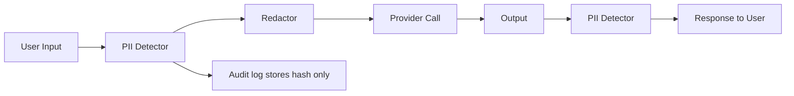

Raw prompts never stored — only `prompt_hash` (existing pattern preserved).

### 12.5 Permissions matrix

| Permission | Scope | Roles |
|------------|-------|-------|
| `ai:use` | Base AI access | admin, talent_manager |
| `ai:match` | Talent matching | admin, talent_manager |
| `ai:configure` | Prompt/budget admin | admin |
| `agent:run` | Agent execution | admin, talent_manager |
| `ai:embed` | Embedding ingestion | admin, talent_manager |
| `ai:memory:admin` | Purge, promote memory | admin |

---

## 13. AI Developer Experience

### 13.1 Core interfaces

Products interact through **`@/lib/ai-platform`** (public SDK):

```typescript
// Factory — product-scoped client
const ai = createAiPlatformClient({
  productId: 'talent_os',
  getContext: () => resolveSessionContext(),
})

// Typed feature calls
const result = await ai.features.talentMatch.run({ opportunityId })
const stream = ai.features.projectSummary.stream({ projectId })
const chunks = await ai.embeddings.index({ entryId })
const memories = await ai.memory.recall({ agentId, query })
```

### 13.2 Folder structure (target)

```
lib/ai-platform/                    # Public SDK (products import from here)
  index.ts                          # createAiPlatformClient, types
  client.ts                         # AiPlatformClient facade
  context.ts                        # AiRequestContext builders

lib/ai/                             # Internal implementation (existing, extended)
  gateway/
    gateway.ts                      # Orchestrator
    pipeline.ts                     # Middleware chain
    state-machine.ts                # Request lifecycle
  providers/
    interface.ts
    registry.ts
    openai.provider.ts
    anthropic.provider.ts
    gemini.provider.ts
    openrouter.provider.ts
    azure-openai.provider.ts        # NEW
  middleware/
    auth.ts
    rate-limit.ts
    retry.ts
    fallback.ts
    circuit-breaker.ts              # NEW
    cache.ts                        # NEW
  prompt/                           # Delegates to Prompt Platform service
  embedding/
    service.ts
    chunker.ts
    indexer.ts
    search.ts
  memory/
    service.ts
    retention.ts
    scopes.ts
  cost/
    service.ts
    budgets.ts
    pricing.ts
    optimizer.ts
  security/
    guardrails/
      input.ts
      output.ts
    pii/
      detector.ts
      redactor.ts
    validation/
      schema.ts
  observability/
    instrumentation.ts
    tracing.ts
    quality.ts
  features/                         # Product feature registry
    registry.ts
    talent-os/
    media-intel/                    # Future
    ad-studio/                      # Future

lib/repositories/
  ai-request.repository.ts          # Extended ledger
  ai-prompt.repository.ts           # NEW
  ai-budget.repository.ts           # NEW
  ai-memory.repository.ts           # NEW (extends agent memory)
  knowledge-embedding.repository.ts # Existing

lib/services/
  ai-platform.service.ts            # Facade for server actions
  ai.service.ts                     # Domain AI (uses platform client)

modules/ai-platform/                # Optional: types + validation boundary
  types.ts
  validation.ts
  constants.ts

supabase/migrations/
  022_ai_prompt_platform.sql
  023_ai_cost_budgets.sql
  024_ai_memory_unified.sql
  025_ai_provider_registry.sql
```

### 13.3 Naming conventions

| Artifact | Convention | Example |
|----------|------------|---------|
| Feature ID | `{domain}_{action}` | `talent_match`, `ad_copy_gen` |
| Prompt ID | `{feature}` or `{agent}_{purpose}` | `talent_match`, `recruiter_system` |
| Product ID | snake_case | `talent_os`, `media_intel`, `ad_studio` |
| Provider ID | lowercase vendor | `openai`, `azure_openai` |
| Memory scope | `{type}:{id}` | `entity:project:uuid` |
| Metric name | `ai.{subsystem}.{metric}` | `ai.request.duration_ms` |
| Event type | `ai.{action}_{phase}` | `ai.match_requested`, `ai.embedding_indexed` |

### 13.4 Testing strategy

| Layer | Tool | Scope |
|-------|------|-------|
| Unit | Vitest | Providers (mocked HTTP), guardrails, chunker, pricing |
| Integration | Vitest + test DB | Prompt resolution, memory recall, budget checks |
| Contract | Vitest | Provider interface compliance |
| Eval | Custom runner | Prompt quality regression |
| E2E | Playwright | Feature flows through gateway |
| Load | k6 (future) | Rate limits, circuit breakers |

**Rule:** No test calls live provider APIs in CI — use **`MockAiProvider`**.

### 13.5 Configuration

| Source | Precedence |
|--------|------------|
| Environment variables | Platform defaults |
| `ai_platform_config` table | Org overrides |
| Feature flags | Org × product × feature |
| Request context | Per-call overrides (temperature, model hint) |

### 13.6 Dependency injection

```typescript
interface AiPlatformDependencies {
  gateway: AiPlatformGateway
  promptPlatform: PromptPlatform
  embeddingPlatform: EmbeddingPlatform
  memoryPlatform: MemoryPlatform
  costPlatform: CostPlatform
  securityService: AiSecurityService
  observability: AiObservability
  providerRegistry: ProviderRegistry
}

// Production: default wiring
// Tests: inject mocks via createAiPlatformClient({ deps })
```

### 13.7 Extensibility points

| Extension | Mechanism |
|-----------|-----------|
| New provider | Implement `AiProviderInterface`, register |
| New product | Add `productId`, feature registry namespace |
| New feature | Register in `features/registry.ts` with schema + prompt |
| New guardrail | Implement `GuardrailRule`, add to pipeline |
| New chunking strategy | Implement `ChunkingStrategy` |
| New routing policy | Add rule to `RoutingPolicyEngine` |

---

## 14. Request Lifecycle

### 14.1 Synchronous completion

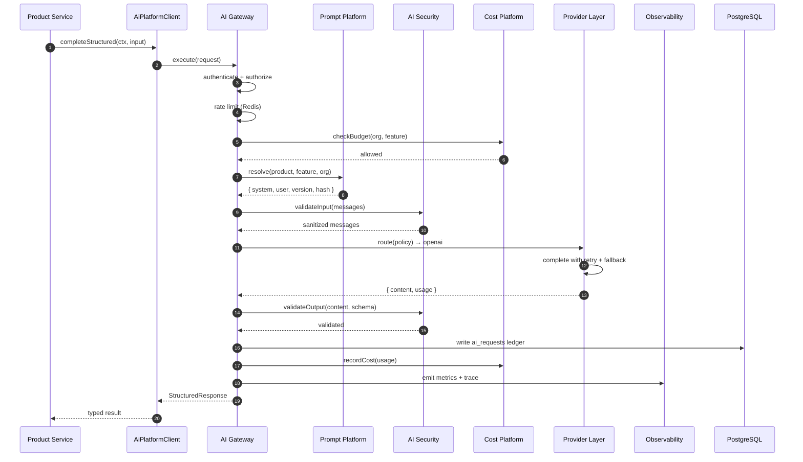

### 14.2 Streaming completion

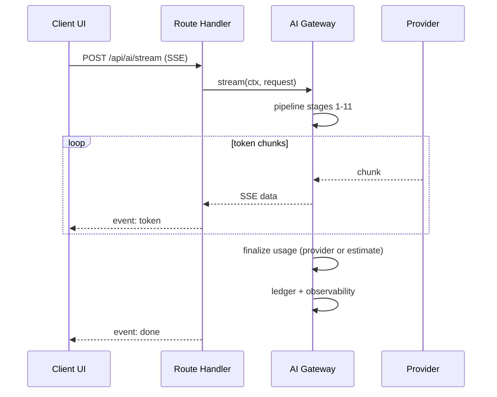

### 14.3 Async execution (workflow)

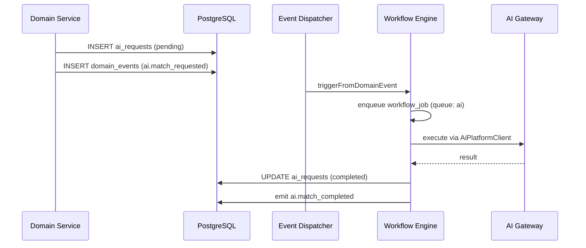

Async and sync paths **share the same gateway pipeline** — only the caller differs.

### 14.4 Embedding indexing

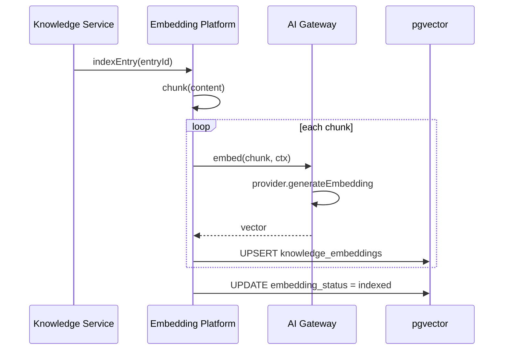

---

## 15. Component Diagrams

### 15.1 AI Gateway internal components

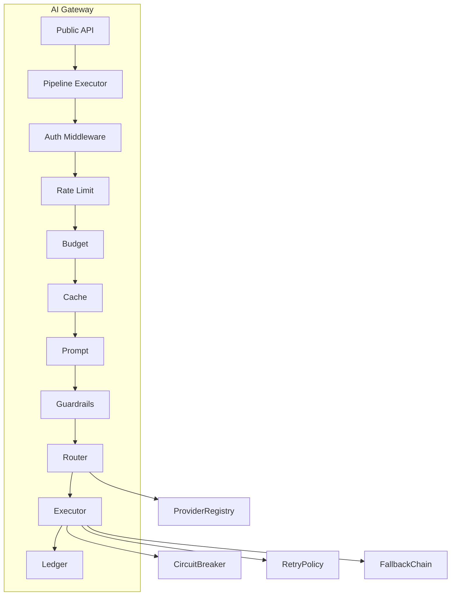

### 15.2 Platform service dependencies

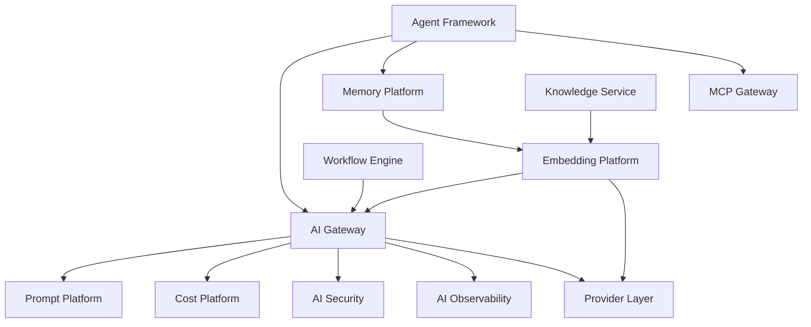

### 15.3 Product integration points

| Product | Features | Memory scopes | Embedding namespaces |
|---------|----------|---------------|---------------------|
| Talent OS | match, brief_parse, summary, status, agents | talent, project, client, agent | `talent.knowledge` |
| Media Intelligence | content_analysis, trend_detection, sentiment | org, media_asset | `media.content` |
| AI Ad Studio | copy_gen, image_prompt, campaign_opt | org, campaign, creative | `creative.assets` |

---

## 16. Folder Structure

See [Section 13.2](#132-folder-structure-target) for the complete target layout.

### Migration from current structure

| Current | Target | Action |
|---------|--------|--------|
| `lib/ai/gateway.ts` | `lib/ai/gateway/gateway.ts` | Refactor into pipeline |
| `lib/ai/prompt/manager.ts` | `lib/ai-platform/prompt/` + DB | Promote to Prompt Platform |
| `lib/integrations/ai/prompt.ts` | Prompt Platform templates | Consolidate |
| `lib/ai/logging/cost-tracker.ts` | `lib/ai/cost/` | Extend with budgets |
| `lib/ai/agent/memory.ts` | `lib/ai/memory/` | Generalize scopes |
| `getAiGateway()` | `createAiPlatformClient()` | Deprecate direct gateway access |

---

## 17. Multi-Product Strategy

### 17.1 Shared vs product-specific

| Shared (AI Platform) | Product-specific (application layer) |
|----------------------|--------------------------------------|
| Gateway, providers, security | Feature business logic |
| Prompt registry infrastructure | Prompt content per product |
| Embedding pipeline | Chunking rules per content type |
| Memory storage + recall | Memory scopes used |
| Cost budgets + observability | Budget defaults per tier |
| Agent reasoning engine | Agent definitions per product |

### 17.2 Product registration

```typescript
registerProduct({
  id: 'media_intel',
  name: 'Media Intelligence Platform',
  features: ['content_analysis', 'trend_detection', 'sentiment'],
  defaultModels: { primary: 'gemini-1.5-flash' },
  embeddingNamespace: 'media.content',
  budgetDefaults: { monthlyUsd: 500 },
})
```

### 17.3 Cross-product isolation

| Boundary | Enforcement |
|----------|-------------|
| Data | `organization_id` + RLS on all AI tables |
| Prompts | `product_id` column; no cross-product prompt access |
| Embeddings | Namespace + RLS; search filtered by product |
| Cost | Budgets scoped per product optional |
| Metrics | `product` label on all telemetry |

### 17.4 Future products roadmap alignment

| Product | Primary AI capabilities | Platform dependencies |
|---------|-------------------------|------------------------|
| Talent OS | Matching, PM agent, brief parsing | Gateway, Memory, Prompts, Agents |
| Media Intelligence | Content analysis, trend embeddings, summarization | Gateway, Embeddings, Observability |
| AI Ad Studio | Copy generation, creative briefs, campaign optimization | Gateway, Prompts, Memory, Cost |
| (Future SaaS) | Register via product registry | All platform services |

---

## 18. Integration with Existing Platform

### 18.1 Workflow engine

| Event | Workflow action | Platform call |
|-------|-----------------|---------------|
| `ai.match_requested` | `execute_ai` | `ai.features.talentMatch.run` |
| `ai.embedding_requested` | `execute_embedding` (new) | `ai.embeddings.index` |
| `ai.agent_run_requested` | `execute_agent` | `AgentService.run` → Gateway |

Default execution: **`AI_EXECUTION_MODE=direct`** (platform-native); n8n as optional side-effect dispatcher.

### 18.2 Event architecture

New domain events:

| Event | Payload |
|-------|---------|
| `ai.embedding_index_requested` | `{ entry_id, namespace }` |
| `ai.budget_threshold_reached` | `{ org_id, scope, pct }` |
| `ai.provider_degraded` | `{ provider_id, status }` |
| `ai.prompt_version_published` | `{ prompt_id, version }` |

All events carry `correlation_id` and `organization_id`.

### 18.3 Agent framework

Agents consume the platform via:

- **Instructions** → Prompt Platform
- **Reasoning** → Gateway `completeStructured`
- **Memory** → Memory Platform
- **Tools** → MCP Gateway (non-LLM; LLM tools route through AI MCP server → Gateway)

### 18.4 MCP AI server

`lib/mcp/servers/ai.server.ts` tools (`ai_match_talent`, `ai_complete`, etc.) become thin wrappers over **`AiPlatformClient`** — never duplicate gateway logic.

### 18.5 Observability platform

Extend existing `instrumentAiRequest()` to emit full trace spans. AI dashboard RPCs (`get_observability_ai_latency`) remain; add budget and quality metrics.

---

## 19. Design Decisions

### ADR-001: Single gateway, not per-product gateways

**Decision:** One AI Platform instance serves all products.  
**Rationale:** Shared cost governance, observability, and provider management; avoids drift.  
**Alternatives rejected:** Per-product microservices (ops overhead at current scale).

### ADR-002: Provider interface, not SDK coupling

**Decision:** All providers implement `AiProviderInterface`.  
**Rationale:** Replaceability, testability, routing flexibility.  
**Alternatives rejected:** LiteLLM-style proxy (adds dependency; less control over tenancy).

### ADR-003: Postgres for prompts, not Git-only

**Decision:** Prompt versions stored in PostgreSQL with audit trail.  
**Rationale:** Runtime rollback, org overrides, eval history; Git sync optional for dev workflow.  
**Alternatives rejected:** In-memory only (current — lost on cold start).

### ADR-004: pgvector for embeddings, not external vector DB

**Decision:** Stay on Supabase pgvector for MVP platform.  
**Rationale:** RLS co-location, existing schema, no new infra.  
**Alternatives rejected:** Pinecone/Weaviate (adds cost + tenancy complexity); revisit at 10M+ vectors.

### ADR-005: Unified memory table with scopes

**Decision:** Generalize `agent_memory_entries` → `ai_memory_entries` with scope enum.  
**Rationale:** One recall API for agents and products; consistent retention.  
**Alternatives rejected:** Separate table per scope (query fragmentation).

### ADR-006: Gateway pipeline over decorator sprawl

**Decision:** Ordered middleware pipeline with explicit stages.  
**Rationale:** Predictable execution order; easy to test and extend.  
**Alternatives rejected:** Aspect-oriented hooks (harder to reason about order).

### ADR-007: Fail closed on budget hard limits

**Decision:** Reject requests when hard budget exceeded.  
**Rationale:** Prevent bill shock; enterprise expectation.  
**Alternatives rejected:** Soft limit only (risky for multi-tenant).

### ADR-008: Prompt hash only in audit — never raw prompts

**Decision:** Preserve existing privacy pattern.  
**Rationale:** PII minimization, compliance alignment.  
**Alternatives rejected:** Full prompt storage (GDPR risk).

### ADR-009: Product ID on every request

**Decision:** Explicit `productId` in context.  
**Rationale:** Multi-product cost attribution, routing, and feature isolation.  
**Alternatives rejected:** Infer from URL (fragile across deployment models).

### ADR-010: Mock providers in CI

**Decision:** No live LLM calls in automated tests.  
**Rationale:** Cost, flakiness, rate limits.  
**Alternatives rejected:** Record/replay only (insufficient for new features).

---

## 20. Trade-offs

| Choice | Benefit | Cost |
|--------|---------|------|
| Modular monolith platform | Simple deploy, shared tenancy | Scaling limits at very high AI volume |
| pgvector vs dedicated vector DB | RLS, one database | Index performance at scale |
| Sync gateway pipeline | Low latency for interactive | Longer serverless function duration |
| Postgres prompt registry | Runtime rollback, multi-instance | Not git-native for prompt review |
| Circuit breakers in Redis | Cross-instance consistency | Redis dependency |
| Structured output first | Reliable integrations | Some models weaker at JSON mode |
| Azure as optional provider | Enterprise compliance | Additional adapter maintenance |
| Unified ledger | Single source of truth | Migration from dual write paths |
| Guardrails before provider | Reduced data leakage | Added latency (~10–50ms) |
| In-process embedding index | Simplicity | Large batch re-index competes with API |

---

## 21. Future Roadmap

### Phase 1 — Platform foundation (Weeks 1–4)

| Item | Deliverable |
|------|-------------|
| Gateway pipeline refactor | Middleware chain, unified ledger |
| Circuit breakers + cache | Redis-backed |
| Prompt Platform DB | Migrations, registry API |
| Azure OpenAI provider | Enterprise routing |
| Cost budgets | Hard/soft limits, alerts |
| Consolidate audit paths | Remove duplicate `ai_requests` writes |

### Phase 2 — Intelligence capabilities (Weeks 5–8)

| Item | Deliverable |
|------|-------------|
| Embedding Platform | Generation, indexing, search |
| Memory Platform | Unified scopes, retention |
| Input/output guardrails | Default ruleset |
| Prompt eval CI | Golden datasets |
| `createAiPlatformClient` SDK | Product migration |
| Direct execution default | Deprecate n8n-only AI path |

### Phase 3 — Multi-product + agents (Weeks 9–12)

| Item | Deliverable |
|------|-------------|
| Media Intelligence features | Product registration |
| AI Ad Studio features | Product registration |
| MCP adapter wiring | Tools call platform |
| Agent memory → Memory Platform | Migration |
| Hallucination reporting | User feedback UI (backend only) |
| OpenTelemetry export | Optional external APM |

### Phase 4 — Enterprise scale (Weeks 13+)

| Item | Deliverable |
|------|-------------|
| Model routing ML | Cost/latency optimizer |
| Cross-region provider failover | Geo routing |
| Dedicated embedding workers | Background job queue (Inngest) |
| Vector DB evaluation | If pgvector limits hit |
| Fine-tuning pipeline | Custom model support |
| AI Platform admin UI | Prompt, budget, health dashboards |

---

## 22. Migration Path

### 22.1 From current `lib/ai` to AI Platform

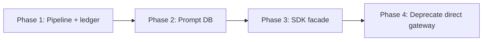

| Step | Action | Risk |
|------|--------|------|
| 1 | Extract pipeline from `gateway.ts` | Low — internal refactor |
| 2 | Add `productId` to all requests (default `talent_os`) | Low — backward compatible |
| 3 | Migrate prompts to Postgres | Medium — dual-read period |
| 4 | Introduce `createAiPlatformClient` | Low — parallel API |
| 5 | Consolidate integration layer audit writes | Medium — data consistency |
| 6 | Wire embedding generation | Medium — new async jobs |
| 7 | Deprecate `getAiGateway()` export | Low — codemod |

### 22.2 Backward compatibility

- Existing `getAiGateway()` continues to work through Phase 3
- `ai_requests` schema extended (not broken): add `product_id`, `prompt_version`, `provider_id` (full enum)
- Feature flags default to current behavior until org opts in

### 22.3 Success criteria

| Metric | Target |
|--------|--------|
| All LLM calls through single ledger | 100% |
| Provider failover success rate | >99% |
| p95 gateway overhead (excl. provider) | <100ms |
| Prompt rollback time | <1 minute |
| Embedding index lag | <5 minutes |
| Budget alert latency | <1 minute |
| CI test coverage (AI platform) | >70% |
| Zero direct provider SDK imports outside `lib/ai/providers/` | Enforced by lint rule |

---

## Appendix A — Environment Variables (extended)

```bash
# ── Providers ──
OPENAI_API_KEY=
ANTHROPIC_API_KEY=
GEMINI_API_KEY=
OPENROUTER_API_KEY=
AZURE_OPENAI_ENDPOINT=
AZURE_OPENAI_API_KEY=
AZURE_OPENAI_API_VERSION=

# ── Gateway ──
AI_PRIMARY_PROVIDER=openai
AI_FALLBACK_PROVIDERS=anthropic,gemini,openrouter
AI_MAX_RETRIES=3
AI_RATE_LIMIT_RPM=60
AI_ENABLE_STREAMING=true
AI_ENABLE_RESPONSE_CACHE=true
AI_CIRCUIT_BREAKER_ENABLED=true

# ── Cost ──
AI_DEFAULT_MONTHLY_BUDGET_USD=100
AI_BUDGET_ALERT_THRESHOLD_PCT=80

# ── Embeddings ──
AI_EMBEDDING_MODEL=text-embedding-3-small
AI_EMBEDDING_BATCH_SIZE=20

# ── Security ──
AI_GUARDRAILS_ENABLED=true
AI_PII_REDACTION_ENABLED=true

# ── Execution ──
AI_EXECUTION_MODE=direct
```

---

## Appendix B — Database migrations (planned)

| Migration | Purpose |
|-----------|---------|
| `022_ai_prompt_platform.sql` | Prompt registry, versions, assignments, eval runs |
| `023_ai_cost_budgets.sql` | Budgets, cost aggregates, alert history |
| `024_ai_memory_unified.sql` | Generalized memory entries, retention policies |
| `025_ai_provider_registry.sql` | Routing policies, provider health snapshots |
| `026_ai_requests_extend.sql` | `product_id`, full `provider_id`, `prompt_version` |

---

## Appendix C — Related documents

| Document | Path |
|----------|------|
| Current AI Gateway | [docs/27-ai-gateway.md](../27-ai-gateway.md) |
| Agent Framework | [docs/Platform/AGENT_FRAMEWORK_ARCHITECTURE.md](../Platform/AGENT_FRAMEWORK_ARCHITECTURE.md) |
| MCP Architecture | [docs/28-mcp-architecture.md](../28-mcp-architecture.md) |
| Knowledge Module | [docs/33-knowledge-module.md](../33-knowledge-module.md) |
| Workflow Engine | [docs/31-workflow-engine.md](../31-workflow-engine.md) |
| Observability | [docs/Platform/OBSERVABILITY_ARCHITECTURE.md](../Platform/OBSERVABILITY_ARCHITECTURE.md) |
| Distributed State | [docs/Platform/DISTRIBUTED_STATE_ARCHITECTURE.md](../Platform/DISTRIBUTED_STATE_ARCHITECTURE.md) |
| Enterprise Architecture | [docs/11-enterprise-system-architecture.md](../11-enterprise-system-architecture.md) |

---

**Status: Draft — awaiting approval before implementation.**

*End of AI Platform Architecture v1.0.0*
