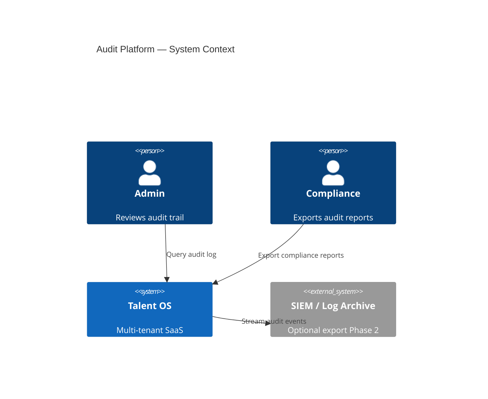
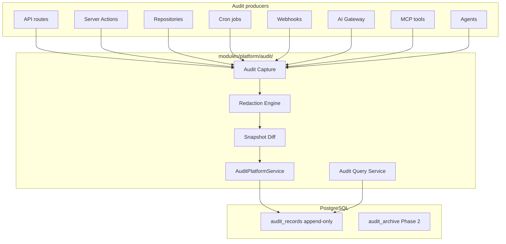
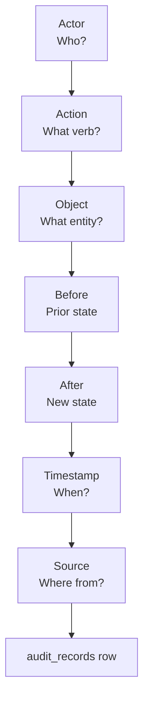
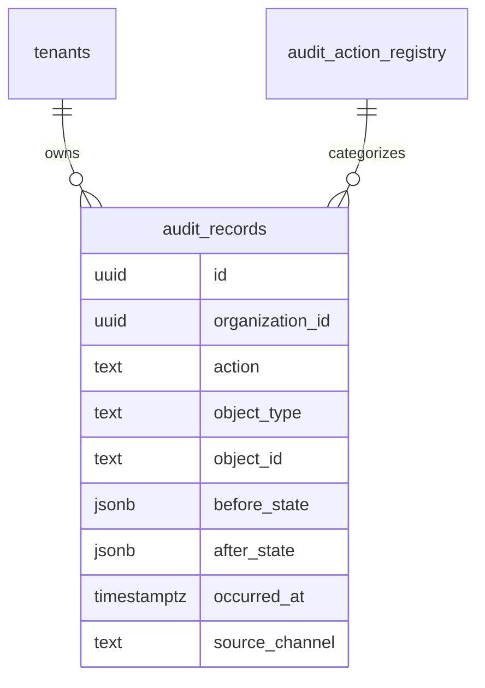

# Talent OS — Audit Platform Architecture

**Document version:** 1.0.0  
**Classification:** Internal — Architecture  
**Author:** Platform Architecture  
**Date:** July 31, 2026  
**Status:** Draft — Awaiting approval  
**Scope:** Design only — no implementation in this document

---

## Table of Contents

1. [Executive Summary](#1-executive-summary)
2. [Platform Context](#2-platform-context)
3. [Audit Flow](#3-audit-flow)
4. [Current State Assessment](#4-current-state-assessment)
5. [Target Architecture Overview](#5-target-architecture-overview)
6. [Actor](#6-actor)
7. [Action](#7-action)
8. [Object](#8-object)
9. [Before](#9-before)
10. [After](#10-after)
11. [Timestamp](#11-timestamp)
12. [Source](#12-source)
13. [Integration Points](#13-integration-points)
14. [Data Model](#14-data-model)
15. [Query & Retention](#15-query--retention)
16. [API Surface](#16-api-surface)
17. [Folder Structure](#17-folder-structure)
18. [Design Decisions](#18-design-decisions)
19. [Migration Path](#19-migration-path)
20. [Relationship to Domain Events](#20-relationship-to-domain-events)

---

## 1. Executive Summary

Enterprise SaaS and compliance frameworks (SOC 2, GDPR accountability, ISO 27001) require an **immutable, queryable audit trail** — not scattered activity metadata or async event payloads. Talent OS today has partial signals: `activity_logs` (action + metadata, no before/after), `domain_events` (transactional outbox for workflows), `ai_requests` (AI-specific), and `webhook_deliveries` (inbound only).

The **Audit Platform** provides a unified, append-only record for every material state change:

```
Actor → Action → Object → Before → After → Timestamp → Source
```

### Design goals

| Goal | Description |
|------|-------------|
| **Append-only** | Audit records are never updated or deleted (retention policies archive, not mutate) |
| **Structured diffs** | `before` and `after` snapshots with field-level redaction for PII/secrets |
| **Actor attribution** | Human users, system jobs, agents, webhooks — all identifiable |
| **Source traceability** | Know whether change came from API, Server Action, cron, MCP, or AI gateway |
| **Tenant isolation** | RLS on all audit rows; cross-tenant query impossible |
| **Separate from outbox** | Domain events drive workflows; audit records drive compliance and forensics |
| **Low-friction capture** | `AuditPlatform.record()` callable from repositories, middleware, and platform SDK |

### Relationship to existing docs

| Document | Relationship |
|----------|--------------|
| [Platform Core](./PLATFORM_CORE.md) (PR-00) | Organization context, correlation IDs, platform events |
| [AI Platform](./AI_PLATFORM.md) | `ai_requests` becomes a specialized audit sink; unified ledger PR-05 |
| [Enterprise System Architecture](../11-enterprise-system-architecture.md) | Event-driven outbox — complementary, not replaced |
| [SECURITY.md](../../SECURITY.md) | PII redaction, immutability controls |
| [AI Implementation Roadmap](./AI_IMPLEMENTATION_ROADMAP.md) | Wave 0e — PR-A01 through PR-A08 |

---

## 2. Platform Context

### 2.1 System context



### 2.2 Container diagram



---

## 3. Audit Flow

Each field answers one question. Together they form a complete forensic record.



| Field | Question | Example |
|-------|----------|---------|
| **Actor** | Who initiated the change? | `user:uuid`, `system:cron`, `agent:session-id` |
| **Action** | What operation occurred? | `project.update`, `payment.approve`, `settings.change` |
| **Object** | What entity was affected? | `project:uuid`, `freelancer:uuid`, `tenant_settings:uuid` |
| **Before** | What was the state prior? | `{ status: "draft", amount: 1000 }` (redacted) |
| **After** | What is the state now? | `{ status: "active", amount: 1000 }` |
| **Timestamp** | When was it recorded? | `2026-07-31T07:43:00.000Z` (server clock, immutable) |
| **Source** | What code path produced this? | `server_action`, `api`, `webhook:stripe`, `ai_gateway` |

---

## 4. Current State Assessment

| Capability | Status | Location | Gap |
|------------|:------:|----------|-----|
| Actor attribution | **50%** | `activity_logs.actor_id`, `domain_events.actor_id` | No system/agent actor types |
| Action catalog | **30%** | Free-text `action` strings | No normalized action registry |
| Object reference | **60%** | `entity_type` + `entity_id` | No product/domain namespace |
| Before snapshot | **5%** | Rarely in metadata JSON | Not standardized |
| After snapshot | **20%** | Partial metadata | Not standardized |
| Timestamp | **90%** | `created_at` on logs | No immutability guarantee |
| Source | **10%** | Implicit | Not recorded |
| Immutability | **20%** | Tables updatable | No append-only enforcement |
| Unified query API | **15%** | Per-entity activity log lists | No cross-domain audit search |
| AI audit | **55%** | `ai_requests` | Dual path; updatable rows |
| Compliance export | **0%** | — | Not implemented |

**Overall audit platform maturity: ~25%**

---

## 5. Target Architecture Overview

The Audit Platform lives in **`modules/platform/audit/`** and is invoked via Platform SDK and repository hooks.

### 5.1 Core services

| Service | Responsibility |
|---------|----------------|
| `AuditPlatformService` | `record()`, `recordChange()` — primary write API |
| `ActorResolver` | Map request context → `AuditActor` |
| `ActionRegistry` | Canonical action keys and metadata |
| `SnapshotService` | Capture and redact before/after state |
| `DiffEngine` | Compute field-level diff (optional stored alongside snapshots) |
| `AuditQueryService` | Filtered search, entity timeline, compliance export |
| `RetentionService` | Archive aged records (Phase 2); never delete from hot store in Phase 1 |

### 5.2 Audit record (logical model)

```typescript
interface AuditRecord {
  id: string
  organizationId: string
  productId?: ProductId

  // Actor
  actor: AuditActor

  // Action
  action: string              // namespaced: project.update, payment.approve

  // Object
  object: AuditObject

  // State
  before: Record<string, unknown> | null   // null for create
  after: Record<string, unknown> | null  // null for delete
  diff?: AuditFieldDiff[]                  // optional computed diff

  // Timestamp
  occurredAt: string          // ISO 8601, server-generated

  // Source
  source: AuditSource

  // Trace context
  correlationId?: string
  requestId?: string
  ipAddress?: string         // hashed or truncated for privacy
  userAgent?: string         // truncated
}

interface AuditActor {
  type: 'user' | 'system' | 'agent' | 'webhook' | 'service'
  id: string                  // user UUID, cron job name, agent session id, etc.
  displayName?: string        // denormalized for query; optional
  role?: string               // at time of action
}

interface AuditObject {
  type: string                // project, freelancer, payment, subscription, ai_request
  id: string
  label?: string              // human-readable, e.g. project title
}

interface AuditSource {
  channel: AuditSourceChannel
  detail?: string             // route path, webhook source, job name
  sdkVersion?: string
}

type AuditSourceChannel =
  | 'server_action'
  | 'api'
  | 'webhook'
  | 'cron'
  | 'workflow'
  | 'ai_gateway'
  | 'mcp'
  | 'agent'
  | 'migration'
  | 'admin_console'

interface AuditFieldDiff {
  path: string
  before: unknown
  after: unknown
}
```

### 5.3 Write API

```typescript
interface IAuditPlatformService {
  /** Full record with explicit before/after */
  record(input: AuditRecordInput): Promise<string>

  /** Convenience: fetch before state, apply mutation callback, record after */
  recordChange<T>(input: {
    action: string
    object: AuditObject
    actor: AuditActor
    source: AuditSource
    organizationId: string
    loadBefore: () => Promise<T | null>
    mutate: () => Promise<T | null>
    toSnapshot: (state: T) => Record<string, unknown>
  }): Promise<string>

  /** Query */
  query(filters: AuditQueryFilters): Promise<PaginatedAuditRecords>
  getEntityTimeline(objectType: string, objectId: string): Promise<AuditRecord[]>
}
```

---

## 6. Actor

**Actor** identifies who or what initiated the change.

### 6.1 Actor types

| Type | ID format | When |
|------|-----------|------|
| `user` | `profiles.id` UUID | Authenticated human via UI/API |
| `system` | `cron:dispatch-events`, `system:billing-invoice` | Scheduled jobs, internal automation |
| `agent` | `agent_sessions.id` | AI agent autonomous actions |
| `webhook` | `stripe`, `whatsapp`, `n8n` | Inbound external events |
| `service` | `mcp:analytics`, `workflow:approve_payment` | Internal service accounts |

### 6.2 Actor resolution

```typescript
function resolveActor(ctx: OrganizationContext): AuditActor {
  if (ctx.userId) {
    return { type: 'user', id: ctx.userId, role: ctx.role }
  }
  if (ctx.agentSessionId) {
    return { type: 'agent', id: ctx.agentSessionId }
  }
  return { type: 'system', id: 'system:anonymous' }
}
```

Cron and webhook handlers pass explicit actor:

```typescript
await audit.record({
  actor: { type: 'webhook', id: 'stripe' },
  source: { channel: 'webhook', detail: 'invoice.paid' },
  // ...
})
```

### 6.3 Service role actions

Service-role DB operations (migrations, backfills) use `actor: { type: 'system', id: 'migration:032' }` with `source.channel: 'migration'`.

---

## 7. Action

**Action** is a normalized verb describing what happened.

### 7.1 Action naming convention

Dot-namespaced, `{domain}.{verb}` or `{domain}.{subresource}.{verb}`:

| Domain | Examples |
|--------|----------|
| `project` | `project.create`, `project.update`, `project.status_change`, `project.delete` |
| `payment` | `payment.create`, `payment.approve`, `payment.mark_paid` |
| `freelancer` | `freelancer.create`, `freelancer.update`, `freelancer.rate_change` |
| `tenant` | `tenant.settings_update`, `tenant.member_invite`, `tenant.member_remove` |
| `billing` | `billing.subscription_change`, `billing.plan_upgrade` |
| `ai` | `ai.request_complete`, `ai.budget_exceeded`, `ai.feature_blocked` |
| `auth` | `auth.login`, `auth.logout`, `auth.mfa_enabled` |
| `integration` | `integration.connect`, `integration.disconnect` |

### 7.2 Action registry

```
audit_action_registry
  key (PK)
  domain
  description
  severity: info | warning | critical
  requires_before_after: boolean
  retention_days (override org default)
```

Seed critical actions with `requires_before_after: true`: payment.*, billing.*, tenant.settings_update, integration.*.

---

## 8. Object

**Object** is the entity that was created, modified, or deleted.

### 8.1 Object reference

```typescript
interface AuditObject {
  type: string       // matches aggregate/domain entity
  id: string         // UUID or stable string key
  label?: string     // denormalized for UI timeline
  parent?: {         // optional hierarchy
    type: string
    id: string
  }
}
```

### 8.2 Object type catalog (Phase 1)

| Type | Source table | Label field |
|------|--------------|-------------|
| `project` | `projects` | `title` |
| `freelancer` | `freelancers` | `display_name` |
| `payment` | `payments` | `id` + amount in label |
| `opportunity` | `opportunities` | `title` |
| `knowledge_entry` | `knowledge_entries` | `title` |
| `tenant_member` | `tenant_members` | user email |
| `subscription` | `billing_subscriptions` | plan id |
| `ai_request` | `ai_requests` | request id |

### 8.3 Polymorphic queries

Index `(organization_id, object_type, object_id, occurred_at DESC)` for entity timeline views on project detail, payment detail, admin audit screens.

---

## 9. Before

**Before** captures the state immediately prior to the change.

### 9.1 Snapshot rules

| Operation | Before value |
|-----------|--------------|
| **Create** | `null` |
| **Update** | Redacted snapshot of prior row |
| **Delete** | Redacted snapshot of deleted row |
| **Action-only** (login, export) | `null` or contextual metadata |

### 9.2 Capture strategies

| Strategy | When | How |
|----------|------|-----|
| **Repository hook** | Standard CRUD | `loadBefore()` in repository update/delete |
| **DB trigger** | Defense in depth (Phase 2) | `BEFORE UPDATE` trigger writes to audit (optional) |
| **Explicit** | Complex multi-table | Service calls `record()` with manual snapshots |

### 9.3 Redaction (before storage)

Fields never stored in audit snapshots:

| Field pattern | Replacement |
|---------------|-------------|
| `password`, `secret`, `api_key`, `token` | `[REDACTED]` |
| `email` (configurable) | `[REDACTED_EMAIL]` or hash |
| `payment_reference` | Last 4 chars only |
| AI `prompt`, raw message content | Hash only (`prompt_hash`) — aligns with ADR-008 |

Redaction applied by `SnapshotService.redact()` before insert.

---

## 10. After

**After** captures the state following the change.

### 10.1 Snapshot rules

| Operation | After value |
|-----------|-------------|
| **Create** | Redacted snapshot of new row |
| **Update** | Redacted snapshot of updated row |
| **Delete** | `null` |
| **Failed mutation** | No audit record (or `action: *.failed` with before only — configurable) |

### 10.2 Diff computation

Optional stored diff for UI and SIEM:

```typescript
function computeDiff(
  before: Record<string, unknown>,
  after: Record<string, unknown>
): AuditFieldDiff[] {
  // Shallow + one-level nested diff; ignore updated_at noise
  const ignoreKeys = new Set(['updated_at', 'modified_at'])
  // ...
}
```

Store `diff` jsonb alongside full snapshots — snapshots are authoritative; diff is derived.

### 10.3 Size limits

| Limit | Value |
|-------|-------|
| Max snapshot size | 32 KB per before/after |
| Truncation | Large text fields → `{ _truncated: true, hash, preview }` |
| Array fields | Max 50 elements stored; rest as count |

---

## 11. Timestamp

**Timestamp** is server-generated and immutable.

### 11.1 Timestamp fields

```
audit_records
  occurred_at   TIMESTAMPTZ NOT NULL DEFAULT now()  -- business time of action
  recorded_at   TIMESTAMPTZ NOT NULL DEFAULT now()  -- insert time (usually identical)
```

Use `occurred_at` from context when replaying webhook events with original event time; default to `now()` for synchronous mutations.

### 11.2 Immutability enforcement

| Control | Implementation |
|---------|----------------|
| No UPDATE policy | RLS denies UPDATE on `audit_records` for all roles |
| No DELETE policy | RLS denies DELETE; retention uses archive table move |
| Append-only grant | INSERT only for `authenticated` and `service_role` |
| DB trigger | `BEFORE UPDATE OR DELETE` raises exception |

### 11.3 Clock skew

NTP-synced server time; document in compliance pack. For webhook replay, preserve provider timestamp in `occurred_at`, set `recorded_at` at insert.

---

## 12. Source

**Source** identifies the code path that produced the audit record.

### 12.1 Source channels

| Channel | Detail example | Typical actor |
|---------|----------------|---------------|
| `server_action` | `app/actions/payments.ts:approvePayment` | user |
| `api` | `POST /api/projects/:id/status` | user or API key |
| `webhook` | `stripe:invoice.paid` | webhook |
| `cron` | `dispatch-events`, `generate-invoices` | system |
| `workflow` | `workflow:payment_approval` | system or user |
| `ai_gateway` | `lib/ai/gateway:complete` | user or agent |
| `mcp` | `mcp:analytics:getMetrics` | agent |
| `agent` | `agent:project_manager` | agent |
| `migration` | `032_search_platform.sql` | system |

### 12.2 Source capture

Middleware and `withApiHandler` inject source into request context:

```typescript
interface RequestAuditContext {
  source: AuditSource
  correlationId: string
  requestId: string
  ipAddress?: string
  userAgent?: string
}
```

Server Actions set `source.channel: 'server_action'` with function name from wrapper.

### 12.3 Correlation

Every audit record links to `correlation_id` and `request_id` from Platform Core context — enables tracing a user action through domain events, AI calls, and workflow steps.

---

## 13. Integration Points

### 13.1 Platform Core (PR-00)

| Integration | Usage |
|-------------|-------|
| `OrganizationContext` | `organizationId`, `userId`, `role`, `correlationId`, `requestId` |
| `PlatformEventEmitter` | Emit `audit.recorded` after insert (async consumers) |
| Platform SDK | `platform.audit.record()` |

### 13.2 Domain events (outbox)

| Audit Platform | Domain events |
|----------------|---------------|
| Compliance, forensics, admin UI | Workflow dispatch, n8n, async side effects |
| Append-only, before/after | Payload + aggregate reference |
| Written synchronously on mutation | Written in same transaction as mutation |
| **Both** may fire for same business action | Audit is canonical for "what changed"; event is canonical for "what to do next" |

Recommended pattern:

```typescript
await repos.project.update(id, patch)
await audit.recordChange({ action: 'project.update', ... })
await events.emit({ type: 'project.updated', ... })  // same transaction ideally
```

### 13.3 AI Platform (PR-05)

- Consolidate dual `ai_requests` path into single ledger write
- AI completion audits as `action: ai.request_complete` with token/cost in `after` (no raw prompt)
- Link `object: { type: 'ai_request', id }` to `ai_requests` row

### 13.4 Billing, Feature Flags, Search

| Platform | Audit actions |
|----------|---------------|
| Billing | `billing.subscription_change`, `billing.payment_succeeded` |
| Feature Flags | `feature.override_created`, `feature.rollout_started` |
| Search | `search.saved_created` (material config changes only; not every query) |

### 13.5 MCP and agents

Implement `McpAuditLogger` interface (currently stub) via Audit Platform:

```typescript
audit.record({
  actor: { type: 'agent', id: ctx.agentSessionId },
  action: 'mcp.tool_invoke',
  object: { type: 'mcp_tool', id: toolName },
  before: null,
  after: { args: redact(args), resultSummary },
  source: { channel: 'mcp', detail: toolName },
})
```

---

## 14. Data Model

### 14.1 Primary table

```
audit_records
  id                    UUID PK DEFAULT gen_random_uuid()
  organization_id       UUID NOT NULL REFERENCES tenants(id)
  product_id            TEXT NULL

  -- Actor
  actor_type            TEXT NOT NULL
  actor_id              TEXT NOT NULL
  actor_role            TEXT NULL
  actor_display_name    TEXT NULL

  -- Action
  action                TEXT NOT NULL

  -- Object
  object_type           TEXT NOT NULL
  object_id             TEXT NOT NULL
  object_label          TEXT NULL

  -- State
  before_state          JSONB NULL
  after_state           JSONB NULL
  diff                  JSONB NULL

  -- Timestamp
  occurred_at           TIMESTAMPTZ NOT NULL DEFAULT now()
  recorded_at           TIMESTAMPTZ NOT NULL DEFAULT now()

  -- Source
  source_channel        TEXT NOT NULL
  source_detail         TEXT NULL

  -- Trace
  correlation_id        UUID NULL
  request_id            TEXT NULL
  ip_address_hash       TEXT NULL
  user_agent_trunc      TEXT NULL

  -- Metadata
  severity              TEXT DEFAULT 'info'
  metadata              JSONB DEFAULT '{}'
```

### 14.2 Indexes

```sql
CREATE INDEX idx_audit_org_time ON audit_records(organization_id, occurred_at DESC);
CREATE INDEX idx_audit_object ON audit_records(organization_id, object_type, object_id, occurred_at DESC);
CREATE INDEX idx_audit_actor ON audit_records(organization_id, actor_type, actor_id, occurred_at DESC);
CREATE INDEX idx_audit_action ON audit_records(organization_id, action, occurred_at DESC);
CREATE INDEX idx_audit_correlation ON audit_records(correlation_id) WHERE correlation_id IS NOT NULL;
```

### 14.3 ER diagram



### 14.4 Migration

PR-A01: `033_audit_platform.sql` (after `032_search_platform`)

Also includes:
- `audit_action_registry` seed
- Immutability trigger
- RLS policies (admin read org-wide; managers read non-sensitive actions)

---

## 15. Query & Retention

### 15.1 Query filters

```typescript
interface AuditQueryFilters {
  organizationId: string
  actorType?: AuditActor['type']
  actorId?: string
  action?: string | string[]
  objectType?: string
  objectId?: string
  sourceChannel?: AuditSourceChannel
  severity?: string
  occurredFrom?: string
  occurredTo?: string
  correlationId?: string
  pagination?: PaginationParams
}
```

### 15.2 Permissions

| Role | Access |
|------|--------|
| `admin` | Full org audit log |
| `talent_manager` | Entity timelines for projects/opportunities they access; no billing/auth audits |
| `freelancer` | Own actor records + entities they're linked to |
| `platform:admin` | Cross-tenant (service role only, support tooling) |

### 15.3 Retention

| Tier | Hot retention | Archive |
|------|---------------|---------|
| Starter | 90 days | Phase 2 cold storage |
| Pro | 1 year | S3/Glacier export |
| Enterprise | 7 years | SIEM stream + signed exports |

Phase 1: retain all in `audit_records` with no purge. Retention job added PR-A07.

---

## 16. API Surface

| Method | Route | Permission | Purpose |
|--------|-------|------------|---------|
| GET | `/api/audit/records` | `tenant:audit` or admin | Filtered audit query |
| GET | `/api/audit/timeline/:objectType/:objectId` | entity read + audit | Entity history |
| GET | `/api/audit/export` | admin | CSV/JSON export (date range) |
| GET | `/api/audit/actions` | admin | Action registry list |

Internal write via SDK only — no public POST (prevents audit spoofing).

---

## 17. Folder Structure

```
modules/platform/audit/
├── index.ts
├── types/
│   ├── record.ts
│   ├── actor.ts
│   └── source.ts
├── registry/
│   └── actions.ts
├── capture/
│   ├── service.ts           # AuditPlatformService
│   ├── actor-resolver.ts
│   └── snapshot.ts
├── redaction/
│   └── engine.ts
├── diff/
│   └── engine.ts
├── query/
│   └── service.ts
├── retention/
│   └── service.ts           # Phase 2
├── contracts/
│   └── audit-service.ts
└── hooks/
    └── repository-mixin.ts  # optional repo wrapper

lib/repositories/
└── audit.repository.ts

app/api/audit/
├── records/route.ts
├── timeline/[objectType]/[objectId]/route.ts
└── export/route.ts
```

---

## 18. Design Decisions

### ADR-AU01: Separate audit from domain events

**Decision:** Audit Platform is distinct from `domain_events` outbox.  
**Rationale:** Outbox rows change status (pending → delivered); audit must be append-only. Different consumers and retention.  
**Consequence:** Dual write on mutations; same transaction recommended.

### ADR-AU02: Append-only with RLS + trigger

**Decision:** No UPDATE/DELETE on `audit_records` for any application role.  
**Rationale:** SOC 2 CC7.2, tamper evidence.  
**Consequence:** Retention via archive table, not delete.

### ADR-AU03: Before/after snapshots over event sourcing

**Decision:** Store redacted snapshots, not full event log replay.  
**Rationale:** Simpler queries for admin UI and compliance export.  
**Consequence:** Storage cost; size limits and truncation rules.

### ADR-AU04: Activity logs migrate, not dual-write forever

**Decision:** `activity_logs` deprecated; new writes go to `audit_records`.  
**Rationale:** Single audit trail; activity_logs lacks before/after/source.  
**Consequence:** PR-A06 migration reads both during transition.

### ADR-AU05: AI prompts never in audit snapshots

**Decision:** AI audit stores hashes and metrics only — consistent with ADR-008.  
**Rationale:** PII and prompt injection risk in immutable store.  
**Consequence:** Forensics for AI uses `ai_requests` + correlation id.

### ADR-AU06: Source channel required on every record

**Decision:** `source_channel` NOT NULL; reject records without source.  
**Rationale:** Forensic value; detect anomalous write paths.  
**Consequence:** All producers must integrate capture middleware.

---

## 19. Migration Path

| Phase | PRs | Outcome |
|-------|-----|---------|
| **Foundation** | PR-A01, PR-A02 | Schema, registry, capture service |
| **Capture** | PR-A03, PR-A04 | Repository hooks, API/middleware source |
| **Migration** | PR-A05, PR-A06 | AI ledger, activity_logs migration |
| **Query** | PR-A07, PR-A08 | Admin API, export, observability |

Priority domains for before/after capture: payments, projects, billing, tenant settings, integrations.

---

## 20. Relationship to Domain Events

| Aspect | Audit Platform | Domain Events |
|--------|----------------|---------------|
| **Purpose** | Who changed what, when, from where | What happened, trigger workflows |
| **Mutability** | Append-only | Status updates (pending → delivered) |
| **Payload** | before/after snapshots | Event-specific payload |
| **Consumer** | Admin UI, compliance, SIEM | n8n, workflow engine, cron |
| **Table** | `audit_records` | `domain_events` |
| **Write timing** | Synchronous on mutation | Same transaction as mutation |

Both can reference the same `correlation_id` for distributed tracing.

---

## Appendix A — Implementation roadmap

See [AI_IMPLEMENTATION_ROADMAP.md](./AI_IMPLEMENTATION_ROADMAP.md) **Wave 0e — Audit Platform** (PR-A01 through PR-A08).

**Critical path:**

```
PR-00 → PR-A01 → PR-A02 → PR-A03 → PR-A04 → PR-A05 → PR-A06 → PR-A07 → PR-A08
PR-A05 aligns with PR-05 (unified AI ledger)
PR-A04 → all platform waves (billing, flags, search emit audit records)
```

---

**Status: Draft — Awaiting approval — no code in this document.**

*End of Audit Platform Architecture v1.0.0*
