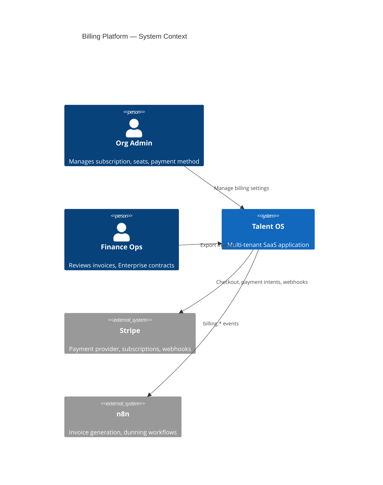
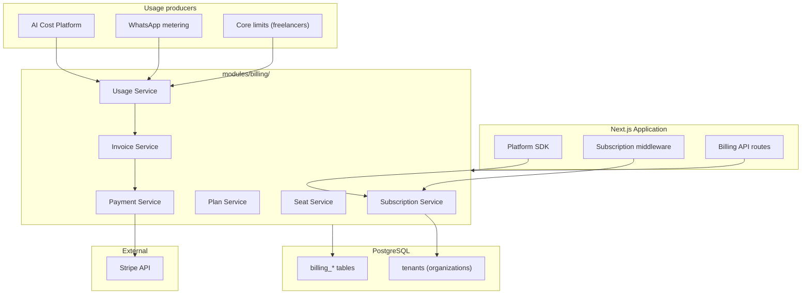
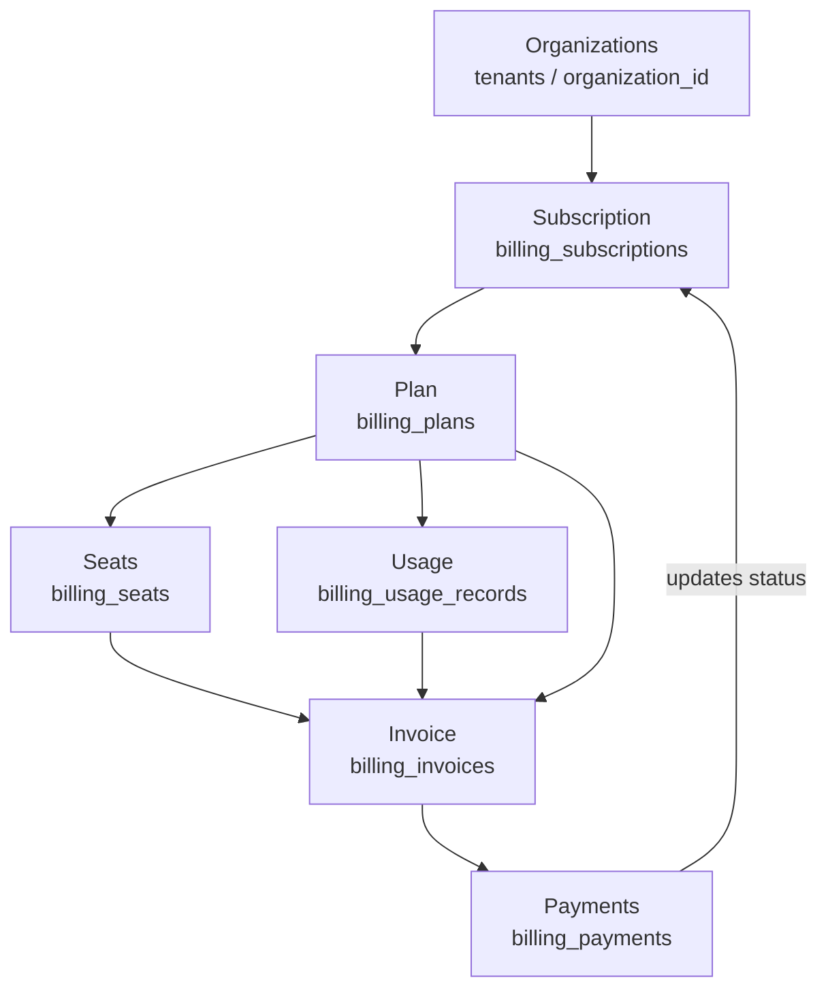
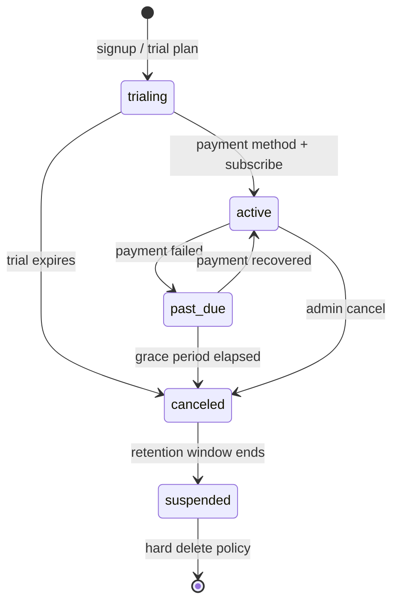
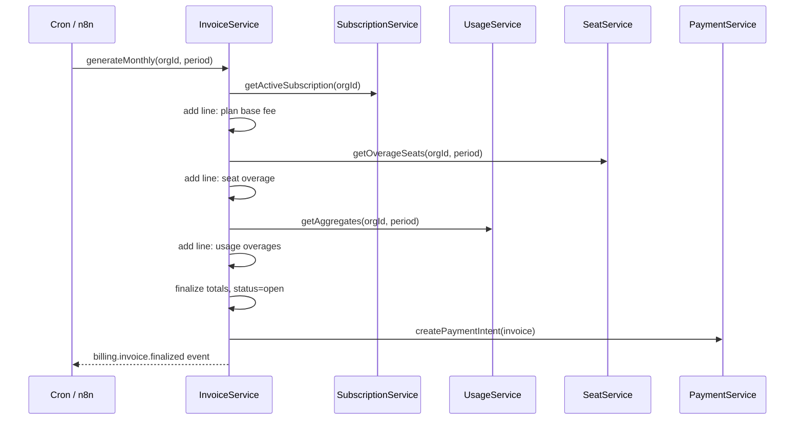
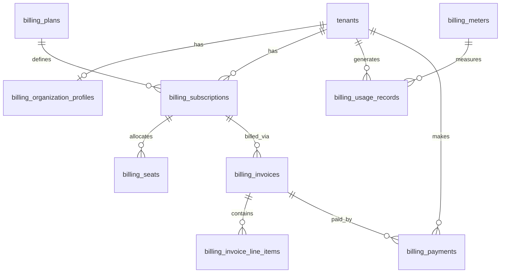

# Talent OS — Billing Platform Architecture

**Document version:** 1.0.0  
**Classification:** Internal — Architecture  
**Author:** Platform Architecture  
**Date:** July 31, 2026  
**Status:** Draft — Awaiting approval  
**Scope:** Design only — no implementation in this document

---

## Table of Contents

1. [Executive Summary](#1-executive-summary)
2. [Platform Context](#2-platform-context)
3. [Billing Flow](#3-billing-flow)
4. [Current State Assessment](#4-current-state-assessment)
5. [Target Architecture Overview](#5-target-architecture-overview)
6. [Organizations](#6-organizations)
7. [Subscriptions](#7-subscriptions)
8. [Plans](#8-plans)
9. [Seats](#9-seats)
10. [Usage](#10-usage)
11. [Invoices](#11-invoices)
12. [Payments](#12-payments)
13. [Integration Points](#13-integration-points)
14. [Data Model](#14-data-model)
15. [Event Catalog](#15-event-catalog)
16. [API Surface](#16-api-surface)
17. [Security & Compliance](#17-security--compliance)
18. [Folder Structure](#18-folder-structure)
19. [Design Decisions](#19-design-decisions)
20. [Migration Path](#20-migration-path)
21. [Relationship to Domain Finance](#21-relationship-to-domain-finance)

---

## 1. Executive Summary

Talent OS requires a **SaaS Billing Platform** that governs how organizations subscribe, consume metered resources, receive invoices, and pay for the platform. This is distinct from **domain finance** (freelancer project payments) and distinct from the **AI Cost Platform** (real-time spend governance), though all three share organization context and observability hooks.

The billing flow is linear and auditable:

```
Organizations → Subscription → Plan → Seats → Usage → Invoice → Payments
```

### Design goals

| Goal | Description |
|------|-------------|
| **Single source of truth** | Subscription state, entitlements, and invoices live in billing tables — not scattered in `tenant.settings` JSON |
| **Plan-driven entitlements** | Feature flags, limits, and seat caps derive from the active plan |
| **Metered usage** | AI, WhatsApp, storage, and future products report into a unified usage ledger |
| **Invoice accuracy** | Line items reconcile plan base fee + seat overages + metered usage |
| **Payment provider abstraction** | Stripe Phase 1; interface allows Wise/manual for Enterprise |
| **Tenant isolation** | RLS on all billing tables; admin-only mutation paths |
| **Event-driven** | Lifecycle transitions emit platform events for workflows and observability |

### Relationship to existing docs

| Document | Relationship |
|----------|--------------|
| [Platform Core](./PLATFORM_CORE.md) (planned, PR-00) | Organization context, product registry, platform events |
| [AI Platform](./AI_PLATFORM.md) §10 | AI Cost Platform feeds **usage** meters; budgets remain pre-pay enforcement |
| [Multi-Tenant Architecture](../08-multi-tenant-architecture.md) | `tenants` = organizations; subscription middleware today is ad hoc |
| [Enterprise System Architecture](../11-enterprise-system-architecture.md) | Tier table and lifecycle states — superseded by Plans + Subscriptions |
| [AI Implementation Roadmap](./AI_IMPLEMENTATION_ROADMAP.md) | Wave 0b — PR-B01 through PR-B08 |

---

## 2. Platform Context

### 2.1 System context



### 2.2 Container diagram



---

## 3. Billing Flow

The canonical flow maps one entity per stage. Each stage has clear inputs, outputs, and ownership.



| Stage | Question answered | Primary artifact |
|-------|-------------------|------------------|
| **Organizations** | Who is the customer? | `tenants.id` (alias `organization_id` in billing) |
| **Subscription** | What is their commercial relationship? | `billing_subscriptions` |
| **Plan** | What are they entitled to and at what price? | `billing_plans` + entitlements |
| **Seats** | How many licensed users? | `billing_seats` |
| **Usage** | What metered resources did they consume? | `billing_usage_records` |
| **Invoice** | What do we charge for this period? | `billing_invoices` + line items |
| **Payments** | How was it paid? | `billing_payments` + Stripe refs |

---

## 4. Current State Assessment

| Capability | Status | Location | Gap |
|------------|:------:|----------|-----|
| Organization (tenant) | **80%** | `tenants`, RLS, middleware | No billing domain module |
| Subscription status | **30%** | `tenants.subscription_status`, `settings.subscription` JSON | Not normalized; no provider sync |
| Plan / tier | **25%** | Hardcoded in enterprise doc + `tenant.repository` | No plan catalog table |
| Seats | **10%** | Team members exist; no seat licensing | No seat cap enforcement |
| Usage metering | **20%** | AI request counts, `estimated_cost`; WA limits in settings | No unified usage ledger |
| Invoicing (SaaS) | **0%** | — | Not implemented |
| Payments (SaaS) | **0%** | Stripe mentioned Phase 2 in enterprise doc | Not implemented |
| Domain payments | **60%** | `payments` table, `InvoiceRepository` | Freelancer workflow — **not SaaS billing** |
| Billing UI | **5%** | `/settings/billing` placeholder page | No functional UI (out of scope Phase 1) |

**Overall billing platform maturity: ~15%**

---

## 5. Target Architecture Overview

The Billing Platform is a **module** under `modules/billing/` that exposes services through the Platform SDK (PR-00). Product code and middleware call billing services — never raw Stripe or scattered settings reads.

### 5.1 Service responsibilities

| Service | Responsibility |
|---------|----------------|
| `OrganizationBillingContext` | Resolves org + active subscription + plan + entitlements for a request |
| `SubscriptionService` | CRUD subscriptions, lifecycle transitions, Stripe sync |
| `PlanService` | Plan catalog, entitlements, pricing tiers |
| `SeatService` | Allocate/deallocate seats, enforce caps on invite |
| `UsageService` | Ingest meters, aggregate by period, idempotent writes |
| `InvoiceService` | Generate invoices, line items, PDF/export hooks |
| `PaymentService` | Payment intents, webhook handling, reconciliation |

### 5.2 Layering

```
┌─────────────────────────────────────────────────────────┐
│  Middleware / Server Actions / Cron / Webhooks          │
├─────────────────────────────────────────────────────────┤
│  Billing Platform Services (modules/billing/)           │
├─────────────────────────────────────────────────────────┤
│  Repositories (lib/repositories/billing-*.repository.ts)│
├─────────────────────────────────────────────────────────┤
│  PostgreSQL billing_* tables + RLS                      │
├─────────────────────────────────────────────────────────┤
│  Stripe (Phase 1) via PaymentService adapter            │
└─────────────────────────────────────────────────────────┘
```

---

## 6. Organizations

**Organizations** in billing map 1:1 to existing **`tenants`**. The Platform Core `OrganizationContext.organizationId` is the billing customer key.

### 6.1 Organization billing profile

Extend tenant data with a normalized billing profile (new table or columns):

```
billing_organization_profiles
  organization_id (PK, FK tenants.id)
  billing_email
  legal_name
  tax_id (nullable)
  billing_address (jsonb)
  currency (default from tenants.currency)
  stripe_customer_id (nullable)
  created_at, updated_at
```

### 6.2 Rules

- One active subscription per organization per **product** (Phase 1: `talent_os` only).
- Multi-product subscriptions (Media Intel, Ad Studio) share org profile but separate subscription rows keyed by `product_id`.
- RLS: org admins with `tenant:billing` permission read/write their profile.

---

## 7. Subscriptions

A **subscription** binds an organization to a plan for a billing period and tracks commercial state.

### 7.1 Subscription entity

```
billing_subscriptions
  id
  organization_id (FK tenants)
  product_id (FK platform_product_registry) — default 'talent_os'
  plan_id (FK billing_plans)
  status: trialing | active | past_due | canceled | suspended
  billing_cycle: monthly | annual
  current_period_start, current_period_end
  trial_end (nullable)
  cancel_at_period_end (boolean)
  canceled_at (nullable)
  stripe_subscription_id (nullable)
  metadata (jsonb)
  created_at, updated_at
```

### 7.2 Lifecycle

Replaces ad-hoc `tenants.subscription_status` as source of truth. `tenants.subscription_status` becomes a **denormalized cache** updated by subscription events (for fast middleware reads).



### 7.3 Middleware enforcement

Existing middleware patterns ([08-multi-tenant-architecture.md](../08-multi-tenant-architecture.md)) migrate to `SubscriptionService.getEffectiveStatus(orgId)`:

| Status | App access |
|--------|------------|
| `trialing`, `active` | Full (subject to plan entitlements) |
| `past_due` | Read-only + billing routes |
| `canceled` | Billing routes only |
| `suspended` | Blocked — contact support |

---

## 8. Plans

**Plans** define catalog offerings, base pricing, included entitlements, and meter definitions.

### 8.1 Plan catalog (Phase 1 seed)

Aligns with [Enterprise System Architecture](../11-enterprise-system-architecture.md) tiers:

| Plan ID | Name | Base/mo | Seats included | Freelancers | WA/mo | AI budget/mo |
|---------|------|---------|----------------|-------------|-------|--------------|
| `starter` | Starter | $49 | 2 | 50 | 500 | $25 (~100 req equiv) |
| `pro` | Pro | $149 | 10 | 200 | 2,000 | $150 (~1000 req) |
| `enterprise` | Enterprise | Custom | Unlimited | Unlimited | Custom | Custom |

### 8.2 Plan entity

```
billing_plans
  id (slug: starter | pro | enterprise)
  product_id
  name, description
  base_price_cents, currency
  billing_interval: month | year
  trial_days (default 14)
  is_public (enterprise = false)
  stripe_price_id (nullable)
  entitlements (jsonb) — see below
  active, created_at, updated_at
```

### 8.3 Entitlements schema

```typescript
interface PlanEntitlements {
  seats: { included: number; max: number; overage_price_cents?: number }
  limits: {
    max_freelancers: number
    max_whatsapp_monthly: number
    max_ai_budget_usd_monthly: number
    max_storage_gb: number
  }
  features: {
    whatsapp: boolean
    ai_matching: boolean
    ai_summaries: boolean
    bulk_import: boolean
    sso: boolean
    api_access: boolean
  }
  support: 'community' | 'email' | 'dedicated'
}
```

### 8.4 Entitlement resolution

`PlanService.resolveEntitlements(orgId)` merges:

1. Platform default plan entitlements
2. Active subscription plan
3. Org-specific overrides (`billing_plan_overrides` for Enterprise contracts)

Platform Feature Flags (PR-00) **read entitlements** from billing instead of `tenant.settings.features` over time.

---

## 9. Seats

**Seats** license team members (admin, talent_manager — not freelancers unless product policy changes).

### 9.1 Seat model

```
billing_seats
  id
  organization_id
  subscription_id
  user_id (FK auth.users / tenant_members)
  role_scope: admin | manager | member
  status: active | pending | released
  assigned_at, released_at
```

### 9.2 Enforcement

| Action | Check |
|--------|-------|
| Invite team member | `SeatService.canAssign(orgId)` — active seats < plan.included or max |
| Accept invite | Allocate seat row |
| Remove member | Release seat (reuse slot) |
| Downgrade plan | Block if active seats > new plan.included; admin must remove users |

### 9.3 Seat overages

When `active_seats > plan.seats.included`:

- Meter seat overage daily or at invoice time
- Line item: `(active_seats - included) × overage_price_cents`

---

## 10. Usage

**Usage** captures metered consumption for billable dimensions. This is the bridge between operational subsystems (AI, WhatsApp) and invoicing.

### 10.1 Usage meters (catalog)

```
billing_meters
  id (slug)
  product_id
  name, description
  unit (requests | messages | tokens | gb | usd)
  aggregation: sum | max | last
  billable: boolean
```

Phase 1 meters:

| Meter ID | Source | Unit | Billable |
|----------|--------|------|----------|
| `ai.requests` | AI gateway ledger | requests | Included in plan; overage optional |
| `ai.cost_usd` | AI Cost Platform aggregates | usd | Pass-through above plan budget |
| `whatsapp.messages` | WhatsApp send logs | messages | Overage above plan limit |
| `storage.gb` | Storage audit (future) | gb | Overage |
| `seats.active` | Seat service | seats | Overage |

### 10.2 Usage records

```
billing_usage_records
  id
  organization_id
  meter_id
  quantity (numeric)
  unit
  recorded_at
  idempotency_key (unique per org+meter+key)
  source_ref (e.g. ai_requests.id, message.id)
  metadata (jsonb)
  billing_period_start (date) — for aggregation partition
```

**Idempotency:** Producers pass stable keys (`ai:{requestId}`, `wa:{messageId}`) to prevent double billing.

### 10.3 Aggregation

```
billing_usage_aggregates
  organization_id, meter_id, period_start, period_end
  quantity_total
  last_calculated_at
```

Cron job (or trigger batch) rolls up records → aggregates → invoice line item input.

### 10.4 AI Cost Platform relationship

| Subsystem | Role |
|-----------|------|
| **AI Cost Platform** (PR-19/20) | Real-time budget enforcement, 402 at hard limit |
| **Billing Usage** (PR-B04) | Records metered usage for invoice line items |

Flow: AI gateway records request → `UsageService.record({ meter: 'ai.cost_usd', quantity })` **and** Cost Platform updates aggregates. Budget check runs **before** request; usage record runs **after** success.

---

## 11. Invoices

**Invoices** are periodic statements combining plan base fee, seat overages, and metered usage.

### 11.1 Invoice entity

```
billing_invoices
  id
  organization_id
  subscription_id
  invoice_number (human-readable, unique)
  status: draft | open | paid | void | uncollectible
  period_start, period_end
  subtotal_cents, tax_cents, total_cents
  currency
  due_date
  paid_at (nullable)
  stripe_invoice_id (nullable)
  pdf_url (nullable)
  created_at, updated_at

billing_invoice_line_items
  id
  invoice_id
  type: plan_base | seat_overage | usage | credit | tax | discount
  description
  meter_id (nullable)
  quantity, unit_price_cents, amount_cents
  metadata (jsonb)
```

### 11.2 Generation flow



### 11.3 Credits and Enterprise

- Enterprise custom contracts: manual `credit` line items via admin API
- Proration on mid-cycle plan changes: credit/charge line items computed by `InvoiceService.prorate()`

---

## 12. Payments

**Payments** record money movement against invoices. Phase 1 uses **Stripe**; interface supports future providers.

### 12.1 Payment entity

```
billing_payments
  id
  organization_id
  invoice_id (nullable — for one-off charges)
  amount_cents, currency
  status: pending | processing | succeeded | failed | refunded
  provider: stripe | manual | wise
  provider_payment_id (Stripe PaymentIntent / Charge id)
  payment_method_type: card | ach | wire
  failure_code, failure_message (nullable)
  paid_at (nullable)
  metadata (jsonb)
  created_at, updated_at
```

> **Naming:** `billing_payments` is SaaS subscription billing. The existing `payments` table remains **domain finance** (freelancer project payments). See [§21](#21-relationship-to-domain-finance).

### 12.2 Stripe integration (Phase 1)

| Capability | Stripe object |
|------------|---------------|
| Customer | `Customer` ↔ `billing_organization_profiles.stripe_customer_id` |
| Subscription | `Subscription` ↔ `billing_subscriptions.stripe_subscription_id` |
| Checkout | `Checkout.Session` for plan upgrade / trial conversion |
| Invoicing | `Invoice` sync optional; platform generates line items, Stripe collects |
| Webhooks | `invoice.paid`, `invoice.payment_failed`, `customer.subscription.updated` |

### 12.3 Webhook handling

```
POST /api/webhooks/stripe
  → verify signature
  → idempotent handler (billing_webhook_events table)
  → PaymentService.reconcile(event)
  → SubscriptionService.updateStatus(...)
  → emit billing.payment.* / billing.subscription.* events
```

### 12.4 Dunning

On `payment_failed`:

1. Subscription → `past_due`
2. Emit `billing.payment.failed`
3. n8n workflow: email admin, retry schedule (Stripe Smart Retries + platform alerts)
4. After grace (7 days): `canceled`

---

## 13. Integration Points

### 13.1 Platform Core (PR-00)

| Integration | Usage |
|-------------|-------|
| `OrganizationContext` | All billing services scoped by `organizationId` |
| `ProductRegistry` | Plans and subscriptions keyed by `product_id` |
| `PlatformEventEmitter` | Emit `billing.*` events |
| `FeatureFlagService` | Entitlements drive feature flags |
| `ConfigService` | Plan defaults, tax rates, grace periods |

### 13.2 AI Platform

| Integration | Usage |
|-------------|-------|
| PR-19 Cost aggregates | Feed `ai.cost_usd` meter |
| PR-20 Budget enforcement | Uses plan entitlements `max_ai_budget_usd_monthly` |
| PR-21 Budget alerts | Complements invoice preview for admins |

### 13.3 Middleware & limits

Replace reads of `tenant.settings.limits` with:

```typescript
const entitlements = await billing.plan.resolveEntitlements(orgId)
// entitlements.limits.max_freelancers, etc.
```

### 13.4 Observability

| Metric | Labels |
|--------|--------|
| `billing.subscription.active` | plan, product |
| `billing.invoice.total_cents` | org, status |
| `billing.payment.failed` | org, provider |
| `billing.usage.quantity` | meter, org |
| `billing.seats.utilization` | org, plan |

---

## 14. Data Model

### 14.1 ER diagram



### 14.2 Migration

Single migration in PR-B01: `024_billing_platform.sql`

Tables (in dependency order):

1. `billing_plans` (+ seed starter/pro/enterprise)
2. `billing_meters` (+ seed meters)
3. `billing_organization_profiles`
4. `billing_subscriptions`
5. `billing_seats`
6. `billing_usage_records`
7. `billing_usage_aggregates`
8. `billing_invoices`
9. `billing_invoice_line_items`
10. `billing_payments`
11. `billing_webhook_events` (idempotency)
12. `billing_plan_overrides` (Enterprise)

RLS on all tables: `organization_id IN (SELECT auth.user_tenant_ids())` with service-role bypass for cron/webhooks.

---

## 15. Event Catalog

Events use `billing.*` namespace via Platform Events (PR-00):

| Event | Payload | Trigger |
|-------|---------|---------|
| `billing.subscription.created` | `{ org_id, plan_id, status }` | New subscription |
| `billing.subscription.updated` | `{ org_id, old_status, new_status }` | Lifecycle change |
| `billing.subscription.canceled` | `{ org_id, cancel_at }` | Cancel |
| `billing.plan.changed` | `{ org_id, old_plan, new_plan }` | Upgrade/downgrade |
| `billing.seat.assigned` | `{ org_id, user_id, seat_count }` | Invite accepted |
| `billing.seat.released` | `{ org_id, user_id }` | Member removed |
| `billing.seat.limit_exceeded` | `{ org_id, requested, max }` | Blocked invite |
| `billing.usage.recorded` | `{ org_id, meter_id, quantity }` | Meter ingest |
| `billing.usage.threshold_reached` | `{ org_id, meter_id, pct }` | 80% of plan limit |
| `billing.invoice.finalized` | `{ org_id, invoice_id, total_cents }` | Invoice open |
| `billing.invoice.paid` | `{ org_id, invoice_id }` | Payment success |
| `billing.payment.succeeded` | `{ org_id, payment_id, amount_cents }` | Stripe webhook |
| `billing.payment.failed` | `{ org_id, payment_id, reason }` | Failed charge |

---

## 16. API Surface

Phase 1 API routes (admin + webhook only — no billing UI in architecture scope):

| Method | Route | Permission | Purpose |
|--------|-------|------------|---------|
| GET | `/api/billing/subscription` | `tenant:billing` | Current subscription + plan |
| POST | `/api/billing/subscription/change-plan` | `tenant:billing` | Upgrade/downgrade |
| GET | `/api/billing/seats` | `tenant:billing` | Seat list + utilization |
| GET | `/api/billing/usage` | `tenant:billing` | Current period usage |
| GET | `/api/billing/invoices` | `tenant:billing` | Invoice history |
| GET | `/api/billing/invoices/:id` | `tenant:billing` | Invoice detail |
| POST | `/api/billing/checkout` | `tenant:billing` | Stripe Checkout session |
| POST | `/api/billing/portal` | `tenant:billing` | Stripe Customer Portal |
| POST | `/api/webhooks/stripe` | HMAC | Stripe webhooks |
| POST | `/api/cron/billing/generate-invoices` | CRON_SECRET | Monthly invoice job |
| POST | `/api/cron/billing/aggregate-usage` | CRON_SECRET | Usage roll-up |

OpenAPI entries added in PR-B08.

---

## 17. Security & Compliance

| Control | Implementation |
|---------|----------------|
| RLS | All `billing_*` tables tenant-scoped |
| Permissions | `tenant:billing` for admin mutations; managers read-only usage |
| Webhook auth | Stripe signature verification; idempotent event store |
| PCI | No card data stored — Stripe Elements / Checkout only |
| Audit | Domain events for subscription/plan changes |
| Secrets | `STRIPE_SECRET_KEY`, `STRIPE_WEBHOOK_SECRET` in env validation |

---

## 18. Folder Structure

```
modules/billing/
├── index.ts                      # Barrel export
├── types/
│   ├── index.ts                  # SubscriptionStatus, PlanEntitlements, etc.
│   └── enums.ts
├── contracts/
│   ├── subscription-service.ts
│   ├── usage-service.ts
│   └── payment-provider.ts
├── organization/
│   └── profile.ts
├── subscription/
│   ├── service.ts
│   └── lifecycle.ts
├── plans/
│   ├── service.ts
│   ├── catalog.ts                # Seed plan definitions
│   └── entitlements.ts
├── seats/
│   └── service.ts
├── usage/
│   ├── service.ts
│   ├── meters.ts
│   └── aggregator.ts
├── invoices/
│   ├── service.ts
│   └── generator.ts
├── payments/
│   ├── service.ts
│   └── stripe.adapter.ts
└── sdk/
    └── billing-client.ts         # Extends Platform SDK

lib/repositories/
├── billing-subscription.repository.ts
├── billing-plan.repository.ts
├── billing-seat.repository.ts
├── billing-usage.repository.ts
├── billing-invoice.repository.ts
└── billing-payment.repository.ts

supabase/migrations/
└── 024_billing_platform.sql      # PR-B01 (after 022 platform, 023 AI extend)

app/api/
├── billing/
│   ├── subscription/route.ts
│   ├── seats/route.ts
│   ├── usage/route.ts
│   ├── invoices/route.ts
│   ├── checkout/route.ts
│   └── portal/route.ts
├── webhooks/stripe/route.ts
└── cron/billing/
    ├── generate-invoices/route.ts
    └── aggregate-usage/route.ts
```

---

## 19. Design Decisions

### ADR-B01: Organizations = tenants

**Decision:** Reuse `tenants.id` as `organization_id`; do not introduce a parallel org table.  
**Rationale:** RLS, middleware, and Platform Core already keyed on tenant.  
**Consequence:** Billing profile is an extension table, not a new identity.

### ADR-B02: Separate SaaS payments from domain payments

**Decision:** `billing_payments` for subscription billing; keep `payments` for freelancer finance.  
**Rationale:** Different lifecycles, permissions, and reporting. Avoids breaking Talent domain.  
**Consequence:** `InvoiceRepository` name in codebase refers to domain payments — billing uses `BillingInvoiceRepository`.

### ADR-B03: Stripe Phase 1

**Decision:** Stripe for checkout, subscriptions, and webhooks. Enterprise wire/manual via `provider: manual`.  
**Rationale:** Enterprise doc already targets Stripe Phase 2; billing platform brings it forward in controlled PR-B06.  
**Consequence:** Requires Stripe account, webhook endpoint, test mode in CI.

### ADR-B04: Usage vs real-time budget

**Decision:** AI Cost Platform enforces budgets at request time; Billing Usage records for invoicing.  
**Rationale:** Different time horizons (ms vs monthly invoice).  
**Consequence:** Two write paths from AI gateway — coordinated in PR-B04 + PR-19.

### ADR-B05: Denormalized subscription_status on tenants

**Decision:** Keep `tenants.subscription_status` as cache updated by billing events.  
**Rationale:** Middleware hot path avoids join on every request.  
**Consequence:** Event handler must keep cache in sync; reconciliation cron as safety net.

---

## 20. Migration Path

| Phase | PRs | Outcome |
|-------|-----|---------|
| **Foundation** | PR-B01, PR-B02 | Schema, plans, subscriptions; backfill from `settings.subscription` |
| **Entitlements** | PR-B03, PR-B07 | Seats + middleware on billing service |
| **Metering** | PR-B04 | Usage ledger; AI + WA producers |
| **Revenue** | PR-B05, PR-B06 | Invoices + Stripe |
| **Hardening** | PR-B08 | APIs, events, observability, docs |

Backfill script (PR-B02):

1. Read each tenant's `settings.subscription.tier` → map to `billing_plans.id`
2. Create `billing_subscriptions` from `subscription_status`
3. Count team members → seed `billing_seats`
4. Verify middleware behavior unchanged

---

## 21. Relationship to Domain Finance

| Aspect | SaaS Billing (`billing_*`) | Domain Finance (`payments`) |
|--------|---------------------------|----------------------------|
| **Purpose** | Org pays for Talent OS platform | Agency pays freelancers for projects |
| **Customer** | Organization (tenant admin) | Freelancer |
| **Trigger** | Subscription cycle, usage | Project milestone / approval |
| **Permissions** | `tenant:billing` | `payments:read`, `payments:approve`, `payments:pay` |
| **UI** | `/settings/billing` | `/payments` |
| **Provider** | Stripe | Manual / Wise (future) |

No merge of these domains. Cross-link in admin analytics only (total org spend vs freelancer payouts).

---

## Appendix A — Implementation roadmap

See [AI_IMPLEMENTATION_ROADMAP.md](./AI_IMPLEMENTATION_ROADMAP.md) **Wave 0b — Billing Platform** (PR-B01 through PR-B08).

**Critical path (billing):** PR-00 → PR-B01 → PR-B02 → PR-B03 → PR-B04 → PR-B05 → PR-B06 → PR-B07 → PR-B08

**Integration critical path (AI + billing):** PR-00 → PR-B02 → PR-19 → PR-B04 → PR-20

---

**Status: Draft — Awaiting approval — no code in this document.**

*End of Billing Platform Architecture v1.0.0*
