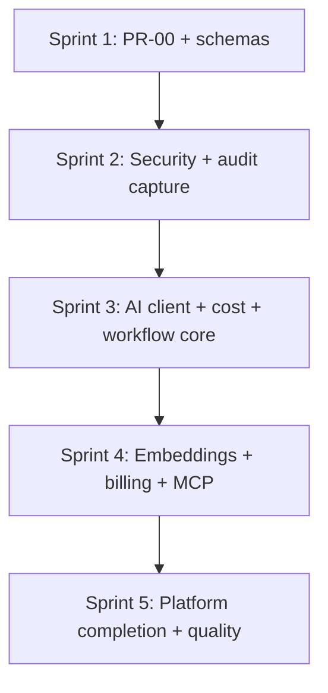

# Talent OS — Engineering Execution Plan

**Document version:** 1.0.0  
**Date:** July 31, 2026  
**Source:** [AI_IMPLEMENTATION_ROADMAP.md](./AI_IMPLEMENTATION_ROADMAP.md) v1.6.0 (83 PRs)  
**Audience:** Engineering leadership, solo senior full-stack engineer  
**Tooling:** Cursor + Claude Code (AI-assisted implementation)  
**Scope:** Execution plan only — no implementation code

---

## Executive summary

This plan executes **all 83 PRs** from the platform roadmap across **5 sprints** (~3 weeks each, **15 weeks total**) for **one senior full-stack engineer** using AI coding tools. Work is sequenced by dependency, risk, and business value — not by platform wave alone.

Each sprint delivers a **shippable increment** to `main` behind feature flags where risk is Medium or High. No big-bang release.

| Sprint | Theme | PRs | Primary business outcome |
|--------|-------|-----|--------------------------|
| [Sprint 1](./SPRINT_01.md) | Platform bedrock | 16 | Shared SDK, AI integrity, schema foundations |
| [Sprint 2](./SPRINT_02.md) | Secure AI gateway | 16 | Production-safe AI path, audit capture, governance |
| [Sprint 3](./SPRINT_03.md) | AI product + cost | 17 | AI client, prompts, budgets, declarative workflow core |
| [Sprint 4](./SPRINT_04.md) | Intelligence + revenue | 17 | Embeddings, hybrid search, billing, MCP/agents |
| [Sprint 5](./SPRINT_05.md) | Production platform | 17 | Full platform APIs, workflow cutover, quality, deprecation |

---

## Team model

| Role | Count | Responsibility |
|------|-------|----------------|
| Senior full-stack engineer | 1 | Implementation, review, deploy, demo |
| AI coding tools | Cursor + Claude Code | Scaffold, tests, migrations, repetitive refactors |
| Product / stakeholder | As needed | Sprint demo sign-off, flag cutover approval |

### AI-assisted velocity assumptions

| PR size | Solo (no AI) | With Cursor + Claude Code |
|---------|--------------|---------------------------|
| S (≤1 day) | 1 day | 0.5 day |
| M (2–3 days) | 2.5 days | 1.5 days |
| L (4–5 days) | 4.5 days | 3 days |

**Effective throughput:** ~1.4–1.6× on migrations, repositories, unit tests, and OpenAPI updates. **No multiplier** on High-risk PRs (guardrails, budget 402, Stripe, workflow cutover) — human review remains mandatory.

---

## Sprint calendar

| Sprint | Duration | Start (example) | End (example) | Cumulative PRs |
|--------|----------|-----------------|---------------|----------------|
| Sprint 1 | 3 weeks | Week 1 | Week 3 | 16 / 83 |
| Sprint 2 | 3 weeks | Week 4 | Week 6 | 32 / 83 |
| Sprint 3 | 3 weeks | Week 7 | Week 9 | 49 / 83 |
| Sprint 4 | 3 weeks | Week 10 | Week 12 | 66 / 83 |
| Sprint 5 | 3 weeks | Week 13 | Week 15 | 83 / 83 |

**Buffer:** Reserve 20% of each sprint (≈3 days) for review feedback, CI flakes, and dependency surprises.

---

## Complete PR assignment matrix

### Sprint 1 — Platform bedrock (16 PRs)

| PR | Title | Wave |
|----|-------|------|
| PR-00 | Platform Core infrastructure | 0a |
| PR-01 | MockProvider + AI tests | 0 |
| PR-02 | ai_requests schema extend | 0 |
| PR-03 | Direct AI execution default | 0 |
| PR-04 | Agent feature tagging | 0 |
| PR-05 | Unified AI ledger | 0 |
| PR-A01 | Audit schema + action registry | 0e |
| PR-A02 | Audit capture + redaction | 0e |
| PR-B01 | Billing schema foundation | 0b |
| PR-B02 | Plan catalog + entitlements | 0b |
| PR-FF01 | Feature catalog + registry | 0c |
| PR-FF02 | Environment + kill switches | 0c |
| PR-S01 | Search schema + index registry | 0d |
| PR-S02 | Keyword search engine | 0d |
| PR-W01 | Process definition schema | 0f |
| PR-W02 | Lead + Proposal entities | 0f |

### Sprint 2 — Secure AI gateway (16 PRs)

| PR | Title | Wave |
|----|-------|------|
| PR-06 | Gateway pipeline extraction | 1 |
| PR-07 | Circuit breakers | 1 |
| PR-08 | Input guardrails | 1 |
| PR-09 | PII redaction | 1 |
| PR-10 | Output guardrails | 1 |
| PR-A03 | Actor resolver + repo hooks | 0e |
| PR-A04 | Source capture middleware | 0e |
| PR-A05 | Unified AI audit (w/ PR-05) | 0e |
| PR-FF03 | Org overrides + entitlement gate | 0c |
| PR-FF06 | Evaluation service + Redis cache | 0c |
| PR-B03 | Seat management | 0b |
| PR-S05 | Filter engine + facets | 0d |
| PR-W03 | Transition engine | 0f |
| PR-W04 | Definition loader + validator | 0f |
| PR-11 | AI Platform client | 2 |
| PR-12 | Azure OpenAI provider | 2 |

### Sprint 3 — AI product + cost (17 PRs)

| PR | Title | Wave |
|----|-------|------|
| PR-13 | Routing policies schema | 2 |
| PR-14 | Policy routing engine | 2 |
| PR-15 | Response cache | 2 |
| PR-16 | Prompt Platform migration | 3 |
| PR-17 | Prompt DB resolver | 3 |
| PR-18 | Consolidate duplicate prompts | 3 |
| PR-19 | Cost budget schema | 3 |
| PR-20 | Budget enforce 402 | 3 |
| PR-21 | Budget alerts | 3 |
| PR-FF04 | Rollout engine | 0c |
| PR-FF05 | Experiment framework | 0c |
| PR-B04 | Usage metering | 0b |
| PR-W05 | Gate evaluator + approvals | 0f |
| PR-W06 | Workflow execution bridge | 0f |
| PR-S06 | Saved searches + alerts | 0d |
| PR-22 | embed() API | 4 |
| PR-23 | Embedding service | 4 |

### Sprint 4 — Intelligence + revenue (17 PRs)

| PR | Title | Wave |
|----|-------|------|
| PR-24 | Embedding indexing workflow | 4 |
| PR-25 | Semantic knowledge search E2E | 4 |
| PR-S03 | Semantic search engine | 0d |
| PR-S04 | Hybrid ranker (RRF) | 0d |
| PR-S07 | Unified Search API + SDK | 0d |
| PR-B05 | Invoice generation | 0b |
| PR-B06 | Stripe integration | 0b |
| PR-B07 | Subscription lifecycle | 0b |
| PR-W07 | Process API + board + SDK | 0f |
| PR-26 | MCP adapter framework | 5 |
| PR-27 | MCP adapters batch | 5 |
| PR-28 | AI + knowledge MCP | 5 |
| PR-29 | Memory schema | 6 |
| PR-30 | Memory Platform service | 6 |
| PR-33 | AI trace sub-spans | 7 |
| PR-FF07 | Migrate AI + tenant.settings flags | 0c |
| PR-34 | Provider health probes | 7 |

### Sprint 5 — Production platform (17 PRs)

| PR | Title | Wave |
|----|-------|------|
| PR-31 | AI feature namespaces | 6 |
| PR-32 | Migrate to platform client | 6 |
| PR-35 | Prompt eval CI | 7 |
| PR-36 | Quality reporting backend | 7 |
| PR-37 | Cost optimization routing | 7 |
| PR-38 | Embedding namespaces | 7 |
| PR-39 | Match context compression | 7 |
| PR-40 | Streaming usage accuracy | 7 |
| PR-41 | OpenTelemetry export | 7 |
| PR-42 | Deprecate getAiGateway | 7 |
| PR-A06 | Migrate activity_logs | 0e |
| PR-A07 | Audit query API + export | 0e |
| PR-A08 | Audit observability | 0e |
| PR-FF08 | Feature flags admin API | 0c |
| PR-B08 | Billing API + observability | 0b |
| PR-S08 | Migrate knowledge search | 0d |
| PR-W08 | Migrate hard-coded flows | 0f |

---

## Dependency overview

**Hard gates (do not start next sprint without):**

| Gate | Required PRs | Validates |
|------|--------------|-----------|
| G1 → Sprint 2 | PR-00 merged, `npm test` green | Platform SDK exists |
| G2 → Sprint 3 | PR-06–10 merged, guardrails on | AI security path |
| G3 → Sprint 4 | PR-19–20 merged OR budget flag off | Cost schema ready |
| G4 → Sprint 5 | PR-24 merged | Embeddings indexed in staging |
| G5 → Release | PR-42, PR-W08, PR-B07 | Public API stable |

---

## Global engineering standards

Apply to every PR in every sprint:

| Standard | Requirement |
|----------|-------------|
| Branch naming | Per roadmap: `cursor/ai-pr-XX-*-5fb1`, `cursor/billing-pr-BXX-*-5fb1`, etc. |
| CI | `npm run test:all`, typecheck, lint, build — green before merge |
| Migrations | Sequential 022–034; document in `MIGRATIONS_INDEX.md` |
| Feature flags | All Medium/High risk behavior behind env or platform flag |
| Rollback | Every PR has documented revert steps (see sprint docs) |
| Docs | Update gap analysis item to Partial/Resolved when PR merges |
| No UI scope | Backend/platform only unless explicitly in PR acceptance criteria |

---

## Migration sequence (all sprints)

| # | Migration | Sprint | PR |
|---|-----------|--------|-----|
| 022 | platform_core | 1 | PR-00 |
| 023 | ai_requests_extend | 1 | PR-02 |
| 024 | billing_platform | 1 | PR-B01 |
| 025 | feature_flags_platform | 1 | PR-FF01 |
| 026 | ai_cost_budgets | 3 | PR-19 |
| 027 | ai_routing_policies | 3 | PR-13 |
| 028 | ai_prompt_platform | 3 | PR-16 |
| 029 | ai_memory_unified | 4 | PR-29 |
| 030 | ai_quality_reports | 5 | PR-36 |
| 031 | embedding_namespaces | 5 | PR-38 |
| 032 | search_platform | 1 | PR-S01 |
| 033 | audit_platform | 1 | PR-A01 |
| 034 | workflow_platform | 1 | PR-W01 |

---

## Release strategy

| Milestone | After sprint | Deploy target | Feature flags |
|-----------|--------------|---------------|---------------|
| **M1 — Platform schemas** | Sprint 1 | Staging | All new platforms off |
| **M2 — Secure AI** | Sprint 2 | Staging → prod pilot | Guardrails on; audit capture on |
| **M3 — Governed AI** | Sprint 3 | Prod pilot | Budget soft alerts; workflow declarative off |
| **M4 — Full intelligence** | Sprint 4 | Prod | Hybrid search; Stripe test mode |
| **M5 — GA platform** | Sprint 5 | Prod GA | Cutover flags; deprecations |

**Production pilot** = 1–3 friendly tenants with explicit risk acceptance until M5.

---

## Risk register (program level)

| ID | Risk | Impact | Mitigation | Owner sprint |
|----|------|--------|------------|--------------|
| R1 | PR-00 quality blocks all downstream | Critical | Extra review; no parallel starts until G1 | 1 |
| R2 | Solo engineer bottleneck | High | AI for boilerplate; strict PR scope; defer P2 polish | All |
| R3 | Migration collision | Medium | Fixed numbering table above | 1 |
| R4 | Guardrails false positives | High | Feature flag; tenant allowlist | 2 |
| R5 | Budget 402 blocks customers | High | Soft-only first; hard limit per org | 3 |
| R6 | Stripe webhook errors | High | Test mode; idempotency table | 4 |
| R7 | Workflow cutover breaks projects | Critical | `process.declarative.enabled=false`; backfill | 5 |
| R8 | Scope creep into UI | Medium | Reject UI PRs; API-first | All |

---

## Success metrics (program completion)

| Metric | Target | Source |
|--------|--------|--------|
| PRs merged | 83 / 83 | GitHub |
| Platform maturity (AI) | ≥85% vs AI_PLATFORM.md | Gap analysis v2 |
| All LLM via single ledger | 100% | PR-05 + PR-A05 audit query |
| CI coverage `lib/ai` | ≥70% | Vitest |
| Guardrails on all gateway paths | 100% | PR-08–10 |
| Billing platform maturity | ≥80% | PR-B08 acceptance |
| Feature flags maturity | ≥85% | PR-FF08 acceptance |
| Search platform maturity | ≥80% | PR-S08 acceptance |
| Audit platform maturity | ≥80% | PR-A08 acceptance |
| Workflow platform maturity | ≥80% | PR-W08 acceptance |
| Zero public `getAiGateway` | 0 imports | PR-42 lint |
| Production readiness score | ≥8.5/10 | Updated readiness report |

---

## Tooling workflow (Cursor + Claude Code)

Recommended daily loop for the solo engineer:

1. **Pick PR** from sprint doc — one in-flight at a time for High-risk PRs; two for Low-risk schema PRs if independent.
2. **Branch** — `git checkout -b cursor/<pr-branch>-5fb1`
3. **Context pack** — Feed Claude: PR acceptance criteria + affected files from roadmap + platform architecture doc.
4. **Implement** — AI generates scaffold; engineer reviews security paths, RLS, and migrations manually.
5. **Test** — `npm run test:all`; add tests per PR acceptance criteria before push.
6. **PR** — Draft PR with rollback section copied from sprint doc.
7. **Merge** — Squash after self-review checklist; deploy staging same day for Medium+ risk.

**Do not AI-generate without review:** RLS policies, Stripe webhooks, budget enforcement, guardrail rules, immutability triggers.

---

## Sprint documents

| Document | Focus |
|----------|-------|
| [SPRINT_01.md](./SPRINT_01.md) | Platform Core, AI foundation, all platform schemas seeded |
| [SPRINT_02.md](./SPRINT_02.md) | Gateway security, audit capture, AI client start |
| [SPRINT_03.md](./SPRINT_03.md) | Prompts, budgets, workflow engine, feature rollouts |
| [SPRINT_04.md](./SPRINT_04.md) | Embeddings, search hybrid, Stripe, MCP, memory |
| [SPRINT_05.md](./SPRINT_05.md) | Platform API completion, cutovers, quality, deprecation |

---

## Document maintenance

After each merged PR:

1. Update [AI_GAP_ANALYSIS.md](./AI_GAP_ANALYSIS.md) — mark resolved items.
2. Tick PR in sprint doc checklist.
3. Update [PRODUCTION_READINESS_REPORT.md](../Platform/PRODUCTION_READINESS_REPORT.md) if sprint milestone reached.

---

**Status: Ready for execution — no code in this document.**

*End of Engineering Execution Plan v1.0.0*
