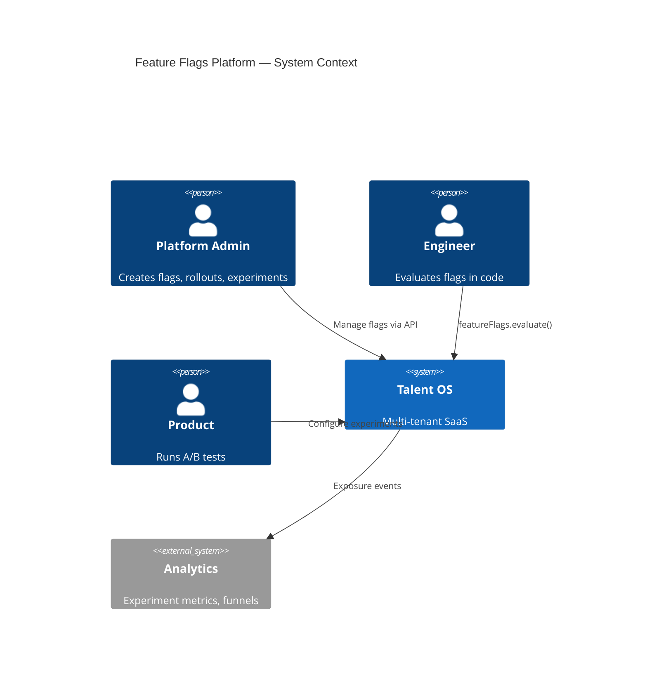
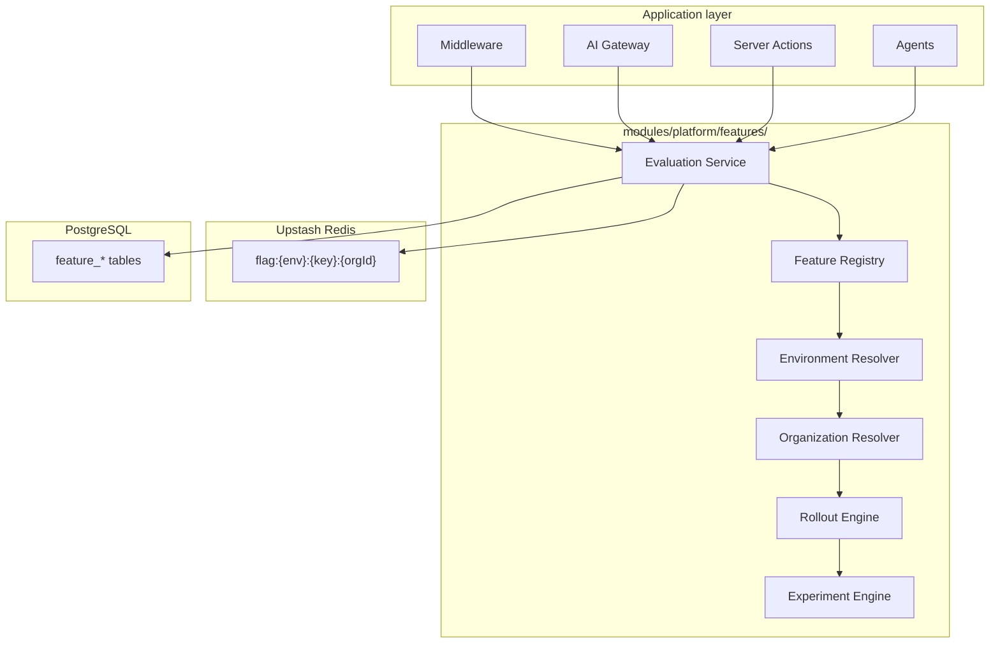
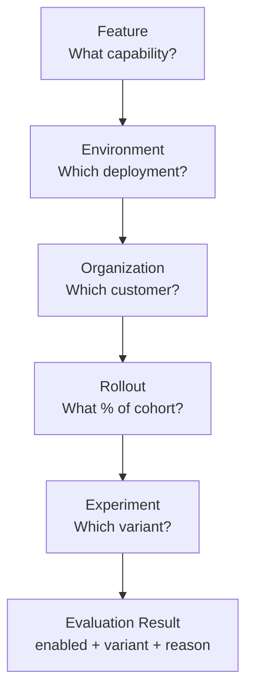
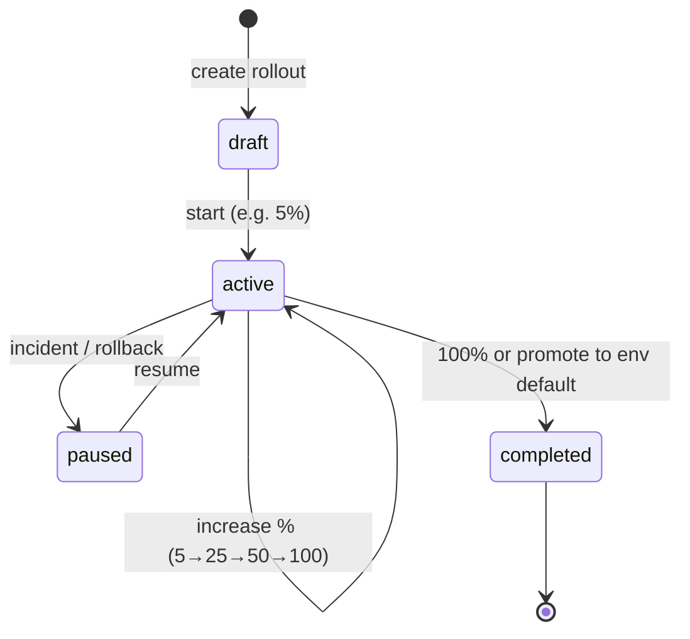
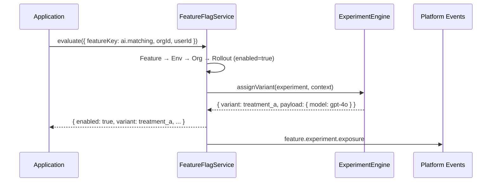
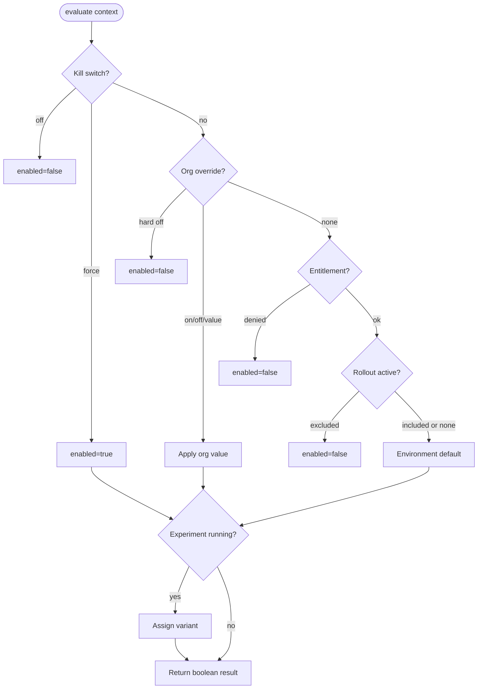
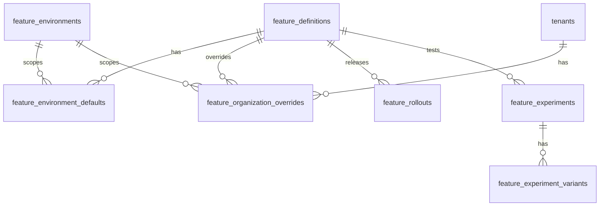

# Talent OS — Feature Flags Platform Architecture

**Document version:** 1.0.0  
**Classification:** Internal — Architecture  
**Author:** Platform Architecture  
**Date:** July 31, 2026  
**Status:** Draft — Awaiting approval  
**Scope:** Design only — no implementation in this document

---

## Table of Contents

1. [Executive Summary](#1-executive-summary)
2. [Platform Context](#2-platform-context)
3. [Feature Flag Flow](#3-feature-flag-flow)
4. [Current State Assessment](#4-current-state-assessment)
5. [Target Architecture Overview](#5-target-architecture-overview)
6. [Feature](#6-feature)
7. [Environment](#7-environment)
8. [Organization](#8-organization)
9. [Rollout](#9-rollout)
10. [Experiment](#10-experiment)
11. [Evaluation Engine](#11-evaluation-engine)
12. [Integration Points](#12-integration-points)
13. [Data Model](#13-data-model)
14. [Caching & Performance](#14-caching--performance)
15. [Event Catalog](#15-event-catalog)
16. [API Surface](#16-api-surface)
17. [Folder Structure](#17-folder-structure)
18. [Design Decisions](#18-design-decisions)
19. [Migration Path](#19-migration-path)
20. [Relationship to PR-00 MVP](#20-relationship-to-pr-00-mvp)

---

## 1. Executive Summary

Every enterprise SaaS eventually needs a **Feature Flags Platform** — not ad-hoc env toggles and JSON blobs in `tenant.settings`, but a governed system for progressive delivery, org-specific enablement, percentage rollouts, and A/B experiments.

The canonical evaluation hierarchy is:

```
Feature → Environment → Organization → Rollout → Experiment
```

### Design goals

| Goal | Description |
|------|-------------|
| **Single evaluation API** | One `FeatureFlagService.evaluate()` used by AI gateway, middleware, server actions, and agents |
| **Layered resolution** | Each layer narrows or overrides the previous; precedence is deterministic and testable |
| **Environment safety** | Dev/staging/production isolation — never leak prod rollouts to dev |
| **Org-scoped control** | Per-organization overrides for pilots, Enterprise deals, and support |
| **Progressive delivery** | Percentage rollouts with stable bucketing (same org always gets same result) |
| **Experiment-ready** | Multivariate flags, variant assignment, exposure tracking for analytics |
| **Plan-aware** | Billing entitlements can gate features before rollout/experiment layers |
| **Kill switches** | Emergency env-level disable overrides everything below |

### Relationship to existing docs

| Document | Relationship |
|----------|--------------|
| [Platform Core](./PLATFORM_CORE.md) (PR-00) | MVP flag service — env → default → org; this doc extends it |
| [Billing Platform](./BILLING_PLATFORM.md) | Plan entitlements feed Organization layer |
| [AI Platform](./AI_PLATFORM.md) | Primary consumer — AI features, prompt A/B, kill switches |
| [Multi-Tenant Architecture](../08-multi-tenant-architecture.md) | `tenant.settings.features` — legacy source to migrate |
| [AI Implementation Roadmap](./AI_IMPLEMENTATION_ROADMAP.md) | Wave 0c — PR-FF01 through PR-FF08 |

---

## 2. Platform Context

### 2.1 System context



### 2.2 Container diagram



---

## 3. Feature Flag Flow

Each layer answers a distinct question. Evaluation walks the stack top to bottom; a layer may **short-circuit** (kill switch, hard org off) or **pass through** to the next.



| Layer | Question | Example |
|-------|----------|---------|
| **Feature** | What is being toggled? | `ai.matching`, `whatsapp.bulk_send`, `ui.new_dashboard` |
| **Environment** | What is the default in this deployment? | `production`: off; `staging`: on for QA |
| **Organization** | Does this customer override the env default? | Acme Corp: force on (pilot) |
| **Rollout** | Is this org/user in the release cohort? | 25% of orgs in production → on |
| **Experiment** | Which variant does this subject get? | 50/50 → `control` vs `new_matcher_v2` |

---

## 4. Current State Assessment

| Capability | Status | Location | Gap |
|------------|:------:|----------|-----|
| Feature definitions | **10%** | Scattered string keys in code | No catalog table |
| Environment layer | **20%** | `process.env.AI_FEATURE_*` | No env registry; implicit NODE_ENV |
| Organization layer | **40%** | `tenants.settings.features` JSON | Not normalized; no audit trail |
| Rollout | **0%** | — | No percentage release |
| Experiment | **0%** | Mentioned in AI_PLATFORM.md for prompts | No assignment engine |
| Evaluation API | **25%** | `lib/ai/features/flags.ts` (AI-only) | Not platform-wide |
| Caching | **15%** | Tenant settings cache mentioned | No flag-specific cache |
| Admin UI | **0%** | — | Out of scope Phase 1 |

**Overall feature flags maturity: ~15%**

PR-00 delivers an **MVP** (env → platform default → org boolean). Wave 0c implements the full five-layer platform.

---

## 5. Target Architecture Overview

The Feature Flags Platform lives in **`modules/platform/features/`** (extending PR-00) and exposes evaluation through the Platform SDK.

### 5.1 Core services

| Service | Responsibility |
|---------|----------------|
| `FeatureRegistry` | Catalog of flags: key, type, owner, default, metadata |
| `EnvironmentResolver` | Map `PLATFORM_ENV` → environment-specific defaults |
| `OrganizationResolver` | Org overrides, billing entitlement checks |
| `RolloutEngine` | Percentage bucketing, allowlists, blocklists |
| `ExperimentEngine` | Variant assignment, exposure logging |
| `FeatureFlagService` | Orchestrates evaluation; single public API |

### 5.2 Evaluation context

Every evaluation requires a **EvaluationContext**:

```typescript
interface FeatureEvaluationContext {
  featureKey: string
  environment: PlatformEnvironment  // development | staging | production
  organizationId: string
  productId: ProductId
  userId?: string           // for user-level rollouts and experiments
  sessionId?: string        // anonymous bucketing fallback
  attributes?: Record<string, string | number | boolean>  // targeting rules
}
```

### 5.3 Evaluation result

```typescript
interface FeatureEvaluationResult {
  featureKey: string
  enabled: boolean
  variant?: string          // experiment variant; undefined = boolean flag
  value?: string | number | boolean | json  // multivariate payload
  reason: EvaluationReason  // why this result (audit/debug)
  layer: 'kill_switch' | 'organization' | 'rollout' | 'experiment' | 'environment' | 'default'
  experimentId?: string
  rolloutPercentage?: number
}

type EvaluationReason =
  | 'kill_switch_off'
  | 'org_override_on'
  | 'org_override_off'
  | 'entitlement_denied'
  | 'rollout_excluded'
  | 'rollout_included'
  | 'experiment_assigned'
  | 'environment_default'
  | 'feature_default'
```

---

## 6. Feature

A **Feature** is the canonical definition of a toggleable capability.

### 6.1 Feature entity

```
feature_definitions
  id
  key (unique, dot-namespaced: ai.matching, whatsapp.enabled)
  name, description
  product_id (nullable — platform-wide if null)
  type: boolean | string | number | json
  default_value (jsonb)
  owner_team
  tags (text[])
  lifecycle: active | deprecated | archived
  created_at, updated_at
```

### 6.2 Naming convention

| Namespace | Examples |
|-----------|----------|
| `ai.*` | `ai.matching`, `ai.summaries`, `ai.streaming`, `ai.prompt_db` |
| `whatsapp.*` | `whatsapp.enabled`, `whatsapp.bulk_send` |
| `billing.*` | `billing.stripe_checkout`, `billing.usage_invoices` |
| `ui.*` | `ui.new_dashboard`, `ui.realtime_updates` |
| `platform.*` | `platform.mcp_adapters`, `platform.experimental_api` |

### 6.3 Feature types

| Type | Use case | Example |
|------|----------|---------|
| **boolean** | Kill switches, on/off gates | `ai.matching` |
| **string** | Variant selection (pre-experiment) | `ai.primary_model` |
| **number** | Tunable limits exposed as flags | `ai.match_candidate_limit` |
| **json** | Structured config payloads | `ui.dashboard_layout` |

### 6.4 Registry rules

- Keys are immutable once created; deprecate instead of rename.
- New features default to **off** in production, **on** in development (via Environment layer).
- Product-scoped features require valid `product_id` from Product Registry (PR-00).

---

## 7. Environment

**Environment** scopes defaults and rollouts to a deployment. Prevents staging experiments from affecting production.

### 7.1 Environment entity

```
feature_environments
  id (slug: development | staging | production)
  name
  is_production (boolean)
  created_at

feature_environment_defaults
  id
  feature_id (FK feature_definitions)
  environment_id (FK feature_environments)
  default_value (jsonb)       -- env-specific default
  enabled (boolean)           -- shorthand for boolean flags
  updated_at, updated_by
```

### 7.2 Environment mapping

| Deployment | `PLATFORM_ENV` | Typical behavior |
|------------|----------------|------------------|
| Local dev | `development` | Most flags on for iteration |
| Preview / QA | `staging` | Mirrors prod config; safe to test rollouts |
| Production | `production` | Conservative defaults; rollouts active |

### 7.3 Kill switches (environment emergency)

Env vars retain **highest precedence** for emergencies:

```
FEATURE_KILL_<KEY>=true   → force off regardless of org/rollout/experiment
FEATURE_FORCE_<KEY>=true  → force on (break-glass only; audit logged)
```

Example: `FEATURE_KILL_ai.matching=true` disables AI matching globally in production within seconds, without a DB migration.

---

## 8. Organization

**Organization** applies per-customer overrides within an environment.

### 8.1 Organization override entity

```
feature_organization_overrides
  id
  feature_id
  environment_id
  organization_id (FK tenants)
  value (jsonb)
  enabled (boolean)
  reason (text)              -- e.g. "Enterprise pilot", "Support ticket #1234"
  expires_at (nullable)      -- auto-revert pilot flags
  created_by, created_at, updated_at
```

### 8.2 Entitlement integration (Billing)

Before org override applies, **plan entitlements** (PR-B02) may hard-deny:

```typescript
// Pseudocode evaluation order at Organization layer
if (!billing.entitlements.hasFeature(orgId, featureKey)) {
  return { enabled: false, reason: 'entitlement_denied' }
}
if (orgOverride exists) {
  return orgOverride
}
// pass to Rollout layer
```

| Source | Precedence within Organization layer |
|--------|--------------------------------------|
| Billing entitlement deny | Hard block — cannot override with org flag |
| Org override row | Explicit pilot / support enablement |
| Legacy `tenant.settings.features` | Fallback during migration (PR-FF07) |

### 8.3 Migration from tenant.settings

Current JSON shape:

```typescript
tenant.settings.features = {
  whatsapp: boolean,
  ai_matching: boolean,
  ai_summaries: boolean,
  bulk_import: boolean,
  // ...
}
```

Maps to feature keys: `whatsapp.enabled`, `ai.matching`, `ai.summaries`, `platform.bulk_import`.

---

## 9. Rollout

**Rollout** controls gradual release — what percentage of the eligible population sees the feature enabled.

### 9.1 Rollout entity

```
feature_rollouts
  id
  feature_id
  environment_id
  name
  status: draft | active | paused | completed
  percentage (0–100)
  bucket_key: organization | user | session  -- hashing subject
  salt (text)                -- rotation without reshuffling all users
  allowlist_organization_ids (uuid[])
  blocklist_organization_ids (uuid[])
  targeting_rules (jsonb)      -- optional attribute filters
  starts_at, ends_at (nullable)
  created_at, updated_at
```

### 9.2 Deterministic bucketing

Stable assignment ensures the same organization always gets the same result for a given rollout:

```typescript
function isInRolloutCohort(
  rollout: FeatureRollout,
  context: FeatureEvaluationContext
): boolean {
  if (allowlist.includes(context.organizationId)) return true
  if (blocklist.includes(context.organizationId)) return false
  if (!passesTargetingRules(rollout, context.attributes)) return false

  const subject = bucketKey === 'user' ? context.userId
    : bucketKey === 'session' ? context.sessionId
    : context.organizationId

  const hash = murmurhash3(`${rollout.id}:${rollout.salt}:${subject}`)
  const bucket = hash % 100
  return bucket < rollout.percentage
}
```

### 9.3 Rollout lifecycle



When rollout reaches **100%**, promote value to `feature_environment_defaults` and archive rollout.

---

## 10. Experiment

**Experiment** extends a enabled feature into **multivariate** testing — comparing variants for product and engineering decisions.

### 10.1 Experiment entity

```
feature_experiments
  id
  feature_id
  environment_id
  name, hypothesis
  status: draft | running | paused | concluded
  traffic_percentage (0–100)   -- % of rollout-enabled subjects entering experiment
  bucket_key: organization | user
  salt
  starts_at, ends_at
  winner_variant (nullable)    -- set on conclude
  created_at, updated_at

feature_experiment_variants
  id
  experiment_id
  key (control | treatment_a | treatment_b)
  name
  weight (relative allocation within experiment)
  payload (jsonb)              -- variant-specific config
  is_control (boolean)
```

### 10.2 Experiment evaluation

Experiments apply **only when** upstream layers say the feature is enabled (or experiment is configured as "always assign"):



### 10.3 Exposure tracking

Every experiment assignment emits **`feature.experiment.exposure`** with:

- `experiment_id`, `variant_key`, `organization_id`, `user_id`
- `feature_key`, `correlation_id`

Downstream analytics (PR-36 quality reporting, external BI) compute conversion metrics per variant.

### 10.4 Prompt Platform integration

AI Platform §7 mentions A/B for prompts. Experiments assign prompt version:

```typescript
const result = await featureFlags.evaluate({
  featureKey: 'ai.prompt.talent_match',
  organizationId,
  userId,
})
// result.variant → 'control' | 'v2_semantic' → maps to ai_prompt_versions
```

---

## 11. Evaluation Engine

### 11.1 Full precedence (highest wins first)

| Priority | Layer | Source |
|:--------:|-------|--------|
| 1 | Kill switch | `FEATURE_KILL_*` env var |
| 2 | Force enable | `FEATURE_FORCE_*` env var (audit) |
| 3 | Organization hard off | Org override `enabled: false` |
| 4 | Entitlement deny | Billing plan missing feature |
| 5 | Organization override | Org override value |
| 6 | Rollout exclude | Not in cohort → off |
| 7 | Experiment | Assign variant (feature stays enabled) |
| 8 | Rollout include | In cohort → env default applies |
| 9 | Environment default | `feature_environment_defaults` |
| 10 | Feature default | `feature_definitions.default_value` |

### 11.2 Evaluation flow



### 11.3 Public API

```typescript
interface IFeatureFlagService {
  /** Primary evaluation — returns full result with reason */
  evaluate(ctx: FeatureEvaluationContext): Promise<FeatureEvaluationResult>

  /** Convenience boolean check */
  isEnabled(ctx: FeatureEvaluationContext): Promise<boolean>

  /** Get variant for experiment flags */
  getVariant(ctx: FeatureEvaluationContext): Promise<string | undefined>

  /** Bulk evaluate for dashboard bootstrap */
  evaluateAll(ctx: Omit<FeatureEvaluationContext, 'featureKey'>): Promise<Record<string, FeatureEvaluationResult>>

  /** Invalidate cache for org (on override change) */
  invalidateOrganization(organizationId: string): Promise<void>
}
```

### 11.4 SDK usage

```typescript
const platform = createPlatformClient({ productId: 'talent_os', getContext })

const matchEnabled = await platform.features.isEnabled({
  featureKey: 'ai.matching',
  organizationId: ctx.organizationId,
  userId: ctx.userId,
})

const promptVariant = await platform.features.evaluate({
  featureKey: 'ai.prompt.talent_match',
  organizationId: ctx.organizationId,
  userId: ctx.userId,
})
// promptVariant.variant → 'control' | 'v2'
```

---

## 12. Integration Points

### 12.1 Platform Core (PR-00)

| PR-00 MVP | Wave 0c extension |
|-----------|-------------------|
| `platform_feature_flags` table (org boolean) | Full `feature_*` schema |
| env → default → org | Five-layer evaluation |
| `IFeatureFlagService` | Extended interface (evaluate, variant, bulk) |

### 12.2 Billing Platform (PR-B02)

Plan entitlements gate Organization layer. Feature keys map to entitlement paths:

| Feature key | Entitlement path |
|-------------|------------------|
| `ai.matching` | `features.ai_matching` |
| `whatsapp.enabled` | `features.whatsapp` |
| `platform.bulk_import` | `features.bulk_import` |

### 12.3 AI Platform

| Consumer | Flag examples |
|----------|---------------|
| AI Gateway pipeline | `ai.matching`, `ai.streaming`, `ai.prompt_db` |
| Guardrails | `ai.guardrails.input`, `ai.guardrails.pii` |
| Cost Platform | `ai.budget.hard_limit` (org override for Enterprise) |
| Prompt Platform | Experiment variants for prompt versions |

Replace `lib/ai/features/flags.ts` with Platform SDK in PR-FF07.

### 12.4 Middleware

Subscription middleware (PR-B07) and feature flags compose:

```
Request → auth → subscription status → feature flag evaluation → handler
```

---

## 13. Data Model

### 13.1 ER diagram



### 13.2 Migration

PR-FF01: `025_feature_flags_platform.sql` (after `024_billing_platform`)

Tables:

1. `feature_definitions`
2. `feature_environments` (+ seed dev/staging/production)
3. `feature_environment_defaults`
4. `feature_organization_overrides`
5. `feature_rollouts`
6. `feature_experiments`
7. `feature_experiment_variants`
8. `feature_evaluation_audit` (optional — sample 1% for debug)

RLS: org overrides readable by org admins; rollouts/experiments platform-admin only (service role for evaluation).

---

## 14. Caching & Performance

### 14.1 Cache strategy

| Cache key | TTL | Invalidation |
|-----------|-----|--------------|
| `ff:def:{key}` | 5 min | Feature definition update |
| `ff:env:{env}:{key}` | 1 min | Env default update |
| `ff:org:{env}:{orgId}:{key}` | 30 sec | Org override change |
| `ff:roll:{env}:{key}` | 1 min | Rollout status change |
| `ff:exp:{env}:{key}` | 1 min | Experiment update |

Evaluation hot path: **Redis cache → single DB read on miss**. Target p99 < 5ms cached, < 25ms uncached.

### 14.2 Bulk evaluation

Dashboard and AI gateway batch-evaluate flags per request:

```typescript
const flags = await platform.features.evaluateAll({
  organizationId,
  userId,
  productId: 'talent_os',
})
// { 'ai.matching': { enabled: true }, 'whatsapp.enabled': { enabled: false }, ... }
```

---

## 15. Event Catalog

| Event | Payload | When |
|-------|---------|------|
| `feature.definition.created` | `{ key, product_id }` | New flag registered |
| `feature.override.created` | `{ org_id, key, value }` | Org pilot enabled |
| `feature.override.expired` | `{ org_id, key }` | TTL override reverted |
| `feature.rollout.started` | `{ key, env, percentage }` | Rollout activated |
| `feature.rollout.completed` | `{ key, env }` | Reached 100% |
| `feature.experiment.started` | `{ experiment_id, key }` | Experiment running |
| `feature.experiment.exposure` | `{ experiment_id, variant, org_id, user_id }` | Subject assigned |
| `feature.experiment.concluded` | `{ experiment_id, winner }` | Experiment ended |

---

## 16. API Surface

Phase 1 — platform admin API (no UI in scope):

| Method | Route | Permission | Purpose |
|--------|-------|------------|---------|
| GET | `/api/platform/features` | `platform:admin` | List feature definitions |
| POST | `/api/platform/features` | `platform:admin` | Register feature |
| GET | `/api/platform/features/:key/evaluate` | authenticated | Debug evaluation (admin) |
| PUT | `/api/platform/features/:key/environments/:env` | `platform:admin` | Set env default |
| PUT | `/api/platform/features/:key/organizations/:orgId` | `tenant:billing` or `platform:admin` | Org override |
| POST | `/api/platform/features/:key/rollouts` | `platform:admin` | Create/update rollout |
| POST | `/api/platform/experiments` | `platform:admin` | Create experiment |
| POST | `/api/platform/experiments/:id/conclude` | `platform:admin` | End experiment, set winner |

Client-side evaluation uses **SDK only** — no direct DB access from browser.

---

## 17. Folder Structure

```
modules/platform/features/
├── index.ts
├── types/
│   ├── evaluation.ts          # Context, Result, Reason
│   └── enums.ts
├── registry/
│   ├── service.ts             # FeatureRegistry
│   └── catalog.ts             # Seed definitions
├── environments/
│   ├── resolver.ts
│   └── kill-switch.ts
├── organizations/
│   ├── resolver.ts
│   └── entitlement-gate.ts    # Billing integration
├── rollouts/
│   ├── engine.ts
│   └── bucketing.ts           # murmurhash3 stable assign
├── experiments/
│   ├── engine.ts
│   ├── variants.ts
│   └── exposure.ts
├── evaluation/
│   └── service.ts             # FeatureFlagService orchestrator
├── cache/
│   └── redis.ts
└── contracts/
    └── feature-flag-service.ts  # IFeatureFlagService (extends PR-00)

lib/repositories/
├── feature-definition.repository.ts
├── feature-environment.repository.ts
├── feature-organization-override.repository.ts
├── feature-rollout.repository.ts
└── feature-experiment.repository.ts
```

---

## 18. Design Decisions

### ADR-FF01: Five-layer hierarchy

**Decision:** Feature → Environment → Organization → Rollout → Experiment.  
**Rationale:** Matches enterprise SaaS progressive delivery patterns; each layer has clear ownership.  
**Consequence:** Evaluation engine must be strictly ordered and unit-tested per layer.

### ADR-FF02: Deterministic bucketing

**Decision:** MurmurHash3 on `{rolloutId}:{salt}:{subjectId}` for rollouts and experiments.  
**Rationale:** Same subject always sees same variant; reproducible debugging.  
**Consequence:** Salt rotation reshuffles cohorts — document as intentional.

### ADR-FF03: Billing entitlements hard-gate

**Decision:** Plan entitlement deny cannot be overridden by org flag or rollout.  
**Rationale:** Prevents support overrides from granting unpaid features.  
**Consequence:** Enterprise pilots require plan override row or temporary plan upgrade.

### ADR-FF04: Env kill switches retained

**Decision:** `FEATURE_KILL_*` env vars beat all DB layers.  
**Rationale:** Incident response without DB access or deploy.  
**Consequence:** Document in runbooks; audit force-enable usage.

### ADR-FF05: Extend PR-00, don't replace

**Decision:** Wave 0c extends `modules/platform/features/`; PR-00 MVP ships first.  
**Rationale:** AI PRs need basic flags before full platform is built.  
**Consequence:** PR-FF07 migrates AI flags; temporary dual-read path.

### ADR-FF06: No third-party flag SaaS Phase 1

**Decision:** Postgres + Redis evaluation; no LaunchDarkly dependency.  
**Rationale:** Data residency, cost, RLS alignment, existing stack.  
**Consequence:** Re-evaluate at 500+ orgs if admin UI burden grows.

---

## 19. Migration Path

| Phase | PRs | Outcome |
|-------|-----|---------|
| **MVP** | PR-00 | env → default → org boolean |
| **Foundation** | PR-FF01, PR-FF02 | Feature catalog + environment layer |
| **Org + cache** | PR-FF03, PR-FF06 | Org overrides + Redis evaluation |
| **Delivery** | PR-FF04, PR-FF05 | Rollouts + experiments |
| **Migration** | PR-FF07 | Replace `lib/ai/features/flags.ts`, tenant.settings |
| **Hardening** | PR-FF08 | Admin API, events, observability |

Seed feature definitions (PR-FF01):

| Key | Type | Prod default |
|-----|------|--------------|
| `ai.matching` | boolean | off |
| `ai.summaries` | boolean | off |
| `ai.streaming` | boolean | on |
| `ai.prompt_db` | boolean | off |
| `whatsapp.enabled` | boolean | on |
| `platform.bulk_import` | boolean | off |

---

## 20. Relationship to PR-00 MVP

PR-00 ships a **minimal** feature flag service so AI and platform code have a single import path before Wave 0c lands.

| Capability | PR-00 MVP | Wave 0c (this doc) |
|------------|-----------|-------------------|
| Feature catalog | `platform_feature_flags` rows | `feature_definitions` registry |
| Environment | env vars only | `feature_environments` + defaults |
| Organization | org override boolean | Full overrides + entitlements + TTL |
| Rollout | — | Percentage + allow/block lists |
| Experiment | — | Variants + exposure events |
| Evaluation | `isEnabled(key, orgId)` | `evaluate(context)` with reason + variant |

PR-00 `IFeatureFlagService` is a **subset** of the Wave 0c interface. Wave 0c implements the full interface; PR-00 methods delegate to the same evaluation engine once PR-FF06 merges.

---

## Appendix A — Implementation roadmap

See [AI_IMPLEMENTATION_ROADMAP.md](./AI_IMPLEMENTATION_ROADMAP.md) **Wave 0c — Feature Flags Platform** (PR-FF01 through PR-FF08).

**Critical path:**

```
PR-00 → PR-FF01 → PR-FF02 → PR-FF03 → PR-FF06 → PR-FF04 → PR-FF05 → PR-FF07 → PR-FF08
                              ↘ PR-B02 (entitlements gate)
PR-FF07 → PR-11 (AI client uses platform flags)
```

---

**Status: Draft — Awaiting approval — no code in this document.**

*End of Feature Flags Platform Architecture v1.0.0*
