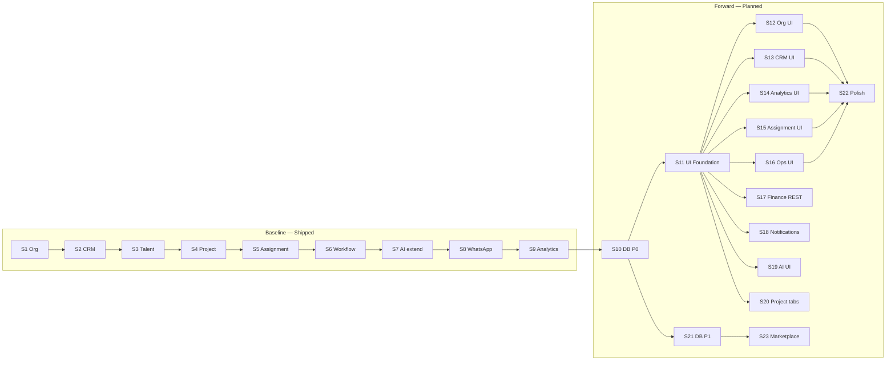

# Talent OS — Implementation Sprints

**Document version:** 1.0.0  
**Date:** August 2, 2026  
**Status:** Draft — awaiting approval  
**Scope:** Sprint plan derived from approved architecture documentation  
**Action:** Planning only — **no implementation until this document is approved**

---

## Source documents

| Document | Path | Role in this plan |
|----------|------|-------------------|
| Domain model | `docs/Architecture/DOMAIN_MODEL.md` | Aggregate boundaries, invariants |
| Context map | `docs/Architecture/CONTEXT_MAP.md` | Integration patterns, ACL |
| Event catalog | `docs/Architecture/EVENT_CATALOG.md` | Domain events per sprint |
| Ubiquitous language | `docs/Architecture/UBIQUITOUS_LANGUAGE.md` | Terminology consistency |
| Bounded context specs | `docs/Architecture/specs/*_SPEC.md` | Per-context requirements |
| API specification | `docs/Architecture/API_SPECIFICATION.md` | REST contracts |
| Database alignment report | `docs/Architecture/DATABASE_ALIGNMENT_REPORT.md` | Migration priorities P0–P3 |
| UI architecture | `docs/Architecture/UI_ARCHITECTURE.md` | Frontend phases F1–F6 |
| Module architecture docs | `docs/Architecture/*_MODULE.md` | Shipped backend reference |

---

## Sprint principles

### Independent deployability

Every sprint in this plan **must ship to production without requiring a subsequent sprint**. Each sprint satisfies at least one of:

| Pattern | Example |
|---------|---------|
| **Backend-only** | Migration + validation; no UI dependency |
| **UI-only** | Consumes existing REST APIs; no schema change |
| **Additive API** | New routes; legacy Server Actions remain until migrated |
| **Feature-flagged** | New UI behind flag; default path unchanged |
| **Backward compatible migration** | CHECK constraints and indexes only; no breaking column drops |

### Sizing legend (effort)

Relative scope — **not calendar estimates**:

| Size | Meaning |
|------|---------|
| **XS** | Single concern; ≤5 files; no migration |
| **S** | One bounded context surface; ≤15 files |
| **M** | Full module slice (API + service + tests) |
| **L** | Cross-layer (migration + backend + UI) |
| **XL** | Multiple contexts or net-new product surface |

### Migration numbering

| Range | Status |
|-------|--------|
| `001`–`031` | Shipped (baseline sprints 1–9) |
| `032`+ | Planned in this document |

---

## Sprint dependency overview



**Note:** Sprints 12–20 share only the S11 foundation dependency; they may run in parallel after S11 ships.

---

# Part A — Completed baseline (Sprints 1–9)

Backend module stack shipped via migrations `023`–`031`. UI for these contexts remains partial (see `UI_ARCHITECTURE.md`).

---

## Sprint 1 — Organization Management Module

| Field | Detail |
|-------|--------|
| **Business Goal** | Tenant org structure, membership, invitations, and audit trail as first bounded-context REST module |
| **Migration** | `023_organization_module.sql` |
| **Status** | ✅ Shipped |
| **Deliverables** | `/api/organization/*`, `OrganizationModuleService`, `ORGANIZATION_MODULE.md` |

---

## Sprint 2 — CRM & Demand Management Module

| Field | Detail |
|-------|--------|
| **Business Goal** | Sales pipeline, leads, companies, deals, contracts with CRM audit |
| **Migration** | `024_crm_module.sql` |
| **Status** | ✅ Shipped |
| **Deliverables** | `/api/crm/*`, `CrmDemandService`, `CRM_MODULE.md` |

---

## Sprint 3 — Talent Supply Management Module

| Field | Detail |
|-------|--------|
| **Business Goal** | Freelancer roster CRUD, import, match, completeness, audit |
| **Migration** | `025_talent_module.sql` |
| **Status** | ✅ Shipped |
| **Deliverables** | `/api/talent/*`, `TalentModuleService`, talent UI (roster) ✅ |

---

## Sprint 4 — Project Delivery Management Module

| Field | Detail |
|-------|--------|
| **Business Goal** | Project lifecycle, milestones, deliverables, tasks, health scoring |
| **Migration** | `026_project_module.sql` |
| **Status** | ✅ Shipped |
| **Deliverables** | `/api/projects/*`, `ProjectModuleService`, project list/detail UI ✅ |

---

## Sprint 5 — Resource Assignment Module

| Field | Detail |
|-------|--------|
| **Business Goal** | Allocations, capacity, conflict detection, suggestions |
| **Migration** | `027_assignment_module.sql` |
| **Status** | ✅ Shipped |
| **Deliverables** | `/api/assignments/*`, `AssignmentModuleService`, `ASSIGNMENT_MODULE.md` |

---

## Sprint 6 — Workflow Orchestration Module

| Field | Detail |
|-------|--------|
| **Business Goal** | Workflow definitions, runs, jobs, compensations, approvals, observability |
| **Migration** | `028_workflow_engine_module.sql` |
| **Status** | ✅ Shipped |
| **Deliverables** | `/api/workflows/*`, `WorkflowEngineModuleService`, `WORKFLOW_ENGINE.md` |

---

## Sprint 7 — AI Requests Schema Extension

| Field | Detail |
|-------|--------|
| **Business Goal** | Unified AI ledger fields, cost/token tracking, agent tagging |
| **Migration** | `029_ai_requests_extend.sql` |
| **Status** | ✅ Shipped |
| **Deliverables** | Extended `ai_requests`, AI gateway hardening (Phase B roadmap T-06–T-11) |

---

## Sprint 8 — WhatsApp Platform Module

| Field | Detail |
|-------|--------|
| **Business Goal** | Inbound channel, conversations, approval gates, observability |
| **Migration** | `030_whatsapp_platform_module.sql` |
| **Status** | ✅ Shipped |
| **Deliverables** | `/api/whatsapp/*`, `WhatsAppPlatformModuleService`, `WHATSAPP_PLATFORM.md` |

---

## Sprint 9 — Analytics & Reporting Module

| Field | Detail |
|-------|--------|
| **Business Goal** | Eight manager dashboards, caching, CSV/JSON exports |
| **Migration** | `031_analytics_module.sql` |
| **Status** | ✅ Shipped |
| **Deliverables** | `/api/analytics/*`, `AnalyticsModuleService`, `ANALYTICS_MODULE.md` |

---

# Part B — Forward sprints (Sprints 10–23)

Each sprint below uses the full template. All are **independently deployable**.

---

## Sprint 10 — Database Integrity (P0)

### Business Goal

Enforce critical domain invariants at the database layer before tenant scale. Eliminates orphan WhatsApp messages, ambiguous allocations, and invite re-use bugs documented in `DATABASE_ALIGNMENT_REPORT.md` §9 P0.

### Deployability

Migration-only sprint. Application validation updates are backward compatible. No UI required. Safe to deploy during maintenance window.

### Files to modify

| Area | Paths |
|------|-------|
| Migration | `supabase/migrations/032_db_integrity_p0.sql` |
| Assignment validation | `modules/assignment/validation.ts` |
| WhatsApp validation | `modules/whatsapp-platform/validation.ts` |
| Organization validation | `modules/organization/validation.ts` |
| Repositories | `lib/repositories/assignment*.repository.ts`, `lib/repositories/whatsapp*.repository.ts` |
| DB types | `modules/core/types/database.ts` |
| Integration tests | `tests/integration/rls.test.ts`, new `tests/integration/db-integrity-p0.test.ts` |

### Database migrations

**`032_db_integrity_p0.sql`**

| Change | Table | Detail |
|--------|-------|--------|
| XOR CHECK | `assignment_allocations` | Exactly one of `project_id`, `opportunity_id` non-null |
| Partial unique index | `member_invites` | `(tenant_id, email) WHERE accepted_at IS NULL AND revoked_at IS NULL` |
| FK column | `whatsapp_messages` | Add `conversation_id UUID REFERENCES whatsapp_conversations(id)` |
| FK column | `whatsapp_memory_entries` | Add `conversation_id UUID REFERENCES whatsapp_conversations(id)` |
| Backfill script | `whatsapp_messages`, `whatsapp_memory_entries` | Populate `conversation_id` from `(tenant_id, phone, freelancer_id)` |
| Index | `assignment_allocations` | `idx_assignment_allocations_opportunity ON (opportunity_id) WHERE deleted_at IS NULL` |

### Backend tasks

1. Add pre-insert validation mirroring XOR CHECK in `AssignmentModuleService.createAllocation`
2. Update WhatsApp inbound handler to set `conversation_id` on message insert
3. Update memory write path to scope by `conversation_id`
4. Adjust invite creation to handle partial unique index (revoke-then-reinvite flow)
5. Regenerate Supabase types

### Frontend tasks

None required. Optional: surface clearer error when allocation target missing (existing forms).

### Tests

| Type | Scope |
|------|-------|
| Integration | XOR constraint rejects both-null and both-set allocations |
| Integration | Pending invite uniqueness; re-invite after revoke succeeds |
| Integration | WhatsApp message insert requires valid `conversation_id` |
| Unit | Assignment validation schema rejects invalid target pairs |
| RLS | Existing tenant isolation tests pass post-migration |

### Documentation

| Doc | Update |
|-----|--------|
| `DATABASE_ALIGNMENT_REPORT.md` | Mark P0 items resolved |
| `WHATSAPP_PLATFORM.md` | Document conversation FK chain |
| `ASSIGNMENT_MODULE.md` | Document allocation target invariant |

### Acceptance Criteria

- [ ] Migration `032` applies cleanly on fresh and existing databases
- [ ] Backfill completes with zero orphan messages (or documented exceptions quarantined)
- [ ] `POST /api/assignments` returns `VALIDATION_ERROR` for invalid target pairs
- [ ] Re-inviting revoked email succeeds without manual row deletion
- [ ] CI green including new integration tests

### Estimated effort

**M** — one migration file, three service touchpoints, integration test suite

### Risks

| Risk | Mitigation |
|------|------------|
| Backfill fails on ambiguous phone/conversation pairs | Pre-migration audit query; manual resolution script |
| XOR CHECK blocks legacy rows | Pre-flight `SELECT` report; fix data before constraint |
| Downtime on large `whatsapp_messages` | Run backfill in batches; add column nullable first, then NOT NULL |

### Deliverables

- Migration `032_db_integrity_p0.sql`
- Updated validation and repository layers
- Integration test suite
- Updated architecture docs (P0 closure)

---

## Sprint 11 — UI Foundation (Phase F1)

### Business Goal

Establish shared UX primitives and navigation shell so all subsequent UI sprints share consistent patterns per `UI_ARCHITECTURE.md` §17 F1.

### Deployability

Pure frontend/infrastructure sprint. No schema changes. Existing pages gain loading/error boundaries and improved layout without breaking routes.

### Files to modify

| Area | Paths |
|------|-------|
| Shared components | `modules/core/components/shared/data-table.tsx` (new) |
| | `modules/core/components/shared/filter-bar.tsx` (new) |
| | `modules/core/components/shared/pagination.tsx` (new) |
| | `modules/core/components/shared/empty-state.tsx` (extend) |
| | `modules/core/components/navigation/breadcrumb-nav.tsx` (new) |
| | `modules/core/components/navigation/nav-config.ts` (new) |
| Layout | `modules/core/components/layout/sidebar.tsx` |
| | `modules/core/components/layout/header.tsx` |
| | `app/(dashboard)/layout.tsx` |
| Loading/error | `app/(dashboard)/loading.tsx`, `error.tsx` (new) |
| API client | `lib/api/client.ts` (extend `TalentOsClient`) |
| Hooks | `modules/core/hooks/use-permissions.ts`, `use-tenant.ts` |
| Constants | `modules/core/utils/constants.ts` |
| Styling | `tailwind.config.ts` (if chart/theme tokens needed) |

### Database migrations

None.

### Backend tasks

1. Extend `TalentOsClient` with typed error handling (`TalentOsApiError` → UI messages per `UI_ARCHITECTURE.md` §15)
2. Add server-side helper for nav permission filtering (reuse `permissions.ts`)
3. Optional: expose nav metadata endpoint (defer if config file sufficient)

### Frontend tasks

1. Implement `DataTable`, `FilterBar`, `Pagination` with Radix/shadcn patterns
2. Restructure sidebar to grouped navigation (collapsible sections, role-filtered)
3. Add `BreadcrumbNav` to dashboard layout
4. Add route-level `loading.tsx` and `error.tsx` with retry
5. Wire toast notifications for API errors (sonner or existing pattern)
6. Add `PageHeader` composition pattern to 2–3 existing pages as reference implementations

### Tests

| Type | Scope |
|------|-------|
| Unit | `DataTable` sorting/filtering props |
| Unit | Nav config role filtering |
| E2E | Sidebar renders correct items per role (extend `tests/e2e/critical-workflows.spec.ts`) |
| Visual | Storybook optional — not required for acceptance |

### Documentation

| Doc | Update |
|-----|--------|
| `UI_ARCHITECTURE.md` | Mark F1 components ✅ |
| `docs/Architecture/IMPLEMENTATION_SPRINTS.md` | Sprint 11 completion notes |

### Acceptance Criteria

- [ ] All dashboard routes have loading and error boundaries
- [ ] Sidebar shows grouped navigation filtered by role
- [ ] `DataTable` + `FilterBar` + `Pagination` used on at least one existing page (e.g. `/talent`)
- [ ] API errors display user-friendly messages per error code table
- [ ] No regression on existing 20 dashboard routes

### Estimated effort

**L** — shared component library + layout refactor

### Risks

| Risk | Mitigation |
|------|------------|
| Sidebar refactor breaks deep links | Keep existing hrefs; add new routes alongside |
| DataTable over-abstraction | Start with talent roster; iterate before CRM Kanban |

### Deliverables

- Shared UI component kit in `modules/core/components/shared/`
- Grouped sidebar navigation
- Extended `TalentOsClient`
- Reference page migration (talent roster)

---

## Sprint 12 — Organization & Settings UI (Phase F5)

### Business Goal

Replace placeholder settings with full organization management UI: departments, teams, members, invitations, branding, subscription read-only view.

### Deployability

UI-only sprint consuming existing `/api/organization/*`. Legacy `/settings/team` remains until cutover; new routes additive.

### Files to modify

| Area | Paths |
|------|-------|
| Pages | `app/(dashboard)/organization/page.tsx` (new) |
| | `app/(dashboard)/organization/departments/page.tsx` (new) |
| | `app/(dashboard)/organization/teams/page.tsx` (new) |
| | `app/(dashboard)/organization/members/page.tsx` (new) |
| | `app/(dashboard)/organization/invitations/page.tsx` (new) |
| | `app/(dashboard)/settings/page.tsx`, `settings/billing/page.tsx` |
| Components | `modules/organization/components/` (new directory) |
| Hooks | `modules/organization/hooks/use-organization.ts` (new) |
| Nav | `modules/core/components/navigation/nav-config.ts` |
| Permissions | `modules/core/services/permissions.ts` (verify org permissions) |

### Database migrations

None.

### Backend tasks

None required (APIs shipped Sprint 1). Optional: deprecate `/api/team/members` redirect.

### Frontend tasks

1. Organization overview dashboard (member count, pending invites, departments)
2. CRUD pages for departments and teams with member assignment
3. Member list with role change and deactivation
4. Invitation flow (create, revoke, resend) using `/api/organization/invitations`
5. Branding form (`PATCH /api/organization/branding`)
6. Billing page read-only subscription info (`GET /api/organization/subscription`)
7. Audit log viewer (`GET /api/organization/audit-logs`) — admin only

### Tests

| Type | Scope |
|------|-------|
| Integration | Organization API smoke (existing) |
| E2E | Admin invites member; member accepts via `/invite/[token]` |
| Unit | Organization form validation |

### Documentation

| Doc | Update |
|-----|--------|
| `UI_ARCHITECTURE.md` | Mark Organization routes ✅ |
| `ORGANIZATION_MODULE.md` | UI file map appendix |

### Acceptance Criteria

- [ ] Admin can manage departments, teams, members without Server Actions
- [ ] Invitation create/revoke works via REST
- [ ] Branding updates reflect on next page load
- [ ] Non-admin roles cannot access organization admin pages
- [ ] Breadcrumbs on all organization sub-pages

### Estimated effort

**L** — 6+ pages, forms, tables

### Risks

| Risk | Mitigation |
|------|------------|
| Duplicate settings/team vs organization | Redirect legacy routes; update sidebar once |
| Invite partial unique index (Sprint 10) | Handle `VALIDATION_ERROR` for duplicate pending invite |

### Deliverables

- `/organization/*` route tree
- `modules/organization/components/` library
- Updated navigation and settings hub

---

## Sprint 13 — CRM Sales UI (Phase F2)

### Business Goal

Deliver demand-side sales tooling: pipeline Kanban, leads, companies, deals, contracts — the primary gap vs backend CRM module (Sprint 2).

### Deployability

UI-only sprint. Uses `/api/crm/*`. Legacy `/opportunities` routes remain for demand workflows.

### Files to modify

| Area | Paths |
|------|-------|
| Pages | `app/(dashboard)/crm/leads/page.tsx`, `leads/new`, `leads/[id]` (new) |
| | `app/(dashboard)/crm/pipeline/page.tsx` (new) |
| | `app/(dashboard)/crm/companies/page.tsx`, `companies/[id]` (new) |
| | `app/(dashboard)/crm/deals/[id]/page.tsx` (new) |
| | `app/(dashboard)/crm/contracts/page.tsx` (new) |
| Components | `modules/crm/components/` (new): `PipelineBoard`, `LeadForm`, `CompanyDetail` |
| Hooks | `modules/crm/hooks/use-crm.ts` (new) |
| Legacy | `app/actions/companies.ts` (mark deprecated, no removal) |

### Database migrations

None.

### Backend tasks

None required. Optional: add `GET /api/crm/deals/{id}` if detail endpoint missing.

### Frontend tasks

1. Pipeline Kanban board with drag-and-drop stage transitions (`PATCH /api/crm/deals/{id}/stage`)
2. Lead list, create, detail with convert action (`POST /api/crm/leads/{id}/convert`)
3. Company list and detail (contacts, linked deals, opportunities)
4. Deal detail view with activity timeline
5. Contracts list with status filters
6. Shared CRM filter bar (owner, stage, date range)

### Tests

| Type | Scope |
|------|-------|
| Integration | CRM module tests (existing) |
| E2E | Lead → convert → deal appears on pipeline |
| Unit | Pipeline stage transition validation |

### Documentation

| Doc | Update |
|-----|--------|
| `UI_ARCHITECTURE.md` | Mark CRM routes ✅ |
| `CRM_MODULE.md` | UI appendix |

### Acceptance Criteria

- [x] Manager can move deals across pipeline stages
- [x] Lead conversion creates company/contact/deal per API contract
- [x] Company detail shows linked opportunities and CRM entities
- [x] All CRM pages use `TalentOsClient`, not Server Actions
- [x] Role gating: `talent_manager` and `admin` only

### Estimated effort

**XL** — Kanban + 8 routes; largest UI sprint

### Risks

| Risk | Mitigation |
|------|------------|
| Bidirectional deal↔opportunity inconsistency | Read-only opportunity link on deal detail; mutations via API only |
| Optimistic Kanban conflicts | Defer optimistic updates to Sprint 22; use refresh on success |

### Deliverables

- Full `/crm/*` route tree
- `PipelineBoard` component
- CRM hooks and module components

---

## Sprint 14 — Analytics UI (Phase F3)

### Business Goal

Replace analytics placeholder with eight dashboard views, Recharts visualizations, period filters, and export downloads per `ANALYTICS_MODULE.md`.

### Deployability

UI-only sprint. All data via `/api/analytics/*` (Sprint 9). Hub page links to sub-dashboards; legacy `/analytics` card replaced incrementally.

### Files to modify

| Area | Paths |
|------|-------|
| Pages | `app/(dashboard)/analytics/page.tsx` (hub) |
| | `app/(dashboard)/analytics/summary/page.tsx` |
| | `app/(dashboard)/analytics/organizations/page.tsx` |
| | `app/(dashboard)/analytics/projects/page.tsx` |
| | `app/(dashboard)/analytics/talent/page.tsx` |
| | `app/(dashboard)/analytics/utilization/page.tsx` |
| | `app/(dashboard)/analytics/revenue/page.tsx` |
| | `app/(dashboard)/analytics/delivery/page.tsx` |
| | `app/(dashboard)/analytics/ai-usage/page.tsx` |
| | `app/(dashboard)/analytics/workflows/page.tsx` |
| Components | `modules/analytics/components/` (new): `DashboardShell`, `ChartCard`, `ExportButton` |
| Charts | `modules/analytics/charts.ts` (extend with Recharts component mappings) |
| Hooks | `modules/analytics/hooks/use-analytics-dashboard.ts` (new) |

### Database migrations

None.

### Backend tasks

None required. Verify export download content-type headers.

### Frontend tasks

1. `DashboardShell` with period selector (`7d`, `30d`, `90d`, `ytd`, custom)
2. Map `charts` payload keys to Recharts (bar, line, pie per `charts.ts`)
3. Summary KPI cards from `summary` object
4. Export flow: `POST /api/analytics/exports` → poll/list → download
5. Cache indicator (`cachedAt`, refresh button with `?refresh=true`)
6. Hub page with dashboard cards and deep links

### Tests

| Type | Scope |
|------|-------|
| Unit | Chart data transformer functions |
| Unit | Analytics module service (existing) |
| E2E | Manager views revenue dashboard; creates CSV export |

### Documentation

| Doc | Update |
|-----|--------|
| `ANALYTICS_MODULE.md` | UI file map |
| `UI_ARCHITECTURE.md` | Mark analytics routes ✅ |

### Acceptance Criteria

- [x] All 8 dashboards render with real API data
- [x] Period filter changes query params and refreshes charts
- [x] CSV/JSON export downloads successfully
- [x] `admin` and `talent_manager` access only
- [x] Loading skeletons during fetch

### Estimated effort

**L** — 9 pages but shared shell reduces duplication

### Risks

| Risk | Mitigation |
|------|------------|
| Slow RPC on large tenants | Show cache TTL; refresh button; Sprint 21 indexes |
| Chart library bundle size | Dynamic import Recharts per dashboard |

### Deliverables

- Analytics dashboard route tree
- Recharts component library
- Export UX flow

---

## Sprint 15 — Assignment Planning UI (Phase F4 partial)

### Business Goal

Give talent managers visibility into allocations, capacity, and conflicts — closing the gap between Assignment API (Sprint 5) and planning workflows.

### Deployability

UI-only sprint. Uses `/api/assignments/*`. Does not require CRM or project UI changes.

### Files to modify

| Area | Paths |
|------|-------|
| Pages | `app/(dashboard)/assignments/page.tsx`, `new`, `[id]` (new) |
| | `app/(dashboard)/assignments/capacity/page.tsx` (new) |
| | `app/(dashboard)/assignments/conflicts/page.tsx` (new) |
| Components | `modules/assignment/components/` (new): `AllocationForm`, `CapacityGrid`, `ConflictList` |
| Hooks | `modules/assignment/hooks/use-assignments.ts` (new) |
| Project detail | `app/(dashboard)/projects/[id]/page.tsx` (add assignment summary panel — read-only) |

### Database migrations

None (Sprint 10 XOR CHECK recommended first but not blocking UI).

### Backend tasks

None required.

### Frontend tasks

1. Allocation list with filters (freelancer, project, status, date range)
2. Create allocation form with pre-flight conflict check (`POST /api/assignments/conflicts/check`)
3. Allocation detail: schedules, requirements, history tabs
4. Capacity planner grid by freelancer/week
5. Conflict inbox with resolve action
6. Suggest talent panel (`POST /api/assignments/suggest`) on create form
7. Read-only assignment summary on project detail page

### Tests

| Type | Scope |
|------|-------|
| Integration | Assignment module (existing) |
| E2E | Create allocation → conflict detected → resolve → success |
| Unit | Conflict check form validation |

### Documentation

| Doc | Update |
|-----|--------|
| `ASSIGNMENT_MODULE.md` | UI appendix |
| `UI_ARCHITECTURE.md` | Mark assignment routes ✅ |

### Acceptance Criteria

- [x] Manager creates allocation with conflict pre-check
- [x] Open conflicts visible and resolvable from UI
- [x] Capacity view shows weekly hours and concurrent limits
- [x] Suggest returns ranked freelancers on create form
- [x] Freelancer role cannot access assignment management pages

### Estimated effort

**L**

### Risks

| Risk | Mitigation |
|------|------------|
| Sprint 10 XOR not deployed | UI validates exactly one target client-side |
| Project vs allocation drift display | Show both sources with warning badge if mismatch |

### Deliverables

- `/assignments/*` route tree
- Assignment component library
- Project detail assignment panel

---

## Sprint 16 — Workflow & WhatsApp Operations UI (Phase F4)

### Business Goal

Operational visibility for workflow runs, approvals, compensations, and WhatsApp conversations — enabling managers to monitor and intervene without SQL/admin tools.

### Deployability

UI-only sprint. Two contexts but read-heavy; mutations go through existing APIs. Independent of CRM/Assignment UI.

### Files to modify

| Area | Paths |
|------|-------|
| Workflow pages | `app/(dashboard)/workflows/page.tsx`, `runs`, `runs/[id]`, `approvals`, `definitions` (new) |
| WhatsApp pages | `app/(dashboard)/whatsapp/page.tsx`, `[freelancerId]`, `approvals` (new) |
| Components | `modules/workflow-engine/components/` (new) |
| | `modules/whatsapp-platform/components/` (new) |
| Hooks | `modules/workflow-engine/hooks/use-workflows.ts` (new) |
| | `modules/whatsapp-platform/hooks/use-whatsapp.ts` (new) |

### Database migrations

None.

### Backend tasks

None required. Verify observability endpoints return UI-friendly pagination.

### Frontend tasks

1. Workflow overview: recent runs, failure rate, dead-letter count
2. Run list with status filters; run detail with execution history
3. Approval inbox (`GET /api/workflows/approvals`) with approve/reject actions
4. Definitions catalog (read-only builtin + custom list)
5. WhatsApp conversation list with last message preview
6. Conversation detail: message thread, memory entries, audit log
7. WhatsApp approval gate resolution UI

### Tests

| Type | Scope |
|------|-------|
| Integration | Workflow + WhatsApp module tests (existing) |
| E2E | Manager approves workflow step from inbox |
| Unit | Approval action error handling |

### Documentation

| Doc | Update |
|-----|--------|
| `WORKFLOW_ENGINE.md`, `WHATSAPP_PLATFORM.md` | UI appendices |
| `UI_ARCHITECTURE.md` | Mark operations routes ✅ |

### Acceptance Criteria

- [x] Manager views workflow run history and retries failed jobs (where permitted)
- [x] Approval inbox processes pending requests
- [x] WhatsApp conversations browsable by freelancer
- [x] WhatsApp approval gates resolvable from UI
- [x] Admin/manager role gating enforced

### Estimated effort

**L**

### Risks

| Risk | Mitigation |
|------|------------|
| Sprint 10 conversation FK not deployed | UI links via freelancer+phone fallback |
| Real-time message updates | Polling interval; WebSocket deferred |

### Deliverables

- `/workflows/*` and `/whatsapp/*` route trees
- Operations component libraries
- Approval inbox UX

---

## Sprint 17 — Finance REST Module & UI Migration

### Business Goal

Introduce `/api/finance/*` REST surface per `API_SPECIFICATION.md` §7 and `FINANCE_SPEC.md`, replacing Server Actions for payment approve/mark-paid flows.

### Deployability

Additive API sprint. Legacy `app/actions/payments.ts` remains until UI cutover within same sprint. Migration adds audit table only — no breaking changes to `payments`.

### Files to modify

| Area | Paths |
|------|-------|
| Migration | `supabase/migrations/033_finance_module.sql` |
| Module | `modules/finance/types.ts`, `validation.ts`, `index.ts` (new) |
| Service | `lib/services/finance-module.service.ts` (new) |
| Repository | `lib/repositories/finance.repository.ts` (extend) |
| Routes | `app/api/finance/payments/route.ts`, `payments/[id]/route.ts`, `payments/[id]/approve/route.ts`, `payments/[id]/mark-paid/route.ts` (new) |
| Legacy | `lib/services/finance.service.ts` (delegate to module service) |
| UI | `app/(dashboard)/payments/page.tsx` (migrate to REST) |
| Actions | `app/actions/payments.ts` (deprecate) |
| Permissions | `modules/core/services/permissions.ts` |
| OpenAPI | `docs/openapi.yaml` |
| MCP | `lib/mcp/servers/finance.server.ts` (wire to module service) |

### Database migrations

**`033_finance_module.sql`**

| Change | Detail |
|--------|--------|
| New table | `finance_audit_logs` (immutable payment mutation trail) |
| Index | `(tenant_id, payment_id, created_at DESC)` on audit logs |
| Trigger | Audit insert on payment status change (optional; service-layer audit acceptable) |

### Backend tasks

1. Create `modules/finance/` with Zod schemas matching API spec
2. Implement `FinanceModuleService`: list, get, approve, markPaid
3. REST routes with standard envelope and permission guards
4. Emit `finance.payment.approved`, `finance.payment.paid` events (namespaced)
5. Delegate legacy `FinanceService` to module service
6. Update OpenAPI spec and `/api/openapi` route

### Frontend tasks

1. Migrate payments page to `TalentOsClient` finance methods
2. Payment detail drawer/modal with status timeline
3. Approve and mark-paid forms with validation feedback
4. Role-based views: manager approve, admin mark-paid, freelancer read-only

### Tests

| Type | Scope |
|------|-------|
| Unit | `finance-module.service.test.ts` — approve/mark-paid state machine |
| Integration | REST route auth and validation |
| Unit | Existing `finance.service.test.ts` updated |

### Documentation

| Doc | Update |
|-----|--------|
| `FINANCE_SPEC.md` | Mark REST ✅ |
| `API_SPECIFICATION.md` | Finance status → Implemented |
| New | `docs/Architecture/FINANCE_MODULE.md` |

### Acceptance Criteria

- [x] All four finance REST endpoints operational
- [x] Payments UI uses REST exclusively
- [x] Invalid state transitions return `VALIDATION_ERROR`
- [x] `finance_audit_logs` records approve/mark-paid mutations
- [x] MCP finance server reads via module service

### Estimated effort

**L**

### Risks

| Risk | Mitigation |
|------|------------|
| Permission name drift (`payments:*` vs `finance:*`) | Alias permissions in `permissions.ts` |
| Duplicate audit with `activity_logs` | Document dual stream; consolidate in Sprint 24 |

### Deliverables

- Migration `033_finance_module.sql`
- `/api/finance/*` routes
- Migrated payments UI
- `FINANCE_MODULE.md`

---

## Sprint 18 — Notifications REST & Preferences

### Business Goal

Expose notifications via REST per `API_SPECIFICATION.md` §13 and add per-user channel preferences per `NOTIFICATIONS_SPEC.md` future enhancement.

### Deployability

Additive API + optional preferences table. Existing notifications page enhanced; workflow `notify` action unchanged.

### Files to modify

| Area | Paths |
|------|-------|
| Migration | `supabase/migrations/034_notifications_module.sql` |
| Module | `modules/notifications/types.ts`, `validation.ts`, `index.ts` (new) |
| Service | `lib/services/notification-module.service.ts` (new) |
| Repository | `lib/repositories/notification.repository.ts` |
| Routes | `app/api/notifications/route.ts`, `notifications/[id]/read/route.ts`, `notifications/read-all/route.ts` (new) |
| UI | `app/(dashboard)/notifications/page.tsx` |
| Header | `modules/core/components/layout/header.tsx` (unread badge) |
| Legacy | `lib/services/notification.service.ts` (delegate) |

### Database migrations

**`034_notifications_module.sql`**

| Change | Detail |
|--------|--------|
| New table | `notification_preferences` (`user_id`, `tenant_id`, `category`, `channel`, `enabled`) |
| Index | `(tenant_id, user_id, created_at DESC)` on `notifications` (P1 from alignment report) |
| Default rows | Seed preferences on user tenant join (trigger or app logic) |

### Backend tasks

1. REST list with pagination and `unread_only` filter
2. Mark read (single) and read-all endpoints
3. Preferences CRUD (internal or `GET/PATCH /api/notifications/preferences`)
4. Delegate existing `NotificationService` callers to module service
5. Instrumentation via existing `instrumentNotification()`

### Frontend tasks

1. Notifications list with unread filter and infinite scroll/pagination
2. Mark read on click; mark all read action
3. Header bell with unread count badge
4. Preferences panel in settings (category toggles)

### Tests

| Type | Scope |
|------|-------|
| Unit | Notification module service |
| Integration | REST auth — users see only own notifications |
| E2E | Workflow-triggered notification appears in inbox |

### Documentation

| Doc | Update |
|-----|--------|
| `NOTIFICATIONS_SPEC.md` | Mark REST ✅; preferences table |
| `API_SPECIFICATION.md` | Notifications status → Implemented |

### Acceptance Criteria

- [x] Users list and mark notifications via REST
- [x] Header badge reflects unread count
- [x] Preferences disable categories without breaking creation
- [x] RLS prevents cross-user notification access
- [x] Existing workflow notify steps still create notifications

### Estimated effort

**M**

### Risks

| Risk | Mitigation |
|------|------------|
| Unread count performance | Index from migration; count query with limit |
| Preference schema churn | Start with category enum from spec; extensible JSON column |

### Deliverables

- Migration `034_notifications_module.sql`
- `/api/notifications/*` routes
- Enhanced notifications UI + header badge

---

## Sprint 19 — AI, Knowledge & Agent UI Surfaces

### Business Goal

Expose AI matching, knowledge base, and agent chat in the operations console per `AI_SPEC.md` and `UI_ARCHITECTURE.md` §16.

### Deployability

UI-only sprint. Uses existing `/api/ai/*`, knowledge routes, and agent endpoints. No schema changes.

### Files to modify

| Area | Paths |
|------|-------|
| Pages | `app/(dashboard)/ai/agents/page.tsx`, `ai/agents/[agentId]/page.tsx` (new) |
| | `app/(dashboard)/knowledge/page.tsx`, `knowledge/[id]/page.tsx` (new) |
| | `app/(dashboard)/settings/agents/page.tsx` (new or extend integrations) |
| Components | `components/ai/` (extend), `modules/agents/components/` (new) |
| Hooks | `modules/agents/hooks/use-agent-session.ts` (new) |
| Talent | `app/(dashboard)/talent/[id]/page.tsx` (AI match panel) |
| Opportunities | `app/(dashboard)/opportunities/[id]/page.tsx` (semantic match CTA) |

### Database migrations

None.

### Backend tasks

Optional: consolidate agent settings under `/api/ai/agents/settings` if not routed.

### Frontend tasks

1. Agent launcher grid with enabled agents per tenant
2. Agent chat session UI with message history
3. Knowledge entry list with search and create/edit
4. AI match panel on opportunity detail (`GET /api/ai/match/{opportunityId}`)
5. Agent settings page (budget, enabled tools) for admin
6. Feature-disabled banner when `AI_MATCHING_DISABLED`

### Tests

| Type | Scope |
|------|-------|
| Unit | AI mock provider tests (existing) |
| E2E | Manager runs talent match on opportunity |
| Integration | AI phase B tests (existing) |

### Documentation

| Doc | Update |
|-----|--------|
| `UI_ARCHITECTURE.md` | Mark AI/knowledge routes ✅ |
| `AI_SPEC.md` | UI appendix |

### Acceptance Criteria

- [x] Admin configures agent settings from UI
- [x] Manager launches agent session and receives responses
- [x] Knowledge entries searchable and editable
- [x] Opportunity match returns ranked freelancers
- [x] AI disabled state handled gracefully

### Estimated effort

**L**

### Risks

| Risk | Mitigation |
|------|------------|
| Streaming responses | Start with request/response; streaming in polish sprint |
| Agent cost visibility | Link to analytics AI usage dashboard |

### Deliverables

- `/ai/*` and `/knowledge/*` routes
- Agent chat and knowledge management UI
- Match integration on opportunities

---

## Sprint 20 — Project Delivery Tabs

### Business Goal

Complete project detail UX with tasks, deliverables, timeline, and templates per `PROJECT_SPEC.md` and existing `/api/projects/{id}/*` sub-resources.

### Deployability

UI-only sprint extending existing `/projects/[id]` page. Additive tabs; tracker view remains default.

### Files to modify

| Area | Paths |
|------|-------|
| Pages | `app/(dashboard)/projects/[id]/tasks/page.tsx` (new) |
| | `app/(dashboard)/projects/[id]/deliverables/page.tsx` (new) |
| | `app/(dashboard)/projects/[id]/timeline/page.tsx` (new) |
| | `app/(dashboard)/projects/templates/page.tsx` (new) |
| Components | `components/projects/` (extend): `TaskBoard`, `DeliverableList`, `TimelineFeed` |
| Layout | `app/(dashboard)/projects/[id]/layout.tsx` (tab navigation) |

### Database migrations

None.

### Backend tasks

None required (sub-resource APIs shipped Sprint 4).

### Frontend tasks

1. Project detail tab layout (Overview, Tasks, Deliverables, Timeline, Milestones)
2. Task board with status columns (`GET/POST /api/projects/{id}/tasks`)
3. Deliverable list with submission status (`/deliverables`)
4. Timeline activity feed (`/timeline`)
5. Template library with apply action (`/api/projects/templates`)
6. Health badge and status transition from project API

### Tests

| Type | Scope |
|------|-------|
| Integration | Project module tests (existing) |
| E2E | Manager creates task; freelancer views on project |
| Unit | Tab navigation active state |

### Documentation

| Doc | Update |
|-----|--------|
| `PROJECT_MODULE.md` | UI appendix |
| `UI_ARCHITECTURE.md` | Mark project sub-routes ✅ |

### Acceptance Criteria

- [x] All project sub-tabs load data from REST APIs
- [x] Tasks creatable and status-updatable from UI
- [x] Deliverables show submission workflow state
- [x] Template apply creates project from template
- [x] Freelancer sees read-only appropriate tabs

### Estimated effort

**L**

### Risks

| Risk | Mitigation |
|------|------------|
| Tab route complexity | Shared `[id]/layout.tsx` with parallel routes |
| Deliverable versioning (roadmap T-20) | Display current version; versioning separate sprint if needed |

### Deliverables

- Project tab route tree
- Task, deliverable, timeline components
- Template library page

---

## Sprint 21 — Database Performance (P1)

### Business Goal

Add indexes and optional analytics snapshot infrastructure before 10k+ rows per tenant per `DATABASE_ALIGNMENT_REPORT.md` §9 P1.

### Deployability

Migration-only sprint. Indexes are online-safe (`CREATE INDEX CONCURRENTLY` in production runbook). No application breaking changes.

### Files to modify

| Area | Paths |
|------|-------|
| Migration | `supabase/migrations/035_db_performance_p1.sql` |
| Analytics | `supabase/migrations/031_analytics_module.sql` (reference only) |
| | `lib/repositories/analytics-module.repository.ts` (optional snapshot read path) |
| Cron | `app/api/cron/analytics-snapshot/route.ts` (new, optional) |
| Docs | `DATABASE_ALIGNMENT_REPORT.md` |

### Database migrations

**`035_db_performance_p1.sql`**

| Index | Table |
|-------|-------|
| `(tenant_id, status, created_at)` | `payments` |
| `(paid_at) WHERE paid_at IS NOT NULL` | `payments` |
| `(status, scheduled_at) WHERE status IN ('pending', 'failed')` | `domain_events` |
| `(tenant_id, created_at DESC)` | `whatsapp_messages` |
| `(phone, tenant_id)` | `whatsapp_messages` |
| `(freelancer_id, response) WHERE response = 'pending'` | `opportunity_recipients` |
| `(tenant_id, status) WHERE status = 'dead_letter'` | `workflow_jobs` |
| `(tenant_id, entity_type, entity_id)` | `crm_audit_logs` |
| `(tenant_id, action, created_at DESC)` | `activity_logs` |
| GIN/trigram | `companies.name`, `freelancers` full_name search |
| `(tenant_id, lower(name))` | `companies` |
| `(freelancer_id, status) WHERE deleted_at IS NULL` | `projects` |
| `(status, due_date) WHERE status NOT IN ('approved', 'canceled')` | `milestones` |

Optional: materialized view or scheduled snapshot refresh for analytics dashboards.

### Backend tasks

1. Apply all P1 indexes from alignment report §2.1–2.2
2. Optional: cron job to refresh `analytics_cache_snapshots`
3. Add query timing logs for analytics RPCs above threshold
4. Document production index creation procedure (`CONCURRENTLY`)

### Frontend tasks

None required. Analytics UI benefits automatically from faster queries.

### Tests

| Type | Scope |
|------|-------|
| Integration | Verify index existence via `pg_indexes` in test DB |
| Performance | Benchmark analytics RPC p95 before/after (manual gate) |
| Regression | Full CI suite green |

### Documentation

| Doc | Update |
|-----|--------|
| `DATABASE_ALIGNMENT_REPORT.md` | Mark P1 items resolved |
| `ANALYTICS_MODULE.md` | Snapshot cron documentation |

### Acceptance Criteria

- [x] All P1 indexes created in migration
- [x] Analytics dashboard RPCs meet target p95 (<500ms on seed data) — indexes + snapshot cache
- [x] Revenue and utilization dashboards show improved cache behavior
- [x] No query plan regressions on assignment conflict checks

### Estimated effort

**M**

### Risks

| Risk | Mitigation |
|------|------------|
| Index build locks table | Use `CONCURRENTLY` in production runbook |
| GIN index size | Monitor disk; partial indexes where possible |

### Deliverables

- Migration `035_db_performance_p1.sql`
- Optional analytics snapshot cron
- Performance baseline notes in alignment report

---

## Sprint 22 — Production Polish (Phase F6)

### Business Goal

Cross-cutting UX improvements: global search (Cmd+K), mobile navigation, optimistic Kanban, and observability dashboard for ops.

### Deployability

Polish sprint — each feature independently toggleable. No schema changes. Can ship features incrementally behind flags.

### Files to modify

| Area | Paths |
|------|-------|
| Search | `modules/core/components/navigation/command-palette.tsx` (new) |
| | `app/api/search/route.ts` (new, federated read) |
| Mobile | `modules/core/components/layout/mobile-nav.tsx` (new) |
| | `modules/core/components/layout/sidebar.tsx` |
| Kanban | `modules/crm/components/PipelineBoard.tsx` (optimistic updates) |
| Observability | `app/(dashboard)/settings/observability/page.tsx` (new) |
| | Uses existing `/api/observability/*` |
| Middleware | `middleware.ts` (search shortcut) |

### Database migrations

None.

### Backend tasks

1. Federated search endpoint (talent, projects, companies, deals — read-only, tenant-scoped)
2. Rate limit search endpoint
3. Optional: Platform feature flags REST (`/api/platform/feature-flags`) if not deferred

### Frontend tasks

1. Cmd+K command palette with recent items and entity search
2. Mobile bottom tab bar for primary destinations (< md breakpoint)
3. Optimistic drag-and-drop on CRM pipeline with rollback on error
4. Observability dashboard: logs, alerts, trace lookup
5. User menu completion (profile link, sign out)

### Tests

| Type | Scope |
|------|-------|
| E2E | Cmd+K navigates to entity |
| E2E | Mobile nav smoke on viewport |
| Unit | Search result ranking |
| Integration | Observability API smoke |

### Documentation

| Doc | Update |
|-----|--------|
| `UI_ARCHITECTURE.md` | Mark F6 ✅ |
| `PLATFORM_CORE.md` | Search and observability UI |

### Acceptance Criteria

- [x] Cmd+K finds talent, project, company by name
- [x] Mobile layout usable for core 5 destinations
- [x] Pipeline drag reverts on API failure with toast
- [x] Admin views observability dashboard
- [x] No performance regression on initial page load

### Estimated effort

**L**

### Risks

| Risk | Mitigation |
|------|------------|
| Search scope creep | Limit to 4 entity types; extensible later |
| Federated search latency | Parallel queries with 3s timeout |

### Deliverables

- Command palette + search API
- Mobile navigation
- Optimistic Kanban
- Observability settings page

---

## Sprint 23 — Domain Purity & Audit Consolidation (P2)

### Business Goal

Reduce technical debt from legacy parallel paths: audit consolidation, soft deletes on opportunities, company name uniqueness, contract signed constraint.

### Deployability

Migration sprint with backward-compatible constraints. Application changes are additive. Can deploy before or after UI sprints.

### Files to modify

| Area | Paths |
|------|-------|
| Migration | `supabase/migrations/036_db_domain_purity_p2.sql` |
| CRM | `modules/crm/validation.ts`, `lib/services/crm-demand.service.ts` |
| Project | `lib/services/project-module.service.ts` |
| Platform | `lib/services/observability.service.ts` (audit source) |
| Activity | `supabase/migrations/003_functions_triggers.sql` (deprecate writes — document only) |

### Database migrations

**`036_db_domain_purity_p2.sql`**

| Change | Detail |
|--------|--------|
| `deleted_at` | Add to `opportunities`, `opportunity_recipients` |
| Unique index | `companies (tenant_id, lower(name))` — after duplicate cleanup |
| CHECK | `crm_contracts`: `signed_at IS NOT NULL` when `status = 'signed'` |
| Documentation | Deprecation notice on `activity_logs` trigger for module-covered entities |

### Backend tasks

1. Pre-migration duplicate company name report and cleanup script
2. Update CRM/opportunity services for soft delete filters
3. Route new audit writes to module audit tables only
4. Enforce contract signed_at in validation layer

### Frontend tasks

1. Opportunity list hides soft-deleted by default
2. Company form validates duplicate name error from API

### Tests

| Type | Scope |
|------|-------|
| Integration | Soft delete filters on opportunities |
| Integration | Duplicate company name rejected |
| Integration | Contract signed constraint |

### Documentation

| Doc | Update |
|-----|--------|
| `DATABASE_ALIGNMENT_REPORT.md` | Mark P2 items resolved |
| `EVENT_CATALOG.md` | Note audit source consolidation |

### Acceptance Criteria

- [x] No duplicate company names per tenant
- [x] Soft-deleted opportunities excluded from default lists
- [x] Signed contracts require `signed_at`
- [x] Module audit tables are primary write path for new mutations

### Estimated effort

**M**

### Risks

| Risk | Mitigation |
|------|------------|
| Duplicate company names in prod | Cleanup migration script with merge strategy |
| Breaking reports counting deleted opportunities | Update analytics RPCs to filter `deleted_at` |

### Deliverables

- Migration `036_db_domain_purity_p2.sql`
- Duplicate cleanup script
- Audit write path consolidation

---

## Sprint 24 — Talent Marketplace (Deferred)

### Business Goal

Public read-only talent discovery export per `TALENT_SPEC.md` §18 and `CONTEXT_MAP.md` marketplace ACL — optional future product surface.

### Deployability

Feature-flagged (`marketplace_enabled`). Default off. No impact when disabled.

### Files to modify

| Area | Paths |
|------|-------|
| Migration | `supabase/migrations/037_talent_marketplace.sql` (optional ACL tables) |
| Module | `modules/talent/` (extend) |
| Routes | `app/api/talent/marketplace/route.ts` (new, public read) |
| Pages | `app/(public)/marketplace/page.tsx` (new) |
| Platform | Feature flag in `modules/platform/features/flags.ts` |

### Database migrations

Optional: `talent_marketplace_profiles` view or RLSrelaxed read replica table.

### Backend tasks

1. Public read API with anonymization rules
2. Export/sync job for marketplace-eligible profiles
3. ACL boundary — no write from public routes

### Frontend tasks

1. Public marketplace browse page
2. Admin toggle for profile marketplace visibility

### Tests

| Type | Scope |
|------|-------|
| Integration | Public API returns no PII beyond policy |
| RLS | Tenant data not leaked cross-tenant |
| E2E | Marketplace disabled returns 404 |

### Documentation

| Doc | Update |
|-----|--------|
| `TALENT_SPEC.md` | Marketplace implementation notes |
| `CONTEXT_MAP.md` | Marketplace ACL diagram |

### Acceptance Criteria

- [x] Feature flag off → no public routes exposed
- [x] Feature flag on → read-only profiles visible per policy
- [x] No cross-tenant data leakage
- [x] Admin controls marketplace eligibility per freelancer

### Estimated effort

**XL** — net-new product surface; defer until pilot demand validated

### Risks

| Risk | Mitigation |
|------|------------|
| PII exposure | Strict field allowlist; security review gate |
| Scope creep into transactions | Read-only MVP only |

### Deliverables

- Marketplace API and public page (flagged)
- Admin eligibility controls
- Security review checklist

---

# Part C — Sprint execution guidelines

## Branch naming

```
cursor/sprint-XX-<slug>-5fb1
```

Example: `cursor/sprint-10-db-integrity-p0-5fb1`

## PR checklist (every sprint)

- [ ] Migration applies on clean DB (`supabase db reset`)
- [ ] `pnpm lint && pnpm typecheck && pnpm test` green
- [ ] OpenAPI updated if routes added
- [ ] Architecture doc updated
- [ ] No breaking changes without migration path
- [ ] Feature flags for optional UX (Sprint 22+)

## Parallelization matrix

| After sprint | Can run in parallel |
|--------------|---------------------|
| S10 | S11 |
| S11 | S12, S13, S14, S15, S16, S17, S18, S19, S20 |
| S10 | S21, S23 (independent of UI) |
| S12–S20 | S22 (after at least CRM + analytics UI for Kanban/search) |

## Out of scope (this plan)

| Item | Reference |
|------|-----------|
| Stripe SaaS billing | `TALENT_OS_IMPLEMENTATION_ROADMAP.md` — postponed |
| SSO / MFA | Enterprise readiness — deferred |
| Multi-product registry | Explicitly removed from scope |
| Workflow platform rewrite | Use existing workflow engine module |
| Partitioning (`domain_events` by month) | P3 — after scale validation |

---

## Document status

| Item | Status |
|------|--------|
| Baseline sprints 1–9 | Documented (shipped) |
| Forward sprints 10–24 | Draft plan |
| Implementation | **None — awaiting approval** |
| Next step | Review sprint boundaries; approve or adjust priorities |

---

## Appendix — Sprint summary table

| Sprint | Name | Migration | Effort | Layer |
|--------|------|-----------|--------|-------|
| 1 | Organization module | 023 | — | Backend ✅ |
| 2 | CRM module | 024 | — | Backend ✅ |
| 3 | Talent module | 025 | — | Backend ✅ |
| 4 | Project module | 026 | — | Backend ✅ |
| 5 | Assignment module | 027 | — | Backend ✅ |
| 6 | Workflow module | 028 | — | Backend ✅ |
| 7 | AI schema extend | 029 | — | Backend ✅ |
| 8 | WhatsApp module | 030 | — | Backend ✅ |
| 9 | Analytics module | 031 | — | Backend ✅ |
| Sprint 10 | DB integrity P0 | 032 | M | DB + backend | ✅ Shipped |
| Sprint 11 | UI foundation F1 | — | L | Frontend | ✅ Shipped |
| Sprint 12 | Organization UI F5 | — | L | Frontend | ✅ Shipped |
| 13 | CRM sales UI F2 | — | XL | Frontend | ✅ Shipped |
| 14 | Analytics UI F3 | — | L | Frontend | ✅ Shipped |
| 15 | Assignment UI F4 | — | L | Frontend | ✅ Shipped |
| 16 | Workflow + WhatsApp UI | — | L | Frontend | ✅ Shipped |
| 17 | Finance REST + UI | 033 | L | Full stack | ✅ Shipped |
| 18 | Notifications REST + UI | 034 | M | Full stack | ✅ Shipped |
| 19 | AI + Knowledge UI | — | L | Frontend | ✅ Shipped |
| 20 | Project delivery tabs | — | L | Frontend | ✅ Shipped |
| 21 | DB performance P1 | 035 | M | DB + backend | ✅ Shipped |
| 22 | Production polish F6 | — | L | Frontend + API | ✅ Shipped |
| 23 | Domain purity P2 | 036 | M | DB + backend |
| 24 | Talent marketplace | 037 | XL | Full stack (deferred) |

**Awaiting approval before any implementation work begins.**
