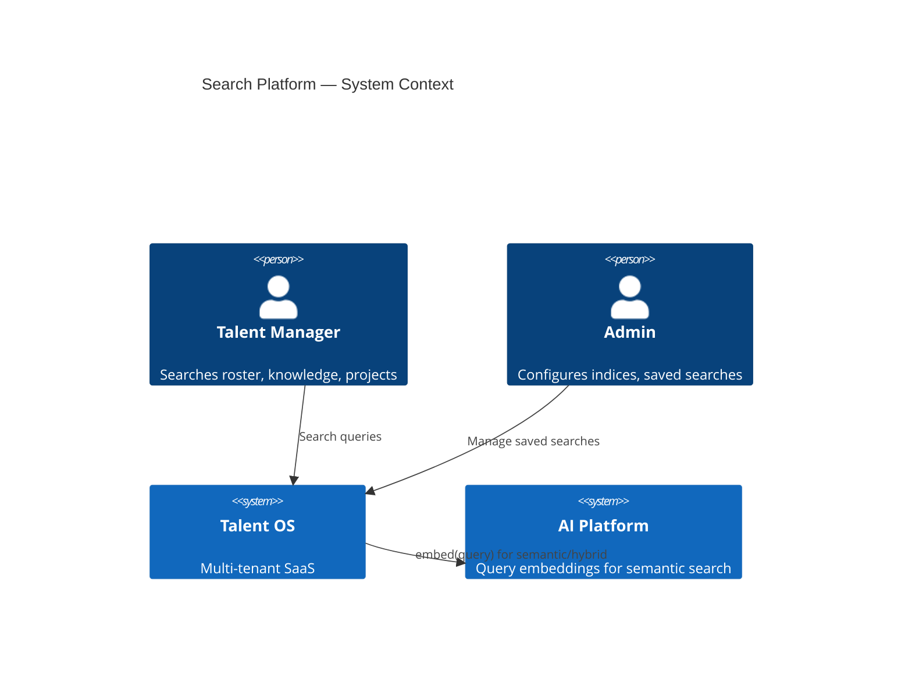
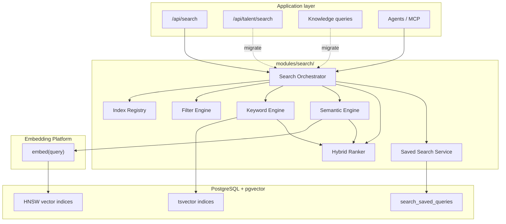
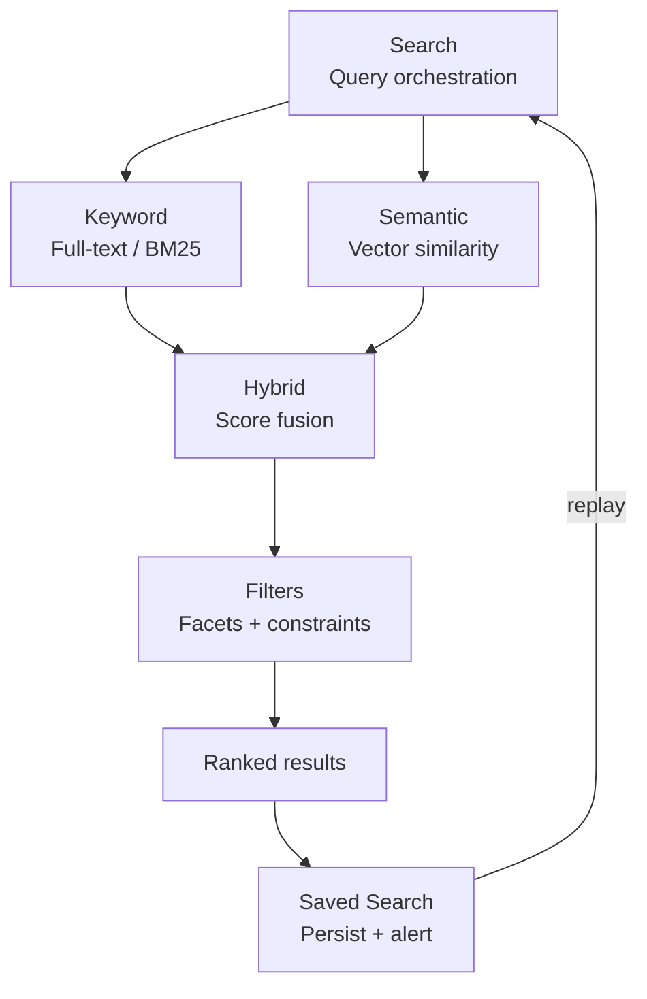
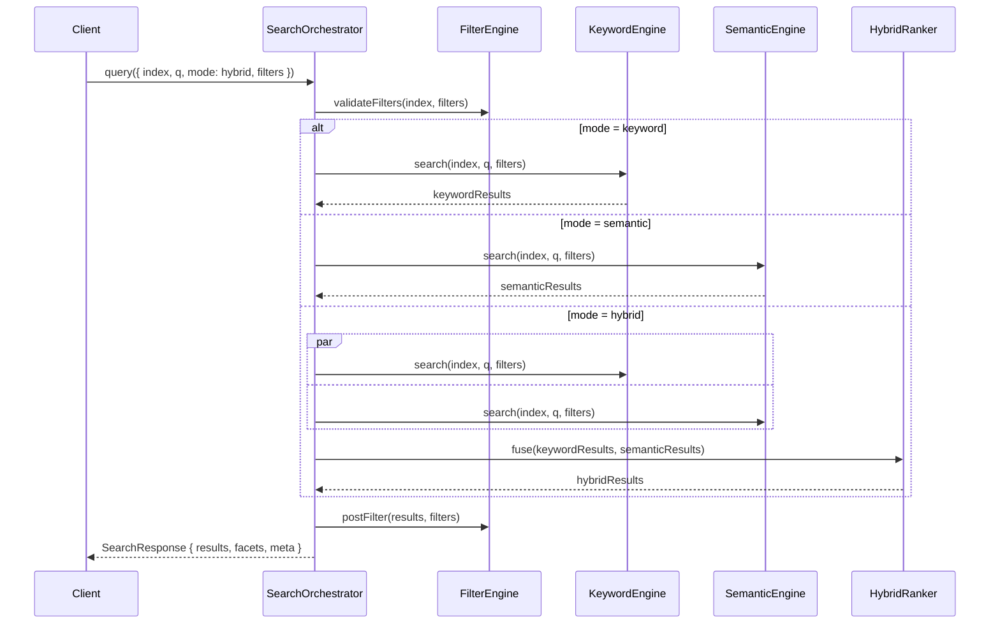
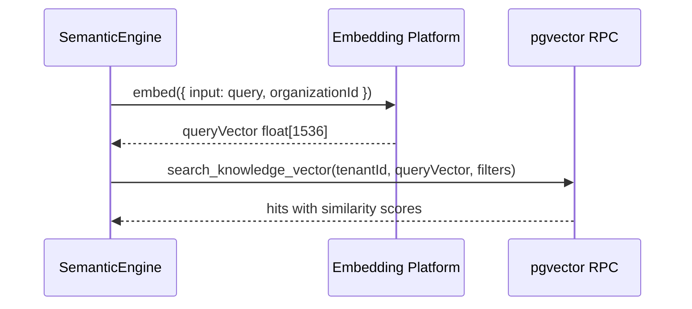
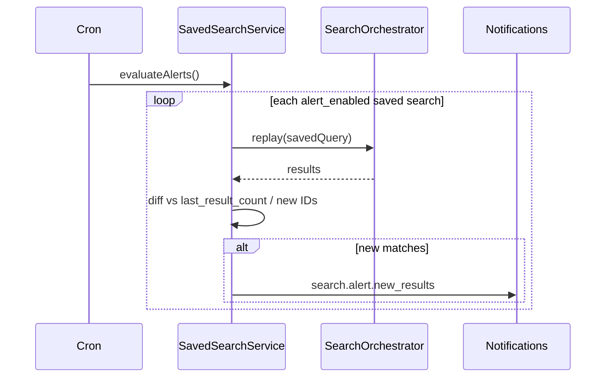
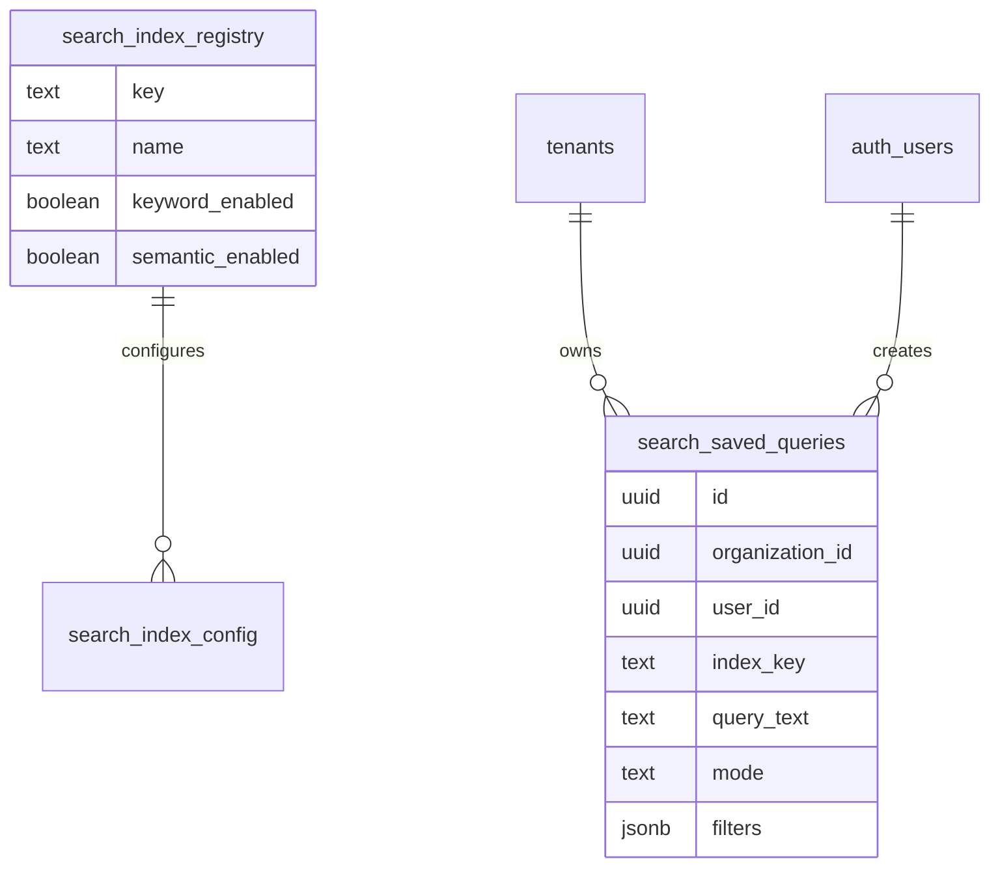

# Talent OS — Search Platform Architecture

**Document version:** 1.0.0  
**Classification:** Internal — Architecture  
**Author:** Platform Architecture  
**Date:** July 31, 2026  
**Status:** Draft — Awaiting approval  
**Scope:** Design only — no implementation in this document

---

## Table of Contents

1. [Executive Summary](#1-executive-summary)
2. [Platform Context](#2-platform-context)
3. [Search Flow](#3-search-flow)
4. [Current State Assessment](#4-current-state-assessment)
5. [Target Architecture Overview](#5-target-architecture-overview)
6. [Search](#6-search)
7. [Keyword](#7-keyword)
8. [Semantic](#8-semantic)
9. [Hybrid](#9-hybrid)
10. [Filters](#10-filters)
11. [Saved Search](#11-saved-search)
12. [Integration Points](#12-integration-points)
13. [Data Model](#13-data-model)
14. [API Surface](#14-api-surface)
15. [Performance & Caching](#15-performance--caching)
16. [Folder Structure](#16-folder-structure)
17. [Design Decisions](#17-design-decisions)
18. [Migration Path](#18-migration-path)

---

## 1. Executive Summary

Enterprise SaaS products accumulate searchable content across domains — talent rosters, knowledge bases, projects, opportunities, and future product catalogs. Today Talent OS implements **fragmented search**: talent uses `search_freelancers` RPC with ILIKE/filters; knowledge uses separate full-text and vector RPCs. There is no unified query model, hybrid ranking, or saved searches.

The **Search Platform** provides a single orchestration layer:

```
Search → Keyword → Semantic → Hybrid → Filters → Saved Search
```

### Design goals

| Goal | Description |
|------|-------------|
| **One search API** | `SearchPlatformService.query()` for all indices and modes |
| **Mode composability** | Keyword, semantic, and hybrid are pluggable strategies — not separate endpoints per domain |
| **Tenant isolation** | Every query scoped by `organizationId`; RLS on all indices |
| **Filter-first** | Structured filters applied before and after retrieval |
| **Hybrid by default** | Production queries use keyword + semantic fusion where embeddings exist |
| **Persisted discovery** | Saved searches with optional alert subscriptions |
| **Product extensibility** | Index registry supports `talent`, `knowledge`, `projects`, future products |

### Relationship to existing docs

| Document | Relationship |
|----------|--------------|
| [Platform Core](./PLATFORM_CORE.md) (PR-00) | Organization context, product registry |
| [AI Platform](./AI_PLATFORM.md) §8 | Embedding Platform generates vectors for semantic/hybrid |
| [Knowledge Module](../33-knowledge-module.md) | First consumer — migrates to Search Platform |
| [AI Implementation Roadmap](./AI_IMPLEMENTATION_ROADMAP.md) | Wave 0d — PR-S01 through PR-S08 |

---

## 2. Platform Context

### 2.1 System context



### 2.2 Container diagram



---

## 3. Search Flow

Each layer adds capability. A query may use one or more retrieval modes; hybrid fuses keyword and semantic before filters finalize the result set.



| Layer | Question answered | Primary mechanism |
|-------|-------------------|-------------------|
| **Search** | What are we searching and how? | Index registry, query DSL, orchestration |
| **Keyword** | Which documents match terms? | PostgreSQL `tsvector`, `websearch_to_tsquery`, `ts_rank` |
| **Semantic** | Which documents are meaningually similar? | pgvector cosine similarity via Embedding Platform |
| **Hybrid** | How do we combine both signals? | Reciprocal Rank Fusion (RRF) or weighted score merge |
| **Filters** | What subset of the index? | Structured facets: category, discipline, date, entity FKs |
| **Saved Search** | Can users reuse and monitor queries? | `search_saved_queries` + optional alert cron |

---

## 4. Current State Assessment

| Capability | Status | Location | Gap |
|------------|:------:|----------|-----|
| Search orchestration | **0%** | — | No unified service |
| Keyword (talent) | **60%** | `search_freelancers` RPC, ILIKE + filters | Not FTS; separate from knowledge |
| Keyword (knowledge) | **70%** | `search_knowledge_entries` RPC, `tsvector` | Isolated; no shared API |
| Semantic | **25%** | `search_knowledge_vector` RPC | Schema ready; no query embedding pipeline |
| Hybrid | **0%** | — | Not implemented |
| Filters | **50%** | Talent query params; knowledge categories | No unified filter schema |
| Saved search | **0%** | — | Not implemented |
| Search API | **40%** | `GET /api/talent/search` | Talent-only; managers only |
| Rate limiting | **80%** | `rateLimit: 'search'` on talent route | Not platform-wide |

**Overall search platform maturity: ~25%**

---

## 5. Target Architecture Overview

The Search Platform lives in **`modules/search/`** and exposes a single query interface through the Platform SDK.

### 5.1 Core services

| Service | Responsibility |
|---------|----------------|
| `IndexRegistry` | Catalog of searchable indices (`talent.roster`, `knowledge.entries`, …) |
| `SearchOrchestrator` | Route query to engines, merge results, apply pagination |
| `KeywordEngine` | Full-text retrieval per index |
| `SemanticEngine` | Embed query → vector search per index |
| `HybridRanker` | Fuse keyword + semantic result lists |
| `FilterEngine` | Parse, validate, apply structured filters |
| `SavedSearchService` | CRUD saved queries; replay; alert dispatch |

### 5.2 Query request

```typescript
interface SearchQuery {
  index: SearchIndexKey           // e.g. 'talent.roster', 'knowledge.entries'
  q?: string                      // free-text query
  mode: 'keyword' | 'semantic' | 'hybrid'  // default: hybrid
  filters?: SearchFilters
  sort?: SearchSort
  pagination?: { page: number; limit: number }
  highlight?: boolean
  organizationId: string
  productId: ProductId
  userId?: string
}

interface SearchFilters {
  // Index-specific; validated by FilterEngine
  category?: string[]
  discipline?: string
  availability?: string
  minRate?: number
  maxRate?: number
  minRating?: number
  projectId?: string
  companyId?: string
  entityType?: string
  entityId?: string
  dateFrom?: string
  dateTo?: string
  embeddingStatus?: string
}

interface SearchResult<T = unknown> {
  id: string
  index: SearchIndexKey
  score: number
  keywordScore?: number
  semanticScore?: number
  highlights?: Record<string, string[]>
  document: T
}
```

### 5.3 Index registry (Phase 1)

| Index key | Source table(s) | Keyword | Semantic | Filters |
|-----------|-----------------|:-------:|:--------:|---------|
| `talent.roster` | `freelancers` | ILIKE → migrate to tsvector | Future: skill embeddings | discipline, availability, rate, rating |
| `knowledge.entries` | `knowledge_entries` | `search_vector` GIN | `knowledge_embeddings` HNSW | category, project, company, entity |
| `projects.pipeline` | `projects` | Phase 2 | Phase 2 | status, client, date |
| `opportunities.open` | `opportunities` | Phase 2 | Phase 2 | status, discipline |

---

## 6. Search

**Search** is the top-level orchestration entry point — index selection, mode routing, result shaping.

### 6.1 Search orchestration flow



### 6.2 Permissions

| Index | Read permission |
|-------|-----------------|
| `talent.roster` | Manager+ (`talent:read`) |
| `knowledge.entries` | Manager+ or client scoped to company |
| `projects.pipeline` | Manager+ |
| Saved searches | Owner or shared within org |

### 6.3 Observability

| Metric | Labels |
|--------|--------|
| `search.query.duration_ms` | index, mode, org |
| `search.query.results_count` | index, mode |
| `search.keyword.latency_ms` | index |
| `search.semantic.latency_ms` | index |
| `search.hybrid.fusion_ms` | index |
| `search.saved.alert_fired` | saved_search_id |

---

## 7. Keyword

**Keyword** retrieval matches literal and stemmed terms using PostgreSQL full-text search.

### 7.1 Keyword engine

| Index | Current | Target |
|-------|---------|--------|
| `talent.roster` | ILIKE on name, bio, skills | Add `search_vector tsvector` generated column on `freelancers` |
| `knowledge.entries` | `search_knowledge_entries()` RPC | Wrap via KeywordEngine — no behavior change |

### 7.2 Talent tsvector migration

```sql
ALTER TABLE freelancers ADD COLUMN search_vector tsvector
  GENERATED ALWAYS AS (
    to_tsvector('english',
      coalesce(display_name, '') || ' ' ||
      coalesce(bio, '') || ' ' ||
      coalesce(array_to_string(skills, ' '), '')
    )
  ) STORED;

CREATE INDEX idx_freelancers_search ON freelancers USING gin(search_vector);
```

New RPC `search_talent_keyword(p_tenant_id, p_query, …)` replaces ILIKE path with `websearch_to_tsquery` + `ts_rank`.

### 7.3 Keyword result shape

```typescript
interface KeywordHit {
  id: string
  rank: number              // ts_rank score
  headline?: string         // ts_headline for snippets
}
```

---

## 8. Semantic

**Semantic** retrieval finds documents by meaning using vector similarity.

### 8.1 Semantic pipeline



### 8.2 Prerequisites

Semantic search requires **Embedding Platform** (PR-22–PR-24):

- Chunks indexed with vectors in `knowledge_embeddings`
- Query embedding via `aiPlatform.embed({ content: q })`
- Talent semantic (skill/profile embeddings) — Phase 2

### 8.3 Semantic thresholds

| Parameter | Default | Purpose |
|-----------|---------|---------|
| `minSimilarity` | 0.72 | Drop low-relevance vector hits |
| `maxResults` | 50 | Pre-fusion cap per engine |
| `embeddingModel` | `text-embedding-3-small` | Consistent with index |

When no embeddings exist for an index, semantic engine returns empty; hybrid degrades to keyword-only.

---

## 9. Hybrid

**Hybrid** fuses keyword and semantic result lists into a single ranked set.

### 9.1 Reciprocal Rank Fusion (default)

```typescript
function reciprocalRankFusion(
  keywordHits: RankedHit[],
  semanticHits: RankedHit[],
  k: number = 60
): RankedHit[] {
  const scores = new Map<string, number>()

  keywordHits.forEach((hit, rank) => {
    scores.set(hit.id, (scores.get(hit.id) ?? 0) + 1 / (k + rank + 1))
  })
  semanticHits.forEach((hit, rank) => {
    scores.set(hit.id, (scores.get(hit.id) ?? 0) + 1 / (k + rank + 1))
  })

  return [...scores.entries()]
    .sort((a, b) => b[1] - a[1])
    .map(([id, score]) => ({ id, score }))
}
```

### 9.2 Weighted merge (alternative)

Configurable per index in `search_index_config`:

```typescript
hybridConfig: {
  strategy: 'rrf' | 'weighted'
  keywordWeight: 0.4
  semanticWeight: 0.6
}
```

### 9.3 Mode selection defaults

| Index | Default mode | Rationale |
|-------|--------------|-----------|
| `knowledge.entries` | `hybrid` | Rich content benefits from semantic |
| `talent.roster` | `keyword` | Phase 1 — no talent embeddings yet |
| Saved search replay | Preserves saved `mode` | User expectation |

Feature flag `search.hybrid.enabled` (Feature Flags Platform) gates hybrid globally per org.

---

## 10. Filters

**Filters** constrain the candidate set before retrieval (pre-filter) and refine results after scoring (post-filter).

### 10.1 Filter schema per index

```typescript
// Registered in IndexRegistry
const knowledgeFilterSchema = z.object({
  category: z.array(z.enum(KNOWLEDGE_CATEGORIES)).optional(),
  projectId: z.uuid().optional(),
  companyId: z.uuid().optional(),
  entityType: z.string().optional(),
  entityId: z.uuid().optional(),
  dateFrom: z.iso.datetime().optional(),
  dateTo: z.iso.datetime().optional(),
  embeddingStatus: z.enum(['pending', 'indexed', 'failed']).optional(),
})

const talentFilterSchema = z.object({
  discipline: z.enum(DISCIPLINES).optional(),
  availability: z.enum(AVAILABILITY).optional(),
  minRate: z.number().optional(),
  maxRate: z.number().optional(),
  minRating: z.number().min(0).max(5).optional(),
})
```

### 10.2 Faceted search

Response includes facet counts for filter UI:

```typescript
interface SearchResponse {
  results: SearchResult[]
  facets: {
    category?: FacetBucket[]    // { value, count }
    discipline?: FacetBucket[]
    availability?: FacetBucket[]
  }
  meta: { total, page, limit, mode, tookMs }
}
```

Facets computed via parallel aggregate queries or materialized counts (Phase 2 optimization).

### 10.3 Filter application order

1. **Pre-filter** — SQL WHERE clauses in RPC (tenant_id + filters)
2. **Retrieve** — keyword and/or semantic
3. **Fusion** — hybrid ranker
4. **Post-filter** — permissions, dedupe, min score threshold

---

## 11. Saved Search

**Saved Search** persists query definitions for reuse, sharing, and optional alerts.

### 11.1 Saved search entity

```
search_saved_queries
  id
  organization_id (FK tenants)
  user_id (FK auth.users) — owner
  name
  description (nullable)
  index_key
  query_text (nullable)
  mode: keyword | semantic | hybrid
  filters (jsonb)
  sort (jsonb)
  is_shared (boolean)        -- visible to org managers
  alert_enabled (boolean)
  alert_frequency: daily | weekly | immediate
  last_alert_at (nullable)
  last_result_count (nullable)
  created_at, updated_at
```

### 11.2 Alert flow



### 11.3 Use cases

| Use case | Example |
|----------|---------|
| Talent bench | "Available motion designers in NYC, rate < $150" — weekly alert |
| Knowledge watch | "Brand guidelines" in client preferences — notify on new entries |
| Project context | All knowledge linked to project X — shared with team |

---

## 12. Integration Points

### 12.1 Platform Core (PR-00)

- `OrganizationContext` scopes every query
- `ProductId` selects index namespace
- Platform events: `search.query.executed`, `search.saved.created`

### 12.2 Embedding Platform (PR-22–24)

- Semantic and hybrid modes call `aiPlatform.embed()`
- Usage recorded on AI ledger; subject to AI budgets
- Index lag metric: `search.semantic.index_lag_seconds`

### 12.3 Feature Flags (PR-FF)

| Flag | Purpose |
|------|---------|
| `search.hybrid.enabled` | Enable hybrid mode |
| `search.semantic.enabled` | Enable vector search |
| `search.saved_alerts.enabled` | Enable alert cron |

### 12.4 Existing consumers (migration)

| Consumer | Current | Target |
|----------|---------|--------|
| `GET /api/talent/search` | Direct `talent.searchRoster` | Delegate to `SearchPlatform.query({ index: 'talent.roster' })` |
| `KnowledgeService.search()` | Direct repository RPC | Delegate to Search Platform |
| `KnowledgeService.searchVector()` | Direct vector RPC | Semantic engine |
| MCP knowledge tools | Repository reads | Search Platform query API |
| Agents | Ad-hoc queries | `platform.search.query()` |

---

## 13. Data Model

### 13.1 ER diagram



### 13.2 Migration

PR-S01: `032_search_platform.sql`

Tables:

1. `search_index_registry` (+ seed talent.roster, knowledge.entries)
2. `search_index_config` (hybrid weights, min similarity per index)
3. `search_saved_queries`
4. `search_query_audit` (optional — sampled query log for analytics)
5. `freelancers.search_vector` column + index (talent keyword upgrade)

RLS: saved searches — owner read/write; shared searches readable by org managers.

---

## 14. API Surface

| Method | Route | Permission | Purpose |
|--------|-------|------------|---------|
| POST | `/api/search/query` | index-specific read | Unified search |
| GET | `/api/search/indices` | authenticated | List available indices for org/product |
| GET | `/api/search/saved` | authenticated | List saved searches |
| POST | `/api/search/saved` | authenticated | Create saved search |
| GET | `/api/search/saved/:id` | owner or shared | Get saved search |
| PUT | `/api/search/saved/:id` | owner | Update saved search |
| DELETE | `/api/search/saved/:id` | owner | Delete saved search |
| POST | `/api/search/saved/:id/run` | owner or shared | Replay saved query |
| GET | `/api/talent/search` | manager | **Legacy** — delegates to search platform (PR-S07) |

### 14.1 Query example

```typescript
const results = await platform.search.query({
  index: 'knowledge.entries',
  q: 'brand guidelines color palette',
  mode: 'hybrid',
  filters: { category: ['client_preference', 'sop'], projectId: '…' },
  pagination: { page: 1, limit: 20 },
  organizationId: ctx.organizationId,
  productId: 'talent_os',
})
```

---

## 15. Performance & Caching

### 15.1 Targets

| Operation | p95 target |
|-----------|------------|
| Keyword only | < 100 ms |
| Semantic (incl. embed) | < 500 ms |
| Hybrid | < 600 ms |
| Saved search replay | Same as underlying mode |

### 15.2 Caching

| Cache | Key | TTL |
|-------|-----|-----|
| Query embedding | `search:emb:{hash(q)}` | 1 hour |
| Keyword results | `search:kw:{index}:{hash(q+filters)}` | 60 sec |
| Facet counts | `search:facets:{index}:{orgId}` | 5 min |

Invalidate on document index update (knowledge create/update, freelancer update).

### 15.3 Rate limiting

Extend platform rate limit profile `search`:

- 60 req/min per user (current talent search)
- 10 semantic/hybrid req/min per org (embedding cost control)

---

## 16. Folder Structure

```
modules/search/
├── index.ts
├── types/
│   ├── query.ts
│   ├── result.ts
│   └── filters.ts
├── registry/
│   ├── index-registry.ts
│   └── indices/
│       ├── talent-roster.ts
│       └── knowledge-entries.ts
├── engines/
│   ├── keyword.engine.ts
│   ├── semantic.engine.ts
│   └── hybrid.ranker.ts
├── filters/
│   ├── engine.ts
│   └── schemas.ts
├── saved/
│   └── service.ts
├── orchestrator/
│   └── service.ts          # SearchPlatformService
└── sdk/
    └── search-client.ts    # platform.search.*

lib/repositories/
├── search-saved.repository.ts
└── search-index.repository.ts

app/api/search/
├── query/route.ts
├── indices/route.ts
└── saved/
    ├── route.ts
    └── [id]/
        ├── route.ts
        └── run/route.ts

app/api/cron/search/
└── evaluate-alerts/route.ts
```

---

## 17. Design Decisions

### ADR-S01: Unified orchestrator, pluggable engines

**Decision:** Single `SearchPlatformService` with keyword, semantic, hybrid engines.  
**Rationale:** Avoid duplicate search endpoints per domain; consistent filter and pagination model.  
**Consequence:** Domain services delegate; thin wrapper period during migration.

### ADR-S02: pgvector + tsvector hybrid on Postgres

**Decision:** Stay on Supabase PostgreSQL for both keyword and semantic — no Elasticsearch Phase 1.  
**Rationale:** RLS, single database, existing `016_knowledge_module` schema; aligns with ADR-004 (AI Platform).  
**Consequence:** Re-evaluate Elasticsearch/OpenSearch at 1M+ documents or complex aggregations.

### ADR-S03: RRF as default hybrid strategy

**Decision:** Reciprocal Rank Fusion over weighted linear combination.  
**Rationale:** Robust when score scales differ between ts_rank and cosine similarity.  
**Consequence:** Weighted merge available per-index for tuning.

### ADR-S04: Query embedding via AI Platform

**Decision:** Semantic search always embeds via Embedding Platform — no local model.  
**Rationale:** Single cost/audit path; consistent model with index.  
**Consequence:** Semantic search unavailable when AI platform down — degrade to keyword.

### ADR-S05: Saved searches are org-scoped, user-owned

**Decision:** Saved queries belong to a user; optional `is_shared` for team vis.  
**Rationale:** Personal discovery workflows; shared for team knowledge watches.  
**Consequence:** Alerts delivered to owner only unless shared alert routing added Phase 2.

---

## 18. Migration Path

| Phase | PRs | Outcome |
|-------|-----|---------|
| **Foundation** | PR-S01, PR-S02 | Schema, index registry, keyword engine |
| **Semantic + hybrid** | PR-S03, PR-S04 | Vector search + RRF (requires PR-24 embeddings) |
| **Filters + saved** | PR-S05, PR-S06 | Facets, saved searches, alerts |
| **Integration** | PR-S07, PR-S08 | Unified API, migrate talent + knowledge |

Backward compatibility: `GET /api/talent/search` remains as alias until clients migrate.

---

## Appendix A — Implementation roadmap

See [AI_IMPLEMENTATION_ROADMAP.md](./AI_IMPLEMENTATION_ROADMAP.md) **Wave 0d — Search Platform** (PR-S01 through PR-S08).

**Critical path:**

```
PR-00 → PR-S01 → PR-S02 → PR-S05 → PR-S06 → PR-S07 → PR-S08
PR-24 (embeddings) → PR-S03 → PR-S04 → PR-S07
PR-S02 can ship keyword-only search before embeddings complete
```

---

**Status: Draft — Awaiting approval — no code in this document.**

*End of Search Platform Architecture v1.0.0*
