# Talent OS — UI Architecture

**Document version:** 1.0.0  
**Date:** August 2, 2026  
**Status:** Draft — awaiting approval  
**Stack:** Next.js 15 App Router · React 19 · Tailwind · Radix/shadcn · Supabase Auth  
**References:** `DOMAIN_MODEL.md`, `CONTEXT_MAP.md`, `API_SPECIFICATION.md`, bounded context specs

---

## Table of contents

1. [Overview](#1-overview)
2. [Architecture principles](#2-architecture-principles)
3. [Navigation](#3-navigation)
4. [Sidebar](#4-sidebar)
5. [Page hierarchy](#5-page-hierarchy)
6. [Layouts](#6-layouts)
7. [User journeys](#7-user-journeys)
8. [Shared components](#8-shared-components)
9. [Forms](#9-forms)
10. [Tables](#10-tables)
11. [Dashboards](#11-dashboards)
12. [State management](#12-state-management)
13. [Permissions](#13-permissions)
14. [Loading states](#14-loading-states)
15. [Error handling](#15-error-handling)
16. [Module map (bounded contexts → UI)](#16-module-map-bounded-contexts--ui)
17. [Implementation phases](#17-implementation-phases)

**Legend:** ✅ Implemented · 🚧 Partial · 📋 Planned

---

## 1. Overview

Talent OS UI is a **role-aware agency operations console** mapped one-to-one to bounded contexts. The frontend is a Next.js App Router application with:

- **Server Components** for data fetching and permission gates
- **Client Components** for interactivity (forms, filters, charts)
- **Server Actions** for mutations (legacy paths) migrating to **REST API client** (module paths)
- **Middleware** for route-level RBAC

### Current vs target

| Area | Current | Target |
|------|---------|--------|
| Pages | ~20 dashboard routes | ~80 routes across 12 contexts |
| Sidebar | 8 flat links | Grouped nav with context sections |
| Data layer | `lib/queries/*` + Server Actions | Module hooks + `TalentOsClient` |
| Analytics | Placeholder card | 8 dashboard views + exports |
| CRM | Not in UI | Full sales pipeline |
| Workflows | Not in UI | Runs, approvals, observability |
| WhatsApp | Not in UI | Conversations, audit, commands |

---

## 2. Architecture principles

### 2.1 Bounded context alignment

Each UI module maps to exactly one bounded context. Cross-context screens **compose** read models (e.g. project detail shows assignment summary) but **mutate through owning context** only.

```
app/(dashboard)/<context>/     → Pages
components/<context>/          → Legacy context components (migrating)
modules/<context>/components/  → Target module UI (future)
modules/core/components/       → Shared kernel (layout, auth, ui primitives)
```

### 2.2 Role-first information architecture

Navigation, dashboards, and actions are filtered by `UserRole`:

| Role | Primary jobs |
|------|--------------|
| `admin` | Full agency control + billing + integrations |
| `talent_manager` | Demand, supply, delivery, allocation |
| `freelancer` | Respond, deliver, submit milestones |
| `client` | View company projects and opportunities |

### 2.3 Server-first data flow

```
Page (RSC)
  → requireTenant() / requireManager()
  → lib/queries/* OR TalentOsClient (server)
  → Render with Suspense boundaries

Client island
  → useFormState / useTransition
  → Server Action OR fetch('/api/...')
  → revalidatePath / router.refresh()
```

### 2.4 Progressive module migration

Legacy Server Actions (`app/actions/*`) coexist with module REST APIs. UI architecture supports both during migration; new screens use `TalentOsClient` per `API_SPECIFICATION.md`.

---

## 3. Navigation

### 3.1 Top-level structure

| Zone | Routes | Auth |
|------|--------|------|
| **Public** | `/login`, `/signup`, `/forgot-password`, `/invite/[token]` | None |
| **Dashboard** | `/dashboard`, all `(dashboard)/*` | Session + tenant |
| **Profile** | `/profile` | Freelancer self-service |

### 3.2 Primary navigation groups (target)

Navigation is organized by **business capability**, not technical module names:

| Group | Label | Contexts |
|-------|-------|----------|
| **Home** | Overview | Analytics summary, role dashboard |
| **Demand** | CRM & Demand | Leads, pipeline, companies, opportunities |
| **Supply** | Talent | Roster, import, profiles |
| **Delivery** | Projects | Projects, milestones, deliverables |
| **Planning** | Assignments | Allocations, capacity, conflicts |
| **Finance** | Payments | Payment approval, aging |
| **Operations** | Workflows · WhatsApp · AI | Orchestration, channel, agents |
| **Insights** | Analytics | 8 dashboards, exports |
| **Admin** | Organization · Settings | Org structure, team, billing |

### 3.3 Breadcrumbs

Every detail page shows contextual breadcrumbs:

```
Demand / Companies / Globex Corp
Delivery / Projects / Website Redesign / Milestones
```

**Component:** `BreadcrumbNav` — 📋 planned in `modules/core/components/navigation/`

### 3.4 Header actions

| Element | Behavior | Status |
|---------|----------|--------|
| Workspace name | From session tenant | ✅ |
| Role badge | `RoleBadge` | ✅ |
| Notifications bell | Link to `/notifications` | 🚧 icon only |
| User menu | Profile, sign out | 🚧 sign out only |
| Global search | Cross-entity search (Cmd+K) | 📋 |

### 3.5 Mobile navigation

📋 **Planned:** Collapsible sidebar → bottom tab bar on `< md` breakpoints for primary 5 destinations (Home, Projects, Talent, Opportunities, More).

---

## 4. Sidebar

### 4.1 Current implementation ✅

File: `modules/core/components/layout/sidebar.tsx`

Flat list filtered by role:

| href | Label | Roles |
|------|-------|-------|
| `/dashboard` | Dashboard | all |
| `/profile` | My profile | freelancer |
| `/talent` | Talent | admin, talent_manager |
| `/opportunities` | Opportunities | all |
| `/projects` | Projects | all |
| `/payments` | Payments | admin, talent_manager, freelancer |
| `/analytics` | Analytics | admin, talent_manager |
| `/settings` | Settings | admin |

### 4.2 Target sidebar structure 📋

Grouped collapsible sections with icons (Lucide):

```
┌─────────────────────────────┐
│ TALENT OS                   │
│ Acme Agency                 │
├─────────────────────────────┤
│ 🏠 Dashboard                │
├─ DEMAND ────────────────────┤
│   Pipeline          📋      │
│   Leads             📋      │
│   Companies         📋      │
│   Opportunities     ✅      │
├─ SUPPLY ────────────────────┤
│   Talent roster     ✅      │
│   Import            📋      │
├─ DELIVERY ──────────────────┤
│   Projects          ✅      │
│   Templates         📋      │
├─ PLANNING ──────────────────┤
│   Assignments       📋      │
│   Capacity          📋      │
│   Conflicts         📋      │
├─ FINANCE ───────────────────┤
│   Payments          ✅      │
├─ OPERATIONS ────────────────┤
│   Workflows         📋      │
│   WhatsApp          📋      │
│   AI Agents         📋      │
│   Knowledge         📋      │
├─ INSIGHTS ──────────────────┤
│   Analytics         🚧      │
│     └─ sub-nav: 8 dashboards│
├─ ADMIN ─────────────────────┤
│   Organization      📋      │
│   Settings          🚧      │
│   Integrations      🚧      │
└─────────────────────────────┘
```

### 4.3 Sidebar configuration model

Central config drives nav + permissions (single source of truth):

```typescript
// modules/core/navigation/config.ts (planned)
interface NavItem {
  id: string
  href: string
  label: string
  icon: LucideIcon
  permissions?: string[]      // API permission strings
  roles?: UserRole[]          // Fallback role filter
  children?: NavItem[]
  badge?: 'count' | 'alert'   // e.g. pending approvals
}
```

### 4.4 Active state rules

- Exact match or `pathname.startsWith(href + '/')`
- Parent group expanded when any child active
- Analytics sub-routes highlight parent "Analytics"

### 4.5 Sidebar badges (target)

| Item | Badge source |
|------|--------------|
| Workflows → Approvals | `GET /api/workflows/approvals` count |
| Assignments → Conflicts | Open conflicts count |
| Notifications | Unread count |
| WhatsApp | Pending approval gates |

---

## 5. Page hierarchy

### 5.1 Full route tree (target)

```
/                                    → redirect to /dashboard or /login
/login, /signup, /forgot-password
/invite/[token]

/dashboard                           ✅ Role-specific home

── DEMAND (CRM) ──
/crm/leads                           📋 List
/crm/leads/new                       📋 Create
/crm/leads/[id]                      📋 Detail + convert
/crm/pipeline                        📋 Kanban board
/crm/companies                       📋 List
/crm/companies/[id]                  📋 Detail (contacts, deals)
/crm/deals/[id]                      📋 Detail
/crm/contracts                       📋 List
/opportunities                       ✅ List (legacy demand)
/opportunities/new                   ✅ Create
/opportunities/[id]                  ✅ Detail
/opportunities/[id]/shortlist        ✅ Shortlist board

── SUPPLY (Talent) ──
/talent                              ✅ Roster table
/talent/new                          ✅ Create
/talent/[id]                         ✅ Profile view
/talent/[id]/edit                    ✅ Edit
/talent/import                       📋 CSV import wizard

── DELIVERY (Projects) ──
/projects                            ✅ List
/projects/new                        ✅ Create
/projects/[id]                         ✅ Detail (tracker + milestones)
/projects/[id]/tasks                 ✅ Task board
/projects/[id]/deliverables          ✅ Deliverables
/projects/[id]/timeline              ✅ Timeline feed
/projects/templates                  ✅ Template library

── PLANNING (Assignments) ──
/assignments                         📋 Allocation list
/assignments/new                     📋 Create allocation
/assignments/[id]                    📋 Detail (schedules, conflicts)
/assignments/capacity                📋 Capacity planner
/assignments/conflicts               📋 Conflict inbox

── FINANCE ──
/payments                            ✅ List + actions

── OPERATIONS ──
/workflows                           📋 Overview
/workflows/runs                      📋 Run list
/workflows/runs/[id]                 📋 Run detail + history
/workflows/approvals                 📋 Approval inbox
/workflows/definitions               📋 Catalog (read-only builtin + custom)
/whatsapp                            📋 Conversations
/whatsapp/[freelancerId]             📋 Memory + audit
/whatsapp/approvals                  📋 Gate resolution
/ai/agents                           📋 Agent launcher
/ai/agents/[agentId]                 📋 Chat session
/knowledge                           📋 Entry list + search

── INSIGHTS (Analytics) ──
/analytics                           🚧 Hub (links to dashboards)
/analytics/summary                   📋 Combined overview
/analytics/organizations             📋
/analytics/projects                  📋
/analytics/talent                    📋
/analytics/utilization               📋
/analytics/revenue                   📋
/analytics/delivery                  📋
/analytics/ai-usage                  📋
/analytics/workflows                 📋
/analytics/exports                   📋 Export history

── ADMIN ──
/organization                        📋 Profile, branding, hours
/organization/departments            📋
/organization/teams                  📋
/organization/members                📋
/organization/invitations            📋
/settings                            🚧 Placeholder
/settings/team                       🚧 Team invite
/settings/billing                    🚧 Placeholder
/settings/integrations               🚧 Placeholder
/notifications                       ✅ List
/profile                             ✅ Freelancer redirect/edit
```

### 5.2 URL conventions

| Pattern | Usage |
|---------|-------|
| `/context` | List/index |
| `/context/new` | Create form |
| `/context/[id]` | Detail view |
| `/context/[id]/edit` | Edit form |
| `/context/[id]/sub-resource` | Nested tab or sub-page |

Query params for filters: `?page=1&limit=20&q=&status=&sort=`

---

## 6. Layouts

### 6.1 Layout hierarchy

```
app/layout.tsx                    Root (html, body, font)
├── app/(auth)/layout.tsx         Centered card, no sidebar  ✅
└── app/(dashboard)/layout.tsx    Sidebar + Header + main     ✅
    ├── context/layout.tsx        Optional section tabs       📋
    └── [id]/layout.tsx           Detail tabs (projects)      📋
```

### 6.2 Dashboard shell ✅

```tsx
// app/(dashboard)/layout.tsx
<div className="flex min-h-screen">
  <Sidebar role={role} tenantName={name} />
  <div className="flex flex-1 flex-col">
    <Header session={session} />
    <main className="flex-1 overflow-auto p-6">{children}</main>
  </div>
</div>
```

### 6.3 Layout variants (target)

| Layout | Use case | Structure |
|--------|----------|-----------|
| **Default** | Lists, settings | PageHeader + content |
| **Split** | Pipeline Kanban, detail+sidebar | 70/30 or 60/40 grid |
| **Tabbed detail** | Project, company, allocation | Tab bar + panel content |
| **Wizard** | Import, onboarding | Step indicator + narrow column |
| **Full bleed** | Analytics charts | No max-width; chart grid |
| **Drawer overlay** | Quick preview, filters mobile | Sheet from Radix |

### 6.4 Tabbed detail pattern (Project) 📋

```
/projects/[id]
├── Overview (default)     → health, summary, freelancer
├── Milestones             → milestone list + review actions
├── Tasks                  → task board / list
├── Deliverables           → submission table
├── Timeline               → activity feed
├── Files                  → assets
└── Comments               → thread
```

**Component:** `DetailTabs` — URL-synced via `?tab=milestones` or parallel routes.

### 6.5 Page width

| Content | Max width |
|---------|-----------|
| Forms | `max-w-2xl` |
| Tables | full width |
| Dashboards | full width |
| Settings | `max-w-3xl` |
| Agent chat | `max-w-4xl` centered |

---

## 7. User journeys

### 7.1 Manager — Lead to delivery (target)

```mermaid
flowchart LR
  A[Capture lead] --> B[Qualify]
  B --> C[Convert to company/deal]
  C --> D[Create opportunity]
  D --> E[AI match + shortlist]
  E --> F[Broadcast]
  F --> G[Create project]
  G --> H[Assign talent]
  H --> I[Track delivery]
  I --> J[Approve milestone]
  J --> K[Approve payment]
```



| Step | Page | API |
|------|------|-----|
| Capture lead | `/crm/leads/new` | `POST /api/crm/leads` |
| Pipeline | `/crm/pipeline` | `GET /api/crm/pipeline` |
| Convert | Lead detail modal | `POST /api/crm/leads/{id}/convert` |
| Opportunity | `/opportunities/new` | Legacy + CRM |
| Match | Opportunity detail | `POST /api/talent/match` |
| Broadcast | Shortlist page ✅ | Server Actions |
| Project | `/projects/new` ✅ | Server Actions → module |
| Assign | `/assignments/new` | `POST /api/assignments` |
| Deliver | `/projects/[id]` ✅ | Module API |
| Pay | `/payments` ✅ | Finance action |

### 7.2 Freelancer — Opportunity to payment ✅ (partial)

```
Dashboard → Opportunities (respond YES/NO)
         → Project detail → Submit milestone
         → Payments (view status)
         → Profile (update availability)
```

WhatsApp parallel path: same intents via chat (no UI required for core flow).

### 7.3 Client — Project visibility ✅

```
Dashboard (company projects) → Project detail (read-only)
                            → Opportunities (company-linked, read-only)
```

### 7.4 Admin — Organization setup 📋

```
/settings/team (invite) → /organization/members
/settings/billing → subscription reference
/settings/integrations → integration_configs
/organization → branding, business hours
```

### 7.5 Operations — Workflow approval 📋

```
/workflows/approvals → Review payload → Approve/Reject
                    → Optional: /whatsapp/approvals (same gates)
```

Notification + email via workflow `notify` action.

### 7.6 Analyst — Reporting 📋

```
/analytics → Select dashboard → Apply period filter
          → Refresh cache → Export CSV
          → /analytics/exports (download)
```

---

## 8. Shared components

### 8.1 Core layout (`modules/core/components/`)

| Component | Purpose | Status |
|-----------|---------|--------|
| `Sidebar` | Primary nav | ✅ |
| `Header` | Top bar, notifications, sign out | ✅ |
| `PageHeader` | Title, description, actions slot | ✅ |
| `StatCard` | KPI metric card | ✅ |
| `EmptyState` | Zero-data placeholder | ✅ |
| `RoleBadge` | Role pill | ✅ |
| `BreadcrumbNav` | Context path | 📋 |
| `DetailTabs` | Tabbed detail pages | 📋 |
| `CommandPalette` | Global search (Cmd+K) | 📋 |

### 8.2 UI primitives (`modules/core/components/ui/`) ✅

Radix + Tailwind shadcn-style:

- `Button`, `Input`, `Label`, `Card`, `Badge`, `Separator`

📋 **Extend with:** `Dialog`, `Sheet`, `DropdownMenu`, `Tabs`, `Table`, `Select`, `Textarea`, `Toast`, `Skeleton`, `Alert`, `Avatar`, `Progress`

### 8.3 Data display (planned shared)

| Component | Purpose |
|-----------|---------|
| `DataTable` | Sortable, paginated table with column defs |
| `FilterBar` | Search + filter chips + URL sync |
| `Pagination` | Page/limit controls from `meta` |
| `StatusBadge` | Enum → color mapping per context |
| `MoneyDisplay` | Currency formatting via `formatCurrency` |
| `DateDisplay` | Relative + absolute via `date-fns` |
| `EntityLink` | Typed link to detail pages |
| `AuditTimeline` | Chronological audit/history entries |
| `ChartCard` | Recharts wrapper for analytics |
| `HealthIndicator` | Project health score gauge |
| `CompletenessBar` | Talent profile completeness |
| `ConflictAlert` | Assignment conflict severity |

### 8.4 Feedback

| Component | Purpose |
|-----------|---------|
| `Toast` / `sonner` | Success/error after mutations |
| `InlineError` | Form field errors |
| `PageError` | Full-page error boundary fallback |
| `ConfirmDialog` | Destructive action confirmation |
| `LoadingSpinner` | Button pending state |
| `SkeletonTable` | Table loading placeholder |

### 8.5 Component placement rules

| Location | Rule |
|----------|------|
| `modules/core/components/` | Cross-context, no business logic |
| `modules/<context>/components/` | Context-specific, uses context types |
| `components/<context>/` | Legacy — migrate to modules |
| Page files | Composition only; minimal logic |

---

## 9. Forms

### 9.1 Form patterns

| Pattern | When | Example |
|---------|------|---------|
| **Server Action form** | Legacy mutations | `createProject`, `inviteMember` |
| **API client form** | Module REST | Talent create via `POST /api/talent` |
| **Optimistic UI** | Status toggles | Deal stage drag (future) |
| **Multi-step wizard** | Import, onboarding | CSV import, org setup |
| **Inline edit** | Quick fields | Deal value, assignment pct |

### 9.2 Validation flow

```
Client: Zod schema (shared with API modules/*/validation.ts)
  → Submit
Server Action: safeParse → ActionResponse { ok, error, data }
API route: validateBody → 400 VALIDATION_ERROR
UI: map issues to field errors OR toast message
```

### 9.3 Form layout standard

```tsx
<FormSection title="Basic info" description="...">
  <FormField name="title" label="Title" required />
  <FormRow cols={2}>
    <FormField name="value" type="number" />
    <FormField name="currency" type="select" />
  </FormRow>
</FormSection>
<FormActions>
  <Button variant="outline" type="button">Cancel</Button>
  <Button type="submit" loading={pending}>Save</Button>
</FormActions>
```

### 9.4 Context form catalog

| Context | Key forms | Schema source |
|---------|-----------|---------------|
| Organization | Profile, branding, invite, department, team | `modules/organization/validation.ts` |
| CRM | Lead, company, contact, deal, contract, convert | `modules/crm/validation.ts` |
| Talent | Profile, experience, document, import CSV | `modules/talent/validation.ts` |
| Project | Create project, task, deliverable, template | `modules/project/validation.ts` |
| Assignment | Allocation, capacity, conflict resolve | `modules/assignment/validation.ts` |
| Workflow | Manual trigger, approval decision | `modules/workflow-engine/validation.ts` |
| WhatsApp | Business command | `modules/whatsapp-platform/validation.ts` |
| Analytics | Export request | `modules/analytics/validation.ts` |
| AI | Agent run, knowledge entry | `modules/agents/validation.ts`, `modules/knowledge/validation.ts` |

### 9.5 Specialized inputs ✅ (existing)

| Component | Context |
|-----------|---------|
| `SkillsInput` | Talent skills tag input |
| `TalentSearchFilters` | URL-synced filter bar |
| `TeamInviteForm` | Settings team invite |
| `BroadcastPanel` | Opportunity broadcast |
| `OpportunityForm` | Create opportunity |

---

## 10. Tables

### 10.1 Standard table anatomy

```
┌──────────────────────────────────────────────────────────┐
│ FilterBar: [Search] [Status ▼] [Date range] [+ Create]   │
├──────────────────────────────────────────────────────────┤
│ ☐ │ Name ▲      │ Status    │ Updated     │ Actions ⋮  │
├───┼─────────────┼───────────┼─────────────┼────────────┤
│   │ Jane Doe    │ Active    │ 2 days ago  │ View Edit  │
│   │ ...         │           │             │            │
├──────────────────────────────────────────────────────────┤
│ Showing 1–20 of 142          │ ◀ 1 2 3 ... ▶ │ 20/page ▼│
└──────────────────────────────────────────────────────────┘
```

### 10.2 Table variants

| Variant | Use case | Features |
|---------|----------|----------|
| **Simple** | Talent roster ✅ | Static `<table>`, link rows |
| **DataTable** 📋 | CRM, assignments | Column sort, row selection |
| **Kanban** | Pipeline, tasks | Drag columns (stage/status) |
| **Timeline** | Audit, project feed | Vertical event list |
| **Nested** | Shortlist board ✅ | Cards within columns |

### 10.3 Pagination contract

Align with API `meta`:

```typescript
interface TablePagination {
  page: number
  limit: number
  total: number
  hasMore: boolean
}
```

URL sync: `/talent?page=2&q=react&sort=rating`

Server Components read `searchParams`; client filter components use `useRouter` + `useSearchParams`.

### 10.4 Row actions

| Action placement | Pattern |
|------------------|---------|
| Primary | Row click → detail page |
| Secondary | Trailing `⋯` dropdown |
| Bulk | Checkbox column + toolbar (manager only) |

### 10.5 Empty and error rows

Use `EmptyState` below filter bar when `data.length === 0` and no active filters vs filtered empty (different copy).

---

## 11. Dashboards

### 11.1 Role home dashboards

| Role | Route | Content | Status |
|------|-------|---------|--------|
| Manager | `/dashboard` | StatCards: talent, companies, projects, opportunities | ✅ |
| Freelancer | `/dashboard` | Assigned projects list | ✅ |
| Client | `/dashboard` | Company projects grid | ✅ |

### 11.2 Analytics hub (8 dashboards) 📋

Parent: `/analytics` — dashboard picker grid

| Dashboard | Route | Charts (from API) |
|-----------|-------|-------------------|
| Summary | `/analytics/summary` | Cross-domain KPIs |
| Organizations | `/analytics/organizations` | Members, teams, invites |
| Projects | `/analytics/projects` | Status, health, trends |
| Talent | `/analytics/talent` | Discipline, availability |
| Utilization | `/analytics/utilization` | Allocations, conflicts |
| Revenue | `/analytics/revenue` | Paid/pending, aging |
| Delivery | `/analytics/delivery` | Milestones, deliverables |
| AI Usage | `/analytics/ai-usage` | Tokens, cost by provider |
| Workflows | `/analytics/workflows` | Runs, failures, duration |

### 11.3 Dashboard layout pattern

```
PageHeader (title + period selector + refresh + export)
┌─────────┬─────────┬─────────┬─────────┐
│ KPI     │ KPI     │ KPI     │ KPI     │  ← summary cards
└─────────┴─────────┴─────────┴─────────┘
┌─────────────────────┬───────────────────┐
│ Line chart          │ Pie/bar chart     │  ← charts from payload.charts
└─────────────────────┴───────────────────┘
```

**Libraries:** Recharts ✅ (in package.json); wrap in `ChartCard` with loading skeleton.

### 11.4 Dashboard controls

| Control | Behavior |
|---------|----------|
| Period | `7d` / `30d` / `90d` / `ytd` / custom range |
| Refresh | `?refresh=true` bypasses cache |
| Export | Opens dialog → `POST /api/analytics/exports` |
| Cached badge | Show `cachedAt` when stale data served |

### 11.5 Operational dashboards 📋

| Dashboard | Route | Audience |
|-----------|-------|----------|
| Workflow observability | `/workflows` | Manager |
| WhatsApp observability | `/whatsapp` | Manager |
| Platform observability | `/settings/observability` | Admin |

---

## 12. State management

### 12.1 Strategy (no global client store)

Talent OS uses **React Server Components** as the primary state layer. No Redux/Zustand/React Query in current codebase.

| State type | Mechanism |
|------------|-----------|
| **Server data** | RSC fetch in page; `lib/queries/*` or `TalentOsClient` |
| **URL state** | Filters, pagination, tabs via `searchParams` |
| **Form state** | `useFormState`, controlled inputs, `useTransition` |
| **Session** | Supabase cookie; `getSession()` / `requireTenant()` |
| **Optimistic** | `useOptimistic` for Kanban drag (future) |
| **Client cache** | 📋 Optional TanStack Query for client-heavy views |

### 12.2 Data access layers

```
┌─────────────────────────────────────────┐
│ Pages (RSC)                             │
├─────────────────────────────────────────┤
│ lib/queries/*.queries.ts    (legacy)    │  ← Direct Supabase / services
│ TalentOsClient (server)     (module)    │  ← REST API
├─────────────────────────────────────────┤
│ app/actions/*.ts            (mutations) │  ← Server Actions
│ fetch('/api/...')           (client)    │  ← Client mutations
└─────────────────────────────────────────┘
```

**Migration target:** Module pages use `TalentOsClient` exclusively; deprecate direct Supabase in pages.

### 12.3 Revalidation

| Trigger | Method |
|---------|--------|
| Server Action success | `revalidatePath('/context')` |
| API mutation (client) | `router.refresh()` |
| Real-time (future) | Supabase realtime subscription |

### 12.4 Client islands

Mark `'use client'` only for:

- Sidebar (pathname active state)
- Header (interactive elements)
- Forms with client validation UX
- Charts (Recharts)
- Kanban drag-and-drop
- Command palette
- Toast provider

**Rule:** Default to Server Component; push client boundary down.

### 12.5 Shared session context (optional future)

If prop-drilling session becomes heavy:

```tsx
// modules/core/providers/session-provider.tsx
<SessionProvider value={session}>{children}</SessionProvider>
```

Currently session passed from layout → header only ✅.

---

## 13. Permissions

### 13.1 Three-layer model

```
Layer 1: Middleware (route access)
Layer 2: Server guards (page data)
Layer 3: UI gates (hide/disable actions)
```

### 13.2 Layer 1 — Middleware ✅

File: `middleware.ts`

| Rule | Routes |
|------|--------|
| Unauthenticated | Redirect to `/login` |
| `ADMIN_ONLY_ROUTES` | `/settings/*` |
| `MANAGER_ONLY_ROUTES` | `/talent`, `/analytics` |
| `CLIENT_RESTRICTED_ROUTES` | Blocks client from talent, analytics, settings, etc. |
| Freelancer | Blocks `/settings` |

📋 **Extend middleware** for `/crm/*`, `/workflows/*`, `/assignments/*`, `/organization/*`

### 13.3 Layer 2 — Server guards ✅

| Guard | Usage |
|-------|-------|
| `requireTenant()` | Any authenticated page |
| `requireManager()` | Manager-only pages |
| `requirePermission(role, 'perm')` | Server Actions |
| `notFound()` | Hide existence from unauthorized (talent page) |

### 13.4 Layer 3 — UI gates

| Component | Purpose |
|-----------|---------|
| `<Can permission="crm:leads:manage">` | Render children if allowed |
| `<Can role={['admin']}>` | Role check |
| Disabled button + tooltip | Explain missing permission |

**Permission source:** `GET /api/organization/permissions` or compute from `getPermissionsForRole()` client-side.

### 13.5 Permission matrix (UI actions)

| Action | Permission | Roles |
|--------|------------|-------|
| View talent roster | `talent:read` | admin, talent_manager |
| Edit own profile | `talent:manage` | freelancer (scoped) |
| CRM pipeline | `crm:read` | admin, talent_manager |
| Create lead | `crm:leads:manage` | admin, talent_manager |
| Manage assignments | `assignment:manage` | admin, talent_manager |
| View analytics | `analytics:read` | admin, talent_manager |
| Export analytics | `analytics:export` | admin, talent_manager |
| Workflow approvals | `workflow:manage` | admin, talent_manager |
| Org settings | `tenant:update` | admin, talent_manager |
| Billing | `tenant:billing` | admin |

### 13.6 Feature flags (Platform Core)

Gate experimental UI with `platform_feature_flags`:

```tsx
// Planned
const aiEnabled = await platformClient.featureFlags.isEnabled('ai_matching')
if (!aiEnabled) return <FeatureDisabledBanner feature="AI Matching" />
```

---

## 14. Loading states

### 14.1 Current state

- `Suspense` used minimally (talent filters only) 🚧
- No `loading.tsx` route segments 📋
- No skeleton components 📋

### 14.2 Loading hierarchy (target)

| Level | File | UI |
|-------|------|-----|
| Route | `loading.tsx` | Full-page skeleton matching page layout |
| Section | `<Suspense fallback={<SkeletonTable />}>` | Partial skeleton |
| Component | `isPending` from `useTransition` | Button spinner |
| Chart | `ChartSkeleton` | Gray pulse rectangle |
| Inline | `Skeleton` lines | Text placeholders |

### 14.3 Skeleton mapping

| Page type | Skeleton |
|-----------|----------|
| List/table | `SkeletonTable` (5 rows) |
| Detail | `SkeletonDetail` (header + 3 cards) |
| Dashboard | `SkeletonDashboard` (4 stat cards + 2 charts) |
| Form | `SkeletonForm` (6 fields) |
| Kanban | `SkeletonKanban` (3 columns) |

### 14.4 Streaming strategy

```tsx
// Target pattern for heavy pages
export default async function ProjectsPage() {
  return (
    <>
      <PageHeader ... />           {/* static, immediate */}
      <Suspense fallback={<SkeletonTable />}>
        <ProjectTable />           {/* streams when ready */}
      </Suspense>
    </>
  )
}
```

### 14.15 Optimistic pending states

Forms use `useTransition`:

```tsx
const [pending, startTransition] = useTransition()
<Button disabled={pending}>{pending ? 'Saving…' : 'Save'}</Button>
```

---

## 15. Error handling

### 15.1 Current state

- `notFound()` for unauthorized/missing entities ✅
- Server Actions return `{ ok: false, error: string }` ✅
- No `error.tsx` boundaries 📋
- No global toast on action failure 🚧

### 15.2 Error boundary hierarchy (target)

| Level | File | Handles |
|-------|------|---------|
| Root | `app/error.tsx` | Unexpected errors; retry button |
| Dashboard | `app/(dashboard)/error.tsx` | Wrapped shell errors |
| Context | `app/(dashboard)/crm/error.tsx` | CRM-specific recovery |
| Route | `not-found.tsx` | 404 pages |

### 15.3 API error mapping

`TalentOsApiError` codes → user messages:

| Code | UI treatment |
|------|--------------|
| `UNAUTHORIZED` | Redirect to login |
| `FORBIDDEN` | Toast + optional redirect to dashboard |
| `NOT_FOUND` | `notFound()` or inline "Entity not found" |
| `VALIDATION_ERROR` | Field errors from `details.issues` |
| `RATE_LIMITED` | Toast "Too many requests; try again" |
| `AI_MATCHING_DISABLED` | Feature disabled banner |
| `INTERNAL_ERROR` | Generic error + support reference (`X-Request-ID`) |

### 15.4 Server Action errors

```tsx
const result = await createProject(data)
if (!result.ok) {
  toast.error(result.error)
  return
}
toast.success('Project created')
router.push(`/projects/${result.projectId}`)
```

### 15.5 Form validation display

```tsx
{state?.error && (
  <Alert variant="destructive">
    <AlertDescription>{state.error}</AlertDescription>
  </Alert>
)}
```

Field-level: map Zod `issues` to `<FormField error={...} />`

### 15.6 Empty vs error

| Condition | Component |
|-----------|-----------|
| No data, first visit | `EmptyState` with CTA |
| No data, filtered | "No results" + clear filters |
| Fetch failed | `PageError` with retry |
| Partial fetch failed | Inline `Alert` in section |

---

## 16. Module map (bounded contexts → UI)

| Bounded context | Route prefix | Components dir | Priority |
|-----------------|--------------|----------------|----------|
| Organization | `/organization`, `/settings` | `modules/organization/components/` | P1 |
| CRM & Demand | `/crm`, `/opportunities` | `modules/crm/components/` | P1 |
| Talent Supply | `/talent` | `components/talent/` ✅ | P2 (extend) |
| Project Delivery | `/projects` | `components/projects/` ✅ | P2 ✅ |
| Resource Assignment | `/assignments` | `modules/assignment/components/` | P1 |
| Finance & Payments | `/payments` | `components/payments/` ✅ | P2 |
| Workflow Orchestration | `/workflows` | `modules/workflow-engine/components/` | P1 |
| WhatsApp Channel | `/whatsapp` | `modules/whatsapp-platform/components/` | P2 |
| AI & Intelligence | `/ai`, `/knowledge` | `components/ai/` ✅ | P2 |
| Analytics & Reporting | `/analytics` | `modules/analytics/components/` | P1 |
| Platform Core | `/settings/integrations` | `modules/core/components/` ✅ | P3 |
| Notifications | `/notifications` | `modules/core/components/notifications/` | P3 |

---

## 17. Implementation phases

**No implementation in this document.** Suggested phasing after approval:

| Phase | Scope | Outcome |
|-------|-------|---------|
| **F1 — Foundation** | Shared DataTable, FilterBar, Pagination, loading.tsx, error.tsx, toast | Consistent UX primitives |
| **F2 — CRM UI** | Pipeline, leads, companies | Demand management complete |
| **F3 — Analytics UI** | 8 dashboards + Recharts + exports | Insights module complete |
| **F4 — Operations UI** | Workflows, assignments, WhatsApp | Orchestration visibility |
| **F5 — Admin UI** | Organization module pages | Settings replacement |
| **F6 — Polish** | Cmd+K search, mobile nav, optimistic Kanban | Production polish (Sprint 10) |

---

## Document status

| Item | Status |
|------|--------|
| Current codebase analysis | Complete |
| Target architecture | Defined |
| Implementation | **None — awaiting approval** |

**References:**

| Doc | Path |
|-----|------|
| API contracts | `docs/Architecture/API_SPECIFICATION.md` |
| Permissions | `modules/core/services/permissions.ts` |
| Route constants | `modules/core/utils/constants.ts` |
| Existing sidebar | `modules/core/components/layout/sidebar.tsx` |

---

## Appendix — File map (current)

```
app/
├── (auth)/                    Login, signup, invite
├── (dashboard)/               Main app shell
│   ├── layout.tsx             Sidebar + Header
│   ├── dashboard/             Role home ✅
│   ├── talent/                Talent CRUD ✅
│   ├── opportunities/         Legacy demand ✅
│   ├── projects/              Delivery ✅
│   ├── payments/              Finance ✅
│   ├── analytics/             Placeholder 🚧
│   ├── settings/              Placeholder 🚧
│   ├── notifications/         ✅
│   └── profile/               Freelancer ✅
├── actions/                   Server Actions (legacy)
└── layout.tsx                 Root

modules/core/components/
├── layout/                    Sidebar, Header
├── shared/                    PageHeader, StatCard, EmptyState
├── auth/                      Forms, RoleBadge
└── ui/                        shadcn primitives

components/                    Legacy context components
lib/queries/                   Server-side data access
lib/api/client.ts              REST client (module path)
```

**Awaiting approval before UI implementation.**
