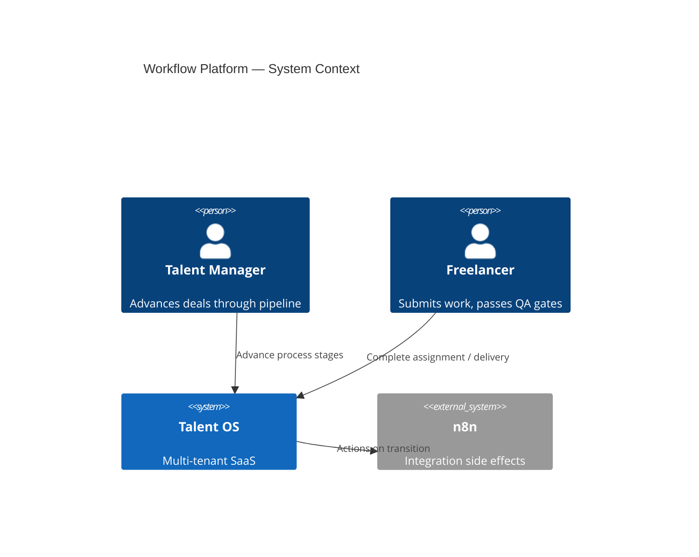
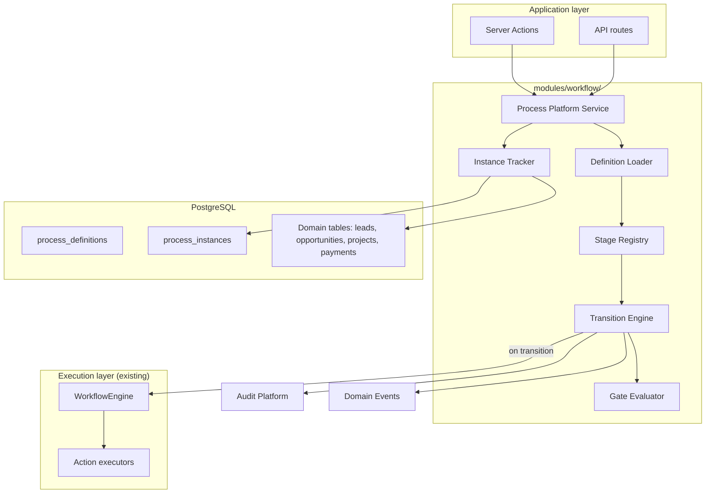
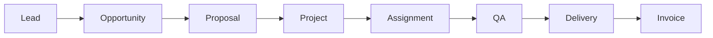
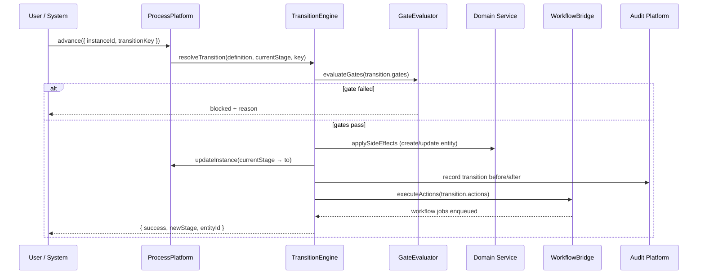
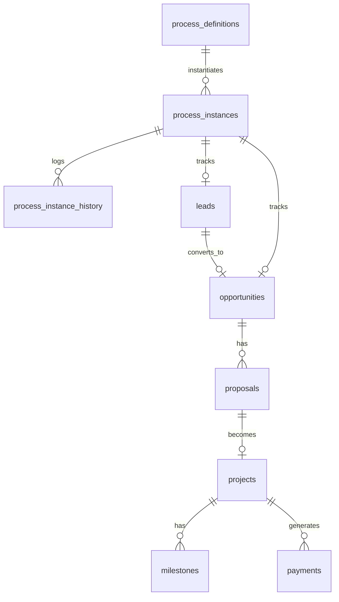

# Talent OS — Workflow Platform Architecture

**Document version:** 1.0.0  
**Classification:** Internal — Architecture  
**Author:** Platform Architecture  
**Date:** July 31, 2026  
**Status:** Draft — Awaiting approval  
**Scope:** Design only — no implementation in this document

---

## Table of Contents

1. [Executive Summary](#1-executive-summary)
2. [Platform Context](#2-platform-context)
3. [Process Flow](#3-process-flow)
4. [Current State Assessment](#4-current-state-assessment)
5. [Target Architecture Overview](#5-target-architecture-overview)
6. [Process Definition](#6-process-definition)
7. [Stages](#7-stages)
8. [Transitions](#8-transitions)
9. [Gates](#9-gates)
10. [Actions](#10-actions)
11. [Process Instances](#11-process-instances)
12. [Integration Points](#12-integration-points)
13. [Data Model](#13-data-model)
14. [Declarative Definition Format](#14-declarative-definition-format)
15. [API Surface](#15-api-surface)
16. [Folder Structure](#16-folder-structure)
17. [Design Decisions](#17-design-decisions)
18. [Migration Path](#18-migration-path)
19. [Relationship to Workflow Engine](#19-relationship-to-workflow-engine)

---

## 1. Executive Summary

Talent OS business operations follow a natural pipeline from first contact through payment. Today that pipeline is **implicit in code**: hard-coded status enums, service-layer `if` branches, and a TypeScript `WORKFLOW_REGISTRY` for async side effects. Adding a stage (e.g. **Proposal** between Opportunity and Project) requires code changes across services, UI, and events.

The **Workflow Platform** makes every process **declarative**:

```
Lead → Opportunity → Proposal → Project → Assignment → QA → Delivery → Invoice
```

Process definitions live in the database (versioned, org-overridable). The platform resolves **what stage comes next**, **what gates apply**, and **what actions fire** — application code calls `ProcessPlatform.advance()` instead of encoding transitions.

### Design goals

| Goal | Description |
|------|-------------|
| **Declarative pipelines** | Stages, transitions, gates, and actions defined in data — not `registry.ts` |
| **Single process API** | `ProcessPlatform` for lifecycle; existing engine for async execution |
| **Entity binding** | Each stage maps to a domain aggregate (lead, opportunity, project, payment, …) |
| **Tenant customization** | Enterprise orgs override transitions and gates without deploys |
| **Audit-grade** | Every transition emits [Audit Platform](./AUDIT_PLATFORM.md) records |
| **Event-compatible** | Transitions emit domain events for n8n, notifications, AI |
| **Backward compatible** | Default pipeline mirrors current Talent OS behavior |

### Relationship to existing docs

| Document | Relationship |
|----------|--------------|
| [Workflow Engine (current)](../31-workflow-engine.md) | Execution layer — actions, jobs, approvals (PR-W06 integrates) |
| [Platform Core](./PLATFORM_CORE.md) (PR-00) | Organization context, platform events |
| [Audit Platform](./AUDIT_PLATFORM.md) | before/after on every transition |
| [Billing Platform](./BILLING_PLATFORM.md) | Invoice stage links to SaaS + domain finance |
| [AI Implementation Roadmap](./AI_IMPLEMENTATION_ROADMAP.md) | Wave 0f — PR-W01 through PR-W08 |

---

## 2. Platform Context

### 2.1 System context



### 2.2 Container diagram



---

## 3. Process Flow

The **canonical Talent OS pipeline** models the full agency engagement lifecycle. Each box is a **stage**; arrows are **transitions** (declarative, not hard-coded).



| Stage | Domain meaning | Primary entity (Phase 1) | Exists today? |
|-------|----------------|----------------------------|:-------------:|
| **Lead** | Inbound interest, CRM prospect | `leads` (new) | No |
| **Opportunity** | Scoped gig / broadcast | `opportunities` | Yes |
| **Proposal** | Quote, SOW, client sign-off | `proposals` (new) | No |
| **Project** | Committed engagement | `projects` | Yes |
| **Assignment** | Freelancer bound to project | `project_assignments` / `freelancers` on project | Partial |
| **QA** | Review, revision, acceptance | `milestones` (`in_review`) | Partial |
| **Delivery** | Work accepted, ready to bill | `milestones` / `projects` (`completed`) | Partial |
| **Invoice** | Payment request / billing | `payments` | Yes |

Stages may **skip** (e.g. Lead → Opportunity for repeat clients) when declarative transition rules allow.

---

## 4. Current State Assessment

| Capability | Status | Location | Gap |
|------------|:------:|----------|-----|
| Process pipeline model | **0%** | — | Implicit in product flow |
| Declarative definitions | **0%** | `WORKFLOW_REGISTRY` in code | Hard-coded TypeScript |
| Stage registry | **20%** | Status enums scattered | No unified stage model |
| Transitions | **30%** | Service-layer status updates | Not declarative |
| Gates / approvals | **60%** | `approval_requests`, milestone flow | Not linked to pipeline |
| Async actions | **65%** | `lib/workflows/engine.ts` | Good foundation |
| Process instance tracking | **0%** | — | No cross-entity pipeline view |
| Lead entity | **0%** | — | Not in schema |
| Proposal entity | **0%** | — | Not in schema |
| Org-specific pipelines | **0%** | — | One-size-fits-all code |

**Overall workflow platform maturity: ~20%** (strong execution layer, weak declarative process layer)

---

## 5. Target Architecture Overview

The Workflow Platform splits into two layers:

| Layer | Responsibility | Location |
|-------|----------------|----------|
| **Process Platform** | Declarative stages, transitions, gates, instances | `modules/workflow/process/` (new) |
| **Execution Engine** | Async jobs, n8n, AI, notify, approvals | `lib/workflows/` (existing, refactored) |

Product code calls:

```typescript
await platform.process.advance({
  instanceId,
  transitionKey: 'opportunity_to_proposal',
  payload: { proposalAmount: 15000 },
})
```

—not `if (status === 'open') project.create(...)`.

### 5.1 Core services

| Service | Responsibility |
|---------|----------------|
| `ProcessDefinitionService` | Load/version process definitions (platform default + org override) |
| `StageRegistry` | Map stage keys → entity types, validators |
| `TransitionEngine` | Evaluate rules, run gates, mutate domain state, fire actions |
| `GateEvaluator` | Approval, role, field, entitlement checks |
| `ProcessInstanceService` | Track current stage per pipeline run |
| `WorkflowBridge` | Invoke Execution Engine on transition actions |

---

## 6. Process Definition

A **Process Definition** is the top-level declarative artifact — the full pipeline template.

### 6.1 Process definition entity

```
process_definitions
  id
  key (e.g. talent_os.default_pipeline)
  product_id (talent_os)
  name, description
  version (semver)
  status: draft | published | deprecated
  organization_id (NULL = platform default; UUID = org override)
  definition (jsonb) — full declarative spec (see §14)
  published_at, published_by
  created_at, updated_at
```

### 6.2 Default pipeline (platform)

| Field | Value |
|-------|-------|
| `key` | `talent_os.default_pipeline` |
| `version` | `1.0.0` |
| Stages | lead → opportunity → proposal → project → assignment → qa → delivery → invoice |
| `organization_id` | NULL |

Enterprise orgs clone and customize (add gate, skip proposal, extra QA round).

---

## 7. Stages

A **Stage** is a node in the pipeline bound to a domain entity type.

### 7.1 Stage specification (within definition JSON)

```typescript
interface ProcessStage {
  key: StageKey
  name: string
  entityType: string           // lead, opportunity, proposal, project, milestone, payment
  entryStatus?: string         // default status when entity enters stage
  terminal?: boolean           // pipeline ends (e.g. invoice paid)
  requiredFields?: string[]    // validation before leave
  permissions?: {
    advance?: string[]         // RBAC permissions
    view?: string[]
  }
}

type StageKey =
  | 'lead'
  | 'opportunity'
  | 'proposal'
  | 'project'
  | 'assignment'
  | 'qa'
  | 'delivery'
  | 'invoice'
```

### 7.2 Stage ↔ entity mapping (Phase 1)

| Stage | Entity table | Create on enter? |
|-------|--------------|------------------|
| `lead` | `leads` | Yes — PR-W02 |
| `opportunity` | `opportunities` | Promote from lead or create |
| `proposal` | `proposals` | Yes — linked to opportunity |
| `project` | `projects` | From accepted proposal |
| `assignment` | `project_freelancers` / assignment row | Bind freelancer |
| `qa` | `milestones` (status `in_review`) | Submission triggers enter |
| `delivery` | `milestones` / project `completed` | QA pass |
| `invoice` | `payments` | Auto-create draft payment |

### 7.3 Stage UI contract

Each stage exposes:

- **Current state** for process board (Kanban by stage)
- **Available transitions** from `TransitionEngine.getAvailable(instanceId)`
- **Blocked reason** if gate fails (shown to user)

---

## 8. Transitions

A **Transition** is a declarative edge between stages.

### 8.1 Transition specification

```typescript
interface ProcessTransition {
  key: string                  // opportunity_to_proposal
  from: StageKey | '*'         // * = any (e.g. cancel)
  to: StageKey
  label: string                // UI button text
  conditions?: WorkflowCondition[]  // reuse existing condition evaluator
  gates?: GateRef[]
  actions?: ActionRef[]        // fire on success
  sideEffects?: {
    createEntity?: string      // entity type to create
    linkParent?: boolean
    emitEvent?: string
  }
  auto?: boolean               // system-triggered (cron, webhook)
}
```

### 8.2 Example transitions (default pipeline)

| Key | From → To | Trigger |
|-----|-----------|---------|
| `lead_qualify` | lead → opportunity | Manager qualifies lead |
| `opportunity_to_proposal` | opportunity → proposal | Scope agreed |
| `proposal_accept` | proposal → project | Client accepts SOW |
| `proposal_reject` | proposal → opportunity | Revise scope |
| `project_assign` | project → assignment | Freelancer selected |
| `assignment_start` | assignment → qa | Work submitted |
| `qa_pass` | qa → delivery | Manager approves milestone |
| `qa_revision` | qa → assignment | Revision requested |
| `delivery_invoice` | delivery → invoice | Create payment |
| `invoice_paid` | invoice → (terminal) | Payment marked paid |

### 8.3 Transition evaluation



---

## 9. Gates

**Gates** block transitions until conditions are met — human or automated.

### 9.1 Gate types

| Type | Purpose | Example |
|------|---------|---------|
| `approval` | Human sign-off | Manager approves proposal |
| `role` | RBAC | Only admin can skip proposal |
| `field` | Required data | Proposal must have `amount` |
| `entitlement` | Plan feature | WhatsApp broadcast on opportunity |
| `expression` | JSON condition | `payload.score >= 0.8` |
| `external` | Webhook confirmation | Client e-sign complete |

### 9.2 Gate specification

```typescript
interface ProcessGate {
  key: string
  type: 'approval' | 'role' | 'field' | 'entitlement' | 'expression' | 'external'
  config: Record<string, unknown>
  skippable?: boolean          // Enterprise override
}

// Approval gate — delegates to existing approval_requests
{
  key: 'manager_proposal_approval',
  type: 'approval',
  config: {
    approverRole: 'tenant_admin',
    title: 'Approve proposal before project creation',
    expiresInHours: 168
  }
}
```

### 9.3 QA stage gates

The **QA** stage maps to existing milestone approval flow:

- Enter QA: `milestone.submitted` event
- Gate: manager approval (`wf-milestone-submitted` workflow)
- Pass: transition `qa_pass` → delivery
- Fail: transition `qa_revision` → assignment

Declarative definition **references** existing workflow by id — no duplicate logic.

---

## 10. Actions

**Actions** are side effects that run **after** a successful transition. They delegate to the **Execution Engine** (existing `lib/workflows/`).

### 10.1 Action types (reuse execution layer)

| Action | Execution engine handler | When |
|--------|-------------------------|------|
| `dispatch_n8n` | `actions.dispatchN8n` | Integrations |
| `execute_ai` | `actions.executeAi` | Match, brief parse |
| `notify` | `actions.notify` | In-app + email |
| `emit_event` | Domain outbox | Downstream workflows |
| `audit` | Audit Platform | Always on transition |
| `create_payment` | Finance service | Enter invoice stage |
| `webhook` | Outbound webhook | Enterprise |

### 10.2 Declarative action ref

```typescript
interface ActionRef {
  action: WorkflowActionType
  config?: Record<string, unknown>
  queue?: WorkflowQueue
  runAsync?: boolean           // default true — enqueue job
}
```

Example — opportunity → proposal:

```json
{
  "key": "opportunity_to_proposal",
  "from": "opportunity",
  "to": "proposal",
  "gates": [{ "key": "scope_complete", "type": "field", "config": { "fields": ["brief", "budget"] } }],
  "actions": [
    { "action": "emit_event", "config": { "eventType": "proposal.created" } },
    { "action": "notify", "config": { "type": "proposal_ready" } }
  ],
  "sideEffects": { "createEntity": "proposal", "linkParent": true }
}
```

### 10.3 Action vs transition

| Aspect | Transition | Action |
|--------|--------------|--------|
| **Sync** | Yes — blocks user until domain state updated | Async by default (job queue) |
| **Mutates pipeline** | Moves process instance stage | Side effects only |
| **Required** | One per user advance | Zero or many |

---

## 11. Process Instances

A **Process Instance** tracks one entity's journey through the pipeline.

### 11.1 Process instance entity

```
process_instances
  id
  organization_id
  process_definition_id
  process_version
  current_stage         StageKey
  status: active | completed | canceled | blocked
  root_entity_type      -- lead or opportunity (pipeline entry)
  root_entity_id
  current_entity_type   -- entity at current stage
  current_entity_id
  context (jsonb)       -- cross-stage data (client_id, amounts, freelancer_id)
  started_at
  completed_at (nullable)
  blocked_reason (nullable)
  correlation_id
  created_at, updated_at

process_instance_history
  id
  instance_id
  from_stage
  to_stage
  transition_key
  actor_type, actor_id
  occurred_at
  metadata (jsonb)
```

### 11.2 Pipeline board query

```typescript
// Kanban: group active instances by current_stage
const board = await platform.process.getBoard(organizationId, {
  processKey: 'talent_os.default_pipeline',
})
// { lead: [...], opportunity: [...], proposal: [...], ... }
```

### 11.3 Correlation across stages

`context` jsonb carries forward:

```json
{
  "company_id": "…",
  "lead_id": "…",
  "opportunity_id": "…",
  "proposal_id": "…",
  "project_id": "…",
  "freelancer_id": "…",
  "milestone_id": "…",
  "payment_id": "…"
}
```

Enables full pipeline timeline in admin UI and audit export.

---

## 12. Integration Points

### 12.1 Platform Core (PR-00)

- `OrganizationContext` on every advance
- Platform events: `process.stage_entered`, `process.transition_completed`
- Product registry: pipeline per product (`talent_os` default)

### 12.2 Audit Platform (PR-A)

Every transition:

```typescript
audit.record({
  action: 'process.transition',
  object: { type: 'process_instance', id: instanceId },
  before: { stage: fromStage, entityId: beforeEntityId },
  after: { stage: toStage, entityId: afterEntityId },
  source: { channel: 'server_action', detail: transitionKey },
})
```

### 12.3 Domain events (existing outbox)

Transitions emit typed events for backward compatibility:

| Transition | Domain event |
|------------|--------------|
| Enter opportunity | `opportunity.opened` |
| Enter assignment | `project.assigned` |
| Enter QA | `milestone.submitted` |
| QA pass | `milestone.approved` |
| Enter invoice | `payment.created` |

Existing `WORKFLOW_REGISTRY` entries continue to trigger from these events during migration; eventually actions attach directly to transition definitions.

### 12.4 Billing Platform

- **Invoice** stage creates domain `payments` row (freelancer payout)
- SaaS billing (`billing_invoices`) remains separate — see [BILLING_PLATFORM.md](./BILLING_PLATFORM.md)

### 12.5 AI Platform

- **Opportunity** stage: optional `execute_ai` action on enter (`ai.match_requested`)
- **Proposal** stage: `ai.brief_parse_requested` for SOW generation
- Gates may require AI match score threshold (expression gate)

### 12.6 Feature Flags

| Flag | Purpose |
|------|---------|
| `process.proposal_stage.enabled` | Toggle proposal stage (skip to project) |
| `process.lead_stage.enabled` | CRM lead stage |
| `process.declarative.enabled` | Cutover from hard-coded paths |

---

## 13. Data Model

### 13.1 New domain tables (PR-W02)

```
leads
  id, organization_id
  company_name, contact_name, contact_email
  source (inbound, referral, event)
  status: new | qualified | converted | lost
  notes, metadata (jsonb)
  created_at, updated_at

proposals
  id, organization_id
  opportunity_id (FK)
  title, scope_summary
  amount_cents, currency
  status: draft | sent | accepted | rejected | expired
  valid_until
  document_url (nullable)
  created_at, updated_at
```

### 13.2 ER diagram



### 13.3 Migration

PR-W01: `034_workflow_platform.sql` (after `033_audit_platform`)

Tables:

1. `process_definitions`
2. `process_instances`
3. `process_instance_history`
4. `leads` (PR-W02)
5. `proposals` (PR-W02)

Seed: `talent_os.default_pipeline` v1.0.0 definition JSON.

---

## 14. Declarative Definition Format

Full pipeline spec stored in `process_definitions.definition`:

```yaml
# talent_os.default_pipeline v1.0.0 (YAML authoring; stored as JSONB)
process:
  key: talent_os.default_pipeline
  version: 1.0.0
  product_id: talent_os

stages:
  - key: lead
    name: Lead
    entityType: lead
    entryStatus: new
  - key: opportunity
    name: Opportunity
    entityType: opportunity
    entryStatus: draft
  - key: proposal
    name: Proposal
    entityType: proposal
    entryStatus: draft
  - key: project
    name: Project
    entityType: project
    entryStatus: draft
  - key: assignment
    name: Assignment
    entityType: project_assignment
  - key: qa
    name: QA
    entityType: milestone
    entryStatus: in_review
  - key: delivery
    name: Delivery
    entityType: milestone
    entryStatus: approved
  - key: invoice
    name: Invoice
    entityType: payment
    entryStatus: pending
    terminal: true

transitions:
  - key: lead_qualify
    from: lead
    to: opportunity
    label: Qualify lead
    conditions:
      - field: lead.status
        operator: eq
        value: new
    sideEffects:
      createEntity: opportunity
      emitEvent: opportunity.opened

  - key: opportunity_to_proposal
    from: opportunity
    to: proposal
    label: Create proposal
    gates:
      - key: scope_complete
        type: field
        config: { entity: opportunity, fields: [brief, budget] }
    actions:
      - action: execute_ai
        config: { feature: brief_parse }
    sideEffects:
      createEntity: proposal

  - key: proposal_accept
    from: proposal
    to: project
    label: Accept proposal
    gates:
      - key: client_accept
        type: approval
        config: { approverRole: tenant_admin }
    sideEffects:
      createEntity: project
      emitEvent: project.created

  - key: project_assign
    from: project
    to: assignment
    label: Assign freelancer
    sideEffects:
      emitEvent: project.assigned

  - key: assignment_submit
    from: assignment
    to: qa
    label: Submit for review
    sideEffects:
      emitEvent: milestone.submitted

  - key: qa_pass
    from: qa
    to: delivery
    label: Approve work
    gates:
      - key: manager_qa
        type: approval
        config: { approverRole: project_manager }
    sideEffects:
      emitEvent: milestone.approved

  - key: qa_revision
    from: qa
    to: assignment
    label: Request revision
    sideEffects:
      emitEvent: milestone.revision_requested

  - key: delivery_invoice
    from: delivery
    to: invoice
    label: Create invoice
    actions:
      - action: create_payment
    sideEffects:
      createEntity: payment

  - key: invoice_complete
    from: invoice
    to: invoice
    label: Mark paid
    conditions:
      - field: payment.status
        operator: eq
        value: paid
    sideEffects:
      emitEvent: payment.paid
```

### 14.1 Authoring workflow

1. Edit YAML in `processes/talent_os/default.pipeline.yaml` (repo)
2. CI validates schema (`process-definition.schema.json`)
3. Publish via admin API or migration seed → `process_definitions`
4. Runtime loads **published** version only

Org overrides: clone platform definition, edit transitions, publish org-scoped version.

---

## 15. API Surface

| Method | Route | Permission | Purpose |
|--------|-------|------------|---------|
| GET | `/api/process/definitions` | manager | List published definitions |
| GET | `/api/process/definitions/:key` | manager | Get definition + stages |
| POST | `/api/process/instances` | manager | Start pipeline (from lead or opportunity) |
| GET | `/api/process/instances/:id` | manager | Instance detail + history |
| GET | `/api/process/instances/:id/transitions` | manager | Available next transitions |
| POST | `/api/process/instances/:id/advance` | manager | Execute transition |
| GET | `/api/process/board` | manager | Kanban board by stage |
| POST | `/api/process/definitions/:key/publish` | admin | Publish draft definition (Enterprise) |

SDK:

```typescript
const instance = await platform.process.start({
  processKey: 'talent_os.default_pipeline',
  entryStage: 'lead',
  entity: { companyName: 'Acme', contactEmail: '…' },
})

await platform.process.advance({
  instanceId: instance.id,
  transitionKey: 'lead_qualify',
})
```

---

## 16. Folder Structure

```
modules/workflow/
├── index.ts
├── process/                    # Workflow Platform (declarative)
│   ├── types/
│   │   ├── definition.ts
│   │   ├── stage.ts
│   │   └── transition.ts
│   ├── definition/
│   │   ├── loader.ts
│   │   ├── validator.ts
│   │   └── schema.json
│   ├── stages/
│   │   └── registry.ts
│   ├── transitions/
│   │   └── engine.ts
│   ├── gates/
│   │   └── evaluator.ts
│   ├── instances/
│   │   └── service.ts
│   ├── bridge/
│   │   └── workflow-bridge.ts  # → lib/workflows/engine
│   └── sdk/
│       └── process-client.ts
├── execution/                  # Existing engine (moved/refactored)
│   ├── types.ts
│   ├── registry.ts             # Legacy event workflows during migration
│   ├── conditions.ts
│   ├── actions.ts
│   └── engine.ts
└── processes/                  # Authoring
    └── talent_os/
        └── default.pipeline.yaml

lib/repositories/
├── process-definition.repository.ts
├── process-instance.repository.ts
├── lead.repository.ts
└── proposal.repository.ts

app/api/process/
├── definitions/route.ts
├── instances/route.ts
├── instances/[id]/advance/route.ts
└── board/route.ts
```

---

## 17. Design Decisions

### ADR-WF01: Declarative process vs hard-coded registry

**Decision:** Business pipeline in `process_definitions` JSONB; `WORKFLOW_REGISTRY` remains for non-pipeline event workflows during migration.  
**Rationale:** User requirement — every process stage declarative; code deploy not needed for pipeline changes.  
**Consequence:** Dual path until PR-W08 completes migration.

### ADR-WF02: Process Platform + Execution Engine split

**Decision:** Two layers — Process Platform (sync transitions) + Execution Engine (async actions).  
**Rationale:** Transition must complete atomically; n8n/AI can be async.  
**Consequence:** `WorkflowBridge` enqueues jobs after successful transition.

### ADR-WF03: Add Lead and Proposal entities

**Decision:** New `leads` and `proposals` tables for missing stages.  
**Rationale:** Pipeline completeness; CRM and SOW are first-class, not metadata hacks.  
**Consequence:** New domain services; optional stages via feature flags for gradual rollout.

### ADR-WF04: Reuse condition evaluator from execution layer

**Decision:** `WorkflowCondition` type shared between process transitions and event workflows.  
**Rationale:** DRY; proven evaluator in `lib/workflows/conditions.ts`.  
**Consequence:** Move shared types to `modules/workflow/types/`.

### ADR-WF05: Process instance is the pipeline spine

**Decision:** One `process_instance` links all stage entities via `context` jsonb.  
**Rationale:** Single query for full deal timeline; board view by `current_stage`.  
**Consequence:** Entities must register ids into context on each transition.

### ADR-WF06: Default pipeline mirrors current behavior

**Decision:** v1.0.0 definition reproduces existing opportunity → project → milestone → payment flow; lead/proposal optional via flags.  
**Rationale:** No breaking change on cutover.  
**Consequence:** Orgs with `process.lead_stage.enabled=false` start at opportunity.

---

## 18. Migration Path

| Phase | PRs | Outcome |
|-------|-----|---------|
| **Schema** | PR-W01, PR-W02 | Definitions, instances, leads, proposals |
| **Engine** | PR-W03, PR-W04, PR-W05 | Transition + gate evaluation |
| **Integration** | PR-W06, PR-W07 | Workflow bridge, API, board |
| **Cutover** | PR-W08 | Migrate registry; deprecate hard-coded status jumps |

Backfill: existing projects get `process_instances` created at equivalent stage inferred from status.

---

## 19. Relationship to Workflow Engine

| Aspect | Workflow Platform (new) | Execution Engine (existing) |
|--------|-------------------------|----------------------------|
| **Purpose** | Business pipeline lifecycle | Async side effects |
| **Trigger** | User `advance()` or system auto-transition | Domain events, transition actions |
| **Definition** | `process_definitions` DB | `WORKFLOW_REGISTRY` → migrates to action templates |
| **Sync/async** | Sync transition + async actions | Async jobs |
| **Tables** | `process_*`, `leads`, `proposals` | `workflow_runs`, `workflow_jobs`, `approval_requests` |
| **Human gates** | Process gates (approval type) | Approval steps in workflows |

Long term: event-triggered workflows become **action libraries** referenced by transition definitions. n8n remains integration transport for `dispatch_n8n` actions.

---

## Appendix A — Implementation roadmap

See [AI_IMPLEMENTATION_ROADMAP.md](./AI_IMPLEMENTATION_ROADMAP.md) **Wave 0f — Workflow Platform** (PR-W01 through PR-W08).

**Critical path:**

```
PR-00 → PR-W01 → PR-W02 → PR-W03 → PR-W04 → PR-W05 → PR-W06 → PR-W07 → PR-W08
PR-W06 → existing lib/workflows/engine.ts
PR-W05 → PR-A04 (audit on transition)
PR-W08 → deprecate hard-coded status transitions in project/opportunity services
```

---

**Status: Draft — Awaiting approval — no code in this document.**

*End of Workflow Platform Architecture v1.0.0*
