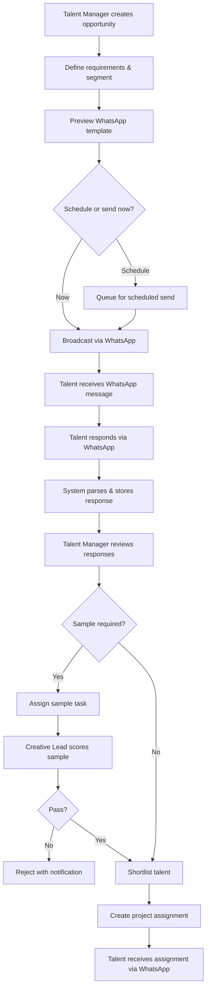
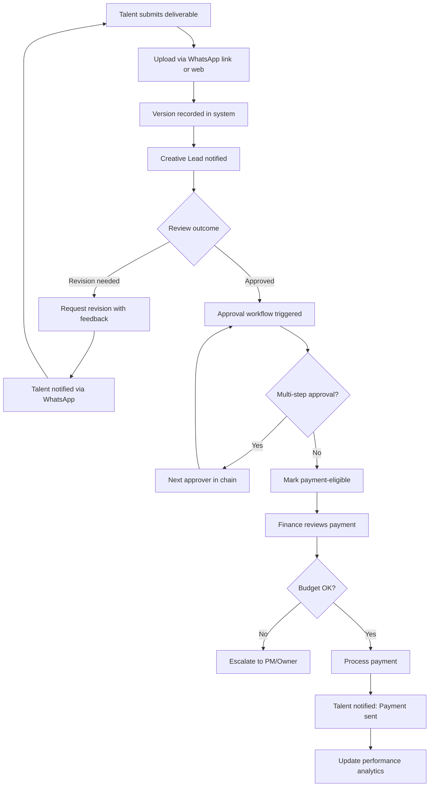
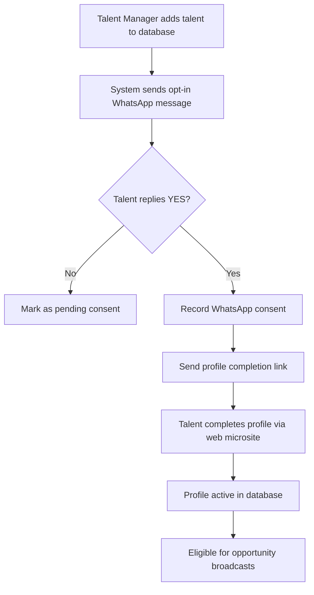
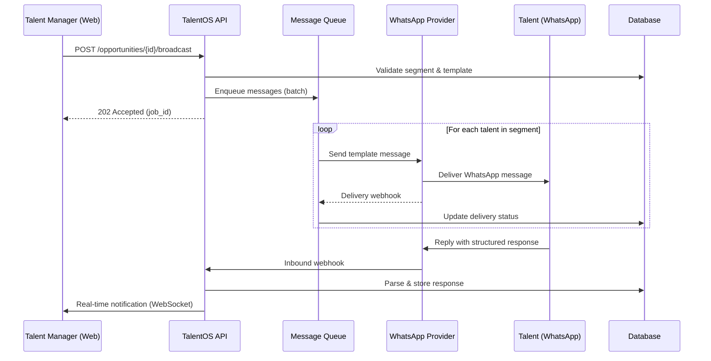
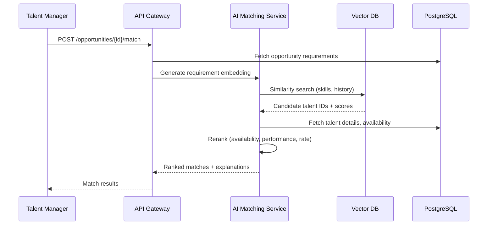
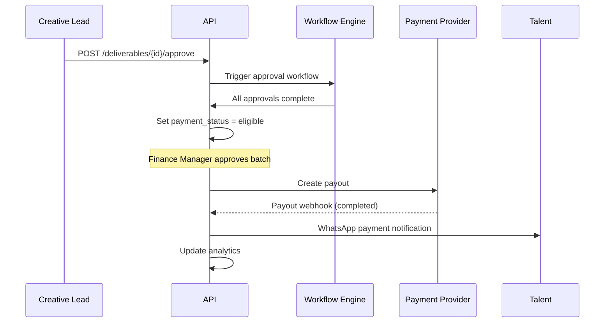
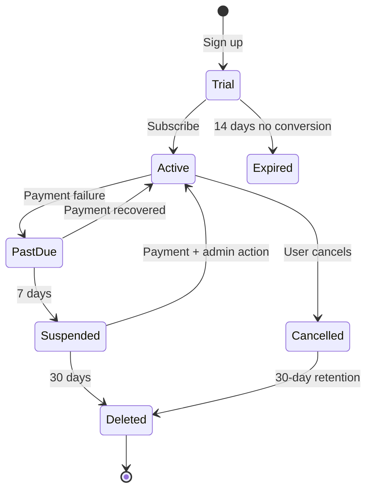

# TalentOS — Product Requirements Document

| Field | Value |
|-------|-------|
| **Document Version** | 1.0.0 |
| **Status** | Draft for Review |
| **Product** | TalentOS |
| **Category** | WhatsApp-First Workforce Operating System |
| **Author** | Product & Architecture Team |
| **Last Updated** | 2026-07-01 |
| **Classification** | Internal — Confidential |

---

## Table of Contents

1. [Executive Summary](#1-executive-summary)
2. [Problem Statement](#2-problem-statement)
3. [Business Opportunity](#3-business-opportunity)
4. [Market Analysis](#4-market-analysis)
5. [Target Customers](#5-target-customers)
6. [Customer Personas](#6-customer-personas)
7. [User Roles](#7-user-roles)
8. [User Stories](#8-user-stories)
9. [Functional Requirements](#9-functional-requirements)
10. [Non-Functional Requirements](#10-non-functional-requirements)
11. [Success Metrics](#11-success-metrics)
12. [User Flows](#12-user-flows)
13. [System Flows](#13-system-flows)
14. [Business Rules](#14-business-rules)
15. [Edge Cases](#15-edge-cases)
16. [Risk Analysis](#16-risk-analysis)
17. [Competitive Analysis](#17-competitive-analysis)
18. [Multi-Tenant SaaS Design](#18-multi-tenant-saas-design)
19. [Future Roadmap](#19-future-roadmap)
20. [Reporting Requirements](#20-reporting-requirements)
21. [Workflow Automation Requirements](#21-workflow-automation-requirements)
22. [AI Requirements](#22-ai-requirements)
23. [Integration Requirements](#23-integration-requirements)
24. [Monitoring Requirements](#24-monitoring-requirements)
25. [Scalability Requirements](#25-scalability-requirements)

**Technical Appendices**

- [Appendix A: Database Design](./appendices/A-database-design.md)
- [Appendix B: API Design](./appendices/B-api-design.md)
- [Appendix C: Security Architecture](./appendices/C-security-architecture.md)
- [Appendix D: Permissions Architecture](./appendices/D-permissions-architecture.md)
- [Appendix E: Audit Logging Design](./appendices/E-audit-logging-design.md)
- [Appendix F: Technical Architecture](./appendices/F-technical-architecture.md)
- [Appendix G: Deployment & Infrastructure](./appendices/G-deployment-infrastructure.md)

---

## 1. Executive Summary

**TalentOS** is a WhatsApp-first workforce operating system (WFOS) that unifies talent discovery, engagement, project execution, payments, and performance analytics into a single multi-tenant SaaS platform. Built for creative agencies, SaaS companies, AI startups, content studios, podcast businesses, YouTube companies, and distributed remote teams, TalentOS replaces fragmented spreadsheets, email threads, Slack DMs, and manual WhatsApp group coordination with a governed, auditable, AI-augmented talent lifecycle.

### Vision

Become the default operating system for creative and knowledge-work talent management — where every hire, gig, deliverable, revision, and payment flows through a single platform anchored on the communication channel talent already uses: WhatsApp.

### Strategic Pillars

| Pillar | Description |
|--------|-------------|
| **WhatsApp-Native** | Primary interaction surface for talent; web dashboard for operators |
| **Lifecycle Coverage** | End-to-end from discovery through payment and analytics |
| **AI-Augmented Matching** | Semantic skill matching, capacity forecasting, quality scoring |
| **Enterprise Governance** | RBAC, audit trails, compliance-ready data residency |
| **Multi-Tenant SaaS** | Isolated workspaces with shared infrastructure economics |

### MVP Scope (Phase 1)

- Talent database with rich profiles and tagging
- Opportunity broadcasting via WhatsApp templates
- Response collection and shortlisting
- Project assignment with task tracking
- Deliverable submission and revision workflow
- Basic approval and payment status tracking
- Web admin dashboard + WhatsApp talent interface
- Single-region deployment with 3 pricing tiers

### Out of Scope (Phase 1)

- Full payroll/tax compliance engine
- Native video editing or asset management
- Marketplace/public talent pool across tenants
- White-label mobile apps

---

## 2. Problem Statement

### 2.1 Current State Pain Points

Creative and remote-first organizations manage talent through a patchwork of tools:

| Pain Point | Impact |
|------------|--------|
| **Fragmented communication** | Opportunities sent via WhatsApp groups, responses lost in threads, no structured capture |
| **No single source of truth** | Talent data scattered across spreadsheets, Notion, Airtable, and CRMs |
| **Manual shortlisting** | Operators manually compare responses; bias and inconsistency increase |
| **Opaque project status** | No unified view of who is working on what, capacity, or deadlines |
| **Revision chaos** | Feedback loops via chat with no version control or approval gates |
| **Payment disputes** | Deliverable approval disconnected from invoicing and payout |
| **No performance history** | Repeat hiring decisions lack data; top performers not systematically retained |
| **Capacity blindness** | Resource planning done ad hoc; overallocation causes missed deadlines |

### 2.2 Root Cause

Existing HRIS, project management, and freelancer marketplace tools were not designed for:

1. High-velocity, project-based creative work
2. WhatsApp as the primary talent communication channel (especially in LATAM, MENA, South Asia, Africa)
3. Sample-then-hire evaluation workflows common in content and design
4. Multi-stakeholder approval chains with revision cycles

### 2.3 Problem Statement (Formal)

> Creative and remote-first organizations lack a unified workforce operating system that meets talent where they communicate (WhatsApp), governs the full talent lifecycle from discovery to payment, and provides AI-driven matching and capacity intelligence — resulting in operational inefficiency, hiring risk, payment disputes, and inability to scale talent operations.

---

## 3. Business Opportunity

### 3.1 Value Proposition

| Stakeholder | Value |
|-------------|-------|
| **Operations / Talent Managers** | 60–80% reduction in coordination overhead; structured pipelines |
| **Finance** | Approval-gated payments; auditable deliverable-to-payment linkage |
| **Creative Directors** | Quality-controlled revision workflows; performance history |
| **Talent (Freelancers)** | Single WhatsApp interface; faster payments; clear briefs |
| **Executives** | Capacity dashboards; cost-per-deliverable analytics |

### 3.2 Revenue Model

| Tier | Price (USD/mo) | Seats | Active Talent | Key Features |
|------|----------------|-------|---------------|--------------|
| **Starter** | $99 | 3 | 50 | Core lifecycle, WhatsApp, basic analytics |
| **Growth** | $399 | 15 | 500 | AI matching, automations, integrations |
| **Enterprise** | Custom | Unlimited | Unlimited | SSO, custom SLA, data residency, API |

**Add-ons:** WhatsApp message overage ($0.02/msg), AI matching credits, payment processing fee passthrough (1.5%).

### 3.3 Unit Economics Targets (Year 2)

- **CAC:** < $800 (Growth tier)
- **LTV:** > $12,000 (24-month retention at Growth)
- **Gross Margin:** > 75%
- **Net Revenue Retention:** > 115%

---

## 4. Market Analysis

### 4.1 Total Addressable Market (TAM)

| Segment | Est. Global Spend | TalentOS Relevance |
|---------|-------------------|-------------------|
| Freelance management platforms | $6.5B (2025) | High |
| Creative agency ops software | $2.1B | High |
| Workforce management (SMB) | $8.3B | Medium |
| WhatsApp Business API ecosystem | $4.2B | Enabler |

**TAM Estimate:** ~$4.8B (intersection of creative workforce ops + messaging-first SMB)

### 4.2 Serviceable Addressable Market (SAM)

- 2.4M creative agencies, content studios, and remote-first SMBs globally
- 680K use WhatsApp as primary external comms channel
- Average willingness to pay: $250–$600/month for unified talent ops

**SAM Estimate:** ~$1.2B

### 4.3 Serviceable Obtainable Market (SOM) — 5-Year

- Target: 8,000 paying workspaces
- Blended ARPU: $320/month
- **SOM Year 5 ARR:** ~$30.7M

### 4.4 Market Trends

1. **WhatsApp Business API adoption** growing 34% YoY in emerging markets
2. **Creator economy** expanding; studios need scalable talent benches
3. **AI-native startups** hiring specialized contractors at high velocity
4. **Remote work permanence** driving async, messaging-first workflows
5. **Compliance pressure** on contractor classification and payment audit trails

---

## 5. Target Customers

### 5.1 Primary Segments

| Segment | Size | Fit Score | Key Need |
|---------|------|-----------|----------|
| Creative agencies (5–50 FTE) | Large | ★★★★★ | Bench management, client delivery |
| Content studios / podcast networks | Medium | ★★★★★ | Episode/production talent rotation |
| YouTube / media companies | Medium | ★★★★☆ | Editor, thumbnail, script talent pools |
| SaaS startups (remote) | Large | ★★★★☆ | Design, content, QA contractors |
| AI startups | Growing | ★★★★★ | Prompt engineers, annotators, reviewers |

### 5.2 Ideal Customer Profile (ICP)

- **Company size:** 5–200 employees
- **External talent count:** 20–500 active contractors
- **Geography:** Global; talent concentrated in LATAM, India, Philippines, Eastern Europe, MENA
- **Tech maturity:** Uses Slack/Notion; comfortable with SaaS; WhatsApp for talent
- **Pain trigger:** Missed deadline due to talent coordination; payment dispute; scaling content output

### 5.3 Anti-Personas (Low Fit)

- Enterprise with strict on-prem-only requirements (Phase 1)
- Companies with < 5 external talent relationships
- Industries requiring cleared/full-time W-2 workforce only (government defense)

---

## 6. Customer Personas

### Persona 1: Priya — Talent Operations Manager

| Attribute | Detail |
|-----------|--------|
| **Role** | Head of Talent Ops, 40-person content agency |
| **Age** | 32 |
| **Goals** | Fill roles in < 24 hours; maintain quality bench; reduce coordinator burnout |
| **Frustrations** | 200+ WhatsApp messages/day; no visibility into who responded |
| **Tools Today** | Google Sheets, WhatsApp, Airtable, Slack |
| **TalentOS Jobs** | Broadcast opportunities, shortlist, assign projects, track deliverables |
| **Success Criteria** | Time-to-fill ↓ 50%; response rate ↑ 30% |

### Persona 2: Marcus — Creative Director

| Attribute | Detail |
|-----------|--------|
| **Role** | CD at SaaS startup, manages brand and product design contractors |
| **Age** | 38 |
| **Goals** | Consistent brand output; fast revision cycles; retain top designers |
| **Frustrations** | Feedback lost in chat; no version history; re-hiring unknown quality |
| **TalentOS Jobs** | Review samples, approve deliverables, rate performance |
| **Success Criteria** | Revision rounds ↓ from 4 to 2; designer re-hire rate ↑ |

### Persona 3: Diego — Freelance Video Editor (Talent)

| Attribute | Detail |
|-----------|--------|
| **Role** | Independent editor, 6 agency clients |
| **Age** | 27 |
| **Location** | Buenos Aires |
| **Goals** | Steady work; clear briefs; fast payment |
| **Frustrations** | Missed opportunities in group chats; unclear revision requests; 60-day payment |
| **TalentOS Jobs** | Respond to opportunities, submit deliverables, track payment via WhatsApp |
| **Success Criteria** | Response acknowledgment < 1 min; payment within 7 days of approval |

### Persona 4: Sarah — Finance Controller

| Attribute | Detail |
|-----------|--------|
| **Role** | Controller, 80-person agency |
| **Age** | 41 |
| **Goals** | Audit-ready payment records; budget adherence; no surprise invoices |
| **Frustrations** | Payments made before deliverable approval; missing documentation |
| **TalentOS Jobs** | Configure approval gates, release payments, export for accounting |
| **Success Criteria** | 100% deliverable-payment linkage; month-end close -3 days |

### Persona 5: Alex — Founder / CEO

| Attribute | Detail |
|-----------|--------|
| **Role** | CEO, AI startup, 25 employees, 150 contractors |
| **Age** | 35 |
| **Goals** | Scale output without scaling ops headcount; data-driven hiring |
| **Frustrations** | No capacity view; flying blind on talent costs per project |
| **TalentOS Jobs** | Capacity dashboards, cost analytics, AI matching ROI |
| **Success Criteria** | Cost-per-deliverable visibility; 20% ops cost reduction |

---

## 7. User Roles

### 7.1 Role Hierarchy

```
Workspace Owner
├── Admin
│   ├── Talent Manager
│   ├── Project Manager
│   ├── Creative Lead / Approver
│   ├── Finance Manager
│   └── Analyst (Read-Only)
├── Member (Limited)
└── External: Talent (WhatsApp)
```

### 7.2 Role Definitions

| Role | Scope | Primary Capabilities |
|------|-------|---------------------|
| **Workspace Owner** | Full workspace | Billing, SSO, data export, role assignment, deletion |
| **Admin** | Full ops | All modules except billing/ownership transfer |
| **Talent Manager** | Talent lifecycle | Discovery, database, broadcast, shortlist, sample assignment |
| **Project Manager** | Execution | Projects, tasks, deliverables, revisions, comms tracking |
| **Creative Lead** | Quality gate | Approve/reject deliverables, revision requests, rate talent |
| **Finance Manager** | Payments | Payment workflows, invoices, export, budget caps |
| **Analyst** | Read-only | Reports, analytics, exports |
| **Member** | Scoped | View assigned projects only |
| **Talent** | Self-service | WhatsApp: respond, submit, view own history and payments |

### 7.3 Custom Roles (Enterprise)

Enterprise tenants may define custom roles by composing 47 atomic permissions (see Appendix D).

---

## 8. User Stories

### Epic 1: Talent Discovery & Database

| ID | Story | Acceptance Criteria |
|----|-------|---------------------|
| US-1.1 | As a Talent Manager, I want to import talent from CSV so that I can migrate existing databases | CSV mapping UI; duplicate detection; import audit log |
| US-1.2 | As a Talent Manager, I want to tag talent by skill, rate, availability, and timezone | Multi-tag support; faceted search; tag autocomplete |
| US-1.3 | As a Talent Manager, I want to discover talent via AI semantic search | Natural language query returns ranked results with explainability |
| US-1.4 | As a Talent Manager, I want to maintain talent profile versions | History of rate/skill changes with effective dates |

### Epic 2: Opportunity Broadcasting

| ID | Story | Acceptance Criteria |
|----|-------|---------------------|
| US-2.1 | As a Talent Manager, I want to broadcast an opportunity to a talent segment | Select segment; preview WhatsApp template; schedule send |
| US-2.2 | As a Talent Manager, I want to define opportunity requirements (skills, rate, deadline) | Structured form; validation; attached brief document |
| US-2.3 | As the system, I want to track delivery and read receipts | Per-recipient status: sent, delivered, read, failed |
| US-2.4 | As a Talent Manager, I want to set response deadline with auto-close | Auto-close at deadline; late responses flagged |

### Epic 3: Response & Shortlisting

| ID | Story | Acceptance Criteria |
|----|-------|---------------------|
| US-3.1 | As Talent, I want to respond to an opportunity via WhatsApp | Structured reply (availability, rate, portfolio link) parsed into system |
| US-3.2 | As a Talent Manager, I want to view all responses in a comparison table | Sortable by rate, score, response time |
| US-3.3 | As a Talent Manager, I want to shortlist candidates with notes | Shortlist status; internal notes not visible to talent |
| US-3.4 | As a Talent Manager, I want AI-recommended shortlist | Top N with confidence score and reasoning |

### Epic 4: Sample Assignment

| ID | Story | Acceptance Criteria |
|----|-------|---------------------|
| US-4.1 | As a Talent Manager, I want to assign paid/unpaid sample tasks | Sample brief; deadline; compensation flag |
| US-4.2 | As Talent, I want to submit sample via WhatsApp link | Upload or link; confirmation message |
| US-4.3 | As a Creative Lead, I want to score samples against rubric | Rubric criteria; numeric score; pass/fail |

### Epic 5: Project & Task Execution

| ID | Story | Acceptance Criteria |
|----|-------|---------------------|
| US-5.1 | As a Project Manager, I want to convert shortlist to project assignment | One-click assign; contract terms captured |
| US-5.2 | As a Project Manager, I want to create tasks with dependencies | Gantt/list view; dependency blocking |
| US-5.3 | As Talent, I want task reminders via WhatsApp | Configurable reminder cadence |
| US-5.4 | As a Project Manager, I want to track communication touchpoints | Auto-log WhatsApp messages; manual note entry |

### Epic 6: Deliverables & Revisions

| ID | Story | Acceptance Criteria |
|----|-------|---------------------|
| US-6.1 | As Talent, I want to submit deliverables with version numbers | File upload + metadata; version auto-increment |
| US-6.2 | As a Creative Lead, I want to request revisions with annotated feedback | Revision request creates new task; feedback attached |
| US-6.3 | As a Creative Lead, I want to set max revision rounds | System blocks beyond limit; escalation to PM |
| US-6.4 | As a Project Manager, I want deliverable status dashboard | Filter by project, talent, status, overdue |

### Epic 7: Approval & Payment

| ID | Story | Acceptance Criteria |
|----|-------|---------------------|
| US-7.1 | As a Creative Lead, I want to approve deliverables | Approval triggers payment eligibility |
| US-7.2 | As a Finance Manager, I want multi-step payment approval | Configurable approval chain; threshold rules |
| US-7.3 | As Talent, I want payment status notifications via WhatsApp | Status: pending, approved, processing, paid |
| US-7.4 | As a Finance Manager, I want to export payment batch for accounting | CSV/QuickBooks/Xero format |

### Epic 8: Analytics & AI

| ID | Story | Acceptance Criteria |
|----|-------|---------------------|
| US-8.1 | As a CEO, I want talent performance leaderboard | Composite score: quality, timeliness, revision rate |
| US-8.2 | As a Talent Manager, I want capacity heatmap by skill | Available hours vs. committed hours |
| US-8.3 | As a Talent Manager, I want AI match suggestions for new opportunities | Ranked list with skill gap analysis |
| US-8.4 | As an Analyst, I want cost-per-deliverable report | Drill-down by project, talent, skill |

---

## 9. Functional Requirements

### 9.1 Module: Talent Discovery (FR-TD)

| ID | Requirement | Priority |
|----|-------------|----------|
| FR-TD-001 | System shall support talent import via CSV, API, and manual entry | P0 |
| FR-TD-002 | System shall support faceted search (skill, rate, location, availability, rating) | P0 |
| FR-TD-003 | System shall support AI semantic search across profiles and work history | P1 |
| FR-TD-004 | System shall detect and merge duplicate talent records | P1 |
| FR-TD-005 | System shall support talent sourcing from public portfolio URLs | P2 |

### 9.2 Module: Talent Database (FR-DB)

| ID | Requirement | Priority |
|----|-------------|----------|
| FR-DB-001 | Talent profile shall include: identity, contact, skills, rates, portfolio, availability, performance score | P0 |
| FR-DB-002 | System shall maintain immutable audit trail of profile changes | P0 |
| FR-DB-003 | System shall support custom fields per workspace (up to 50) | P1 |
| FR-DB-004 | System shall support talent segments (static and dynamic) | P0 |
| FR-DB-005 | System shall support talent status: active, inactive, blocked, archived | P0 |

### 9.3 Module: Opportunity Broadcasting (FR-OB)

| ID | Requirement | Priority |
|----|-------------|----------|
| FR-OB-001 | System shall send WhatsApp template messages to talent segments | P0 |
| FR-OB-002 | System shall support scheduled and immediate broadcast | P0 |
| FR-OB-003 | System shall enforce WhatsApp template pre-approval compliance | P0 |
| FR-OB-004 | System shall track per-recipient delivery status | P0 |
| FR-OB-005 | System shall support opportunity attachments (brief PDF, mood board link) | P1 |

### 9.4 Module: Talent Response Collection (FR-RC)

| ID | Requirement | Priority |
|----|-------------|----------|
| FR-RC-001 | System shall parse structured WhatsApp responses into opportunity responses | P0 |
| FR-RC-002 | System shall support response fields: availability, proposed rate, portfolio, notes | P0 |
| FR-RC-003 | System shall timestamp and attribute all responses | P0 |
| FR-RC-004 | System shall support web-based response for talent without WhatsApp | P2 |

### 9.5 Module: Shortlisting (FR-SL)

| ID | Requirement | Priority |
|----|-------------|----------|
| FR-SL-001 | System shall support shortlist stages: pool, shortlisted, rejected, on-hold | P0 |
| FR-SL-002 | System shall support collaborative shortlisting with internal comments | P1 |
| FR-SL-003 | System shall support AI-generated shortlist recommendations | P1 |
| FR-SL-004 | System shall notify talent of shortlist status change via WhatsApp | P0 |

### 9.6 Module: Sample Assignment (FR-SA)

| ID | Requirement | Priority |
|----|-------------|----------|
| FR-SA-001 | System shall create sample assignments with brief, deadline, compensation | P0 |
| FR-SA-002 | System shall support sample scoring rubrics | P1 |
| FR-SA-003 | System shall link sample results to talent performance score | P1 |

### 9.7 Module: Project Assignment (FR-PA)

| ID | Requirement | Priority |
|----|-------------|----------|
| FR-PA-001 | System shall create projects from approved shortlist or direct assignment | P0 |
| FR-PA-002 | Project shall capture: scope, budget, timeline, assigned talent, contract terms | P0 |
| FR-PA-003 | System shall support project templates for recurring work types | P1 |
| FR-PA-004 | System shall support multi-talent projects | P0 |

### 9.8 Module: Task Tracking (FR-TT)

| ID | Requirement | Priority |
|----|-------------|----------|
| FR-TT-001 | System shall support tasks with status, assignee, due date, priority | P0 |
| FR-TT-002 | System shall support task dependencies | P1 |
| FR-TT-003 | System shall send WhatsApp reminders for upcoming/overdue tasks | P0 |
| FR-TT-004 | System shall support task templates | P1 |

### 9.9 Module: Communication Tracking (FR-CT)

| ID | Requirement | Priority |
|----|-------------|----------|
| FR-CT-001 | System shall auto-ingest WhatsApp messages linked to projects/talent | P0 |
| FR-CT-002 | System shall support manual communication log entries | P1 |
| FR-CT-003 | System shall display unified communication timeline per talent/project | P0 |
| FR-CT-004 | System shall support @mention notifications in web UI | P2 |

### 9.10 Module: Deliverable Submission (FR-DS)

| ID | Requirement | Priority |
|----|-------------|----------|
| FR-DS-001 | System shall accept file uploads up to 500MB per deliverable | P0 |
| FR-DS-002 | System shall version deliverables automatically | P0 |
| FR-DS-003 | System shall support external link submissions (Google Drive, Figma) | P1 |
| FR-DS-004 | Talent shall submit via WhatsApp deep link or web portal | P0 |

### 9.11 Module: Revision Management (FR-RM)

| ID | Requirement | Priority |
|----|-------------|----------|
| FR-RM-001 | System shall support revision requests with structured feedback | P0 |
| FR-RM-002 | System shall enforce configurable max revision rounds per project | P0 |
| FR-RM-003 | System shall track revision turnaround time | P1 |
| FR-RM-004 | System shall support side-by-side version comparison (images/docs) | P2 |

### 9.12 Module: Approval Workflow (FR-AW)

| ID | Requirement | Priority |
|----|-------------|----------|
| FR-AW-001 | System shall support configurable approval chains (sequential/parallel) | P0 |
| FR-AW-002 | Approval shall require authenticated approver action | P0 |
| FR-AW-003 | System shall support delegation and escalation on timeout | P1 |
| FR-AW-004 | Approved deliverables shall transition to payment-eligible state | P0 |

### 9.13 Module: Payment Workflow (FR-PW)

| ID | Requirement | Priority |
|----|-------------|----------|
| FR-PW-001 | System shall track payment lifecycle: eligible → approved → processing → paid | P0 |
| FR-PW-002 | System shall integrate with Stripe Connect / Wise / PayPal for payouts | P1 |
| FR-PW-003 | System shall support manual payment recording with proof upload | P0 |
| FR-PW-004 | System shall enforce budget caps at project and workspace level | P1 |
| FR-PW-005 | System shall generate payment audit report | P0 |

### 9.14 Module: Performance Analytics (FR-PA2)

| ID | Requirement | Priority |
|----|-------------|----------|
| FR-PA2-001 | System shall compute talent performance score (0–100) from quality, timeliness, revisions | P1 |
| FR-PA2-002 | System shall provide project health dashboard | P0 |
| FR-PA2-003 | System shall support custom report builder | P2 |
| FR-PA2-004 | System shall export reports to CSV, PDF | P0 |

### 9.15 Module: AI Matching (FR-AI)

| ID | Requirement | Priority |
|----|-------------|----------|
| FR-AI-001 | System shall rank talent for opportunities based on skills, history, availability | P1 |
| FR-AI-002 | System shall provide explainable match reasoning | P1 |
| FR-AI-003 | System shall learn from shortlist/assignment outcomes | P2 |
| FR-AI-004 | System shall support natural language opportunity description parsing | P1 |

### 9.16 Module: Resource Planning (FR-RP)

| ID | Requirement | Priority |
|----|-------------|----------|
| FR-RP-001 | System shall display talent availability calendar | P1 |
| FR-RP-002 | System shall forecast capacity by skill for upcoming 4/8/12 weeks | P1 |
| FR-RP-003 | System shall alert on overallocation | P1 |

### 9.17 Module: Workforce Capacity Management (FR-WC)

| ID | Requirement | Priority |
|----|-------------|----------|
| FR-WC-001 | System shall track committed vs. available hours per talent | P1 |
| FR-WC-002 | System shall support bench utilization metrics | P1 |
| FR-WC-003 | System shall recommend talent reallocation | P2 |

---

## 10. Non-Functional Requirements

### 10.1 Performance

| ID | Requirement | Target |
|----|-------------|--------|
| NFR-P-001 | API response time (p95) | < 300ms reads, < 800ms writes |
| NFR-P-002 | Web dashboard initial load | < 2s (p95) |
| NFR-P-003 | WhatsApp message dispatch latency | < 5s from trigger to provider handoff |
| NFR-P-004 | Search results | < 500ms for 100K talent records |
| NFR-P-005 | File upload | Support resumable uploads; 500MB in < 5 min on 50Mbps |

### 10.2 Availability & Reliability

| ID | Requirement | Target |
|----|-------------|--------|
| NFR-A-001 | Platform uptime (Growth/Enterprise) | 99.9% monthly |
| NFR-A-002 | WhatsApp message delivery | 99.5% success rate (excl. invalid numbers) |
| NFR-A-003 | RPO (Recovery Point Objective) | < 1 hour |
| NFR-A-004 | RTO (Recovery Time Objective) | < 4 hours |

### 10.3 Security

| ID | Requirement | Target |
|----|-------------|--------|
| NFR-S-001 | Data encryption at rest | AES-256 |
| NFR-S-004 | Data encryption in transit | TLS 1.3 |
| NFR-S-003 | Authentication | MFA required for Admin+; SSO (SAML/OIDC) Enterprise |
| NFR-S-004 | Penetration testing | Annual third-party; critical fixes < 72h |
| NFR-S-005 | SOC 2 Type II | Target within 18 months of GA |

### 10.4 Scalability

| ID | Requirement | Target |
|----|-------------|--------|
| NFR-SC-001 | Concurrent workspaces | 10,000+ |
| NFR-SC-002 | Talent records per workspace | 100,000 |
| NFR-SC-003 | WhatsApp messages per day (platform) | 5M |
| NFR-SC-004 | Horizontal scaling | Stateless services auto-scale on CPU/queue depth |

### 10.5 Usability

| ID | Requirement | Target |
|----|-------------|--------|
| NFR-U-001 | Talent WhatsApp interaction | ≤ 3 taps to respond to opportunity |
| NFR-U-002 | Web UI accessibility | WCAG 2.1 AA |
| NFR-U-003 | Mobile-responsive admin | Full functionality on tablet+ |

### 10.6 Compliance

| ID | Requirement | Target |
|----|-------------|--------|
| NFR-C-001 | GDPR | Right to erasure, portability, consent management |
| NFR-C-002 | WhatsApp/Meta policies | Template compliance, opt-out handling |
| NFR-C-003 | Data residency | EU region option (Enterprise) |

### 10.7 Maintainability

| ID | Requirement | Target |
|----|-------------|--------|
| NFR-M-001 | API versioning | Semantic versioning; 12-month deprecation |
| NFR-M-002 | Feature flags | All new features behind flags |
| NFR-M-003 | Documentation | OpenAPI 3.1 spec; 100% endpoint coverage |

---

## 11. Success Metrics

### 11.1 North Star Metric

**Deliverables Approved per Active Talent per Month** — measures platform value realization across the full lifecycle.

### 11.2 Product Metrics

| Metric | Baseline | Target (6 mo) | Target (12 mo) |
|--------|----------|---------------|----------------|
| Time-to-fill opportunity | 48 hours | 24 hours | 12 hours |
| WhatsApp response rate | 15% | 35% | 50% |
| Shortlist-to-assign conversion | 40% | 60% | 75% |
| Avg revision rounds | 3.5 | 2.5 | 2.0 |
| Payment cycle (approval to paid) | 21 days | 10 days | 7 days |
| Talent NPS | — | 40 | 55 |
| Operator NPS | — | 45 | 60 |

### 11.3 Business Metrics

| Metric | Target (12 mo) |
|--------|----------------|
| MRR | $500K |
| Paying workspaces | 1,200 |
| Logo churn (monthly) | < 3% |
| Expansion revenue % | > 25% of new MRR |
| Gross margin | > 75% |

### 11.4 Technical Metrics

| Metric | Target |
|--------|--------|
| API p95 latency | < 300ms |
| Error rate | < 0.1% |
| WhatsApp delivery success | > 99.5% |
| Mean time to detect (MTTD) | < 5 min |
| Mean time to resolve (P1) | < 2 hours |

---

## 12. User Flows

### 12.1 Flow: Opportunity to Assignment



### 12.2 Flow: Deliverable to Payment



### 12.3 Flow: Talent Onboarding (WhatsApp)



---

## 13. System Flows

### 13.1 Opportunity Broadcast System Flow



### 13.2 AI Matching System Flow



### 13.3 Payment Processing Flow



---

## 14. Business Rules

### 14.1 Talent Management Rules

| Rule ID | Rule | Enforcement |
|---------|------|-------------|
| BR-T-001 | Talent must opt in via WhatsApp before receiving broadcasts | Block broadcast to non-consented |
| BR-T-002 | Blocked talent cannot be assigned to projects or receive broadcasts | Hard block |
| BR-T-003 | Talent rate changes require effective date ≥ today | Validation on save |
| BR-T-004 | Duplicate talent (same phone OR same email) triggers merge review | Soft block on second create |

### 14.2 Opportunity Rules

| Rule ID | Rule | Enforcement |
|---------|------|-------------|
| BR-O-001 | Opportunity must have ≥ 1 required skill and response deadline | Validation |
| BR-O-002 | Broadcast only to talent with matching consent and active status | Filter |
| BR-O-003 | Response after deadline marked as "late" — excluded from auto-shortlist | Flag |
| BR-O-004 | Max 5,000 recipients per broadcast (configurable per tier) | Rate limit |

### 14.3 Project & Deliverable Rules

| Rule ID | Rule | Enforcement |
|---------|------|-------------|
| BR-P-001 | Project budget cannot be exceeded without Owner approval | Soft block + escalation |
| BR-P-002 | Deliverable must be linked to active task | Validation |
| BR-P-003 | Max revision rounds default = 3; configurable per project template | Counter |
| BR-P-004 | Deliverable approval requires all upstream task dependencies complete | Gate check |

### 14.4 Payment Rules

| Rule ID | Rule | Enforcement |
|---------|------|-------------|
| BR-PY-001 | Payment cannot be initiated without approved deliverable | Hard block |
| BR-PY-002 | Payment amount must match contracted rate ± approved change orders | Validation |
| BR-PY-003 | Finance approval required for payments > $1,000 (configurable) | Workflow gate |
| BR-PY-004 | Payment audit record is immutable once status = paid | Append-only |

### 14.5 WhatsApp Compliance Rules

| Rule ID | Rule | Enforcement |
|---------|------|-------------|
| BR-WA-001 | Only pre-approved Meta templates for outbound-initiated messages | Template validation |
| BR-WA-002 | 24-hour session window for free-form replies after talent message | Session tracking |
| BR-WA-003 | Opt-out keyword (STOP) immediately suppresses all broadcasts | Real-time suppression |
| BR-WA-004 | Broadcast rate: max 80 messages/second per workspace | Throttle |

---

## 15. Edge Cases

### 15.1 Communication Edge Cases

| Scenario | Expected Behavior |
|----------|-------------------|
| Talent responds in free text instead of structured format | NLP parser extracts fields; flag for manual review if confidence < 0.7 |
| Talent changes WhatsApp number | Phone verification flow; merge to existing profile on confirm |
| WhatsApp message delivery fails (invalid number) | Mark failed; notify Talent Manager; suggest alternate contact |
| Talent in different timezone misses deadline | Deadline stored in UTC; display in talent local time; grace period configurable |
| Duplicate response to same opportunity | Accept latest; archive previous; notify talent of overwrite |

### 15.2 Assignment Edge Cases

| Scenario | Expected Behavior |
|----------|-------------------|
| Talent declines assignment after accepting | Release capacity; trigger re-broadcast or shortlist next candidate |
| Talent assigned to overlapping projects exceeding capacity | Warning to PM; block if hard capacity limit set |
| Project cancelled mid-execution | Archive tasks; notify talent; handle partial payment per contract terms |
| Sample passed but talent unavailable for project | Keep on bench; PM selects alternate from shortlist |

### 15.3 Deliverable Edge Cases

| Scenario | Expected Behavior |
|----------|-------------------|
| File upload fails mid-transfer | Resumable upload; preserve partial; expire after 24h |
| Deliverable submitted after project end date | Accept but flag overdue; impact timeliness score |
| Approver on leave during approval chain | Auto-delegate per config; escalate after timeout |
| Max revisions exceeded | Block further revision requests; escalate to PM for exception |

### 15.4 Payment Edge Cases

| Scenario | Expected Behavior |
|----------|-------------------|
| Payment provider fails | Retry 3x with exponential backoff; notify Finance; hold in processing |
| Partial deliverable approval (milestone project) | Milestone-based payment eligibility per project config |
| Currency mismatch (talent paid in different currency) | FX rate locked at assignment; display both currencies |
| Tax documentation missing | Block payment; notify talent via WhatsApp with upload link |

### 15.5 Multi-Tenant Edge Cases

| Scenario | Expected Behavior |
|----------|-------------------|
| Same talent works for two workspaces | Separate profiles per tenant; shared phone with consent per tenant |
| Workspace deleted | 30-day soft delete; talent data anonymized per GDPR request |
| Tenant exceeds plan limits | Grace period 7 days; throttle non-critical features; upsell prompt |

---

## 16. Risk Analysis

### 16.1 Risk Register

| ID | Risk | Likelihood | Impact | Mitigation |
|----|------|------------|--------|------------|
| R-001 | WhatsApp API policy change restricts messaging | Medium | High | Multi-channel fallback (SMS, email); Meta BSP partnership |
| R-002 | Low talent WhatsApp adoption in specific markets | Low | Medium | Web portal parity for talent actions |
| R-003 | AI matching bias in recommendations | Medium | High | Explainability; human-in-loop; bias audits |
| R-004 | Payment fraud or duplicate payouts | Low | Critical | Idempotency keys; dual approval; immutable audit |
| R-005 | Data breach / talent PII exposure | Low | Critical | Encryption, RBAC, pen testing, SOC 2 |
| R-006 | Slow enterprise sales cycle | High | Medium | PLG motion via Starter tier; self-serve onboarding |
| R-007 | Competitor replicates WhatsApp-first approach | Medium | Medium | Speed to market; deep workflow integration; AI moat |
| R-008 | Scalability bottleneck on broadcast | Medium | High | Queue-based architecture; horizontal workers |
| R-009 | Customer churn due to onboarding complexity | Medium | High | Guided setup wizard; import tools; CS onboarding |
| R-010 | Regulatory changes in contractor classification | Medium | Medium | Configurable contract templates; legal disclaimers |

### 16.2 Technical Debt Risks

- Monolithic Phase 1 architecture may slow feature velocity → modularize by domain after PMF
- WhatsApp webhook reliability → implement dead letter queues and reconciliation jobs

---

## 17. Competitive Analysis

### 17.1 Competitive Landscape

| Competitor | Strengths | Weaknesses | TalentOS Differentiation |
|------------|-----------|------------|--------------------------|
| **Upwork Enterprise** | Large talent pool, escrow payments | Not WhatsApp-native; marketplace model; no internal bench | Private bench; WhatsApp-first; full lifecycle |
| **Deel / Remote** | Global payroll, compliance | Overkill for project-based creative; expensive | Project-deliverable-payment linkage; creative workflows |
| **Monday.com / Asana** | Task management, familiar | No talent database, no WhatsApp, no payments | Purpose-built talent lifecycle |
| **Airtable + Zapier** | Flexible, cheap | No governance, brittle automations, no WhatsApp parsing | Integrated, governed, AI matching |
| **Bonsai / Honeybook** | Freelancer contracts/invoicing | Single-freelancer focus; not team ops | Multi-talent ops at scale |
| **Workable / Greenhouse** | ATS for FTE hiring | Not built for contractor project execution | Contractor lifecycle post-hire |

### 17.2 Positioning Matrix

```
                    High Workflow Depth
                           │
         TalentOS ●        │
                           │        ● Upwork
                           │
    ───────────────────────┼───────────────────────
    WhatsApp-Native        │           Marketplace-Native
                           │
              ● Airtable   │    ● Deel
                           │
                    Low Workflow Depth
```

### 17.3 Competitive Moats

1. **WhatsApp conversation parsing** — structured data from unstructured chat
2. **Lifecycle integration** — discovery → payment in one system
3. **Per-tenant talent intelligence** — performance data compounds over time
4. **AI matching with outcome feedback loop** — improves with usage

---

## 18. Multi-Tenant SaaS Design

### 18.1 Tenancy Model

**Pattern:** Shared database, shared schema with `workspace_id` row-level isolation.

| Approach | Decision | Rationale |
|----------|----------|-----------|
| Isolation | Row-level + application-enforced | Cost-efficient; proven at scale |
| Enterprise option | Dedicated schema or database | Data residency / compliance |
| Tenant context | JWT claim `workspace_id` + middleware enforcement | Every request scoped |
| Cross-tenant queries | Prohibited at ORM layer | Security by default |

### 18.2 Tenant Lifecycle



### 18.3 Plan Limits Enforcement

| Resource | Starter | Growth | Enterprise |
|----------|---------|--------|------------|
| Admin seats | 3 | 15 | Unlimited |
| Active talent | 50 | 500 | Unlimited |
| WhatsApp msgs/mo | 1,000 | 10,000 | Custom |
| Storage | 10 GB | 100 GB | Custom |
| API rate limit | 100/min | 1,000/min | Custom |
| Custom fields | 10 | 50 | Unlimited |
| Audit log retention | 90 days | 1 year | 7 years |

### 18.4 Tenant Configuration

Each workspace stores configuration as JSONB:

- Branding (logo, colors) — Enterprise
- Approval chain defaults
- Revision round limits
- Payment thresholds
- WhatsApp template mappings
- Custom field definitions
- Webhook endpoints
- Timezone and currency defaults

---

## 19. Future Roadmap

### Phase 1 — Foundation (Months 1–4) — MVP

- Talent database, segments, import
- WhatsApp broadcasting and response collection
- Shortlisting and project assignment
- Task tracking and deliverable submission
- Basic approval and manual payment tracking
- Web dashboard

### Phase 2 — Intelligence (Months 5–8)

- AI semantic search and matching
- Performance analytics dashboard
- Revision management with rubrics
- Stripe Connect / Wise payment integration
- Workflow automations (triggers/actions)
- Resource planning basics

### Phase 3 — Scale (Months 9–12)

- Capacity management and forecasting
- Custom report builder
- SSO (SAML/OIDC)
- Public API v1 + webhooks
- Multi-language WhatsApp templates
- SOC 2 Type II certification

### Phase 4 — Platform (Year 2)

- Cross-workspace talent pool (opt-in marketplace)
- White-label talent portal
- Advanced AI: outcome learning, brief generation
- Mobile admin app (iOS/Android)
- ERP integrations (NetSuite, SAP)
- Data residency: EU, APAC regions

### Phase 5 — Ecosystem (Year 2+)

- Partner marketplace (integrations, templates)
- Talent certification programs
- Embedded analytics for clients
- Blockchain-optional payment audit (enterprise niche)

---

## 20. Reporting Requirements

### 20.1 Standard Reports

| Report | Audience | Frequency | Key Dimensions |
|--------|----------|-----------|----------------|
| Talent Pipeline | Talent Manager | Real-time | Stage, skill, source |
| Opportunity Performance | Talent Manager | Per opportunity | Response rate, time-to-fill, cost |
| Project Health | Project Manager | Real-time | Status, overdue tasks, budget burn |
| Deliverable Throughput | Creative Lead | Weekly | Submitted, approved, revision rate |
| Payment Summary | Finance | Monthly | Pending, paid, outstanding, by project |
| Talent Performance | Talent Manager | Monthly | Score, quality, timeliness, re-hire rate |
| Capacity Utilization | Ops / CEO | Weekly | By skill, available vs. committed |
| Communication Activity | Project Manager | On-demand | Messages per project/talent |
| AI Match Accuracy | Admin | Monthly | Match-to-assign conversion, override rate |
| Audit Compliance | Admin / Legal | On-demand | User actions, data changes, exports |

### 20.2 Dashboard Widgets

- **Executive:** Active projects, talent bench size, monthly spend, NPS, capacity %
- **Talent Manager:** Open opportunities, response funnel, shortlist queue
- **Finance:** Payment pipeline, budget vs. actual, overdue payments

### 20.3 Export Formats

CSV, PDF, XLSX; scheduled email delivery; API access for BI tools (Growth+).

---

## 21. Workflow Automation Requirements

### 21.1 Trigger Types

| Trigger | Description |
|---------|-------------|
| `opportunity.created` | New opportunity published |
| `opportunity.response.received` | Talent responded |
| `opportunity.deadline.passed` | Response window closed |
| `shortlist.updated` | Talent moved to shortlisted/rejected |
| `project.assigned` | Talent assigned to project |
| `task.overdue` | Task past due date |
| `deliverable.submitted` | New deliverable version uploaded |
| `deliverable.approved` | Deliverable approved |
| `revision.requested` | Revision feedback sent |
| `payment.eligible` | Payment ready for finance review |
| `payment.completed` | Payout confirmed |
| `talent.score.changed` | Performance score updated |

### 21.2 Action Types

| Action | Description |
|--------|-------------|
| `whatsapp.send_template` | Send WhatsApp template to talent/user |
| `whatsapp.send_session` | Send session message (within 24h window) |
| `email.send` | Send email notification |
| `webhook.post` | POST to external URL |
| `task.create` | Create follow-up task |
| `status.update` | Update entity status |
| `assign.user` | Assign to team member |
| `ai.match.run` | Trigger AI matching job |
| `delay` | Wait N hours/days |
| `condition.branch` | If/else based on field values |

### 21.3 Automation Examples

**Auto-shortlist on high AI score:**
```
TRIGGER: opportunity.response.received
CONDITION: ai_match_score > 85 AND proposed_rate <= budget_max
ACTION: status.update → shortlisted
ACTION: whatsapp.send_template → "shortlist_notification"
```

**Escalate overdue task:**
```
TRIGGER: task.overdue (offset: 24 hours)
ACTION: whatsapp.send_template → talent reminder
ACTION: assign.user → project manager
DELAY: 48 hours
CONDITION: task still overdue
ACTION: email.send → PM escalation
```

### 21.4 Constraints

- Max 25 active automations per workspace (Starter); 100 (Growth); unlimited (Enterprise)
- Automations execute asynchronously via workflow engine
- All executions logged with input/output for debugging
- Circuit breaker: disable automation after 10 consecutive failures

---

## 22. AI Requirements

### 22.1 AI Capabilities

| Capability | Model Approach | Input | Output |
|------------|---------------|-------|--------|
| Semantic talent search | Embedding + vector search | Natural language query | Ranked talent list |
| Opportunity-talent matching | Reranking model + rules | Opportunity requirements, talent profiles | Scored matches + explanations |
| Response parsing | Fine-tuned NLU / LLM | WhatsApp free text | Structured fields + confidence |
| Brief summarization | LLM | Long brief document | Key requirements extraction |
| Performance prediction | Gradient boosting | Historical performance data | Predicted quality score |
| Capacity forecasting | Time series | Historical utilization | 4/8/12 week forecast |

### 22.2 AI Data Requirements

- **Training data:** Per-tenant assignment outcomes, scores, revision history (opt-in for cross-tenant)
- **Embedding refresh:** Nightly batch + on profile update
- **Minimum data for matching:** ≥ 10 historical assignments per skill category; fallback to rule-based

### 22.3 AI Governance

| Requirement | Implementation |
|-------------|---------------|
| Explainability | Every match includes top-3 factors |
| Human override | All AI recommendations are advisory |
| Bias monitoring | Monthly reports on match outcome by geography, gender (if provided) |
| Data privacy | Tenant embeddings isolated; no cross-tenant PII in model training without consent |
| LLM provider | Azure OpenAI / Anthropic via enterprise agreement; no training on customer data |
| Cost control | AI credits per plan tier; cache frequent queries |

### 22.4 AI Performance Targets

| Metric | Target |
|--------|--------|
| Match precision@5 | > 70% (assigned talent in top 5) |
| Response parsing accuracy | > 85% field-level F1 |
| Search relevance (NDCG@10) | > 0.8 |
| Inference latency (p95) | < 2s |

---

## 23. Integration Requirements

### 23.1 Integration Matrix

| Integration | Type | Priority | Direction |
|-------------|------|----------|-----------|
| WhatsApp Business API (Meta) | Messaging | P0 | Bi-directional |
| Stripe Connect | Payments | P1 | Bi-directional |
| Wise / PayPal | Payments | P2 | Bi-directional |
| Slack | Notifications | P1 | Outbound |
| Google Drive / Dropbox | File storage | P1 | Inbound |
| Figma | Deliverables | P2 | Inbound |
| QuickBooks / Xero | Accounting | P1 | Outbound |
| Zapier / Make | Automation | P1 | Bi-directional |
| SAML/OIDC (Okta, Azure AD) | Auth | P2 | Inbound |
| Calendly | Scheduling | P2 | Inbound |
| HubSpot / Salesforce | CRM | P3 | Bi-directional |

### 23.2 Webhook Events (Outbound)

All events follow CloudEvents 1.0 spec with HMAC-SHA256 signature.

```
opportunity.created
opportunity.broadcast.completed
opportunity.response.received
talent.shortlisted
project.created
project.assigned
task.completed
deliverable.submitted
deliverable.approved
revision.requested
payment.completed
talent.performance.updated
```

### 23.3 API Integration Standards

- REST API with OpenAPI 3.1 specification
- OAuth 2.0 client credentials for server-to-server
- Rate limiting per plan tier
- Sandbox environment with test WhatsApp numbers
- Idempotency-Key header for all mutation endpoints

---

## 24. Monitoring Requirements

### 24.1 Observability Stack

| Layer | Tool | Purpose |
|-------|------|---------|
| Metrics | Prometheus + Grafana | System and business metrics |
| Logs | Structured JSON → Loki/ELK | Centralized logging |
| Traces | OpenTelemetry → Tempo/Jaeger | Distributed tracing |
| Errors | Sentry | Exception tracking |
| Uptime | Better Uptime / Pingdom | External synthetic checks |
| RUM | Datadog RUM | Frontend performance |

### 24.2 Key Dashboards

1. **Platform Health:** Request rate, error rate, latency percentiles, pod count
2. **WhatsApp Pipeline:** Queue depth, send rate, delivery success, webhook lag
3. **Business Ops:** Signups, active workspaces, messages sent, deliverables approved
4. **AI Services:** Inference latency, cache hit rate, credit consumption
5. **Database:** Connection pool, query latency, replication lag

### 24.3 Alerting Rules

| Alert | Condition | Severity | Response |
|-------|-----------|----------|----------|
| API error rate | > 1% for 5 min | P1 | Page on-call |
| WhatsApp delivery failure | > 5% for 15 min | P1 | Page on-call |
| Payment processing failure | Any failure | P1 | Page on-call + Finance |
| Database replication lag | > 30s | P2 | Slack alert |
| Queue depth | > 10K for 10 min | P2 | Auto-scale + alert |
| Disk usage | > 80% | P3 | Ticket |

### 24.4 SLO Definitions

| Service | SLI | SLO |
|---------|-----|-----|
| API | Successful requests / total | 99.9% |
| WhatsApp dispatch | Delivered / sent (excl. invalid) | 99.5% |
| Web dashboard | Page load < 3s | 95% |
| Search | Results < 500ms | 99% |

---

## 25. Scalability Requirements

### 25.1 Growth Projections

| Milestone | Workspaces | Talent Records | Messages/Day | Storage |
|-----------|------------|----------------|--------------|---------|
| Launch | 100 | 10K | 50K | 500 GB |
| Year 1 | 1,200 | 200K | 500K | 5 TB |
| Year 3 | 8,000 | 2M | 3M | 50 TB |
| Year 5 | 25,000 | 10M | 10M | 200 TB |

### 25.2 Scaling Strategies

| Component | Strategy |
|-----------|----------|
| API servers | Horizontal auto-scaling (CPU > 60%) |
| WhatsApp workers | Queue-based; scale on queue depth |
| Database | Read replicas; connection pooling (PgBouncer); partitioning by workspace_id |
| File storage | S3 with CDN; lifecycle policies for archival |
| Search | Elasticsearch cluster; shard per 10M documents |
| Vector DB | Pinecone/Qdrant with namespace per tenant |
| Cache | Redis cluster for sessions, rate limits, hot data |
| Background jobs | Celery/BullMQ with priority queues |

### 25.3 Database Partitioning Plan

- **Phase 1:** Single PostgreSQL with indexes on `workspace_id`
- **Phase 2:** Table partitioning (audit_logs, messages) by month
- **Phase 3:** Read replicas for analytics queries
- **Phase 4:** Tenant tiering — enterprise dedicated instances

### 25.4 Performance Testing Requirements

- Load test: 10K concurrent API users
- Broadcast test: 100K messages in 30 minutes
- Soak test: 72-hour sustained load at 2x expected Year 1 traffic
- Chaos testing: quarterly failure injection (DB failover, pod kill)

---

## Document Approval

| Role | Name | Date | Signature |
|------|------|------|-----------|
| Product Lead | | | |
| Engineering Lead | | | |
| Design Lead | | | |
| Security Lead | | | |
| Executive Sponsor | | | |

---

*End of Main PRD. See appendices for detailed technical specifications.*
