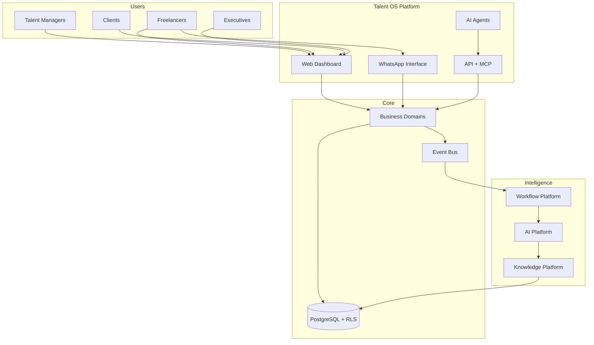

# 01 — Vision

| Field | Value |
|-------|-------|
| **Version** | 1.0.0 |
| **Status** | Draft — Awaiting Approval |
| **Owner** | Platform Architecture |
| **Related** | [02 Product Philosophy](02%20Product%20Philosophy.md) · [19 Roadmap](19%20Roadmap.md) · [FINAL Audit](../FINAL_AUDIT.md) |

---

## North Star

**Talent OS becomes the AI-native Workforce Operating System for creative agencies** — the system of record and system of action for talent, work, money, and knowledge, with WhatsApp as the primary field interface for freelancers.

We are not building a better spreadsheet or a chatbot bolted onto HR software. We are building a **platform** where:

- Every business action emits an observable event
- Every AI action is governed, auditable, and tenant-scoped
- Every domain capability is exposed consistently to humans, agents, and integrations
- Every tenant's data is isolated by default with enterprise-grade security

---

## What We Are Building

---

## Strategic Pillars

| Pillar | Definition | Platform Doc |
|--------|------------|--------------|
| **Platform-first** | Domains expose capabilities via services, events, and MCP — not UI-only features | [03 Business Domains](03%20Business%20Domains.md) |
| **AI-native** | AI is infrastructure, not a feature flag | [07 AI Platform](07%20AI%20Platform.md) |
| **Event-driven** | Side effects via outbox; synchronous paths stay thin | [09 Workflow Platform](09%20Workflow%20Platform.md) · [16 Event Catalog](16%20Event%20Catalog.md) |
| **API-first** | Route handlers, server actions, and MCP share service layer | [17 API Standards](17%20API%20Standards.md) |
| **WhatsApp-first** | Freelancers operate from messaging; web is secondary | [12 WhatsApp Platform](12%20WhatsApp%20Platform.md) |
| **Knowledge as moat** | Institutional memory compounds over time | [10 Knowledge Platform](10%20Knowledge%20Platform.md) |

---

## Target Personas (Platform Scope)

| Persona | Primary Interface | Platform Expectation |
|---------|-------------------|----------------------|
| **Talent Manager** | Web dashboard | Full roster, opportunity, project, and payment control |
| **Freelancer** | WhatsApp (+ web) | Respond, submit, status, agent queries without login friction |
| **Admin** | Web settings | Tenant config, integrations, billing, team |
| **Client** | Web (limited) | Company-linked projects and knowledge visibility |
| **Executive** | Web + agents | KPIs, pipeline health, risk signals |
| **Platform Agent** | MCP + AI Gateway | Same RBAC as invoking user; no privilege escalation |

---

## Evolution: MVP → Platform → Ecosystem

### Phase A — Agency OS (Current)

Private multi-tenant roster → broadcast → shortlist → project → payment. AI matching and PM features. Knowledge and agent scaffolding in place.

**Maturity:** Beta. Core flows work; automation and security require hardening per [FINAL Audit](../FINAL_AUDIT.md).

### Phase B — AI Workforce OS

- Unified AI gateway with no bypass paths
- MCP tool adapters wired to services
- Knowledge RAG pipeline operational
- Workflow engine with sequential steps and atomic claims
- WhatsApp agent as primary freelancer copilot

### Phase C — Marketplace Ecosystem

- Opt-in cross-tenant talent discovery
- Contracts, invitations, and reputation layer
- Recommendations and structured availability
- See [11 Marketplace Platform](11%20Marketplace%20Platform.md)

### Phase D — Open Platform

- Public API with OAuth and webhooks for partners
- Tenant-configurable workflows and agent packs
- Embedded widgets and white-label options

---

## Success Criteria (24-Month Horizon)

| Metric | Target |
|--------|--------|
| Time-to-staff (median) | < 2 hours with AI + WhatsApp |
| Freelancer weekly active (WhatsApp) | ≥ 70% of roster |
| AI request governance | 100% via gateway; zero bypass paths |
| Event delivery SLA | 99% within 5 minutes under normal load |
| Test coverage (services + workflows) | ≥ 60% |
| Security audit | Zero critical findings in production |
| Platform extensibility | New domain addable without UI changes |

---

## Non-Goals (Explicit)

- Native mobile apps in near term (responsive web + WhatsApp suffice)
- Full ERP/accounting replacement (integrate via events and exports)
- General-purpose workflow builder UI in Phase B (code registry first)
- Unmoderated cross-tenant data sharing (marketplace is opt-in, governed)

---

## Architectural Commitment

We optimize for **long-term maintainability and correctness**, not shipping speed. Every platform capability must be:

1. **Documented** in this blueprint before implementation
2. **Backwards compatible** unless explicitly approved
3. **Observable** via events and correlation IDs
4. **Secure by default** — fail closed, tenant-scoped, audited

See [15 Engineering Standards](15%20Engineering%20Standards.md) and [20 Technical Decisions](20%20Technical%20Decisions.md).

---

## Cross-References

| Document | Relationship |
|----------|--------------|
| [02 Product Philosophy](02%20Product%20Philosophy.md) | Values and design principles |
| [05 System Context](05%20System%20Context.md) | External systems and actors |
| [06 C4 Architecture](06%20C4%20Architecture.md) | Container and component design |
| [19 Roadmap](19%20Roadmap.md) | Phased delivery plan |
| [docs/01-PRD.md](../01-PRD.md) | Product requirements (MVP scope) |
