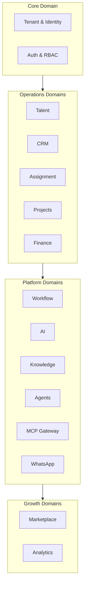

# 03 — Business Domains

| Field | Value |
|-------|-------|
| **Version** | 1.0.0 |
| **Status** | Draft — Awaiting Approval |
| **Owner** | Platform Architecture |
| **Related** | [04 Domain Model](04%20Domain%20Model.md) · [06 C4 Architecture](06%20C4%20Architecture.md) · [docs/architecture.md](../architecture.md) |

---

## Overview

Talent OS is organized as a **modular monolith** with explicit bounded contexts. Each domain owns its aggregates, services, repositories, events, and (target) MCP server.



---

## Domain Catalog

| Domain | Service(s) | Primary Tables | MCP Server | Status |
|--------|------------|----------------|------------|--------|
| **Core / Tenant** | Session, invites | `tenants`, `profiles`, `tenant_members` | — | Production |
| **Talent** | `TalentService` | `freelancers`, `freelancer_portfolio_items`, `freelancer_rating_history` | `talent` | Production |
| **CRM** | `CRMService` | `companies`, `opportunities`, `opportunity_recipients` | `crm` | Production |
| **Assignment** | `AssignmentService` | `shortlists`, `shortlist_items`, `talent_match_scores` | — | Production |
| **Projects** | `ProjectService` | `projects`, `milestones`, `tasks` | `projects` | Production |
| **Finance** | `FinanceService` | `payments`, `invoices` | `finance` | Production |
| **Workflow** | `WorkflowService`, `WorkflowEngineService` | `domain_events`, `workflow_runs`, `workflow_jobs`, `approval_requests` | `workflow` | Production |
| **AI** | `AIService` + `lib/ai/` | `ai_requests` | `ai` | Production |
| **Knowledge** | `KnowledgeService` | `knowledge_entries`, `knowledge_embeddings` | `knowledge` | Production |
| **Agents** | `AgentService` | `agent_configs`, `agent_sessions`, `agent_memory_entries` | via MCP | Production |
| **WhatsApp** | `WhatsAppService` | `whatsapp_conversations`, `whatsapp_messages` | — | Production |
| **Integrations** | `IntegrationService` | `integration_configs`, `webhook_deliveries` | — | Production |
| **Notifications** | `NotificationService` | `notifications`, `email_logs` | `notification` | Production |
| **Analytics** | `AnalyticsService` | Views + aggregations | `analytics` | Production |
| **Marketplace** | (planned) | Blueprint in migration 018 | (planned) | Architecture only |

Auto-generated service list: [generated/services.md](../generated/services.md)

---

## Domain Responsibilities

### Core / Tenant

- Multi-tenant workspace lifecycle
- User profiles and team membership
- Role assignment: `admin`, `talent_manager`, `freelancer`, `client`
- Invite flows (team ≠ gig ≠ marketplace)

**Does not:** Own business aggregates (projects, opportunities).

### Talent

- Freelancer roster CRUD, search, availability summary
- Portfolio and internal ratings
- Phone-based identity for WhatsApp resolution

**Target consolidation:** Merge `lib/domains/talent/` into canonical service factory. See [20 Technical Decisions](20%20Technical%20Decisions.md#td-003).

### CRM

- Companies and opportunities
- Broadcast and recipient tracking
- Freelancer responses (interested / declined)

**Events:** `opportunity.broadcast`, `opportunity.opened`, `opportunity.response`

### Assignment

- Shortlists and match scores
- AI match result persistence
- Bridges CRM → Project conversion

### Projects

- Project lifecycle and milestone management
- Submission and review flows
- AI status assessment fields on projects

**Events:** `project.assigned`, `milestone.submitted`, `milestone.approved`, `milestone.revision_requested`

### Finance

- Payments and invoices
- Approval and paid status transitions

**Events:** `payment.approved`, `payment.paid`

### Workflow (Platform)

- Transactional outbox (`domain_events`)
- Workflow registry, job queues, approval gates
- Cron-driven dispatch and processing

See [09 Workflow Platform](09%20Workflow%20Platform.md).

### AI (Platform)

- AI Gateway for all LLM calls
- Feature governance per tenant
- Async execution via outbox

See [07 AI Platform](07%20AI%20Platform.md).

### Knowledge (Platform)

- Institutional memory: notes, SOPs, preferences, deliverables
- Full-text search now; vector search target

See [10 Knowledge Platform](10%20Knowledge%20Platform.md).

### Agents (Platform)

- Six built-in agents with instructions, tools, memory, permissions
- Delegates to MCP + services

See [07 AI Platform](07%20AI%20Platform.md) · [08 MCP Platform](08%20MCP%20Platform.md).

### WhatsApp (Platform)

- Inbound parsing, intent detection, conversation context
- Delegates all mutations to domain services

See [12 WhatsApp Platform](12%20WhatsApp%20Platform.md).

### Marketplace (Growth)

- Opt-in discovery, contracts, reputation — extends existing domains

See [11 Marketplace Platform](11%20Marketplace%20Platform.md).

---

## Domain Interaction Rules

| Rule | Description |
|------|-------------|
| **R1** | Domains communicate via **service calls** (sync) or **domain events** (async) — not direct cross-repository access |
| **R2** | Only the owning domain mutates its aggregate roots |
| **R3** | Platform domains (Workflow, AI, MCP) are **consumers** of business events, not owners of business rules |
| **R4** | WhatsApp and web are **presentation adapters** — same services underneath |
| **R5** | Agents invoke MCP tools → services → repositories — same path as server actions |

---

## Layering Contract (All Domains)

```
Presentation  →  lib/queries/* (reads)  |  app/actions/* (writes)
Application   →  lib/services/*
Data Access   →  lib/repositories/*
Infrastructure → Supabase (PostgreSQL, Auth, Storage)
```

See [15 Engineering Standards](15%20Engineering%20Standards.md).

---

## Known Architectural Debt

| Issue | Domains Affected | Target Resolution |
|-------|------------------|-------------------|
| Duplicate talent paths | Talent | Phase 1 consolidation |
| PortfolioService outside factory | Talent | Register in `createServices()` |
| MCP adapters not implemented | All MCP servers | Phase 2 wiring |
| Marketplace blueprint only | Marketplace | Phase 3 implementation |

Source: [FINAL Audit](../FINAL_AUDIT.md)

---

## Cross-References

| Document | Relationship |
|----------|--------------|
| [04 Domain Model](04%20Domain%20Model.md) | Aggregates and relationships |
| [06 C4 Architecture](06%20C4%20Architecture.md) | Technical mapping |
| [11 Marketplace Platform](11%20Marketplace%20Platform.md) | Growth domain detail |
| [docs/35-marketplace-architecture.md](../35-marketplace-architecture.md) | Marketplace blueprint |
