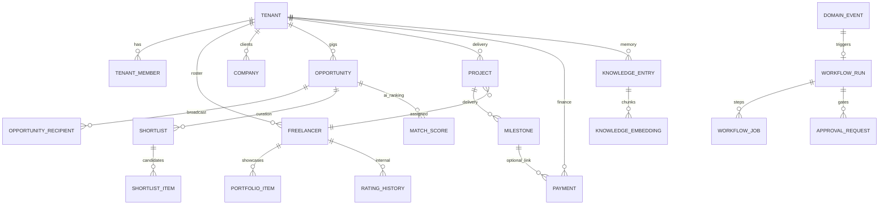
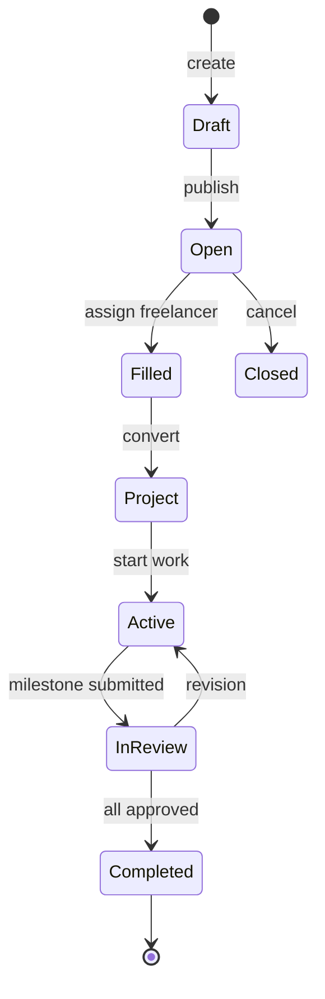

# 04 — Domain Model

| Field | Value |
|-------|-------|
| **Version** | 1.0.0 |
| **Status** | Draft — Awaiting Approval |
| **Owner** | Platform Architecture |
| **Related** | [03 Business Domains](03%20Business%20Domains.md) · [18 Data Model](18%20Data%20Model.md) · [16 Event Catalog](16%20Event%20Catalog.md) |

---

## Modeling Approach

Talent OS uses a **pragmatic DDD-lite** model:

- **Aggregate roots** map to primary tables with `tenant_id`
- **Domain events** capture state transitions worth reacting to
- **Value objects** encoded as JSONB, enums, or embedded columns
- **Polymorphic links** via `entity_type` + `entity_id` where many-to-many context is needed

All aggregates are **tenant-scoped** unless explicitly marked global (e.g., platform agent instruction templates with `tenant_id IS NULL`).

---

## Aggregate Map

---

## Core Aggregates

### Tenant (Root)

| Attribute | Notes |
|-----------|-------|
| Identity | `tenants.id`, unique `slug` |
| Settings | JSONB: AI toggles, limits, feature flags |
| Members | `tenant_members` — role + status + optional `company_id` for clients |

**Invariants:** Every business row references exactly one `tenant_id`. RLS enforces membership.

### Freelancer (Root) — Talent Domain

| Attribute | Notes |
|-----------|-------|
| Identity | Linked to `profiles` via `user_id` (nullable until onboarded) |
| Skills | `skills[]`, `discipline`, `day_rate`, `availability` enum |
| Contact | `email`, `phone` — phone is WhatsApp identity key |
| Internal | `internal_rating`, `internal_notes` — manager-only |

**Child entities:** `freelancer_portfolio_items`, `freelancer_rating_history`

**Future (Marketplace):** `marketplace_visibility`, `public_slug`, availability blocks. See [11 Marketplace Platform](11%20Marketplace%20Platform.md).

### Opportunity (Root) — CRM Domain

| Attribute | Notes |
|-----------|-------|
| Lifecycle | `draft → open → filled → closed → canceled` |
| Requirements | `required_skills[]`, `discipline`, `budget`, `description` |
| Client link | Optional `company_id` |

**Child entities:** `opportunity_recipients`, `shortlists`, `talent_match_scores`

**Key transitions → events:** broadcast, opened, response. See [16 Event Catalog](16%20Event%20Catalog.md).

### Project (Root) — Projects Domain

| Attribute | Notes |
|-----------|-------|
| Lifecycle | `draft → active → on_hold → in_review → completed → canceled` |
| Assignment | `freelancer_id`, `assigned_by`, `opportunity_id` (optional lineage) |
| AI fields | `ai_status_assessment` JSONB |

**Child entities:** `milestones`, `tasks`

**Key transitions → events:** assigned, milestone submitted/approved/revision/overdue.

### Payment (Root) — Finance Domain

| Attribute | Notes |
|-----------|-------|
| Lifecycle | `pending → approved → processing → paid → disputed → canceled` |
| Links | `project_id`, `milestone_id`, `freelancer_id` |

### KnowledgeEntry (Root) — Knowledge Domain

| Attribute | Notes |
|-----------|-------|
| Category | `knowledge_category` enum (7 types) |
| Content | `title`, `content`, `summary`; optional file storage refs |
| Links | Polymorphic + direct FKs (`company_id`, `project_id`, etc.) |
| Search | Generated `search_vector`; `embedding_status` for pipeline |

**Child entities:** `knowledge_embeddings` (chunks, vectors nullable until indexed)

---

## Platform Aggregates

### DomainEvent (Root) — Outbox

| Attribute | Notes |
|-----------|-------|
| Identity | `event_type`, `aggregate_type`, `aggregate_id` |
| Dedup | `idempotency_key` unique per tenant |
| Trace | `correlation_id`, `actor_id`, `payload` JSONB |
| Delivery | `status`, `retry_count`, `scheduled_at` |

Emit via `emit_domain_event()` RPC or `WorkflowService.emitEvent()`.

### WorkflowRun / WorkflowJob

| Entity | Role |
|--------|------|
| `workflow_runs` | Instance of a registered workflow for a trigger event |
| `workflow_jobs` | Executable step units in named queues |
| `approval_requests` | Human gates pausing runs |

See [09 Workflow Platform](09%20Workflow%20Platform.md).

### AiRequest (Root) — AI Domain

| Attribute | Notes |
|-----------|-------|
| Types | `talent_match`, `brief_parse`, `project_summary`, `shortlist_summary`, `status_assessment` |
| Governance | Linked to tenant settings; `prompt_hash` stored, not raw prompt |
| Execution | `pending → processing → completed | failed` |

**Target invariant:** Atomic claim on `pending → processing`. See [07 AI Platform](07%20AI%20Platform.md).

### AgentSession / AgentMemory

| Entity | Role |
|--------|------|
| `agent_configs` | Tenant overrides (tools, memory policy — no instruction text) |
| `agent_instruction_versions` | Server-side prompt content |
| `agent_sessions` | Run context |
| `agent_memory_entries` | Scoped recall (`session`, `entity`, `tenant`) |

---

## Value Objects & Enums

| Enum | Values | Used By |
|------|--------|---------|
| `discipline_type` | design, video, copy, motion, brand, other | Freelancer, Opportunity |
| `availability_status` | available, busy, unavailable | Freelancer |
| `opportunity_status` | draft, open, filled, closed, canceled | Opportunity |
| `project_status` | draft, active, on_hold, in_review, completed, canceled | Project |
| `milestone_status` | pending, in_progress, submitted, approved, revision, … | Milestone |
| `payment_status` | pending, approved, processing, paid, disputed, canceled | Payment |
| `knowledge_category` | meeting_note, sop, client_preference, … | Knowledge |
| `agent_id` | recruiter, project_manager, finance, qa, executive, knowledge | Agents |
| `event_status` | pending, processing, delivered, failed, dead_letter | DomainEvent |

TypeScript mirror: `modules/core/types/database.ts`

---

## Identity & Linking Patterns

| Pattern | Example | Rule |
|---------|---------|------|
| Direct FK | `project.freelancer_id` | Preferred when relationship is stable |
| Polymorphic | `knowledge_entries.entity_type/id` | When one table links to many aggregate types |
| Lineage | `project.opportunity_id` | Optional traceability to source gig |
| Phone identity | `freelancers.phone` + WhatsApp webhook | Resolve freelancer within tenant |

---

## Aggregate Lifecycle (Opportunity → Project)

Each bold transition emits a domain event consumed by [09 Workflow Platform](09%20Workflow%20Platform.md).

---

## Cross-References

| Document | Relationship |
|----------|--------------|
| [18 Data Model](18%20Data%20Model.md) | Physical schema and migrations |
| [16 Event Catalog](16%20Event%20Catalog.md) | Events per aggregate transition |
| [03 Business Domains](03%20Business%20Domains.md) | Domain ownership |
| [docs/20-core-data-model.md](../20-core-data-model.md) | Legacy ERD detail |
