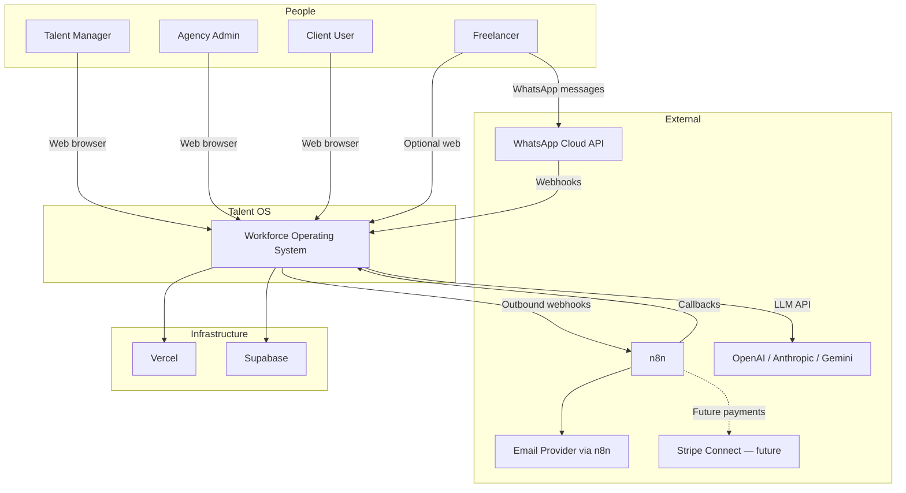
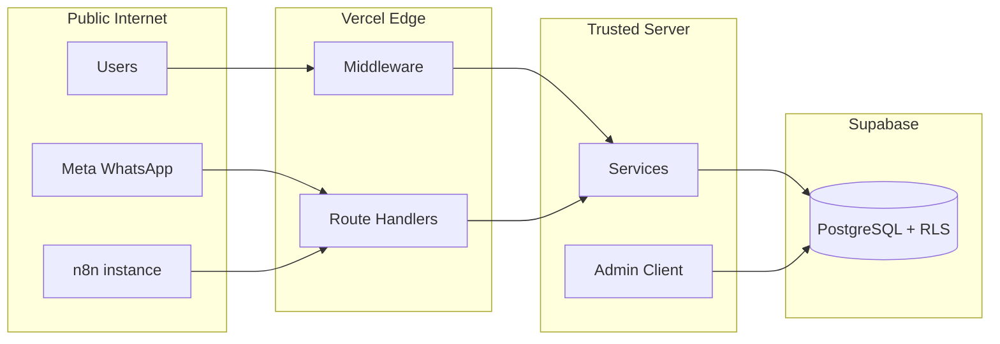

# 05 — System Context

| Field | Value |
|-------|-------|
| **Version** | 1.0.0 |
| **Status** | Draft — Awaiting Approval |
| **Owner** | Platform Architecture |
| **Related** | [06 C4 Architecture](06%20C4%20Architecture.md) · [14 Deployment Model](14%20Deployment%20Model.md) · [13 Security Model](13%20Security%20Model.md) |

---

## C4 Level 1 — System Context

Talent OS sits at the center of agency operations, connecting internal users, freelancers, external AI providers, and orchestration tools.



---

## Actors

| Actor | Description | Primary Channel | Auth |
|-------|-------------|-----------------|------|
| **Talent Manager** | Runs roster, gigs, projects | Web dashboard | Supabase JWT |
| **Agency Admin** | Settings, billing, team | Web settings | Supabase JWT + admin role |
| **Freelancer** | Accepts gigs, delivers work | WhatsApp (primary), web | Phone mapping + optional user account |
| **Client User** | Views company projects | Web (scoped) | Supabase JWT + client role |
| **System Cron** | Scheduled jobs | HTTP cron routes | `CRON_SECRET` bearer |
| **n8n Worker** | External automation | Webhooks + internal API | HMAC + `CRON_SECRET` |
| **AI Agent (internal)** | MCP tool invocations | Service layer | Inherits user RBAC |

---

## External Systems

| System | Direction | Purpose | Platform Doc |
|--------|-----------|---------|--------------|
| **Supabase** | Bidirectional | PostgreSQL, Auth, Storage, Realtime | [14 Deployment Model](14%20Deployment%20Model.md) |
| **Vercel** | Host | Next.js app, serverless functions, cron | [14 Deployment Model](14%20Deployment%20Model.md) |
| **WhatsApp Cloud API** | Inbound webhooks + outbound via n8n | Freelancer interface | [12 WhatsApp Platform](12%20WhatsApp%20Platform.md) |
| **n8n** | Bidirectional | Email, templates, extended orchestration | [09 Workflow Platform](09%20Workflow%20Platform.md) |
| **AI Providers** | Outbound | LLM inference | [07 AI Platform](07%20AI%20Platform.md) |
| **Stripe Connect** | Future | Payment disbursement | [19 Roadmap](19%20Roadmap.md) |

---

## Trust Boundaries



| Boundary | Controls |
|----------|----------|
| Internet → Edge | TLS, JWT session, webhook HMAC, cron secret |
| Edge → Services | Tenant context from cookie + membership query |
| Services → DB (user) | Supabase anon key + RLS |
| Services → DB (system) | Service role — must filter by tenant in code |
| AI Providers | API keys server-only; no PII in logs |

See [13 Security Model](13%20Security%20Model.md).

---

## Primary User Journeys (Context Level)

### Journey 1: Fill an Opportunity

```
Manager creates opportunity → AI match (optional) → broadcast
  → n8n sends WhatsApp → freelancer responds YES
  → CRM records response → manager shortlists → assigns project
  → events drive notifications and activity log
```

Domains: CRM, Assignment, AI, WhatsApp, Workflow.  
Events: `opportunity.broadcast`, `opportunity.response`, `project.assigned`.

### Journey 2: Deliver a Milestone

```
Freelancer sends SUBMIT on WhatsApp → WorkflowService.submitMilestone
  → milestone.submitted event → approval gate → manager approves
  → milestone.approved → project completion check → payment flow
```

Domains: Projects, Workflow, WhatsApp, Finance.

### Journey 3: Ask the Agent

```
Freelancer free-text on WhatsApp → intent: agent.query
  → WhatsAppService.runAgentQuery → AI Gateway (governed)
  → response via n8n outbound template
```

Domains: WhatsApp, AI. Target: route through [07 AI Platform](07%20AI%20Platform.md) agent framework.

---

## Data Flows (Context)

| Flow | Sync/Async | Mechanism |
|------|------------|-----------|
| Dashboard read | Sync | RSC → queries → services → PostgreSQL (RLS) |
| Form mutation | Sync | Server action → service → PostgreSQL |
| Side effect | Async | Service → outbox → cron → workflow → n8n/AI |
| WhatsApp inbound | Sync + async | Webhook → service → event emit |
| AI inference | Async | Event → job → executor → gateway → provider |

See [16 Event Catalog](16%20Event%20Catalog.md).

---

## Current vs Target Context

| Area | Current (MVP) | Target (Platform) |
|------|---------------|-------------------|
| Freelancer UX | WhatsApp + basic web | WhatsApp-primary with full command parity |
| AI | Gateway + async executors | Gateway-only; agents via MCP |
| Orchestration | n8n + native workflow engine | Unified workflow platform with sequential steps |
| Marketplace | Not in production | Opt-in cross-tenant discovery |
| Public API | Internal routes only | Versioned partner API |

Gap analysis: [FINAL Audit](../FINAL_AUDIT.md) · [19 Roadmap](19%20Roadmap.md).

---

## Cross-References

| Document | Relationship |
|----------|--------------|
| [06 C4 Architecture](06%20C4%20Architecture.md) | Level 2–3 decomposition |
| [12 WhatsApp Platform](12%20WhatsApp%20Platform.md) | WhatsApp boundary detail |
| [14 Deployment Model](14%20Deployment%20Model.md) | Infrastructure topology |
| [docs/system-diagrams.md](../system-diagrams.md) | Additional diagrams |
