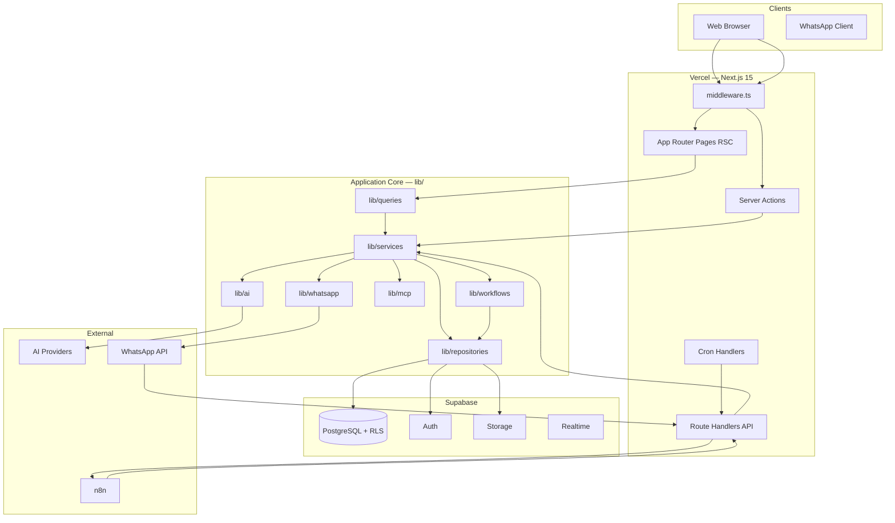

# 06 — C4 Architecture

| Field | Value |
|-------|-------|
| **Version** | 1.0.0 |
| **Status** | Draft — Awaiting Approval |
| **Owner** | Platform Architecture |
| **Related** | [05 System Context](05%20System%20Context.md) · [03 Business Domains](03%20Business%20Domains.md) · [docs/architecture.md](../architecture.md) |

---

## C4 Level 2 — Containers



---

## Container Responsibilities

| Container | Technology | Responsibility |
|-----------|------------|----------------|
| **Web App** | Next.js App Router | UI, SSR, server actions |
| **Middleware** | Edge middleware | Session refresh, RBAC route guards, tenant headers |
| **Route Handlers** | Serverless functions | REST, webhooks, cron, internal callbacks |
| **Service Layer** | TypeScript classes | Business orchestration, event emission |
| **Repository Layer** | TypeScript + Supabase client | Data access, RPC calls |
| **Workflow Engine** | TypeScript | Event → run → job → action pipeline |
| **AI Gateway** | TypeScript | Provider abstraction, governance, logging |
| **MCP Gateway** | TypeScript | Tool discovery, authorization, adapter routing |
| **PostgreSQL** | Supabase | System of record, RLS, outbox |
| **n8n** | Self-hosted / cloud | External orchestration, messaging templates |

---

## C4 Level 3 — Application Components

### Presentation Layer

| Component | Path | Rules |
|-----------|------|-------|
| Dashboard pages | `app/(dashboard)/**` | Read via `lib/queries/*` only |
| Auth pages | `app/(auth)/**` | Public routes |
| Server actions | `app/actions/*.ts` | Mutations via `createServices()` |
| API routes | `app/api/**/route.ts` | Webhooks/cron use `createAdminServices()` |

### Domain Service Layer

| Component | Path | Depends On |
|-----------|------|------------|
| Service factory | `lib/services/factory.ts` | All domain services |
| Domain services | `lib/services/*.service.ts` | Repositories, peer services |
| Query layer | `lib/queries/*.queries.ts` | Services (reads) |

**Factory graph (simplified):**

```
NotificationService
WorkflowService → DomainEventRepository
CRMService → Notification, Workflow
ProjectService → Workflow
TalentService
AIService
IntegrationService → CRM, AI
WhatsAppService → Integration, CRM, Talent, Workflow, Project
KnowledgeService
AgentService
WorkflowEngineService → (lazy full Services)
FinanceService, AnalyticsService, AssignmentService
```

### Data Access Layer

| Component | Path | Rules |
|-----------|------|-------|
| Repository factory | `lib/repositories/factory.ts` | User vs admin context |
| Repositories | `lib/repositories/*.repository.ts` | Extend `BaseRepository` |
| Domain talent repos | `lib/domains/talent/repositories/` | **Target:** merge into main factory |

### Platform Components

| Component | Path | Status |
|-----------|------|--------|
| Workflow registry | `lib/workflows/registry.ts` | Production |
| Workflow engine | `lib/workflows/engine.ts` | Production — needs hardening |
| AI gateway | `lib/ai/gateway.ts` | Production |
| Prompt manager | `lib/ai/prompt/manager.ts` | Production |
| Agent registry | `lib/ai/agent/registry.ts` | Production |
| MCP gateway | `lib/mcp/gateway.ts` | Stub — adapters pending |
| WhatsApp pipeline | `lib/whatsapp/*` | Production |

---

## Request Path Diagrams

### Synchronous Read (Dashboard)

```
Page (RSC)
  → lib/queries/projects.queries.ts
  → createServices()
  → ProjectService.findById(tenantId)
  → ProjectRepository (user Supabase client, RLS)
  → PostgreSQL
```

### Synchronous Write (Server Action)

```
app/actions/projects.ts
  → requireTenant()
  → createServices()
  → ProjectService.create(...)
  → repositories + WorkflowService.emitEvent()
  → PostgreSQL (transaction via service calls)
```

### Asynchronous Side Effect

```
Service.emitEvent()
  → emit_domain_event RPC
  → domain_events (pending)

Vercel Cron → /api/cron/dispatch-events
  → WorkflowEngine.triggerFromDomainEvent()
  → workflow_runs + workflow_jobs

Vercel Cron → /api/cron/process-workflow-jobs
  → executeWorkflowAction() → n8n | AI | notify
```

See [09 Workflow Platform](09%20Workflow%20Platform.md).

---

## Deployment Mapping

| Component | Runs On | Scaling |
|-----------|---------|---------|
| Next.js pages/actions | Vercel serverless | Per request |
| Cron handlers | Vercel cron | Fixed schedule |
| PostgreSQL | Supabase | Vertical + connection pooling |
| n8n | External | Independent |
| AI providers | External API | Rate-limited per tenant |

See [14 Deployment Model](14%20Deployment%20Model.md).

---

## Target Architecture Deltas

| Component | Current | Target |
|-----------|---------|--------|
| Middleware | Blocks system routes | `SYSTEM_ROUTES` bypass — see [13 Security Model](13%20Security%20Model.md) |
| MCP Gateway | Auth-only stub | Full service adapters |
| Workflow engine | Parallel job enqueue | Sequential steps with claim tokens |
| AI executors | Race-prone status update | Atomic `claimAiRequest()` |
| Rate limiter | In-memory | Distributed (Redis/Upstash) |
| Talent domain | Split paths | Single factory registration |

Source: [FINAL Audit](../FINAL_AUDIT.md) · [19 Roadmap](19%20Roadmap.md)

---

## Module Structure

```
app/                    # Presentation (Next.js)
lib/
  services/             # Domain orchestration
  repositories/         # Data access
  queries/              # Read models for RSC
  workflows/            # Workflow platform
  ai/                   # AI platform
  mcp/                  # MCP platform
  whatsapp/             # WhatsApp adapter
  integrations/         # n8n, AI executors, encryption
modules/
  core/                 # Shared types, auth, permissions
  knowledge/            # Knowledge domain types
  agents/               # Agent domain types
  marketplace/          # Marketplace types (blueprint)
supabase/migrations/    # Schema source of truth
docs/Platform/          # This blueprint
```

See [docs/folder-structure.md](../folder-structure.md).

---

## Cross-References

| Document | Relationship |
|----------|--------------|
| [05 System Context](05%20System%20Context.md) | Level 1 diagram |
| [07 AI Platform](07%20AI%20Platform.md) | AI component detail |
| [08 MCP Platform](08%20MCP%20Platform.md) | MCP component detail |
| [09 Workflow Platform](09%20Workflow%20Platform.md) | Workflow component detail |
| [15 Engineering Standards](15%20Engineering%20Standards.md) | Layering rules |
