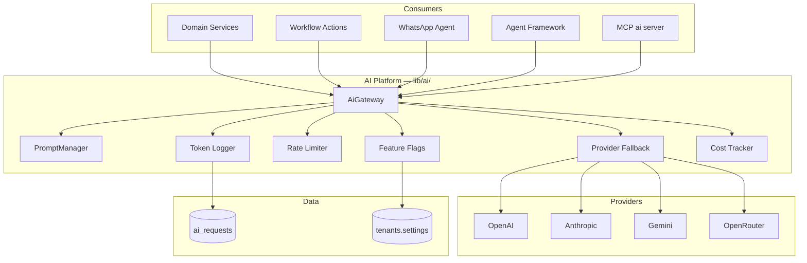
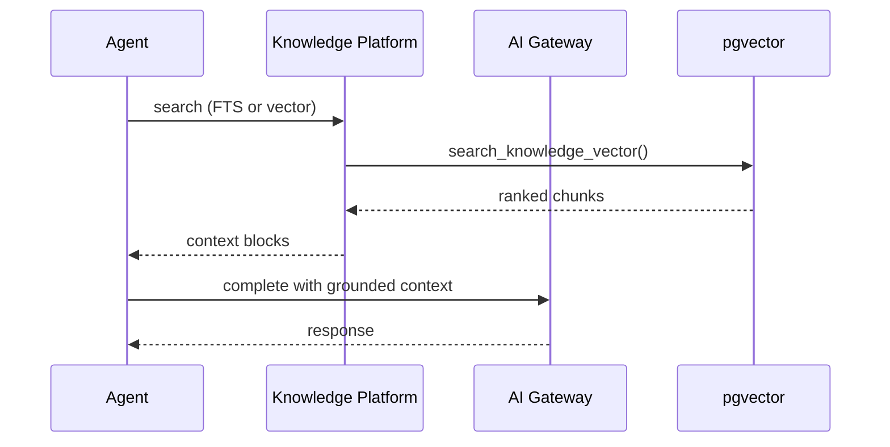

# 07 — AI Platform

| Field | Value |
|-------|-------|
| **Version** | 1.0.0 |
| **Status** | Draft — Awaiting Approval |
| **Owner** | Platform Architecture |
| **Related** | [08 MCP Platform](08%20MCP%20Platform.md) · [10 Knowledge Platform](10%20Knowledge%20Platform.md) · [docs/ai.md](../ai.md) |

---

## Mission

The AI Platform provides **governed, observable, provider-agnostic intelligence** for all Talent OS capabilities. Every LLM call flows through a single gateway. No exceptions.

---

## Architecture



---

## Core Components

| Component | Path | Responsibility |
|-----------|------|----------------|
| **AiGateway** | `lib/ai/gateway.ts` | `complete()`, `completeStructured()`, `stream()` |
| **PromptManager** | `lib/ai/prompt/manager.ts` | Versioned prompts by ID |
| **Agent instructions** | `lib/ai/agent/instructions.ts` | Agent-specific prompt registration |
| **Feature flags** | `lib/ai/features/flags.ts` | Tenant AI toggles and monthly caps |
| **Providers** | `lib/ai/providers/` | OpenAI, Anthropic, Gemini, OpenRouter |
| **Middleware** | `lib/ai/middleware/` | Retry, rate limit, fallback |
| **AIService** | `lib/services/ai.service.ts` | Feature orchestration, async request lifecycle |
| **Executors** | `lib/integrations/ai/*.ts` | Async job handlers per feature |

---

## Feature Catalog

| Feature ID | Prompt ID | Trigger | Permission | Async |
|------------|-----------|---------|------------|-------|
| `talent_match` | `talent_match` | User / workflow | `ai:match` | Yes |
| `brief_parse` | `brief_parse` | User / workflow | `ai:brief_parse` | Yes |
| `project_summary` | `project_summary` | User / workflow | `ai:summary` | Yes |
| `shortlist_summary` | `shortlist_summary` | User / workflow | `ai:summary` | Yes |
| `status_assessment` | `status_assessment` | User / workflow / cron | `ai:status` | Yes |
| `digest` | (inline — **debt**) | WhatsApp agent | — | No |

**Target:** Eliminate `digest` bypass; register WhatsApp agent prompt in PromptManager with governance.

---

## Async Execution Pipeline

```
1. AIService creates ai_requests row (status: pending)
2. Service emits domain event (e.g. ai.match_requested)
3. Cron dispatch-events → workflow OR legacy n8n/direct path
4. Workflow job action execute_ai OR internal route
5. Executor claims request (target: atomic pending → processing)
6. Gateway.completeStructured() with tenant + feature
7. Persist results → ai_requests + entity JSONB fields
8. Notify actor via NotificationService
```

**Execution modes (current — target: unify):**

| Mode | Env | Path |
|------|-----|------|
| n8n default | — | Event → n8n → callback `/api/internal/ai/execute` |
| Direct | `AI_EXECUTION_MODE=direct` | Cron executes inline |
| Workflow | Registry | `execute_ai` action |

See [09 Workflow Platform](09%20Workflow%20Platform.md) · [20 Technical Decisions](20%20Technical%20Decisions.md#td-005).

---

## Governance Model

| Control | Implementation | Target State |
|---------|----------------|--------------|
| Feature enablement | `tenants.settings` JSONB | Keep |
| Monthly request cap | `AIService.assertAiFeatureAllowed()` | Keep |
| Prompt privacy | Store `prompt_hash` only | Keep |
| Provider selection | Primary + fallback chain | Keep |
| Rate limiting | In-memory per tenant | **Migrate to distributed** |
| Cost tracking | In-process tracker | **Persist to DB / analytics** |
| User content | Injected into prompts | **Sanitize + delimit untrusted blocks** |

### Tenant Settings Schema (AI)

```json
{
  "ai_matching_enabled": true,
  "ai_pm_enabled": true,
  "max_ai_requests_monthly": 500
}
```

---

## Agent Framework Integration

Six built-in agents consume AI Platform via MCP and PromptManager:

| Agent | Primary Features | MCP Servers |
|-------|------------------|-------------|
| Recruiter | talent_match, brief_parse | talent, crm, ai, knowledge |
| Project Manager | status_assessment, summaries | projects, workflow, ai |
| Finance | (future analytics AI) | finance, analytics |
| QA | deliverable review | projects, knowledge, storage |
| Executive | pipeline narratives | analytics, knowledge |
| Knowledge | RAG queries | knowledge, storage |

Instructions: server-side only in `agent_instruction_versions`. Never exposed in UI.

See [08 MCP Platform](08%20MCP%20Platform.md) · [docs/34-agent-framework.md](../34-agent-framework.md).

---

## Knowledge / RAG Integration (Target)



Embedding pipeline: see [10 Knowledge Platform](10%20Knowledge%20Platform.md).

---

## Security & Safety

| Risk | Mitigation |
|------|------------|
| Prompt injection | Delimit user content; system prompts immutable server-side |
| Cross-tenant leakage | All requests require `tenantId`; RLS on `ai_requests` |
| Duplicate execution | Atomic claim (Phase 0 — see [FINAL Audit](../FINAL_AUDIT.md)) |
| Unbounded cost | Monthly caps + rate limits + cost alerts |
| Provider key exposure | Server-only env vars |

---

## Current Gaps (from Audit)

| ID | Issue | Phase |
|----|-------|-------|
| AI-01 | Double-execution race | Phase 0 |
| AI-02 | `digest` bypasses governance | Phase 1 |
| AI-03 | Inline WhatsApp prompts | Phase 1 |
| AI-05 | Legacy OpenAI client parallel path | Phase 2 |
| AI-08 | No embedding worker | Phase 2 |
| SC-03 | In-memory rate limiter | Phase 2 |

---

## Environment Variables

| Variable | Purpose |
|----------|---------|
| `AI_PRIMARY_PROVIDER` | Default provider |
| `AI_FALLBACK_PROVIDERS` | Comma-separated chain |
| `AI_RATE_LIMIT_RPM` | Per-tenant RPM (target: distributed) |
| `AI_EXECUTION_MODE` | `direct` or n8n (target: workflow-only) |
| `OPENAI_API_KEY`, `ANTHROPIC_API_KEY`, … | Provider credentials |

---

## Cross-References

| Document | Relationship |
|----------|--------------|
| [08 MCP Platform](08%20MCP%20Platform.md) | Tool exposure for agents |
| [10 Knowledge Platform](10%20Knowledge%20Platform.md) | RAG and embeddings |
| [16 Event Catalog](16%20Event%20Catalog.md) | `ai.*` events |
| [docs/27-ai-gateway.md](../27-ai-gateway.md) | Legacy gateway detail |
