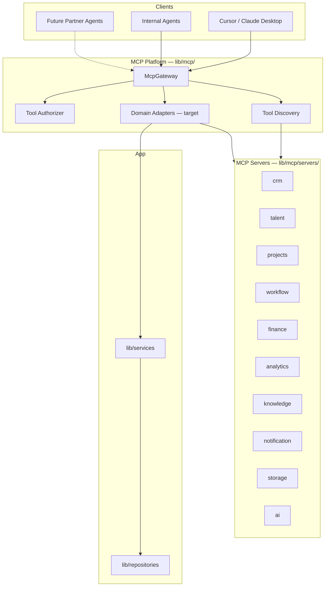

# 08 — MCP Platform

| Field | Value |
|-------|-------|
| **Version** | 1.0.0 |
| **Status** | Draft — Awaiting Approval |
| **Owner** | Platform Architecture |
| **Related** | [07 AI Platform](07%20AI%20Platform.md) · [03 Business Domains](03%20Business%20Domains.md) · [docs/mcp.md](../mcp.md) |

---

## Mission

The MCP (Model Context Protocol) Platform exposes **typed, permissioned business capabilities** to AI agents, internal tools, and future external integrations. It is the API surface for machine consumers.

**Principle:** If a human can do it in the dashboard, an authorized agent must be able to do it via MCP — through the same service layer.

---

## Architecture



---

## Current vs Target State

| Capability | Current | Target |
|------------|---------|--------|
| Tool definitions | ✅ Complete catalog | Maintain via codegen |
| Permission gates | ✅ `requiredPermission` per tool | Keep |
| Gateway routing | ✅ Server + tool validation | Keep |
| RBAC authorizer | ✅ Checks user permissions | Keep |
| **Domain adapters** | ❌ Returns "not implemented" | Wire to services |
| Rate limiting | ❌ Not implemented | Per-tenant limits |
| Audit logging | ❌ Partial | Log all invocations |
| External transport | ❌ In-process only | HTTP/SSE MCP server (future) |

---

## MCP Server Catalog

| Server ID | Domain | Example Tools | Service Backend |
|-----------|--------|---------------|-----------------|
| `crm` | CRM | `crm_list_companies`, `crm_create_opportunity` | `CRMService` |
| `talent` | Talent | `talent_search`, `talent_get_profile` | `TalentService` |
| `projects` | Projects | `projects_list`, `projects_review_milestone` | `ProjectService` |
| `workflow` | Workflow | `workflow_emit_event`, `workflow_list_pending` | `WorkflowService` |
| `finance` | Finance | `finance_list_payments`, `finance_approve_payment` | `FinanceService` |
| `analytics` | Analytics | `analytics_dashboard` | `AnalyticsService` |
| `knowledge` | Knowledge | `knowledge_search`, `knowledge_get_entity_context` | `KnowledgeService` |
| `notification` | Notifications | `notification_send`, `notification_list` | `NotificationService` |
| `storage` | Storage | `storage_upload`, `storage_signed_url` | Supabase Storage |
| `ai` | AI | `ai_match`, `ai_parse_brief`, `ai_summarize` | `AIService` + Gateway |

Auto-generated catalog: [generated/mcp-tools.md](../generated/mcp-tools.md)

---

## Tool Conventions

| Rule | Standard |
|------|----------|
| Naming | `{server}_{action}` — e.g. `talent_search` |
| Input schema | JSON Schema in tool definition |
| Output | Typed result or `{ error, isError: true }` |
| Destructive ops | `destructive: true` flag |
| Tenant scope | Every call includes `McpExecutionContext.tenantId` |
| Permissions | `requiredPermission` checked before adapter invocation |
| Idempotency | Mutating tools accept optional `idempotencyKey` where applicable |

See [17 API Standards](17%20API%20Standards.md).

---

## Execution Context

```typescript
interface McpExecutionContext {
  tenantId: string
  userId: string
  role: UserRole
  permissions: readonly string[]
  correlationId: string
  requestId: string
}
```

Created via `createMcpExecutionContext()`. Agents inherit invoking user's RBAC — **no privilege escalation**.

---

## Agent Tool Filtering

Built-in agents receive a subset of MCP tools:

```
Effective tools = agent.defaultTools
  ∩ tenant.agent_configs.allowed_tools (if configured)
  ∩ user RBAC permissions
```

Implementation: `lib/ai/agent/tool-filter.ts`

| Agent | Primary Servers |
|-------|-----------------|
| Recruiter | talent, crm, ai, knowledge |
| Project Manager | projects, workflow, ai, notification |
| Finance | finance, analytics |
| QA | projects, knowledge, storage |
| Executive | analytics, knowledge |
| Knowledge | knowledge, storage |

---

## Adapter Implementation Plan

Each adapter maps tool name → service method:

```
lib/mcp/adapters/
  crm.adapter.ts
  talent.adapter.ts
  projects.adapter.ts
  ...
```

**Adapter contract:**

1. Validate input against tool schema
2. Call service with tenant context
3. Map service result to tool output
4. Never access repository directly

**Rollout order:** knowledge → talent → projects → crm → workflow → finance → ai → analytics → notification → storage

---

## Security Model

| Control | Implementation |
|---------|----------------|
| Authentication | User session or service token (future) |
| Authorization | `DefaultToolAuthorizer` + `hasPermission()` |
| Tenant isolation | Context tenantId required; services enforce |
| Destructive confirmation | Agent policy layer (future) |
| Audit | Log tool, tenant, user, correlationId, duration |

See [13 Security Model](13%20Security%20Model.md).

---

## Relationship to API Standards

| Surface | Consumer | Auth |
|---------|----------|------|
| Server Actions | Web UI | Session cookie |
| Route Handlers | External HTTP | JWT / HMAC / cron secret |
| MCP Tools | Agents | Session-derived context |
| (Future) Public API | Partners | OAuth 2.0 |

All surfaces converge on `lib/services/*`.

---

## Cross-References

| Document | Relationship |
|----------|--------------|
| [07 AI Platform](07%20AI%20Platform.md) | Agents consume MCP |
| [17 API Standards](17%20API%20Standards.md) | API conventions |
| [docs/28-mcp-architecture.md](../28-mcp-architecture.md) | Legacy interface spec |
| [docs/34-agent-framework.md](../34-agent-framework.md) | Agent integration |
