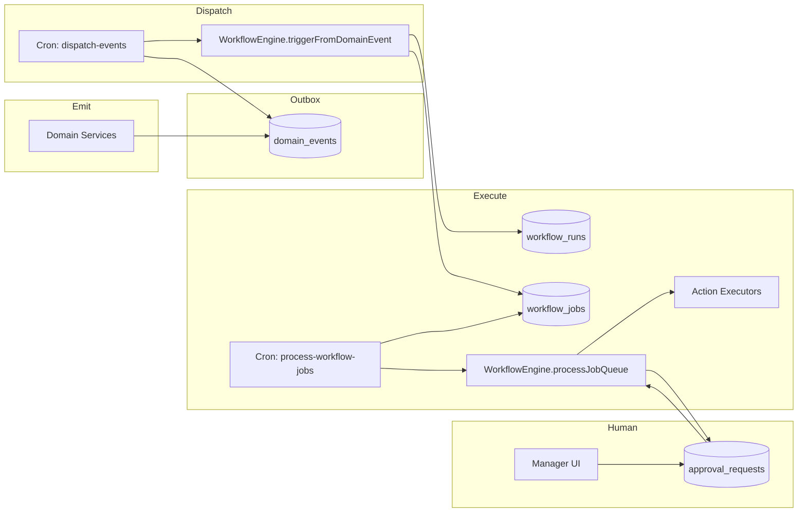
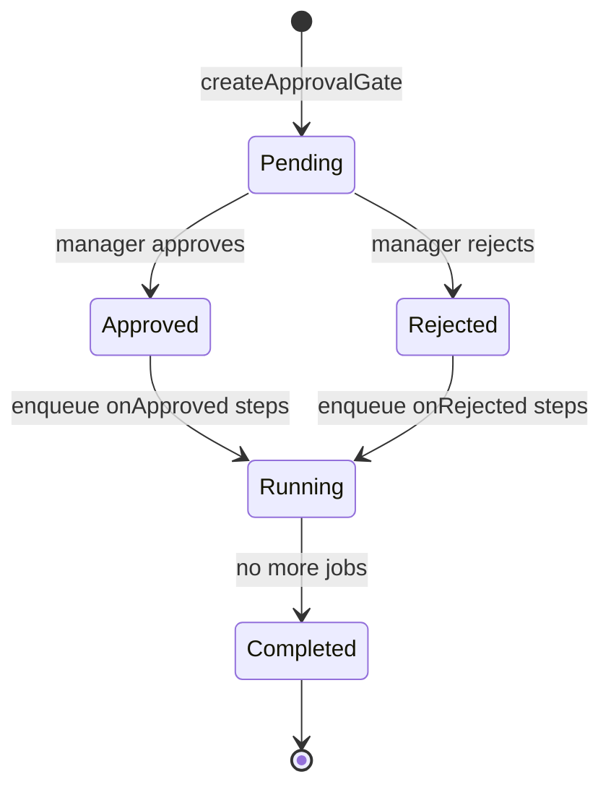

# 09 — Workflow Platform

| Field | Value |
|-------|-------|
| **Version** | 1.0.0 |
| **Status** | Draft — Awaiting Approval |
| **Owner** | Platform Architecture |
| **Related** | [16 Event Catalog](16%20Event%20Catalog.md) · [07 AI Platform](07%20AI%20Platform.md) · [docs/workflow.md](../workflow.md) |

---

## Mission

The Workflow Platform transforms **domain events into reliable, observable, multi-step business processes** — including human approval gates, AI execution, n8n dispatch, and notifications.

It is the **automation backbone** of Talent OS.

---

## Architecture



---

## Core Concepts

| Concept | Storage | Description |
|---------|---------|-------------|
| **Domain Event** | `domain_events` | Outbox record — something happened |
| **Workflow Definition** | `lib/workflows/registry.ts` | Code-defined trigger + conditions + steps |
| **Workflow Run** | `workflow_runs` | Instance for a specific trigger event |
| **Workflow Job** | `workflow_jobs` | Executable unit in a named queue |
| **Approval Request** | `approval_requests` | Human gate pausing a run |
| **Action** | `lib/workflows/actions.ts` | Executor: n8n, AI, notify, emit, log |

---

## Workflow Definition Schema

```typescript
interface WorkflowDefinition {
  id: string                    // e.g. wf-milestone-submitted
  name: string
  description?: string
  trigger: { type: 'domain_event'; eventType: string }
  conditions?: ConditionRule[]  // JSON rules
  queue?: string                // default queue name
  steps: WorkflowStep[]         // actions + approvals
}
```

Registry: `lib/workflows/registry.ts` — 17 built-in workflows.  
Auto-generated: [generated/workflows.md](../generated/workflows.md)

---

## Job Queues

| Queue | Purpose | Concurrency Target |
|-------|---------|-------------------|
| `default` | General steps | 50/min |
| `integrations` | n8n dispatch | 30/min |
| `ai` | AI execution | 20/min |
| `notifications` | In-app + email triggers | 50/min |
| `approvals` | Approval gate setup | 10/min |

Cron: `GET /api/cron/process-workflow-jobs?queue=ai`

---

## Action Types

| Action | Executor | Use Case |
|--------|----------|----------|
| `dispatch_n8n` | `executeDispatchN8n()` | WhatsApp templates, email, external flows |
| `execute_ai` | `executeAi()` | AI request execution |
| `notify` | `executeNotify()` | In-app notification |
| `emit_event` | `executeEmitEvent()` | Chain events |
| `log_activity` | `executeLogActivity()` | Audit trail |
| `request_approval` | `createApprovalGate()` | Human review |

---

## Approval Model



| Field | Purpose |
|-------|---------|
| `approver_id` | Resolved user (project manager, actor) |
| `approver_role` | Fallback role hint |
| `expires_at` | **Target:** enforce expiration |
| `entity_type/id` | Link to milestone, payment, etc. |

**Current gaps:** Null approver allows any user; expiration not enforced. See [13 Security Model](13%20Security%20Model.md).

---

## Built-in Workflow Summary

| Event | Workflow ID | Notable Steps |
|-------|-------------|---------------|
| `opportunity.broadcast` | wf-opportunity-broadcast | dispatch_n8n |
| `milestone.submitted` | wf-milestone-submitted | **approval gate** |
| `milestone.approved` | wf-milestone-approved | n8n + notify |
| `milestone.overdue` | wf-milestone-overdue | notify + n8n |
| `ai.match_requested` | wf-ai-match | execute_ai |
| `payment.paid` | wf-payment-paid | n8n + notify |
| `whatsapp.inbound` | wf-whatsapp-inbound | log_activity |

Full catalog: [16 Event Catalog](16%20Event%20Catalog.md)

---

## Target State — Reliability

| Capability | Current | Target |
|------------|---------|--------|
| Event claim | Update status without lock | `FOR UPDATE SKIP LOCKED` or optimistic claim |
| Step ordering | All jobs enqueued at once | Sequential: step N+1 after N completes |
| Delivery semantics | Event marked delivered on trigger | Delivered after all jobs complete (or saga pattern) |
| Retry | Exponential backoff | Keep + dead-letter alerting |
| Idempotency | Run dedup by trigger event | Keep |
| Cron auth | Blocked by middleware | System route bypass — Phase 0 |
| Archival | None | Purge/archive > 30 days |

---

## n8n Relationship

| Responsibility | Owner |
|----------------|-------|
| Business rules | Talent OS services |
| Event emission | Talent OS outbox |
| Workflow routing | Talent OS workflow engine |
| Message templates | n8n |
| Email delivery | n8n |
| Complex multi-system flows | n8n |

**Rule:** n8n never owns business state. Callbacks are idempotent and verified via HMAC.

Envelope format: `lib/integrations/n8n.ts` — includes `correlationId`, `idempotencyKey`, `tenantId`.

---

## Adding a Workflow (Standard Process)

1. Define domain event in emitting service
2. Add entry to [16 Event Catalog](16%20Event%20Catalog.md)
3. Register `WorkflowDefinition` in `lib/workflows/registry.ts`
4. Run `npm run docs:generate`
5. Add integration test for trigger → job → action
6. Update [docs/workflow.md](../workflow.md) if behavior is user-visible

See [15 Engineering Standards](15%20Engineering%20Standards.md).

---

## Observability

| Signal | Source |
|--------|--------|
| Event backlog | `COUNT domain_events WHERE status IN (pending, failed)` |
| Job backlog | `COUNT workflow_jobs WHERE status IN (pending, failed)` |
| Dead letters | `status = dead_letter` on events and jobs |
| Trace | `correlation_id` from user action through n8n callback |

Target: Operations dashboard in [docs/operations-guide.md](../operations-guide.md).

---

## Cross-References

| Document | Relationship |
|----------|--------------|
| [16 Event Catalog](16%20Event%20Catalog.md) | All event types |
| [07 AI Platform](07%20AI%20Platform.md) | AI action execution |
| [12 WhatsApp Platform](12%20WhatsApp%20Platform.md) | WhatsApp-triggered workflows |
| [14 Deployment Model](14%20Deployment%20Model.md) | Cron schedules |
| [docs/31-workflow-engine.md](../31-workflow-engine.md) | Legacy deep dive |
