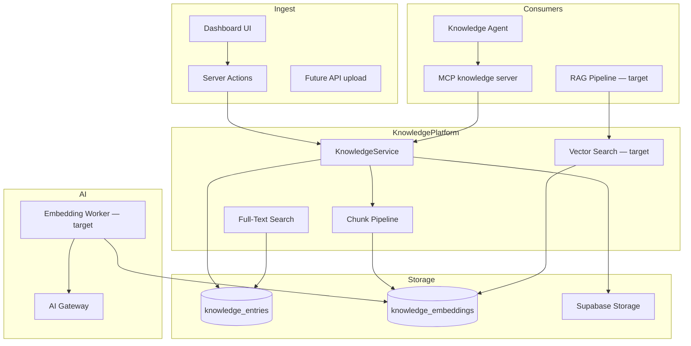
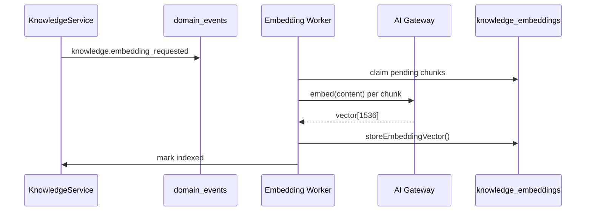

# 10 — Knowledge Platform

| Field | Value |
|-------|-------|
| **Version** | 1.0.0 |
| **Status** | Draft — Awaiting Approval |
| **Owner** | Platform Architecture |
| **Related** | [07 AI Platform](07%20AI%20Platform.md) · [08 MCP Platform](08%20MCP%20Platform.md) · [docs/33-knowledge-module.md](../33-knowledge-module.md) |

---

## Mission

The Knowledge Platform is Talent OS's **institutional memory** — capturing meeting notes, SOPs, client preferences, project history, deliverables, feedback, and documents in a tenant-scoped, searchable, AI-ready knowledge base.

**Strategic value:** Knowledge compounds over time. It powers agent context, executive summaries, QA review, and (future) grounded AI responses.

---

## Architecture



---

## Content Model

### Categories

| Category | Enum | Typical Use |
|----------|------|-------------|
| Meeting Notes | `meeting_note` | Calls, standups, client meetings |
| SOPs | `sop` | Standard operating procedures |
| Client Preferences | `client_preference` | Brand guidelines, comms prefs |
| Project History | `project_history` | Decisions, timeline context |
| Deliverables | `deliverable` | Final outputs, file refs |
| Feedback | `feedback` | Client/internal feedback |
| Documents | `document` | General file-backed docs |

### Entry Structure

| Field | Purpose |
|-------|---------|
| `title`, `content`, `summary` | Text body |
| `entity_type` / `entity_id` | Polymorphic link to any aggregate |
| `company_id`, `project_id`, … | Direct FKs for efficient filtering |
| `storage_bucket` / `storage_path` | File-backed entries |
| `tags[]` | Faceted classification |
| `embedding_status` | Pipeline state |
| `search_vector` | Generated tsvector (English) |

See [04 Domain Model](04%20Domain%20Model.md).

---

## Search Capabilities

| Method | Status | RPC | Use Case |
|--------|--------|-----|----------|
| **Full-text** | ✅ Production | `search_knowledge_entries()` | Keyword search now |
| **Filtered list** | ✅ Production | Repository queries | Browse by category/entity |
| **Vector similarity** | 🔶 Schema ready | `search_knowledge_vector()` | Semantic search (needs embeddings) |
| **Hybrid** | 📋 Planned | FTS + vector rerank | Best-of-both retrieval |

---

## Embedding Pipeline

### Current (MVP)

On create/update with content:

1. Split into ~1500-char chunks (`DEFAULT_CHUNK_SIZE`)
2. Insert `knowledge_embeddings` rows **without vectors**
3. Set `embedding_status = pending`

### Target



**Event (planned):** `knowledge.embedding_requested`, `knowledge.embedding_completed`

Model: 1536-dim (OpenAI ada-compatible). Index: HNSW with `vector_cosine_ops`.

---

## Access Control

| Role | Access |
|------|--------|
| **Manager** | Full CRUD via `is_manager_of(tenant_id)` |
| **Client** | Read entries linked to their `company_id` |
| **Freelancer** | No direct access (future: project-scoped read) |
| **Agent** | Via MCP with manager-equivalent or scoped permissions |

RLS: migration `016_knowledge_module.sql`

**Security note:** SECURITY DEFINER search RPCs must validate tenant membership inside function or restrict to service-role calls. See [13 Security Model](13%20Security%20Model.md).

---

## MCP Integration

| Tool | Purpose |
|------|---------|
| `knowledge_search` | Full-text (+ vector when ready) |
| `knowledge_get_entry` | Fetch entry with chunks |
| `knowledge_get_entity_context` | All knowledge linked to project/opportunity/company |
| `knowledge_create_entry` | Agent-authored notes (governed) |

Server: `lib/mcp/servers/knowledge.server.ts` — adapter wiring pending. See [08 MCP Platform](08%20MCP%20Platform.md).

---

## Agent Integration

**Knowledge Agent** (`agent_id: knowledge`):

- Primary consumer of search and entity context tools
- Used by Executive and QA agents for grounding
- Memory scope: entity-linked recall for ongoing projects

Instructions: server-side via PromptManager — never in UI.

---

## Code Layout

```
modules/knowledge/          # Types, validation
lib/services/knowledge.service.ts
lib/repositories/knowledge.repository.ts
lib/repositories/knowledge-embedding.repository.ts
lib/queries/knowledge.queries.ts
app/actions/knowledge.ts
supabase/migrations/016_knowledge_module.sql
```

---

## Operational Concerns

| Concern | Target Approach |
|---------|-----------------|
| Chunk size | 1500 chars default; configurable per category |
| Re-embedding | On content update: delete chunks → re-chunk → re-embed |
| Failed embeddings | Status `failed` + retry job with backoff |
| Storage limits | Per-tenant quota in settings (future) |
| Language | English tsvector now; multilingual FTS (future) |

---

## Roadmap

| Phase | Deliverable |
|-------|-------------|
| **Now** | FTS search, chunk preparation, manager CRUD |
| **Phase 2** | Embedding worker, vector search, hybrid retrieval |
| **Phase 3** | RAG for agents, auto-capture from meetings/WhatsApp |
| **Phase 4** | Cross-project knowledge graph, recommendations |

See [19 Roadmap](19%20Roadmap.md).

---

## Cross-References

| Document | Relationship |
|----------|--------------|
| [07 AI Platform](07%20AI%20Platform.md) | Embedding generation |
| [08 MCP Platform](08%20MCP%20Platform.md) | Tool exposure |
| [18 Data Model](18%20Data%20Model.md) | Schema detail |
| [docs/33-knowledge-module.md](../33-knowledge-module.md) | Implementation guide |
