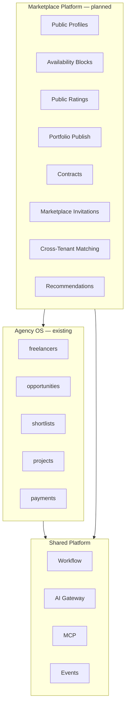

# 11 — Marketplace Platform

| Field | Value |
|-------|-------|
| **Version** | 1.0.0 |
| **Status** | Draft — Awaiting Approval |
| **Owner** | Platform Architecture |
| **Related** | [03 Business Domains](03%20Business%20Domains.md) · [04 Domain Model](04%20Domain%20Model.md) · [docs/35-marketplace-architecture.md](../35-marketplace-architecture.md) |

---

## Mission

The Marketplace Platform extends Talent OS from a **private agency operating system** into an **opt-in talent ecosystem** — enabling discovery, engagement, reputation, and contracting without forking existing roster → project flows.

**Principle:** Extend, don't fork. Marketplace builds on `freelancers`, `opportunities`, and `AssignmentService`.

---

## Position in the Stack

---

## Eight Subdomains

| # | Subdomain | Extends | Future Service |
|---|-----------|---------|----------------|
| 1 | **Talent Profiles** | `freelancers` | `MarketplaceProfileService` |
| 2 | **Availability** | `availability` enum | `MarketplaceAvailabilityService` |
| 3 | **Ratings** | `internal_rating` | `MarketplaceRatingService` |
| 4 | **Portfolio** | `freelancer_portfolio_items` | Extends portfolio service |
| 5 | **Contracts** | (new) | `MarketplaceContractService` |
| 6 | **Invitations** | ≠ team ≠ gig invites | `MarketplaceInvitationService` |
| 7 | **Matching** | `talent_match_scores` | Cross-tenant AI match |
| 8 | **Recommendations** | (new) | `MarketplaceRecommendationService` |

Blueprint migration: `supabase/migrations/018_marketplace_architecture.sql`  
Types: `modules/marketplace/`, `lib/marketplace/boundaries.ts`

---

## Visibility Model

| Tier | Audience | Data Exposed |
|------|----------|--------------|
| `private` | Managers + own freelancer | Full roster record |
| `tenant` | All tenant members | Standard profile |
| `marketplace` | Verified cross-tenant buyers | Redacted: no internal notes, contact opt-in only |

**Default:** `private`. Publishing requires explicit freelancer + manager consent.

---

## Key Entities (Planned)

| Table | Purpose |
|-------|---------|
| `talent_availability_blocks` | Date-range capacity (source of truth) |
| `marketplace_ratings` | Client/public ratings (separate from internal) |
| `marketplace_contracts` | Pre-project legal engagement |
| `marketplace_invitations` | Cross-tenant gig invitations |
| `marketplace_recommendations` | AI + rule-based suggestions |

Freelancer extensions: `marketplace_visibility`, `public_slug`, `marketplace_headline`, `marketplace_bio`

---

## Domain Boundaries

Three invitation flows — **never conflate:**

| Flow | Table | Purpose |
|------|-------|---------|
| Team invite | `member_invites` | Agency staff onboarding |
| Gig invite | `opportunity_recipients` | Broadcast to roster |
| Marketplace invite | `marketplace_invitations` | Cross-tenant engagement |

See [20 Technical Decisions](20%20Technical%20Decisions.md#td-006).

---

## Event Catalog (Planned)

| Event | Trigger |
|-------|---------|
| `marketplace.profile_published` | Freelancer goes public |
| `marketplace.profile_unpublished` | Visibility revoked |
| `marketplace.invitation_sent` | Cross-tenant invite |
| `marketplace.invitation_accepted` | Invite accepted |
| `marketplace.contract_signed` | Contract executed |
| `marketplace.rating_submitted` | New public rating |
| `marketplace.recommendation_generated` | AI recommendation batch |

Register in [16 Event Catalog](16%20Event%20Catalog.md) upon implementation.

---

## Integration Points

| Platform | Role |
|----------|------|
| [07 AI Platform](07%20AI%20Platform.md) | Cross-tenant matching, recommendations |
| [09 Workflow Platform](09%20Workflow%20Platform.md) | Invitation and contract lifecycle |
| [08 MCP Platform](08%20MCP%20Platform.md) | Recruiter agent marketplace tools |
| [13 Security Model](13%20Security%20Model.md) | Cross-tenant access controls |
| [12 WhatsApp Platform](12%20WhatsApp%20Platform.md) | Marketplace invite notifications |

---

## Implementation Strategy

### Phase 1 — Profile & Portfolio Publish

- Migration apply (018)
- `MarketplaceProfileService` — publish/unpublish, slug, redacted public view
- Portfolio `is_marketplace_visible` flag
- No cross-tenant UI yet — API-only

### Phase 2 — Availability & Ratings

- Availability blocks CRUD + `check_talent_availability()` RPC
- Public rating submission with moderation
- Aggregate public score computation

### Phase 3 — Contracts & Invitations

- Contract templates and signing workflow
- Marketplace invitation flow with tenant verification
- Events + n8n notifications

### Phase 4 — Discovery & Recommendations

- Cross-tenant search (governed)
- AI recommendations with explainability
- Marketplace dashboard for buyers

---

## Non-Goals (Near Term)

- Open public marketplace without verification
- Automatic exposure of internal ratings or notes
- Separate talent database for marketplace
- UI redesign (architecture and services first)

---

## Cross-References

| Document | Relationship |
|----------|--------------|
| [03 Business Domains](03%20Business%20Domains.md) | Domain placement |
| [18 Data Model](18%20Data%20Model.md) | Schema evolution |
| [19 Roadmap](19%20Roadmap.md) | Delivery timeline |
| [docs/35-marketplace-architecture.md](../35-marketplace-architecture.md) | Detailed blueprint |
