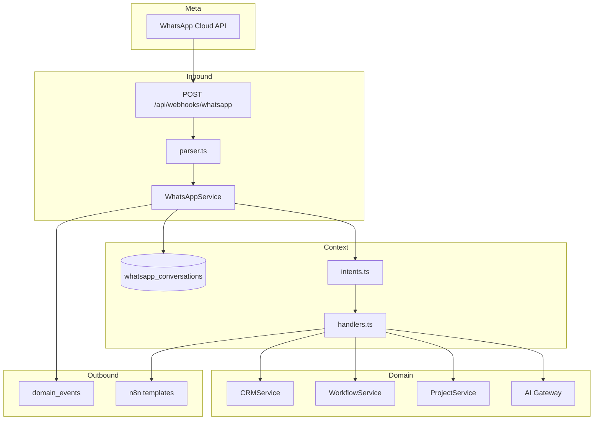

# 12 — WhatsApp Platform

| Field | Value |
|-------|-------|
| **Version** | 1.0.0 |
| **Status** | Draft — Awaiting Approval |
| **Owner** | Platform Architecture |
| **Related** | [05 System Context](05%20System%20Context.md) · [09 Workflow Platform](09%20Workflow%20Platform.md) · [docs/32-whatsapp-interface.md](../32-whatsapp-interface.md) |

---

## Mission

WhatsApp is a **first-class operational interface** for freelancers — not a notification afterthought. Freelancers accept gigs, manage milestones, check status, and query the AI agent from WhatsApp with parity to core web actions.

**Principle:** All business logic flows through domain services. WhatsApp modules are adapters — parse, route, delegate, emit events.

---

## Architecture



---

## Module Responsibilities

| Module | Path | Role |
|--------|------|------|
| Webhook route | `app/api/webhooks/whatsapp/route.ts` | Verify, dedup, orchestrate |
| Parser | `lib/whatsapp/parser.ts` | Meta payload → normalized messages |
| Intents | `lib/whatsapp/intents.ts` | Keyword + context-aware routing |
| Handlers | `lib/whatsapp/handlers.ts` | Intent → service delegation |
| Conversation | `whatsapp_conversations` table | Active entity, session state |
| Orchestrator | `lib/services/whatsapp.service.ts` | First-class domain service |
| Phone utils | `lib/whatsapp/phone.ts` | Normalization |

---

## Intent → Service Mapping

| Intent | Delegates To | No Duplicate Logic |
|--------|--------------|-------------------|
| `opportunity.interested` | `CRMService.respondToPendingOpportunity()` | ✅ |
| `opportunity.declined` | `CRMService.respondToPendingOpportunity()` | ✅ |
| `milestone.submit` | `WorkflowService.submitMilestone()` | ✅ |
| `milestone.start` | `WorkflowService.updateMilestoneStatus()` | ✅ |
| `project.status` | `ProjectService.getFreelancerProjectSummary()` | ✅ |
| `opt_out` | `WorkflowService.emitEvent('whatsapp.opt_out')` | ✅ |
| `agent.query` | `WhatsAppService.runAgentQuery()` → AI Gateway | ✅ |
| `help` | Static menu via n8n | ✅ |

---

## Freelancer Command Reference

| Message | Action |
|---------|--------|
| `YES` / `NO` | Respond to pending opportunity |
| `START` | Begin current milestone |
| `SUBMIT` | Submit milestone for review |
| `STATUS` | List active projects |
| `HELP` | Show command menu |
| `STOP` | Opt out of messages |
| Free text | AI agent (when configured) |

---

## Conversation Context

Table: `whatsapp_conversations` (migration 015)

| Field | Purpose |
|-------|---------|
| `active_intent` | Current multi-step flow |
| `active_entity_type` | e.g. `opportunity`, `milestone` |
| `active_entity_id` | UUID of active entity |
| `last_message_at` | Session freshness |

Enables contextual disambiguation (e.g. "YES" applies to pending opportunity).

---

## Domain Events

| Event | When |
|-------|------|
| `whatsapp.inbound` | Every inbound message |
| `whatsapp.intent_handled` | Successful intent execution |
| `whatsapp.agent_requested` | AI agent invoked |
| `whatsapp.opt_out` | User sends STOP |

Workflows: `wf-whatsapp-inbound`, `wf-whatsapp-agent`, `wf-whatsapp-opt-out`. See [16 Event Catalog](16%20Event%20Catalog.md).

---

## Tenant Resolution

Inbound messages include Meta `phone_number_id`. Platform resolves tenant via `integration_configs` where `provider = 'whatsapp'`.

**Current debt:** Full-table scan of active configs.  
**Target:** Indexed lookup on `config.phone_number_id` or dedicated column. See [FINAL Audit](../FINAL_AUDIT.md).

---

## Security

| Control | Implementation |
|---------|----------------|
| Webhook verification | Meta `hub.verify_token` (GET) |
| Signature validation | `x-hub-signature-256` HMAC |
| Idempotency | `webhook_deliveries` unique on `(source, idempotency_key)` |
| Freelancer auth | Phone → freelancer record within resolved tenant |
| Unknown sender | Log failed delivery; optional n8n `whatsapp.unrecognized` |

**Target:** Fail closed when `WHATSAPP_APP_SECRET` unset in production. See [13 Security Model](13%20Security%20Model.md).

---

## Outbound Messaging

Talent OS does **not** call WhatsApp send API directly in MVP. Outbound flows via **n8n**:

```
Handler result → buildN8nPayload() → dispatchToN8n() → n8n → WhatsApp Cloud API
```

**Target:** Optional direct send adapter in IntegrationService for latency-sensitive replies.

---

## AI Agent on WhatsApp

Current: `WhatsAppService.runAgentQuery()` calls AI Gateway with inline system prompt.

**Target state:**

1. Register prompt in PromptManager (`whatsapp.agent` or delegate to Knowledge Agent)
2. Apply full governance (feature flags, monthly caps — no `digest` bypass)
3. Route through Agent Framework for tool access (status, opportunities)
4. Response length cap (~320 chars) for WhatsApp UX

See [07 AI Platform](07%20AI%20Platform.md).

---

## Integration Configuration

Per-tenant `integration_configs` (provider: `whatsapp`):

```json
{
  "phone_number_id": "META_PHONE_NUMBER_ID",
  "business_account_id": "...",
  "is_active": true
}
```

Secrets (access tokens) **target:** encrypted via `encryptJson()`. See [13 Security Model](13%20Security%20Model.md).

---

## Target UX Principles

| Principle | Implementation |
|-----------|----------------|
| Three-tap rule | YES → START → SUBMIT for common path |
| Confirm destructive actions | Opt-out requires explicit STOP |
| Graceful unknown | Help menu + agent fallback |
| Language | English MVP; i18n intent keywords (future) |
| Offline tolerance | Messages queued; idempotent processing |

---

## Cross-References

| Document | Relationship |
|----------|--------------|
| [09 Workflow Platform](09%20Workflow%20Platform.md) | Event-driven side effects |
| [07 AI Platform](07%20AI%20Platform.md) | Agent queries |
| [16 Event Catalog](16%20Event%20Catalog.md) | WhatsApp events |
| [docs/10-whatsapp-integration.md](../10-whatsapp-integration.md) | Legacy integration doc |
| [docs/12-whatsapp-n8n-integration-architecture.md](../12-whatsapp-n8n-integration-architecture.md) | n8n flows |
