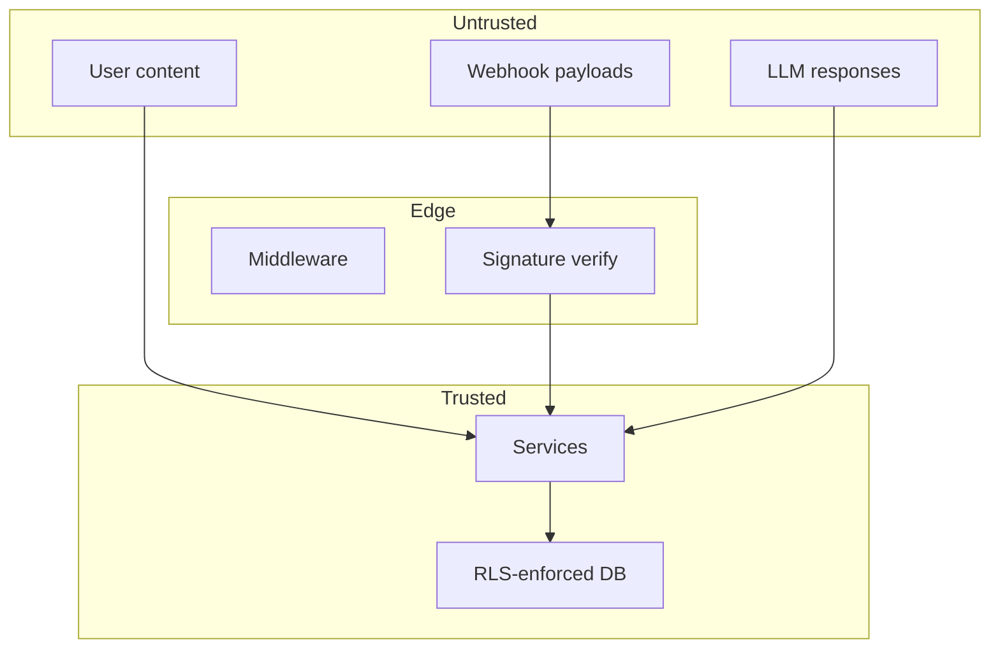

# 13 — Security Model

| Field | Value |
|-------|-------|
| **Version** | 1.0.0 |
| **Status** | Draft — Awaiting Approval |
| **Owner** | Platform Architecture |
| **Related** | [14 Deployment Model](14%20Deployment%20Model.md) · [17 API Standards](17%20API%20Standards.md) · [FINAL Audit](../FINAL_AUDIT.md) |

---

## Security Principles

1. **Fail closed** — deny by default; missing config rejects in production
2. **Defense in depth** — middleware + RBAC + RLS + service-layer checks
3. **Least privilege** — service role only for system paths; scoped admin queries
4. **Tenant isolation** — every query filtered by tenant context
5. **Auditability** — events, activity logs, webhook deliveries, AI request hashes
6. **Secrets never in client** — env vars and encrypted storage only

See [02 Product Philosophy](02%20Product%20Philosophy.md).

---

## Authentication

| Actor | Mechanism | Storage |
|-------|-----------|---------|
| Web users | Supabase Auth (JWT) | HTTP-only cookies via `@supabase/ssr` |
| Cron / internal | `Authorization: Bearer ${CRON_SECRET}` | Vercel env |
| n8n webhooks | HMAC `x-webhook-signature` | `N8N_WEBHOOK_SECRET` |
| WhatsApp | Meta verify token + `x-hub-signature-256` | Env vars |
| (Future) API partners | OAuth 2.0 + API keys | TBD |

Session refresh: `modules/core/utils/supabase/middleware.ts`

---

## Authorization — RBAC

### Roles

| Role | Scope |
|------|-------|
| `admin` | Full tenant: settings, billing, team, integrations |
| `talent_manager` | Talent, opportunities, projects, payments read, analytics |
| `freelancer` | Own profile, assigned projects, own payments |
| `client` | Company-linked projects and knowledge |

Defined: `modules/core/services/permissions.ts`, `USER_ROLES` in constants.

### Route Guards

Middleware (`middleware.ts`) enforces:

- `ADMIN_ONLY_ROUTES` — settings, billing, integrations
- `MANAGER_ONLY_ROUTES` — talent, analytics
- `CLIENT_RESTRICTED_ROUTES` — agency-only features blocked

Active tenant: `ACTIVE_TENANT_COOKIE` → `X-Tenant-ID` header.

### Permission Gates

Fine-grained permissions: `ai:match`, `agent:run`, `agent:configure`, etc.  
Checked in services, server actions, and MCP authorizer.

---

## Authorization — Row Level Security

All tenant tables enable RLS. Helper functions:

| Function | Purpose |
|----------|---------|
| `is_manager_of(tenant_id)` | Manager/admin CRUD |
| `is_member_of(tenant_id)` | Read membership |
| `manager_tenant_ids()` | Multi-tenant manager queries |

**Client access pattern:** company-linked rows via `tenant_members.company_id`.

TypeScript types: `modules/core/types/database.ts`

---

## Trust Boundaries



Treat user content and LLM output as **untrusted**. Sanitize before re-display; delimit in prompts.

---

## Service Role Usage

`createAdminServices()` uses Supabase service role — **bypasses RLS**.

| Allowed | Required Safeguard |
|---------|-------------------|
| Cron event dispatch | Filter by event tenant_id |
| Webhook processing | Resolve tenant before mutations |
| AI execution | Load ai_request with tenant scope |
| System maintenance | Admin-only routes |

**Rule:** Admin client reads/writes must include explicit `tenant_id` filters.

---

## SECURITY DEFINER Functions

PostgreSQL RPCs with elevated privileges:

| Function | Risk | Target Fix |
|----------|------|------------|
| `create_tenant_with_admin` | Any user can create tenants for arbitrary user IDs | `p_user_id = auth.uid()` guard |
| `link_freelancer_to_user` | Account takeover | `p_user_id = auth.uid()` guard |
| `search_knowledge_entries` | Cross-tenant if granted to authenticated | Membership check inside function |
| `search_knowledge_vector` | Same | Membership check |
| `search_freelancers` | Same | Already takes tenant_id — verify caller membership |
| `emit_domain_event` | Controlled emit | Keep service-role or validated |

See [FINAL Audit](../FINAL_AUDIT.md) C-02.

---

## Secrets Management

| Secret | Current | Target |
|--------|---------|--------|
| Supabase keys | Env vars | Keep; rotate on schedule |
| AI provider keys | Env vars | Keep |
| Integration configs | Plaintext JSON in DB | **encryptJson() at rest** |
| Cron secret | Single shared secret | **Separate secrets per route class** |
| Invite tokens | SHA-256 hash stored | Keep |

Encryption utilities: `lib/integrations/encryption.ts`

---

## Webhook Security

| Route | Verification | Fail-Closed Target |
|-------|--------------|-------------------|
| `/api/webhooks/n8n` | HMAC when secret set | Reject if secret missing in prod |
| `/api/webhooks/whatsapp` | Meta signature when secret set | Reject if secret missing in prod |

Idempotency: `webhook_deliveries (source, idempotency_key)` unique.

---

## System Route Security

**Critical (Phase 0):** Middleware must not redirect cron/internal/health routes to login.

Target: `SYSTEM_ROUTES` evaluated before auth redirect:

```
/api/cron/*
/api/internal/*
/api/health
/api/webhooks/*
```

Secondary auth: `CRON_SECRET` validated in route handler.

---

## Workflow & Approval Security

| Issue | Target |
|-------|--------|
| Null `approver_id` allows any user | Fail closed; role-based fallback |
| No tenant check on resolve | Verify approval.tenant_id matches session |
| Expiration not enforced | Reject expired approvals |

---

## AI Security

| Control | Status |
|---------|--------|
| All LLM via gateway | Target: 100% |
| Tenant feature flags | Production |
| Monthly caps | Production |
| Prompt hash storage | Production |
| `digest` bypass | **Remove** |
| Prompt injection mitigation | Delimit user content |
| Duplicate execution | Atomic claim |

See [07 AI Platform](07%20AI%20Platform.md).

---

## Realtime Publication

Tables on `supabase_realtime`: `notifications`, `projects`, `milestones`, `domain_events`, `payments`, `talent_match_scores`.

**Risk:** Client subscriptions must filter by tenant. Review before enabling client-side realtime.

---

## Agent Security

- Agents inherit user RBAC — no escalation
- Instructions server-side only
- Tool allowlist ∩ user permissions
- MCP destructive tools require explicit agent policy (future)

See [08 MCP Platform](08%20MCP%20Platform.md).

---

## Compliance Targets (Future)

| Requirement | Approach |
|-------------|----------|
| Data export | Tenant-scoped export API |
| Data deletion | Cascade deletes + storage purge |
| Audit log | `activity_logs` + event retention |
| SOC 2 readiness | Access reviews, encryption, monitoring |

---

## Security Roadmap

| Phase | Items |
|-------|-------|
| **Phase 0** | System routes, RPC guards, approval auth, webhook fail-closed, AI claim |
| **Phase 1** | Encrypt integration secrets, separate cron secrets, approval expiration |
| **Phase 2** | SECURITY DEFINER audit, Realtime review, distributed rate limits |
| **Phase 3** | OAuth partner API, penetration test, SOC 2 prep |

See [19 Roadmap](19%20Roadmap.md).

---

## Cross-References

| Document | Relationship |
|----------|--------------|
| [14 Deployment Model](14%20Deployment%20Model.md) | Env vars and infra |
| [17 API Standards](17%20API%20Standards.md) | API auth patterns |
| [docs/07-authentication-design.md](../07-authentication-design.md) | Legacy auth design |
| [docs/08-multi-tenant-architecture.md](../08-multi-tenant-architecture.md) | RLS detail |
