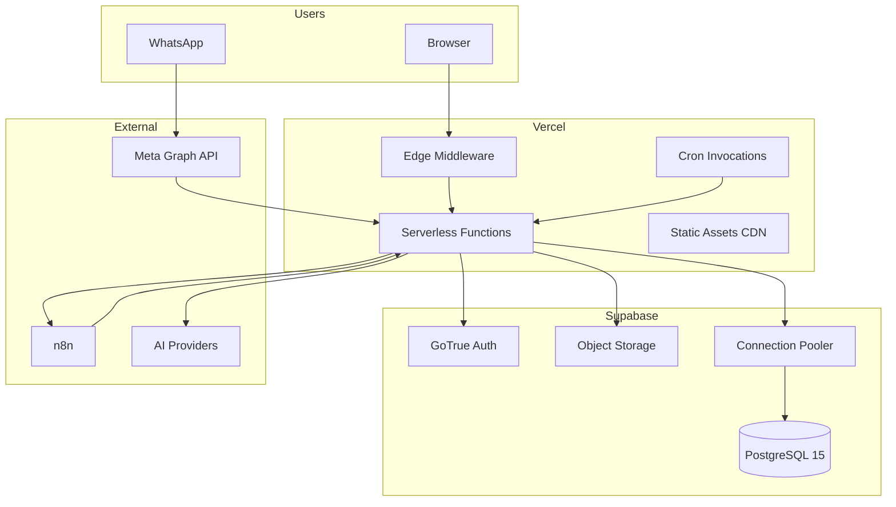

# 14 — Deployment Model

| Field | Value |
|-------|-------|
| **Version** | 1.0.0 |
| **Status** | Draft — Awaiting Approval |
| **Owner** | Platform Architecture |
| **Related** | [05 System Context](05%20System%20Context.md) · [13 Security Model](13%20Security%20Model.md) · [docs/deployment.md](../deployment.md) |

---

## Infrastructure Topology



---

## Environments

| Environment | Branch | URL | Database |
|-------------|--------|-----|----------|
| **Production** | `main` | `NEXT_PUBLIC_APP_URL` | Supabase production project |
| **Preview** | PR branches | `*.vercel.app` | Supabase staging (recommended) or shared dev |
| **Local** | any | `localhost:3000` | Supabase local or remote dev |

**Target:** Dedicated staging Supabase project for preview deployments.

---

## Vercel Configuration

File: `vercel.json`

| Setting | Value |
|---------|-------|
| Framework | Next.js |
| Build | `npm run build` |
| Install | `npm install` |
| Node | 20.x+ |

### Cron Schedules

| Path | Schedule | Purpose |
|------|----------|---------|
| `/api/cron/dispatch-events` | `* * * * *` | Outbox dispatch (50 events/run) |
| `/api/cron/process-workflow-jobs` | `* * * * *` | Job execution (50 jobs/run) |
| `/api/cron/check-overdue-milestones` | `0 8 * * *` | Daily overdue scan |

Auth: Vercel injects `Authorization: Bearer ${CRON_SECRET}`.

**Known issue:** Middleware may block cron before handler runs. Phase 0 fix required. See [13 Security Model](13%20Security%20Model.md).

---

## Supabase Configuration

| Service | Purpose |
|---------|---------|
| PostgreSQL | Primary data store, RLS, RPCs, pgvector |
| Auth | Email/password, magic link, OAuth (configurable) |
| Storage | Portfolio files, knowledge documents |
| Realtime | Select tables (review security) |
| Edge Functions | Not used in MVP (optional future) |

### Migrations

```bash
supabase link --project-ref <ref>
supabase db push
```

18 migrations (`001`–`018`). Apply in order. See [18 Data Model](18%20Data%20Model.md).

### Connection Strategy

- **User context:** Anon key + user JWT (RLS enforced)
- **System context:** Service role key (server only, never client bundle)
- **Pooling:** Supabase pooler for serverless (transaction mode)

---

## Environment Variables

### Required (Production)

| Variable | Scope | Purpose |
|----------|-------|---------|
| `NEXT_PUBLIC_SUPABASE_URL` | Public | Supabase project URL |
| `NEXT_PUBLIC_SUPABASE_ANON_KEY` | Public | Client-side auth |
| `SUPABASE_SERVICE_ROLE_KEY` | Server | Admin operations |
| `NEXT_PUBLIC_APP_URL` | Public | Redirect URLs |
| `CRON_SECRET` | Server | Cron + internal auth |
| `ENCRYPTION_KEY` | Server | 64-char hex for encryptJson |

### Integrations

| Variable | Required When |
|----------|---------------|
| `N8N_WEBHOOK_BASE_URL` | n8n dispatch enabled |
| `N8N_WEBHOOK_SECRET` | n8n signature verification |
| `WHATSAPP_VERIFY_TOKEN` | WhatsApp webhook setup |
| `WHATSAPP_APP_SECRET` | WhatsApp signature verification |

### AI

| Variable | Required When |
|----------|---------------|
| `OPENAI_API_KEY` | OpenAI provider |
| `ANTHROPIC_API_KEY` | Anthropic fallback |
| `AI_PRIMARY_PROVIDER` | Provider selection |
| `AI_EXECUTION_MODE` | `direct` or n8n (target: workflow) |

Full list: [docs/deployment.md](../deployment.md)

---

## CI/CD Pipeline

GitHub Actions: `.github/workflows/ci.yml`

```
checkout → npm ci → typecheck → lint → test:coverage → docs:check
```

| Gate | Blocks Merge |
|------|--------------|
| TypeScript | Yes |
| ESLint | Yes |
| Vitest (79 tests) | Yes |
| Docs freshness | Yes |

**Target:** Add migration lint, RLS integration tests, security scan.

---

## Deploy Checklist

1. ✅ All env vars set in Vercel (production + preview)
2. ✅ Migrations applied to target Supabase project
3. ✅ Cron jobs visible in Vercel dashboard
4. ✅ `/api/health` returns `{ ok: true, supabase: true }`
5. ✅ Webhook URLs configured in Meta + n8n
6. ✅ `CRON_SECRET` matches Vercel cron auth
7. ⬜ Phase 0: Verify cron routes not blocked by middleware
8. ⬜ Smoke test: emit event → workflow → n8n roundtrip

---

## Scaling Characteristics

| Component | Bottleneck | Mitigation |
|-----------|------------|------------|
| Serverless functions | Cold starts | Keep functions warm; minimize bundle |
| Cron throughput | 50+50 items/min | Increase batch size; dedicated worker (future) |
| PostgreSQL | Connection limits | Pooler; read replicas (future) |
| Outbox backlog | Sequential cron | Horizontal worker with SKIP LOCKED |
| AI rate limits | Provider quotas | Queue + tenant caps |

See [19 Roadmap](19%20Roadmap.md) Phase 2.

---

## Disaster Recovery

| Scenario | RTO Target | Procedure |
|----------|------------|-----------|
| Vercel outage | Wait for provider | Status page; no data loss |
| Supabase outage | Wait for provider | Read-only mode message |
| Bad migration | < 1 hour | Restore from Supabase backup; forward fix |
| Secret leak | < 30 min | Rotate keys; audit access logs |

**Target:** Documented runbooks in [docs/operations-guide.md](../operations-guide.md).

---

## Local Development

```bash
npm install
cp .env.example .env.local   # configure Supabase + keys
supabase start                  # optional local stack
npm run dev
npm test
npm run docs:generate
```

See [docs/developer-guide.md](../developer-guide.md).

---

## Cross-References

| Document | Relationship |
|----------|--------------|
| [13 Security Model](13%20Security%20Model.md) | Auth and secrets |
| [09 Workflow Platform](09%20Workflow%20Platform.md) | Cron-driven workflows |
| [15 Engineering Standards](15%20Engineering%20Standards.md) | CI requirements |
| [docs/23-vercel-deployment.md](../23-vercel-deployment.md) | Troubleshooting |
