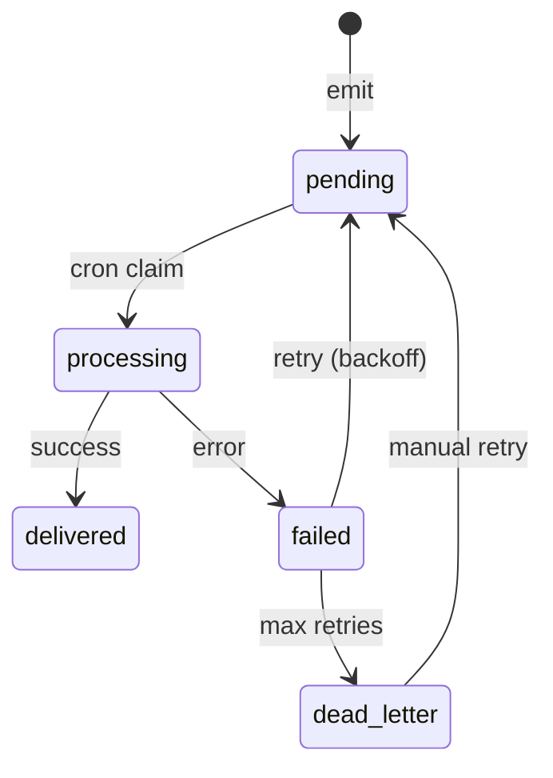

# 16 — Event Catalog

| Field | Value |
|-------|-------|
| **Version** | 1.0.0 |
| **Status** | Draft — Awaiting Approval |
| **Owner** | Platform Architecture |
| **Related** | [09 Workflow Platform](09%20Workflow%20Platform.md) · [04 Domain Model](04%20Domain%20Model.md) · [docs/events.md](../events.md) |

---

## Event Naming Convention

```
{domain}.{action}
```

Examples: `milestone.submitted`, `ai.match_requested`, `whatsapp.inbound`

| Field | Type | Required | Description |
|-------|------|----------|-------------|
| `event_type` | string | Yes | Dot-notation name |
| `aggregate_type` | string | Yes | Entity type (e.g. `milestone`) |
| `aggregate_id` | UUID | Yes | Entity primary key |
| `tenant_id` | UUID | Yes | Tenant scope |
| `idempotency_key` | string | Yes | Unique per tenant |
| `correlation_id` | UUID | Yes | End-to-end trace |
| `actor_id` | UUID | No | User who caused the event |
| `payload` | JSONB | Yes | Event-specific data |
| `scheduled_at` | timestamp | Yes | Earliest dispatch time |

Emit via: `WorkflowService.emitEvent()` or `emit_domain_event()` RPC.

---

## Production Events

### CRM / Opportunities

| Event | Emitter | Workflow | Payload Keys |
|-------|---------|----------|--------------|
| `opportunity.broadcast` | AssignmentService | wf-opportunity-broadcast | `opportunity_id`, `recipient_count` |
| `opportunity.opened` | CRMService | wf-opportunity-opened | `opportunity_id`, `title` |
| `opportunity.response` | CRMService | wf-opportunity-response | `opportunity_id`, `freelancer_id`, `response` |

### Projects / Milestones

| Event | Emitter | Workflow | Payload Keys |
|-------|---------|----------|--------------|
| `project.assigned` | ProjectService | wf-project-assigned | `project_id`, `freelancer_id`, `title` |
| `milestone.submitted` | WorkflowService | wf-milestone-submitted | `milestone_id`, `project_id`, `project_title` |
| `milestone.approved` | WorkflowService | wf-milestone-approved | `milestone_id`, `project_id`, `project_title` |
| `milestone.revision_requested` | WorkflowService | wf-milestone-revision | `milestone_id`, `project_id`, `review_note` |
| `milestone.overdue` | Cron (status-assessment) | wf-milestone-overdue | `milestone_id`, `project_id`, `due_date` |

### Finance

| Event | Emitter | Workflow | Payload Keys |
|-------|---------|----------|--------------|
| `payment.approved` | FinanceService | wf-payment-approved | `payment_id`, `project_id`, `amount` |
| `payment.paid` | FinanceService | wf-payment-paid | `payment_id`, `freelancer_id`, `amount` |

### AI

| Event | Emitter | Workflow | Payload Keys |
|-------|---------|----------|--------------|
| `ai.match_requested` | AIService / matching | wf-ai-match | `ai_request_id`, `opportunity_id` |
| `ai.brief_parse_requested` | AIService | wf-ai-brief-parse | `ai_request_id`, `opportunity_id` |
| `ai.summary_requested` | AIService | wf-ai-summary | `ai_request_id`, `entity_type`, `entity_id` |
| `ai.status_assessment_requested` | AIService | wf-ai-status | `ai_request_id`, `project_id` |

### WhatsApp

| Event | Emitter | Workflow | Payload Keys |
|-------|---------|----------|--------------|
| `whatsapp.inbound` | WhatsAppService | wf-whatsapp-inbound | `wa_message_id`, `phone`, `body`, `intent` |
| `whatsapp.intent_handled` | WhatsAppService | — (logged) | `intent`, `workflow_event` |
| `whatsapp.agent_requested` | WhatsAppService | wf-whatsapp-agent | `query`, `response` |
| `whatsapp.opt_out` | WhatsAppService | wf-whatsapp-opt-out | `phone`, `freelancer_id` |

---

## Planned Events

### Knowledge Platform

| Event | Emitter | Purpose |
|-------|---------|---------|
| `knowledge.entry_created` | KnowledgeService | Audit + workflow hooks |
| `knowledge.embedding_requested` | KnowledgeService | Trigger embedding worker |
| `knowledge.embedding_completed` | Embedding worker | Mark indexed |

### Marketplace Platform

| Event | Purpose |
|-------|---------|
| `marketplace.profile_published` | Profile goes public |
| `marketplace.profile_unpublished` | Visibility revoked |
| `marketplace.invitation_sent` | Cross-tenant invite |
| `marketplace.invitation_accepted` | Invite accepted |
| `marketplace.contract_signed` | Contract executed |
| `marketplace.rating_submitted` | Public rating |
| `marketplace.recommendation_generated` | AI batch recommendations |

See [11 Marketplace Platform](11%20Marketplace%20Platform.md).

### Agents

| Event | Purpose |
|-------|---------|
| `agent.session_started` | Agent run audit |
| `agent.session_completed` | Token usage aggregation |
| `agent.tool_invoked` | MCP audit trail |

---

## Event Lifecycle



| Status | Meaning |
|--------|---------|
| `pending` | Awaiting dispatch |
| `processing` | Claimed by worker |
| `delivered` | Successfully processed |
| `failed` | Error; will retry |
| `dead_letter` | Max retries exceeded |

**Target:** `delivered` only after all workflow jobs complete. See [09 Workflow Platform](09%20Workflow%20Platform.md).

---

## Idempotency Key Patterns

| Pattern | Example |
|---------|---------|
| Entity action | `milestone-submitted:{milestone_id}` |
| WhatsApp message | `whatsapp-inbound:{wa_message_id}` |
| Overdue (daily) | `milestone-overdue:{id}:{due_date}` |
| AI request | `ai-match:{opportunity_id}:{request_id}` |
| Webhook | `wa-inbound:{wa_message_id}` |

Unique constraint: `(tenant_id, idempotency_key)` on `domain_events`.

---

## n8n Envelope Format

Outbound events to n8n include:

```json
{
  "event": "milestone.approved",
  "tenant_id": "uuid",
  "correlation_id": "uuid",
  "idempotency_key": "string",
  "actor_id": "uuid | null",
  "data": { }
}
```

Builder: `lib/integrations/n8n.ts` → `buildN8nEnvelope()`

---

## Adding a New Event (Checklist)

1. Define event in this catalog
2. Emit from owning service with stable idempotency key
3. Register workflow in `lib/workflows/registry.ts` (if needed)
4. Run `npm run docs:generate`
5. Add workflow/integration test
6. Update [docs/events.md](../events.md)

See [15 Engineering Standards](15%20Engineering%20Standards.md).

---

## Cross-References

| Document | Relationship |
|----------|--------------|
| [09 Workflow Platform](09%20Workflow%20Platform.md) | Workflow routing |
| [04 Domain Model](04%20Domain%20Model.md) | Aggregate transitions |
| [generated/workflows.md](../generated/workflows.md) | Auto-generated map |
| [11 Marketplace Platform](11%20Marketplace%20Platform.md) | Planned marketplace events |
