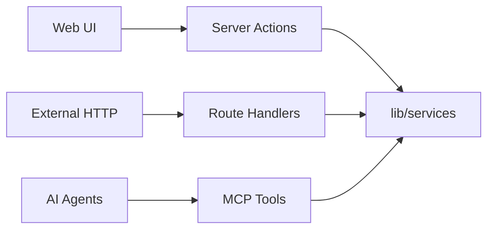

# 17 — API Standards

| Field | Value |
|-------|-------|
| **Version** | 1.0.0 |
| **Status** | Draft — Awaiting Approval |
| **Owner** | Platform Architecture |
| **Related** | [06 C4 Architecture](06%20C4%20Architecture.md) · [08 MCP Platform](08%20MCP%20Platform.md) · [docs/api.md](../api.md) |

---

## API-First Principle

Every capability exposed to humans must also be reachable by **authorized programmatic clients** through a consistent service layer. Three surfaces today; one logical API:



**Target:** Fourth surface — versioned public REST/GraphQL API for partners.

---

## Surface Comparison

| Surface | Location | Auth | Idempotency | Best For |
|---------|----------|------|-------------|----------|
| **Server Actions** | `app/actions/*.ts` | Supabase session | Action-level keys | Form mutations from UI |
| **Route Handlers** | `app/api/**/route.ts` | JWT / HMAC / cron | Header or body key | Webhooks, cron, REST |
| **Queries** | `lib/queries/*.queries.ts` | Session (via services) | N/A (reads) | RSC data loading |
| **MCP Tools** | `lib/mcp/servers/` | Session context | Tool input | Agent invocations |

Auto-generated catalogs: [generated/api-routes.md](../generated/api-routes.md) · [generated/server-actions.md](../generated/server-actions.md)

---

## Authentication Standards

| Surface | Method | Header / Cookie |
|---------|--------|-----------------|
| User REST | Supabase JWT | `Authorization: Bearer` or session cookie |
| Server Actions | Session cookie | Automatic via `createClient()` |
| Cron | Shared secret | `Authorization: Bearer ${CRON_SECRET}` |
| n8n webhook | HMAC | `x-webhook-signature` |
| WhatsApp | Meta signature | `x-hub-signature-256` |
| Internal AI | Cron secret | `Authorization: Bearer ${CRON_SECRET}` |

**Target:** Separate secrets: `CRON_SECRET`, `INTERNAL_API_SECRET`, `N8N_WEBHOOK_SECRET`.

See [13 Security Model](13%20Security%20Model.md).

---

## Tenant Context

Every authenticated request must resolve tenant context:

```typescript
const { tenant, user, role } = await requireTenant()
const services = await createServices()
// All service calls include tenant.id
```

For route handlers:

```typescript
// Tenant from middleware header or explicit param
const tenantId = request.headers.get('X-Tenant-ID')
```

Admin routes must still filter by tenant from payload — never global reads.

---

## Response Conventions

### Success (Route Handlers)

```json
{
  "data": { },
  "meta": { "correlation_id": "uuid" }
}
```

### Error (Route Handlers)

```json
{
  "error": "Human-readable message",
  "code": "MACHINE_READABLE_CODE",
  "status": 400
}
```

### Server Actions / Services

```typescript
{ ok: true, data: T } | { ok: false, error: string }
```

HTTP status mapping for routes:

| Code | When |
|------|------|
| 200 | Success |
| 400 | Validation error |
| 401 | Unauthenticated |
| 403 | Forbidden (RBAC) |
| 404 | Not found |
| 409 | Conflict / duplicate |
| 429 | Rate limited |
| 500 | Internal error |

---

## Idempotency

| Surface | Mechanism |
|---------|-----------|
| Domain events | `idempotency_key` unique per tenant |
| Webhooks | `webhook_deliveries (source, idempotency_key)` |
| AI requests | Entity + type dedup in service layer |
| MCP mutations | Optional `idempotencyKey` in tool input |

Clients should send `X-Idempotency-Key` header on mutating REST calls (target standard).

---

## Route Handler Categories

### Public (no auth)

```
/login, /signup, /invite
/api/auth/callback, /api/auth/signout, /api/auth/invite
/api/webhooks/*
/api/cron/*          ← target: system auth only
/api/internal/*      ← target: system auth only
/api/health
```

### Authenticated (JWT)

```
/api/talent/search
/api/analytics/dashboard
/api/team/members
/api/ai/match/*
/api/ai/pm/*
```

### System (secret)

```
/api/cron/dispatch-events
/api/cron/process-workflow-jobs
/api/cron/check-overdue-milestones
/api/internal/ai/execute
/api/internal/ai/execute-match
```

---

## Server Action Standards

| Rule | Detail |
|------|--------|
| Location | `app/actions/{domain}.ts` |
| Directive | `'use server'` at file top |
| Auth | `requireTenant()` or role guard |
| Validation | Zod schemas from `modules/*/validation.ts` |
| Revalidation | `revalidatePath()` for affected pages |
| No direct DB | Always via `createServices()` |

---

## MCP Tool Standards

| Rule | Detail |
|------|--------|
| Naming | `{server}_{action}` |
| Schema | JSON Schema in tool definition |
| Auth | `requiredPermission` + context role |
| Destructive | Flag `destructive: true` |
| Output | Typed; errors as `{ isError: true }` |

See [08 MCP Platform](08%20MCP%20Platform.md).

---

## Versioning (Target)

| Version | Path | Status |
|---------|------|--------|
| v0 (current) | Unversioned routes | Internal |
| v1 (target) | `/api/v1/*` | Partner API |

Breaking changes require new version; old version supported for deprecation window (minimum 90 days).

---

## Rate Limiting

| Surface | Current | Target |
|---------|---------|--------|
| AI Gateway | In-memory per tenant | Distributed (Upstash Redis) |
| REST API | None | Per-tenant + per-IP |
| Webhooks | None | Source-based limits |
| MCP | None | Per-agent session limits |

---

## Pagination

Standard query parameters (target):

```
?limit=20&offset=0
?cursor=base64&limit=20   # cursor-based for large sets
```

Response meta:

```json
{ "meta": { "total": 100, "limit": 20, "offset": 0, "has_more": true } }
```

---

## CORS & External Access

Current: Same-origin for web app.  
Target: Configurable CORS for `/api/v1/*` partner routes with API key or OAuth.

---

## Documentation Requirements

| Change | Action |
|--------|--------|
| New route | Auto-generated catalog updates via `docs:generate` |
| New action | Same |
| New MCP tool | Same |
| Breaking change | Version bump + migration guide |

---

## Cross-References

| Document | Relationship |
|----------|--------------|
| [08 MCP Platform](08%20MCP%20Platform.md) | Agent API surface |
| [15 Engineering Standards](15%20Engineering%20Standards.md) | Layering rules |
| [13 Security Model](13%20Security%20Model.md) | Auth detail |
| [docs/05-api-architecture.md](../05-api-architecture.md) | Legacy API doc |
