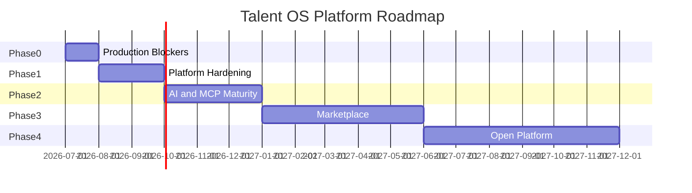

# 19 — Roadmap

| Field | Value |
|-------|-------|
| **Version** | 1.0.0 |
| **Status** | Draft — Awaiting Approval |
| **Owner** | Platform Architecture |
| **Related** | [01 Vision](01%20Vision.md) · [FINAL Audit](../FINAL_AUDIT.md) · [20 Technical Decisions](20%20Technical%20Decisions.md) |

---

## Roadmap Overview

Timelines are **sequencing indicators**, not calendar commitments. Each phase exits on defined criteria.

---

## Current State (Baseline)

| Dimension | Status |
|-----------|--------|
| Agency OS core flows | ✅ Functional (beta) |
| Event outbox + workflow engine | ✅ Implemented; reliability gaps |
| AI Gateway | ✅ Implemented; bypass paths exist |
| Knowledge module | ✅ FTS; embeddings pending |
| Agent framework | ✅ Schema + registry; MCP stub |
| WhatsApp interface | ✅ Production |
| Marketplace | 📋 Architecture only |
| Test coverage | ⚠️ ~9% |
| Production hardening | ❌ 5 critical blockers |

Source: [FINAL Audit](../FINAL_AUDIT.md)

---

## Phase 0 — Production Blockers

**Exit criteria:** Zero critical audit findings; cron jobs verified in deployed environment.

| # | Deliverable | Audit Ref | Platform Doc |
|---|-------------|-----------|--------------|
| 0.1 | `SYSTEM_ROUTES` middleware bypass for cron/internal/health | C-01 | [13 Security Model](13%20Security%20Model.md) |
| 0.2 | `auth.uid()` guards on tenant/freelancer RPCs | C-02 | [18 Data Model](18%20Data%20Model.md) |
| 0.3 | Approval fail-closed + tenant check | C-03 | [09 Workflow Platform](09%20Workflow%20Platform.md) |
| 0.4 | Webhook fail-closed in production | C-04 | [13 Security Model](13%20Security%20Model.md) |
| 0.5 | Atomic AI request claim (`pending → processing`) | C-05 | [07 AI Platform](07%20AI%20Platform.md) |
| 0.6 | Smoke tests for cron roundtrip | — | [15 Engineering Standards](15%20Engineering%20Standards.md) |

**No new features in Phase 0.** Fixes only.

---

## Phase 1 — Platform Hardening

**Exit criteria:** Workflow reliability tested under load; test coverage ≥ 30%; integration secrets encrypted.

| # | Deliverable | Platform Doc |
|---|-------------|--------------|
| 1.1 | Outbox index fix + atomic event claim | [09 Workflow Platform](09%20Workflow%20Platform.md) |
| 1.2 | Sequential workflow step execution | [09 Workflow Platform](09%20Workflow%20Platform.md) |
| 1.3 | Defer `delivered` until jobs complete | [16 Event Catalog](16%20Event%20Catalog.md) |
| 1.4 | Approval expiration enforcement | [09 Workflow Platform](09%20Workflow%20Platform.md) |
| 1.5 | Encrypt `integration_configs` secrets | [13 Security Model](13%20Security%20Model.md) |
| 1.6 | WhatsApp tenant lookup index | [12 WhatsApp Platform](12%20WhatsApp%20Platform.md) |
| 1.7 | Remove `digest` AI governance bypass | [07 AI Platform](07%20AI%20Platform.md) |
| 1.8 | Migrate WhatsApp inline prompts to PromptManager | [07 AI Platform](07%20AI%20Platform.md) |
| 1.9 | Consolidate talent domain into single factory | [03 Business Domains](03%20Business%20Domains.md) |
| 1.10 | Archival cron for webhook_deliveries | [18 Data Model](18%20Data%20Model.md) |
| 1.11 | Test coverage ≥ 30% on services/workflows | [15 Engineering Standards](15%20Engineering%20Standards.md) |

---

## Phase 2 — AI & MCP Maturity

**Exit criteria:** MCP adapters wired for core domains; embedding pipeline operational; single AI execution path.

| # | Deliverable | Platform Doc |
|---|-------------|--------------|
| 2.1 | MCP adapters: knowledge, talent, projects, crm | [08 MCP Platform](08%20MCP%20Platform.md) |
| 2.2 | MCP adapters: workflow, finance, ai, analytics | [08 MCP Platform](08%20MCP%20Platform.md) |
| 2.3 | Agent tool execution end-to-end | [07 AI Platform](07%20AI%20Platform.md) |
| 2.4 | Knowledge embedding worker + vector search | [10 Knowledge Platform](10%20Knowledge%20Platform.md) |
| 2.5 | Hybrid FTS + vector retrieval for RAG | [10 Knowledge Platform](10%20Knowledge%20Platform.md) |
| 2.6 | Unified AI execution via workflow (deprecate dual paths) | [07 AI Platform](07%20AI%20Platform.md) |
| 2.7 | Distributed rate limiting (Upstash) | [07 AI Platform](07%20AI%20Platform.md) |
| 2.8 | Persist AI cost tracking to DB | [07 AI Platform](07%20AI%20Platform.md) |
| 2.9 | Legacy OpenAI client path removal | [07 AI Platform](07%20AI%20Platform.md) |
| 2.10 | Test coverage ≥ 50% | [15 Engineering Standards](15%20Engineering%20Standards.md) |

---

## Phase 3 — Marketplace

**Exit criteria:** Cross-tenant discovery with opt-in profiles; contracts and invitations operational.

| # | Deliverable | Platform Doc |
|---|-------------|--------------|
| 3.1 | Apply migration 018; MarketplaceProfileService | [11 Marketplace Platform](11%20Marketplace%20Platform.md) |
| 3.2 | Portfolio publish + public slug | [11 Marketplace Platform](11%20Marketplace%20Platform.md) |
| 3.3 | Availability blocks + conflict detection | [11 Marketplace Platform](11%20Marketplace%20Platform.md) |
| 3.4 | Public ratings with moderation | [11 Marketplace Platform](11%20Marketplace%20Platform.md) |
| 3.5 | Marketplace contracts workflow | [11 Marketplace Platform](11%20Marketplace%20Platform.md) |
| 3.6 | Cross-tenant invitations + events | [16 Event Catalog](16%20Event%20Catalog.md) |
| 3.7 | AI cross-tenant matching (governed) | [11 Marketplace Platform](11%20Marketplace%20Platform.md) |
| 3.8 | Recommendations engine | [11 Marketplace Platform](11%20Marketplace%20Platform.md) |

---

## Phase 4 — Open Platform

**Exit criteria:** Partner API documented; OAuth flow; webhook subscriptions for tenants.

| # | Deliverable | Platform Doc |
|---|-------------|--------------|
| 4.1 | Versioned public API `/api/v1/*` | [17 API Standards](17%20API%20Standards.md) |
| 4.2 | OAuth 2.0 partner authentication | [13 Security Model](13%20Security%20Model.md) |
| 4.3 | Tenant webhook subscriptions | [16 Event Catalog](16%20Event%20Catalog.md) |
| 4.4 | Configurable workflow packs | [09 Workflow Platform](09%20Workflow%20Platform.md) |
| 4.5 | Read replicas / edge caching evaluation | [14 Deployment Model](14%20Deployment%20Model.md) |
| 4.6 | SOC 2 readiness assessment | [13 Security Model](13%20Security%20Model.md) |

---

## Parallel Tracks (Continuous)

| Track | Ongoing Work |
|-------|--------------|
| **Documentation** | Keep Platform blueprint + generated catalogs in sync |
| **WhatsApp UX** | Command parity, agent quality, response latency |
| **Observability** | Correlation tracing, dead-letter dashboards |
| **Developer Experience** | Local dev tooling, test fixtures, CI speed |

---

## Decision Gates

| Gate | Required Before |
|------|-----------------|
| Architecture review | Any Phase 2+ feature |
| Security review | Phase 0 merge to main |
| Load test | Phase 1 exit |
| Penetration test | Phase 4 entry |
| Marketplace legal review | Phase 3 cross-tenant launch |

---

## Success Metrics by Phase

| Phase | Key Metric |
|-------|------------|
| 0 | Cron success rate 100% in production |
| 1 | Zero duplicate AI executions in 30-day window |
| 2 | Agent tool success rate ≥ 95% |
| 3 | Marketplace profile publish < 5 min flow |
| 4 | Partner API uptime ≥ 99.9% |

Aligned with [01 Vision](01%20Vision.md) success criteria.

---

## Cross-References

| Document | Relationship |
|----------|--------------|
| [01 Vision](01%20Vision.md) | Strategic phases A–D |
| [FINAL Audit](../FINAL_AUDIT.md) | Phase 0 source |
| [20 Technical Decisions](20%20Technical%20Decisions.md) | ADRs governing roadmap |
| [docs/01-PRD.md](../01-PRD.md) | Product KPIs |
