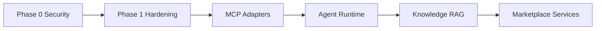

# Architecture Gap Analysis

| Field | Value |
|-------|-------|
| **Version** | 1.0.0 |
| **Date** | 2026-07-30 |
| **Baseline** | Repository @ `cursor/platform-blueprint-5fb1` |
| **Reference** | [Platform Blueprint](./README.md) · [FINAL Audit](../FINAL_AUDIT.md) |
| **Status** | Complete — No code changes |

---

## Executive Summary

Talent OS implements a **credible agency operating system MVP** with clear layering, multi-tenancy, an event outbox, workflow engine, AI gateway, and WhatsApp adapter. Against the [Platform Blueprint](./README.md), the codebase is **approximately 55% aligned** on architecture intent but **~35% aligned** on platform maturity targets (MCP execution, agent runtime, knowledge RAG, marketplace services, production security).

### Overall Platform Scorecard

| Dimension | Score (1–5) | Blueprint Target | Gap |
|-----------|-------------|------------------|-----|
| **Current maturity** | 2.8 | 4.0 (Phase B) | Beta; finance/analytics/MCP/marketplace incomplete |
| **Architecture quality** | 3.5 | 4.5 | Good layering; talent fragmentation, DB-trigger events |
| **Scalability** | 2.5 | 4.0 | Cron caps, no job locking, in-memory rate limits |
| **Security** | 2.0 | 4.5 | 5 critical blockers from audit |
| **Performance** | 3.0 | 3.5 | Adequate MVP; N+1 and full-table scans at scale |
| **Developer experience** | 3.2 | 4.0 | Strong docs; 9% test coverage |
| **AI readiness** | 3.0 | 4.5 | Gateway exists; bypass paths, no embeddings |
| **MCP readiness** | 1.5 | 4.0 | Catalog complete; zero working adapters |
| **Workflow readiness** | 3.2 | 4.5 | Engine works; reliability semantics incomplete |
| **Knowledge readiness** | 2.8 | 4.0 | FTS + chunks; no vectors or RAG |
| **Marketplace readiness** | 1.0 | 3.0 (Phase C) | Schema blueprint only |

**Score legend:** 1 = Missing · 2 = Stub/fragile · 3 = Functional beta · 4 = Production-grade · 5 = Best-in-class

### Critical Path to Blueprint Alignment

**Blockers before any feature work:** 5 critical security/reliability issues ([Phase 0](./19%20Roadmap.md)).  
**Blockers before AI-native claim:** MCP adapters + agent execution loop + embedding worker.  
**Blockers before marketplace claim:** All eight marketplace services.

---

## Methodology

1. Compared each module against corresponding Platform doc (01–20).
2. Verified implementation via services, repositories, migrations, tests, and audit findings.
3. Rated eleven dimensions per module on 1–5 scale.
4. Logged gaps with severity, impact, solution, effort (S/M/L/XL), and dependencies.
5. **No code was modified.**

**Evidence sources:** 16 services, 18 migrations, 79 tests (~9.3% line coverage), 10 MCP servers (~96 tools), 17 workflow definitions.

---

## Module Scorecard Matrix

| Module | Maturity | Arch | Scale | Security | Perf | DX | AI | MCP | WF | KB | MKT |
|--------|----------|------|-------|----------|------|-----|-----|-----|-----|-----|-----|
| **Core / Tenant** | 3 | 4 | 3 | **1** | 3 | 3 | — | — | — | — | — |
| **Talent** | 3 | **2** | 3 | 2 | 3 | 2 | 2 | 1 | — | — | 2 |
| **CRM** | 3 | 4 | 3 | 3 | 3 | 3 | 3 | 1 | 4 | — | — |
| **Assignment** | 3 | 4 | 3 | 3 | 3 | 3 | 3 | — | 4 | — | — |
| **Projects** | 4 | 4 | 3 | **2** | 3 | 3 | 3 | 1 | 3 | — | — |
| **Finance** | **1** | 2 | 2 | 3 | 3 | 2 | — | 1 | 3 | — | — |
| **Notifications** | 3 | 3 | 3 | 2 | 3 | 3 | — | 1 | 4 | — | — |
| **Analytics** | **2** | 2 | 2 | 3 | 3 | 2 | 2 | 1 | — | — | — |
| **Integrations** | 3 | 3 | 2 | **2** | **2** | 3 | 3 | — | 4 | — | — |
| **Workflow** (platform) | 3 | 4 | **2** | **2** | 2 | 3 | 3 | — | — | — | — |
| **AI** (platform) | 3 | 4 | **2** | 3 | 2 | 3 | — | 2 | 3 | 2 | — |
| **Knowledge** (platform) | 3 | 4 | 3 | 2 | 3 | 4 | 2 | 1 | — | — | — |
| **Agents** (platform) | 2 | 4 | 2 | 3 | — | 3 | 2 | **1** | 2 | 2 | — |
| **WhatsApp** (platform) | 4 | 4 | 3 | **2** | 3 | 2 | **2** | — | 4 | — | — |
| **MCP** (platform) | **1** | 3 | 2 | 3 | — | 2 | 3 | — | — | — | — |
| **Marketplace** (platform) | **1** | 3 | — | — | — | 2 | 2 | — | — | — | — |

*— = not primary concern for this module*

---

## Per-Module Analysis

---

### 1. Core / Tenant

**Blueprint ref:** [03 Business Domains](./03%20Business%20Domains.md) · [13 Security Model](./13%20Security%20Model.md)  
**Key paths:** `modules/core/`, `middleware.ts`, `modules/core/api/auth.actions.ts`

#### Dimension Scores

| Dimension | Score | Assessment |
|-----------|-------|------------|
| Current maturity | 3 | Auth, RBAC, tenant cookie, invites functional |
| Architecture quality | 4 | Clean infra boundary; well-separated concerns |
| Scalability | 3 | Middleware DB query per request; acceptable at MVP |
| Security | **1** | Critical middleware + RPC gaps |
| Performance | 3 | Membership lookup on every authenticated request |
| Developer experience | 3 | Clear guards/session helpers; lacks middleware tests |
| AI / MCP / WF / KB / MKT | — | Infrastructure module |

#### Gaps

| ID | Issue | Severity | Impact | Recommended Solution | Effort | Dependencies |
|----|-------|----------|--------|----------------------|--------|--------------|
| CORE-01 | Middleware blocks `/api/cron/*`, `/api/internal/*`, `/api/health` | **Critical** | All automation broken in production | Add `SYSTEM_ROUTES` bypass before auth redirect | **S** | None |
| CORE-02 | `create_tenant_with_admin` lacks `auth.uid()` check | **Critical** | Unlimited tenant creation, user ID spoofing | Add RPC guard or revoke `authenticated` grant | **S** | Migration |
| CORE-03 | `link_freelancer_to_user` lacks `auth.uid()` check | **Critical** | Freelancer account takeover | Same as CORE-02 | **S** | Migration |
| CORE-04 | No middleware/route security tests | High | Regressions undetected | Add tests for PUBLIC/SYSTEM routes | **M** | CORE-01 |
| CORE-05 | No RLS integration test suite | High | Tenant leak risk undetected | Supabase test harness with per-role assertions | **L** | Test infra |
| CORE-06 | Single shared `CRON_SECRET` | Medium | Blast radius if leaked | Separate secrets per route class | **S** | Env config |

---

### 2. Talent

**Blueprint ref:** [03 Business Domains](./03%20Business%20Domains.md) · TD-003  
**Key paths:** `lib/services/talent.service.ts`, `lib/domains/talent/`, `lib/talent/queries.ts`

#### Dimension Scores

| Dimension | Score | Assessment |
|-----------|-------|------------|
| Current maturity | 3 | CRUD, search, roster ops work |
| Architecture quality | **2** | Triple implementation paths |
| Scalability | 3 | RPC search adequate to ~500 freelancers/tenant |
| Security | 2 | `link_freelancer_to_user` RPC; `search_freelancers` DEFINER trust |
| Performance | 3 | Indexed queries; portfolio ad-hoc factory churn |
| Developer experience | 2 | Unclear canonical import path |
| AI readiness | 2 | Match candidates feed AI; no embeddings on profiles |
| MCP readiness | 1 | 11 tools cataloged; adapters not wired |
| Marketplace readiness | 2 | Base `freelancers` table; no marketplace columns in use |

#### Gaps

| ID | Issue | Severity | Impact | Recommended Solution | Effort | Dependencies |
|----|-------|----------|--------|----------------------|--------|--------------|
| TAL-01 | `PortfolioService` outside main factory | High | Duplicate repo contexts, untestable DI | Register in `createServices()` | **M** | TD-003 |
| TAL-02 | Duplicate domain: `lib/domains/talent/` + `lib/talent/queries.ts` | High | Divergent behavior, onboarding friction | Consolidate to single module | **L** | TAL-01 |
| TAL-03 | `search_freelancers` RPC no membership check | High | Cross-tenant data if RPC callable | Add `is_member_of(p_tenant_id)` in function | **S** | Migration |
| TAL-04 | No service-layer tests | Medium | Refactor risk | Vitest suite for TalentService | **M** | Test patterns |
| TAL-05 | MCP talent tools non-functional | High | Agents cannot search roster | Wire MCP adapters (Phase 2) | **M** | MCP-01 |

---

### 3. CRM

**Blueprint ref:** [03 Business Domains](./03%20Business%20Domains.md) · [16 Event Catalog](./16%20Event%20Catalog.md)  
**Key paths:** `lib/services/crm.service.ts`, `lib/repositories/lead.repository.ts`

#### Dimension Scores

| Dimension | Score | Assessment |
|-----------|-------|------------|
| Current maturity | 3 | Companies, opportunities, responses complete |
| Architecture quality | 4 | Proper service layer; one DB-trigger shortcut |
| Scalability | 3 | Standard tenant-scoped queries |
| Security | 3 | RLS enforced; standard patterns |
| Performance | 3 | Adequate for MVP load |
| Developer experience | 3 | Clear actions/queries split |
| AI readiness | 3 | Opportunity context feeds matching/brief parse |
| MCP readiness | 1 | 6 CRM tools; adapters stub |
| Workflow readiness | 4 | All CRM events have workflow bindings |

#### Gaps

| ID | Issue | Severity | Impact | Recommended Solution | Effort | Dependencies |
|----|-------|----------|--------|----------------------|--------|--------------|
| CRM-01 | `opportunity.opened` via DB trigger not service | Medium | Split emission path; harder to test/observe | Move emit to CRMService on status transition | **M** | Event catalog |
| CRM-02 | No CRMService tests | Medium | Regression risk on response flow | Service + integration tests | **M** | — |
| CRM-03 | MCP CRM tools not wired | High | Recruiter agent cannot manage CRM | MCP adapter rollout | **M** | MCP-01 |

---

### 4. Assignment

**Blueprint ref:** [03 Business Domains](./03%20Business%20Domains.md)  
**Key paths:** `lib/services/assignment.service.ts`

#### Dimension Scores

| Dimension | Score | Assessment |
|-----------|-------|------------|
| Current maturity | 3 | Broadcast, shortlists, match scores work |
| Architecture quality | 4 | Clean bridge between CRM and projects |
| Scalability | 3 | Broadcast O(n) on recipients — fine for <100 |
| Security | 3 | Tenant-scoped operations |
| Performance | 3 | Acceptable |
| Developer experience | 3 | Straightforward service API |
| AI readiness | 3 | Persists AI match scores |
| Workflow readiness | 4 | `opportunity.broadcast` triggers wf |

#### Gaps

| ID | Issue | Severity | Impact | Recommended Solution | Effort | Dependencies |
|----|-------|----------|--------|----------------------|--------|--------------|
| ASG-01 | Broadcast idempotency uses `Date.now()` | Medium | Duplicate broadcasts on retry | Stable key: `opp-broadcast:{opportunity_id}` | **S** | — |
| ASG-02 | No assignment service tests | Medium | Shortlist regression risk | Unit tests for broadcast/shortlist | **M** | — |

---

### 5. Projects

**Blueprint ref:** [03 Business Domains](./03%20Business%20Domains.md) · [09 Workflow Platform](./09%20Workflow%20Platform.md)  
**Key paths:** `lib/services/project.service.ts`, `lib/services/workflow.service.ts`

#### Dimension Scores

| Dimension | Score | Assessment |
|-----------|-------|------------|
| Current maturity | 4 | Full project/milestone lifecycle |
| Architecture quality | 4 | Good; milestone events in WorkflowService |
| Scalability | 3 | Milestone queries per project adequate |
| Security | **2** | Approval bypass (C-03) |
| Performance | 3 | Overdue cron N+1 (cross-module) |
| Developer experience | 3 | Clear milestone actions |
| AI readiness | 3 | Status assessment JSONB on projects |
| MCP readiness | 1 | 8 project tools; stub |
| Workflow readiness | 3 | Events emitted; approval gate insecure |

#### Gaps

| ID | Issue | Severity | Impact | Recommended Solution | Effort | Dependencies |
|----|-------|----------|--------|----------------------|--------|--------------|
| PRJ-01 | Approval bypass when `approver_id` null | **Critical** | Any user approves milestones | Fail closed; role-based fallback | **S** | — |
| PRJ-02 | No tenant check on approval resolve | High | Cross-tenant approval possible | Verify `approval.tenant_id` in action + engine | **S** | PRJ-01 |
| PRJ-03 | Payment creation via DB trigger not service | Medium | Hidden Projects→Finance coupling | Document as canonical or move to FinanceService | **M** | FIN-01 |
| PRJ-04 | No ProjectService tests | Medium | Milestone flow regression risk | Service tests | **M** | — |
| PRJ-05 | MCP project tools not wired | High | PM agent cannot act on projects | MCP adapters | **M** | MCP-01 |

---

### 6. Finance

**Blueprint ref:** [03 Business Domains](./03%20Business%20Domains.md) · Blueprint marks "Production"  
**Key paths:** `lib/services/finance.service.ts` (19 lines — read-only)

#### Dimension Scores

| Dimension | Score | Assessment |
|-----------|-------|------------|
| Current maturity | **1** | List page only; no approve/pay in app layer |
| Architecture quality | 2 | Repository has mutations; service doesn't use them |
| Scalability | 2 | Untested write paths |
| Security | 3 | RLS on reads; writes undefined in app |
| Performance | 3 | Simple list query |
| Developer experience | 2 | Misleading blueprint "Production" label |
| MCP readiness | 1 | 7 finance tools; no service backing |
| Workflow readiness | 3 | Events via DB trigger; workflows registered |

#### Gaps

| ID | Issue | Severity | Impact | Recommended Solution | Effort | Dependencies |
|----|-------|----------|--------|----------------------|--------|--------------|
| FIN-01 | No approve/markPaid in FinanceService | **High** | Blueprint/domain model drift; MCP tools lie | Implement service methods + server actions | **L** | Event catalog |
| FIN-02 | Payment events from DB trigger only | Medium | Inconsistent with service-layer event rule (A4) | Emit from FinanceService or document DB as canonical | **M** | FIN-01 |
| FIN-03 | No payment server actions | High | Managers cannot act on payments in UI | `app/actions/payments.ts` | **M** | FIN-01 |
| FIN-04 | MCP finance tools (approve, pay, dispute) unimplemented | High | Finance agent non-functional | Wire after FIN-01 | **M** | FIN-01, MCP-01 |
| FIN-05 | No finance tests | Medium | — | Service + workflow tests | **M** | FIN-01 |

---

### 7. Notifications

**Blueprint ref:** [03 Business Domains](./03%20Business%20Domains.md)  
**Key paths:** `lib/services/notification.service.ts`

#### Dimension Scores

| Dimension | Score | Assessment |
|-----------|-------|------------|
| Current maturity | 3 | In-app CRUD works |
| Architecture quality | 3 | Simple consumer domain |
| Scalability | 3 | Unbounded notifications table — needs archival |
| Security | 2 | Realtime publication risk (S-10) |
| Performance | 3 | Adequate |
| Developer experience | 3 | Easy to call from services |
| MCP readiness | 1 | 6 tools; stub |
| Workflow readiness | 4 | Primary consumer of `notify` action |

#### Gaps

| ID | Issue | Severity | Impact | Recommended Solution | Effort | Dependencies |
|----|-------|----------|--------|----------------------|--------|--------------|
| NOT-01 | No notification archival | Medium | Table growth | TTL/archival job | **M** | Phase 1 |
| NOT-02 | Email delivery only via n8n | Low | Acceptable per TD-008 | Document; optional direct send later | — | — |
| NOT-03 | MCP notification tools not wired | Medium | Agents cannot notify | MCP adapters | **S** | MCP-01 |
| NOT-04 | Realtime on sensitive tables | Medium | Cross-tenant subscription risk | Client filter audit | **M** | Security review |

---

### 8. Analytics

**Blueprint ref:** [03 Business Domains](./03%20Business%20Domains.md) · [08 MCP Platform](./08%20MCP%20Platform.md)  
**Key paths:** `lib/services/analytics.service.ts`, `lib/repositories/dashboard.repository.ts`

#### Dimension Scores

| Dimension | Score | Assessment |
|-----------|-------|------------|
| Current maturity | **2** | Dashboard view only |
| Architecture quality | 2 | Thin wrapper; MCP catalog ahead of code |
| Scalability | 2 | Single SQL view; no materialized aggregates |
| Security | 3 | Manager-only routes |
| Performance | 3 | 60s cache on dashboard |
| Developer experience | 2 | Catalog promises 6 tools; 1 implemented |
| AI readiness | 2 | No AI usage metrics |
| MCP readiness | 1 | 5/6 analytics tools missing |

#### Gaps

| ID | Issue | Severity | Impact | Recommended Solution | Effort | Dependencies |
|----|-------|----------|--------|----------------------|--------|--------------|
| ANA-01 | 5/6 MCP analytics tools unimplemented | High | Executive agent blind to KPIs | Implement or trim catalog | **L** | Product priority |
| ANA-02 | No fill rate / utilization / aging metrics | Medium | Blueprint KPIs unavailable | SQL views + service methods | **L** | — |
| ANA-03 | No analytics tests | Low | — | Unit tests per metric | **M** | ANA-01 |

---

### 9. Integrations

**Blueprint ref:** [05 System Context](./05%20System%20Context.md) · [12 WhatsApp Platform](./12%20WhatsApp%20Platform.md)  
**Key paths:** `lib/services/integration.service.ts`, `app/api/webhooks/`

#### Dimension Scores

| Dimension | Score | Assessment |
|-----------|-------|------------|
| Current maturity | 3 | Webhook idempotency solid |
| Architecture quality | 3 | Circular deps via factory (A-04) |
| Scalability | 2 | WhatsApp tenant full-table scan |
| Security | **2** | Optional signatures; plaintext secrets |
| Performance | **2** | Config scan; N+1 in overdue path |
| Developer experience | 3 | Clear webhook routes |
| AI readiness | 3 | n8n AI callback routing |
| Workflow readiness | 4 | Bridges external systems to outbox |

#### Gaps

| ID | Issue | Severity | Impact | Recommended Solution | Effort | Dependencies |
|----|-------|----------|--------|----------------------|--------|--------------|
| INT-01 | Webhook signature skipped when secret empty | **Critical** | Forged payloads in misconfigured env | Fail closed in production | **S** | — |
| INT-02 | Integration secrets plaintext in DB | High | Credential exposure on DB breach | Use `encryptJson()` at rest | **M** | ENCRYPTION_KEY |
| INT-03 | WhatsApp tenant resolution scans all configs | High | O(n) per message at scale | Index `phone_number_id` | **M** | Migration |
| INT-04 | `webhook_deliveries` unbounded | Medium | Storage growth | 72h purge cron | **S** | — |
| INT-05 | Circular service graph | Medium | Testing/maintenance pain | Event-only cross-domain calls | **L** | Architecture refactor |
| INT-06 | No integration tests | Medium | Webhook regression risk | Route tests with mock signatures | **M** | — |

---

### 10. Workflow Platform

**Blueprint ref:** [09 Workflow Platform](./09%20Workflow%20Platform.md)  
**Key paths:** `lib/workflows/`, `lib/services/workflow-engine.service.ts`, cron routes

#### Dimension Scores

| Dimension | Score | Assessment |
|-----------|-------|------------|
| Current maturity | 3 | 17 workflows; engine operational |
| Architecture quality | 4 | Registry pattern; code-defined (TD-009) |
| Scalability | **2** | ~100 items/min; no SKIP LOCKED |
| Security | **2** | Cron blocked; approval gaps |
| Performance | 2 | Sequential cron; no parallel workers |
| Developer experience | 3 | Clear add-workflow process |
| AI readiness | 3 | `execute_ai` action exists |

#### Gaps

| ID | Issue | Severity | Impact | Recommended Solution | Effort | Dependencies |
|----|-------|----------|--------|----------------------|--------|--------------|
| WF-01 | No atomic event claim | **High** | Duplicate event processing | `FOR UPDATE SKIP LOCKED` or optimistic claim RPC | **M** | Migration |
| WF-02 | Events marked delivered on trigger | High | False-positive delivery; lost retries | Defer until run completes | **M** | — |
| WF-03 | All steps enqueued in parallel | High | Ordering violations | Sequential enqueue with step dependencies | **M** | — |
| WF-04 | Approval expiration not enforced | Medium | Stale approvals accepted | Check `expires_at` in resolve | **S** | PRJ-01 |
| WF-05 | Outbox index misaligned with query | Medium | Slow polls at scale | Composite index on `(status, scheduled_at)` | **S** | Migration |
| WF-06 | Condition engine unused in registry | Low | Dead capability | Add conditions or remove until needed | **S** | — |
| WF-07 | No engine integration tests | High | Reliability unverified | Cron roundtrip + approval tests | **L** | CORE-01 |
| WF-08 | No job/event archival | Medium | Unbounded growth | Archival cron | **M** | — |

---

### 11. AI Platform

**Blueprint ref:** [07 AI Platform](./07%20AI%20Platform.md)  
**Key paths:** `lib/ai/`, `lib/services/ai.service.ts`, `lib/integrations/ai/`

#### Dimension Scores

| Dimension | Score | Assessment |
|-----------|-------|------------|
| Current maturity | 3 | Gateway + 5 async features work |
| Architecture quality | 4 | Provider abstraction, PromptManager |
| Scalability | **2** | In-memory rate limit; duplicate execution |
| Security | 3 | Tenant caps; prompt hash storage |
| Performance | 2 | No request dedup; cold-start rate limit reset |
| Developer experience | 3 | Clear gateway API |
| MCP readiness | 2 | AI MCP server defined; stub |
| Workflow readiness | 3 | Three execution paths coexist |
| Knowledge readiness | 2 | No embedding generation |

#### Gaps

| ID | Issue | Severity | Impact | Recommended Solution | Effort | Dependencies |
|----|-------|----------|--------|----------------------|--------|--------------|
| AI-01 | AI request double-execution race | **Critical** | Duplicate LLM cost, inconsistent state | Atomic `claimAiRequest()` | **M** | Migration or repo |
| AI-02 | `digest` bypasses governance | High | Uncapped WhatsApp AI usage | Register prompt; apply feature flags | **S** | — |
| AI-03 | Inline WhatsApp prompts | High | Prompt sprawl, no versioning | Migrate to PromptManager | **S** | — |
| AI-04 | Triple execution paths | Medium | Operational confusion | Unify on workflow `execute_ai` | **M** | WF-02 |
| AI-05 | In-memory rate limiter | High | Ineffective on serverless | Upstash Redis limiter | **M** | Infra |
| AI-06 | Cost tracker in-process only | Medium | No tenant billing audit | Persist to DB/analytics | **M** | ANA-01 |
| AI-07 | Legacy `openai-client.ts` path | Low | Maintenance burden | Remove after migration | **S** | — |
| AI-08 | No embedding worker | High | Knowledge RAG blocked | Background job + gateway embed API | **L** | KB-01 |
| AI-09 | No AI gateway tests | High | Provider/governance regressions | Unit + integration tests | **L** | — |

---

### 12. Knowledge Platform

**Blueprint ref:** [10 Knowledge Platform](./10%20Knowledge%20Platform.md)  
**Key paths:** `lib/services/knowledge.service.ts`, `modules/knowledge/`, migration 016

#### Dimension Scores

| Dimension | Score | Assessment |
|-----------|-------|------------|
| Current maturity | 3 | CRUD + FTS + chunk prep |
| Architecture quality | 4 | Clean module; follows layering |
| Scalability | 3 | HNSW ready; English FTS only |
| Security | 2 | SECURITY DEFINER search RPCs |
| Performance | 3 | GIN index on search_vector |
| Developer experience | 4 | Best-tested platform module |
| AI readiness | 2 | Chunks without vectors |
| MCP readiness | 1 | 5 tools; stub |
| Workflow readiness | 2 | No embedding events yet |

#### Gaps

| ID | Issue | Severity | Impact | Recommended Solution | Effort | Dependencies |
|----|-------|----------|--------|----------------------|--------|--------------|
| KB-01 | No embedding worker | **High** | Vector search unusable | Cron/workflow job calling gateway | **L** | AI-08 |
| KB-02 | MCP knowledge tools not wired | High | Knowledge agent cannot search | First MCP adapter (blueprint rollout) | **M** | MCP-01 |
| KB-03 | No `knowledge_create_entry` MCP tool | Medium | Agent cannot author notes | Add tool + adapter | **S** | MCP-01 |
| KB-04 | Search RPC no membership check | High | Cross-tenant if granted | RPC guard or service-role only | **S** | Migration |
| KB-05 | No hybrid FTS+vector retrieval | Medium | Suboptimal RAG quality | Rerank pipeline | **M** | KB-01 |
| KB-06 | No embedding workflow events | Low | No observability | Add to Event Catalog | **S** | KB-01 |

---

### 13. Agents Platform

**Blueprint ref:** [07 AI Platform](./07%20AI%20Platform.md) · [08 MCP Platform](./08%20MCP%20Platform.md) · [docs/34-agent-framework.md](../34-agent-framework.md)

#### Dimension Scores

| Dimension | Score | Assessment |
|-----------|-------|------------|
| Current maturity | 2 | Config/session/memory; no execution |
| Architecture quality | 4 | Well-designed four-dimensional model |
| Scalability | 2 | No async agent job queue |
| Security | 3 | RBAC intersection; instructions server-side |
| Developer experience | 3 | Good types/validation |
| AI readiness | 2 | `prepareRun()` only — no LLM loop |
| MCP readiness | **1** | Blocked by MCP stub |
| Workflow readiness | 2 | No agent session events |
| Knowledge readiness | 2 | Cannot invoke knowledge tools |

#### Gaps

| ID | Issue | Severity | Impact | Recommended Solution | Effort | Dependencies |
|----|-------|----------|--------|----------------------|--------|--------------|
| AGT-01 | No agent execution loop | **High** | Agents non-functional at runtime | Tool-use orchestration in AgentService | **XL** | MCP-01, AI-01 |
| AGT-02 | MCP adapters blocking | **High** | Tools listed but unusable | MCP Phase 2 rollout | **L** | MCP-01 |
| AGT-03 | WhatsApp not routed through agents | Medium | Duplicate AI paths | Route agent.query via Agent Framework | **M** | AGT-01, AI-02 |
| AGT-04 | Global instructions readable by managers | Medium | Prompt leakage across tenants | Restrict RLS on `tenant_id IS NULL` rows | **S** | Migration |
| AGT-05 | No workflow-backed agent jobs | Medium | Long runs block requests | Async agent sessions via outbox | **L** | AGT-01, WF-01 |

---

### 14. WhatsApp Platform

**Blueprint ref:** [12 WhatsApp Platform](./12%20WhatsApp%20Platform.md)

#### Dimension Scores

| Dimension | Score | Assessment |
|-----------|-------|------------|
| Current maturity | 4 | Best-aligned adapter pattern |
| Architecture quality | 4 | Delegates to services; no logic duplication |
| Scalability | 3 | Per-message processing adequate |
| Security | **2** | Signature optional; tenant scan |
| Performance | 3 | Acceptable for MVP message volume |
| Developer experience | 2 | Zero tests |
| AI readiness | **2** | Inline prompt + digest bypass |
| Workflow readiness | 4 | 4 events + 3 workflows |

#### Gaps

| ID | Issue | Severity | Impact | Recommended Solution | Effort | Dependencies |
|----|-------|----------|--------|----------------------|--------|--------------|
| WA-01 | Inline AI system prompt | High | Governance bypass | PromptManager registration | **S** | AI-02, AI-03 |
| WA-02 | `digest` feature uncapped | High | Cost/abuse risk | Apply `assertFeatureEnabled` | **S** | AI-02 |
| WA-03 | No WhatsApp tests | High | Intent regression undetected | Parser/handler/service tests | **L** | — |
| WA-04 | Tenant lookup full scan | High | Latency at scale | Indexed lookup (INT-03) | **M** | Migration |
| WA-05 | Agent Framework not used | Medium | No tool access for free text | Route via AGT-03 | **M** | AGT-01 |
| WA-06 | `intents-legacy.ts` still present | Low | Confusion | Remove after migration verify | **S** | WA-03 |

---

### 15. MCP Platform

**Blueprint ref:** [08 MCP Platform](./08%20MCP%20Platform.md)

#### Dimension Scores

| Dimension | Score | Assessment |
|-----------|-------|------------|
| Current maturity | **1** | Catalog only |
| Architecture quality | 3 | Good gateway/auth design |
| Scalability | 2 | No rate limits |
| Security | 3 | RBAC authorizer works |
| Developer experience | 2 | ~96 tools promised; 0 work |
| AI readiness | 3 | Tool definitions support agents |
| Workflow / KB / MKT | — | Platform module |

#### Gaps

| ID | Issue | Severity | Impact | Recommended Solution | Effort | Dependencies |
|----|-------|----------|--------|----------------------|--------|--------------|
| MCP-01 | No domain adapters (`lib/mcp/adapters/` missing) | **Critical** | Entire agent platform blocked | Implement adapter layer per server | **XL** | Service layer stable |
| MCP-02 | No audit logging on invoke | Medium | No compliance trail | Log tool, tenant, user, duration | **M** | MCP-01 |
| MCP-03 | No rate limiting | Medium | Abuse/cost risk | Per-tenant limits | **M** | AI-05 |
| MCP-04 | No external HTTP transport | Low | Cursor/Claude Desktop cannot connect | SSE/HTTP MCP server (Phase 4) | **XL** | MCP-01 |
| MCP-05 | Only stub integration test | Medium | Adapter behavior unverified | Per-server adapter tests | **L** | MCP-01 |

---

### 16. Marketplace Platform

**Blueprint ref:** [11 Marketplace Platform](./11%20Marketplace%20Platform.md)

#### Dimension Scores

| Dimension | Score | Assessment |
|-----------|-------|------------|
| Current maturity | **1** | Schema + types only |
| Architecture quality | 3 | Good blueprint/boundaries doc |
| Developer experience | 2 | Boundaries tested; no services |
| AI readiness | 2 | Planned cross-tenant match |
| Workflow readiness | — | No events implemented |
| Marketplace readiness | **1** | 0/8 subdomains implemented |

#### Gaps

| ID | Issue | Severity | Impact | Recommended Solution | Effort | Dependencies |
|----|-------|----------|--------|----------------------|--------|--------------|
| MKT-01 | No marketplace services | **High** | Blueprint Phase 3 entirely blocked | Implement Phase 1: MarketplaceProfileService | **XL** | Phase 0–2 complete |
| MKT-02 | Migration 018 not consumed | Medium | Schema drift risk | Apply + verify in staging | **S** | — |
| MKT-03 | No marketplace events | High | No workflow automation | Register events per catalog | **M** | MKT-01 |
| MKT-04 | No cross-tenant security model implemented | High | Data leak if rushed | Security design before Phase 3 | **L** | MKT-01, CORE-05 |
| MKT-05 | Misnamed integration test | Low | DX confusion | Rename `marketplace-flow.test.ts` | **S** | — |

---

## Cross-Cutting Issues

Issues affecting multiple modules — deduplicated from per-module IDs.

| ID | Issue | Modules | Severity | Effort |
|----|-------|---------|----------|--------|
| X-01 | MCP adapters not implemented | All MCP domains, Agents, AI, Knowledge | **Critical** | **XL** |
| X-02 | Phase 0 security blockers | Core, Workflow, Integrations, Projects, AI | **Critical** | **S–M** |
| X-03 | Service-layer test coverage ~0% | All 9 business services | **High** | **XL** |
| X-04 | DB triggers emit domain events | CRM, Finance, Projects | Medium | **M** |
| X-05 | Admin client without mandatory tenant filter | All cron/webhook paths | High | **M** |
| X-06 | Realtime on sensitive tables | Notifications, events, payments | Medium | **M** |
| X-07 | Documentation/code drift (Finance, Analytics) | Finance, Analytics, MCP catalog | Medium | **M** |

---

## Effort Summary

| Size | Definition | Issue Count |
|------|------------|-------------|
| **S** | Single file or migration; < 1 focused PR | 22 |
| **M** | Multi-file feature; 1–2 PRs | 28 |
| **L** | Cross-cutting; multiple PRs | 12 |
| **XL** | Platform capability; epic | 5 |

---

## Prioritized Remediation Backlog

Aligned with [19 Roadmap](./19%20Roadmap.md).

### Phase 0 — Production Blockers (must complete first)

| Priority | IDs | Deliverable |
|----------|-----|-------------|
| P0.1 | CORE-01, WF-07 | System routes + cron smoke tests |
| P0.2 | CORE-02, CORE-03 | RPC auth guards |
| P0.3 | PRJ-01, PRJ-02, WF-04 | Approval fail-closed |
| P0.4 | INT-01 | Webhook fail-closed |
| P0.5 | AI-01 | Atomic AI claim |

### Phase 1 — Platform Hardening

| Priority | IDs | Deliverable |
|----------|-----|-------------|
| P1.1 | WF-01, WF-02, WF-03, WF-05 | Workflow reliability |
| P1.2 | INT-02, INT-03, INT-04 | Integration security/perf |
| P1.3 | AI-02, AI-03, WA-01, WA-02 | AI governance cleanup |
| P1.4 | TAL-01, TAL-02 | Talent consolidation |
| P1.5 | FIN-01, FIN-02, FIN-03 | Finance service implementation |
| P1.6 | X-03 | Test coverage → 30% |

### Phase 2 — AI & MCP Maturity

| Priority | IDs | Deliverable |
|----------|-----|-------------|
| P2.1 | MCP-01, MCP-05 | MCP adapters (knowledge → talent → projects → crm) |
| P2.2 | AGT-01, AGT-02 | Agent execution loop |
| P2.3 | KB-01, AI-08 | Embedding worker |
| P2.4 | AI-04, AI-05 | Unified AI path + distributed limits |
| P2.5 | ANA-01 | Analytics implementation or catalog trim |

### Phase 3 — Marketplace

| Priority | IDs | Deliverable |
|----------|-----|-------------|
| P3.1 | MKT-01, MKT-02 | Profile service + migration |
| P3.2 | MKT-03, MKT-04 | Events + cross-tenant security |

---

## Blueprint Compliance Summary

| Platform Doc | Compliance | Top Gap |
|--------------|------------|---------|
| [01 Vision](./01%20Vision.md) | 40% | Phase B/C capabilities not started |
| [02 Philosophy](./02%20Product%20Philosophy.md) | 65% | WhatsApp AI bypasses principles D4, D8 |
| [03 Domains](./03%20Business%20Domains.md) | 70% | Finance, Analytics, Marketplace incomplete |
| [04 Domain Model](./04%20Domain%20Model.md) | 75% | Payment aggregate service-layer gap |
| [05 System Context](./05%20System%20Context.md) | 80% | External integrations work |
| [06 C4 Architecture](./06%20C4%20Architecture.md) | 75% | Target deltas documented, not built |
| [07 AI Platform](./07%20AI%20Platform.md) | 60% | Governance + embeddings |
| [08 MCP Platform](./08%20MCP%20Platform.md) | 25% | Adapters missing |
| [09 Workflow Platform](./09%20Workflow%20Platform.md) | 65% | Reliability targets |
| [10 Knowledge Platform](./10%20Knowledge%20Platform.md) | 55% | Vectors + RAG |
| [11 Marketplace Platform](./11%20Marketplace%20Platform.md) | 10% | Services absent |
| [12 WhatsApp Platform](./12%20WhatsApp%20Platform.md) | 75% | AI governance |
| [13 Security Model](./13%20Security%20Model.md) | 40% | 5 critical issues open |
| [14 Deployment Model](./14%20Deployment%20Model.md) | 70% | Cron broken by middleware |
| [15 Engineering Standards](./15%20Engineering%20Standards.md) | 55% | Test coverage far below target |
| [16 Event Catalog](./16%20Event%20Catalog.md) | 80% | Planned events not started |
| [17 API Standards](./17%20API%20Standards.md) | 60% | MCP/API parity missing |
| [18 Data Model](./18%20Data%20Model.md) | 75% | Index + RPC gaps |
| [19 Roadmap](./19%20Roadmap.md) | — | This analysis validates Phase 0 urgency |
| [20 Technical Decisions](./20%20Technical%20Decisions.md) | 70% | TD-003, TD-005, TD-007 partially met |

---

## Conclusion

The repository **matches the Platform Blueprint's structural intent** (modular monolith, event outbox, service layer, AI gateway, WhatsApp adapter) but **falls short of blueprint maturity targets** in security, MCP execution, agent runtime, knowledge RAG, finance/analytics completeness, and marketplace implementation.

**Recommended immediate action:** Approve blueprint → execute [Phase 0](./19%20Roadmap.md) (5 critical fixes, ~6 small-to-medium efforts) → re-run this gap analysis before Phase 1.

---

## Cross-References

| Document | Relationship |
|----------|--------------|
| [Platform Blueprint Index](./README.md) | Target architecture |
| [FINAL Audit](../FINAL_AUDIT.md) | Detailed finding evidence |
| [19 Roadmap](./19%20Roadmap.md) | Remediation phasing |
| [20 Technical Decisions](./20%20Technical%20Decisions.md) | ADRs for gap fixes |
